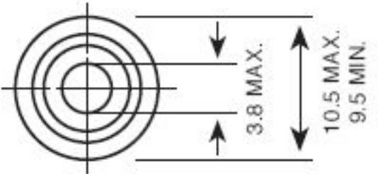
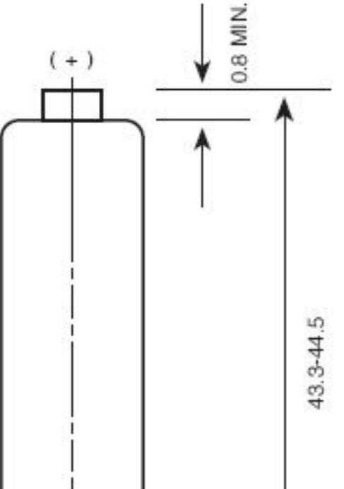
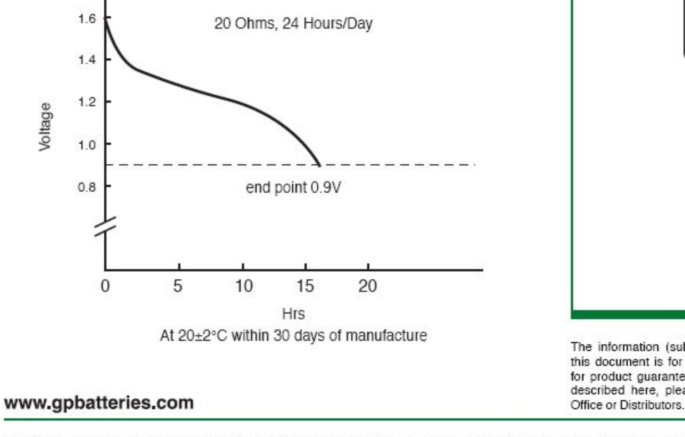

## DATA SHEET

| Description        | : Mercury Free Alkaline Manganese Battery, AAA Size                                                                                          |  |  |
|--------------------|-------------------------------------------------------------------------------------------------------------------------------------------------|--|--|
| Chemical System    | : Alkaline Manganese                                                                                                                            |  |  |
| Nominal Voltage    | : 1.5 Volts                                                                                                                                     |  |  |
| Nominal Dimensions | : Ø10.5 mm x 44.5 mm                                                                                                                            |  |  |
| Terminals          | : Protruded positive(+) and flat negative(-) contacts                                                                                        |  |  |
| Jacket             | : Foil jacket                                                                                                                                   |  |  |
| Applications       | : All electronic devices, e.g. toys, photographic equipment, data banks, calculators, audio appliances, remote controls, paging machines. |  |  |
| Average Welght     | : 11.40                                                                                                                                         |  |  |

Cross References:

| GP  | SIF  | IEC      | Eveready Duracell Varta |             |  |
|-----|------|----------|-------------------------|-------------|--|
| 24A | LR03 | LR03 E92 |                         | MN2400 4003 |  |

## Typical Service Life:

| Discharge  | Discharge            | End Point | Service  |
|------------|----------------------|-----------|----------|
| Resistance | Condition            | Voltage   | Life     |
| 20 Ohms    | 24 Hrs/ Day 25.00 | 0.9V      | 17.2 Hrs |

Model No .: GP24A

Unit : mm The information (subject to change without prior notice) contained in this document is for reference only and should not be used as a basis for product guarantee or warranty. For applications other than those described here, please consult your nearest GP Sales and Marketing 51 1011 1056

( - )

Manufacturer reserves the right to alter or amend the design, model and specification without prior notice. Copyright@ GPI International Ltd. - All rights reserved

