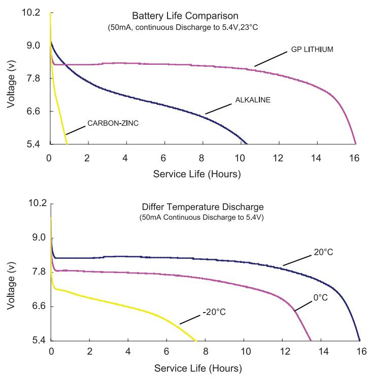
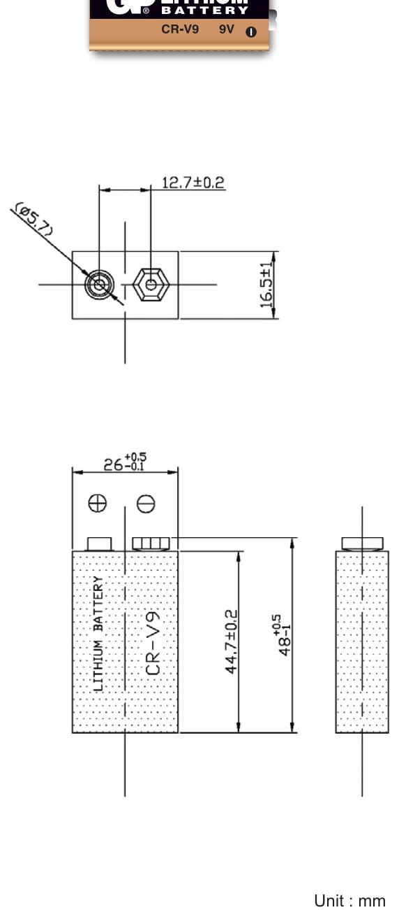

## NO MERCURY ADDED

| Description        | : Lithium Battery, 9V Size                                                                                                                                                                                                     |
|--------------------|--------------------------------------------------------------------------------------------------------------------------------------------------------------------------------------------------------------------------------|
| Chemical System    | : Lithium Manganese Dioxide                                                                                                                                                                                                    |
| Nominal Voltage    | : 9 Volts                                                                                                                                                                                                                      |
| Nominal Capacity   | : 800mAh @ 600Ω to 5.4V                                                                                                                                                                                                        |
| Nominal Dimensions | : 26 mm x 16.5 mm x 44.7 mm                                                                                                                                                                                                    |
| Terminals          | : Standard snap fastener stud(+) and socket(-)                                                                                                                                                                                 |
| Shelf life         | : up to 10 years                                                                                                                                                                                                               |
| Average Weight     | : App 34grams                                                                                                                                                                                                                  |
| Application        | : Smoke detectors, security devices, medical equipment, carbon monoxide alarms, explosion qas alarms, meters (qas/electric/water), metal detectors, wireless transmitters, electronic toll collection system, etc. |

Operating temperature : -40°C to 60°C

## Cross References:

| ANSI   | Ultralife |
|--------|-----------|
| 1604LC | U9VL      |

The information (subject to change without prior notice) contained in this document is for reference only and should not be used as a basis for product guarantee or warranty. For applications other than those described here, please consult your nearest GP Sales and Marketing Office or Distributors.

## www.gpbatteries.com

Manufacturer reserves the right to alter or amend the design, model and specification without prior notice. Copyright@ GPI International Ltd. - All rights reserved

## DATA SHEET

Model No.: