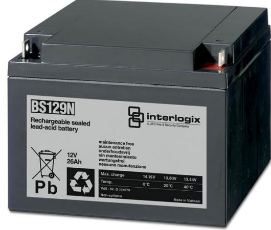

## Produktblad

# BS129N

Underhållsfri ackumulator 12 V, 26 Ah

### BS129N

Underhållsfri blyackumulator lämplig för kontinuerlig underhållsladdning, exempelvis inbrottlarms- och brandlarmscentraler.

#### Standardprestanda

- EUnderhållsfritt
- E Lång livslängd

- ETemperaturokänslig
- EUppladdningsbart
- ELäckagefri konstruktion

# BS129N

Underhållsfri ackumulator 12 V, 26 Ah

### Tekniska data

| Strömförsörjning      | 12 VDC            |
|-----------------------|-------------------|
| Kapacitet             | 26 Ah             |
| Max laddning vid +20° | 13,8 VDC          |
| Max laddningsström    | 7,8 A             |
| Max urladdning        | 130 A             |
| Resistans             | 10 mohm           |
| Temperatur            |                   |
| Laddning              | 0 till 40 °C      |
| Drift                 | -15 till +50 °C   |
| Lagring               | -15 till +40 °C   |
| Anslutningar          | MS skruv & mutter |
| Materiel              | ABS               |
| Vikt                  | 9,528 kg          |
| Dimension (BxHxD)     | 166x175x125 mm    |

Order data

Artikelnummer Beskrivning BS129N Underhållsfri ackumulator 12 V, 26 Ah