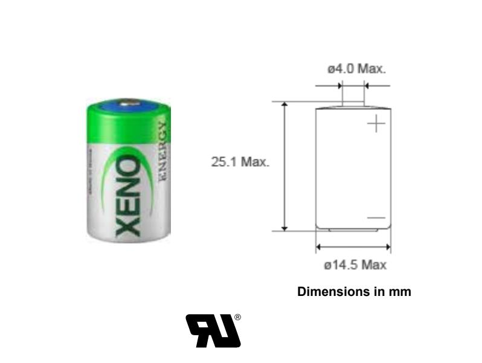
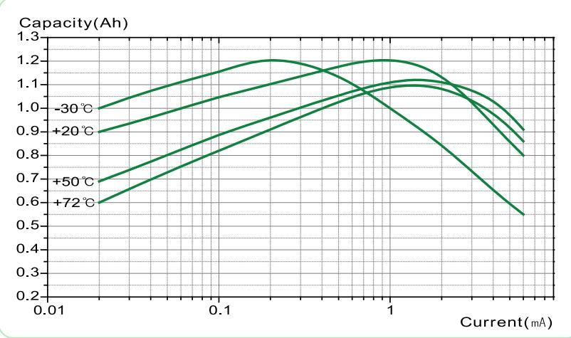
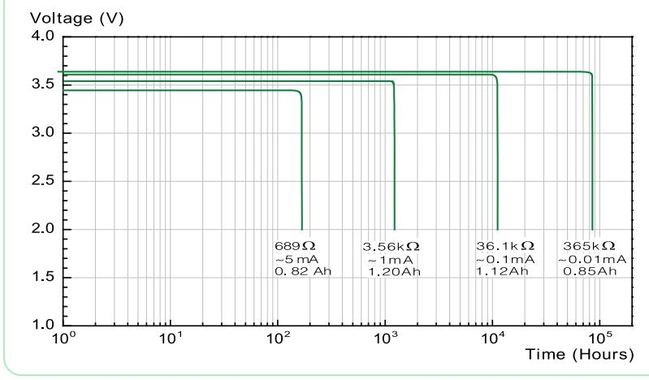
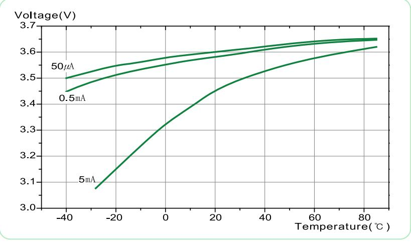

# **SPECIFICATIONS** (Typical values stored at 20 for one year)

| Nominal capacity (at 1mA/20 /68 /2.0V cut-off)                                  | 1.2Ah        |
|------------------------------------------------------------------------------------------|--------------|
| Nominal voltage                                                                          | 3.6V         |
| Max. recommended continuous current (Higher current can be available upon consulting) | 30mA         |
| Max. pulse current capability★                                                           | 60mA         |
| Operating temperature range                                                              | -55 ~+85     |
| Lithium metal content                                                                    | approx. 0.3g |
| Weight                                                                                   | 9g           |
| Volume                                                                                   | 4.3㎤         |
| UL Approval                                                                              | MH28122      |

#### **Max Pulse Capability**

Maximum Pulse capability reading over 3.0V at 60mA/0.1sec. every 2 min. at +20 , 10㎂ / ㎠ base current with fresh batteries. The pu lse capability can be different to the cell status, environment. For max. pulse coverage, capacitor support is recommended.

### **Available Terminal Type**

STD, T1, T2, T3, T3/R, T3EU, T3EU/R, AX, Wire, Connector, Case1, Case2

### **Storage Condition**

 Please store batteries at clean, cool (not over +30°C), dried (less than 30% RH) and ventilated condition

## **Discharge Characteristics at +20 Capacity versus Current**

## **Operating Voltage**

V-10A Any values in product catalogues are for informational purposes only. They can also differ from actual conditions of usage and not warranties of future performance.