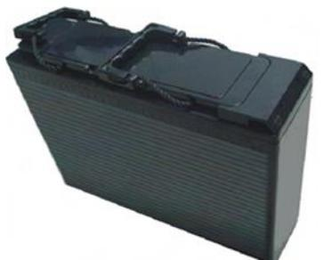
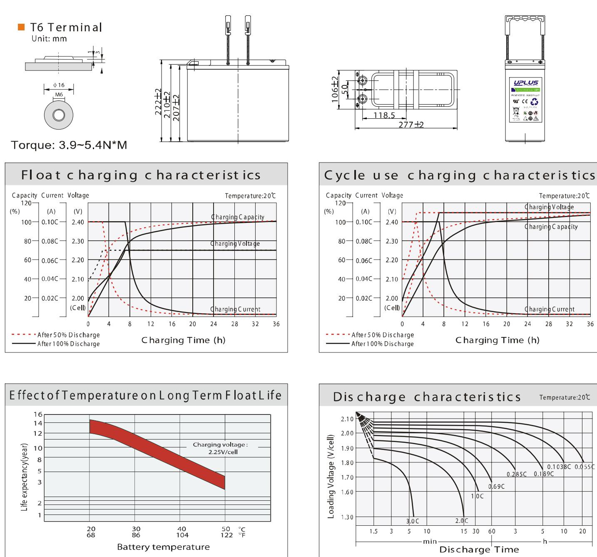
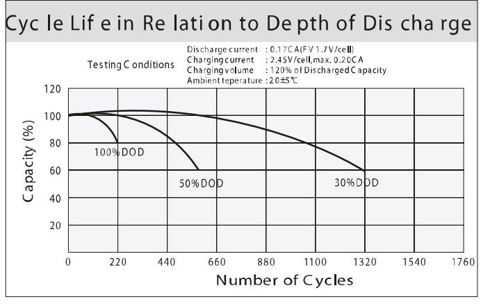
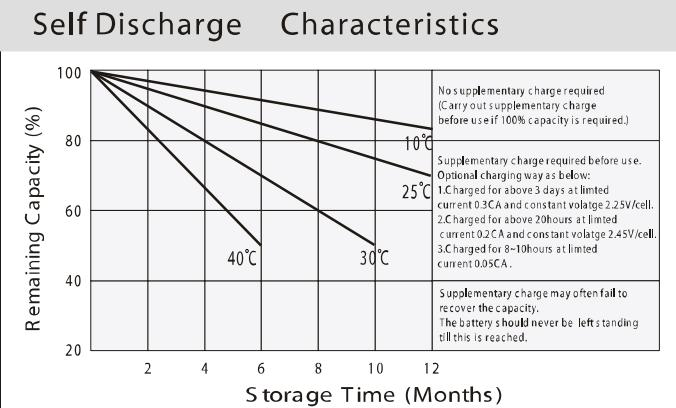

## US SERIES-Front Terminal US12-40FT (12V40AH)

## General Features

- ♦ Sealed and maintenance free operation.
- ◆ Non-Spillable construction design.
- ◆ ABS containers and covers(UL94HB, UL94V-0) optional.
- ◆ Safety valve installation for explosion proof.
- ◆ High quality and high reliability.
- ♦ Exceptional deep discharge recovery performance.
- � Low self discharge characteristic.
- ♦ Flexibility design for multiple install positions.

| Battery Type          | Valve-Regulated,Absorbed Glass Mat(AGM) Technology |                 |                   |                                                    |                        |                   |  |  |  |  |
|-----------------------|----------------------------------------------------------|-----------------|-------------------|----------------------------------------------------|------------------------|-------------------|--|--|--|--|
| Nomial Voltage        | 12V                                                      |                 |                   |                                                    |                        |                   |  |  |  |  |
| Capacity( 20 °C)      | 20HR(2.13A,1.8V/cell)                                    |                 | 10HR(4.03A,1.80V) | 5HR(7.26A,1.75V)                                   |                        | 1HR(26.3A,1.60V)  |  |  |  |  |
|                       | 42.6AH                                                   |                 | 40.3AH            | 36.3AH                                             |                        | 26.3AH            |  |  |  |  |
|                       | Length                                                   | Height Width |                   |                                                    | Total Height           |                   |  |  |  |  |
| Dimensions            | 277mm(10.91inches)                                       |                 | 106mm(4.17inches) | 222mm(8.74inches)                                  |                        | 222mm(8.74inches) |  |  |  |  |
| Approx Weight         | Approx 15.5 kg (34.2lbs)                                 |                 |                   |                                                    |                        |                   |  |  |  |  |
| Internal Resistance   | Full Charged at 200C : Approx 9.0m   Ù                   |                 |                   |                                                    |                        |                   |  |  |  |  |
| Self Discharge        | 3% of capacity declined per month at 20°C                |                 |                   |                                                    |                        |                   |  |  |  |  |
| Capacity affected by  | 40°C                                                     |                 | 25°C              | 0°C                                                |                        | -15°C             |  |  |  |  |
| Temperature (10HR)    | 103%                                                     |                 | 100% 86%       |                                                    |                        | 65%               |  |  |  |  |
|                       | Cycle use                                                |                 |                   | Float use                                          |                        |                   |  |  |  |  |
| Charging Voltage (V)  | 14.4V~15.0V at 20 °C.T emp. Coefficient -30mV/ °C        |                 |                   | 13.5V~13.8V at 20 °C.Temp. Coefficient (-20mV/ °C) |                        |                   |  |  |  |  |
| Current               | Max. Discharge Current                                   |                 |                   | Initial Charging Current                           |                        |                   |  |  |  |  |
|                       | 440A                                                     |                 |                   | Less than 12.0A                                    |                        |                   |  |  |  |  |
|                       | Discharge                                                |                 |                   | Charging                                           | Storage                |                   |  |  |  |  |
| Operating T emp.Range | -15~50°C (5 ~122°F)                                      |                 |                   | 0~40°C (32 ~ 104°F)                                | -15 ~40°C (5 ~ 104 °F) |                   |  |  |  |  |

| Co ns tant C urrent Dis charge (A mperes) at 20 ℃ (68°F ) |        |        |        |        |        |      |      |      |      |      |      |      |      |      |
|-----------------------------------------------------------|--------|--------|--------|--------|--------|------|------|------|------|------|------|------|------|------|
| F.V/Tim e                                                 | 10 min | 15 min | 20 min | 30 min | 45 min | 1 h  | 2h   | 3h   | 4h   | 5h   | 6h   | 8h   | 10h  | 20h  |
| 1.8 5V /cell                                              | 66.1   | 55.1   | 47.3   | 37.1   | 28.8   | 23.4 | 14.1 | 10.1 | 8.14 | 6.74 | 5.93 | 4.62 | 3.85 | 2.04 |
| 1.8 0V /cell                                              | 74.9   | 61.4   | 52.3   | 40.6   | 30.9   | 24.9 | 14.9 | 10.8 | 8.57 | 7.09 | 6.23 | 4.85 | 4.03 | 2.13 |
| 1.7 5V /cell                                              | 82.2   | 66.4   | 55.8   | 42.6   | 32.1   | 25.8 | 15.1 | 11.0 | 8.79 | 7.26 | 6.32 | 4.91 | 4.07 | 2.17 |
| 1.7 0V /cell                                              | 88.0   | 70.0   | 58.1   | 43.9   | 32.9   | 26.2 | 15.4 | 11.1 | 8.84 | 7.30 | 6.40 | 4.98 | 4.11 | 2.18 |
| 1.6 7V /cell                                              | 91.0   | 71.7   | 59.3   | 44.4   | 33.0   | 26.3 | 15.4 | 11.1 | 8.91 | 7.37 | 6.48 | 5.04 | 4.15 | 2.19 |
| 1.6 0V /cell ।                                            | 95.7   | 74.5   | 61.9   | 45.6   | 33.9   | 27.0 | 15.7 | 11.4 | 9.10 | 7.56 | 6.60 | 5.16 | 4.23 | 2.20 |

| Co ns tant P ower Dis ch ar ge (Watts) a t 2 0 ℃ (68 F ) |        |        |        |        |        |      |      |      |      |      |      |      |      |      |
|----------------------------------------------------------|--------|--------|--------|--------|--------|------|------|------|------|------|------|------|------|------|
| F.V/ Tim e                                               | 10 min | 15 min | 20 min | 30 min | 45 min | 1 h  | 2h   | 3h   | 4h   | 5h   | 6h   | 8h   | 10h  | 20h  |
| 1.8 5V /cell                                             | 123.4  | 103.9  | 90.1   | 71.4   | 55.8   | 45.6 | 27.6 | 20.0 | 16.1 | 13.4 | 11.8 | 9.21 | 7.70 | 4.08 |
| 1.8 0V /cell                                             | 138.3  | 114.3  | 98.2   | 77.0   | 59.6   | 48.4 | 29.0 | 21.1 | 16.8 | 14.0 | 12.3 | 9.64 | 8.04 | 4.26 |
| 1.7 5V /cell                                             | 149.3  | 122.1  | 103.8  | 80.2   | 61.3   | 49.9 | 29.4 | 21.4 | 17.2 | 14.3 | 12.5 | 9.74 | 8.12 | 4.32 |
| 1.7 0V /cell                                             | 156.2  | 126.9  | 107.2  | 82.1   | 62.5   | 50.4 | 29.8 | 21.6 | 17.3 | 14.3 | 12.6 | 9.87 | 8.19 | 4.35 |
| 1.6 7V /cell                                             | 161.0  | 129.5  | 109.0  | 83.0   | 62.5   | 50.5 | 29.8 | 21.6 | 17.4 | 14.4 | 12.7 | 9.98 | 8.26 | 4.37 |
| 1.6 0V /cell                                             | 164.5  | 131.8  | 112.3  | 84.0   | 63.5   | 51.3 | 30.0 | 21.9 | 17.7 | 14.7 | 12.9 | 10.2 | 8.40 | 4.38 |

## Dimensi ons

