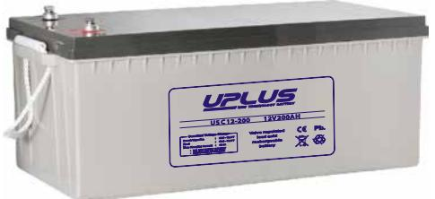
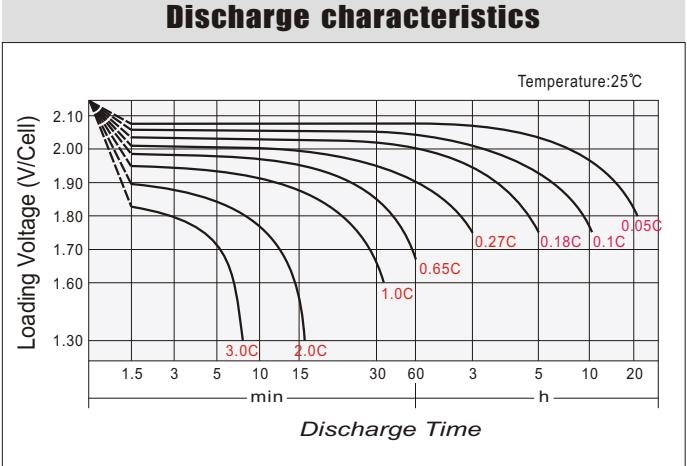
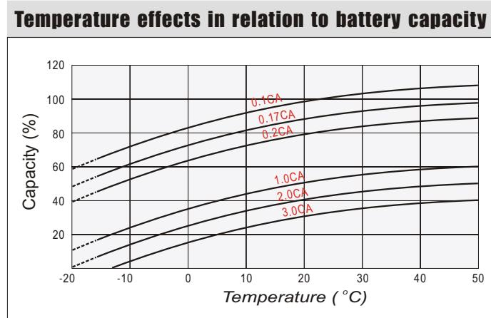
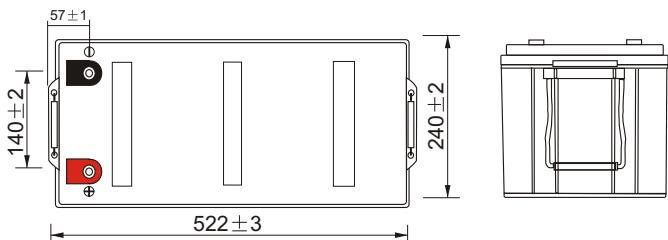
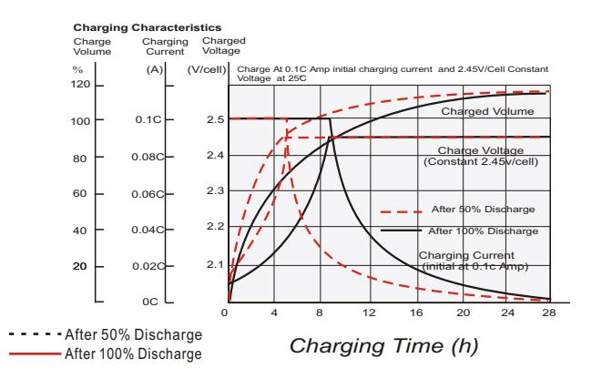
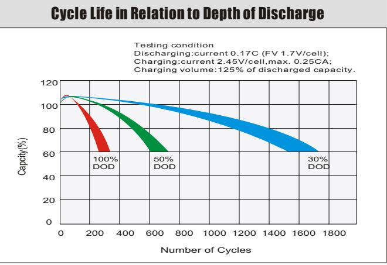
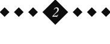

# USC12-200 (12V200AH) USC SERIES-Deep Cycle

## **General Features**

- Using oxygen recombination technology: maintenance-free
- Special grid alloy: less gassing, less self-discharging
- For longer cycle life: special paste formula, over dimensioned negative plate, optimised manufacturing process , additives for deep discharge
- Thermal management system (optional)
- Special anti-vibration design (optional)
- High quality AGM separator: extend cycle life and prevent micro short circuit
- ABS material: increase the strength of battery container. (Flame-retardant ABS is optional)

| Battery Type          | Valve-Regulated,Absorbed Glass Mat(AGM) Technology |           |                       |                                  |                             |                       |  |  |  |  |  |
|-----------------------|----------------------------------------------------------|-----------|-----------------------|----------------------------------|-----------------------------|-----------------------|--|--|--|--|--|
| Nomial Voltage        | 12V                                                      |           |                       |                                  |                             |                       |  |  |  |  |  |
| 0                     | 20HR(10.1A,1.8V/cell)                                    |           | 10HR(19.4A,1.8V/cell) | 5HR(36.0A,1.75V/cell)            |                             | 1HR(146.1A,1.6V/cell) |  |  |  |  |  |
| Capacity( 20 C)    | 201.2AH                                                  |           | 194.0AH               | 180.2AH                          |                             | 146.1AH               |  |  |  |  |  |
|                       | Length                                                   |           | Length                | Length                           |                             | Length                |  |  |  |  |  |
| Dimensions            | 522mm(20.55inches)                                       |           | 240mm(9.45inches)     | 218mm(8.58inches)                |                             | 224mm(8.81inches)     |  |  |  |  |  |
| Approx Weight         | Approx 62.5 kg (137.8lbs)                                |           |                       |                                  |                             |                       |  |  |  |  |  |
| Internal Resistance   | 0 Full Charged at 20 C : Approx 2.7 m                 |           |                       |                                  |                             |                       |  |  |  |  |  |
| Self Discharge        | 0 3% of capacity declined per month at 20 C           |           |                       |                                  |                             |                       |  |  |  |  |  |
| Capacity d by      | 0 40 C                                                |           | 0 25 C             | 0 0 C                            |                             | 0 -15 C            |  |  |  |  |  |
| Temperature(10HR)     | 103%                                                     |           | 100%                  | 86%                              |                             | 65%                   |  |  |  |  |  |
|                       |                                                          | Cycle use |                       | Float use                        |                             |                       |  |  |  |  |  |
| Charging Voltage (V)  | 0 14.4V~15.0V at 20 C. T emp.                         |           | 0 t -30mV/ C       | 0 13.5V~13.8V at 20 C. T emp. |                             | 0 t -20mV/ C       |  |  |  |  |  |
|                       | Max. Discharge Current(5s)                               |           |                       | Initial Charging Current         |                             |                       |  |  |  |  |  |
| Current               | 2000A                                                    |           |                       | Less than 60A                    |                             |                       |  |  |  |  |  |
|                       | Discharge                                                |           | Charging              |                                  | Storage                     |                       |  |  |  |  |  |
| Operating T emp.Range | 0 0 -15~50 C(5~122 F)                              |           | 0 0~40 C(32~104 F) | 0                                | 0 0 -15~40 C(5~104 F) |                       |  |  |  |  |  |

#### **0 0 Co ns ta nt C ur re nt D is ch ar ge (A m pe re s) a t 2 0 C 6 8 F )**

| F.V/ Tim e   | 10 m in | 15 m in | 20 m in | 30 m in | 45 m in | 1h    | 2h   | 3h   | 4h   | 5h   | 6h   | 8h   | 10 h | 20 h |
|--------------|---------|---------|---------|---------|---------|-------|------|------|------|------|------|------|------|------|
| 1.8 5V /cell | 274.7   | 256.9   | 237.1   | 193.5   | 150.0   | 122.4 | 72.6 | 52.8 | 41.5 | 34.3 | 29.8 | 23.1 | 18.9 | 9.85 |
| 1.8 0V /cell | 329.5   | 293.4   | 262.2   | 211.9   | 160.9   | 130.2 | 76.0 | 54.6 | 42.9 | 35.5 | 30.7 | 23.8 | 19.4 | 10.1 |
| 1.7 5V /cell | 364.8   | 319.2   | 279.3   | 221.3   | 166.2   | 133.4 | 77.8 | 55.7 | 43.7 | 36.0 | 31.2 | 24.1 | 19.6 | 10.2 |
| 1.7 0V /cell | 396.7   | 342.0   | 294.7   | 232.1   | 172.3   | 137.4 | 79.8 | 57.0 | 44.5 | 36.9 | 31.8 | 24.5 | 20.0 | 10.3 |
| 1.6 5V /cell | 425.2   | 361.8   | 311.2   | 240.5   | 176.8   | 141.4 | 81.9 | 58.6 | 45.7 | 37.9 | 32.5 | 25.0 | 20.3 | 10.5 |
| 1.6 0V /cell | 460.6   | 381.5   | 325.5   | 249.3   | 182.4   | 146.1 | 83.6 | 59.5 | 46.6 | 38.4 | 32.9 | 25.3 | 20.6 | 10.7 |

#### **0 0 Co ns ta nt P ow er D is ch ar ge (W at ts ) a t 2 0 C (6 8 F )**

| F.V/ Tim e   | 10 m in | 15 m in | 20 m in | 30 m in | 45 m in | 1h    | 2h    | 3h    | 4h   | 5h   | 6h   | 8h   | 10 h | 20 h |
|--------------|---------|---------|---------|---------|---------|-------|-------|-------|------|------|------|------|------|------|
| 1.8 5V /cell | 514.9   | 485.0   | 450.5   | 370.7   | 289.4   | 237.6 | 141.8 | 103.6 | 81.8 | 68.0 | 59.3 | 46.3 | 38.0 | 20.0 |
| 1.8 0V /cell | 607.7   | 547.5   | 494.3   | 403.5   | 308.9   | 251.6 | 147.9 | 106.7 | 84.2 | 70.0 | 60.9 | 47.5 | 38.9 | 20.3 |
| 1.7 5V /cell | 664.5   | 588.9   | 522.0   | 418.2   | 317.1   | 256.5 | 150.6 | 108.5 | 85.5 | 70.9 | 61.6 | 47.8 | 39.2 | 20.5 |
| 1.7 0V /cell | 712.4   | 623.7   | 545.9   | 435.7   | 327.1   | 262.9 | 153.8 | 110.5 | 86.7 | 72.1 | 62.6 | 48.6 | 39.8 | 20.7 |
| 1.6 5V /cell | 755.2   | 655.0   | 573.3   | 449.1   | 334.2   | 269.7 | 157.5 | 113.2 | 88.8 | 74.0 | 63.9 | 49.4 | 40.4 | 20.9 |
| 1.6 0V /cell | 803.9   | 682.3   | 593.4   | 462.4   | 342.9   | 277.8 | 160.1 | 114.7 | 90.2 | 74.8 | 64.5 | 49.9 | 40.9 | 21.3 |

## Dimensions

#### **T11 Terminal** Unit: mm [inches] 20 [0.787] M8 [0.315] 7 [0.276] 224 2 218 2

Storage Time(Months) Remaining Capacity(%) 8 10 12 0 4 6 60 80 100 0 2 20 40 0 40 C 0 25 C 0 30 C 0 10 C **A B C A B C**

### Cycle use charging characteristics

#### Self Discharge Characteristics

No supplementary charge required (Carry out supplementary charge before use if 100% capacity is required.)

Supplementary charge required before use.Optional charging way as below:

1.Charged for above 3 days at limted current 0.25CA and constant volatge 2.25V/cell. 2.Charged for above 20hours at limted current 0.25CA and constant volatge 2.45V/cell. 3.Charged for 8~10hours at limted current 0.05CA .

Supplementary charge may often fail to recover the capacity. The battery should never be left standing till this is reached.

