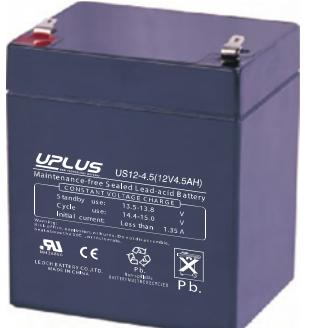
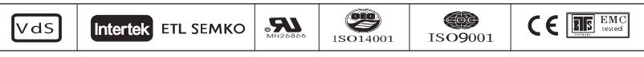
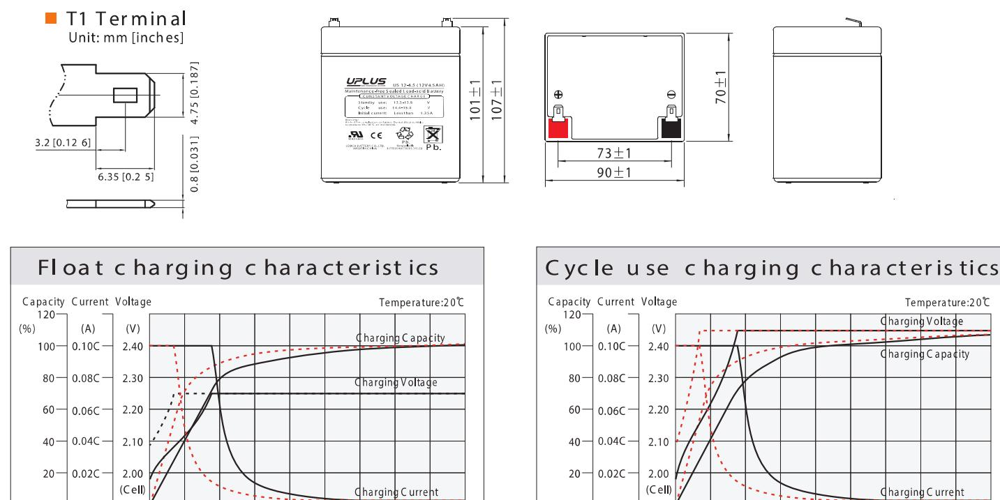
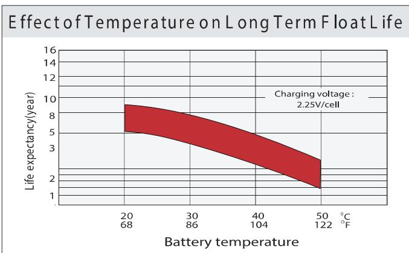
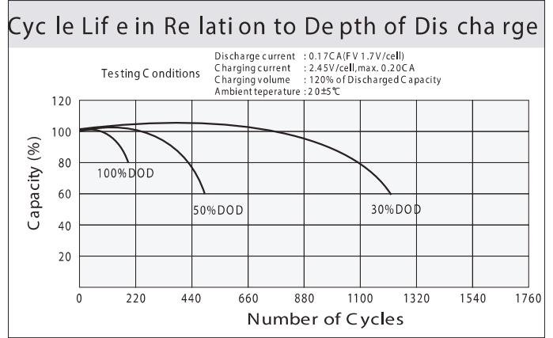
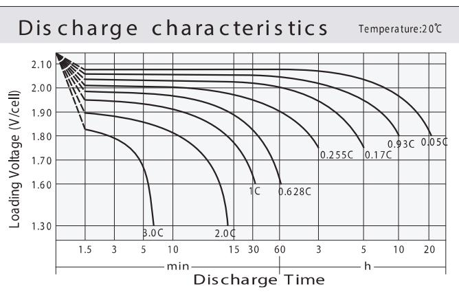
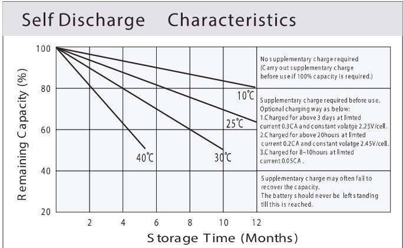

## US SERIE S US12-4.5 (12V4.5A

## General Features

- ♦ Sealed and maintenance free operation.
- ◆ Non-Spillable construction design.
- ◆ ABS containers and covers(UL94HB, UL94V-0) optional.
- ◆ Safety valve installation for explosion proof.
- ◆ High quality and high reliability.
- ◆ Exceptional deep discharge recovery performance.
- ◆ Low self discharge characteristic.
- ♦ Flexibility design for multiple install positions.

| Battery Type          | Glass Mat(AGM) Valve-Regulated, Absorbed Technology |                    |                  |                                                    |                    |                  |  |  |  |  |  |
|-----------------------|-----------------------------------------------------------|--------------------|------------------|----------------------------------------------------|--------------------|------------------|--|--|--|--|--|
| Nomial Voltage        | 12V                                                       |                    |                  |                                                    |                    |                  |  |  |  |  |  |
| Capacity( 20 °C)      | 20HR(0.218A,1.8V/cell)                                    | 10HR(0.406A,1.80V) |                  | 5HR(0.734A,1.75V)                                  |                    | 1HR(2.68A,1.60V) |  |  |  |  |  |
|                       | 4.36AH                                                    | 4.06AH             |                  | 3.67AH                                             |                    | 2.68AH           |  |  |  |  |  |
| Dimensions            | Length                                                    | Width              |                  | Height                                             |                    | Total Height     |  |  |  |  |  |
|                       | 90mm(3.54inches)                                          |                    | 70mm(2.76inches) | 101mm(3.98inches)                                  |                    | 107mm(4.21inch)  |  |  |  |  |  |
| Approx Weight         | Approx 1.60 kg (3.53lbs)                                  |                    |                  |                                                    |                    |                  |  |  |  |  |  |
| Internal Resistance   | Full Charged at 20°C : Approx 40m   Ü                     |                    |                  |                                                    |                    |                  |  |  |  |  |  |
| Self Discharge        | 3%  of capacity declined per month at 20 °C            |                    |                  |                                                    |                    |                  |  |  |  |  |  |
| Capacity affected by  | 40°C                                                      |                    |                  | 0°C                                                |                    | -15°C            |  |  |  |  |  |
| Temperature (10HR)    | 103%                                                      |                    | 100%             | 86%                                                |                    | 65%              |  |  |  |  |  |
|                       | Cycle use                                                 |                    |                  | Float use                                          |                    |                  |  |  |  |  |  |
| Charging Voltage (V)  | 14.4V~15.0V at 20 °C.T emp. Coefficient -30mV/ °C         |                    |                  | 13.5V~13.8V at 20 °C.Temp. Coefficient (-20mV/ °C) |                    |                  |  |  |  |  |  |
| Current               | Max. Discharge Current                                    |                    |                  | Initial Charging Current                           |                    |                  |  |  |  |  |  |
|                       | 67.5A                                                     |                    |                  | Less than 1.35A                                    |                    |                  |  |  |  |  |  |
|                       | Discharge                                                 |                    |                  | Charging                                           |                    | Storage          |  |  |  |  |  |
| Operating T emp.Range | -15 ~ 50 °C (5 ~ 122 °F)                                  |                    |                  | 0~40°C (32 ~ 104°F)                                | -15~40°C (5~104°F) |                  |  |  |  |  |  |

## Co ns tant C urrent Dis charge (A mperes) a t 2 0 °C (6 8°F )

| F.V/Tim e    | 5min | 10 min | 15 min | 20 min | 30 min | 45 min | 1h   | 2h   | 3h   | 4h    | 5h    | 6h    | 8h    | 10h   | 20h   |
|--------------|------|--------|--------|--------|--------|--------|------|------|------|-------|-------|-------|-------|-------|-------|
| 1.8 5V /cell | 8.14 | 6.25   | 5.18   | 4.48   | 3.46   | 2.55   | 2.15 | 1.28 | 1.01 | 0.817 | 0.667 | 0.584 | 0.471 | 0.394 | 0.216 |
| 1.8 0V /cell | 10.9 | 7.99   | 6.26   | 5.29   | 4.09   | 2.97   | 2.41 | 1.40 | 1.08 | 0.873 | 0.715 | 0.627 | 0.500 | 0.406 | 0.218 |
| 1.7 5V /cell | 12.3 | 8.78   | 6.83   | 5.69   | 4.24   | 3.08   | 2.52 | 1.45 | 1.10 | 0.892 | 0.734 | 0.644 | 0.509 | 0.417 | 0.220 |
| 1.7 0V /ce   | 13.6 | 9.57   | 7.30   | 5.98   | 4.41   | 3.20   | 2.60 | 1.49 | 1.13 | 0.916 | 0.753 | 0.657 | 0.516 | 0.425 | 0.224 |
| 1.6 5V /cell | 15.0 | 10.3   | 7.76   | 6.36   | 4.66   | 3.28   | 2.66 | 1.51 | 1.18 | 0.947 | 0.774 | 0.672 | 0.524 | 0.434 | 0.227 |
| 1.6 0V /cell | 16.5 | 11.2   | 8.30   | 6.77   | 4.92   | 3.42   | 2.68 | 1.58 | 1.22 | 0.977 | 0.799 | 0.686 | 0.529 | 0.439 | 0.229 |

| Cons tant Power Dis charge (W atts ) at 20 °C (6 8 ° ) |      |        |         |        |        |        |      |      |      |      |      |      |      |       |       |
|--------------------------------------------------------|------|--------|---------|--------|--------|--------|------|------|------|------|------|------|------|-------|-------|
| F.V/Tim e                                              | 5min | 10 min | 15 m in | 20 min | 30 min | 45 min | 1 h  | 2h   | 3h   | 4h   | 5h   | 6h   | 8h   | 10 h  | 20h   |
| 1.8 5V /cell                                           | 14.9 | 11.5   | 9.7     | 8.4    | 6.60   | 4.90   | 4.15 | 2.50 | 1.96 | 1.60 | 1.31 | 1.15 | 0.93 | 0.779 | 0.428 |
| 1.8 0V /cell                                           | 19.8 | 14.6   | 11.5    | 9.8    | 7.7    | 5.66   | 4.62 | 2.70 | 2.10 | 1.70 | 1.40 | 1.23 | 0.98 | 0.802 | 0.432 |
| 1.7 5V /cell                                           | 21.8 | 15.8   | 12.4    | 10.5   | 7.9    | 5.82   | 4.81 | 2.79 | 2.13 | 1.73 | 1.43 | 1.26 | 1.00 | 0.823 | 0.435 |
| 1.7 0V /cell                                           | 23.4 | 16.8   | 13.1    | 10.9   | 8.2    | 6.02   | 4.95 | 2.86 | 2.18 | 1.77 | 1.46 | 1.28 | 1.01 | 0.838 | 0.443 |
| 1.6 5V /ce                                             | 25.4 | 18.0   | 13.8    | 11.5   | 8.5    | 6.12   | 5.03 | 2.88 | 2.27 | 1.83 | 1.50 | 1.31 | 1.03 | 0.854 | 0.448 |
| 1.6 0V /cell                                           | 27.4 | 19.1   | 14.5    | 12.1   | 9.0    | 6.34   | 5.05 | 2.99 | 2.32 | 1.88 | 1.54 | 1.33 | 1.03 | 0.862 | 0.450 |

## Dimen si ons

12 16 20 24 28 32 36

Charging Time (h)

4

- After 50% Discharge

After 100% Discharge

12 16 20 24 28 32 36

Charging Time (h)

8

- - After 50% Discharge

After 100% Discharge

