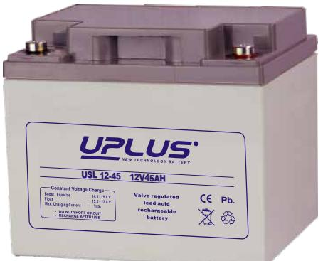
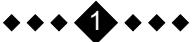
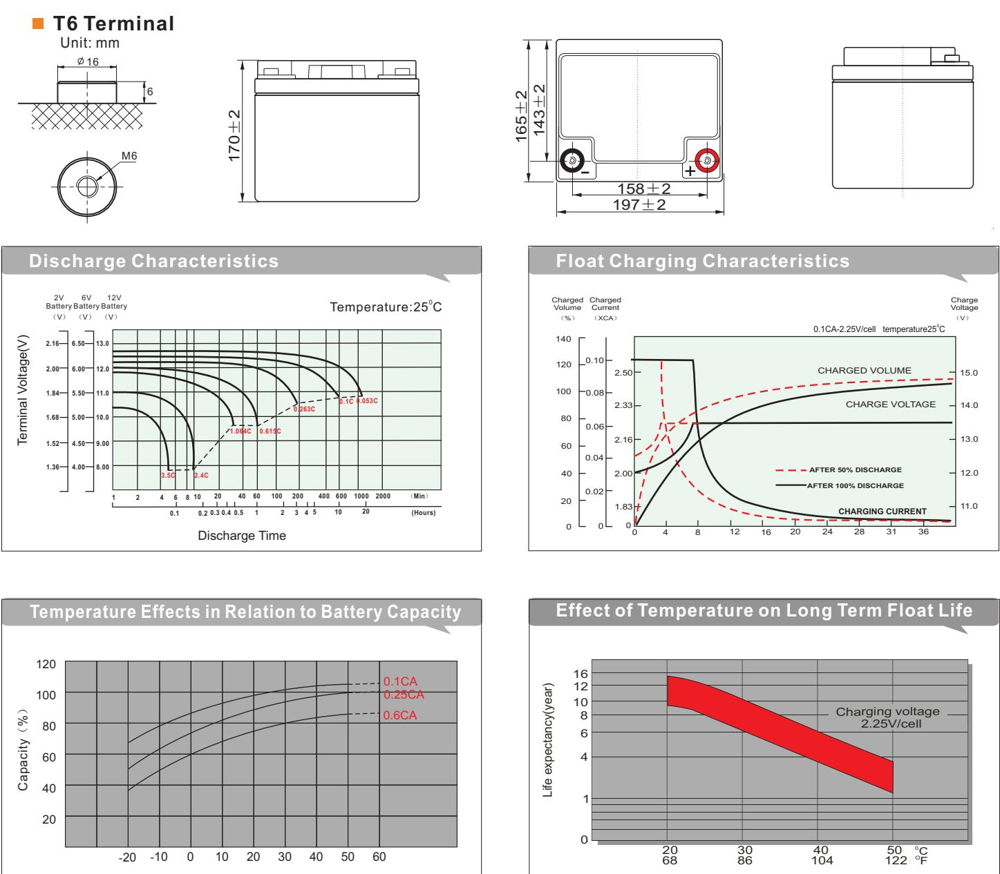
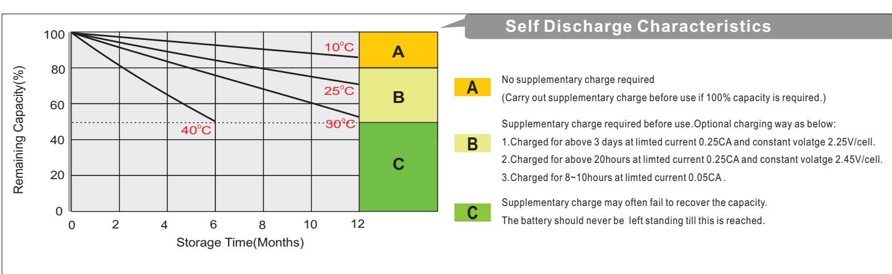

## USL12-45 (12V45AH) **USL SERIES**

## **General Features**

- *UPS and EPS*
- *Emergency light*
- *Railway signal and aircraft signal system*
- *Marine and power stations*
- *Alarm and security system*
- *Electronic apparatus and equipment*
- *Communication power supply,*

*DC power supply*

| VdS |  |  |  | 9 | tested Germ any |
|-----|--|--|--|---|--------------------|
|-----|--|--|--|---|--------------------|

| Battery Type         | Valve-Regulated,Absorbed Glass Mat(AGM) Technology   |  |                    |                                                            |                                    |                   |  |  |  |  |
|----------------------|------------------------------------------------------|--|--------------------|------------------------------------------------------------|------------------------------------|-------------------|--|--|--|--|
| Nomial Voltage       | 12V                                                  |  |                    |                                                            |                                    |                   |  |  |  |  |
|                      | 20HR(2.25A,1.8V/cell)                                |  | 10HR(4.20A,1.80V)  | 5HR(7.31A,1.75V)                                           |                                    | 1HR(26.0A,1.60V)  |  |  |  |  |
| 0 25 C) Capacity( | 45.0AH                                               |  | 42.0AH             | 36.55AH                                                    |                                    | 26.0AH            |  |  |  |  |
|                      | Length                                               |  | Width              | Height                                                     |                                    | Total Height      |  |  |  |  |
| Dimensions           | 197mm(7.76inches)                                    |  | 165mm(6.50inches)  | 170mm(6.69inches)                                          |                                    | 170mm(6.69inches) |  |  |  |  |
| Approx Weight        | Approx 14.5 kg (31.97lbs)                            |  |                    |                                                            |                                    |                   |  |  |  |  |
| Internal Resistance  | 0 Full Charged at 25 C : Approx 9mΩ            |  |                    |                                                            |                                    |                   |  |  |  |  |
| Self Discharge       | 0 3% of capacity declined per month at 25 C    |  |                    |                                                            |                                    |                   |  |  |  |  |
| Capacity affected by | o 40 C                                            |  | 0 25 C          | 0 0 C                                                   |                                    | 0 -15 C        |  |  |  |  |
| Temperature(20HR)    | 103%                                                 |  | 100%               | 86%                                                        |                                    | 65%               |  |  |  |  |
|                      | Cycle use                                            |  |                    | Float use                                                  |                                    |                   |  |  |  |  |
| Charging Voltage (V) | 0 14.4V~15.0V at 25 C. Temp. Coefficient -30mV/ C |  | 0                  | 0 0 13.5V~13.8V at 25 C.Temp. Coefficient (-20mV/ C) |                                    |                   |  |  |  |  |
|                      | Max. Discharge Current                               |  |                    | Initial Charging Current                                   |                                    |                   |  |  |  |  |
| Current              | 540A                                                 |  |                    | Less than 13.5A                                            |                                    |                   |  |  |  |  |
|                      | Discharge                                            |  |                    | Charging                                                   | Storage                            |                   |  |  |  |  |
| Operating Temp.Range | 0 0 -15 50 C (5 122 F)                   |  | 0 0 40 C (32 | 0 104 F)                                                | 0 0 -15 40 C (5 104 F) |                   |  |  |  |  |

| 0 0 Constant Current Discharge (Amperes) at 25 C (77 F ) |       |       |       |       |       |      |      |      |      |      |      |      |      |      |
|----------------------------------------------------------------|-------|-------|-------|-------|-------|------|------|------|------|------|------|------|------|------|
| F.V/Time                                                       | 10min | 15min | 20min | 30min | 45min | 1h   | 2h   | 3h   | 4h   | 5h   | 6h   | 8h   | 10h  | 20h  |
| 1.85V/cell                                                     | 49.1  | 41.3  | 36.7  | 30.4  | 23.5  | 20.1 | 13.0 | 9.77 | 8.01 | 6.74 | 5.90 | 4.73 | 4.07 | 2.17 |
| 1.80V/cell                                                     | 56.2  | 46.4  | 40.5  | 33.0  | 25.3  | 21.2 | 14.0 | 10.5 | 8.51 | 7.14 | 6.25 | 4.98 | 4.20 | 2.25 |
| 1.75V/cell                                                     | 63.9  | 52.3  | 44.8  | 35.9  | 27.6  | 23.1 | 14.5 | 10.9 | 8.80 | 7.31 | 6.45 | 5.15 | 4.31 | 2.30 |
| 1.70V/cell                                                     | 72.1  | 58.0  | 49.5  | 39.2  | 29.7  | 24.4 | 15.3 | 11.5 | 9.20 | 7.73 | 6.76 | 5.37 | 4.48 | 2.36 |
| 1.65V/cell                                                     | 77.5  | 62.1  | 52.6  | 41.4  | 31.5  | 25.3 | 15.9 | 12.0 | 9.56 | 7.97 | 6.99 | 5.55 | 4.60 | 2.44 |
| 1.60V/cell                                                     | 85.2  | 68.1  | 57.1  | 44.1  | 32.7  | 26.0 | 16.3 | 12.3 | 9.77 | 8.17 | 7.14 | 5.64 | 4.70 | 2.48 |

| 0 0 Constant Power Discharge (Watts/cell ) at 25 C (77 F ) |       |       |       |       |       |      |      |      |      |      |      |      |      |      |
|---------------------------------------------------------------------|-------|-------|-------|-------|-------|------|------|------|------|------|------|------|------|------|
| F.V/Time                                                            | 10min | 15min | 20min | 30min | 45min | 1h   | 2h   | 3h   | 4h   | 5h   | 6h   | 8h   | 10h  | 20h  |
| 1.85V/cell                                                          | 91.8  | 77.9  | 69.8  | 58.6  | 45.6  | 39.1 | 25.5 | 19.2 | 15.8 | 13.3 | 11.7 | 9.44 | 8.14 | 4.34 |
| 1.80V/cell                                                          | 103.8 | 86.4  | 76.1  | 62.6  | 48.8  | 41.1 | 27.2 | 20.6 | 16.7 | 14.1 | 12.4 | 9.91 | 8.38 | 4.49 |
| 1.75V/cell                                                          | 116.0 | 96.2  | 83.3  | 67.5  | 52.7  | 44.6 | 28.2 | 21.3 | 17.2 | 14.4 | 12.7 | 10.2 | 8.60 | 4.60 |
| 1.70V/cell                                                          | 128.1 | 105.2 | 91.3  | 73.3  | 56.6  | 47.0 | 29.7 | 22.4 | 18.0 | 15.2 | 13.3 | 10.6 | 8.92 | 4.71 |
| 1.65V/cell                                                          | 136.3 | 111.8 | 96.4  | 76.7  | 59.3  | 48.3 | 30.6 | 23.2 | 18.6 | 15.6 | 13.7 | 11.0 | 9.16 | 4.85 |
| 1.60V/cell                                                          | 146.5 | 120.4 | 103.6 | 81.3  | 61.3  | 49.5 | 31.2 | 23.7 | 19.0 | 15.9 | 14.0 | 11.1 | 9.33 | 4.92 |

## **Dimensions**

Battery temperature

0 Temperature( C)

*2*