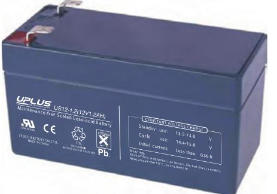
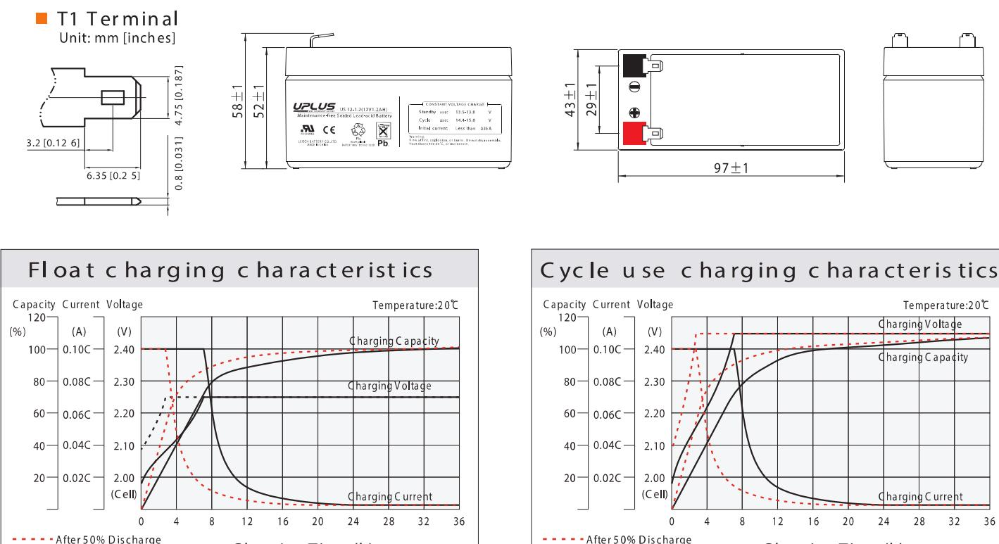
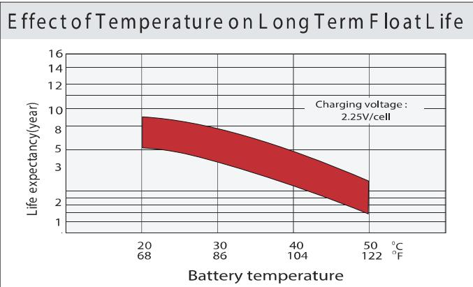
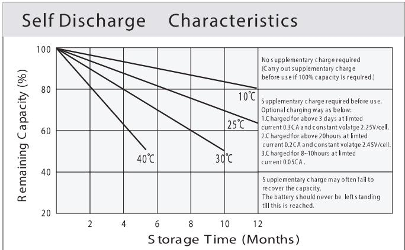

## US SERIES US 12-1.2 (12V1.2AH

## General Features

- ♦ Sealed and maintenance free operation.
- ◆ Non-Spillable construction design.
- ◆ ABS containers and covers(UL94HB, UL94V-0) optional.
- ◆ Safety valve installation for explosion proof.
- ◆ High quality and high reliability.
- ◆ Exceptional deep discharge recovery performance.
- ◆ Low self discharge characteristic.

♦ Flexibility design for multiple install positions.

| Vdsi Intertek ETL SEMKO | 1 2017 | 0 ISO14001 | 659 ISO9001 | C C   Fire EMC tested STATE THE COMES |
|----------------------------|--------|---------------|----------------|---------------------------------------------|
|----------------------------|--------|---------------|----------------|---------------------------------------------|

| Battery Type          | Glass Mat(AGM) Valve-Regulated,Absorbed Technology |                    |                     |                                                    |                        |                   |  |  |  |  |  |  |
|-----------------------|----------------------------------------------------------|--------------------|---------------------|----------------------------------------------------|------------------------|-------------------|--|--|--|--|--|--|
| Nomial Voltage        | 12V                                                      |                    |                     |                                                    |                        |                   |  |  |  |  |  |  |
|                       | 20HR(0.058A,1.8V/cell)                                   | 10HR(0.108A,1.80V) |                     | 5HR(0.196A,1.75V)                                  |                        | 1HR(0.716A,1.60V) |  |  |  |  |  |  |
| Capacity( 20 °C)      | 1.16AH                                                   |                    | 1.08AH              | 0.98AH                                             |                        | 0.716AH           |  |  |  |  |  |  |
|                       | Length                                                   |                    | Width               | Height                                             |                        | Total Height      |  |  |  |  |  |  |
| Dimensions            | 97mm(3.82inches)                                         |                    | 43mm(1.69inches)    | 52mm(2.04inches)                                   |                        | 58mm(2.28inches)  |  |  |  |  |  |  |
| Approx Weight         | Approx 0.57 kg (1.26lbs)                                 |                    |                     |                                                    |                        |                   |  |  |  |  |  |  |
| Internal Resistance   | Full Charged at 20℃: Approx 90m U                        |                    |                     |                                                    |                        |                   |  |  |  |  |  |  |
| Self Discharge        | 3%  of capacity declined per month at 20 C            |                    |                     |                                                    |                        |                   |  |  |  |  |  |  |
| Capacity affected by  | 40°C                                                     |                    | 25°C                | 0°C                                                |                        | -15°C             |  |  |  |  |  |  |
| Temperature (10HR)    | 103%                                                     |                    | 100%                | 86%                                                |                        | 65%               |  |  |  |  |  |  |
|                       | Cycle use                                                |                    |                     | Float use                                          |                        |                   |  |  |  |  |  |  |
| Charging Voltage (V)  | 14.4V~15.0V at 20 °C.T emp. Coefficient -30mV/ °C        |                    |                     | 13.5V~13.8V at 20 °C.Temp. Coefficient (-20mV/ °C) |                        |                   |  |  |  |  |  |  |
|                       | Max. Discharge Current                                   |                    |                     | Initial Charging Current                           |                        |                   |  |  |  |  |  |  |
| Current               | 18A                                                      |                    |                     | Less than 0.36A                                    |                        |                   |  |  |  |  |  |  |
|                       | Discharge                                                |                    |                     | Charging                                           |                        | Storage           |  |  |  |  |  |  |
| Operating T emp.Range | -15 ~50 °C (5 ~ 122 °F)                                  |                    | 0~40ºC (32 ~ 104ºF) |                                                    | -15 ~40°C (5 ~ 104 °F) |                   |  |  |  |  |  |  |

| F.V/Tim e    | 5min | 10 m in | 15 min | 20 min | 30 min | 45 min | 1h    | 2h    | 3h    | 4h    | 5h    | 6h    | 8h    | 10h   | 20h   |
|--------------|------|---------|--------|--------|--------|--------|-------|-------|-------|-------|-------|-------|-------|-------|-------|
| 1.8 5V /cell | 2.17 | 1.67    | 1.38   | 1.19   | 0.92   | 0.680  | 0.573 | 0.343 | 0.268 | 0.218 | 0.178 | 0.156 | 0.126 | 0.105 | 0.058 |
| 1.8 0V /cell | 2.91 | 2.13    | 1.67   | 1.41   | 1.09   | 0.791  | 0.642 | 0.374 | 0.288 | 0.233 | 0.191 | 0.167 | 0.133 | 0.108 | 0.058 |
| 1.7 5V /cell | 3.29 | 2.34    | 1.82   | 1.52   | 1.13   | 0.821  | 0.672 | 0.388 | 0.294 | 0.238 | 0.196 | 0.172 | 0.136 | 0.111 | 0.059 |
| 1.7 0V /ce   | 3.62 | 2.55    | 1.95   | 1.60   | 1.18   | 0.854  | 0.693 | 0.397 | 0.302 | 0.244 | 0.201 | 0.175 | 0.138 | 0.113 | 0.060 |
| 1.6 5V /cell | 3.99 | 2.75    | 2.07   | 1.70   | 1.24   | 0.875  | 0.709 | 0.403 | 0.315 | 0.253 | 0.206 | 0.179 | 0.140 | 0.116 | 0.061 |
| 1.6 0V /ce   | 4.40 | 2.99    | 2.21   | 1.81   | 1.31   | 0.912  | 0.716 | 0.420 | 0.324 | 0.261 | 0.213 | 0.183 | 0.141 | 0.117 | 0.061 |

| Co ns tant Power Dis charge (W atts ) at 2 0 ℃(6 8 °F) |      |        |         |        |        |        |      |       |       |       |       |       |       |       |       |
|--------------------------------------------------------|------|--------|---------|--------|--------|--------|------|-------|-------|-------|-------|-------|-------|-------|-------|
| F.V/Tim e                                              | 5min | 10 min | 15 m in | 20 min | 30 min | 45 min | 1 h  | 2h    | 3h    | 4h    | 5h    | 6h    | 8h    | 10h   | 20h   |
| 1.8 5V /cell                                           | 3.97 | 3.08   | 2.58    | 2.25   | 1.76   | 1.31   | 1.11 | 0.665 | 0.523 | 0.426 | 0.348 | 0.306 | 0.248 | 0.208 | 0.114 |
| 1.8 0V /cell                                           | 5.27 | 3.89   | 3.07    | 2.62   | 2.04   | 1.51   | 1.23 | 0.721 | 0.559 | 0.453 | 0.372 | 0.327 | 0.262 | 0.214 | 0.115 |
| 1.7 5V /cell                                           | 5.82 | 4.20   | 3.31    | 2.79   | 2.11   | 1.55   | 1.28 | 0.745 | 0.567 | 0.461 | 0.381 | 0.335 | 0.266 | 0.219 | 0.116 |
| 1.7 0V /cell                                           | 6.23 | 4.48   | 3.49    | 2.91   | 2.18   | 1.61   | 1.32 | 0.762 | 0.582 | 0.472 | 0.390 | 0.342 | 0.270 | 0.224 | 0.118 |
| 1.6 5V /ce                                             | 6.77 | 4.79   | 3.68    | 3.07   | 2.28   | 1.63   | 1.34 | 0.769 | 0.604 | 0.487 | 0.399 | 0.348 | 0.273 | 0.228 | 0.120 |
| 1.6 0V /cell                                           | 7.29 | 5.08   | 3.87    | 3.24   | 2.39   | 1.69   | 1.35 | 0.798 | 0.620 | 0.501 | 0.411 | 0.354 | 0.275 | 0.230 | 0.120 |

## Dimensi ons

After 100% Discharge

Charging Time (h)

After 100% Discharge

Charging Time (h)

