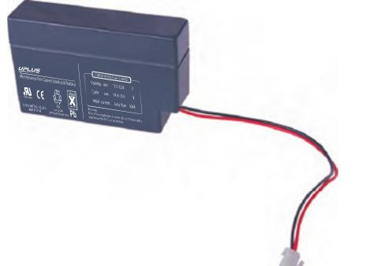
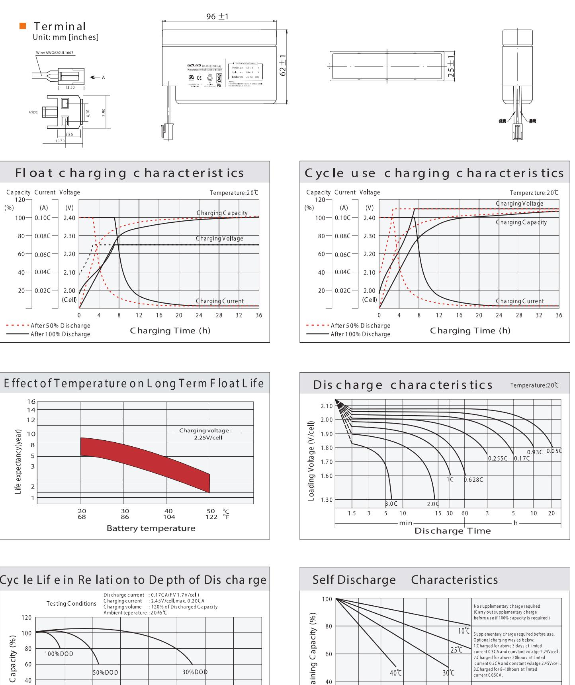
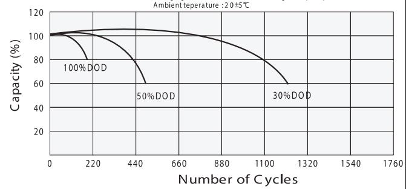

## US

## General Features

- ♦ Sealed and maintenance free operation.
- ◆ Non-Spillable construction design.
- ◆ ABS containers and covers(UL94HB, UL94V-0) optional.
- ◆ Safety valve installation for explosion proof.
- ◆ High quality and high reliability.
- ◆ Exceptional deep discharge recovery performance.
- ◆ Low self discharge characteristic.
- ♦ Flexibility design for multiple install positions.

| Intertek ETL SEMKO a contr ISO9001 ISO14001 | ાવડા | । ইউনিয়ার বিশ্বকাপের প্রতিষ্ঠান করে পারে পারে পারে পারে পারে পারে পারে পারে পারে পারে পারে পারে পারে পারে পারে পারে পারে পারে পারে পারে পারে পারে পারে পারে পারে পারে পারে পা | 19 | 65 | CE TIF EMC |
|------------------------------------------------------|------|--------------------------------------------------------------------------------------------------------------------------------------------------------------------------------|----|----|------------|
|------------------------------------------------------|------|--------------------------------------------------------------------------------------------------------------------------------------------------------------------------------|----|----|------------|

| Battery Type          | Glass Mat(AGM) Valve-Regulated,Absorbed Technology |       |                     |                                                    |         |                   |  |  |  |  |  |
|-----------------------|----------------------------------------------------------|-------|---------------------|----------------------------------------------------|---------|-------------------|--|--|--|--|--|
| Nomial Voltage        |                                                          |       |                     | 12V                                                |         |                   |  |  |  |  |  |
| Capacity( 20 °C)      | 20HR(0.039A,1.8V/cell)                                   |       | 10HR(0.072A,1.80V)  | 5HR(0.131A,1.75V)                                  |         | 1HR(0.477A,1.60V) |  |  |  |  |  |
|                       | 0.78AH                                                   |       | 0.72AH              | 0.655AH                                            |         | 0.477AH           |  |  |  |  |  |
|                       | Length                                                   | Width |                     | Height                                             |         | Total Height      |  |  |  |  |  |
| Dimensions            | 96mm(3.78inches)                                         |       | 25mm(0.98inches)    | 62mm(2.44inches)                                   |         | 62mm(2.44inches)  |  |  |  |  |  |
| Approx Weight         | Approx 0.34 kg (0.75lbs)                                 |       |                     |                                                    |         |                   |  |  |  |  |  |
| Internal Resistance   | Full Charged at 20℃ : Approx 150m   Ü                    |       |                     |                                                    |         |                   |  |  |  |  |  |
| Self Discharge        | 3%  of capacity declined per month at 20 C            |       |                     |                                                    |         |                   |  |  |  |  |  |
| Capacity affected by  | 40°C                                                     |       | 25°C                | 0°C                                                |         | -15°C             |  |  |  |  |  |
| Temperature (10HR)    | 103%                                                     |       | 100%                | 86%                                                |         | 65%               |  |  |  |  |  |
|                       | Cycle use                                                |       |                     | Float use                                          |         |                   |  |  |  |  |  |
| Charging Voltage (V)  | 14.4V~15.0V at 20 °C.T emp. Coefficient -30mV/ °C        |       |                     | 13.5V~13.8V at 20 °C.Temp. Coefficient (-20mV/ °C) |         |                   |  |  |  |  |  |
|                       | Max. Discharge Current                                   |       |                     | Initial Charging Current                           |         |                   |  |  |  |  |  |
| Current               | 12A                                                      |       |                     | Less than 0.24A                                    |         |                   |  |  |  |  |  |
|                       | Discharge                                                |       |                     | Charging                                           | Storage |                   |  |  |  |  |  |
| Operating T emp.Range | -15~50°C (5 ~122 °F)                                     |       | 0~40°C (32 ~ 104°F) | -15~40°C (5~104°F)                                 |         |                   |  |  |  |  |  |

## Co ns tant C urrent Dis ch arge (A mperes) a t 2 0 °C 6 8°F )

| F.V/Tim e    | 5m in | 10 min | 15 min | 20 min | 30 min | 45 min | 1h    | 2h    | 3h    | 4h    | 5h    | 6h    | 8h    | 10h   | 20h   |
|--------------|-------|--------|--------|--------|--------|--------|-------|-------|-------|-------|-------|-------|-------|-------|-------|
| 1.8 5V /ce   | 1.45  | 1.11   | 0.92   | 0.80   | 0.616  | 0.453  | 0.382 | 0.228 | 0.179 | 0.145 | 0.119 | 0.104 | 0.084 | 0.070 | 0.038 |
| 1.8 0V /ce   | 1.94  | 1.42   | 1.11   | 0.94   | 0.726  | 0.527  | 0.428 | 0.249 | 0.192 | 0.155 | 0.127 | 0.111 | 0.089 | 0.072 | 0.039 |
| 1.7 5V /cell | 2.19  | 1.56   | 1.22   | 1.01   | 0.754  | 0.547  | 0.448 | 0.259 | 0.196 | 0.159 | 0.131 | 0.114 | 0.090 | 0.074 | 0.039 |
| 1.7 0V /cell | 2.41  | 1.70   | 1.30   | 1.06   | 0.785  | 0.569  | 0.462 | 0.265 | 0.201 | 0.163 | 0.134 | 0.117 | 0.092 | 0.076 | 0.040 |
| 1.6 5V /cell | 2.66  | 1.84   | 1.38   | 1.13   | 0.828  | 0.583  | 0.473 | 0.269 | 0.210 | 0.168 | 0.138 | 0.119 | 0.093 | 0.077 | 0.040 |
| 1.6 0V /cell | 2.93  | 1.99   | 1.48   | 1.20   | 0.874  | 0.608  | 0.477 | 0.280 | 0.216 | 0.174 | 0.142 | 0.122 | 0.094 | 0.078 | 0.041 |

| Co ns tant Power Dis ch ar ge (W atts ) at 20 ℃ (68 °F ) |      |        |        |        |        |        |       |       |       |       |       |       |       |       |       |
|----------------------------------------------------------|------|--------|--------|--------|--------|--------|-------|-------|-------|-------|-------|-------|-------|-------|-------|
| F.V/Tim e                                                | 5min | 10 min | 15 min | 20 min | 30 min | 45 min | 1 h   | 2h    | 3h    | 4h    | 5h    | 6h    | 8h    | 10h   | 20h   |
| 1.8 5V /ce                                               | 2.65 | 2.05   | 1.72   | 1.50   | 1.173  | 0.872  | 0.737 | 0.444 | 0.348 | 0.284 | 0.232 | 0.204 | 0.165 | 0.139 | 0.076 |
| 1.8 0V /cell                                             | 3.51 | 2.59   | 2.05   | 1.75   | 1.363  | 1.006  | 0.821 | 0.481 | 0.373 | 0.302 | 0.248 | 0.218 | 0.175 | 0.143 | 0.077 |
| 1.7 5V /ce                                               | 3.88 | 2.80   | 2.21   | 1.86   | 1.403  | 1.034  | 0.855 | 0.497 | 0.378 | 0.307 | 0.254 | 0.223 | 0.178 | 0.146 | 0.077 |
| 1.7 0V /cell                                             | 4.15 | 2.99   | 2.33   | 1.94   | 1.453  | 1.071  | 0.880 | 0.508 | 0.388 | 0.315 | 0.260 | 0.228 | 0.180 | 0.149 | 0.079 |
| 1.6 5V /cell                                             | 4.51 | 3.19   | 2.45   | 2.05   | 1.520  | 1.088  | 0.893 | 0.512 | 0.403 | 0.325 | 0.266 | 0.232 | 0.182 | 0.152 | 0.080 |
| 1.6 0V /cell                                             | 4.86 | 3.39   | 2.58   | 2.16   | 1.593  | 1.128  | 0.897 | 0.532 | 0.413 | 0.334 | 0.274 | 0.236 | 0.184 | 0.153 | 0.080 |

## Dimensi ons

60

40

20

2

4

25°C

Supplementary charge may often fail to recover the capacity.
The battery s hould never be left s tanding

till this is reached.

30℃

10

Storage Time (Months)

12

8

40°C

