1 2 3 6 18

45 30 15 5

Bulk (V) Laddström (A) 90

14,2 - 14,8 14,2 - 14,8 13,4 - 13,6 Laddtid (H) Absorption (V) Float (V)

> Manual Epsilon Manual Epsilon

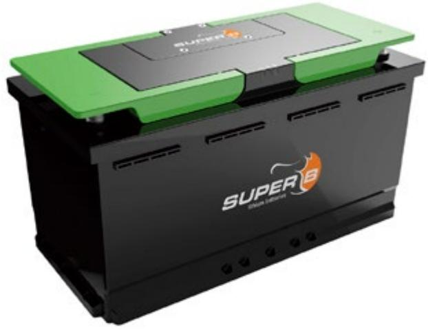

#### LITHIUM BATTERY SB12V1200Wh-M 12.8 V/90 Ah/1200Wh (Lithium Iron Phosphate) LITHIUM BATTERY SB12V1200Wh-M 12.8 V/90 Ah/1200Wh (Lithium Iron Phosphate)

# Snabbmanual Super-B Epsilon Litiumbatteri

Bulk (V) Laddström (A) 90

14,2 - 14,8 14,2 - 14,8 13,4 - 13,6 Laddtid (H) Absorption (V) Float (V)

1 2 3 6 18

45 30 15 5

Denna manual är en förkortad upplaga av originalmanualen som alltid medföljer Super-B's litiumbatteri. Mer fördjupad information hittar du i originalmanualen.

# 1. Installation

### 1.1. Allmän information

**Varning!** Detta batteri skall endast användas i system med 12V systemspänning. **Varning!** Demontera eller punktera inte Li-Ion-batteriet. **Varning!** Installera aldrig ett skadat batteri. **Super B** Be in charge

Vid parallellkoppling av flera batterier, använd alltid batterier av samma märke, typ, ålder, kapacitet och laddningstillstånd. 2.7. Connections, indicators and battery controls

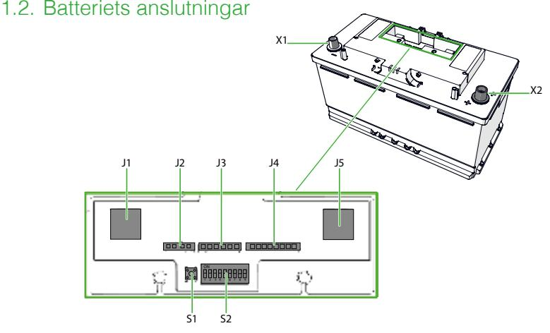

- J1: RJ45 (CAN1) J2: Inputs 4 Pins **J1**: RJ45 (CAN-anslutning 1)
- J3: Monitor 6 Pins **J2**: Ingångar 4 st plintar
- J4: Outputs 8 Pins **J3**: Övervakning 6 st plintar
- J5: RJ45 (CAN2) **J4**: Utgångar 8 st plintar
- S1: Push Button S2: Configuration switch **J5**: RJ45 (CAN-anslutning 2)
- X1: Battery Terminal 1x 95mm2 wire connection or automotive terminal **S1**: Aktiveringsknapp
- X2: Battery Terminal 1x 95mm2wire connection or automotive terminal **S2**: Konfigurationsswitch
- **X1**: Batterianslutning max 1x95mm2 ringkabelsko eller batteripol
- **X2**: Batterianslutning max 1x95mm2 ringkabelsko eller batteripol

# 2. Uppackning

Bulk (V) Laddström (A) 90

14,2 - 14,8 14,2 - 14,8 13,4 - 13,6 Laddtid (H) Absorption (V) Float (V)

> Kontrollera att batteriet inte har skador efter uppackning. Om batteriet är skadat, kontakta din återförsäljare eller Super B. Installera inte eller använd batteriet om det är skadat!

1 2 3 6 18

45 30 15 5

# 3. Förbereda batteriet för användning

### 3.1. Placering av batteriet

Innan batteriet används måste batteriet vara placerat på ett sådant sätt att det inte kommer att röra sig under användning. Använd lämpliga LN5 fästanordningar för montering.

### 3.2. Ställ batteriet i normalt driftläge

Li-Ion-batteriet är förprogrammerat i lagringsläge. Innan det används måste batteriet ställas in i normalt driftläge.

Li-Ion-batteriet kan ställas in i normalt driftläge med något av följande förfaranden:

- Tryck på S1-tryckknappen i 2 sekunder.
- Anslut batteriet till laddaren (se Kapitel 5.2 i manualen).
- Ladda upp före användning

# 4. Anslutning av batteriet

Använd rätt dimensionerad kabel för anslutning för att undvika spänningsfall och värmeutveckling. Information om kabeldimensionering hittar du i SAE-J378 eller ISO 10133: 2012-standarderna. Använd lämpliga säkringar som matchar last och kabeldimension.

Bulk (V) Laddström (A) 90

14,2 - 14,8 14,2 - 14,8 13,4 - 13,6 Laddtid (H) Absorption (V) Float (V)

1 2 3 6 18

45 30 15 5

### 4.1. Ansluta kablar med batteripolsko

1. Anslut laddaren och lasten till batteriet X2 (+). (Bild 1) **Varning!** Anslut inte X1 (-) terminalen först eftersom detta kan leda till kortslutningar.

- 2. Anslut laddaren och lasten till batteriets X1 (-) -uttag. (Bild 1)
- 3. Kontrollera att båda anslutningarna sitter fast ordentligt.
- 4. Fäll ner handtagen som skydd över anslutningarna. (Bild 2)

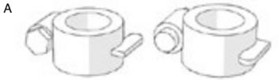

3. Ensure both contacts are firmly tightened. 4. Place the handle covers over the terminals. (Figure 2)

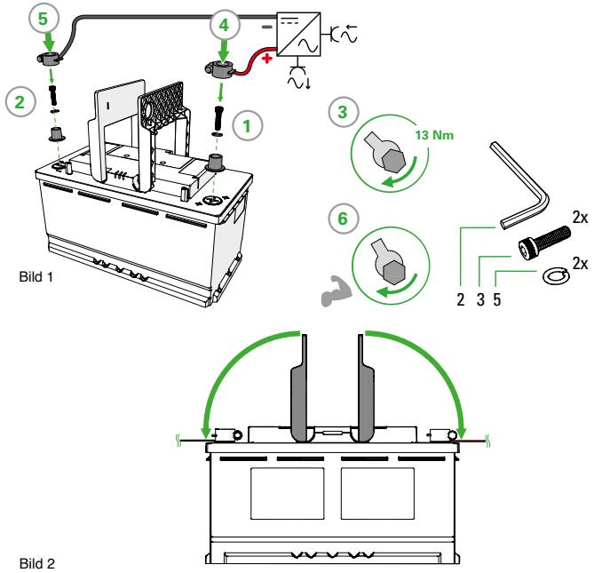

2. Connect the load or charger to the X2 (+) terminal of the battery. (Figure 4)

Use the included M8 bolt, spring washer and plain washer to connect the battery cable. ! **Warning!** Do not connect the X1 (-) terminal first as this may lead to short circuits.

Use the included M8 bolt, spring washer and plain washer to connect the battery cable.

Figure 2.

4.4.2. Connecting shrink fit type of power cables 1. Remove the automotive power terminals. (Figure 3)

3. Connect the X1 (-) terminal of the battery. (Figure 4)

4. Ensure both contacts are tightened to 13Nm. 5. Place the handle covers over the terminals. (Figure 5)

# 4.2. Anslutning med ringkabelsko

Bulk (V) Laddström (A) 90

14,2 - 14,8 14,2 - 14,8 13,4 - 13,6 Laddtid (H) Absorption (V) Float (V)

1. Ta bort batteripolerna. (Bild 3)

2. Anslut laddaren och lasten till batteriet X2 (+). (Bild 4)

Använd den medföljande M8-bulten, fjäderbrickan och vanlig bricka för att ansluta batterikabeln.

1 2 3 6 18

45 30 15 5

**Varning!** Anslut inte X1 (-) terminalen först eftersom det kan leda till kortslutningar.

# 4.3. Anslut X1 (-) -terminalen på batteriet. (Bild 4)

Använd den medföljande M8-bulten, fjäderbrickan och vanlig bricka för att ansluta batterikabeln.

Se till att båda anslutningarna är åtdragna med 13Nm.

Fäll ner handtagen som skydd över anslutningarna. (Bild 2) **Super B** Be in charge

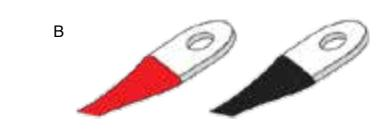

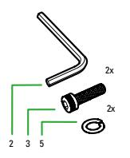

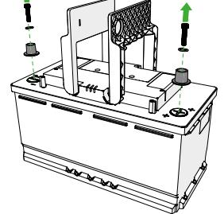

Figure 3. Bild 3

Figure 3.

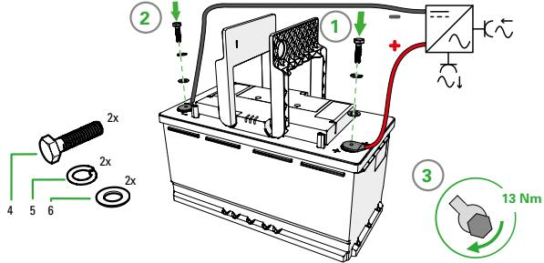

Bild 4

Figure 4.

Figure 4.

Figure 5.

Figure 5.

23

External Interface NMEA2000 CAN(1939) CAN(CANopen)

**CAN_TERM**

#### 4.4. Ansluta en laddare till batteriet 2x RJ45 Terminators)

Varning! Se till att du har slutfört alla tidigare steg som beskrivs i punkt 4 före du ansluter batteriet till laddaren. Anslut batteriet enligt bilden nedan: 4.6. Connecting a charger to the battery ! **Warning!** Ensure you have completed all the previous steps described in chapter 4 before

Figure 11. Example of connecting the data cables of 3 batteries with an external Interface (3x CAT5e FTP network cable,

X2 +

X2 +

X2 +

J4 J5

S2 S1 J4 J5 J1 J3 J2

S2 S1 J4 J5 J1 J3 J2

S2 S1

 X1 _

**CAN_TERM**

 X1 _

J1 J3 J2 X1 _

Bulk (V) Laddström (A) 90

Lin(CI-bus)

14,2 - 14,8 14,2 - 14,8 13,4 - 13,6 Laddtid (H) Absorption (V) Float (V)

Figure 10. Example of connecting the data cables of 3 batteries (2x CAT5e FTP network cable, 2x RJ45 Terminators)

1 2 3 6 18

45 30 15 5

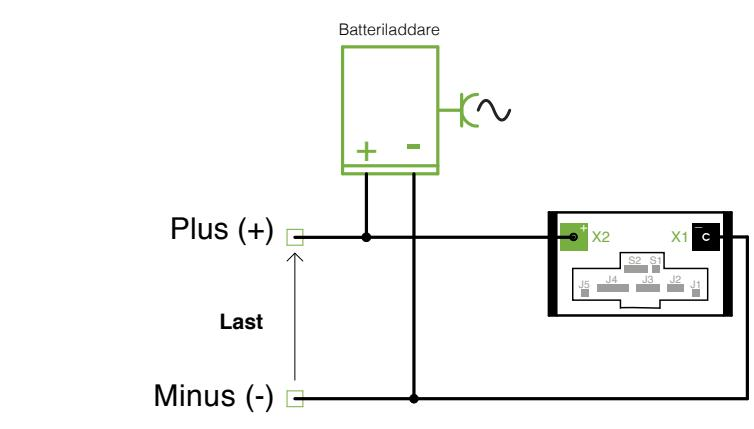

#### 4.5. Ansluta flera batterier parallellt

Figure 12. Connecting a charger to the battery

4.7. Connecting batteries in parallel Koppla in batterierna enligt nedan för att fördela strömmen lika mellan dem:

To divide the current equally amongst batteries, use the schematic bellow:

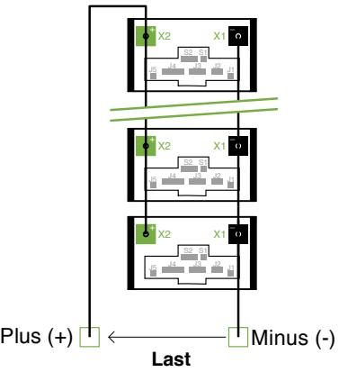

Figure 13. Connecting batteries in parallel

OK: Equally divided battery current.

NOT OK: Current not equally divided.

All batteries contribute equally to the current into the load.

Wear and tear will be higher on the battery close to the load.

Batteries closest to load will have the highest contribution to the current into the load. Whereas batteries further away from load will have lesser current contribution.

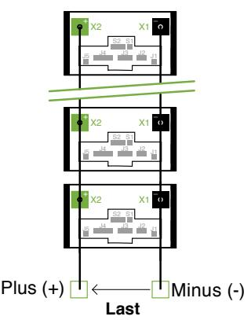

27

# 4.6. Ansluta CAN-Bus mellan batterierna

Anslut CAN-Bus kablarna enligt bilden nedan:

External Interface NMEA2000 CAN(1939) CAN(CANopen)

**CAN_TERM**

4.6. Connecting a charger to the battery

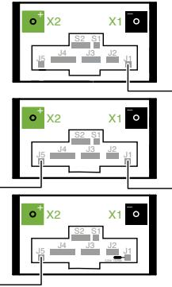

Figure 10. Example of connecting the data cables of 3 batteries (2x CAT5e FTP network cable, 2x RJ45 Terminators)

Lin(CI-bus)

1 2 3 6 18

45 30 15 5

### 4.7. Koppla ur ett batteri

Bulk (V) Laddström (A) 90

14,2 - 14,8 14,2 - 14,8 13,4 - 13,6 Laddtid (H) Absorption (V) Float (V)

- **1.** Koppla bort den negativa anslutningen från batteriets X1 (-) -terminal. Figure 11. Example of connecting the data cables of 3 batteries with an external Interface (3x CAT5e FTP network cable,
- **2.** Koppla bort den positiva anslutningen från batteriets X2 (+) -terminal. 2x RJ45 Terminators)

#### 5. Ladda batteriet connecting the battery to the charger.

26

Ladda aldrig Li-Ion-batteriet, med högre spänning (V) eller högre ström (A) än vad manualen anger, detta kommer permanent att skada batteriet. Använd alltid en laddare som automatiskt stannar laddningsprocessen när batteriet är fullt. Ladda alltid batteriet före användning. Battery charger + -

! **Warning!** Ensure you have completed all the previous steps described in chapter 4 before

Avsluta laddningsprocessen om batteriet blir för varmt under laddning. Ladda aldrig ett batteri med en laddningsström som är större än 1C. X2 + + Plus (+) S2 S1 X1 _

Koppla ur laddaren från batteriet om det inte används under en längre tid. För att optimera livslängden för Li-Ion-batteriet, bör en Super B-laddare eller en laddare godkänd av Super B användas. Load J4 J5 J1 J3 J2

Användningen av andra laddare, såsom bly-syra laddare kommer att förkorta livslängd på Li-Ion-batteriet. AGM / GEL-laddare kan användas om laddningsspänningarna i de olika laddningstillstånden inte överstiger laddningsspänningsgränserna för batteriet. Figure 12. Connecting a charger to the battery Minus (-)

- **3.** Anslut laddaren till batteriet enligt beskrivningen i punkt 4.3.
- **4.** Ladda batteriet vid låg polspänning eller om laddningstillståndet faller under 20% för att bevara batteriets livslängd.

### 5.1. Laddspänning

Laddspänningarna skall ligga enligt nedan för optimal livslängd:

| Bulk (V)    | Absorption (V) | Float (V)   |
|-------------|----------------|-------------|
| 14,2 - 14,8 | 14,2 - 14,8    | 13,4 - 13,6 |

# 5.2. Laddström & Uppladdningstid

Batteriet får aldrig laddas med en laddström som överstiger 1C (90A per batteri)

Bulk (V) Laddström (A) 90

1 2 3 6 18 45 30 15 5

14,2 - 14,8 14,2 - 14,8 13,4 - 13,6 Laddtid (H) Absorption (V) Float (V)

1 2 3 6 18

45 30 15 5

Super-B's litiumjärnfosfatbatterier kan laddas fullt på 1 timme. Laddtiden styrs dock linjärt beroende på hur hög laddström (A) som ansluts. Tabellen nedan visar laddtider vid olika laddströmmar.

| Float (V)   | Laddström (A) | 90 | 45 | 30 | 15 | 5  |
|-------------|---------------|----|----|----|----|----|
| 13,4 - 13,6 | Laddtid (H)   | 1  | 2  | 3  | 6  | 18 |

# 6. Ansluta batteriet till APP via Bluetooth

### 6.1. Ladda ner APP

Kontrollera att batteriet är aktiverat och ladda ner appen "Be in Charge" via APP Store eller Android Market.

#### 6.2. Slå på Bluetooth i din telefon eller surfplatta

Aktivera Bluetooth under "inställningar" i din telefon eller surfplatta.

#### 6.3. Anslut batteriet till telefon eller surfplatta

Öppna appen och tryck på "Scan for Bluetooth devices". Tryck på batteriet som visas i displayen och njut av att ha full kontroll över ditt nya litiumbatteri.

# 7. Uppdatera batteriets mjukvara

Börja med att ladda ner den senaste versionen av "Be in charge" via APP Store eller Android Market.

- **1.** Öppna appen och välj det batteri du vill uppdatera
- **2.** Tryck på orange symbol som det står " Download" på.
- **3.** Tryck på "Confirm" när appen frågar om du vill uppdatera mjukvaran.
- **4.** Uppdatering pågår. En uppdatering kan ta lång tid beroende på mängden data som skall överföras. Stäng av automatisk skärmsläckare på telefonen under uppdateringen, annars finns det risk att uppdateringen avstannar när skärmen släcks. Du kan dock avbryta uppdateringen och fortsätta vid annat tillfälle om du så önskar. Uppdateringen kräver mycket datatrafik. Det är därför bra om du är ansluten till ett nätverk när du genomför uppdateringen för att slippa onödiga kostnader.

1 2 3 6 18

45 30 15 5

- **5.** När uppdateringen är klar visas en ruta med texten: "Upgrade complete" i din app.
- **6.** Ladda batteriet tills det indikerar 100% i appen.

Information om nya uppdateringar hittar du på Super-B´s hemsida: www.super-b.com

# 8. Förvaring

34

8. Transportation

a Lithium Iron Phosphate battery.

8.1. General

Bulk (V) Laddström (A) 90

14,2 - 14,8 14,2 - 14,8 13,4 - 13,6 Laddtid (H) Absorption (V) Float (V)

> 6.4. Maintenance Följ lagringsanvisningarna i den här bruksanvisningen för att optimera batteriets livslängd.

The Li-Ion battery is maintenance free. Charge the battery to approximately > 80% of its capacity at least once every year to preserve the battery's capacity. 7. Storage Om dessa instruktioner inte följs och Li-Ion-batteriet saknar kapacitet då det skall förvaras kommer batteriet skadas och får då inte laddas. Batteriet behöver då ersättas av ett nytt batteri.

- storage. If these instructions are not followed and the Li-Ion battery has no charge remaining when it is checked, consider it to be damaged. Do not attempt to recharge or use it. Replace **1.** Koppla från Li-Ion-batteriet från all ansluten last och laddare.
Follow the storage instructions in this manual to optimize the lifespan of the battery during

- it with a new battery. 1. Disconnect the Li-Ion battery from all loads and, if present, the charging device. **2.** För att sätta batteriet i lagringsläget skall 12V anslutas på stift 3/4 i J2 kontakten.Där stift 3 är 12V + och stift 4 är 12V -, som visas på bilden nedan.
- 2. To put the battery back in storage mode, 12V should be applied to pins 3/4 of connector J2. **3.** Fäll ner batteriets handtag över batteriets poler under lagring.
- Where PIN3 is +12V and PIN4 is GND, as shown in the pictures. 3. Place the terminal covers over the battery's terminals during storage. **4.** Förvara batteriet på ett svalt och väl ventilerat utrymme.
- 4. Store the battery in a cool and well ventilated space. **5.** Undvik exponering av solljus och / eller UV-strålning.
- 5. Avoid exposure of the battery to sunlight and/or UV radiation. 6. Charge the battery to > 80% of its capacity before storage. **6.** Ladda batteriet till> 80% av sin kapacitet före lagring.
- 7. Charge the battery to > 80% of its capacity every 100 days. **7.** Ladda batteriet till> 80% av sin kapacitet var 100: e dag.

Always check all applicable local, national, and international regulations before transporting

Transporting an end-of-life, damaged, or recalled battery may, in certain cases, be

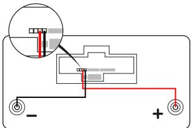

1 2 3 6 18

45 30 15 5

Ansvarig distributör:

Bulk (V) Laddström (A) 90

14,2 - 14,8 14,2 - 14,8 13,4 - 13,6 Laddtid (H) Absorption (V) Float (V)

SellPower Nordic AB Energigatan 11 434 37 Kungsbacka

Tel: +46(0)31 761 85 80 E-mail: info@sellpower.se www.sellpower.se