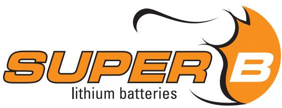
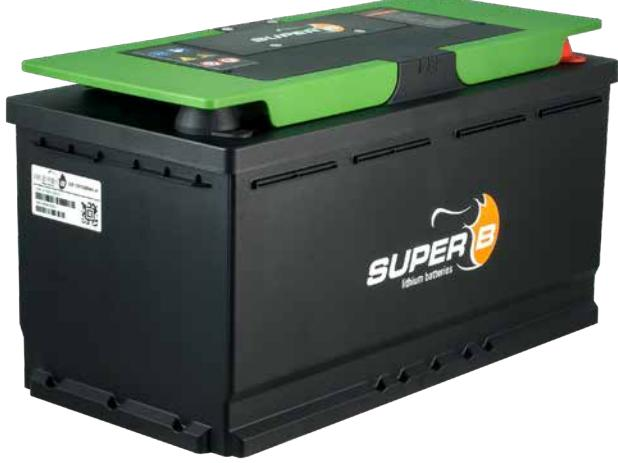
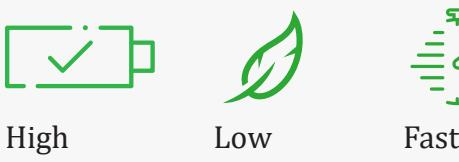
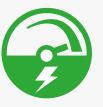

# **BE IN CHARGE**

# **DATASHEET SUPER B EPSILON** SB12V1200WH-M

**The Epsilon is a drop-in lead-acid replacement, with all the benefits of Lithium Iron Phosphate. It has superior weight reduction, enormous energy reserves and stable voltage even at**  **extreme loads. This lithium battery is suitable for 12V installations. Eliminating the need for an external safety relay means the lithium battery is very easy to install.**

## **BATTERY MONITORING**

The Super B Epsilon has integrated battery monitoring which provides details about its status such as voltage, current, temperature, state of charge and time remaining. Hands-on monitoring is also possible via Bluetooth and LED indicators to inform you about the actual status of your battery. The free BeInCharge app provides 24/7 information about the state of charge, time to go and status of the battery.

### **FEATURES**

- Traction battery
- Drop-in replacement for AGM/GEL lead-acid
- LN5 batteries
- Lithium Iron Phosphate (LiFePO4): safe lithium technology
- Integrated short circuit protection
- Integrated BMS (Battery-Management system)
- Charge current regulator, for safe low temperature charging
- CAN / LIN / Bluetooth interface for battery monitoring
- Battery monitoring / History Storage
- Adaptive cell balancing
- Monitoring via BeInCharge Bluetooth app for iOS and Android

## **PERFORMANCE**

capacity

weight

charging

Low self-

discharge

free

Maintenance

High cycle count, up to 5000 cycles

High efficiency (>96%)

# **SAFETY**

#### Super B batteries are based on Lithium Iron Phosphate technology (LiFePO4). This is the safest Lithium technology available today. On top of that our bespoke casing and electronics further increase safety and durability.

## **3-YEAR WARRANTY**

Super B's 3-year warranty offers the best peace of mind. It is the benefit of years of continuous engineering improvement and proven experience with all of our batteries in the harshest environments.

### **APP**

Download the free 'Be in charge' app for iPhone or Android

## **TECHNICAL SPECIFICATIONS**

SKU/EAN 138718531361317 Battery designation IEC 61960: 4IFpR19/66-60 Height (mm) 190 (+/-3) Diameter (mm) NA Width (mm) 353 (+/- 2) Thickness (mm) 175 (+/- 2) Open circuit voltage 13,2V Nominal voltage 12,9V Charge method CCCV Charge voltage 14,3…14,6V Charge current 90A End of discharge voltage 8V Discharge current continuous 200A Discharge current (30 seconds) 350A Weight 12,5kg (+/ -5%) Recommended charge temperature range -10°C to +45°C* Discharge operating temperature range -20°C to +60°C* Short term storage temperature range -10°C to +35°C Long term storage temperature range 23°C (+/- 5°C)

* When temperature is < 0ºC or > 45ºC performance will be degraded.

## **ENVIRONMENT**

Super B batteries do not contain lead. The LiFePO4 technology is an environmental-friendly energy storage solution.

