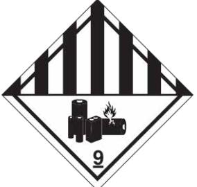

# Super B lithium batteries **MSDS DATE:** 1 June 2018

#### **SECTION 1: IDENTIFICATION OF THE PRODUCT AND OF THE COMPANY**

| 1.1 PRODUCT IDENTIFIER   |                                                                                                        |
|-----------------------------|--------------------------------------------------------------------------------------------------------|
| Description:                | Super B Epsilon SB12V1200Wh-M                                                                          |
| Synonyms:                   | Secondary (rechargeable) Li-ion Battery, Lithium Iron Phosphate (LiFePo4) Traction / Energy Battery |
| EAN code:                   | 8718531361317                                                                                          |
| Specification:              | 1163Wh, 90Ah, 12.9V                                                                                    |
| Use:                        | Traction Battery                                                                                       |
| 1.2 SUPPLIER             |                                                                                                        |
| Manufacturer:               | Super B Lithium Power b.v.                                                                             |
| Address:                    | Expolaan 50                                                                                            |
|                             | 7556 BE Hengelo                                                                                        |
|                             | The Netherlands                                                                                        |
| Emergency telephone number: | +31 (0)748200010                                                                                       |

#### **SECTION 2: HAZARDS IDENTIFICATION**

#### **2.1 CLASSIFICATION OF THE SUBSTANCE OR MIXTURE**

#### **Emergency overview:**

The rechargeable Li-ion battery cells described in this Safety Data Sheet are sealed units which are not hazardous when used according to the recommendations of the manufacturer.

The product should not be disassembled. Do not short circuit, puncture, incinerate, crush, immerse in water, or expose to temperatures outside the by the manufacturer declared temperature range of the product. If this occurs, electrolyte leakage, or battery vent/explosion/fire may follow, depending on the circumstances.

#### **Routes of entry:**

Risk of exposure will only occur if the battery cell is mechanically, thermally, or electrically abused and the enclosure is compromised. If this occurs, exposure to electrolyte solutions contained within the battery cell may occur by inhalation, eye contact, skin contact and ingestion.

#### **Potential health effects:**

- **Eyes:** Contact between the battery and eye will not cause any harm. Eye contact with the contents of a ruptured battery can cause severe irritation to the eye.
- **Skin:** Contact between the battery and skin will not cause any harm. Skin contact with positive and negative terminals of high voltages may cause burns to the skin. Skin contact with a ruptured battery can cause skin irritation.
- **Inhalation:** Inhalation of material from a sealed battery is not an expected route of exposure. Vapours or mists from a ruptured battery may cause respiratory irritation.

#### **2.2 LABEL ELEMENTS**

The rechargeable Li-ion battery described in this Safety Data Sheet is marked with the symbols listed under section 15.

# Super B lithium batteries **MSDS DATE:** 1 June 2018

#### **SECTION 3: COMPOSITION / INFORMATION ON INGREDIENTS**

#### **3.1 Substances**

| Chemical name:    | Lithium Iron Phosphate |
|-------------------|------------------------|
| Chemical formula: | LiFePO4                |
| Chemical family:  | Lithium-ion            |

#### **3.2 Mixtures**

Under normal use, this battery is not expected to expose user to hazardous ingredients. Each battery consists of a plastic container containing several sealed Lithium Iron Phosphate cells and materials of construction of which the following could potentially be hazardous upon release.

| Cell ingredients Lithium iron phosphate |                              | Percent (by weight) 30-40% | CAS No. 15365-14-7 | EC No. N/A |
|--------------------------------------------|------------------------------|----------------------------------|-----------------------|---------------|
|                                            |                              |                                  |                       |               |
|                                            | EC (Ethylene carbonate)      |                                  | 94-49-1               | 202-510-0     |
| Organic stabilizer                      | DMC (Dimethyl carbonate)     |                                  | 616-38-6              | 210-478-4     |
|                                            | EMC (Ethyl methyl carbonate) | 10-15%                           | 623-53-0              | N/A           |
|                                            | LiPf6                        |                                  | 21324-40-3            | 244-344-7     |
|                                            | PC (Propylene carbonate)     |                                  | 108-32-7              | 203-572-1     |
| Copper                                     |                              | 5-10%                            | 7440-50-8             | 231-159-6     |
| Aluminium                                  |                              | 2-10%                            | 7429-90-5             | 231-072-3     |
| Nickel                                     |                              | 7440-02-0                        | 1-5%                  | 231-111-4     |
| PP                                         |                              | 25722-45-6                       | 2-5%                  | N/A           |
| PVC                                        |                              | 9002-86-2                        | 2-5%                  | N/A           |
| Paper                                      |                              | N/A                              | 2-5%                  | N/A           |

Note: CAS number is Chemical Abstract Service Registry Number.

N/A = Not applicable

Each battery contains 240 cells of 42 grams each.

#### **SECTION 4: FIRST AID MEASURES**

In case of electrolyte leakage, or battery rupture/vent/explosion, which results in direct contact with the ingredients, please evacuate all persons from the contaminated area and ensure maximal ventilation in order to break up corrosive gas, smoke and unpleasant odors.

If it occurs, following first aid measures must be taken:

- **Eye contact:** Wash affected eye with lukewarm water for at least 30 minutes. Rinse with saline solution if possible. Seek medical attention.
- **Skin contact:** Wash affected area with lukewarm water for at least 30 minutes. If irritation or pain persists, seek medical attention.
- **Ingestion:** Move victim to fresh air and remove source of contamination from area. Drink water and induce vomiting; seek medical attention.
- **Inhalation:** Move victim to fresh air and remove source of contamination from area. Seek medical attention.

**Caution:** In all cases if irritation persists, seek medical assistance at once.

Super B lithium batteries **MSDS DATE:** 1 June 2018

#### **SECTION 5: FIREFIGHTING MEASURES**

#### **5.1 Extinguishing media**

Water, carbon dioxide, dry chemical powder and foam are most effective means to extinguish a battery fire

#### **5.2 Firefighting procedure**

Put on fully protective gear, including self-contained breathing apparatus, goggles, fireproofing jacket and gloves.

#### **5.3 Unusual fire and explosion hazards**

Exposing battery cell to excessive heat, fire or over voltage condition may cause a leak, fire, hazardous vapors and hazardous decomposition products. Damaged or opened cells or batteries can result in rapid heating and the release of flammable vapors

#### **SECTION 6: ACCIDENTAL RELEASE MEASURES**

The ingredients contained within the battery cells are only expelled under abusive conditions. In the case of spillage, use a bonding agent, such as sand or vermiculite to cover the battery. Place in an approved container and dispose in accordance with section 13.

**Caution:** Avoid any direct and indirect contact with the released ingredients.

#### **SECTION 7: HANDLING AND STORAGE**

#### **7.1 Handling**

The battery must be transported in its original or equivalent packing.

Do not expose the battery to high temperatures or fire.

Do not disassemble, short circuit, puncture, incinerate, crush or puncture battery.

Do not mix batteries of different types and brands. Do not mix new and used batteries.

Avoid deep discharge of the battery.

Follow manufacturers recommendations regarding maximum recommended currents and operating temperature range.

#### **7.2 Storage**

Insulate positive and negative terminals to avoid short circuit. Follow manufacturers recommendations regarding storage temperatures. Store in well ventilated area away from moisture, sources of heat and open flames. Avoid direct sunlight. Elevated temperatures can result in reduced battery life.

#### **7.3 Other**

Follow manufacturer's instructions for use, installation and storage as described in the user manual that is supplied with the battery.

#### **SECTION 8: EXPOSURE CONTROLS / PERSONAL PROTECTION**

#### **8.1 Engineering controls**

- **Ventilation requirements:** Not necessary under normal use. Room ventilation may be required in areas where there are open or leaking batteries.
- **8.2 Personal protective measures**
	- **Respiratory protection:** Not necessary under normal use. In case of battery or cell rupture, use a self-contained full face respiratory mask.
	- **Eye protection:** Not necessary under normal use. Wear safety goggles if handling a ruptured or leaking battery cell.
	- **Hand protection:** Not necessary under normal use. Wear Viton rubber gloves if handling a ruptured or leaking battery cell.
	- **Skin protection:** Not necessary under normal use. Wear rubber apron and Viton rubber gloves if handling a ruptured or leaking battery cell.

# Super B lithium batteries **MSDS DATE:** 1 June 2018

#### **SECTION 9: PHYSICAL AND CHEMICAL PROPERTIES**

| Physical State:             | Solid          | Odor Type:                              | Odorless       |
|-----------------------------|----------------|-----------------------------------------|----------------|
| Appearance:                 | Battery        | Odor Threshold:                         | Not Applicable |
| pH:                         | Not Applicable | Evaporative Rate: (n-Butyl Acetate = 1) | Not Applicable |
| Relative Density:           | Not Applicable | Auto Ignition Temperature (°C):         | Not Applicable |
| Boiling Point:              | Not Applicable | Flammability Limits (%):                | Not Applicable |
| Melting Point:              | Not Applicable | Vapor Pressure: (mm Hg @ 20 °C)         | Not Applicable |
| Viscosity:                  | Not Applicable | Vapor Density: (Air = 1)                | Not Applicable |
| Oxidizing Properties:       | Not Applicable | Solubility in Water:                    | Insoluble      |
| Flash Point and Method (°C) | Not Applicable | Water/ Oil distribution coefficient:    | Not Applicable |

#### **SECTION 10: STABILITY AND REACTIVITY**

**Reactivity:** The battery is stable under conditions as described in section 7.

**Conditions to Avoid:** Avoid exposing of the battery to high temperatures or fire. Do not disassemble, short circuit, puncture, incinerate, crush or puncture battery. Avoid deep discharge of the battery.

**Materials to Avoid:** Not Applicable

**Hazardous Decomposition Products:** Combustible vapors may be released if exposed to fire.

**Possibility of Hazardous Reactions:** Not available.

#### **SECTION 11: TOXICOLOGICAL INFORMATION**

**Irritation:** Risk of irritation only occurs if battery cells are mechanically, thermally or electrically abused, which results in leakage or venting of the battery cells:

- **Eye contact:** Eye irritant.

- **Skin contact:** Skin irritant.
- **Inhalation:** Lung irritant

**Neurological Effects:** Not applicable.

**Sensitization:** Not applicable.

**Teratogenicity:** Not applicable.

**Reproductive Toxicity:** Not applicable.

**Toxicologically Synergistic Materials:** Not available

#### **SECTION 12: ECOLOGICAL INFORMATION**

**Bioaccumulation potential:** Not available.

**Persistence and degradability:** Not available.

**Mobility:** Not available.

**Ecotoxicity:** Not available.

**Other adverse effects:** Not available.

When properly used and disposed, the battery can be recycled and do not present environmental hazard during and after their life time.

Super B lithium batteries **MSDS DATE:** 1 June 2018

#### **SECTION 13: DISPOSAL CONSIDERATIONS**

**WASTE DISPOSAL METHOD:** Dispose of the Li-ion battery in accordance with local, state and federal laws and regulations. Always discharge the battery before disposal. Use electrical tape or other approved covering over the battery connection points to prevent short circuits.

Battery recycling is encouraged. Batteries may be returned to the manufacturer. Contact your supplier for recollection and recycling of the battery or contact an authorized waste management company.

**USA:** Dispose of in accordance with local, state and federal laws and regulations.

**Canada:** Dispose of in accordance with local, state and federal laws and regulations.

**EC:** Dispose of in accordance with relevant EC Directives.

#### **SECTION 14: TRANSPORTATION**

#### **14.1 Transport classification**

#### **U.S. DEPARTMENT OF TRANSPORTATION**

| Lithium-ion batteries |
|-----------------------|
| Class 9               |
| UN3480                |
| Not Applicable        |
| PI 965                |
| See section 14.2      |
|                       |

#### **WATER TRANSPORTATION**

| Proper shipping name: | Lithium-ion batteries |
|-----------------------|-----------------------|
| Hazard class:         | Class 9               |
| ID number:            | UN3480                |
| Packing group:        | Not Applicable        |
| Packing instruction:  | PI 965                |
| Label statement       | See section 14.2      |

#### **AIR TRANSPORTATION**

| Lithium-ion batteries |
|-----------------------|
| Class 9               |
| UN3480                |
| Not Applicable        |
| PI 965                |
| See section 14.2      |
|                       |

#### **14.2 Transport information**

Use Class 9 Miscellaneous Dangerous Goods and UN Identification labels for transportation of Lithium-ion batteries which are assigned Class 9. Refer to relevant transportation documents. Lithium and Lithium-ion cells and batteries are regulated in the U.S. in accordance with Part 49 of the Code of Federal Regulations, (49 CFR Sections 105-180) of the U.S. Hazardous Materials Regulations.

**SECTION 15: REGULATORY INFORMATION**

## **MATERIAL SAFETY DATA SHEET FILE NO.:** MSDS_SB12V1200Wh-M Super B lithium batteries **MSDS DATE:** 1 June 2018

# The Li-ion battery is marked and labelled with the symbols below: Shield eyes Note operating instructions Battery acid Explosive gas No smoking, no naked flames, no sparks Keep away from children Dispose of the Li-ion battery in accordance with local, state and federal laws and regulations. Batteries may be returned to the manufacturer. Do not mix with other (industrial) waste. This product, or sections of this product can be recycled

#### **SECTION 16: OTHER INFORMATION**

Avoid any mechanical or electrical abuse of the Li-ion battery. Install and use the battery in accordance with the instructions provided in the user manual.

**Disclaimer:** The information and recommendations set forth are made in good faith and accurate at the date of preparation. Super B makes no warranty expressed or implied with respect to this information and recommendations and disclaims all liability from reliance on it.