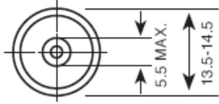
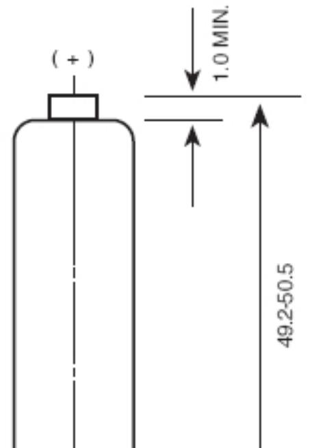
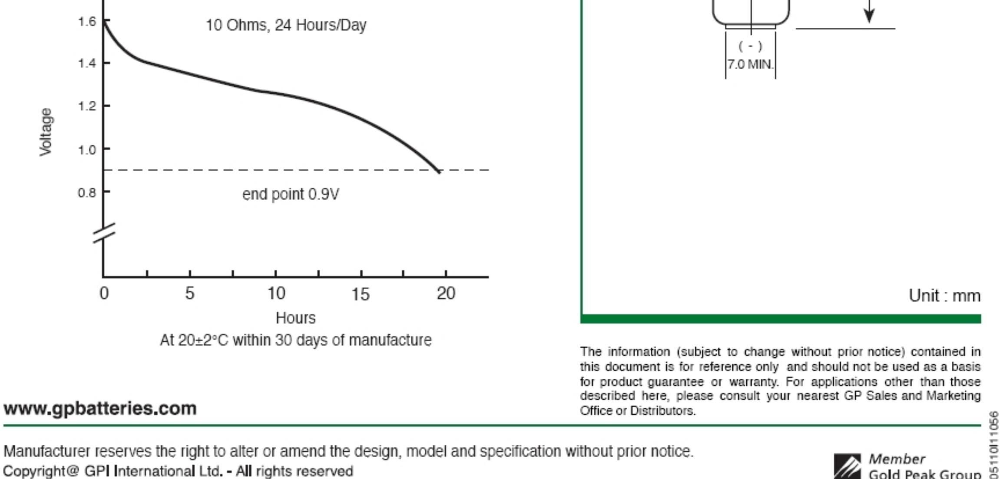

## DATA SHEET

| NO MERCURY ADDED   |                                                                                                                                                 |  |  |  |
|--------------------|-------------------------------------------------------------------------------------------------------------------------------------------------|--|--|--|
| Description        | : Mercury & Cadmium Free Alkaline Manganese Battery, AA Size                                                                                 |  |  |  |
| Chemical System    | : Alkaline Manganese                                                                                                                            |  |  |  |
| Nominal Voltage    | : 1.5 Volts                                                                                                                                     |  |  |  |
| Nominal Dimensions | : Ø14.5 mm x 50.5 mm                                                                                                                            |  |  |  |
| Terminals          | : Protruded positive(+) and flat negative(-) contacts                                                                                        |  |  |  |
| Jacket             | : Foil jacket                                                                                                                                   |  |  |  |
| Applications       | . All electronic devices, e.g. toys, photographic equipment, data banks, calculators, audio appliances, remote controls, paging machines. |  |  |  |
|                    |                                                                                                                                                 |  |  |  |
| Average Welght     | : 24g                                                                                                                                           |  |  |  |

|  |  | Cross References: |
|--|--|-------------------|
|--|--|-------------------|

| GP  | JIS | IEC | Eveready | Duracell |
|-----|-----|-----|----------|----------|
| 15A | LR6 | LR6 | E91      | MN1500   |

## Typical Service Life:

| Discharge  | Discharge   | End Point | Service |
|------------|-------------|-----------|---------|
| Resistance | Condition   | Voltage   | Life    |
| 10 Ohms    | 24 Hrs/ Day | 0.9V      | 19 Hrs  |

Model No .: GP15A

