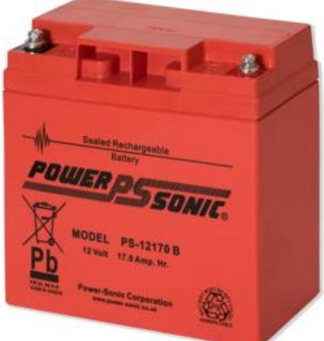
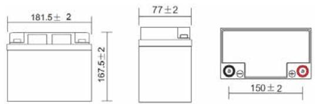
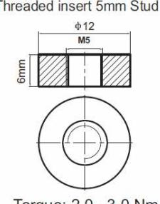

# PS - 12170

12v/17.0Ah Flame retardant battery

## **Key Features include:**

- UL94-V0 flame retardant case
- Compliant with EN60950-1 requirements for enclosures
- Insert picture here Tested & approved to latest industry standards
- Maintenance free sealed lead battery
- Low self-discharge rate
- Operational in any orientation
- Low internal resistance
- High long-term stability
- High capacity
- 100% recyclable

## **Description**

### **Application**

The maintenance free, sealed lead battery of the PS... Series are suitable for protection systems. They can be used for intrusion, fire and access control systems to guarantee their continuous operation in case of a power failure.

### **Features**

The capacity of the maintenance free lead batteries are the product of the discharge current (A) and the discharge time (h) specified in ampere hour (Ah), whereas the capacity and the discharge voltage curve depend directly on the discharge current (see Fig. 1).

Several batteries can be connected in parallel to increase the total capacity, but it is required to use batteries with the same nominal capacity and voltage.

Several batteries can be connected in series to increase the closed-circuit voltage, but it is required to use batteries with the same nominal capacity and voltage.

If possible the correct size of battery should be chosen for the load of the system.

the operating temperature, e.g. at 0°C the capacity drops to 85% of its nominal value (see Fig. 2).

The operation of the battery below the end-point voltage will lead to a deep discharge of the battery. Deep discharged batteries cannot provide the initial capacity until they are fully recharged. The batteries of the PS... Series are protected against a deep discharge, which means they can be charged up to their nominal capacity again after a deep discharge, without any degradation of the capacity. Deep discharge situations should be avoided to help protect the life of the battery.

The operating temperature needs to be considered, when calculating the required capacity of a power supply system. The available capacity decreases with

To charge batteries of the AB... Series a battery charger is required, which limits the charging voltage based on the WU or I/U characteristics. If the battery

charging facility is likely to be in an area with unstable temperature, then a temperature compensated battery charger needs to be provided.

# PS - 12170

12v/1.70Ah Flame retardant battery

## **Dimensions (mm)**

## **Standard terminal (mm)**

| Constant Current Discharge (Amperes) at 25°C (77°F)  |       |       |       |       |      |      |      |      |      |      |      |      |
|------------------------------------------------------|-------|-------|-------|-------|------|------|------|------|------|------|------|------|
| F.V/Time                                             | 15min | 20min | 30min | 45min | 1h   | 2h   | 3h   | 4h   | 5h   | 8h   | 10h  | 20h  |
| 1.85V/cell                                           | 18.3  | 15.2  | 11.8  | 9.36  | 7.57 | 4.96 | 3.72 | 3.05 | 2.58 | 1.80 | 1.53 | 0.81 |
| 1.80V/cell                                           | 20.3  | 16.7  | 12.7  | 9.94  | 7.98 | 5.28 | 3.93 | 3.20 | 2.71 | 1.89 | 1.60 | 0.84 |
| 1.75V/cell                                           | 22.5  | 18.3  | 13.7  | 10.6  | 8.61 | 5.53 | 4.16 | 3.34 | 2.85 | 1.95 | 1.63 | 0.86 |
| 1.70V/cell                                           | 24.6  | 20.0  | 15.1  | 11.1  | 9.09 | 5.83 | 4.35 | 3.48 | 2.96 | 2.02 | 1.69 | 0.87 |
| 1.65V/cell                                           | 26.0  | 21.1  | 15.9  | 11.8  | 9.41 | 6.03 | 4.51 | 3.60 | 3.03 | 2.07 | 1.72 | 0.90 |
| 1.60V/cell                                           | 28.6  | 22.9  | 16.9  | 12.2  | 9.76 | 6.28 | 4.66 | 3.71 | 3.13 | 2.13 | 1.76 | 0.92 |
| Constant Power Discharge (Watts/cell) at 25°C (77°F) |       |       |       |       |      |      |      |      |      |      |      |      |
| F.V/Time                                             | 15min | 20min | 30min | 45min | 1h   | 2h   | 3h   | 4h   | 5h   | 8h   | 10h  | 20h  |
| 1.85V/cell                                           | 34.5  | 29.0  | 22.7  | 18.2  | 14.8 | 9.74 | 7.33 | 6.02 | 5.11 | 3.59 | 3.06 | 1.63 |
| 1.80V/cell                                           | 37.8  | 31.4  | 24.2  | 19.1  | 15.5 | 10.3 | 7.68 | 6.28 | 5.33 | 3.76 | 3.19 | 1.68 |
| 1.75V/cell                                           | 41.4  | 34.1  | 25.8  | 20.3  | 16.6 | 10.7 | 8.11 | 6.53 | 5.59 | 3.86 | 3.26 | 1.71 |
| 1.70V/cell                                           | 44.6  | 36.9  | 28.2  | 21.1  | 17.5 | 11.3 | 8.46 | 6.80 | 5.81 | 4.00 | 3.36 | 1.74 |
| 1.65V/cell                                           | 47.0  | 38.8  | 29.6  | 22.3  | 18.0 | 11.6 | 8.75 | 7.02 | 5.92 | 4.10 | 3.43 | 1.78 |
| 1.60V/cell                                           | 50.5  | 41.5  | 31.1  | 22.9  | 18.5 | 12.0 | 8.99 | 7.21 | 6.10 | 4.20 | 3.50 | 1.82 |

# PS - 12170

12v/17.0Ah Flame retardant battery

# **Discharge Characteristics (25°C, 77°F)**

| Rated Capacity    | 20hr Rate (1.80V/cell) 10hr Rate (1.80V/cell) 5hr Rate (1.75V/cell) 3hr Rate (1.75V/cell) 1hr Rate (1.60V/cell) | 2.30AH 2.14AH 1.93AH 1.69AH 1.40AH | Constant Voltage Charge | Cycle   | Initial Charging Current Less than 0.575A Voltage 14.40V ̴15.0V At 25°C (77°F) |
|-------------------|-----------------------------------------------------------------------------------------------------------------------------|------------------------------------------------|-------------------------|---------|-----------------------------------------------------------------------------------------|
| Capacity Affected | 40 °C (104°F)                                                                                                               | 103%                                           |                         | Standby | Recommended Charge                                                                      |
| by Temperature    | 25°C (77°F)                                                                                                                 | 100%                                           |                         |         | Current less than 0.52A Voltage 13.5V 13.8V at 25°C (77°F)                        |
|                   | 0°C (32°F)                                                                                                                  | 86%                                            |                         |         |                                                                                         |

#### **Technical Data**

| Nominal voltage         | 12V                                     |
|-------------------------|-----------------------------------------|
| Nominal capacity (20HR) | 2.1Ah                                   |
| Material                | Thick walled ABS UL94-V0                |
| Transportation          | Non-hazardous (air / sea / rail / road) |
| Operating temperature   |                                         |
| Storage temperature     |                                         |
| Life expectancy         | 3-5 years under float charge conditions |
| Internal resistance     | 90.0 Ω                                  |
| Dimensions              |                                         |
| - Length                | 178 ± 2 mm                              |
| - Width                 | 35 ± 2 mm                               |
| - Container height      | 60 ± 2 mm                               |
| - Terminal height       | 66 ± 2 mm                               |
| Terminal type           | F1                                      |
| Approvals               | VdS – G 103145                          |

#### **Ordering Data**

| Type    | Art. No.         | Designation                   | Weight |
|---------|------------------|-------------------------------|--------|
| PS12170 | N54545-Z158-A100 | Battery 12v/17.0Ah Flame Ret. | 5.7Kg  |

www.vanderbiltindustries.com Data and design subject to change without notice. Supply subject to availability.

© Vanderbilt 2017