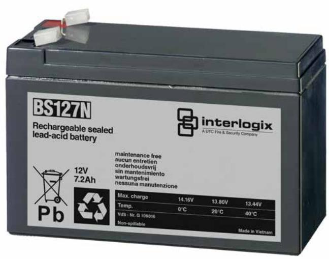

## BS127N

**Blyackumulator 12 V, 7,2 Ah mått 151 x 94 x 65 mm (endast för 2010-1/-2 brandlarmcentraler, använd BS127N-A för alla andra tillämpningar).**

#### **BS127N**

Underhållsfri blyackumulator lämplig för kontinuerlig underhållsladdning, exempelvis i inbrottslarms- och brandlarmsanläggningar.

#### **Details**

- Underhållsfritt
- Lång livslängd
- Temperaturokänslig
- Uppladdningsbart
- Läckagefri konstruktion

# BS127N

**Blyackumulator 12 V, 7,2 Ah mått 151 x 94 x 65 mm (endast för 2010-1/-2 brandlarmcentraler, använd BS127N-A för alla andra tillämpningar).**

### **Technical specifications**

| Allmänt                             |                          |
|-------------------------------------|--------------------------|
| Product type                        | Sealed lead acid battery |
| Spänning/ström                      |                          |
| Nominal voltage                     | 12 V                     |
| Nominal capacity                    | 7.2 Ah                   |
| Internal approx. resistance      | 21 mohm                  |
| Laddning/urladdning                 |                          |
| Max. charge voltage                 | 13.8 VDC at +20°C        |
| Max. charge current                 | 2.16 A                   |
| Max. discharge current              | 35 A                     |
| Temperaturområde                    |                          |
| Charging temperature                | 0 to +40°C               |
| Discharging temperature-15 to +50°C |                          |
| Mått                                |                          |
| Physical dimensions                 | 151 x 94 x 65 mm         |
| Net weight                          | 2.678 kg                 |
| Shipping weight                     | 2.678 kg                 |
| Material                            | ABS                      |
| Terminal type                       | Fast-on 4.8 mm           |
| Miljö                               |                          |
| Fire retardant                      | No                       |
| Operating temperature               | 0 to +40°C               |
| Storage temperature                 | -15 to +50°C             |
| Regulatory                          |                          |
| Compliancy                          | RoHS 2, WEEE             |
| Certification                       | VdS                      |

Powered by TCPDF (www.tcpdf.org)

Carrier Fire & Security förbehåller sig rätten att ändra produktspecifikationer utan föregående meddelande. För de senaste produktspecifikationerna, besök se.firesecurityproducts.com online eller kontakta din försäljningsrepresentant.