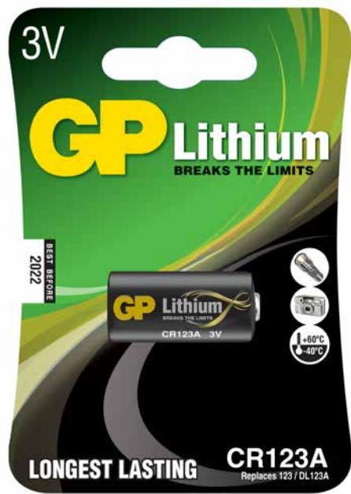
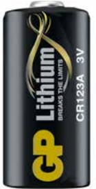

## GP fotobatteri, Lithium, CR 123A-C1, 1-pack

GP fotobatteri ett lithiumbatteri speciellt anpassat för strömkrävande fotoutrustning används även till vissa ficklampor.

- Utmärkt prestanda
- Inbyggd säkerhetsmekanism
- Fungerar i -40° C till 60° C

**ARTICLE INFORMATION:** Art.no: 3702 EAN: 4891199001086

**Page 1/2**

## GP fotobatteri, Lithium, CR 123A-C1, 1-pack

## **Technical specifikation**

| Spänning (Volt)    | 3.000                     |  |  |
|--------------------|---------------------------|--|--|
| Tillverkningsland  | Japan                     |  |  |
| Statistiskt nummer | 8506503000                |  |  |
| EL-nr              | 62 093 41                 |  |  |
| Snro               | 8743011                   |  |  |
| Batterityp         | Lithium Manganese dioxide |  |  |
| Nobb number        | 40763153                  |  |  |
| Batteristorlek     | Button cells              |  |  |

## **Packaging information**

|                 | 1-P           | DISP          | EXKRT         | ST      |
|-----------------|---------------|---------------|---------------|---------|
| EAN kod         | 4891199001086 | 4891199001611 | 4891199001628 |         |
| Längd (mm)      | 120.000       | 122.000       | 490.000       | 0.000   |
| Höjd (mm)       | 16.000        | 88.000        | 320.000       | 34.500  |
| Bredd (mm)      | 84.000        | 93.000        | 402.000       | 16.800  |
| Bruttovikt (kg) | 0.02700       | 0.22200       | 12.35000      | 0.02700 |
| Net Weight (kg) | 0.01700       | 0.22000       | 7.65000       | 0.01700 |
| Gross Volume    | 0.00000       | 0.00000       | 0.06303       | 0.00014 |
| Net Volume      | 0.00000       | 0.00000       | 0.00000       | 0.00000 |
| Antal ST        | 1             | 10            | 450           | 1       |

**Page 2/2**