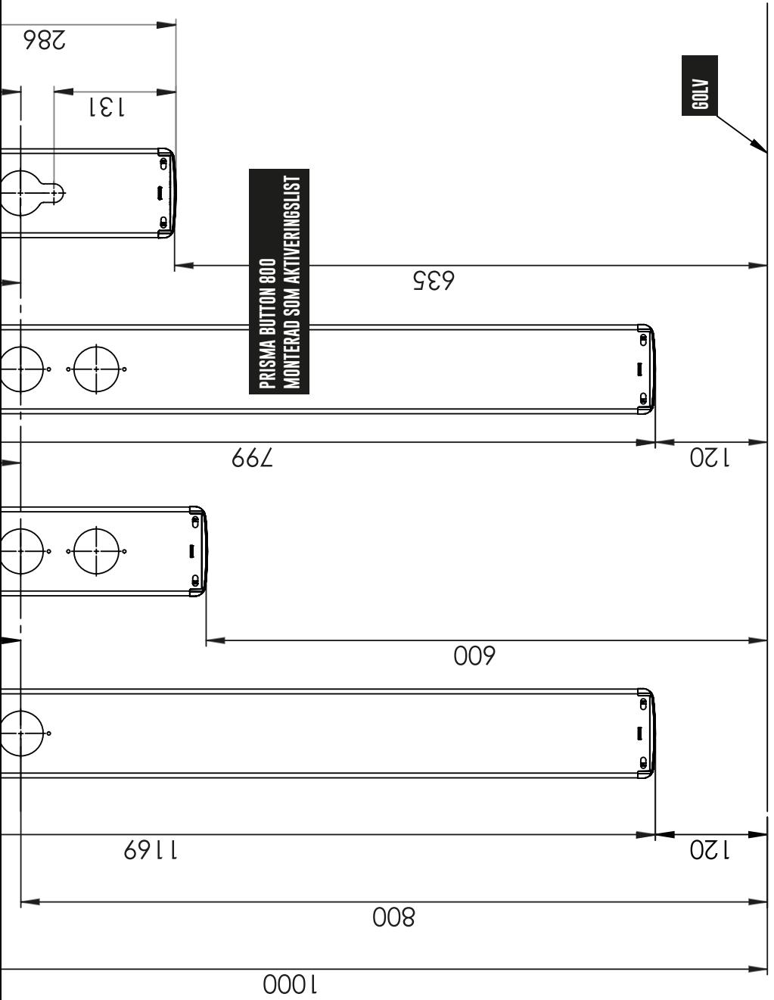
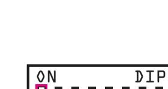

# **1200**

# **MANUAL INSTALLATION**

## **ARMBÅGSKONTAKT AKTIVERINGSLIST**

# **MONTERING OCH INSTALLATION**

- Demontera topplocket **A** och bottenlocket **J** enligt bild på nästa sida, och dra ut tryckfronten **F** från ytterprofilen **E**
- Ställ in dip-switchar efter önskemål, enligt beskrivning på manualens baksida

**Obs! Se till att båda kretskorten C & G har samma inställningar med dip-switcharna om du önskar samma funktion över hela frontpanelen. Om du vill ha olika inställningar för övre och underdelen så gör du denna inställning på respektive kretskort.**

- Anpassa trådlängden från väggdosan så att du har god marginal till anslutningsplinten på frontpanelen.
- Det räcker att från väggdosan ansluta endast ett av kretskorten.
- För kablaget genom kabelutsläppet **D** på ytterprofilen **E**
- Montera kablage enligt schema **K** i valfritt kretskort
- Skjut ner tryckfronten **F** i ytterprofilen **E** , så den är kant i kant med ytterprofilens främre del
- Montera ytterprofilen **E** med skruvar i skruvhålen **B** och **I**
- Vid montering utomhus: Borra ett dräneringshål i markerad fördjupning i bottenlocket
- Montera topplocket **A** och bottenlocket **J** Se nedan: två kombinationer av lock.
- Driftsätt, vänta några sekunder tills enheten startat upp

## **LOCK**

### **Två kombinationer av ändlock**

Valet görs vid beställning efter beslut av slutkund

- 1. Topplock och bottenlock med skruv
- 2. Topplock utan skruv, bottenlock med skruv

*Ändlock med skruv*

**Se instruktionsfilm**

"Ont om plats vid montering? – Skanna QR-kod med smartphone eller läsplatta.

| TEKNISK SPECIFIKATION                  |                                                                                                                                                                                                            |
|----------------------------------------|------------------------------------------------------------------------------------------------------------------------------------------------------------------------------------------------------------|
| Dimensioner                            | 1169 x 95 x 25 mm                                                                                                                                                                                          |
| Vikt                                   | 1,9 kg                                                                                                                                                                                                     |
| Spänningsmatning                       | 18-30 VDC                                                                                                                                                                                                  |
| Anslutningskabel                       | Två trådar för spänningsmating. Två trådar för signalering till dörr automatiken. För att kunna nyttja samtliga funktioner i båda reläerna krävs ytterligare två trådar. Totalt sex trådar. |
| Reläer                                 | 2 st Relä 1: en slutande kontakt Relä 2: en slutande kontakt                                                                                                                                         |
| Effektförbrukning                      | Vila ≈ 60 mA (2x30mA) Aktiverad ≈ Max 94 mA (2x47mA) Max lastström per reläutgång är 2A.                                                                                                             |
| Relä, lastström                        | Max lastström per reläutgång är 2A                                                                                                                                                                         |
| Material ytterprofil och tryckfront | Aluminium                                                                                                                                                                                                  |
| Material lock                          | Polyamid                                                                                                                                                                                                   |
|                                        |                                                                                                                                                                                                            |

# **SPRÄNGSKISS**

# risma Butt

# **DIP-SWITCH**

- Alla 8 dip-switchar står i off-läge vid leverans vilket innebär: Tryck aktiverar relä 1 = öppning låskolv, efter 0,2 sek aktiveras relä 2 = dörröppning
OFF ON

• Flera dip-switchar kan aktiveras beroende på vilken funktion som önskas.

# **TILLSLAGSFÖRDRÖJNING**

**Tryck på frontpanelen 1,5 sekunder för aktivering.** Dip-switch 1: On **OBS!** Om dip-switch 8 aktiveras, avaktiveras denna funktion.

**Tryck på frontpanelen 3 sekunders för aktivering.**  Dip-switch 2: On

**OBS!** Om dip-switch 8 aktiveras, avaktiveras denna funktion.

**Tryck på frontpanelen 6 sekunders för aktivering.**  Dip-switch 1och 2: On **OBS!** Om dip-switch 8 aktiveras, avaktiveras denna funktion

# **KICK/SPARK-FUNKTION**

**Sparkfunktion innebär att övervåldsskyddet är inaktiverat. Alltså accepteras kraftigare yttre påverkan typ kick/spark.** Dip-switch 3: On

# **BEGRÄNSAD RELÄANSLUTNINGSTID**

**Du kan välja att ha en reläanslutningstid på max 1 sek.**  En funktion som innebär att dörren endast får en signal oavsett hur länge du än trycker på frontpanelen. Dip-switch 4: On

# **KVITTENSTON**

**När du önskar en kvittenston vid tryck på frontpanelen.**  Dip-switch 5: On

ON DIP

1 2 3 4 5 6 7 8

ON DIP

# **LÅSÖPPNING, FÖRDRÖJD DÖRRÖPPNING**

**Kan användas för att styra låskolvar när signal till dörröppningen behöver förskjutas 1,5 sekunder. Funktionen kan även användas om man vill ha asynkron öppning av pardörrar.**

Kort tryck: aktiverar relä 1, "Låskolv" Tryck 1,5 sekunder: aktiverar relä 1 ,"Låskolv" direkt. När man tryckt i 1,5 sekunder aktiveras även relä 2, "Dörr" Dip-switch 2 och 8: ON

# **AKTIVERA RELÄ 2**

**Aktiverar ej Relä 1** Dip-swith 6: On

# **AKTIVERA RELÄ 1**

**Aktiverar INTE relä 2** Dip-switch 7: On

## **NURSE BED-FUNKTION 1**

**Nurse Bed även kallad systeröppning. Styr pardörrar på olika sätt beroende på hur du trycker på frontpanelen.** Kort tryck: aktiverar relä 1, "Dörr 1" Tryck 1,5 sekunder: aktiverar relä 2, "Dörr 2" Dip-switch 8: On

## **NURSE BED-FUNKTION 2**

**Nurse Bed även kallad systeröppning. Styr pardörrar på olika sätt beroende på hur du trycker på frontpanelen.** Kort tryck: aktiverar relä 1, "Dörr 1" Tryck 1,5 sekunder: aktiverar relä 1+ 2, "Dörr 1" och "Dörr 2" Dip-switch 1 och 8: On

### 1200 800 300 TILLGÄNGLIGHET FÖR ALLA

ADRESS Järnvägsgatan 19, 543 50 Tibro tel 0504-400 40 wEBB prismatibro.se E-POST contact@prismatibro.se