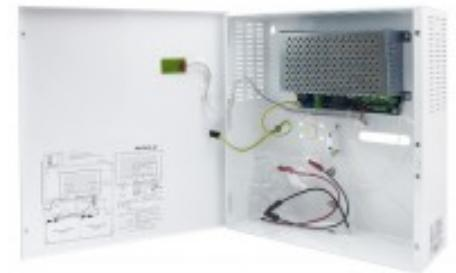

# PSV 2415-12

# Strömförsörjning, VIP, 24 V 1,5 A

### **Produktdetajler:**

| Godkännanden                     | EN 61000-6-1:2007, EN 61000-6-3:2007+A1, EN 60950-1:2006+A11+A1+A12+A2 |
|----------------------------------|------------------------------------------------------------------------------|
| Matningsspänning                 | 230 VAC                                                                      |
| Utspänning                       | 27,6 VDC                                                                     |
| Belastning                       | 1,5 A                                                                        |
| Plats för ackumulator (ingår ej) | två 12 V/12 Ah                                                               |
| Sabotageskydd                    | Öppnings- och avstängningsbrytare                                            |
| Kapsling                         | Metall                                                                       |
| Färg                             | Vit                                                                          |
| Mått (L x B x H) mm              | 345 x 325 x 130                                                              |

Strömförsörjningsaggregat med ViP (Voltage in Parallel) funktion, 24 VDC 1,5 A.Strömförsörjningsaggregat med ViP funktion kan parallellkopplas för att ge redundans samt kompensera för spänningsfall i kablaget. Plats för två 12 V 12 Ah ackumulatorer. Sabotagekontakt. Enheten har skydd mot kortslutning och överbelastning. Indikering för nätbortfall, låg utspänning, batterifel samt säkringsfel sker med LED och aktiverar separata utgångar med reläer.

#### **BESTÄLLINGSINFORMATION**

**Typ E-nr Beskrivning**

PSV 2415-12 5240067 Strömförsörjning, VIP, 24 V 1,5 A

## **ALARMTECH SWEDEN AB**

### **Relaterade produkter och tillbehör:**

| 28097 Power X1, DC/DC Omvandlare MIN I 5-32 V -> 3.3-30 V |  |
|-----------------------------------------------------------------------------|--|
| 3097 Power X3, DC / DC Omvandlare 12-24 VDC -> 5V, 9V, 12V      |  |

Powered by TCPDF (www.tcpdf.org)