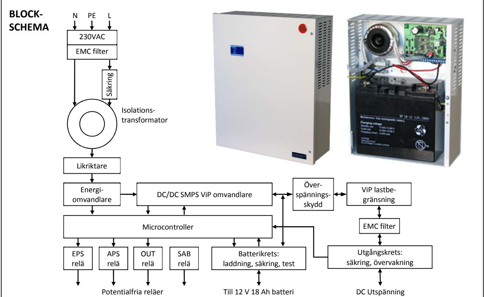
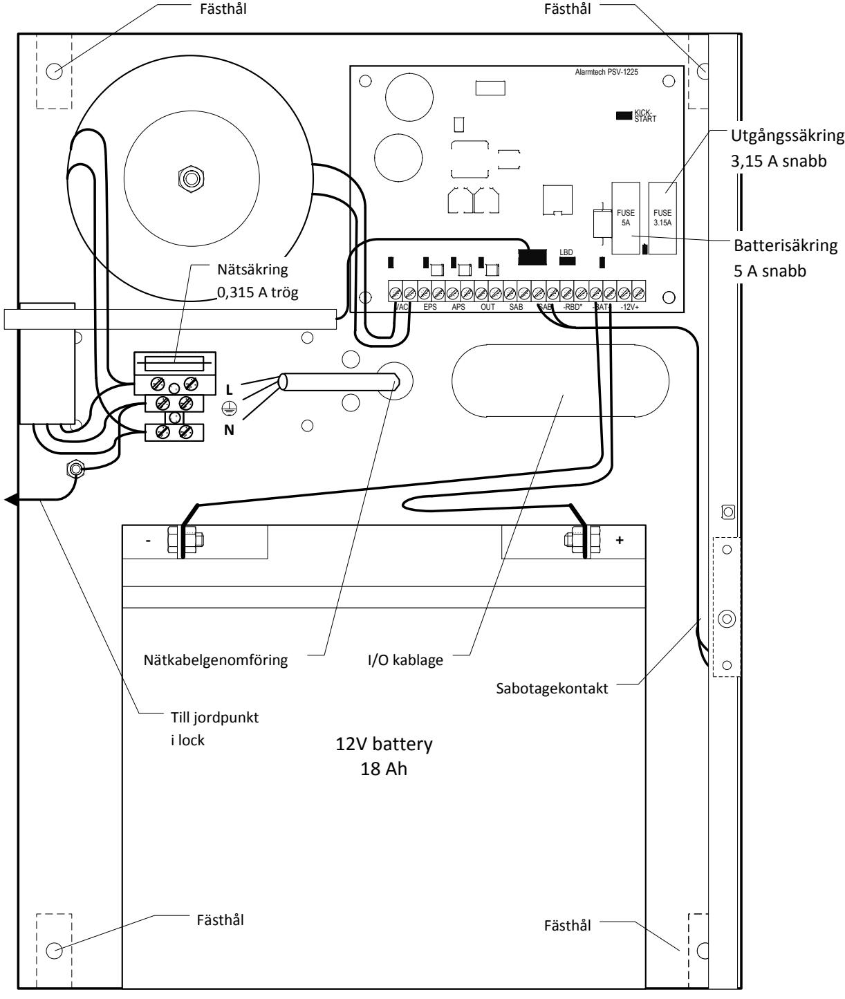
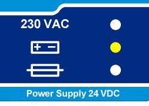
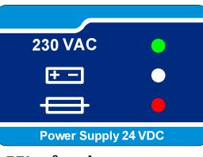
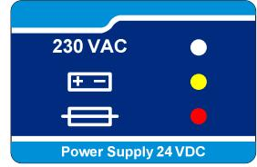
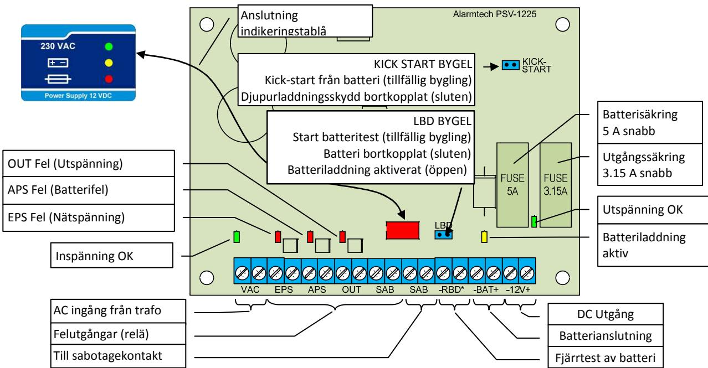

# **PSV 1225-18**

#### **BESKRIVNING**

PSV 1225-18 är en strömförsörjningsenhet med plats för batteribackup som bygger på den senaste tekniken och uppfyller normerna i EN 50131-6:2008, "security grade 3".

PSV 1225-18 har den unika ViP (Voltage in Parallel) funktionen som utvecklats av ALARMTECH. Strömförsörjningsaggregat med ViP funktion kan parallellkopplas, både plus (+) och minus (-) på samma matningsslinga utan extra synkronisering. Enheter anslutna på slingan kommer att dela på lasten. ViP funktionen kan användas för att bygga distribuerade och redundanta strömförsörjningsanläggningar. Det kan också användas för att kompensera för spänningsfall i slingan genom att placera ytterligare ViP aggregat på slingan.

Spänningsomvandlingen baseras på högfrekvens SMPS regulator med hög verkningsgrad. Låg intern förlust skyddar batterierna från överhettning. Processorstyrd batteriladdning som arbetar med konstant ström och begränsad spänning, den mest avancerade och den bästa metoden för att erhålla längsta möjliga batterilivslängd.

Strömförsörjningsaggregatet har inbyggd självdiagnostik som indikerar nätspänningsbortfall, olika typer av batterifel inkl "End of life" varning, fel på utspänning, låg spänning eller säkringsfel.

#### **EGENSKAPER**

- Grade 3 security grade (EN 50131-6:2008)
- Typ A, med batteribackup
- Utspänning 13,8 V
- Max strömkapacitet 2,5 A
- ViP (Voltage-in-Parallel) funktion som utökar säkerheten och kapaciteten i systemet. Strömförsörjningsenheter med ViP kan anslutas parallellt utan extra synkronisering
- Plats / kapacitet för att ladda en 18 Ah blyackumulator
- Kortslutnings- och överbelastningsskydd
- Indikering av nätspänningsbortfall
- Indikering av låg utspänning
- Indikering av säkringsfel
- Detektering av nätdelsfel
- Överspänningsskydd
- Detektering av olika typer av batterifel
- Djupurladdningsskydd för batteri
- Lokal eller fjärrstyrd batteritest
- Sabotageskydd mot öppning eller bortbrytning
- Inbyggd självdiagnostik med visuell felindikering via LED på kretskortet

#### **TILLÄPNINGAR**

- Inbrottslarmsystem
- Brandlarmsystem
- Passagekontrollsystem
- Övriga typer av 12 V system

## **1. INSTALLATION**

#### **PSV 1225-18 installationsanvisning och uppstart:**

- Montera enheten med hjälp av de 4 fästhålen
- Placera blyackumulatorn 12 V/18 Ah i botten av kapslingen
- Anslut batteri (-) med svart batterikabel
- Anslut batteri (+) med röd batterikabel
- Anslut utrustningen som skall spänningsmatas till utgång 12 VDC
- Skall felutgångar/styringång för batteritest (utgång EPS, APS, OUT, SAB, ingång –RBT*) användas anslut

dessa till externa utrustning

- Säkerställ att 230 VAC kabeln inte är ansluten till elnätet
- Anslut 230 VAC kabeln till ingång 230 VAC, säkerställ att jordning sker på korrekt sätt
- Slå på nätspänningen till strömförsörjningsenheten. PSV 1225-18 kommer att starta automatiskt och leverera ström till anläggningen och övervaka alla funktioner

#### **2. TEKNISK BESKRIVNING**

#### 2.1 Frontpanel

ViP aggregatet har en indikeringspanel som visar aktuell status. Panelens tre lysdioder indikerar: Grön LED: Nätspänning OK – enheten är i EPS läge och matad från elnätet Gul LED: Nätspänning saknas – enheten är i APS läge och matas från batteri Röd LED: Fel detekterat – identifiering / lokalisering av fel är möjlig med hjälp av LED´s inne i enheten

**Enheten OK**  Matas från elnätet Batteri OK Utgång OK Inga fel

**FEL på enheten**  Saknar nätspänning (EPS utgång aktiv) Matas från batteri Inga andra fel

**FEL på enheten**  Matas från elnätet Möjliga fel: APS (batteri) OUT (utgång)

**FEL på enheten**  Saknar nätspänning (EPS utgång aktiv) Matas från batteri Möjliga fel: APS (batteri) OUT (utgång)

## 2.2 Interna indikeringar, anslutningar mm i strömförsörjningsenheten

All övervakad status av enheten visas med lysdioder (LED) för snabb identifiering. I bilden nedan visas placeringen av statusdioderna. Förklaring till diodernas färger:

- Grön Normalt läge, OK
- Röd Fel detekterat
- Gul Informationsindikering

## 2.3 Bygelfält

Strömförsörjningsenheten har 2 bygelfält som är placerade på kretskortet:

Stängd Batteriladdning frånkopplad

- "Kick-start" bygel (default-läge: öppen)

|                                                                  | Tillfällig bygling                                          | "Kick-start" av enheten från batteri (utan nätanslutning) |  |  |
|------------------------------------------------------------------|-------------------------------------------------------------|-----------------------------------------------------------|--|--|
|                                                                  | Öppen (default)                                             | Djupurladdningsskydd (DDP) av batteri aktiverat           |  |  |
|                                                                  | Stängd Djupurladdningsskydd (DDP) av batteri frånkopplat |                                                           |  |  |
| LBD (Local Battery Diagnostics) bygel (default-läge: öppen) • |                                                             |                                                           |  |  |
| Tillfällig bygling                                               |                                                             | Batteritest aktiverat (30 sek test av batteriresistans)   |  |  |
|                                                                  | Öppen (default)                                             | Batteriladdning aktiverad                                 |  |  |

#### 2.4 In och utgångar

| Ingång / Utgång     | Märkning | Beskrivning                                              |
|---------------------|----------|----------------------------------------------------------|
| Spänningsutgång     | -12V+    | (-) och (+) anslutning för enheter som skall matas       |
| Batterianslutning   | -BAT+    | (-) och (+) anslutning för 12 V batteri                  |
| AC ingång           | VAC      | AC ingång från transformator                             |
| Nätfelsutgång       | EPS      | Potentialfri NC opto reläutgång indikerar EPS fel        |
| Batterifelsutgång   | APS      | Potentialfri NC opto reläutgång indikerar APS fel        |
| Spänningsutgångsfel | OUT      | Potentialfri NC opto reläutgång indikerar OUT fel        |
| Batteritestingång   | -RBD*    | Test aktiveras vid tillfällig bygling mellan (-) och (*) |
| Sabotageutgång      | SAB      | Potentialfri NC microswitchutgång                        |

## **3. TEKNISKA DATA**

| Typ av strömförsörjning enligt EN 50131-6:2008:      | Typ A                                                        |
|------------------------------------------------------|--------------------------------------------------------------|
| "Security grade" enligt EN 50131-6:2008:             | Grade 3                                                      |
| Inspänning:                                          | 230 VAC, +10% ÷ -15%, 0,2 A vid max last, 50 Hz              |
| Nominell utspänning:                                 | 13,8 V                                                       |
| Maximal utspänning:                                  | 14,5 V                                                       |
| Minimal utspänning:                                  | 10,0 V (i APS läge)                                          |
| Totalt maximalt strömuttag (last o batteriladdning): | 2,5 A (Max 2,2 A uttag till last)                            |
| Intern strömförbrukning:                             | 0,03 A                                                       |
| Maximalt utspänningsrippel Vpp:                      | <5% av nominell utspänning                                   |
| Batterityp:                                          | 12 V, 18 Ah batteri                                          |
| Laddningsmetod batteri:                              | Konstant ström – begränsad spänning                          |
| Maximal batteriladdningsström:                       | 0,25 A                                                       |
| Tid för återuppladdning av 18 Ah batteri till 80%:   | Max 58 timmar                                                |
| Batterispänning som aktiverar APS fel:               | 11 V                                                         |
| Batterispänning som aktiverar DDP krets:             | 10 V                                                         |
| Utspänning som aktiverar OUT fel:                    | 9 V                                                          |
| Övervakningsutgångar:                                | EPS – Nätspänningsfel                                        |
|                                                      | APS – Batteri låg spänning, batterifel                       |
|                                                      | OUT – Utspänning låg, Nätdelsfel                             |
|                                                      | SAB – Kapslingssabotage                                      |
| Elektriska data på statusutgångar:                   | - Optoisolerade halvledarreläer för EPS, APS, OUT            |
|                                                      | - Microswitch för sabotage                                   |
| Logiska data på statusutgångar:                      | Sluten – inget fel (OK)                                      |
|                                                      | Öppen – fel (LARM)                                           |
| Ingång för fjärrstyrd batteritest:                   | -RBD* - slutning mellan (-) och (*) aktiverar 30 sek test av |
|                                                      | intern batteriresistans                                      |
| Bekräftelse på fjärrstyrd batteritest:               | APS utgång                                                   |
| Lokal batteritest:                                   | LBD bygel, tillfällig bygling                                |
| Automatisk batteritest:                              | Aktiveras automatiskt var 10:e timme                         |
| Arbetstemperatur och luftfuktighet:                  | +5ºC…+40ºC, RH till 90 %, ingen kondensering                 |
| Miljöklass enligt EN 50130-5:1998:                   | Klass I                                                      |
| Vikt utan batteri:                                   | Ca 2,5 kg                                                    |
| Vikt med batteri (18 Ah):                            | Ca 8 kg                                                      |
| Storlek:                                             | 230 x 300 x 100 mm (B x H x D)                               |

PSV 1225-18_ 1122se (2012-02-27CB) - 4 - © 2012 Alarmtech