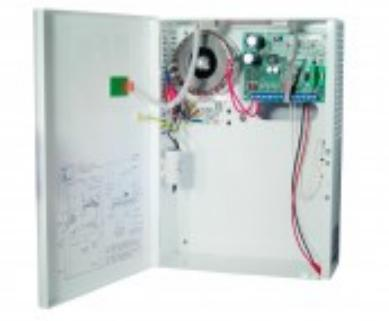

## PSV 1225-18

## Strömförsörjning, VIP, 12 V 2,5 A

## **Produktdetajler:**

| Godkännanden                     | EN 6100-6:2007 EN 61000-6-3:2007+A1, EN 60950-1:2006 + A11 +A12+A2 |
|----------------------------------|--------------------------------------------------------------------------|
| Matningsspänning                 | 230 VAC                                                                  |
| Utspänning                       | 13,8 VDC                                                                 |
| Belastning                       | 2,5 A                                                                    |
| Plats för ackumulator (ingår ej) | 12 V/18 Ah                                                               |
| Sabotageskydd                    | Öppnings- och avstängningsbrytare                                        |
| Kapsling                         | Metall                                                                   |
| Färg                             | Vit                                                                      |
| Mått (L x B x H) mm              | 300 x 230 x 100                                                          |

Strömförsörjningsaggregat med ViP (Voltage in Parallel) funktion, 12 VDC 2,5 A.Strömförsörjningsaggregat med ViP funktion kan parallellkopplas för att ge redundans samt kompensera för spänningsfall i kablaget. Plats för en 12 V 18 Ah ackumulator. Sabotagekontakt. Enheten har skydd mot kortslutning och överbelastning. Indikering för nätbortfall, låg utspänning, batterifel samt säkringsfel sker med LED och aktiverar separata utgångar med reläer.

## **BESTÄLLINGSINFORMATION**

**Typ E-nr Beskrivning**

Powered by TCPDF (www.tcpdf.org)

PSV 1225-18 5255013 Strömförsörjning, VIP, 12 V 2,5 A