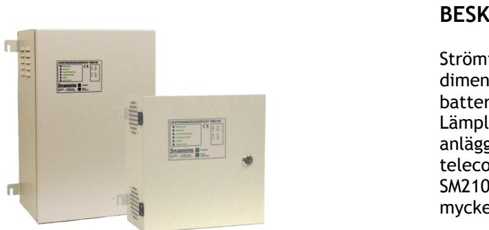
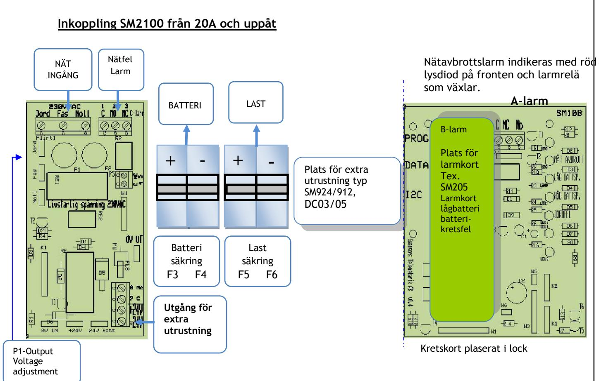

## SM2100 LADDNINGSLIKRIKTARE MED PLATS FÖR BATTERIER

Skydd: Aggregatet är skyddad mot överbelastning och kortslutning. Inbyggt skydd mot djupurladdning av batterierna. Nät, last och batteri skyddas av säkringar. Indikeringar och larm: Nätspänning indikeras med grön lysdiod på fronten och larm med röd.

Larmrelä med växlande, spänningsfria kontakter.

### **EXTRAUTRUSTNING**

**Larmkort:** Alla modeller kan enkelt förses med larmkort för låg/hög batterispänning, jordfel, batteriövervakning och digitalinstrument. **Säkringskort SM925:** Ger 5st 2-poligt avsäkrade utgångar med indikering och reläutgång med växlande kontakter. "Klickas" fast på DIN-skena. **DC/DC omv. DC3/5:** Ger 2st 2-poligt utgångar med 12VDC 3A alt. 5A. Utspänningen är justerbar mellan 5-20V. "Klickas" fast på DIN-skena. **Sabotageskydd:** Sabotagekontakt monteras i förborrade hål.

**Högre kapslingsklass:** Alla modeller kan beställas i IP55 utförande, dock kan storlekarna avvika från tabellen.

## **BESKRIVNING**

Strömförsörjningsaggregat med kompakta dimensioner och enkel inkoppling. Har plats för batterier från 7Ah upp till 100 Ah. Lämplig för drift av alla typer av svagströmsanläggningar som elektronikutrustningar, telecom, larm, styr, och passagesystem. SM2100 är primärwitchad, högeffektiv och har mycket lågt rippel och noggrann utspänning.  **Strömförsörjning med plats för batteri**

> **Utförande:** Aggregatet är utfört i robust vit plåtkapsling med nätindikering på fronten. Kan enkelt förses med larmkort för olika typer av fellarm. Är vid leverans försedd med nätavbrottslarm. Fyra stycken genomförningar uppåt. Aggregaten kan även förses med avsäkringskort och DC/DC omvandlare som snäppes fast på DIN-skena.

### **TEKNISKA DATA**

| Inspänning | 88-265VAC +/- 15%                           |
|------------|---------------------------------------------|
|            | 1 fas 50-60Hz                               |
| Reglering  | max 0,6 %                                   |
|            | Rippelspänn. max 0,5 % av                   |
|            | utspänningen                                |
| Temp.omr-  | -20 – 50 C                                  |
|            | CE-märkt enligt EN61000-6-2 och EN61000-6-3 |

| E-Nummer | Typ    | Beskrivning | Utspänning, ström, batteriplats HxBxDj mm                 |
|----------|--------|-------------|--------------------------------------------------------------|
| 5247170  | 210 54 |             | 320x320x150 LADDN LIKR SM2100 12V 5A utan batt max 24AH   |
| 5247171  | 210 56 |             | 400x400x210 LADDN LIKR SM2100 12V 10A utan batt max 90AH  |
| 5247172  | 210 58 |             | 400x400x210 LADDN LIKR SM2100 12V 20A utan batt max 90AH  |
| 5247174  | 210 62 |             | 320x320x150 LADDN LIKR SM2100 24V 5A utan batt max 12Ah   |
| 5247175  | 210 64 |             | 400x400x210 LADDN LIKR SM2100 24V 5A utan batt max 45Ah   |
| 5247176  | 210 65 |             | 600x400x260 LADDN LIKR SM2100 24V 5A utan batt max 100Ah  |
| 5247177  | 210 66 |             | 400x400x210 LADDN LIKR SM2100 24V 10A utan batt max 45Ah  |
| 5247178  | 210 68 |             | 600x400x260 LADDN LIKR SM2100 24V 10A utan batt max 100Ah |
| 5247179  | 21070  |             | LADDN LIKR SM2100 24V 20A utan batt max 45Ah 400x400x210  |
| 5247180  | 210 72 |             | LADDN LIKR SM2100 24V 20A utan batt max 100Ah 600x400x260 |
| 5247181  | 210 74 |             | LADDN LIKR SM2100 48V 2,5A utan batt max 12AH 400x400x210 |
| 5247182  | 210 77 |             | LADDN LIKR SM2100 48V 5A utan batt max 33AH 600x400x260   |
| 5247183  | 210 80 |             | 600x400x260 LADDN LIKR SM2100 48V 10A utan batt max 33AH  |
|          |        |             |                                                              |

Postadress/Postal address **Swansons Telemekanik AB** Hålstensvägen 4 SE-446 37 Älvängen

Telefon nr/Telephone no +46(0)303-746 320 Hemsida/Webb www.swtm.se

e-post

info@swtm.se

VAT.NO SE556289017701

# SM2100 LADDNINGSLIKRIKTARE MED PLATS FÖR BATTERIER

#### **SÄKERHET**

Endast auktoriserad och erfaren personal inom AC och DC får använda, arbeta,  **SM40 Strömförsörjning med plats för batteri**

serva/underhålla, installera denna enhet. Endast isolerade verktyg får användas i enheten. Observera att farliga spänningar och strömmar förekommer i apparaten både när interna säkringarna är av eller på.

Denna instruktion skall läsas igenom grundligt och förstås av all handhavande personal. Vid minsta tveksamhet om systemets uppbyggnad, funktion, komponenter samt säkerhet skall leverantören kontaktas.

Kontrollera att kretskort sitter fast och inte är transportskadade

**INKOPPLING SM2100 5-10A** 

# **INKOPPLING**

- Montera aggregatet fritt. Minst 100mm på varje sida.
- Anslut först 230V AC.
- Lysdiod för nätspänning tänds. Kontrollera att utspänningen är riktig.
- Vid behov justera utspänningen med V1 på likriktarkortet..
- Om lysdiod för nätindikering ej tänds kontrollera inspänning och ingångssäkringarna.
- Anslut batterierna och därefter lasten.
- Löser utgångssäkringarna, kontrollera inkoppling och inkopplade apparater**.**

Inspänning 88-265VAC +/- 15%

### **TEKNISKA DATA**

| Utspänning12V Nätfel Utspänning24V NÄT LAST Larm BATTERI Utspänning48V INGÅNG | 1 fas 50-60Hz 13,7V +/- 0,05V 27,3V +/- 0,1V 54,6V +/- 0,1V                                                                                                                               |
|-------------------------------------------------------------------------------------------------------|----------------------------------------------------------------------------------------------------------------------------------------------------------------------------------------------------|
| Plats för Plats för extra utrustning typ SM925, DC03/05 Utgång för extra utrustning    | Nätavbrottslarm indikeras med röd lysdiod på fronten och larmrelä som växlar. A-larm B-larm Plats för larmkort Tex. SM205 Larmkort lågbatteri batteri kretsfel |
| P1-Output Voltage adjustment                                                                    | Kretskort plaserat i lock                                                                                                                                                                          |

Postadress/Postal address **Swansons Telemekanik AB** Hålstensvägen 4 SE-446 37 Älvängen

Telefon nr/Telephone no +46(0)303-746 320 Hemsida/Webb www.swtm.se e-post info@swtm.se VAT.NO SE556289017701 SM2100

LADDNINGSLIKRIKTARE MED PLATS FÖR BATTERIER

| Modell          | Säkring F1, F2 | Säkring S3, S4 BATTERI | Säkring S5, S6 LAST |
|-----------------|----------------|---------------------------|---------------------|
| SM2000 12V 5A   | 1AT Cer        | 6AT                       | 5AT                 |
| SM2000 12V 10A  | 2AT Cer        | 13AT                      | 10AT                |
| SM2000 12V 20A  | 4AT Cer        | 25AT                      | 20AT                |
| SM2000 24V 5A   | 2AT Cer        | 6AT                       | 5AT                 |
| SM2000 24V 10A  | 4AT Cer        | 13AT                      | 10AT                |
| SM2000 24V 20A  | 6,3AT Cer      | 20AT                      | 25AT                |
| SM2000 48V 2,5A | 2AT Cer        | 6AT                       | 4AT                 |
| SM2000 48V 5A   | 4AT Cer        | 6AT                       | 5AT                 |
| SM2000 48V 10A  | 6,3AT Cer      | 13AT                      | 10AT                |

Postadress/Postal address **Swansons Telemekanik AB** Hålstensvägen 4 SE-446 37 Älvängen

Telefon nr/Telephone no +46(0)303-746 320 Hemsida/Webb www.swtm.se e-post info@swtm.se VAT.NO SE556289017701