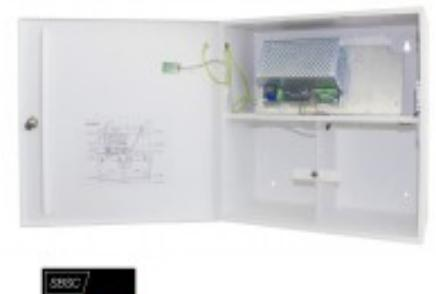

# PSV 2465-40

## Strömförsörjning, VIP, 24 V 6,5 A

#### **Produktdetajler:**

| EN50131-6:2008 + A1:2014 Grade 3, EN 6100-6:2007 EN 61000-6-3:2007+A1, EN 60950-1:2006 + A11 +A12+A2, SBSC 16-16 Klass 2/3 |
|----------------------------------------------------------------------------------------------------------------------------------------|
| 230 VAC                                                                                                                                |
| 26,7 VDC                                                                                                                               |
| 6,5 A                                                                                                                                  |
| två 12 V/40 Ah                                                                                                                         |
| Öppnings- och avstängningsbrytare                                                                                                      |
| Metall                                                                                                                                 |
| Vit                                                                                                                                    |
| 440 x 425 x 200                                                                                                                        |
|                                                                                                                                        |

Strömförsörjningsaggregat med ViP (Voltage in Parallel) funktion, 24 VDC 6,5 A. Strömförsörjningsaggregat med ViP funktion kan parallellkopplas för att ge mer ström, redundans samt kompensera för spänningsfall i kablaget. Plats för två 12 V 40 Ah ackumulatorer samt säkringskort PSV 24FC-6. Sabotagekontakt. Enheten har skydd mot kortslutning och överbelastning. Indikering för nätbortfall, lågutspänning, batterifel samt säkringsfel sker med LED och aktiverar separata utgångar med reläer.

| BESTÄLLINGSINFORMATION |         |                                   |  |  |  |
|------------------------|---------|-----------------------------------|--|--|--|
| Typ                    | E-nr    | Beskrivning                       |  |  |  |
| PSV 2465-40            | 5240042 | Strömförsörjning, VIP, 24 V 6,5 A |  |  |  |

### **ALARMTECH SWEDEN AB**

### **Relaterade produkter och tillbehör:**

| 28097 Power X1, DC/DC Omvandlare MIN I 5-32 V -> 3.3-30 V |  |
|-----------------------------------------------------------------------------|--|
| 3097 Power X3, DC / DC Omvandlare 12-24 VDC -> 5V, 9V, 12V      |  |

Powered by TCPDF (www.tcpdf.org)