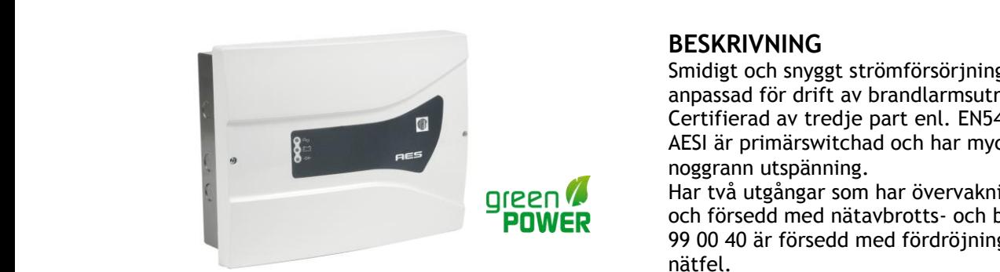
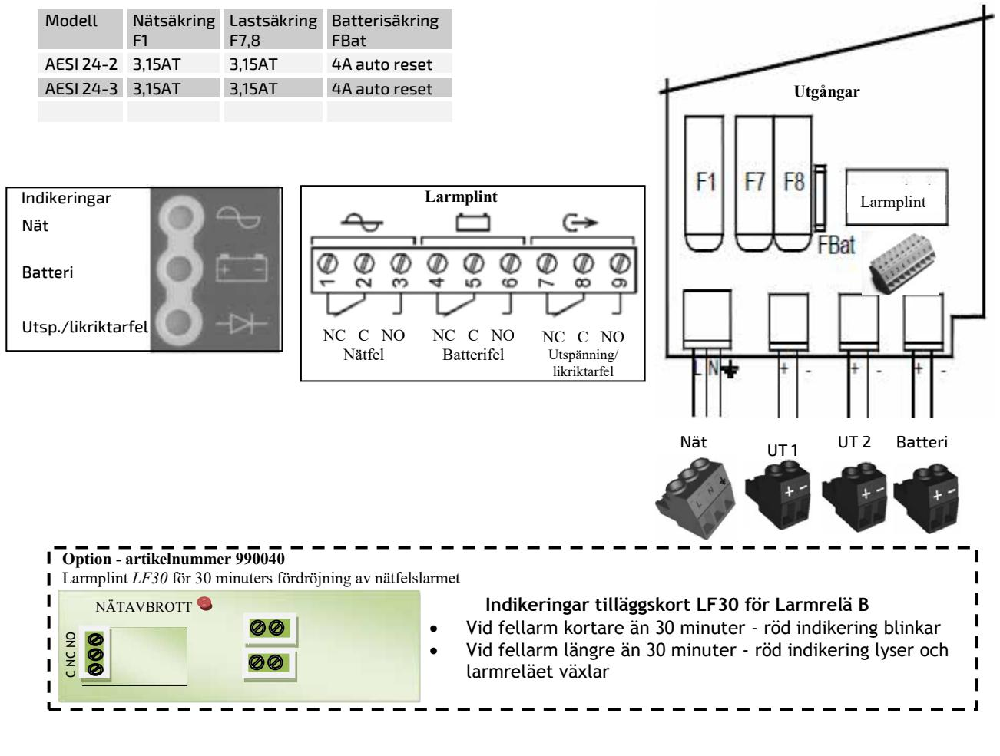

#### **Skydd**:

Aggregatet är skyddat mot överbelastning och kortslutning.

Inbyggt skydd mot djupurladdning av batterierna. Nät, last och batteri är skyddas av säkring.

#### **Indikeringar och larm**

| Drift:                                            | Indikeras med 3st gröna lysdioder.  |  |  |  |  |
|---------------------------------------------------|-------------------------------------|--|--|--|--|
| Nätfel:                                           | Indikeras med röd LED. Larm vid     |  |  |  |  |
|                                                   | nätavbrott eller spänning under     |  |  |  |  |
|                                                   | 195VAC. (1A 50V).                   |  |  |  |  |
| LF30                                              | Option - Fördröjning av nätfel i 30 |  |  |  |  |
|                                                   | minuter. Monteras i aggregatet      |  |  |  |  |
|                                                   | med plastdistanser.                 |  |  |  |  |
| Batterifel:                                       | Fel indikeras med röd LED vid       |  |  |  |  |
|                                                   | batterikretsfel eller impendansfel. |  |  |  |  |
|                                                   | Växlande potentialfritt larmrelä    |  |  |  |  |
|                                                   | (1A 50V).                           |  |  |  |  |
| Utsp./likriktarfel: Fel på utspänningen för UT1-2 |                                     |  |  |  |  |
|                                                   | indikeras med röd LED.              |  |  |  |  |
|                                                   | Växlande potentialfritt larmrelä    |  |  |  |  |
|                                                   | (1A 50V).                           |  |  |  |  |

## **BESKRIVNING**

Smidigt och snyggt strömförsörjningsaggregat anpassad för drift av brandlarmsutrustning. Certifierad av tredje part enl. EN54-4 AESI är primärswitchad och har mycket stabil och noggrann utspänning.

Har två utgångar som har övervakning och larm och försedd med nätavbrotts- och batterilarm. 99 00 40 är försedd med fördröjning av larm för nätfel.

#### **Utförande:**

Aggregaten är utförda i kiselgrå självventilerad plåtkapsling med vitt lock. Är avsett för väggmontage. Förberedd för 3st genomförningar nedåt samt 3st knockout i vänstra sidan. Plats för två underhållsfria blybatterier på max 12V 14Ah.

# **TEKNISKA DATA**

| Inspänning     | 88-265VAC        |
|----------------|------------------|
|                | 1 fas 50-60Hz    |
| Reglering      | max 0,6 %        |
| Rippelspänn.   | max 0,1 % av     |
|                | utspänningen     |
| Temp. omr.     | -15 – 40 C       |
| Kapslingsklass | IP30             |
| CE-märkt       | EN61000-6-3:2001 |
|                | EN61000-6-2:2005 |
| Certifieringar | EN54-4/A2        |
|                | EN12101-10       |
|                |                  |

NFS 61940

| E: nummer | Typ                    | Utspänning | Utström | Batterikapacitet I kapslingen / Max | Verkningsgrad | Egenförbrukning vid batteridrift | HxBxD           |
|-----------|------------------------|------------|---------|----------------------------------------|---------------|-------------------------------------|-----------------|
| 5240095   | AESI 24-3, C24 SB      | 27,3V      | 3A      | 7-14 / 7-38Ah                          | 0,85          | 75mA                                | 248 x 322 x 126 |
| 99 00 40  | AESI 24-3 C24 SB. LF30 | 27,3V      | 3A      | 7-12Ah / 7-38Ah                        | 0,84          | 75mA                                | 248 x 322 x 126 |
|           |                        |            |         |                                        |               |                                     |                 |

Postadress/Postal address **Swansons Telemekanik AB** Hålstensvägen 4 SE-446 37 Älvängen

Telefon nr/Telephone no +46(0)303-746 320

Hemsida/Webb

www.swtm.se e-post info@swtm.se

VAT.NO SE556289017701

## SÄKERHET

Endast auktoriserad och erfaren personal inom AC och DC får använda, arbeta, serva/underhålla, installera denna enhet.  **SM40 Strömförsörjning med plats för batteri**

> Endast isolerade verktyg får användas i enheten. Observera att farliga spänningar och strömmar förekommer i apparaten både när interna säkringarna är av eller på.

Denna instruktion skall läsas igenom grundligt och förstås av all handhavande personal. Vid minsta tveksamhet om systemets uppbyggnad, funktion, komponenter samt säkerhet skall leverantören kontaktas.

Kontrollera att kretskort sitter fast och inte är transportskadade.

Om batterier används är dessa alltid elektrokemiskt aktiva.

Kortslut inte batteripolerna.

## INKOPPLING

- Montera aggregatet fritt. Minst 100mm på varje sida.
- Lossa de två skruvarna i locket.
- Lätta försiktigt på locket och lossa bandkabeln till lysdiodskortet.
- Placera batterierna på avsedd plats i skåpet och anslut med batterikablarna.
- Anslut först 230V AC. Spänningsätt.
- 3st gröna LED tänds på fronten.
- Kontrollera att utspänningen är riktig.
- Anslut därefter lasten.
- Löser utgångssäkringarna, kontrollera inkoppling och inkopplade apparater.
- Larmrelä ritade i olarmat läge.

Postadress/Postal address **Swansons Telemekanik AB** Hålstensvägen 4 SE-446 37 Älvängen

Telefon nr/Telephone no +46(0)303-746 320 Hemsida/Webb e-post

www.swtm.se info@swtm.se

VAT.NO SE556289017701