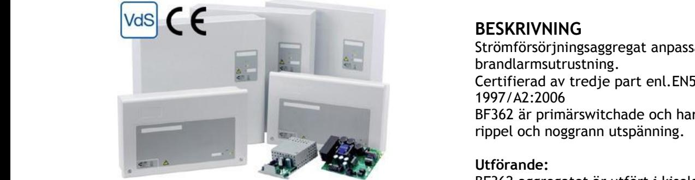
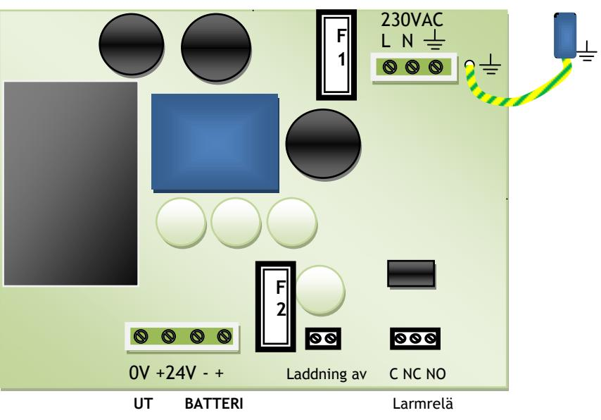

#### **Skydd**:

Aggregatet är skyddat mot överbelastning och kortslutning. Inbyggt skydd mot djupurladdning av batterierna.

Nät och batteri är skyddas av säkring.

#### **Indikeringar och larm**

| Drift:       | Indikeras med grön lysdiod.       |
|--------------|-----------------------------------|
| Fel:         | Indikeras med gul lysdiod.        |
|              | Växlande potentialfritt           |
|              | larmrelä (1A 50V).                |
| Externt fel: | Indikeras med gul lysdiod.        |
| Fellarm:     | Fel indikeras vid batterikretsfel |

### **EXTRAUTRUSTNING**

eller laddarfel.

Plats finns för eftermontage av ex. SM925 avsäkringskort m. 5 grupper. SM950 larmdonskort och I/O enheter.

### **BESKRIVNING**

Strömförsörjningsaggregat anpassad för drift av brandlarmsutrustning. Certifierad av tredje part enl.EN54-4; 1997/A2:2006 BF362 är primärswitchade och har mycket lågt rippel och noggrann utspänning.

#### **Utförande:**

BF362 aggregatet är utfört i kiselgrå självventilerad plåtkapsling och avsett för väggmontage.

Förberedd för 4st genomförningar uppåt. Kapslingsklass IP30.

Plats för underhållsfria blybatterier.

### **TEKNISKA DATA**

Temp.omr- -15 – 40 C

Inspänning 230VAC +/- 15% 1 fas 50-60Hz Reglering max 0,6 % Rippelspänn. max 0,1 % av utspänningen CE-märkt EN61000-6-3:2001 EN61000-6-2:2005 Certifieringar EN54-4/A2:2006

| E-Nummer | Typ         | Byglings-alternativ          | Utsp | Utström     | Batterikapacit max | Batteri plats internt | Internförb. batteridrift | HxBxD mm        |
|----------|-------------|------------------------------|------|-------------|-----------------------|--------------------------|-----------------------------|-----------------|
| 5250005  | BF362-1     | Alt. a                       | 24V  | 1A          | 10Ah                  | max 2x 18Ah              |                             | 404 x 404 x 110 |
|          |             | Alt. b                       | 24V  | 0,5A        | 20Ah                  | max 2x 18Ah              |                             | 404 x 404 x 110 |
| 5250006  | BF362-5     |                              | 24V  | 4A          | 20Ah                  | max 2x 18Ah              | 22mA                        | 404 x 404 x 110 |
|          |             |                              |      |             |                       |                          |                             |                 |
| 5247057  | SM950       | Larmdonskort                 |      | 5 Utgångar  |                       |                          |                             |                 |
|          |             |                              |      |             |                       |                          |                             |                 |
|          | LF30- BF | Larmfördröjning 30minuter |      | för BF362-5 |                       |                          |                             |                 |
|          |             |                              |      |             |                       |                          |                             |                 |

Postadress/Postal address Swansons Telemekanik AB Hålstensvägen 4 SE-446 37 Älvängen

Telefon nr/Telephone no +46(0)303-746 320 Hemsida/Webb www.swtm.se

Telefax nr/Telefax no +46(0)303-748 490 e-post info@swtm.se

VAT.NO SE556289017701

## **SÄKERHET**

Endast auktoriserad och erfaren personal inom AC och DC får använda, arbeta,  **SM40** 

serva/underhålla, installera denna enhet. Endast isolerade verktyg får användas i enheten. Observera att farliga spänningar och strömmar förekommer i apparaten både när interna säkringarna är av eller på.  **Strömförsörjning med plats för batteri**

> Denna instruktion skall läsas igenom grundligt och förstås av all handhavande personal. Vid minsta tveksamhet om systemets uppbyggnad, funktion, komponenter samt säkerhet skall leverantören kontaktas.

> Kontrollera att kretskort sitter fast och inte är transportskadade.

Om batterier används är dessa alltid elektrokemiskt aktiva. Kortslut inte batteripolerna.

| Modell  | Nätsäkring F1 | Batt.säkring F2 |
|---------|---------------|-----------------|
| BF362-1 | 1AT Cer       | 3,15AT          |
| BF362-5 | 2AT Cer       | 5AS             |

## **INKOPPLING**

- Montera aggregatet fritt. Minst 100mm på varje sida.
- Anslut först 230V AC.
- Lysdiod för nätspänning tänds. Kontrollera att utspänningen är riktig.
- Spänningsjustering skall ej göras den är inställd från fabrik.
- Om lysdiod för nätindikering ej tänds kontrollera inspänning och ingångssäkringarna.
- Anslut batterierna och därefter lasten.
- Löser utgångssäkringarna, kontrollera inkoppling och inkopplade apparater**.**

# **TEKNISKA DATA**

| Inspänning | 230VAC +/- 15%          |  |  |
|------------|-------------------------|--|--|
|            | 1 fas 50-60Hz           |  |  |
| Utspänning | 24V (27,3V +/- 0,2V) |  |  |
| Temp.omr-  | -15 – 40 C              |  |  |

Postadress/Postal address Swansons Telemekanik AB Hålstensvägen 4 SE-446 37 Älvängen

Telefon nr/Telephone no +46(0)303-746 320 Hemsida/Webb www.swtm.se

Telefax nr/Telefax no +46(0)303-748 490 e-post info@swtm.se

VAT.NO SE556289017701