# **EN Online UPS**

PowerWalker VFI 1000CRM LCD PowerWalker VFI 2000CRM LCD PowerWalker VFI 3000CRM LCD

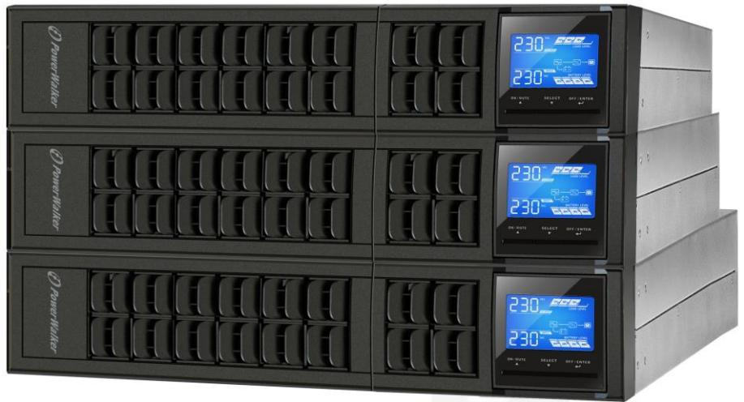

Manual

Uninterruptible Power Supply System

| 1-1. Transportation                   | 1  |
|------------------------------------------|----|
| 1-2. Preparation                      | 1  |
| 1-3. Installation                     | 1  |
| 1-4. Operation                           | 1  |
| 1-5. Maintenance, service and faults  | 2  |
| 2. Installation and setup             | 3  |
| 2-1. Rear panel view                     | 3  |
| 2-2. 1-3K Setup the UPS               | 4  |
| 2-3. UPS Tower/Rack Installation      | 6  |
| 3. Operations                         | 7  |
| 3-1. Button operation                    | 7  |
| 3-2. LCD Panel                        | 7  |
| 3-3. Audible Alarm                       | 9  |
| 3-4. LCD display wordings index       | 9  |
| 3-5. UPS Setting                      | 9  |
| 3-6. Operating Mode Description       | 12 |
| 3-7. Faults Reference Code               | 13 |
| 3-8. Warning indicator                | 13 |
| 4. Troubleshooting                       | 14 |
| 5. Storage and Maintenance               | 16 |
| 6. Specifications                     | 17 |
|                                          |    |

Please comply with all warnings and operating instructions in this manual strictly. Save this manual properly and read carefully the following instructions before installing the unit. Do not operate this unit before reading through all safety information and operating instructions carefully

#### **1-1. Transportation**

- Please transport the UPS system only in the original package to protect against shock and impact.
#### **1-2. Preparation**

- Condensation may occur if the UPS system is moved directly from cold to warm environment. The UPS system must be absolutely dry before being installed. Please allow at least two hours for the UPS system to acclimate the environment.
- Do not install the UPS system near water or in moist environments.
- Do not install the UPS system where it would be exposed to direct sunlight or near heater.
- Do not block ventilation holes in the UPS housing.

#### **1-3. Installation**

- Do not connect appliances or devices which would overload the UPS system (e.g. laser printers) to the UPS output sockets.
- Place cables in such a way that no one can step on or trip over them.
- Do not connect domestic appliances such as hair dryers to UPS output sockets.
- The UPS can be operated by any individuals with no previous experience.
- Connect the UPS system only to an earthed shockproof outlet which must be easily accessible and close to the UPS system.
- Please use only VDE-tested, CE-marked mains cable (e.g. the mains cable of your computer) to connect the UPS system to the building wiring outlet (shockproof outlet).
- Please use only VDE-tested, CE-marked power cables to connect the loads to the UPS system.
- When installing the equipment, it should ensure that the sum of the leakage current of the UPS and the connected devices does not exceed 3.5mA.

#### **1-4. Operation**

- Do not disconnect the mains cable on the UPS system or the building wiring outlet (shockproof socket outlet) during operations since this would cancel the protective earthing of the UPS system and of all connected loads.
- The UPS system features its own, internal current source (batteries). The UPS output sockets or output terminals block may be electrically live even if the UPS system is not connected to the building wiring outlet.
- In order to fully disconnect the UPS system, first press the OFF/Enter button to disconnect the mains.
- Prevent no fluids or other foreign objects from inside of the UPS system.

#### **1-5. Maintenance, service and faults**

- The UPS system operates with hazardous voltages. Repairs may be carried out only by qualified maintenance personnel.
- **Caution** risk of electric shock. Even after the unit is disconnected from the mains (building wiring outlet), components inside the UPS system are still connected to the battery and electrically live and dangerous.
- Before carrying out any kind of service and/or maintenance, disconnect the batteries and verify that no current is present and no hazardous voltage exists in the terminals of high capability capacitor such as BUS-capacitors.
- Only persons are adequately familiar with batteries and with the required precautionary measures may replace batteries and supervise operations. Unauthorized persons must be kept well away from the batteries.
- **Caution -** risk of electric shock. The battery circuit is not isolated from the input voltage. Hazardous voltages may occur between the battery terminals and the ground. Before touching, please verify that no voltage is present!
- Batteries may cause electric shock and have a high short-circuit current. Please take the precautionary measures specified below and any other measures necessary when working with batteries:
	- -remove wristwatches, rings and other metal objects
	- -use only tools with insulated grips and handles.
- When changing batteries, install the same number and same type of batteries.
- Do not attempt to dispose of batteries by burning them. This could cause battery explosion.
- Do not open or destroy batteries. Escaping electrolyte can cause injury to the skin and eyes. It may be toxic.
- Please replace the fuse only with the same type and amperage in order to avoid fire hazards.
- Do not dismantle the UPS system.

## **2. Installation and setup**

**NOTE:** Before installation, please inspect the unit. Be sure that nothing inside the package is damaged. Please keep the original package in a safe place for future use.

**NOTE:** There are two different types of online UPS: standard and long-run models. Please refer to the following model table.

| Model                       | Type              | Model                        | Type     |
|-----------------------------|-------------------|------------------------------|----------|
| PowerWalker VFI 1000CRM LCD | Standard model | PowerWalker VFI 1000CRM LCDL |          |
| PowerWalker VFI 2000CRM LCD |                   | PowerWalker VFI 2000CRM LCDL | Long-run |
| PowerWalker VFI 3000CRM LCD |                   | PowerWalker VFI 3000CRM LCDL | model    |

#### **2-1. Rear panel view**

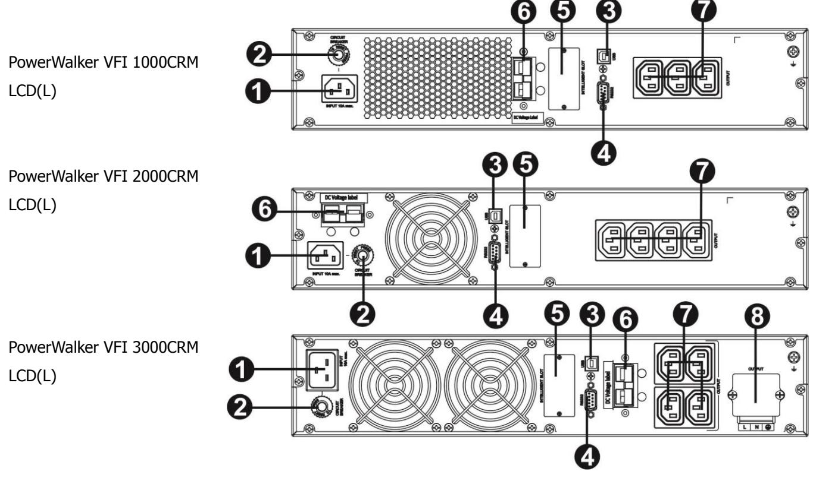

1.AC input 5.SNMP intelligent slot (option)

- 2.Input circuit breaker 6.External battery connection
- -
- 3.USB communication port 7.Output receptacles
- 4.RS-232 communication port 8.Output terminal

#### **2-2. 1-3K Setup the UPS**

**Step 1: External battery connection** (Only for long-run models)

This UPS is not including batteries. Please connect external batteries as below chart.

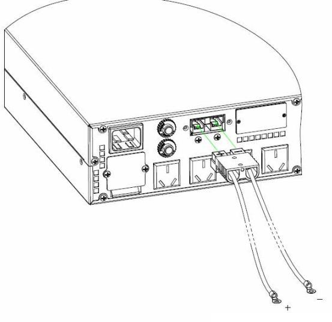

To external battery

#### **Step 2: Connect battery wires**

For safety consideration, the UPS is shipped out from factory without connecting battery wires. Before install the UPS, please follow below steps to re-connect battery wires first.

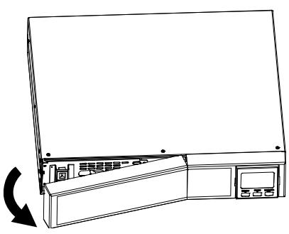

Remove front panel. Connect the AC input and

**Step 1 Step 2 Step 3**

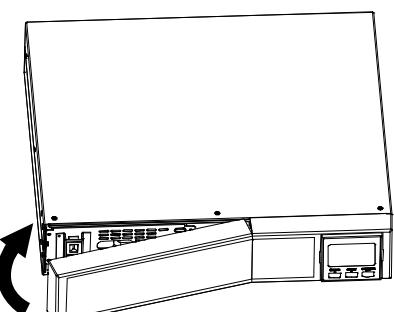

Put the front panel back to the unit.

#### **Step 3: UPS input connection**

Plug the UPS into a two-pole, three-wire, grounded receptacle only. Avoid using extension cords. The power cord is supplied in the UPS package.

re-connect battery wires.

#### **Step 4: UPS output connection**

- For socket-type outputs, simply connect devices to the outlets.
- For terminal-type input or outputs, please follow below steps for the wiring configuration:
	- a) Remove the small cover of the terminal block
	- b) Suggest using AWG14 or 2.1mm2 power cords for 3KVA model.
	- c) Upon completion of the wiring configuration, please check whether the wires are securely affixed.
	- d) Put the small cover back to the rear panel.

#### **Step 5: Communication connection Communication port: USB port RS-232 port Intelligent slot**

To allow for unattended UPS shutdown/start-up and status monitoring, connect the communication cable one end to the USB/RS-232 port and the other to the communication port of your PC. With the monitoring software installed, you can schedule UPS shutdown/start-up and monitor UPS status through PC.

The UPS is equipped with intelligent slot perfect for either SNMP or AS400 card. When installing either SNMP or AS400 card in the UPS, it will provide advanced communication and monitoring options.

#### **PS. USB port and RS-232 port can't work at the same time.**

#### **Step 6: Turn on the UPS**

Press the ON/Mute button on the front panel for two seconds to power on the UPS.

- Note: The battery charges fully during the first five hours of normal operation. Do not expect full battery run capability during this initial charge period.
#### **Step 7: Install software**

For optimal computer system protection, install UPS monitoring software to fully configure UPS shutdown. You may insert provided CD into CD-ROM to install the monitoring software. If not, please follow steps below to download and install monitoring software from the internet: 1. Go to the website

**http://www.powerwalker.com/index.php?lang=&page=viewpower**

2. Click ViewPower software icon and then choose your required OS to download the software.

- 3. Follow the on-screen instructions to install the software.
4. When your computer restarts, the monitoring software will appear as an orange plug icon located in the system tray, near the clock.

#### **2-3. UPS Tower/Rack Installation**

#### **Rack-mount Installation**

This UPS can be mounted in the 19" rack chassis. Please follow below steps to position this UPS. **Step 1 Step 2**

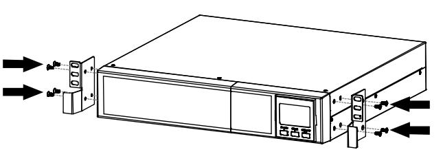

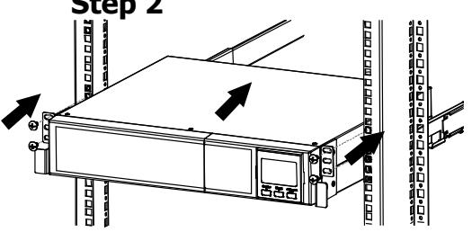

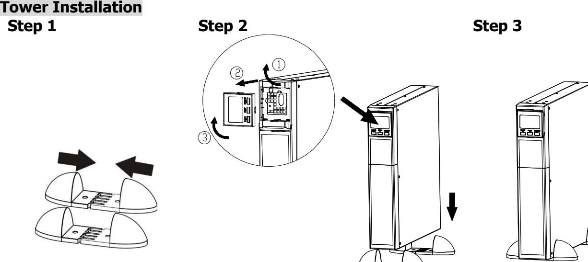

#### **3. Operations**

#### **3-1. Button operation**

| Button                     | Function                                                                                                                                                                                                                                                                                                                                                                                                                                                                                                                                                                                       |
|----------------------------|------------------------------------------------------------------------------------------------------------------------------------------------------------------------------------------------------------------------------------------------------------------------------------------------------------------------------------------------------------------------------------------------------------------------------------------------------------------------------------------------------------------------------------------------------------------------------------------------|
| ON/Mute Button             |  Turn on the UPS: Press and hold ON/Mute button for at least 2 seconds to turn on the UPS. Mute the alarm: When the UPS is on battery mode, press and hold this  button for at least 5 seconds to disable or enable the alarm system. But it's not applied to the situations when warnings or errors occur. Up key: Press this button to display previous selection in UPS setting  mode.  Switch to UPS self-test mode: Press and hold ON/Mute button for 5 seconds to enter UPS self-testing while in AC mode, ECO mode, or converter mode. |
| OFF/Enter Button           | Turn off the UPS: Press and hold this button at least 2 seconds to turn off  the UPS. UPS will be in standby mode under power normal or transfer to Bypass mode if the Bypass enable setting by pressing this button.  Confirm selection key: Press this button to confirm selection in UPS setting mode.                                                                                                                                                                                                                                                                  |
| Select Button              |  Switch LCD message: Press this button to change the LCD message for input voltage, input frequency, battery voltage, output voltage and output frequency. It will return back to default display when pausing for 10 seconds. Setting mode: Press and hold this button for 5 seconds to enter UPS  setting mode when UPS is in standby mode or bypass mode. Down key: Press this button to display next selection in UPS setting mode.                                                                                                                       |
| ON/Mute + Select Button |  Switch to bypass mode: When the main power is normal, press ON/Mute and Select buttons simultaneously for 5 seconds. Then UPS will enter to bypass mode. This action will be ineffective when the input voltage is out of acceptable range.                                                                                                                                                                                                                                                                                                                                      |

#### **3-2. LCD Panel**

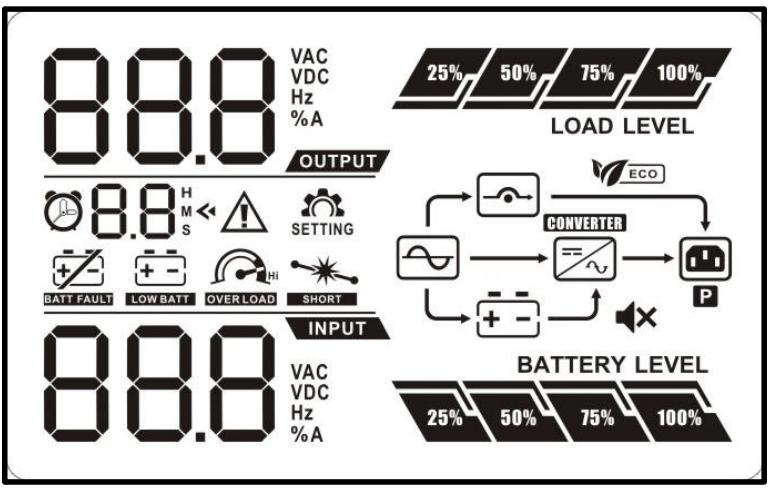

| Display                              | Function                                                                                                                      |  |  |  |  |  |  |
|--------------------------------------|-------------------------------------------------------------------------------------------------------------------------------|--|--|--|--|--|--|
| Remaining backup time information    |                                                                                                                               |  |  |  |  |  |  |
|                                      | Indicates the remaining backup time in pie chart.                                                                       |  |  |  |  |  |  |
|                                      | Indicates the remaining backup time in numbers. H: hours, M: minute, S: second                                          |  |  |  |  |  |  |
| Fault information                    |                                                                                                                               |  |  |  |  |  |  |
|                                      | Indicates that the warning and fault occurs.                                                                                  |  |  |  |  |  |  |
|                                      | Indicates the warning and fault codes, and the codes are listed in details in 3-5 section.                                 |  |  |  |  |  |  |
| Mute operation                       |                                                                                                                               |  |  |  |  |  |  |
|                                      | Indicates that the UPS alarm is disabled.                                                                                     |  |  |  |  |  |  |
| Output & Battery voltage information |                                                                                                                               |  |  |  |  |  |  |
|                                      | Indicates the output voltage, frequency or battery voltage. Vac: output voltage, Vdc: battery voltage, Hz: frequency       |  |  |  |  |  |  |
| Load information                     |                                                                                                                               |  |  |  |  |  |  |
|                                      | Indicates the load level by 0-25%, 26-50%, 51-75%, and 76-100%.                                                               |  |  |  |  |  |  |
|                                      | Indicates overload.                                                                                                           |  |  |  |  |  |  |
|                                      | Indicates the load or the UPS output is short circuit.                                                                        |  |  |  |  |  |  |
| Mode operation information           |                                                                                                                               |  |  |  |  |  |  |
|                                      | Indicates the UPS connects to the mains.                                                                                      |  |  |  |  |  |  |
|                                      | Indicates the battery is working.                                                                                             |  |  |  |  |  |  |
|                                      | Indicates the bypass circuit is working.                                                                                      |  |  |  |  |  |  |
|                                      | Indicates the ECO mode is enabled.                                                                                            |  |  |  |  |  |  |
|                                      | Indicates the Inverter circuit is working.                                                                                    |  |  |  |  |  |  |
|                                      | Indicates the output is working.                                                                                              |  |  |  |  |  |  |
| Battery information                  |                                                                                                                               |  |  |  |  |  |  |
|                                      | Indicates the Battery level by 0-25%, 26-50%, 51-75%, and 76-100%.                                                         |  |  |  |  |  |  |
|                                      | Indicates the battery is fault.                                                                                               |  |  |  |  |  |  |
|                                      | Indicates low battery level and low battery voltage.                                                                          |  |  |  |  |  |  |
| Input & Battery voltage information  |                                                                                                                               |  |  |  |  |  |  |
|                                      | Indicates the input voltage or frequency or battery voltage. Vac: Input voltage, Vdc: battery voltage, Hz: input frequency |  |  |  |  |  |  |

**EN**

#### **3-3. Audible Alarm**

| Description  | Buzzer status               | Muted |
|--------------|-----------------------------|-------|
| Battery Mode | Sounding every 4 seconds    |       |
| Low Battery  | Sounding every second       |       |
| Overload     | Sounding twice every second | Yes   |
| Fault        | Continuously sounding       |       |
| Bypass Mode  | Sounding every 10 seconds   |       |

#### **3-4. LCD display wordings index**

| Abbreviation | Display content | Meaning                   |
|--------------|-----------------|---------------------------|
| ENA          |                 | Enable                    |
| DIS          |                 | Disable                   |
| ESC          |                 | Escape                    |
| HLS          |                 | High loss                 |
| LLS          |                 | Low loss                  |
| BAT          |                 | Battery                   |
| CF           |                 | Converter                 |
| TP           |                 | Temperature               |
| CH           |                 | Charger                   |
| FU           |                 | Bypass frequency unstable |
| EE           |                 | EEPROM error              |

### **3-5. UPS Setting**

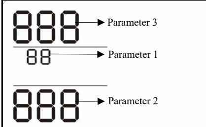

UPS.

Parameter 2 There are three parameters to set up the Parameter 1: It's for program alternatives. Refer to below table. Parameter 2 and parameter 3 are the setting options or values for each program.

#### **01: Output voltage setting**

| Interface | Setting                                                |
|-----------|--------------------------------------------------------|
|           | Parameter 3: Output voltage                            |
|           | For 200/208/220/230/240 VAC models, you may choose     |
|           | the following output voltage:                          |
|           | 200: presents output voltage is 200Vac              |
|           | 208: presents output voltage is 208Vac              |
|           | 220: presents output voltage is 220Vac              |
|           | 230: presents output voltage is 230Vac (Default) |
|           | 240: presents output voltage is 240Vac              |
|           | For 100/110/150/120/127 VAC models, you may choose     |
|           | the following output voltage:                          |
|           | 100: presents output voltage is 100Vac              |

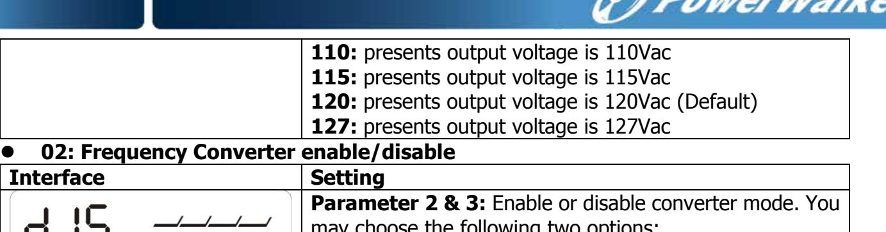

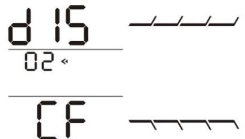

may choose the following two options: **CF ENA:** converter mode enable **CF DIS:** converter mode disable(Default)

#### **03: Output frequency setting**

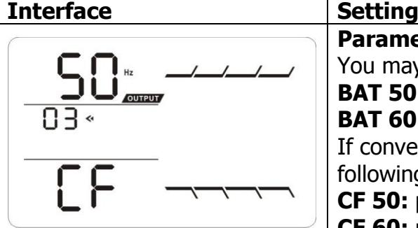

| Parameter 2 & 3: Output frequency setting.         |
|----------------------------------------------------|
| You may set the initial frequency on battery mode: |
| BAT 50: presents output frequency is 50Hz       |
| BAT 60: presents output frequency is 60Hz       |
| If converter mode is enabled, you may choose the   |
| following output frequency:                        |
| CF 50: presents output frequency is 50Hz           |
| CF 60: presents output frequency is 60Hz           |
|                                                    |

#### **04: ECO enable/disable**

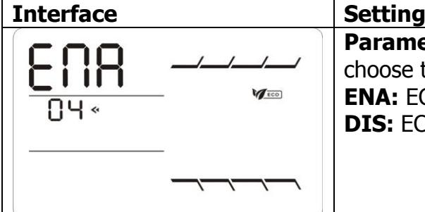

| Parameter 3: Enable or disable ECO function. You may |
|------------------------------------------------------|
| choose the following two options:                    |
| ENA: ECO mode enable                              |
| DIS: ECO mode disable (Default)                   |
|                                                      |

#### **05: ECO voltage range setting**

| Interface | Setting                                                                                                                                                                                                                                                                                                                                                                                                                                                                                                                                                                                                                                                                                                                                  |
|-----------|------------------------------------------------------------------------------------------------------------------------------------------------------------------------------------------------------------------------------------------------------------------------------------------------------------------------------------------------------------------------------------------------------------------------------------------------------------------------------------------------------------------------------------------------------------------------------------------------------------------------------------------------------------------------------------------------------------------------------------------|
|           | Parameter 2 & 3: Set the acceptable high voltage point and low voltage point for ECO mode by pressing Down key or Up key. HLS: High loss voltage in ECO mode in parameter 2. For 200/208/220/230/240 VAC models, the setting range in parameter 3 is from +7V to +24V of the nominal voltage. (Default: +12V) For 100/110/115/120/127 VAC models, the setting range in parameter 3 is from +3V to +12V of the nominal voltage. (Default: +6V) LLS: Low loss voltage in ECO mode in parameter 2. For 200/208/220/230/240 VAC models, the setting range in parameter 3 is from -7V to -24V of the nominal voltage. (Default: -12V) For 100/110/115/120/127 VAC models, the setting voltage |

in parameter 3 is from -3V to -12V of the nominal voltage. (Default: -6V)

#### **06: Bypass enable/disable when UPS is off**

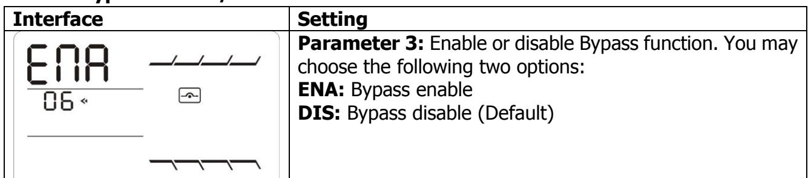

#### **07: Bypass voltage range setting**

| and acceptable low voltage point for Bypass mode by pressing the Down key or Up key. HLS: Bypass high voltage point For 200/208/220/230/240 VAC models:                                                                                                                                                                                                                                                                             | Interface | Setting                                                                                                                                                                          |
|-------------------------------------------------------------------------------------------------------------------------------------------------------------------------------------------------------------------------------------------------------------------------------------------------------------------------------------------------------------------------------------------------------------------------------------------------|-----------|----------------------------------------------------------------------------------------------------------------------------------------------------------------------------------|
| from 230Vac to 264Vac. (Default: 264Vac) For 100/110/115/120/127 VAC models: 115-132: setting the high voltage point in parameter 3 from 115Vac to 132Vac(Default: 132Vac) LLS: Bypass low voltage point For 200/208/220/230/240 VAC models: 170-220: setting the low voltage point in parameter 3 from 170Vac to 220Vac. (Default: 170Vac) For 100/110/115/120/127 VAC models: 95Vac to 110Vac. (Default: 95Vac) |           | Parameter 2 & 3: Set the acceptable high voltage point 230-264: setting the high voltage point in parameter 3 95-110: setting the low voltage point in parameter 3 from |

#### **8: Autonomy limitation setting**

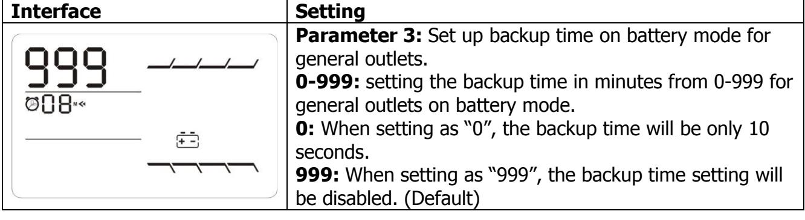

- **00: Exit setting**

|                             | 3-6. Operating Mode Description                                                                                                                                                        |             |
|-----------------------------|----------------------------------------------------------------------------------------------------------------------------------------------------------------------------------------|-------------|
| Operating mode              | Description                                                                                                                                                                            | LCD display |
| Online mode                 | When the input voltage is within acceptable range, UPS will provide pure and stable AC power to output. The UPS will also charge the battery at online mode.               |             |
| ECO mode                    | Energy saving mode: When the input voltage is within voltage regulation range, UPS will bypass voltage to output for energy saving.                                        |             |
| Frequency Converter mode | When input frequency is within 40 Hz to 70 Hz, the UPS can be set at a constant output frequency, 50 Hz or 60 Hz. The UPS will still charge battery under this mode.    |             |
| Battery mode                | When the input voltage is beyond the acceptable range or power failure and alarm is sounding every 4 second, UPS will backup power from battery.                              |             |
| Bypass mode                 | When input voltage is within acceptable range but UPS is overload, UPS will enter bypass mode or bypass mode can be set by front panel. Alarm is sounding every 10 second. |             |
| Standby mode                | UPS is powered off and no output supply power, but still can charge batteries.                                                                                                      |             |
|                             |                                                                                                                                                                                        |             |

**EN**

#### **3-7. Faults Reference Code**

| Fault event              | Fault code | Icon | Fault event              | Fault code | Icon |
|--------------------------|------------|------|--------------------------|------------|------|
| Bus start fail           | 01         | x    | Inverter output short    | 14         |      |
| Bus over                 | 02         | x    | Battery voltage too high | 27         |      |
| Bus under                | 03         | x    | Battery voltage too low  | 28         |      |
| Bus unbalance            | 04         | x    | Over temperature         | 41         | x    |
| Inverter soft start fail | 11         | x    | Over load                | 43         |      |
| Inverter voltage high    | 12         | x    | Charger failure          | 45         | x    |
| Inverter voltage Low     | 13         | x    |                          |            |      |

#### **3-8. Warning indicator**

| Warning                     | Icon (flashing) | Alarm                       |
|-----------------------------|-----------------|-----------------------------|
| Low Battery                 |                 | Sounding every second       |
| Overload                    |                 | Sounding twice every second |
| Battery is not connected |                 | Sounding every second       |
| Over Charge                 |                 | Sounding every second       |
| Over temperature            |                 | Sounding every second       |
| Charger failure             |                 | Sounding every second       |
| Battery fault               |                 | Sounding every second       |
| Out of bypass voltage range |                 | Sounding every second       |
| Bypass frequency unstable   |                 | Sounding every second       |
| EEPROM error                |                 | Sounding every second       |

| 4. Troubleshooting                                                                                                                |                                                                                                                                                                                                           |                                                                                            |  |
|-----------------------------------------------------------------------------------------------------------------------------------|-----------------------------------------------------------------------------------------------------------------------------------------------------------------------------------------------------------|--------------------------------------------------------------------------------------------|--|
| If the UPS system does not operate correctly, please solve the problem by using the table below.                                  |                                                                                                                                                                                                           |                                                                                            |  |
| Symptom                                                                                                                           | Possible cause                                                                                                                                                                                            | Remedy                                                                                     |  |
| No indication and alarm even though the mains is normal.                                                                       | The AC input power is not connected well.                                                                                                                                                              | Check if input power cord firmly connected to the mains.                    |  |
|                                                                                                                                   | The AC input is connected to the UPS output.                                                                                                                                                           | Plug AC input power cord to AC input correctly.                                         |  |
| The icon and flashing on LCD display and alarm is sounding every second.                                              | The external or internal battery is incorrectly connected.                                                                                                                                          | Check if all batteries are connected well.                                              |  |
| Fault code is shown as 27 and the icon is lighting on LCD display and alarm is continuously sounding.              | Battery voltage is too high or the charger is fault.                                                                                                                                                   | Contact your dealer.                                                                       |  |
| Fault code is shown as 28 and the icon is lighting on LCD display and alarm is continuously sounding.                 | Battery voltage is too low or the charger is fault.                                                                                                                                                    | Contact your dealer.                                                                       |  |
| The icon and is flashing on LCD display and alarm is                                                                     | UPS is overload                                                                                                                                                                                           | Remove excess loads from UPS output.                                                    |  |
| sounding twice every second.                                                                                                      | UPS is overloaded. Devices connected to the UPS are fed directly by the electrical network via the Bypass.                                                                                       | Remove excess loads from UPS output.                                                    |  |
|                                                                                                                                   | After repetitive overloads, the UPS is locked in the Bypass mode. Connected devices are fed directly by the mains.                                                                            | Remove excess loads from UPS output first. Then shut down the UPS and restart it. |  |
| Fault code is shown as 43 and The icon is lighting on LCD display and alarm is continuously sounding.                 | The UPS shut down automatically because of overload at the UPS output.                                                                                                                              | Remove excess loads from UPS output and restart it.                                     |  |
| Fault code is shown as 14 and the icon is lighting on LCD display and alarm is continuously sounding.                 | The UPS shut down automatically because short circuit occurs on the UPS output.                                                                                                                  | Check output wiring and if connected devices are in short circuit status.            |  |
| Fault code is shown as 01, 02, 03, 04, 11, 12, 13 ,41 and 45 on LCD display and alarm is continuously sounding. | A UPS internal fault has occurred. There are two possible results: 1. The load is still supplied, but directly from AC power via bypass. 2. The load is no longer supplied by power. | Contact your dealer                                                                        |  |

**EN**

| Symptom                                              | Possible cause                     | Remedy                                                                                                                                |
|------------------------------------------------------|------------------------------------|---------------------------------------------------------------------------------------------------------------------------------------|
| Battery backup time is shorter than nominal value | Batteries are not fully charged | Charge the batteries for at least 5 hours and then check capacity. If the problem still persists, consult your dealer. |
|                                                      | Batteries defect                   | Contact your dealer to replace the battery.                                                                                        |

#### **5. Storage and Maintenance**

#### **Operation**

The UPS system contains no user-serviceable parts. If the battery service life (3~5 years at 25°C ambient temperature) has been exceeded, the batteries must be replaced. In this case, please contact your dealer.

Be sure to deliver the spent battery to a recycling facility or ship it to your dealer in the replacement battery packing material.

#### **Storage**

Before storing, charge the UPS 5 hours. Store the UPS covered and upright in a cool, dry location. During storage, recharge the battery in accordance with the following table:

| Storage Temperature | Recharge Frequency | Charging Duration |
|---------------------|--------------------|-------------------|
| -25°C - 40°C     | Every 3 months     | 1-2 hours         |
| 40°C - 45°C      | Every 2 months     | 1-2 hours         |

| MODEL                            |                              | PowerWalker                                                                                                                                                                                                                    |                                            | PowerWalker                      |                        |                                               | PowerWalker         |                  |
|----------------------------------|------------------------------|--------------------------------------------------------------------------------------------------------------------------------------------------------------------------------------------------------------------------------|--------------------------------------------|----------------------------------|------------------------|-----------------------------------------------|---------------------|------------------|
|                                  |                              |                                                                                                                                                                                                                                | VFI 1000CRM LCD (L) VFI 2000CRM LCD (L) |                                  |                        | VFI 3000CRM LCD (L)                           |                     |                  |
| CAPACITY*                        |                              | 1000 VA / 800 W                                                                                                                                                                                                                |                                            |                                  | 2000 VA / 1600 W       |                                               |                     | 3000 VA / 2400 W |
| INPUT                            |                              |                                                                                                                                                                                                                                |                                            |                                  |                        |                                               |                     |                  |
|                                  | Low Line Transfer            | 160VAC/140VAC/120VAC/110VAC± 5% (Ambient Temp.<350C) ( based on load percentage 100% - 80 % / 80 % - 70 % / 70 - 60 % / 60 % - 0)                                                                                           |                                            |                                  |                        |                                               |                     |                  |
| Voltage                          | Low Line Comeback            | 175VAC/155VAC/135VAC/125VAC ± 5 % (Ambient Temp.<350C) ( based on load percentage 100% - 80 % / 80 % - 70 % / 70 - 60 % / 60 % - 0)                                                                                         |                                            |                                  |                        |                                               |                     |                  |
| Range                            | High Line Transfer           | 300 VAC ± 5 %                                                                                                                                                                                                                  |                                            |                                  |                        |                                               |                     |                  |
|                                  | High Line Comeback           |                                                                                                                                                                                                                                |                                            |                                  |                        |                                               |                     |                  |
| Frequency Range                  |                              | 290 VAC ± 5 %                                                                                                                                                                                                                  |                                            |                                  |                        |                                               |                     |                  |
| Phase                            |                              | 40Hz ~ 70 Hz                                                                                                                                                                                                                   |                                            |                                  |                        |                                               |                     |                  |
| Power Factor                     |                              | Single phase with ground ≧ 0.99 @ nominal voltage (input voltage)                                                                                                                                                           |                                            |                                  |                        |                                               |                     |                  |
|                                  |                              |                                                                                                                                                                                                                                |                                            |                                  |                        |                                               |                     |                  |
| OUTPUT                           |                              |                                                                                                                                                                                                                                |                                            |                                  |                        |                                               |                     |                  |
| Output voltage                   |                              |                                                                                                                                                                                                                                |                                            |                                  | 200/208/220/230/240VAC |                                               |                     |                  |
|                                  | AC Voltage Regulation        |                                                                                                                                                                                                                                |                                            |                                  | ± 1% (Batt. Mode)      |                                               |                     |                  |
| Frequency Range                  |                              |                                                                                                                                                                                                                                |                                            |                                  |                        | 47 ~ 53 Hz or 57 ~ 63 Hz (Synchronized Range) |                     |                  |
|                                  | Frequency Range (Batt. Mode) |                                                                                                                                                                                                                                |                                            | 50 Hz ± 0.25 Hz or 60Hz ± 0.3 Hz |                        |                                               |                     |                  |
| Overload                         |                              | Ambient Temp.<350C 105%~110%: UPS shuts down after 10 minutes at battery mode or transfer to bypass when the utility is normal 110%~130%: UPS shuts down after 1minute at battery mode or transfer to bypass when the |                                            |                                  |                        |                                               |                     |                  |
|                                  |                              | utility is normal >130%:UPS shuts down after 3 seconds at battery mode or transfer to bypass when the utility is normal                                                                                                  |                                            |                                  |                        |                                               |                     |                  |
| Current Crest Ratio              |                              | 3:1                                                                                                                                                                                                                            |                                            |                                  |                        |                                               |                     |                  |
| Harmonic Distortion              |                              | ≦ 3 % THD (linear load); ≦ 6 % THD (non-linear load)                                                                                                                                                                           |                                            |                                  |                        |                                               |                     |                  |
| Transfer                         | AC Mode to Batt. Mode        |                                                                                                                                                                                                                                |                                            |                                  | Zero                   |                                               |                     |                  |
| Time                             | Inverter to Bypass           |                                                                                                                                                                                                                                |                                            | 4 ms (Typical)                   |                        |                                               |                     |                  |
| Waveform (Batt. Mode)            |                              | Pure Sinewave                                                                                                                                                                                                                  |                                            |                                  |                        |                                               |                     |                  |
| EFFICIENCY                       |                              |                                                                                                                                                                                                                                |                                            |                                  |                        |                                               |                     |                  |
| AC Mode                          |                              | 88%                                                                                                                                                                                                                            |                                            | 89%                              |                        |                                               | 90%                 |                  |
| Battery Mode                     |                              | 83%                                                                                                                                                                                                                            |                                            | 87%                              |                        |                                               | 88%                 |                  |
| BATTERY                          |                              |                                                                                                                                                                                                                                |                                            |                                  |                        |                                               |                     |                  |
|                                  | Battery Type                 | 12 V / 9 AH 12 V / 9 AH                                                                                                                                                                                                     |                                            |                                  | 12 V / 9 AH            |                                               |                     |                  |
|                                  | Numbers                      | 2                                                                                                                                                                                                                              | 4                                          |                                  | 6                      |                                               |                     |                  |
| Standard                         | Recharge Time                |                                                                                                                                                                                                                                | 4 hours recover to 90% capacity (Typical)  |                                  |                        |                                               |                     |                  |
| Model                            | Charging Current             |                                                                                                                                                                                                                                |                                            | 1.0 A (max.)                     |                        |                                               |                     |                  |
|                                  | Charging Voltage             | 27.4 VDC ± 1%                                                                                                                                                                                                                  |                                            |                                  | 54.7 VDC ± 1%          |                                               | 82.1 VDC ± 1%       |                  |
|                                  | Battery Numbers              | 2                                                                                                                                                                                                                              | 3                                          | 4                                | 6                      | 8                                             | 6                   | 8                |
| Long-run                         | Charging Current             |                                                                                                                                                                                                                                |                                            |                                  | 1.0A/2.0A/4.0A/6.0 A   |                                               |                     |                  |
| Model                            | Charging Voltage             | 27.4 VDC ± 1%                                                                                                                                                                                                               | 41.0VDC ± 1%                            | 54.7 VDC ± 1%                 | 82.1VDC ± 1%        | 109.4VDC ± 1%                              | 82.1VDC ± 1%     | 109.4VDC ± 1% |
| PHYSICAL                         |                              |                                                                                                                                                                                                                                |                                            |                                  |                        |                                               |                     |                  |
| Standard                         | Dimension, D X W X H         | 310 x 438 x 88 (mm)                                                                                                                                                                                                            |                                            |                                  | 410 x 438 x 88 (mm)    |                                               | 630 x 438 x 88 (mm) |                  |
| Model                            | Net Weight (kgs)             | 12                                                                                                                                                                                                                             |                                            | 19                               |                        | 29.3                                          |                     |                  |
| Long-run Dimension, D X W X H |                              | 310 x 438 x 88 (mm)                                                                                                                                                                                                            |                                            | 410 x 438 x 88 (mm)              |                        |                                               | 410 x 438 x 88 (mm) |                  |
| Model Net Weight (kgs)        |                              | 9 12 14.2                                                                                                                                                                                                                |                                            |                                  |                        |                                               |                     |                  |
|                                  | ENVIRONMENT                  |                                                                                                                                                                                                                                |                                            |                                  |                        |                                               |                     |                  |
| Operation Humidity               |                              | 20-90 % RH @ 0- 40°C (non-condensing)                                                                                                                                                                                          |                                            |                                  |                        |                                               |                     |                  |
| Noise Level                      |                              | Less than 50dBA @ 1 Meter                                                                                                                                                                                                      |                                            |                                  |                        |                                               |                     |                  |
| MANAGEMENT                       |                              |                                                                                                                                                                                                                                |                                            |                                  |                        |                                               |                     |                  |
| Smart RS-232 or USB              |                              | Supports Windows® 2000/2003/XP/Vista/2008/7/8, Linux, Unix and MAC                                                                                                                                                             |                                            |                                  |                        |                                               |                     |                  |
| Optional SNMP                    |                              | Power management from SNMP manager and web browser                                                                                                                                                                             |                                            |                                  |                        |                                               |                     |                  |

* Derate capacity to 80% of capacity in Frequency converter mode or when the output voltage is adjusted to 200/208VAC. Product specifications are subject to change without further notice.

# **PL Online UPS**

PowerWalker VFI 1000CRM LCD PowerWalker VFI 2000CRM LCD PowerWalker VFI 3000CRM LCD

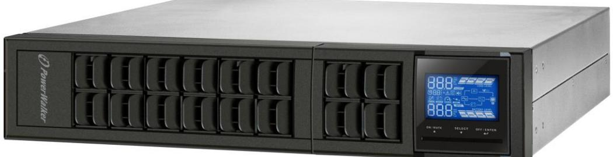

# PL Instrukcja obsługi

Awaryjny system zasilania

| f 2 |  |
|--------|--|
| 2 ⎞ |  |
|        |  |

| 1-1. Transport                             | 1  |
|-----------------------------------------------|----|
| 1-2. Przygotowywanie                          | 1  |
| 1-3. Instalacja                            | 1  |
| 1-4. Eksploatacja                          | 1  |
| 1-5. Konserwacja, serwis oraz błędy        | 2  |
| 2. Instalacja i konfiguracja               | 3  |
| 2-1. Wygląd tylnego panelu                    | 3  |
| 2-2. 1-3K Konfiguracja UPS                 | 4  |
| 3. Operacje                                | 6  |
| 3-1. Funkcje przycisków                       | 6  |
| 3-2. Panel LCD                          | 7  |
| 3-3. Sygnały dźwiękowe                        | 8  |
| 3-4. Wyświetlacz LCD z tabelą sformułowań  | 8  |
| 3-5. Ustawienia UPS                        | 9  |
| 3-6. Opis trybów pracy                        | 11 |
| 3-7. Kody referencyjne błędów              | 13 |
| 3-8. Wskaźniki ostrzeżeń                      | 13 |
| 4. Rozwiązywanie problemów                    | 14 |
| 5. Przechowywanie i konserwacja            | 15 |
| 6. Specyfikacja                               | 16 |
|                                               |    |

## **1. Ważne instrukcje dotyczące bezpieczeństwa**

Proszę zastosować się ściśle do wszystkich ostrzeżeń w instrukcji wraz z zasadami postępowania. Używaj poprawnie poniższą instrukcję oraz uważnie przeczytaj poniższe zalecenia przed instalacją urządzenia. Nie korzystaj z UPS przed uważnym przeczytaniem wszystkich informacji dotyczących bezpieczeństwa oraz instrukcji obsługi.

#### **1-1. Transport**

- Proszę transportować UPS tylko i wyłącznie w oryginalnym opakowaniu w celu ochrony przed wstrząsami oraz uderzeniami.
#### **1-2. Przygotowywanie**

- Może wystąpić kondensacja, jeśli UPS zostanie przeniesiony bezpośrednio z zimnego do ciepłego otoczenia. System UPS musi być całkowicie suchy przed zainstalowaniem. Proszę odczekać co najmniej dwie godziny, aby UPS dostosował się do otoczenia.
- Nie instaluj UPS w pobliżu zbiorników wodnych oraz źródeł wody.
- Nie wystawiaj UPS na bezpośrednie działanie światła słonecznego lub grzejnika.
- Nie blokuj otworów wentylacyjnych na obudowie UPS.

### **1-3. Instalacja**

- Nie należy podłączać urządzeń, które przeciążą UPS (np. drukarki laserowe) do gniazd wyjściowych.
- Podłącz kable w taki sposób, żeby wyeliminować ryzyko nadepnięcia lub potknięcia się o nie.
- Nie podłączaj urządzeń gospodarstwa domowego takich jak suszarki do włosów, prostownice, mikrofale itp. do gniazd wyjściowych UPS.
- UPS może zostać zainstalowany przez wyłącznie wykwalifikowaną osobę.
- Podłącz UPS do gniazdka z uziemieniem, który musi znajdować się w pobliżu urządzenia.
- Proszę używać tylko kabli sieciowych, przetestowanych VDE, oznaczonych CE (np. kabel sieciowy od komputera) do podłączenia UPS do gniazda sieci elektrycznej budynku (wstrząsoodporne wyloty).
- Proszę używać tylko kabli zasilających, przetestowanych VDE, oznaczonych CE do podłączenia obciążeń do UPS.
- Podczas instalacji urządzenia, upewnij się, że suma (upływu) prądu UPS oraz podłączonych urządzeń nie przekracza 3.5mA.

### **1-4. Operacje**

- Nie odłączaj kabli sieciowych na UPS lub gniazd sieciowych budynku (wstrząsoodpornych gniazd) podczas pracy, ponieważ może to spowodować odłączenie urządzenia jak i podłączonych obciążeń od linii uziemienia.
- UPS posiada własne, wewnętrzne źródło prądu (baterie). Gniazda wyjściowe UPS lub terminale wyjściowe mogą być pod napięciem, nawet jeśli system UPS nie jest podłączony do gniazda sieci elektrycznej budynku.
- W celu całkowitego wyłączenia urządzenia, naciśnij przycisk OFF/Enter.
- Zapobiegaj dostawaniu się płynów lub innych ciał obcych do wnętrza UPS.

#### **1-5. Konserwacja, serwis oraz błędy**

- System UPS działa / operuje na niebezpiecznych napięciach. Naprawy mogą być wykonywane wyłącznie przez wykwalifikowany personel.
- **Uwaga –** ryzyko porażenia prądem. Nawet po odłączeniu urządzenia od sieci, komponenty wewnątrz systemu UPS są jeszcze podłączone do baterii, które są potencjalnie niebezpieczne.
- Przed przystąpieniem do wykonywania wszelkiego rodzaju usług i / lub konserwacji, odłącz baterie i sprawdź, czy nie jest obecny przesyłany prąd oraz czy nie istnieje niebezpieczne napięcie na zaciskach kondensatora o dużej zdolności, takich jak kondensatory BUS.
- Tylko osoby, które są odpowiednio zaznajomione z tematem wymiany baterii i wymaganych środków ostrożności przy takim zabiegu mogą zastąpić aktualne baterie i koordynować taką zmianę. dala Baterie należy przechowywać w bezpiecznym miejscu przed osobami nieupoważnionymi.
- **Uwaga –** ryzyko porażenia prądem. Obwód baterii nie jest zaizolowany przed napięciem wejściowym. Niebezpieczne napięcia mogą wystąpić pomiędzy terminalem baterii oraz uziemieniem. Przed serwisowaniem należy sprawdzić, czy nie ma napięcia!
- Baterie mogą spowodować porażenie prądem i mają wysokie natężenie podczas zwarcia. Należy zastosować środki zapobiegawcze określone poniżej oraz wszelkie inne środki niezbędne podczas pracy z bateriami:
	- -zdjąć zegarki, pierścionki i inne metalowe przedmioty
	- -Korzystaj jedynie z narzędzi z izolowanymi uchwytami i rączkami.
- Podczas wymiany baterii, należy zainstalować tę samą ich liczbę oraz ten sam rodzaj baterii.
- Nie wolno wrzucać baterii do ognia. Może to spowodować ich wybuch. Baterie muszą być prawidłowo utylizowane zgodnie z lokalnymi przepisami.
- Nie otwieraj ani nie niszcz baterii. Przeciekający elektrolit może spowodować obrażenia skóry i oczu. Może być to toksyczne.
- Wymieniaj bezpiecznik tylko tego samego typu i amperażu w celu uniknięcia ryzyka pożaru.
- Nie należy demontować UPS.

# **2. Instalacja i konfiguracja**

**INFO:** Sprawdź UPS po otrzymaniu. Upewnij się, że nic w środku opakowania nie zostało uszkodzone. Proszę trzymać oryginalne opakowanie w bezpiecznym miejscu do jego wykorzystania w przyszłości.

**INFO:** Istnieją dwa typy UPS: standardowy i model long-run. Proszę zapoznać się z poniższą tabelą modeli.

| Model                       | Typ         | Model                        | Typ      |
|-----------------------------|-------------|------------------------------|----------|
| PowerWalker VFI 1000CRM LCD |             | PowerWalker VFI 1000CRM LCDL |          |
| PowerWalker VFI 2000CRM LCD | Standardowy | PowerWalker VFI 2000CRM LCDL | Model    |
| PowerWalker VFI 3000CRM LCD | model       | PowerWalker VFI 3000CRM LCDL | Long-run |

#### **2-1. Wygląd tylnego panelu**

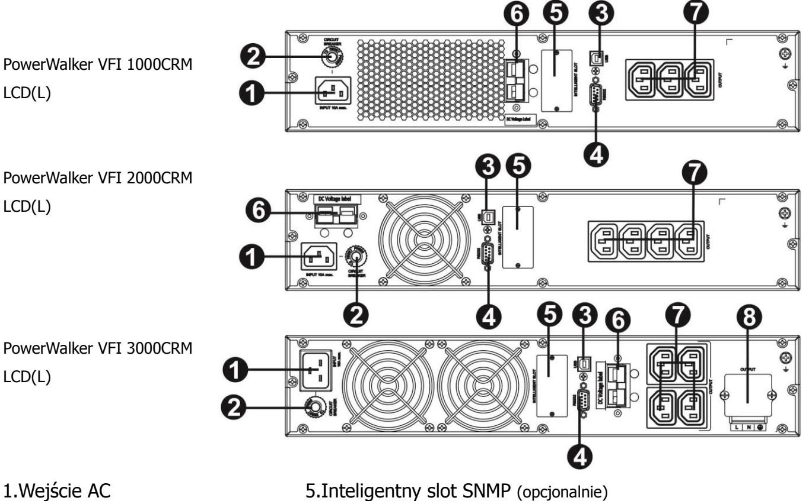

- 
- 2.Bezpiecznik wejściowy 6.Połączenie zewnętrznych baterii
- 3.Port komunikacyjny USB 7.Gniazda wyjściowe
- 4.Port komunikacyjny RS-232 8.Wyjściowy terminal
- 

# **2-2. 1-3K Konfiguracja UPS**

### **Krok 1: Połączenie zewnętrznych baterii**

Ten UPS nie zawiera baterii. Proszę podłączyć zewnętrzne baterie jak na poniższym wykresie.

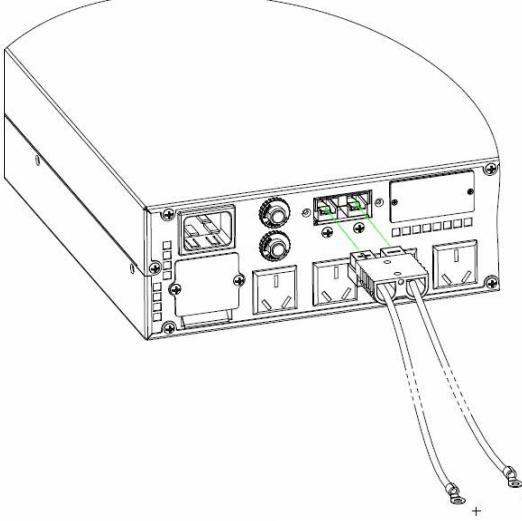

Do zewnętrznych baterii

#### **Krok 2: wejściowe połączenie UPS**

Podłącz UPS tylko do dwubiegunowego, trzykablowego uziemionego gniazda. Należy unikać stosowania przedłużaczy. Przewód zasilający jest dostarczany w zestawie zasilacza.

#### **Krok 3: wyjściowe połączenie UPS**

- Dla wyjść typu socket, wystarczy podłączyć urządzenia do gniazd wyjściowych.
- Dla wejść/wyjść typu terminal, wykonaj poniższe kroki dla konfiguracji połączeń:
	- a) Zdejmij małą pokrywę bloku terminala
	- b) Sugerujemy użycie AWG14 lub 2.1mm2 przewodów zasilających dla modelu 3KVA.
	- c) Po zakończeniu konfiguracji okablowania, należy sprawdzić, czy przewody są trwale przymocowane.
	- d) Włóż z powrotem małą pokrywę na tylni panel.

#### **Krok 4: Komunikacja Port komunikacyjny: Port USB Port RS-232 Inteligentny slot**

# 

W celu umożliwienia nienadzorowanego wyłączenia/włączenia i monitoringu statusu UPS, podłącz jeden koniec kabla komunikacyjnego do portu RS232/USB, a drugi do portu komunikacyjnego komputera. Po zainstalowaniu oprogramowania do monitorowania, można zaplanować wyłączenie/uruchomienie i monitorowanie stanu zasilacza UPS za pomocą komputera PC.

UPS wyposażony jest w inteligentne gniazdo idealne dla karty SNMP lub AS400. Podczas instalacji karty SNMP lub AS400 w UPS, będzie on dostarczać zaawansowane opcje łączności i monitoringu.

**PS. Port USB oraz RS-232 nie mogą pracować jednocześnie.** 

#### **Krok 5: Włączanie UPS**

Naciśnij przycisk ON/Mute na przednim panelu przez dwie sekundy, aby włączyć UPS. Info: Pełne naładowanie baterii odbędzie się w czasie pierwszych pięciu godzin normalnej pracy. Nie należy oczekiwać pełnego naładowania podczas początkowego okresu ładowania.

#### **Krok 6: Instalacja oprogramowania**

Dla optymalnej komputerowej ochrony systemu, zainstaluj oprogramowanie do monitorowania, aby w pełni skonfigurować wyłączanie UPS. Możesz włożyć płytę do czytnika CD-ROM, aby zainstalować oprogramowanie monitorujące. Jeśli nie, wykonaj następujące kroki, aby pobrać i zainstalować oprogramowanie z internetu:

1. Wejdź na **http://www.powerwalker.com/index.php?lang=&page=viewpower**

2. Kliknij na ikonę oprogramowania ViewPower a następnie wybierz żądany system operacyjny, aby pobrać oprogramowanie.

3. Postępuj zgodnie z instrukcjami wyświetlanymi na ekranie, aby zainstalować oprogramowanie.

4. Gdy komputer uruchomi się ponownie, program do monitorowania pojawi się jako pomarańczowa ikona wtyczki znajdująca się w zasobniku systemowym obok zegara.

#### **3. Operacje 3-1. Funkcje przycisków**

| Przycisk                     | Funkcja                                                                                                                                                                                                                                                                                                                                                                                                                                                                                                                                                                                                                                                                                                                                                   |
|------------------------------|-----------------------------------------------------------------------------------------------------------------------------------------------------------------------------------------------------------------------------------------------------------------------------------------------------------------------------------------------------------------------------------------------------------------------------------------------------------------------------------------------------------------------------------------------------------------------------------------------------------------------------------------------------------------------------------------------------------------------------------------------------------|
| Przycisk ON/Mute             | Włączanie UPS: Proszę nacisnąć i przytrzymać przycisk ON/Mute  przez przynajmniej 2 sekundy, aby włączyć UPS. Wyciszenie alarmu: Kiedy UPS działa w trybie bateryjnym, proszę  nacisnąć i przytrzymać przycisk przez przynajmniej 5 sekund do wyłączenia lub włączenia alarmu systemu. Nie można zastosować powyższego schematu do sytuacji, gdy występują ostrzeżenia lub błędy. Przycisk Up: Naciśnij ten przycisk, aby wyświetlić poprzedni wybór w  trybie ustawień UPS. Tryb testu UPS: Naciśnij i przytrzymaj przez przynajmniej 5 sekund  przycisk aby uruchomić auto-test UPSa. Możliwe w trybie pracy zasilania z sieci, trybie ECO i trybie konwertera. |
| Przycisk OFF/Enter        | Wyłączanie UPS: Naciśnij przytrzymaj przez co najmniej 2 sekundy,  aby wyłączyć UPS. UPS będzie w trybie czuwania pod normalnym napięciem lub przejdzie w tryb Bypass jeśli ustawienia Bypass są włączony naciskając ten przycisk. Przycisk akceptacji wyboru: Przycisk ten służy do akceptacji wyboru w  trybie ustawień.                                                                                                                                                                                                                                                                                                                                                                                                      |
| Przycisk wyboru              | Przełącza informacje wyświetlane na ekranie LCD: Naciśnij aby  zmienić wyświetlane informacje (napięcie wejściowe, częstotliwość wejściową, napięcie baterii, napięcie wyjściowe, częstotliwość wyjściową). Po 10 sekundach bezczynności na ekranie wyświetlone zostaną informacje domyślne. Tryb ustawień: Naciśnij i przytrzymaj przez 5 sekund aby wejść w tryb  ustawień UPS. Przycisk Down: Naciśnij ten przycisk, aby wyświetlić następny wybór w  trybie ustawień UPS.                                                                                                                                                                                                                       |
| Przycisk ON/Mute + Wyboru | Przełącz do trybu bypass: Kiedy zasilanie jest normalne, naciśnij  przycisk ON/Mute oraz jednocześnie przycisk Select przez 5 sekund. Następnie UPS przejdzie do trybu bypass. Działanie to będzie nieskuteczne, gdy napięcie wejściowe jest poza dopuszczalnym zakresem.                                                                                                                                                                                                                                                                                                                                                                                                                                                     |

#### **3-2. LCD Panel**

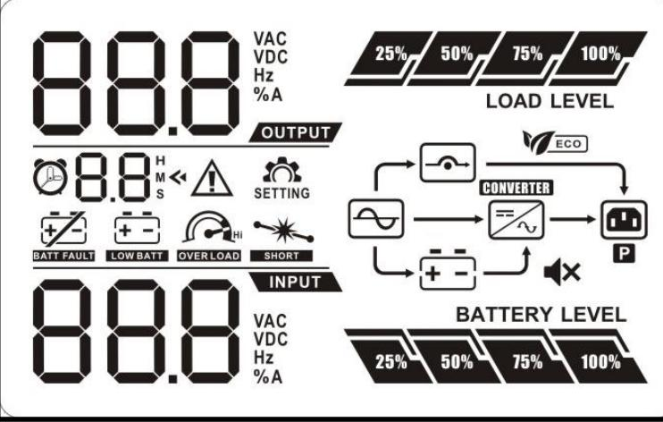

| Wyświetlana informacja                     | Funkcja                                                                                                                               |  |  |  |
|--------------------------------------------|---------------------------------------------------------------------------------------------------------------------------------------|--|--|--|
| Informacja o czasie podtrzymania     |                                                                                                                                       |  |  |  |
|                                            | Wskazuje pozostały czas podtrzymania w wykresie kołowym.                                                                              |  |  |  |
|                                            | Wskazuje czas podtrzymania w liczbach. H: godziny, M: minuty, S: sekundy                                                        |  |  |  |
| Informacja o błędzie                 |                                                                                                                                       |  |  |  |
|                                            | Wskazuje występowanie ostrzeżenia i usterki.                                                                                          |  |  |  |
|                                            | Wskazuje kody ostrzeżeń i błędów. Są one szczegółowo wymienione w sekcji 3-5.                                                   |  |  |  |
| Tryb wyciszenia                            |                                                                                                                                       |  |  |  |
|                                            | Wskazuje, że alarm UPS jest wyłączony                                                                                                 |  |  |  |
| Informacja o napięciu wyjściowym i baterii |                                                                                                                                       |  |  |  |
|                                            | Wskazuje napięcie wyjściowe, częstotliwość lub napięcie baterii. Vac: napięcie wyjściowe, Vdc: napięcie baterii, Hz: częstotliwość |  |  |  |
| Informacja o obciążeniu                    |                                                                                                                                       |  |  |  |
|                                            | Wskazuje poziom obciążenia na poziomach 0-25%, 26-50%, 51-75%, 76-100%.                                                            |  |  |  |
|                                            | Wskazuje przeładowanie urządzenia.                                                                                                    |  |  |  |
|                                            | Wskazuje zwarcie na obciążeniu lub wyjściu UPS.                                                                                       |  |  |  |
| Informacja o trybie pracy                  |                                                                                                                                       |  |  |  |
|                                            | Wskazuje tryb pracy zasilania z sieci.                                                                                                |  |  |  |
|                                            | Wskazuje tryb pracy zasilania z baterii.                                                                                              |  |  |  |
|                                            | Wskazuje tryb pracy bypass.                                                                                                           |  |  |  |
|                                            | Wskazuje, że tryb ECO jest aktywny.                                                                                                   |  |  |  |
|                                            | Wskazuje, że inwerter pracuje.                                                                                                        |  |  |  |
|                                            | Wskazuje, że wyjście działa.                                                                                                          |  |  |  |

| Informacje o baterii                       |                                                                                                                                                    |  |
|--------------------------------------------|----------------------------------------------------------------------------------------------------------------------------------------------------|--|
|                                            | Wskazuje poziom obciążenia na poziomach 0-25%, 26-50%, 51-75%, 76-100%.                                                                         |  |
|                                            | Wskazuje, że bateria jest uszkodzona.                                                                                                              |  |
|                                            | Wskazuje słaby stan baterii oraz jej niskie napięcie.                                                                                              |  |
| Informacja o napięciu wejściowym i baterii |                                                                                                                                                    |  |
|                                            | Wskazuje napięcie wejściowe lub częstotliwość lub napięcie baterii. Vac: napięcie wyjściowe, Vdc: napięcie baterii, Hz: częstotliwość wejściowa |  |

#### **3-3. Sygnały dźwiękowe**

| Opis                 | Status dźwiękowy                   | Wyciszony |
|----------------------|------------------------------------|-----------|
| Tryb baterii         | Sygnał dźwiękowy co 4 sekundy   |           |
| Niski poziom baterii | Sygnał dźwiękowy co sekundę        |           |
| Przeciążenie         | Sygnał dźwiękowy 2 razy co sekundę | Tak       |
| Błąd                 | Ciągły sygnał                      |           |
| Tryb Bypass          | Sygnał dźwiękowy co 10 sekund      |           |

#### **3-4. Wyświetlacz LCD z tabelą sformułowań**

| Skrót Informacje na wyświetlaczu |  | Znaczenie                        |  |
|-------------------------------------|--|----------------------------------|--|
| ENA                                 |  | Włączony                         |  |
| DIS                                 |  | Wyłączony                        |  |
| ESC                                 |  | Cofanie                          |  |
| HLS                                 |  | Wysokie straty                   |  |
| LLS                                 |  | Niskie straty                    |  |
| BAT                                 |  | Bateria                          |  |
| CF                                  |  | Konwerter                        |  |
| TP                                  |  | Temperatura                      |  |
| CH                                  |  | Ładowarka                        |  |
| FU                                  |  | Niestabilna częstotliwość Bypass |  |
| EE                                  |  | Błąd EEPROM                      |  |

**PL**

### **3-5. Ustawienia UPS**

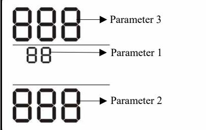

UPS.

Parameter 2 Istnieją trzy parametry do ustawienia Parametr 1: Dla programów alternatywnych. Patrz na poniższą tabelę. Parametr 2 i 3 są opcjami ustawień lub wartościami dla każdego programu.

#### **01: Ustawienie napięcia wyjściowego**

#### **02: Konwerter częstotliwości włącz/wyłącz**

| Interfejs | Ustawienia |
|-----------|------------|
|           |            |
|           |            |

|  | Parametr 2 & 3: Włącza lub wyłącza tryb konwertera, |  |
|--|-----------------------------------------------------|--|
|  | Możesz wybrać następujące dwie opcje:               |  |
|  | CF ENA: Włączony tryb konwertera                    |  |
|  | CF DIS: Wyłączony tryb konwertera (Domyślnie)    |  |
|  |                                                     |  |
|  |                                                     |  |
|  |                                                     |  |

#### **03: Ustawienie częstotliwości wyjściowej**

| Interfejs | Ustawienia                                                          |
|-----------|---------------------------------------------------------------------|
|           | Parametr 2 & 3: Ustawienie częstotliwości                           |
|           | wyjściowej.                                                         |
|           | Możesz ustawić zainicjować częstotliwość dla trybu                  |
|           | bateryjnego:                                                        |
|           | BAT 50: przedstawiana jest częstotliwość wyjściowa 50Hz |
|           | BAT 60: przedstawiana jest częstotliwość wyjściowa 60Hz    |
|           | Jeśli włączony jest tryb konwertera, możesz wybrać               |
|           | następujące częstotliwości wyjściowe:                            |
|           | CF 50: przedstawiana jest częstotliwość wyjściowa 50Hz        |
|           | CF 60: przedstawiana jest częstotliwość wyjściowa 60Hz        |

#### **04: ECO włącz/wyłącz**

| Interfejs | Ustawienia                                                                                                                                                     |
|-----------|----------------------------------------------------------------------------------------------------------------------------------------------------------------|
|           | Parametr 3: Włącza lub wyłącza funkcję ECO. Możesz wybrać następujące dwie opcje: ENA: Tryb ECO włączony DIS: Tryb ECO wyłączony (Domyślnie) |
|           |                                                                                                                                                                |

#### **05: Ustawienie zakresu napięcia ECO**

#### **06: Bypass włącz/wyłącz kiedy UPS jest wyłączony**

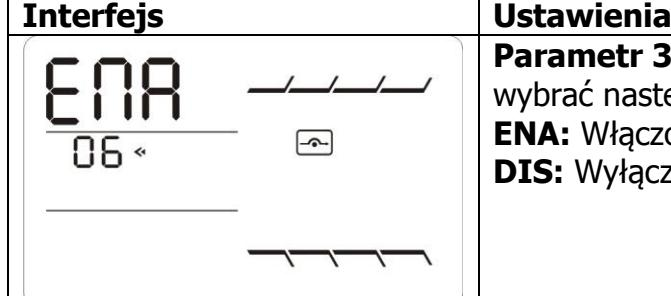

**Parametr 3:** Włącz lub wyłącz funkcję Bypass. Możesz wybrać następujące dwie opcje: **ENA:** Włączony Bypass **DIS:** Wyłączony Bypass (Domyślnie)

### **07: Ustawienie zakresu napięcia Bypass**

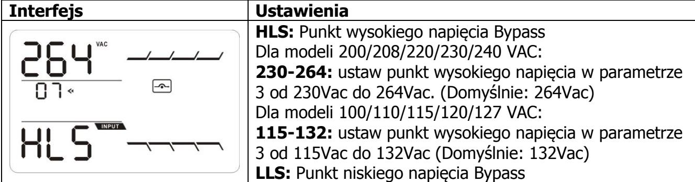

**PL**

| Dla modeli 200/208/220/230/240 VAC:                  |
|---------------------------------------------------------|
| 170-220: ustaw punkt niskiego napięcia w parametrze 3   |
| 170Vac do 220Vac. (Domyślnie: 170Vac)                |
| Dla modeli 100/110/115/120/127 VAC:                  |
| 95-110: ustaw punkt niskiego napięcia w parametrze 3 od |
| 95Vac do 110Vac. (Domyślnie: 95Vac)                  |
|                                                         |

#### **8: Ustawienie ograniczenia autonomii**

| Interfejs |  | Ustawienia                                                         |  |
|-----------|--|--------------------------------------------------------------------|--|
|           |  | Parametr 3: Ustaw czas podtrzymania w trybie                       |  |
|           |  | bateryjnym dla generalnych wyjść.                                  |  |
|           |  | 0-999: ustaw czas podtrzymania w minutach z zakresu                |  |
|           |  | 0-999 dla generalnych wyjść w trybie baterii.                      |  |
|           |  | 0: Jeżeli ustawienie to "0", to czas podtrzymania wynosić |  |
|           |  | będzie 10 sekund.                                               |  |
|           |  | 999: Kiedy ustawienie wynosi "999", ustawienie czasu            |  |
|           |  | podtrzymania będzie wyłączone. (Domyślne)                          |  |

#### **00: Wyjście z ustawień**

#### **3-6. Opisy trybów pracy**

| Tryb pracy                        | Opis                                                                                                                                                                                                                                                        | Wyświetlacz LCD |
|-----------------------------------|-------------------------------------------------------------------------------------------------------------------------------------------------------------------------------------------------------------------------------------------------------------|-----------------|
| Tryb Online                       | Gdy napięcie wejściowe jest w dopuszczalnym zakresie, UPS zapewni stabilne zasilanie AC na wyjściu. Urządzenie będzie również ładować w tym trybie.                                                                                       |                 |
| Tryb ECO                          | Tryb oszczędzania energii: Gdy napięcie wejściowe jest zakresie regulacji napięcia, UPS na wyjściu będzie podawał napięcie przy użyciu bypass dla oszczędzania energii.                                                                         |                 |
| Tryb konwertera częstotliwości | W przypadku gdy częstotliwość wejściowa wynosi od 40Hz do 70Hz, UPS w tym trybie przekonwertuje ją na częstotliwość wyjściową 50Hz lub 60Hz w zależności od ustawień. UPS w trybie tym będzie ładował baterie. |                 |

| Tryb bateryjny | W przypadku braku zasilania z sieci lub gdy napięcie nie mieści się w dolnej albo górnej granicy, UPS przejdzie na zasilanie z baterii. Sygnał dźwiękowy będzie powtarzany co 4 sekundy.                                                                                        |  |
|----------------|------------------------------------------------------------------------------------------------------------------------------------------------------------------------------------------------------------------------------------------------------------------------------------------------------------------------------|--|
| Tryb Bypass    | W przypadku przeciążenia UPSa – przejdzie on w tryb Bypass pomimo, prawidłowego zasilania z sieci. Istnieje również możliwość umyślnego włączenia trybu Bypass za pomocą ustawień wyświetlacza. W trybie tym sygnał dźwiękowy będzie powtarzany co 10 sekund. |  |
| Tryb Standby   | UPS w trybie tym nie zasila urządzeń podłączonych do gniazd wyjściowych. Ładuje jedynie baterie.                                                                                                                                                                                                              |  |

| Zdarzenie           | Kod błędu | Ikona | Zdarzenie                | Kod błędu | Ikona |
|---------------------|-----------|-------|--------------------------|-----------|-------|
| Awaria startu Bus   | 01        | x     | Zwarcie wyjścia          | 14        |       |
|                     |           |       | inwertera                |           |       |
| Bus over            | 02        | x     | Wysokie napięcie baterii | 27        |       |
| Bus under           | 03        | x     | Niskie napięcie baterii  | 28        |       |
| Niezbalansowany Bus | 04        | x     | Zbyt wysoka              | 41        | x     |
|                     |           |       | temperatura              |           |       |
| Awaria soft startu  | 11        | x     | Przeładowanie            | 43        |       |
| inwertera           |           |       |                          |           |       |
| Wysokie napięcie    | 12        | x     | Awaria ładowarki         | 45        | x     |
| inwertera           |           |       |                          |           |       |
| Niskie napięcie  | 13        | x     |                          |           |       |
| inwertera           |           |       |                          |           |       |

#### **3-8. Wskaźniki ostrzeżeń**

| Ostrzeżenie                  | Migająca ikona | Alarm                      |  |
|------------------------------|----------------|----------------------------|--|
| Niski poziom baterii         |                | Sygnał co sekundę          |  |
| Przeładowanie                |                | Sygnał dwa razy co sekundę |  |
| Bateria nie jest podłączona  |                | Sygnał co sekundę          |  |
| Przeciążenie                 |                | Sygnał co sekundę       |  |
| Zbyt wysoka temperatura      |                | Sygnał co sekundę          |  |
| Awaria ładowarki             |                | Sygnał co sekundę          |  |
| Awaria baterii               |                | Sygnał co sekundę          |  |
| Poza zakresem napięcia       |                | Sygnał co sekundę          |  |
| bypass                       |                |                            |  |
| Niestabilna częstotliwość |                | Sygnał co sekundę          |  |
| bypass                       |                |                            |  |
| Błąd EEPROM                  |                | Sygnał co sekundę          |  |

## **4. Rozwiązywanie problemów**

Jeżeli system UPS nie działa prawidłowo, należy rozwiązać problem za pomocą poniższej tabeli.

| Symptom                                                                                                           | Możliwe powody                                                                                                                                                         | Rozwiązanie                                                                                                                      |
|-------------------------------------------------------------------------------------------------------------------|------------------------------------------------------------------------------------------------------------------------------------------------------------------------|----------------------------------------------------------------------------------------------------------------------------------|
| Brak wskaźników oraz alarmu na przednim panelu wyświetlacza                                                    | Źle został podłączony kabel zasilający.                                                                                                                             | Sprawdź poprawność podłączenia zasilania.                                                                                  |
| pomimo prawidłowego działania sieci.                                                                           | Zasilanie podłączone jest do gniazda wyjściowego.                                                                                                             | Podłącz poprawnie przewód zasilający AC do wejścia AC.                                                                        |
| Ikona i migają na ekranie LCD a sygnał dźwiękowy powtarzany jest co sekundę.                       | Wewnętrzne lub zewnętrzne baterie są źle podłączone.                                                                                                             | Sprawdź, czy wszystkie baterie są dobrze połączone.                                                            |
| Wyświetlany jest kod błędu 27. Świeci się ikona na ekranie LCD oraz powtarzany jest ciągły sygnał.    | Napięcie baterii jest zbyt wysokie lub nastąpiła awaria ładowarki.                                                                                         | Skontaktuj się ze swoim sprzedawcą.                                                                                  |
| Wyświetlany jest kod błędu 28. Świeci się ikona na ekranie LCD oraz powtarzany jest ciągły sygnał.    | Napięcie baterii jest zbyt wysokie lub nastąpiła awaria ładowarki.                                                                                         | Skontaktuj się ze swoim sprzedawcą.                                                                                  |
| Ikona i migają na                                                                                           | Przeciążenie UPS                                                                                                                                                       | Usuń nadmiar obciążeń z wyjścia UPS.                                                                                          |
| ekranie LCD a sygnał dźwiękowy powtarzany jest 2 razy co sekundę.                                        | UPS jest przeciążony. Urządzenia podłączone do UPS są zasilane bezpośrednio poprzez sieć elektryczną za pomocą Bypass.                                  | Usuń nadmiar obciążeń z wyjścia UPS.                                                                                          |
|                                                                                                                   | Po powtarzających się przeciążeniach, UPS jest zablokowany w trybie Bypass. Podłączone urządzenia są zasilane bezpośrednio poprzez sieć elektryczną. | Po pierwsze, usuń nadmiar obciążeń z wyjścia UPS. Następnie wyłącz urządzenie a następnie je zrestartuj. |
| Wyświetlany jest kod błędu 43. Świeci się ikona na ekranie LCD oraz powtarzany jest ciągły sygnał. | UPS wyłączy się automatycznie ze względu na przeładowanie na wyjściu UPS.                                                                                     | Usuń nadmiar obciążeń z wyjścia UPS a następnie go zrestartuj.                                                             |
| Wyświetlany jest kod błędu 14. Świeci się ikona na ekranie LCD oraz powtarzany jest ciągły sygnał. | UPS wyłączy się automatycznie ze względu na zwarcie na wyjściu UPS.                                                                                              | Sprawdź okablowanie na wyjściu oraz czy nie powodują one zwarcia.                                           |

**PL**

| Symptom                                                                                                                         | Możliwe powody                                                                                                                                               | Rozwiązanie                                                                                                                                                        |
|---------------------------------------------------------------------------------------------------------------------------------|--------------------------------------------------------------------------------------------------------------------------------------------------------------|--------------------------------------------------------------------------------------------------------------------------------------------------------------------|
| Wyświetlane są kod błędów 01, 02, 03, 04, 11, 12, 13 i 41 na wyświetlaczu LCD. Powtarzany jest ciągły sygnał. | Wewnętrzny błąd UPS. Istnieją dwa możliwe rozwiązania: 1. Obciążanie jest wciąż obecne, jednakże bezpośrednio z zasilania AC przez bypass. | Skontaktuj się ze swoim sprzedawcą.                                                                                                                             |
| Czas podtrzymania na baterii jest krótszy niż powinien.                                                                      | Baterie nie są w pełni naładowane.                                                                                                                        | Ładuj baterie przez minimum 5 godzin i ponownie sprawdź ich czas podtrzymania. Jeśli problem będzie się powtarzał, skontaktuj się z serwisem. |
|                                                                                                                                 | Awaria baterii.                                                                                                                                              | Skontaktuj się z serwisem, aby wymienić baterie.                                                                                                                |

# **5. Przechowywanie i konserwacja**

#### **Operacje**

System UPS nie zawiera żadnych części wymagających konserwacji. Jeśli żywotność baterii (3~5 lat przy 25°C temperatury otoczenia) zostanie przekroczona, baterie muszą zostać wymienione. W tym przypadku należy skontaktować się ze sprzedawcą.

> Pamiętaj, aby zużyte baterie oddać do recyklingu lub wysłać go do sprzedawcy w opakowaniu do akumulatorów.

### **Przechowywanie**

Przed przechowywaniem, ładuj UPS przez 5 godzin. Przechowuj UPS w pozycji pionowej w chłodnym, suchym miejscu. Podczas długotrwałego przechowywania, powinno się systematycznie ładować baterie:

| Temperatura     | Cykl ładowania | Długość ładowania |
|-----------------|----------------|-------------------|
| przechowywania  |                |                   |
| -25°C - 40°C | Co 3 miesiące  | 1-2 godziny       |
| 40°C - 45°C  | Co 2 miesiące  | 1-2 godziny       |

### **6. Specyfikacja**

| MODEL                                                                                     |                           | PowerWalker                                                                                                            | PowerWalker          | PowerWalker          |
|-------------------------------------------------------------------------------------------|---------------------------|------------------------------------------------------------------------------------------------------------------------|----------------------|----------------------|
|                                                                                           |                           | VFI 1000CRM LCD (L)                                                                                                    | VFI 2000CRM LCD (L)  | VFI 3000CRM LCD (L)  |
| POEMNOŚĆ*                                                                                 |                           | 1000 VA / 800 W                                                                                                        | 2000 VA / 1600 W     | 3000 VA / 2400 W     |
| WEJŚCIE                                                                                   |                           |                                                                                                                        |                      |                      |
| Low Line Transfer                                                                         |                           | 85VAC/75VAC/65VAC/55VAC±5% lub 160VAC/140VAC/120VAC/110VAC±5%                                                          |                      |                      |
|                                                                                           |                           | (Temperatura otoczenia <350C)                                                                                          |                      |                      |
|                                                                                           |                           | ( na podstawie obciążenia 100% - 80 % / 80 % - 70 % / 70 - 60 % / 60 % - 0)                                            |                      |                      |
| Zakres                                                                                    | Low Line Comeback         | 95VAC/85VAC/75VAC/65VAC lub 175VAC/155VAC/135VAC/125VAC ± 5 %                                                          |                      |                      |
| napięcia                                                                                  |                           | (Temperatura otoczenia <350C)                                                                                          |                      |                      |
|                                                                                           |                           | ( na podstawie obciążenia 100% - 80 % / 80 % - 70 % / 70 - 60 % / 60 % - 0)                                            |                      |                      |
|                                                                                           | High Line Transfer        | 145 VAC ± 5 % lub 300 VAC ± 5 %                                                                                        |                      |                      |
| High Line Comeback                                                                        |                           | 140 VAC ± 5 % lub 290 VAC ± 5 %                                                                                        |                      |                      |
| Zakres częstotliwości                                                                     |                           | 40Hz ~ 70 Hz                                                                                                           |                      |                      |
| Faza                                                                                      |                           | Jedna faza z uziemieniem ≧ 0.99 @ nominalnego napięcia (napięcie wejściowe)                                         |                      |                      |
| Współczynnik mocy                                                                         |                           |                                                                                                                        |                      |                      |
| WYJŚCIE Napięcie wyjściowe 100/110/115/120/127VAC lub 200/208/220/230/240VAC        |                           |                                                                                                                        |                      |                      |
| Regulacja napięcia AC                                                                     |                           | ±1% (Tryb bateryjny)                                                                                                   |                      |                      |
|                                                                                           |                           | 47 ~ 53 Hz or 57 ~ 63 Hz (Zakres częstotliwości)                                                                       |                      |                      |
| Zakres częstotliwości Zakres częstotliwości (Tryb bateryjny)                           |                           | 50 Hz ± 0.25 Hz lub 60Hz ± 0.3 Hz                                                                                      |                      |                      |
|                                                                                           |                           | Temperatura otoczenia.<350C                                                                                            |                      |                      |
| Overload                                                                                  |                           |                                                                                                                        |                      |                      |
|                                                                                           |                           | 105%~110%: UPS wyłączy się po 10 minutach w trybie bateryjnym lub przejdzie na bypass jeśli narzędzie jest normalne |                      |                      |
|                                                                                           |                           | 110%~130%: UPS wyłączy się po 1 minucie w trybie bateryjnym lub przejdzie na bypass                                    |                      |                      |
|                                                                                           |                           | jeśli narzędzie jest normalne                                                                                          |                      |                      |
|                                                                                           |                           | >130%:UPS UPS wyłączy się po 3 sekundach w trybie bateryjnym lub przejdzie na bypass                                   |                      |                      |
|                                                                                           |                           | jeśli narzędzie jest normalne                                                                                          |                      |                      |
| Current Crest Ratio                                                                       |                           | 3:1                                                                                                                    |                      |                      |
| Zniekształcenia harmoniczne                                                               |                           | ≦ 3 % THD (obciążenie liniowe); ≦ 6 % THD (obciążenie nieliniowe)                                                      |                      |                      |
| Czas                                                                                      | Tryb AC na tryb bateryjny | Zero                                                                                                                   |                      |                      |
| transferu                                                                                 | Inwerter na Bypass        | 4 ms (Typowo)                                                                                                          |                      |                      |
| Fala (Tryb bateryjny)                                                                     |                           | Czysta sinusoida                                                                                                       |                      |                      |
| WYDAJNOŚĆ                                                                                 |                           |                                                                                                                        |                      |                      |
| Tryb AC                                                                                   |                           | 88%                                                                                                                    | 89%                  | 90%                  |
| Tryb bateryjny                                                                            |                           | 83%                                                                                                                    | 87%                  | 88%                  |
| BATERIE                                                                                   |                           |                                                                                                                        |                      |                      |
| Typ baterii                                                                               |                           | 12 V / 9 AH                                                                                                            | 12 V / 9 AH          | 12 V / 9 AH          |
| Liczba                                                                                    |                           | 2                                                                                                                      | 4                    | 6                    |
| Czas ładowania                                                                            |                           | 4 godziny ładowania do 90% pojemności (Typowo)                                                                         |                      |                      |
| Natężenie ładowania                                                                       |                           |                                                                                                                        | 1.0 A (max.)         |                      |
| Napięcie ładowania WYMIARY I WAGA                                                      |                           | 27.4 VDC ± 1%                                                                                                          | 54.7 VDC ±1%         | 82.1 VDC ±1%         |
| Wymiary, G x S x W                                                                        |                           | 282 x 145 x 220 (mm)                                                                                                   | 397 x 145 x 220 (mm) | 421 x 190 x 318 (mm) |
| Waga netto (kg)                                                                           |                           | 9.8                                                                                                                    | 17                   | 27.6                 |
| ŚRODOWISKO                                                                                |                           |                                                                                                                        |                      |                      |
| Wilgotność podczas pracy                                                                  |                           | 20-90 % RH @ 0- 40°C (bez kondensacji)                                                                                 |                      |                      |
| Poziom hałasu                                                                             |                           | Mniej niż 50dBA @ 1 metr                                                                                               |                      |                      |
| ZARZĄDZANIE                                                                               |                           |                                                                                                                        |                      |                      |
| Smart RS-232 lub USB Obsługuje Windows® 2000/2003/XP/Vista/2008/7/8, Linux, Unix i MAC |                           |                                                                                                                        |                      |                      |
| Opcjonalny moduł SNMP Zarządzanie energią z menedżera SNMP i przeglądarki internetowej |                           |                                                                                                                        |                      |                      |
|                                                                                           |                           |                                                                                                                        |                      |                      |

*Model Long-run jest dostępny tylko w systemach 200/208/220/230/240VAC.

*** Specyfikacja produktu może ulec zmianie bez wcześniejszego powiadomienia

** Zmniejszenie do 80% pojemności w trybie konwertera częstotliwości lub gdy napięcie wyjściowe jest dostosowane do 100/200/208VAC.