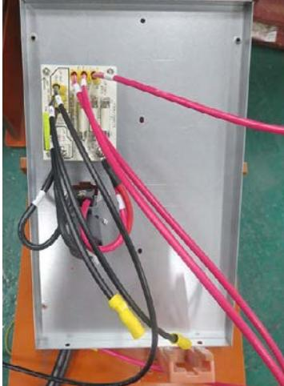
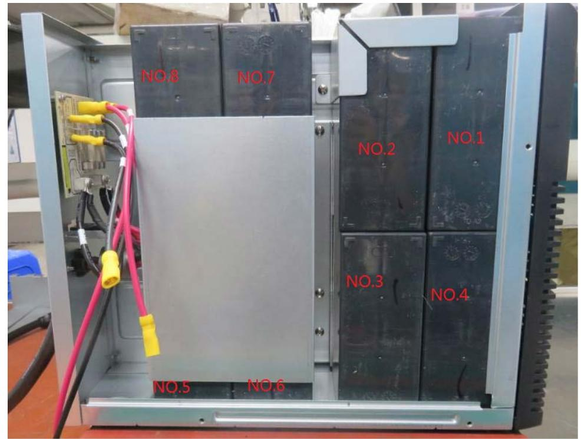
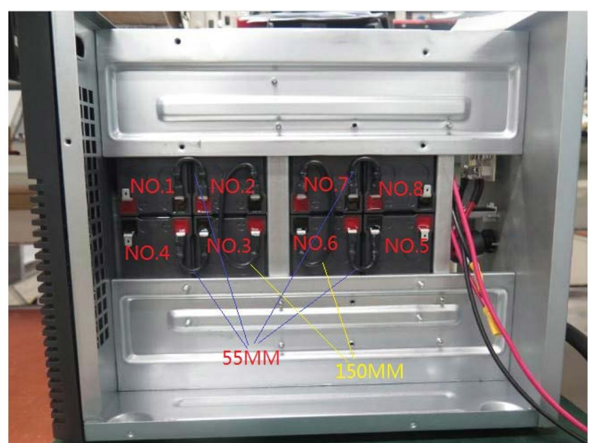
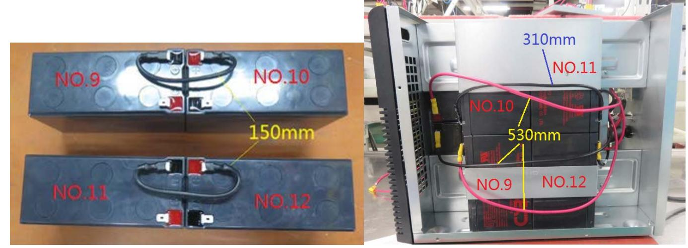
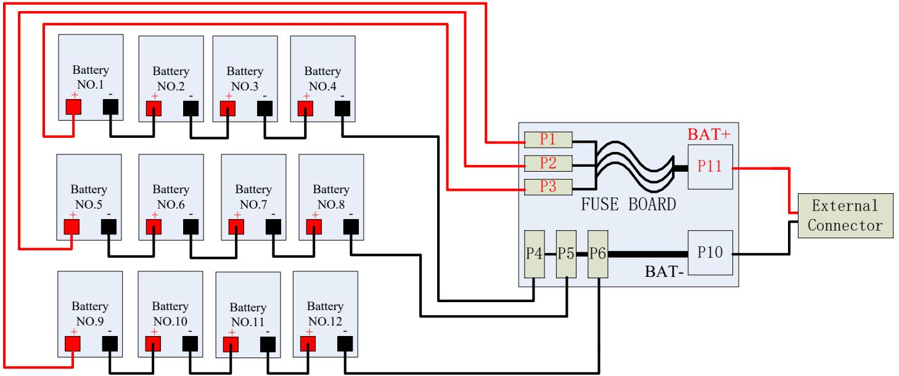

# **User Manual Battery Pack**

#### **1. Important Safety Warnings**

Please comply with all warnings and operating instructions in this instruction strictly. Read carefully the following instructions before installing the unit. Do not operate this unit before reading through all safety information and operating instructions carefully.

- Do not try to assemble or repair the unit yourself, contact your local supplier, seek for help of qualified technician
- To eliminate any overheating of the battery box, keep all ventilation openings free from obstruction and do not place any foreign objects on top of the battery bank. Keep the battery box 20 cm away from the wall.
- Make sure the battery box is installed within the proper environment as specified. (0-40°C and 30-90% non-condensing humidity)
- Do not install the battery box under direct sunlight. Your warranty will be void if the batteries fail due to overheating.
- This battery box is not designed for use in dusty, corrosive and salty environment.
- The warranty for this battery bank will be void if water or other liquid is spilled or poured directly onto the battery box. Similarly we do not warrant any damage to the battery box if foreign objects are deliberately or accidentally inserted into the battery box enclosure.
- The battery will discharge naturally if the system is unused for a period of time.
- It should be recharged every 2-3 months if unused. If this is not done, then the warranty will be null and void. During normal operation, the batteries will be automatically remained in charged condition.
- Servicing of batteries should be performed or supervised by trained personnel with knowledge of batteries and the required precautions.
- When replacing batteries, it is necessary to replace ALL batteries with the same quantity, type & capacity.
- CAUTION Do not dispose of battery or batteries in a fire. The battery may explode.
- CAUTION Do not open or mutilate the batteries. The electrolyte from the batteries is toxic and harmful to the skin and eyes.
- CAUTION Risk of Electric Shock –Hazardous voltage may exist between battery terminals and ground. Test before touching with bare hands.
- CAUTION A battery can present a risk of electrical shock and high short circuit current. The following precaution should be observed when working on batteries:
	- 1. Remove watches, rings, or other metal objects.
	- 2. Use tools with insulated handles.
	- 3. Wear rubber gloves and boots.
	- 4. Do not lay tools or metal parts on top of batteries.
	- 5. Disconnect charging source prior to connecting or disconnecting battery terminals.
- Do not plug or unplug the battery connector if UPS works in DC (discharging) mode.

#### **Installation and Setup**

**NOTE:** Before installation, please inspect the unit. Be sure that nothing inside the package is damaged. Please keep the original package in a safe place for future use

#### **Storage & Maintenance**

The unit contains no user-serviceable parts. If the battery service life (3~5 years at 25°C ambient temperature) has been exceeded, the batteries must be replaced. In this case, please contact your dealer.

> Be sure to deliver the spent battery to a recycling facility or ship it to your dealer in the replacement battery packing material.

#### **Storage**

Before storing, charge the unit 4 hours. Store the unit covered and upright in a cool, dry location. During storage, recharge the battery in accordance with the following table:

| Storage Temperature | Recharge Frequency | Charging Duration |
|---------------------|--------------------|-------------------|
| -25°C - 40°C        | Every 3 months     | 1-2 hours         |
| 40°C - 45°C         | Every 2 months     | 1-2 hours         |

## **How to assemble BP S48T-12x9Ah**

### **Warning: Be careful when connect batteries, do not make batteries have short circuit.**

- **1. The receptacle's wires have been assembled, please do not dismantle them.**

- **2. Please assemble the 12PCS batteries with black wire into the Battery Case as below.**
	- a). Install the 8PCS batteries in battery case and connect it with cable, lock it by metal.
	- b). Connect the 4PCS batteries and put it into battery case, lock it by metal.
	- c). Connect the cable with the fuse board.

**Note:** 

**String 1: BAT No.1 (-) BAT No.2 (+) BAT No.2 (-) BAT No3. (+) BAT No.3 (-) BAT No.4 (+) String 2: BAT No.5 (-) BAT No6. (+) BAT No.6 (-) BAT No7. (+) BAT No.7 (-) BAT No.8 (+)** 

**Note:** 

**String 3: BAT No.9 (-) BAT No.10 (+) BAT No.10 (-) BAT No.11 (+) BAT No.11 (-) BAT No.12 (+)** 

So you finish assembling batteries and you can fix the cover now.

