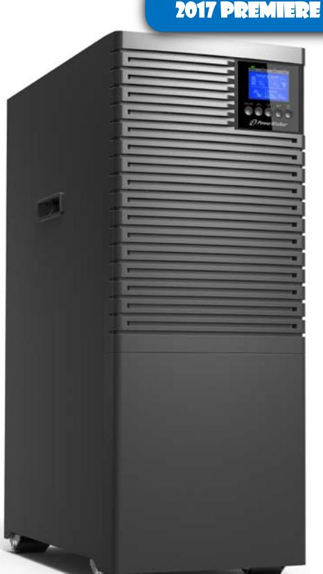
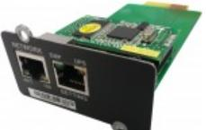
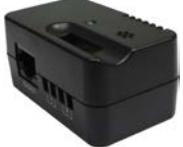
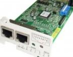
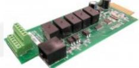
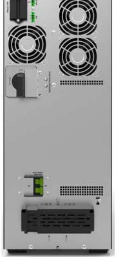
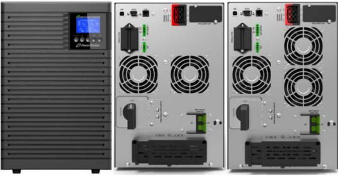

## **PowerWalker VFI 6000-10000 TGB/TGS Series**

- True Double Conversion Technology with high output Power Factor 1.0
- Human Interface Device (HID) compatible USB connection (no additional drivers needed)
- Highly efficient (>95%), Energy saving solution with long autonomy time in great price
- 3-level inverter topology for increased efficiency and high power density
- Parallel operation up to 3 units of the same size

The PowerWalker VFI 1000-10000 TG/TGB/TGS offer a professional solution for home and office environment. They are available with different designs:

- TG: With internal battery; ranges from 1000-3000VA
- TGB: With internal battery and battery connector for external battery packs; ranges from 1000-10000VA
- TGS: Without internal batteries, but with a strong charger and battery connector; ranges from 1000-10000VA

The VFI TG/TGB/TGS series are detected as Human Interface Device (HID) Power Device by the internal O/S drivers and can be managed without additional software. It finds its application in all dedicated systems for kiosks, ATMs as well as in high security level systems, where additional software is not allowed (i.e. banking).

| SERIES                             | VFI 6000-10000 TGB & TGS                        |  |  |  |  |  |  |
|------------------------------------|-------------------------------------------------|--|--|--|--|--|--|
| INPUT                              |                                                 |  |  |  |  |  |  |
|                                    | 160-276 VAC at 100% load                        |  |  |  |  |  |  |
| Voltage                            | 110-160VAC range linear between 50-100% load    |  |  |  |  |  |  |
| Input PF                           | ≥ 0.995 at full load                            |  |  |  |  |  |  |
| Frequency Range                    | 45Hz - 55Hz / 55Hz - 65Hz                       |  |  |  |  |  |  |
|                                    | 40Hz - 70Hz at load ≤60%                        |  |  |  |  |  |  |
| OUTPUT                             |                                                 |  |  |  |  |  |  |
| Voltage                            | 208/220/230/240 VAC                             |  |  |  |  |  |  |
| Pure Sine Wave                     | Yes                                             |  |  |  |  |  |  |
| THDv                               | ≤1% Full Linear Load; ≤5% Non-Linear Load       |  |  |  |  |  |  |
| Voltage Regulation (Bat. Mod.)     | ±1%                                             |  |  |  |  |  |  |
| Frequency (Battery Mode)           | ±0,1Hz                                          |  |  |  |  |  |  |
| TECHNICAL DETAILS                  |                                                 |  |  |  |  |  |  |
| Load Crest Ratio                   | 3:1                                             |  |  |  |  |  |  |
| Transfer Time [AC to Battery]      | 0ms                                             |  |  |  |  |  |  |
| Transfer Time [Inverter to Bypass] | 0ms                                             |  |  |  |  |  |  |
| Generator support                  | Yes                                             |  |  |  |  |  |  |
| Overload Capacity                  | 10min @105%-125%; 30s @125%-150%; 500ms @ >150% |  |  |  |  |  |  |
| External Battery Connection        | Yes                                             |  |  |  |  |  |  |
| Parallel operation                 | Yes, up to 3 units of the same size             |  |  |  |  |  |  |
| COMMUNICATION AND CONNECTIONS      |                                                 |  |  |  |  |  |  |
| Software                           | WinPower                                        |  |  |  |  |  |  |
| USB                                | Yes, with HID support                           |  |  |  |  |  |  |
| RS-232                             | Yes                                             |  |  |  |  |  |  |
| Intelligent Slot                   | Yes                                             |  |  |  |  |  |  |
| EPO                                | Yes                                             |  |  |  |  |  |  |

**ACCESSORIES**

10120517 - NMC Card

10120545 - EMD for NMC Card

10120564 - Modbus Card

10120528 - AS400 Card 3

## **VFI TGB Series VFI TGS Series**

Front 6kVA 10kVA

Front 6kVA 10kVA

| MODEL                 | VFI 6000 TGB        | VFI 10000 TGB     | VFI 6000 TGS    | VFI 10000 TGS |  |  |  |  |  |
|-----------------------|---------------------|-------------------|-----------------|---------------|--|--|--|--|--|
| Item Number           | 10122124            | 10122125          | 10122126        | 10122127      |  |  |  |  |  |
| EAN                   | 4260074980110       | 4260074980127     | 4260074980134   | 4260074980141 |  |  |  |  |  |
| Power (kVA)           | 6000VA              | 10000VA           | 6000VA          | 10000VA       |  |  |  |  |  |
| Power (kW)            | 6000W               | 10000W            | 6000W           | 10000W        |  |  |  |  |  |
| BATTERIES             |                     |                   |                 |               |  |  |  |  |  |
| Batteries             | 16x 12V/7Ah         | 16x 12V/9Ah       | None            |               |  |  |  |  |  |
| Battery Connector     | Yes                 |                   |                 |               |  |  |  |  |  |
| DC Voltage            |                     | 192VDC            | 240VDC          |               |  |  |  |  |  |
| Charger               | 0-4A [Default 1.4A] | 0-4A [Default 2A] | 0-12A [4A]      |               |  |  |  |  |  |
| Charging Time         |                     | 3h to 90%         | Battery related |               |  |  |  |  |  |
| Full Load Backup Time |                     | 4min              |                 |               |  |  |  |  |  |

## **BATTERY PACKS AND BACKUP TABLE**

| MODEL                 | FULL LOAD | HALF LOAD | 1000W | 2000W | 3000W | 4000W | 5000W | 6000W | 7000W | 8000W | 9000W | 10000W |
|-----------------------|--------------|--------------|-------|-------|-------|-------|-------|-------|-------|-------|-------|--------|
| VFI 6000 TGB          |              |              |       |       |       |       |       |       |       |       |       |        |
| VFI 6000 TGB          | 4.0          | 10.7         | 49.8  | 19.1  | 10.7  | 7.1   | 5.2   | 4.0   |       |       |       |        |
| + 1 x BP S192T-32x7Ah | 18.3         | 47.6         | 222.5 | 83.2  | 47.6  | 32.0  | 23.5  | 18.3  |       |       |       |        |
| VFI 10000 TGB         |              |              |       |       |       |       |       |       |       |       |       |        |
| VFI 10000 TGB         | 2.8          | 7.1          | 64.1  | 23.8  | 14.3  | 9.7   | 7.1   | 5.5   | 4.5   | 3.7   | 3.2   | 2.8    |
| + 1 x BP S192T-32x9Ah | 12.4         | 31.9         | 308.5 | 114.5 | 64.1  | 43.3  | 31.9  | 24.9  | 20.2  | 16.8  | 14.3  | 12.4   |

11/07/2017