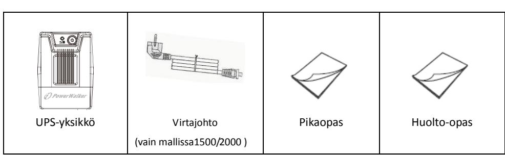

**EN**

# **Line Interactive UPS**

PowerWalker VI 400 SC PowerWalker VI 600 SC PowerWalker VI 800 SC PowerWalker VI 1000 SC PowerWalker VI 1500 SC PowerWalker VI 2000 SC

# **Quick Start Guide**

**EN/DE/FR/ES/IT/PT/SE/FI/NO/TR RU/UA/BY/PL/CZ/HR/HU/BG/KZ/SR**

## **IMPORTANT SAFETY INSTRUCTIONS**

SAVE THESE INSTRUCTIONS – This manual contains important instructions for models PowerWalker VI 400/600/800/1000/1500/2000 SC that should be followed during installation and maintenance of the UPS and batteries.

- This product is specially designed for PCs and it is not recommended for use in any lifesupporting system and other specific important equipment.
- This equipment can be operated by any individual with no previous training.
- Do not plug household appliances such as hair dryers to UPS receptacles.
- This unit intended for installation in a controlled environment (temperature controlled, indoor area free of conductive contaminants). Avoid installing the UPS in locations where there is standing or running water, or excessive humidity.
- Risk of electric shock, do not remove cover. No user serviceable parts inside. Refer servicing to qualified service personnel.
- The utility power outlet shall be near the equipment and easily accessible. To isolate UPS from AC input, remove the plug from the utility power outlet.
- If UPS is to be stored for a long time, it is recommended to recharge the batteries (by connecting the utility power to UPS, switch "ON"), once a month for 24 hours to avoid a full battery discharge.
- Please do not use the UPS in excess of the rated load capacity.
- The UPS contains one/two large-capacity batteries. So the shell shall not be opened, otherwise such dangers as electric shock will be caused. If any internal overhaul or replacement of the battery is required, please contact the distributor.
- The internal short circuiting of the UPS will lead to dangers such as electric shock or fire, therefore, no water containers (such as a water glass) shall be placed on the top of the UPS so as to avoid such dangers as electric shock.
- Do not dispose of battery or batteries in a fire. The battery may explode.
- Do not open or mutilate the battery or batteries. Released electrolyte is harmful to the skin and eyes. It may be toxic.
- Icon Φ on the rating label stands for phase symbol.
- A battery can present a risk of electrical shock and high short circuit current. The following precautions should be observed when working on batteries :
- Remove watches, rings, or other metal objects from the hand.
- Use tools with insulated handles.
- Servicing of batteries should be performed or supervised by personnel knowledgeable of

batteries and the required precautions. Keep unauthorized personnel away from batteries.

- When replacing batteries, replace with the same type and number of the sealed lead-acid batteries.
- The maximum ambient temperature rating is 40°C.
- This pluggable type A equipment with battery already installed by the supplier is operator installable and may be operated by laymen.
- During the installation of this equipment it should be assured that the sum of the leakage currents of the UPS and the connected loads does not exceed 3.5mA.
- Attention, hazardous through electric shock. Also with disconnection of this unit from the mains, hazardous voltage still may be accessible through supply from battery. The battery supply should be therefore disconnected in the plus and minus pole of the battery when maintenance or service work inside the UPS is necessary.
- The mains socket outlet that supplies the UPS shall be installed near the UPS and shall be easily accessible.
- In case smoke is found coming out from the device, please cut off the power supply quickly and contact the distributor.
- Do not keep or use this product in any of the following environments:
	- o Any area with combustible gas, corrosive substance or heavy dust.
	- o Any area with extraordinarily high or low temperature (above 40˚C or below 0˚C) and humidity of more than 90%.
	- o Any area exposed to direct sunshine or near any heating apparatus.
	- o Any area with serious vibrations.
	- o Outdoor.
- In the event that there is fire occurring in the vicinity, please use dry-power extinguishers. The use of liquid extinguishers may give rise to the danger of electric shock.

#### **This product complies with the safety and environmental regulations in EU.**

If the time arises to throw away your product, please recycle all the components possible. Batteries and rechargeable batteries are not to be disposed in your domestic waste! Please recycle them at your local recycling point. Together we can help to protect the environment.

## **1. Introduction**

**EN**

PowerWalker VI 400/600/800/1000/1500/2000 SC is an intelligent and compact line interactive UPS (Uninterruptible Power Supply) which is designed to protect your personal computer or sensitive electronic equipments from all forms of power interference, including complete power failures. It is equipped with many features that allow any attached equipment to operate longer and with more reliability.

## **2. Green concept design**

PowerWalker VI 400/600/800/1000/1500/2000 SC series adopt switching mode charging which creates a variety of benefits:

- Increases charging efficiency to more than 80%, more energy saving than traditional UPS
- The battery requires only 4 hours to be 90% charged, reducing 50% of charging time
- Reduces heat generation during battery charging, providing a longer battery life
- Increases reliability and helps to save money

# **3. Package Contents**

You should have received the following items inside of package:

**EN**

## **4. Product Overview**

#### **Front Panel:**

| 1x LED         | 3x LED             |
|----------------|--------------------|
| Green lighting | Green lighting     |
| Green flashing | Yellow flashing |
| N/A            | Red lighting       |
|                |                    |

#### **Back Panel:**

## **5. Installation and Initial Startup**

Before installation, please inspect the unit. Be sure that nothing is damaged.

#### **I: Placement & Storage Conditions**

Install the UPS in a protected area that is free of excessive dust and has adequate air flow. Please place the UPS away from other units at least 20 cm to avoid interference. Do NOT operate the UPS where the temperature exceeds 0-40° C and the humidity is over 0-90 % RH.

#### **II: Connect to Utility and Charge**

Plug in the AC input cord to the wall outlet. For the best results, we suggest charging the battery at least 4 hours before initial use. The unit charges its battery while connecting to the utility.

#### **III: Connect the Loads**

Plug in the loads to output receptacles on the rear panel of the UPS. Simply turn on the power switch of UPS unit, and devices connected to the UPS will be protected by UPS unit.

Do not attach a power strip or surge suppressor to the UPS.

#### **IV: Connect Modem or Phone for Surge Protection**

Connect a single modem or phone line into surge-protected "IN" outlet on the back panel of the UPS unit. Connect from "OUT" outlet to the computer with another phone line cable.

#### **V: Connect USB Cable**

To monitor the UPS status, such as unattended UPS shutdown and start-up, by using bundled software, please connect the UPS and PC with USB cable included.

 **NEVER** connect a **laser printer** or **scanner** to the UPS unit because in-rush current generated by motor's devices may cause the damage of the unit

#### **VI: Turn On/Off the Unit**

Turn on the UPS unit by pressing the power switch. Turn off the UPS unit by pressing again the power switch.

## **6. Audible alarm from the UPS**

- When UPS switches from AC mode to Battery Mode to back up power supply: sounding every 10 seconds
- When battery is low: sounding every second
- When UPS is overloaded: sounding every 0.5 second
- When battery is faulty: sounding every 2 seconds
- Other fault: Continuous sounding

## **7. Software Installation on your PC**

- Please download the newest software from http://viewpower.powerwalker.com. Then, follow the on-screen instructions to install the software ViewPower.
- After the software is successfully installed, the communication with UPS has been established and an orange icon will appear in the system tray.

- Double-click the icon to use the monitor (as above).
- You can schedule UPS shutdown/start-up and monitor UPS status through PC.
- Detail instructions please refer to the e-manual in the software.

## **8. Specifications**

| Model                     | PowerWalker 400 SC                       | PowerWalker 600 SC                       | PowerWalker 800 SC     |
|---------------------------|------------------------------------------------|------------------------------------------------|---------------------------|
| CAPACITY                  | 400 VA / 240 W                                 | 600 VA / 360 W                                 | 800 VA / 480 W            |
| INPUT                     |                                                |                                                |                           |
| Voltage                   | 230 VAC                                     |                                                |                           |
| Voltage Range             | 162-290 VAC                                    |                                                |                           |
| Frequency Range           |                                                | 60/50 Hz (Auto Sensing)                  |                           |
| OUTPUT                    |                                                |                                                |                           |
| Voltage Regulation        |                                                | +/-10%                                         |                           |
| Transfer Time             |                                                | Typical 2-6 ms                                 |                           |
| Waveform                  |                                                | Simulated Sine Wave                            |                           |
| BATTERY                   |                                                |                                                |                           |
| Type & Number             | 12V / 4.5Ah x 1                             | 12V/ 7Ah x 1                             | 12V/ 9Ah x 1           |
| Charging Time             |                                                | 4 hours recover to 90% capacity             |                           |
| Protection                |                                                | Overload, discharge, and overcharge protection |                           |
| INDICATORS                |                                                |                                                |                           |
| AC Mode                   |                                                | Green lighting                                 |                           |
| Battery Mode              |                                                | Green flashing                                 |                           |
| Fault                     |                                                | N/A                                            |                           |
| PHYSICAL                  |                                                |                                                |                           |
| Dimension (DxWxH)         |                                                | 279mm x 101mm x 142mm                    |                           |
| Net weight (kgs)          | 3.55                                           | 4.2                                            | 4.9                       |
| ENVIRONMENT               |                                                |                                                |                           |
| Humidity                  |                                                | 0-90 % RH @ 0-40° C (non-condensing)           |                           |
| Noise Level               |                                                | Less than 40 dB                                |                           |
| Model                     | PowerWalker 1000 SC                         | PowerWalker 1500SC                          | PowerWalker 2000 SC |
| CAPACITY                  | 1000 VA / 600 W                                | 1500 VA / 900 W                          | 2000 VA / 1200W        |
| INPUT                     |                                                |                                                |                           |
| Voltage                   |                                                | 230 VAC                                     |                           |
| Voltage Range             |                                                | 162-290 VAC                                    |                           |
| Frequency Range           |                                                | 60/50 Hz (Auto Sensing)                     |                           |
| OUTPUT                    |                                                |                                                |                           |
| Voltage Regulation        | +/-10%                                         |                                                |                           |
| Transfer Time             | Typical 2-6 ms                                 |                                                |                           |
| Waveform                  | Simulated Sine Wave                            |                                                |                           |
| BATTERY                   |                                                |                                                |                           |
| Type & Number             | 12V / 7Ah x 2                               | 12V/ 9Ah x 2                             | 12V/ 9Ah x 2           |
| Charging Time             | 4-6 hours recover to 90% capacity           |                                                |                           |
| Protection                | Overload, discharge, and overcharge protection |                                                |                           |
| INDICATORS                |                                                |                                                |                           |
| AC Mode                   | Green lighting Green lighting               |                                                |                           |
| Battery Mode              | Green flashing Yellow flashing           |                                                |                           |
| Fault                     | N/A Red lighting                            |                                                |                           |
| PHYSICAL & ENVIRONMENT |                                                |                                                |                           |
| Dimension (DxWxH)         |                                                | 320mm x 130mm x 182mm                    |                           |
| Net weight (kgs)          | 8.2                                            | 10.4                                           | 10.6                      |
| Humidity                  | 0-90 % RH @ 0-40° C (non-condensing)           |                                                |                           |
| Noise Level               | Less than 40 dB                                |                                                |                           |

# **Line Interactive USV**

PowerWalker VI 400 SC PowerWalker VI 600 SC PowerWalker VI 800 SC PowerWalker VI 1000 SC PowerWalker VI 1500 SC PowerWalker VI 2000 SC

# **Schnellanleitung**

**EN/DE/FR/ES/IT/PT/SE/FI/NO/TR RU/UA/BY/PL/CZ/HR/HU/BG/KZ/SR**

## **WICHTIGE SICHERHEITSHINWEISE**

BEWAHREN SIE DIESE BEDIENUNGSANLEITUNG SORGFÄLTIG AUF – Diese enthält wichtige Anleitungen für die Modelle PowerWalker VI 400/600/800/1000/1500/2000 SC, die während der Installation und Wartung der USV und der Akkus beachtet werden sollten.

- Dieses Produkt wurde speziell für PC's entwickelt und wird nicht für den Einsatz wie etwa für Lebenserhaltungssysteme und andere wichtige Geräte empfohlen.
- Dieses Gerät kann von Jedermann ohne vorherige Ausbildung betrieben werden.
- Schließen Sie keine Haushaltsgeräte, wie etwa Haartrockner, an die Steckdosen der USV an.
- Dieses Gerät ist für die Installation in einer kontrollierten Umgebung ausgelegt (d. h. geregelte Temperatur, Innenbereich, der frei von schädlichen Substanzen ist). Vermeiden Sie die Installation der USV an einem Ort mit fließendem Wasser oder übermäßiger Feuchtigkeit.
- Decken Sie das Gerät nicht ab, da dadurch Gefahr eines elektrischen Schlages besteht. Es befinden sich im Inneren des Geräts keine zu wartenden Teile. Lassen Sie das Gerät nur von qualifiziertem Fachpersonal warten oder reparieren.
- Die Steckdose, in der die USV eingesteckt wird, sollte gut zugänglich sein und sich in der Nähe des Geräts befinden. Um die USV von der Wechselspannung zu trennen, ziehen Sie bitte den Stecker aus der Steckdose.
- Wenn die USV für längere Zeit gelagert werden soll, wird empfohlen, die Batterien aufzuladen, indem die USV mit einer Steckdose verbunden und der Schalter eingeschaltet wird. Dies sollte ein Mal pro Monat für 24 Stunden durchgeführt werden, um eine vollständige Entladung der Batterie zu vermeiden.
- Ü berlasten Sie die USV bitte nicht, beachten Sie die zulässige Nennlast des Geräts.
- Die USV beinhaltet einen/zwei Akkus mit hoher Kapazität. Deshalb sollte das Gehäuse der USV nicht geöffnet werden, um Gefahren von elektrischen Schlägen zu vermeiden. Wenn der Akku repariert oder ersetzt werden muss, kontaktieren Sie bitte den Händler.
- Kurzschlüsse im Inneren der USV führen zu elektrischen Schlägen oder zu Bränden, deshalb sollten Behälter mit Wasser (z. B. ein Wasserglas) nicht auf das Gehäuse der USV abgestellt werden.
- Werfen Sie die Batterie(n) nicht in offenes Feuer. Der Akku kann explodieren.
- Ö ffnen oder zerstören Sie den Akku nicht. Freigesetzter Elektrolyt kann Haut und Augen schädigen. Er kann giftig sein.
- Das Symbol Φ auf dem Typenschild steht für das Phasensymbol.
- Ein Akku kann einen elektrischen Schlag oder einen hohen Kurzschlussstrom verursachen. Die folgenden Vorsichtsmaßnahmen sollten getroffen werden, wenn mit Akkus gearbeitet wird:
- Entfernen Sie Uhren, Ringe oder andere Metallgegenstände von Ihrer Hand.
- Verwenden Sie Werkzeuge mit isolierten Griffen.
- Wartung und Reparatur der Akkus darf nur von Fachpersonal durchgeführt oder

überwacht werden, das Wissen über Akkus hat und die notwendigen Vorsichtsmaßnahmen kennt. Halten Sie unbefugtes Personal von den Akkus fern.

- Wenn die Akkus ersetzt werden, ersetzen Sie diese mit dem gleichen Typ und der gleichen Anzahl versiegelter Blei-Säure-Akkumulatoren.
- Die maximale Umgebungstemperatur für die Batterien beträgt 40 °C.
- Dieses steckerfertige Typ A-Gerät mit schon installierten Akkumulatoren ist betriebsbereit und kann von Laien betrieben werden.
- Bei der Installation des Gerätes muss darauf geachtet werden, dass die Summe des Verluststroms der USV und der angeschlossenen Last 3,5 mA nicht übersteigt.
- Achtung: Gefahr durch elektrischen Schlag. Nach Ziehen des Steckers aus der Steckdose kann noch eine gefährliche Spannung von dem Akku vorhanden sein. Die Akkumulatorversorgung sollte deshalb am Plus- und Minuspol des Akkus abgeklemmt werden, wenn Wartung und Reparatur im Inneren der USV notwendig werden.
- Die Steckdose, die die USV versorgt, sollte in der Nähe der USV installiert und leicht zugänglich sein.
- Im Falle von Rauch aus dem Gerät ziehen Sie bitte sofort den Netzstecker und kontaktieren Sie Ihren Händler.
- Verwenden Sie das Gerät nicht in einer der folgenden Umgebungen:
	- o Jegliche Bereiche mit brennbaren Gasen, ätzenden Substanzen oder hoher Staubbelastung.
	- o Jegliche Bereiche, in denen ungewöhnlich hohe oder niedrige Temperaturen vorherrschen (über 40 °C oder unter 0 °C) und mit einer Feuchtigkeit von mehr als 90%.
	- o Jegliche Bereiche mit direkter Sonneneinstrahlung oder in der Nähe von Heizgeräten/Heizungen.
	- o Jegliche Bereiche mit starken Vibrationen.
	- o Außenbereiche.
- Falls ein Feuer in der Umgebung ausbricht, verwenden Sie bitte Trockenfeuerlöscher. Die Verwendung von Feuerlöschern mit flüssigen Mitteln kann zu elektrischen Schlägen führen.

#### **Dieses Produkt entspricht den Sicherheits- und Umweltauflagen in der EU.**

Bitte recyceln Sie so viele Komponenten wie möglich, wenn Sie Ihr Gerät entsorgen. Batterien und wiederaufladbare Batterien dürfen nicht im Hausmüll entsorgt werden. Bitte geben Sie diese in Ihrem örtlichen Recyclingzentrum ab. Sie können damit zum Schutz unserer Umwelt beitragen.

## **1. Einleitung**

**DE**

Die PowerWalker VI 400/600/800/1000/1500/2000 SC Serie ist ein intelligentes und kompaktes Line-Interactive USV-System (Unterbrechungsfreie Stromversorgung), das Ihren Computer oder empfindliche Elektrogeräte vor allen Stromstörungen, einschließlich kompletten Netzausfalls, schützt. Dieses Produkt ist mit zahlreichen Merkmalen ausgestattet, damit die angeschlossenen Geräte länger und zuverlässiger arbeiten können.

## **2. Umweltschonendes Design**

PowerWalker VI 400/600/800/1000/1500/2000 SC Serie verwendet eine Switch-Mode-Aufladetechnik, die eine Reihe von Vorteilen bringt:

- Erhöht die Ladeeffizienz um mehr als 80% und ist energiesparender als herkömmliche USVs
- Die Batterie benötigt nur 4 Stunden für eine 90% Aufladung, dies reduziert die Aufladezeit um 50%
- Verringert die Wärmeentwicklung während des Batterieladevorgangs, damit wird die Lebensdauer der Batterie verlängert
- Steigert die Zuverlässigkeit und spart Geld

# **3. Packungsinhalt**

Folgende Teile sollten in der Produktpackung enthalten sein:

**DE**

## **4. Produktübersicht**

## **Vorderseite:**

| 1 x LED        | 3 x LED           |
|-------------------|----------------------|
| Grüne Beleuchtung | Grüne Beleuchtung    |
|                   | Gelb blinkend        |
|                   | Rote Beleuchtung     |
|                   | grün blinkend N/A |

#### **Rückseite:**

## **5. Installation und Inbetriebnahme**

Bitte überprüfen Sie das Gerät vor der Installation. Vergewissern Sie sich, dass keine Teile beschädigt sind.

#### **I: Platzierung & Lagerbedingungen**

Stellen Sie die USV an einer geschützten Stelle, frei von übermäßigem Staub und mit ausreichender Belüftung auf. Halten Sie einen Anstand von mindestens 20cm zu anderen Geräten ein, um Störungen zu vermeiden. Betreiben Sie die USV NICHT bei Temperaturen außerhalb von 0-40° C und einer relativen Luftfeuchtigkeit von mehr als 0-90%.

#### **II: Anschluss an das Stromnetz und Aufladen**

Schließen Sie das AC-Eingangskabel an eine Wandsteckdose an. Für ein optimales Ergebnis empfehlen wir, die Batterie vor der ersten Verwendung mindestens 4 Stunden lang aufzuladen. Die Batterie wird vom Gerät aufgeladen, wenn es an den Netzstrom angeschlossen ist.

#### **III: Schließen Sie die Verbraucher an**

Schließen Sie die Verbraucher an die Ausgangsbuchsen an der Rückseite der USV an. Schalten Sie den Netzschalter der USV ein, damit werden die angeschlossenen Verbraucher von der USV geschützt.

#### **IV: Anschluss eines Modems oder Telefons für Ü berspannungsschutz**

Schließen Sie ein einzelnes Modem- oder Telefonkabel an die mit Ü berspannungsschutz ausgestattete "IN" Buchse auf der Rückseite der USV an. Verbinden Sie ein weiteres Telefonkabel von der "OUT" Buchse aus mit dem Computer.

#### **V: Anschluss des USB-Kabels**

Um den USV-Status mit der gebündelten Software zu überwachen, etwa bei automatischer Abschaltung oder Inbetriebnahme der USV, verbinden Sie bitte die USV mit dem beiliegenden USB-Kabel mit dem Computer.

# **Schließen Sie NIEMALS** einen **Laser-Drucker** oder **-Scanner** an das USV-Gerät an, **da Einschaltstrom**

**von Motorgeräten** das Gerät beschädigen kann.

Schalten Sie die USV durch Drücken des Netzschalters ein. Schalten Sie die USV durch erneutes Drücken des Netzschalters aus.

## **6. Akustischer Alarm der USV**

- USV schaltet zur Notstromversorgung vom AC-Modus auf Batteriemodus um: Alarmton alle 10 Sekunden
- Niedriger Batteriestand: Alarmton jede Sekunde
- USV-Ü berlastung: Alarmton alle 0,5 Sekunden
- Batteriefehler: Alarmton alle 2 Sekunden
- Andere Störung: kontinuierlicher Alarmton

## **7. Softwareinstallation auf Ihrem Computer**

- Die neuste Software können Sie herunterladen unter http://viewpower.powerwalker.com Nachdem die Software erfolgreich installiert wurde und die Kommunikation mit der USV hergestellt wurde, erscheint ein oranges Symbol im Infobereich.
- Doppelklicken Sie auf das Symbol, um die Ü berwachung zu verwenden (siehe oben).
- Sie können Abschaltung und Hochfahren der USV festlegen und den USV-Status per PC überwachen.
- Genaue Informationen dazu finden Sie im E-Benutzerhandbuch der Software.

## **8. Spezifikationen**

| Model                         | PowerWalker 400 SC                        | PowerWalker 600 SC                        | PowerWalker 800 SC |
|-------------------------------|-------------------------------------------------|-------------------------------------------------|--------------------------|
| KAPAZITÄT                     | 400 VA / 240 W                                  | 600 VA / 360 W                                  | 800 VA / 480 W        |
| EINGANG                       |                                                 |                                                 |                          |
| Spannung                      | 230 VAC                                         |                                                 |                          |
| Spannungsbereich              | 162-290 VAC                                     |                                                 |                          |
| Transferzeit                  |                                                 | 60/50 Hz (Auto Sensing)                      |                          |
| AUSGANG                       |                                                 |                                                 |                          |
| Spannungsregulierung          |                                                 | +/-10%                                          |                          |
| Transferzeit                  |                                                 | Typisch 2-6 ms                               |                          |
| Wellenform                    |                                                 | Simulierte Sinuswelle                           |                          |
| BATTERIE                      |                                                 |                                                 |                          |
| Typ & Anzahl                  | 12V / 4.5Ah x 1                              | 12V/ 7Ah x 1                              | 12V/ 9Ah x 1       |
| Aufladezeit                   |                                                 | 4 Stunden auf 90% Kapazität                  |                          |
| Schutz                        |                                                 | Ü berlastung , Entladung und Ü berladungsschutz |                          |
| ANZEIGER                      |                                                 |                                                 |                          |
| AC Modus                      |                                                 | Grüne Beleuchtung                               |                          |
| Batteriebetrieb               |                                                 | grün blinkend                                   |                          |
| Fehler                        |                                                 | N/A                                             |                          |
| Physikalisch                  |                                                 |                                                 |                          |
| Abmessungen (TxBxH)           |                                                 | 279mm x 101mm x 142mm                     |                          |
| Nettogewicht (kgs)         | 3.55                                            | 4.2                                             | 4.9                      |
| UMGEBUNG                      |                                                 |                                                 |                          |
| Feuchtigkeit                  |                                                 | 0-90% rL bei 0-40°C (nicht-kondensierend)       |                          |
| Geräuschpegel                 |                                                 | Weniger als 40 dB                               |                          |
| Model                         | PowerWalker 1000 SC                          | PowerWalker 1500SC                           | PowerWalker 2000 SC   |
| KAPAZITÄT                     | 1000 VA / 600 W                                 | 1500 VA / 900 W                           | 2000 VA / 1200W       |
| EINGANG                       |                                                 |                                                 |                          |
| Spannung                      |                                                 | 230 VAC                                         |                          |
| Spannungsbereich              |                                                 | 162-290 VAC                                     |                          |
| Transferzeit                  |                                                 | 60/50 Hz (Auto Sensing)                      |                          |
| AUSGANG                       |                                                 |                                                 |                          |
| Spannungsregulierung          | +/-10%                                          |                                                 |                          |
| Transferzeit                  | Typisch 2-6 ms                               |                                                 |                          |
| Wellenform                    | Simulierte Sinuswelle                           |                                                 |                          |
| BATTERIE                      |                                                 |                                                 |                          |
| Typ & Anzahl                  | 12V / 7Ah x 2                                | 12V/ 9Ah x 2                              | 12V/ 9Ah x 2          |
| Aufladezeit                   | 4-6 Stunden auf 90% Kapazität                |                                                 |                          |
| Schutz                        | Ü berlastung , Entladung und Ü berladungsschutz |                                                 |                          |
| ANZEIGER                      |                                                 |                                                 |                          |
| AC Modus                      | Grüne Beleuchtung Grüne Beleuchtung          |                                                 |                          |
| Batteriebetrieb               | grün blinkend Gelb blinkend                  |                                                 |                          |
| Fehler                        | N/A Rote Beleuchtung                         |                                                 |                          |
| Physikalisch & UMGEBUNG |                                                 |                                                 |                          |
| Abmessungen (TxBxH)           |                                                 | 320mm x 130mm x 182mm                     |                          |
| Nettogewicht (kgs)         | 8.2                                             | 10.4                                            | 10.6                     |
| Feuchtigkeit                  | 0-90% rL bei 0-40°C (nicht-kondensierend)       |                                                 |                          |
| Geräuschpegel                 | Weniger als 40 dB                               |                                                 |                          |

# **Onduleur en ligne interactif**

PowerWalker VI 400 SC PowerWalker VI 600 SC PowerWalker VI 800 SC PowerWalker VI 1000 SC PowerWalker VI 1500 SC PowerWalker VI 2000 SC

# **Manuel de démarrage rapide**

**EN/DE/FR/ES/IT/PT/SE/FI/NO/TR RU/UA/BY/PL/CZ/HR/HU/BG/KZ/SR**

## **INSTRUCTIONS DE SÉCURITÉ IMPORTANTES**

CONSERVEZ PRÉCIEUSEMENT CES INSTRUCTIONS – Ce manuel contient les instructions importantes pour les modèles PowerWalker VI 400/600/800/1000/1500/2000 SC, instructions à respecter lors de l'installation et de la maintenance de l'onduleur et des batteries.

- Ce produit a été conçu spécialement pour être utilisé avec des ordinateurs et, par conséquent, n'est pas recommandé pour une utilisation avec un équipement de survie quel qu'il soit ni avec tout autre équipement spécifique important.
- Cet équipement peut être manipulé par n'importe qui, sans requérir de formation particulière au préalable.
- Ne pas brancher aux prises de l'onduleur des appareils électroménagers tels que sèchecheveux.
- Cet appareil est destiné à une installation dans un environnement contrôlé (zone à température contrôlée, en intérieur et exempte des contaminants conducteurs). Évitez d'installer l'onduleur à des endroits avec de l'eau stagnante ou courante ou caractérisés par une humidité excessive.
- Risque d'électrocution, ne pas essayer de démonter l'onduleur. Cet onduleur ne comporte pas, à l'intérieur, de pièces réparables par l'utilisateur. Faites appel à un technicien qualifié pour toute réparation.
- La prise de courant secteur devrait se trouver à proximité de l'équipement et être facilement accessible. Pour déconnecter l'onduleur de l'alimentation C.A., débranchez le cordon d'alimentation de la prise de courant secteur.
- Si l'onduleur doit être stocké pendant une longue durée, il est recommandé de recharger les batteries, une fois par mois, pendant 24 heures afin d'éviter une décharge totale de batterie.
- Veuillez ne pas utiliser l'onduleur au-dessus de la capacité de charge nominale.
- L'onduleur contient une/deux batteries de forte capacité. Il ne faut donc pas ouvrir le coffret, sachant que l'on risque sinon d'être exposé à des dangers tels qu'une électrocution. S'il est nécessaire d'effectuer une révision interne quelconque ou de procéder à remplacement de batterie, veuillez prendre contact avec le distributeur.
- La mise en court-circuit interne de l'onduleur (UPS) fait courir des dangers tels que des électrocutions ou un incendie, il faudra donc veiller à ce qu'aucun récipient d'eau (verre d'eau par exemple) ne soit placé sur le dessus de l'onduleur afin d'éviter tout danger tel qu'une électrocution.
- Ne jetez pas la (ou les) batterie(s) au feu. Elle(s) pourrai(en)t exploser.
- Ne pas ouvrir ni n'abîmer la (ou les) batterie(s). L'électrolyte libéré attaque la peau et les yeux. Il peut être toxique.
- Le symbole Φ présent sur l'étiquette de type représente la phase.
- Une batterie constitue un risque potentiel d'électrocution et de génération d'un courant de court-circuit de forte intensité. Il est recommandé de prendre les précautions suivantes en cas d'intervention sur des batteries :
- En cas d'intervention, retirez les objets personnels en métal tels que bagues, montres et autres.
- Utilisez des outils dotés de poignées isolées.
- L'entretien des batteries devrait uniquement être assuré ou supervisé par un personnel connaissant bien les batteries et les précautions requises. Interdire à du personnel non autorisé d'intervenir sur les batteries.
- Lors du remplacement des batteries, les remplacer par le même type et nombre de batteries d'acide au plomb scellées.
- La température ambiante maximale nominale est de 40 °C.
- Cet équipement de type A, doté d'une batterie pré installée par le fournisseur, peut être installé et manipulé par un personnel non spécialisé.
- Au cours de l'installation de cet équipement il faudra vérifier que la somme des courants de fuite de l'onduleur et des charges connectées ne dépasse pas 3,5 mA.
- Attention, danger potentiel en raison de risque d'électrocution. Il y a présence, même après débranchement de cet appareil du réseau secteur, d'une tension dangereuse pouvant rester accessible et due à la tension fournie par la batterie. L'alimentation fournie par la batterie devra donc, lors d'opérations d'entretien ou si une intervention à l'intérieur de l'onduleur s'avère nécessaire, être déconnectée au niveau des pôles positif et négatif de la batterie.
- La prise de courant secteur servant à l'alimentation de l'onduleur devrait se trouver à proximité de l'onduleur et être facilement accessible.
- En cas d'apparition de fumée sortant de l'appareil, pensez à couper rapidement l'alimentation et prenez contact avec le distributeur.
- Ne pas disposer ni n'utiliser ce produit dans l'un des environnements suivants:
	- o Toute zone où se trouve du gaz combustible, des substances corrosives ou une densité de poussière élevée.
	- o Toute zone se trouvant à une température extraordinairement élevée ou basse (supérieure à 40 °C ou inférieure à 0 °C) et où le degré d'humidité dépasse 90 %.
	- o Tout endroit exposé directement au soleil ou se trouvant à proximité d'appareils de chauffage.
	- o Toute zone sujette à de fortes vibrations.
	- o En plein air.
- En cas d'incendie à proximité, utilisez des extincteurs à poudre. L'utilisation d'extincteurs à liquide comporte des risques d'électrocution.

#### **Ce produit est conforme à la réglementation de sécurité et environnementale en EU.**

Si le moment est venu d'éliminer votre produit, veuillez recycler tous les composants possibles. Les piles et les batteries rechargeables ne peuvent être jetées dans votre poubelle domestique! Veuillez les recycler à votre point de recyclage local. Ensemble nous pouvons aider à protéger l'environnement.

## **1. Introduction**

La série PowerWalker VI 400/600/800/1000/1500/2000 SC est un onduleur en ligne interactif intelligent et compact (Système d'alimentation sans coupure) conçu pour protéger votre ordinateur personnel ou les équipements électroniques sensibles de toutes les formes d'interférences d'alimentation, y compris les pannes de courant complètes. Il est équipé de nombreuses fonctionnalités permettant aux équipements connectés de fonctionner plus longtemps et de façon plus fiable.

## **2. Conception verte**

La série PowerWalker VI 400/600/800/1000/1500/2000 SC adopte le chargement à commutation de mode qui apporte de nombreux avantages :

- Augmente l'efficacité de rechargement de plus de 80 %, meilleure économie d'énergie que les onduleurs traditionnels
- La batterie peut être chargée à 90 % en seulement 4 heures, diminuant de 50 % le temps de charge
- Diminue la génération de chaleur pendant le rechargement de la batterie, allongeant ainsi la durée de vie de la batterie
- Augmente la fiabilité et permet d'économiser de l'argent

## **3. Contenu de l'emballage**

L'emballage doit comporter les éléments suivants:

| Onduleur | Cordon d'alimentation d'entrée CA (pour 1500/2000 uniquement) | Guide d'installation rapide | Guide d'utilisation |
|----------|------------------------------------------------------------------------|--------------------------------|---------------------|

**FR**

## **4. Vue d'ensemble du produit**

## **Panneau Avant :**

| INDICATEURS   | 1 x LED   | 3 x LED    |
|---------------|-----------------|------------------|
| Mode AC       | éclairage vert  | éclairage vert   |
| mode Batterie | vert clignotant | Jaune clignotant |
| Faute         | N/A             | Eclairage rouge  |

#### **Panneau Arrière:**

## **5. Installation et démarrage initial**

Avant l'installation, veuillez inspecter l'appareil. Assurez-vous que rien n'est endommagé.

#### **I : Conditions d'emplacement et de rangement**

Installez l'onduleur dans un endroit protégé non poussiéreux et bien ventilé. Éloignez l'onduleur d'au moins 20 cm des autres appareils pour éviter les interférences. Ne pas utiliser l'onduleur dans des endroits où la température dépasse 0-40 °C et où l'humidité relative dépasse 0-90 %.

#### **II : Brancher au secteur et recharger**

Branchez le cordon d'alimentation CA à la prise murale. Pour de meilleurs résultats, nous vous conseillons de recharger la batterie pendant au moins 4 heures avant la première utilisation. L'appareil charge sa batterie lors de la connexion au secteur.

#### **III : Connecter les charges**

Branchez les charges aux prises de sortie situées sur le panneau arrière de l'onduleur. Mettez simplement l'interrupteur d'alimentation de l'onduleur sur marche et les appareils connectés à l'onduleur seront protégés par l'onduleur.

Ne branchez pas de rallonge électrique ou de suppresseur de surtension à l'onduleur.

Connectez un modem ou ligne de téléphone unique dans la prise « IN » protégée contre les surtensions située sur le panneau arrière de l'onduleur. Connectez à partir de la prise « OUT » à l'ordinateur avec un autre câble de ligne téléphonique.

#### **V : Connecter le câble USB**

Pour surveiller l'état de l'onduleur, tel que l'arrêt et le démarrage intempestif de l'onduleur, à l'aide du logiciel fourni, veuillez connecter l'onduleur et le PC avec le câble USB fourni.

**NE JAMAIS** brancher une **imprimante laser**

ou un **scanner** à l'onduleur, **car le courant d'appel** 

**généré par les appareils à moteur** peut endommager l'appareil.

## **VI : Allumer/éteindre l'appareil**

Allumez l'onduleur en appuyant sur l'interrupteur d'alimentation. Éteignez l'onduleur en appuyant à nouveau sur l'interrupteur d'alimentation.

# **6. Alarme sonore provenant de l'onduleur**

- Quand l'onduleur passe du mode CA au mode batterie pour remplacer l'alimentation secteur : signal sonore toutes les 10 secondes
- Quand la batterie est faible : signal sonore toutes les secondes
- Quand l'onduleur est surchargé : signal sonore toutes les 0,5 secondes
- Quand la batterie est défaillante : signal sonore toutes les 2 secondes
- Autre anomalie : son continu

## **7. Installation du logiciel sur votre PC**

- S'il vous plaît télécharger le nouveau logiciel de http://viewpower.powerwalker.com
- Une fois que le logiciel est installé, la communication avec l'onduleur s'établit et une icône orange apparaît sur la barre d'état.

- Double cliquez sur l'icône pour utiliser le moniteur (comme ci-dessus).
- Vous pouvez planifier l'arrêt/démarrage de l'onduleur et surveiller l'état de l'onduleur à l'aide du PC.
- Pour les instructions détaillées reportez-vous au manuel électronique dans le logiciel.

## **8. Caractéristiques**

| Modèle                   | PowerWalker 400 SC                            | PowerWalker 600 SC                                 | PowerWalker 800 SC |  |
|--------------------------|-----------------------------------------------------|----------------------------------------------------------|--------------------------|--|
| PUISSANCE                | 400 VA / 240 W                                      | 600 VA / 360 W                                           | 800 VA / 480 W           |  |
| ENTRÉE                   |                                                     |                                                          |                          |  |
| Tension                  |                                                     | 230 VAC                                                  |                          |  |
| Plage de tension         | 162-290 VAC                                         |                                                          |                          |  |
| Plage de fréquence       |                                                     | 60/50 Hz (Auto Sensing)                               |                          |  |
| SORTIE                   |                                                     |                                                          |                          |  |
| Régulation de tension    |                                                     | +/-10%                                                   |                          |  |
| Durée de transfert       |                                                     | Type 2-6 ms                                           |                          |  |
| Forme d'onde             |                                                     | Onde sinusoïdale simulée                                 |                          |  |
| BATTERY                  |                                                     |                                                          |                          |  |
| Type & nombre            | 12V / 4.5Ah x 1                                  | 12V/ 7Ah x 1                                       | 12V/ 9Ah x 1          |  |
| Temps de charge          |                                                     | 4 heures pour récupérer 90                               | % de sa capacité         |  |
| Protection               |                                                     | Surcharge , décharge et protection contre les surcharges |                          |  |
| INDICATEURS              |                                                     |                                                          |                          |  |
| Mode AC                  | éclairage vert                                      |                                                          |                          |  |
| mode Batterie            | vert clignotant                                     |                                                          |                          |  |
| Faute                    | N/A                                                 |                                                          |                          |  |
| PHYSIQUE                 |                                                     |                                                          |                          |  |
| Dimensions (PxlxH)       |                                                     | 279mm x 101mm x 142mm                              |                          |  |
| Poids net (kgs)       | 3.55                                                | 4.2                                                      | 4.9                      |  |
| ENVIRONNEMENT            |                                                     |                                                          |                          |  |
| Humidité                 | 0-90                                                | % HR à 0-40 °C (sans condensation)                    |                          |  |
| Niveau de bruit          |                                                     | Moins de 40 dB                                        |                          |  |
| Modèle                   | PowerWalker 1000 SC                              | PowerWalker 1500SC                                    | PowerWalker 2000 SC   |  |
| PUISSANCE                | 1000 VA / 600 W                                     | 1500 VA / 900 W                                    | 2000 VA / 1200W       |  |
| ENTRÉE                   |                                                     |                                                          |                          |  |
| Tension                  |                                                     | 230 VAC                                                  |                          |  |
| Plage de tension         |                                                     | 162-290 VAC                                              |                          |  |
| Plage de fréquence       |                                                     | 60/50 Hz (Auto Sensing)                               |                          |  |
| SORTIE                   |                                                     |                                                          |                          |  |
| Régulation de tension    |                                                     | +/-10%                                                   |                          |  |
| Durée de transfert       | Type 2-6 ms                                      |                                                          |                          |  |
| Forme d'onde             |                                                     | Onde sinusoïdale simulée                                 |                          |  |
| BATTERY                  |                                                     |                                                          |                          |  |
| Type & nombre            | 12V / 7Ah x 2                                    | 12V/ 9Ah x 2                                       | 12V/ 9Ah x 2          |  |
| Temps de charge          | 4-6 heures pour récupérer 90 % de sa capacité |                                                          |                          |  |
| Protection               |                                                     | Surcharge , décharge et protection contre les surcharges |                          |  |
| INDICATEURS              |                                                     |                                                          |                          |  |
| Mode AC                  | éclairage vert éclairage vert                    |                                                          |                          |  |
| mode Batterie            | vert clignotant Jaune clignotant                 |                                                          |                          |  |
| Faute                    | N/A Eclairage rouge                              |                                                          |                          |  |
| PHYSIQUE & ENVIRONNEMENT |                                                     |                                                          |                          |  |
| Dimensions (PxlxH)       |                                                     | 320mm x 130mm x 182mm                              |                          |  |
| Poids net (kgs)       | 8.2                                                 | 10.4                                                     | 10.6                     |  |
| Humidité                 | 0-90 % HR à 0-40 °C (sans condensation)       |                                                          |                          |  |
| Niveau de bruit          | Moins de 40 dB                                   |                                                          |                          |  |

**ES**

# **SAI interactivo de línea**

PowerWalker VI 400 SC PowerWalker VI 600 SC PowerWalker VI 800 SC PowerWalker VI 1000 SC PowerWalker VI 1500 SC PowerWalker VI 2000 SC

**Guía de inicio rápido**

**EN/DE/FR/ES/IT/PT/SE/FI/NO/TR RU/UA/BY/PL/CZ/HR/HU/BG/KZ/SR**

## **INSTRUCCIONES IMPORTANTES DE SEGURIDAD**

GUARDE ESTAS INSTRUCCIONES – Este manual contiene instrucciones importantes relativas a las LCD de los modelos PowerWalker VI 400/600/800/1000/1500/2000 SC, que deben seguirse durante la instalación y en las operaciones de mantenimiento del SAI y de las baterías.

- Este producto ha sido diseñado especialmente para ordenadores personales y no está diseñado para equipos de soporte vital u otros equipos importantes.
- Este equipo puede ser utilizado por las personas sin que sea necesario ningún curso previo.
- No conecte ningún aparato doméstico, como secadores de pelo, a las tomas del SAI.
- Este dispositivo ha sido diseñado para una instalación en un entorno controlado (control de la temperatura, zona interior sin sustancias contaminantes). No instale el SAI en lugares próximos a aguas estancadas o corrientes, ni extremadamente húmedos.
- Peligro de sacudida eléctrica: no abra la carcasa. No contiene piezas que requieran mantenimiento por parte del usuario. Todas las operaciones de mantenimiento o reparación deben ser realizadas por personal cualificado.
- La toma eléctrica donde vaya a enchufar este equipo debe estar cerca de él y ser accesible con facilidad. Para separar el SAI de la red eléctrica, desenchufe el conector de la toma de corriente.
- Si prevé que no va a utilizar el SAI durante mucho tiempo, se recomienda que recargue las baterías al menos una vez al mes durante 24 horas para evitar que se descarguen. Para ello, conéctelo a la red eléctrica con el interruptor en la posición "ON".
- No sobrecargue el SAI por encima de su potencia nominal.
- El SAI contiene una o dos baterías de alta capacidad. Su carcasa está sellada, de manera que se evite el riesgo de sacudida eléctrica. Para cualquier mantenimiento o reparación, diríjase a su revendedor.
- Un cortocircuito interno del SAI puede causar sacudidas eléctricas o incendio. Por lo tanto, no coloque recipientes con líquidos (p.ej. un vaso de agua) encima del SAI.
- No arroje las baterías al fuego. Pueden explotar.
- No intente abrir ni perforar las baterías. El electrolito liberado es peligroso para la piel y los ojos. Además, puede ser tóxico.
- El símbolo Φ en la etiqueta se refiere a la fase.
- Una batería puede liberar descargas eléctricas y producir altas corrientes de cortocircuito. Respete las precauciones siguientes siempre que trabaje con baterías:
- Quítese pulseras, anillos y cualquier tipo de joya metálica.
- Utilice herramientas con mangos aislantes.
- La reparación de baterías ha de efectuarse por o bajo supervisión de personal cualificado y respetando las precauciones y normas necesarias. No deje que personas no autorizadas tengan acceso a las baterías.
- A la hora de reemplazar las baterías, sustitúyalas por el mismo tipo y número de baterías selladas con electrolito ácido.
- La temperatura ambiental máxima es de 40℃.
- Este equipo conmutable de tipo A lleva la batería ya instalada desde fábrica y puede ser operado por personas sin conocimiento previo.
- Al instalar este equipo debe asegurarse que la suma de las corrientes de fuga del SAI y de los equipos conectados no exceda los 3,5 mA.
- Atención, riesgo de sacudidas eléctricas. Incluso después de desconectar la unidad de la red eléctrica, las baterías siguen suministrando altas tensiones a las tomas de salida. Consiguientemente, desconecte los polos positivo y negativo de los bornes de las baterías antes de efectuar cualquier mantenimiento o reparación en el interior del SAI.
- El enchufe eléctrico al cual va conectado del SAI tiene que estar cerca de él y bien accesible.
- Si observa humo saliendo del equipo, desconéctelo inmediatamente de la red eléctrica y diríjase a su distribuidor.
- No almacene u opere el producto en los siguientes entornos:
	- o Lugares con gases inflamables, sustancias corrosivas o mucho polvo.
	- o Cualquier lugar extremadamente cálido o frío (por encima de los 40 °C o por debajo de los 0 °C) o con una humedad relativa superior al 90%.
	- o Cualquier lugar expuesto a la luz solar directa o cerca de equipos que emitan calor.
	- o Cualquier lugar expuesto a fuertes vibraciones.
	- o Exteriores.
- En caso de producirse un incendio al lado del equipo, utilice extintores de polvo seco. Los extintores a base de líquidos aumentan el riesgo de sacudida eléctrica.

#### **Este producto cumple con las reglamentaciones ambientales y de seguridad de la UE.**

Cuando llegue el momento de desechar este producto, por favor, recicle la mayor cantidad de componentes posible. ¡Las baterías y las baterías recargables no deben desecharse junto con los residuos domiciliarios! Por favor, recíclelas en la instalación de reciclado local. Juntos podemos ayudar a proteger el ambiente.

## **1. Introducción**

**ES**

La serie PowerWalker VI 400/600/800/1000/1500/2000 SC es una línea de SAI (Sistema de alimentación ininterrumpida) interactivos, inteligentes y compactos, diseñados para proteger su ordenador personal o equipos electrónicos sensibles de toda forma de interferencia de alimentación, incluyendo los fallos de alimentación totales. Están equipados con muchas funciones que permiten que cualquier equipo conectado funcione durante más tiempo y con mayor fiabilidad.

# **2. Diseño de concepto ecológico**

La serie PowerWalker VI 400/600/800/1000/1500/2000 SC posee carga conmutada, lo que proporciona una cantidad de beneficios:

- Aumenta la eficacia de la carga a más del 80%; mayor ahorro de energía que los SAI tradicionales
- La batería necesita sólo 4 horas de carga para alcanzar el 90% de su capacidad, reduciendo el tiempo de recarga en un 50%
- Reduce la generación de calor durante la recarga de la batería, proporcionando una vida útil más larga
- Aumenta la fiabilidad y ayuda a ahorrar dinero

## **3. Contenidos del paquete**

El paquete que ha recibido debe incluir los siguientes elementos:

**ES**

## **4. Presentación del producto**

### **Panel frontal:**

| INDICADORES     | 1xLED             | 3xLED                 |
|-----------------|-------------------|-----------------------|
| Modo AC         | iluminación verde | iluminación verde     |
| Modo de batería | verde parpadeante | amarillo intermitente |
| Culpa           | N/A               | iluminación roja      |

#### **Panel trasero:**

# **5. Instalación y primer encendido**

Antes de la instalación, inspeccione, por favor, la unidad. Compruebe que carezca de cualquier daño.

#### **I: Condiciones de instalación y almacenamiento**

Instale el SAI en un área protegida, libre de polvo excesivo y que posea una circulación de aire adecuada. Por favor, para evitar interferencias, mantenga una distancia de 20 cm como mínimo entre el SAI y las demás unidades. NO haga funcionar el SAI cuando la temperatura supere los 0- 40º C o la humedad relativa ambiente supere los 0-90 %.

#### **II: Conexión a la red y carga**

Enchufe el cable de entrada de CA a la toma de corriente de la red. Para obtener el mejor resultado, le sugerimos cargar la batería durante 4 horas, como mínimo, antes de utilizarla por primera vez. La unidad recarga su batería mientras está conectada a la red.

#### **III: Conexión de cargas**

Enchufe las cargas a los receptáculos de salida que se encuentran en el panel trasero del SAI. Simplemente, encienda el interruptor de alimentación de la unidad del SAI y de esta forma, los dispositivos conectados a él estarán protegidos.

No conecte un toma múltiple o supresor de sobretensiones al SAI.

#### **IV: Conexión del módem o teléfono para protección de sobretensiones**

Conecte una única línea de módem o telefónica a la entrada "IN" del protector de sobretensiones, en el panel trasero de la unidad del SAI. Conecte la salida "OUT" al ordenador con otro cable de línea telefónica.

#### **V: Conexión del cable USB**

Para supervisar, con el software suministrado, el estado del SAI, como un cierre o inicio sin atención, conecte, por favor, el SAI y el PC mediante el cable USB incluido.

**NUNCA** conecte una **impresora láser** o un **escáner** a la unidad del SAI, **ya que la corriente interna generada por los dispositivos del motor** podrán provocar daños a la unidad.

### **VI: Encendido / apagado de la unidad**

Encienda la unidad del SAI pulsando el interruptor de alimentación. Púlselo nuevamente para apagar la unidad del SAI.

## **6. Alarma sonora del SAI**

- Cuando el SAI pasa del modo CA al modo de batería para respaldar la alimentación de energía: suena cada 10 segundos.
- Cuando la carga de la batería es baja: suena cada segundo
- Cuando el SAI está sobrecargado: suena cada 0,5 segundos
- Cuando la batería está defectuosa: suena cada 2 segundos.
- Otros fallos: suena continuamente

# **7. Instalación del software en su PC**

- Por favor, descargue el software más reciente de http://viewpower.powerwalker.com
- Una vez instalado el programa, se ha establecido la comunicación con el SAI y aparece un icono naranja en la bandeja de sistema.

- Haga doble clic en el icono para utilizar el monitor (como se muestra arriba).
- Puede programar el cierre/encendido del SAI y supervisar su estado a través del PC.
- Si desea instrucciones detalladas, consulte, por favor, el manual electrónico del programa.

## **8. Especificaciones**

| Modelo                  | PowerWalker 400 SC | PowerWalker 600 SC                            | PowerWalker 800 SC |
|-------------------------|--------------------------|-----------------------------------------------------|--------------------------|
| CAPACIDAD               | 400 VA / 240 W           | 600 VA / 360 W                                      | 800 VA / 480 W           |
| ENTRADA                 |                          |                                                     |                          |
| Tensión                 | 230 VAC                  |                                                     |                          |
| Intervalo de voltaje    |                          | 162-290 VAC                                         |                          |
| Intervalo de frecuencia |                          | 60/50 Hz (Auto Sensing)                          |                          |
| SALIDA                  |                          |                                                     |                          |
| Regulación de voltaje   | +/-10%                   |                                                     |                          |
| Tiempo de transferencia | Típico, entre 2-6 ms     |                                                     |                          |
| Forma de onda           | Onda sinusoidal simulada |                                                     |                          |
| BATERÍA                 |                          |                                                     |                          |
| Tipo y número           | 12V / 4.5Ah x 1       | 12V/ 7Ah x 1                                  | 12V/ 9Ah x 1          |
| Tiempo de carga         |                          | Recuperación al 90% de su capacidad: 4 horas        |                          |
| Protección              |                          | Sobrecarga, descarga, y la protección de sobrecarga |                          |
| INDICADORES             |                          |                                                     |                          |
| Modo AC                 | iluminación verde        |                                                     |                          |
| Modo de batería         | verde parpadeante        |                                                     |                          |
| Culpa                   | N/A                      |                                                     |                          |
| FÍSICA                  |                          |                                                     |                          |
| Dimensiones (PxAxA)     |                          | 279mm x 101mm x 142mm                         |                          |
| Peso neto (kgs)      | 3.55                     | 4.2                                                 | 4.9                      |
| ENTORNO                 |                          |                                                     |                          |
| Humedad                 |                          | 0-90 % RH a 0-40° C (sin condensación)              |                          |
| Nivel de ruido          |                          | Menos de 40 dB                                      |                          |
| Modelo                  | PowerWalker 1000 SC   | PowerWalker 1500SC                               | PowerWalker 2000 SC   |
| CAPACIDAD               | 1000 VA / 600 W          | 1500 VA / 900 W                               | 2000 VA / 1200W       |
| ENTRADA                 |                          |                                                     |                          |
| Tensión                 |                          | 230 VAC                                             |                          |
|                         | 162-290 VAC              |                                                     |                          |
| Intervalo de voltaje    |                          |                                                     |                          |
| Intervalo de frecuencia |                          | 60/50 Hz (Auto Sensing)                          |                          |
| SALIDA                  |                          |                                                     |                          |
| Regulación de voltaje   |                          | +/-10%                                              |                          |
| Tiempo de transferencia |                          | Típico, entre 2-6 ms                                |                          |
| Forma de onda           |                          | Onda sinusoidal simulada                            |                          |
| BATERÍA                 |                          |                                                     |                          |
| Tipo y número           | 12V / 7Ah x 2         | 12V/ 9Ah x 2                                  | 12V/ 9Ah x 2          |
| Tiempo de carga         |                          | Recuperación al 90% de su capacidad: 4-6 horas      |                          |
| Protección              |                          | Sobrecarga, descarga, y la protección de sobrecarga |                          |
| INDICADORES             |                          |                                                     |                          |
| Modo AC                 | iluminación verde        | iluminación verde                                   |                          |
| Modo de batería         | verde parpadeante        | amarillo intermitente                               |                          |
| Culpa                   | N/A                      | iluminación roja                                    |                          |
| FÍSICA & ENTORNO        |                          |                                                     |                          |
| Dimensiones (PxAxA)     |                          | 320mm x 130mm x 182mm                         |                          |
| Peso neto (kgs)      | 8.2                      | 10.4                                                | 10.6                     |
| Humedad                 |                          | 0-90 % RH a 0-40° C (sin condensación)              |                          |

**IT**

# **UPS interattivo di linea**

PowerWalker VI 400 SC PowerWalker VI 600 SC PowerWalker VI 800 SC PowerWalker VI 1000 SC PowerWalker VI 1500 SC PowerWalker VI 2000 SC

**Guida di avvio rapido**

**EN/DE/FR/ES/IT/PT/SE/FI/NO/TR RU/UA/BY/PL/CZ/HR/HU/BG/KZ/SR**

## **IMPORTANTI ISTRUZIONI PER LA SICUREZZA**

CONSERVARE QUESTE ISTRUZIONI – Questo manuale contiene importanti istruzioni per i modelli PowerWalker VI 400/600/800/1000/1500/2000 SC da seguire durante l'installazione e la manutenzione del gruppo di continuità e delle batterie.

- Questo prodotto è stato specificatamente progettato per l'uso con i PC e non è consigliato l'uso con macchine di supporto alla vita o altre apparecchiature importanti specifiche.
- Questa apparecchiatura può essere utilizzata da qualsiasi persona senza formazione specifica precedente.
- Non collegare al gruppo di continuità elettrodomestici, come per esempio asciugacapelli.
- Installare l'unità in un ambiente chiuso, a temperatura controllata, privo di agenti inquinanti conduttivi. Evitare di installare il gruppo di continuità in locali dove sia presente acqua sia ferma che corrente, o in presenza di eccessiva umidità.
- Rischi di scossa elettrica, non rimuovere il coperchio. Non contiene parti riparabili dall'utente all'interno. Fare eseguire le riparazioni da personale qualificato.
- La presa della corrente di rete sarà vicina all'apparecchiatura e facilmente accessibile. Per isolare l'apparecchio UPS dall'ingresso CA, staccare la spina dalla presa della corrente.
- Se l'UPS deve rimanere inutilizzato per un periodo prolungato di tempo, si consiglia di ricaricare le batterie (connettendo la presa della corrente all'UPS e l'interruttore nella posizione di "ON"), una volta al mese per 24 ore in modo da evitare lo scaricamento completo delle batterie.
- Si prega di non sovraccaricare l'UPS superando la capacità di carico nominale.
- L'UPS contiene una/due batterie ad alta capacità. Il guscio non deve essere aperto, in caso contrario vi sarebbe il rischio di scossa elettrica. Se è richiesto un intervento di ricostruzione interna o sostituzione delle batterie, rivolgersi al distributore.
- Un corto circuito dei componenti interni dell'UPS porta a pericoli come ad esempio scossa elettrica o incendio, per questo motivo contenitori con acqua (come un bicchier d'acqua) non devono essere posti sopra all'apparecchiatura per evitare il verificarsi di questi pericoli come scossa elettrica.
- Non bruciare le batterie. Può sussistere il pericolo di esplosione.
- Non aprire o danneggiare la batteria le batterie. La fuoriuscita di elettroliti è dannosa per la pelle e gli occhi. Inoltre può essere tossica.
- L'icona Φ sull'etichetta dei valori nominali indica il simbolo di fase.
- La batteria può causare scosse elettriche e cortocircuiti. Osservare le seguenti precauzioni quando si maneggia la batteria:
- Non indossare orologi, anelli e altri oggetti metallici.
- Servirsi di utensili con impugnature isolate.
- La manutenzione e il controllo delle batterie devono essere effettuati da personale competente e osservando le necessarie precauzioni. Non rivolgersi a personale non autorizzato.
- Quando necessario, sostituire con batterie dello stesso tipo e con lo stesso numero di

esemplari.

- La temperatura massima dell'ambiente è di 40°C.
- Questo dispositivo collegabile di tipo A, con batteria preinstallata a cura del fornitore, può essere installato dall'operatore e fatto funzionare da personale non specializzato.
- Durante l'installazione di questo dispositivo è necessario accertarsi che la somma delle correnti di dispersione del gruppo di continuità e dei carichi collegati non sia superiore a 3,5 mA.
- Attenzione rischio di shock elettrico. Anche dopo aver disconnesso l'unità dall'alimentazione a corrente, lo shock elettrico è ancora possibile tramite l'alimentazione a batteria. Di conseguenza, qualora fossero necessari lavori di manutenzione o di assistenza all'interno del gruppo di continuità, la batteria deve essere scollegata su entrambi i poli positivo e negativo dai connettori.
- La presa dell'alimentazione di rete a cui è attaccato l'UPS deve trovarsi vicino al gruppo di continuità e deve risultare facilmente accessibile.
- Nel caso di fuoriuscita di fumo dall'apparecchio, interrompere velocemente l'alimentazione di rete e rivolgersi al distributore.
- Non tenere o usare questo prodotto in qualsiasi di questi ambienti:
	- o Qualsiasi zona in cui vi sia gas combustibile o in zone molto polverose.
	- o Qualsiasi zona con temperature eccessivamente alte o basse (superiori a 40°C o inferiori a 0°C) e umidità superiore al 90%.
	- o Qualsiasi zona esposta all'irradiazione solare diretta o vicino ad apparecchiature di riscaldamento.
	- o Qualsiasi zona soggetta a forti vibrazioni.
	- o Esterni.
- Nel caso in cui si verifichino incendi nelle vicinanze, usare estintori a polvere. L'uso di estintori liquidi può provocare il rischio di scossa elettrica.

#### **Il presente prodotto è conforme alle normative di sicurezza e ambientali dell'Unione Europea.**

Al momento dello smaltimento del prodotto, riciclare tutti i componenti possibili. Le batterie e le batterie ricaricabili non possono essere smaltite con i rifiuti domestici. Consegnarle al centro di riciclaggio di zona. La collaborazione è necessaria per contribuire alla tutela ambientale.

## **1. Introduzione**

- **IT**
La serie PowerWalker VI 400/600/800/1000/1500/2000 SC comprende gruppi di continuità, detti anche UPS (Uninterruptible Power Supply) a linea interattiva intelligenti e compatti concepiti per proteggere computer e altre apparecchiature elettroniche sensibili da tutti i tipi di interferenza dell'alimentazione, comprese le interruzioni totali di energia elettrica. Grazie alle numerose funzionalità, tutte le apparecchiature collegate funzionano più a lungo e in modo più affidabile

## **2. Concezione ecocompatibile**

La serie PowerWalker VI 400/600/800/1000/1500/2000 SC è dotata di sistema di carica a modalità commutata che offre numerosi vantaggi:

- Aumento dell'efficienza di carica di oltre l'80%, con un risparmio energetico superiore rispetto agli UPS tradizionali
- Ricarica della batteria al 90% in sole 4 ore, con una riduzione del 50% del tempo di carica
- Riduzione della generazione di calore durante la carica della batteria, con conseguente aumento della durata utile della batteria
- Maggiore affidabilità e riduzione dei costi

## **3. Contenuto della confezione**

All'interno della confezione devono essere presenti i seguenti componenti:

## **4. Panoramica del prodotto**

#### **Pannello anteriore:**

| INDICATORS        | 1 x LED             | 3 x LED          |
|-------------------|---------------------|---------------------|
| Modalità AC       | illuminazione verde | illuminazione verde |
| Modalità batteria | verde lampeggiante  | giallo lampeggiante |
| Colpa             | N/A                 | illuminazione rossa |

#### **Pannello posteriore:**

# **5. Installazione e configurazione iniziale**

Prima di installarla, ispezionare l'unità. Verificare che nessun componente sia danneggiato.

#### **I: Posizionamento e condizioni di conservazione**

Installare l'UPS in un'area sicura, priva di polvere eccessiva e dotata di un adeguato flusso di aria. Posizionare l'UPS a una distanza di almeno 20 cm da altre unità per evitare interferenze. NON utilizzare l'UPS in ambienti con temperature non comprese tra 0-40 °C e umidità relativa non compresa tra 0-90%.

#### **II: Collegamento all'alimentazione di rete e carica**

Collegare il cavo di ingresso AC a una presa di rete. Si consiglia di caricare la batteria per almeno 4 ore prima di utilizzare l'unità per la prima volta. Le batterie dell'unità vengono caricate tramite il collegamento all'alimentazione di rete.

#### **III: Collegamento dei carichi**

Collegare i carichi alle prese di uscita sul pannello posteriore dell'UPS. È sufficiente accendere l'unità UPS tramite l'interruttore di alimentazione e i dispositivi collegati all'UPS saranno protetti.

Non collegare una presa multipla o un soppressore di sbalzi di corrente all'UPS.

#### **IV: Collegamento di un modem o di un telefono per protezione da sbalzi di corrente**

Collegare un modem o una linea telefonica alla presa "IN" protetta dagli sbalzi di corrente sul pannello posteriore dell'unità UPS. Effettuare il collegamento dalla presa "OUT" al computer con un altro cavo telefonico.

#### **V: Collegare il cavo USB**

Per monitorare lo stato dell'UPS, per esempio lo spegnimento e l'avvio dell'UPS quando non si è presenti, tramite il software in dotazione, collegare l'UPS al computer per mezzo del cavo USB incluso nella confezione.

**MAI** collegare una **stampante laser** o **scanner** alla unità UPS, **siccome la corrente in ingresso generata dai dispositivi del motore** potrebbe causare danni all'unità.

#### **VI: Accensione/spegnimento dell'unità**

Per accendere l'unità UPS premere l'interruttore di alimentazione. Per spegnere l'unità UPS premere nuovamente l'interruttore di alimentazione.

# **6. Allarme acustico dell'UPS**

- Quando l'UPS passa dalla modalità CA alla modalità batteria in caso di interruzione della corrente elettrica: segnale acustico ogni 10 secondi
- Quando il livello della batteria è basso: segnale acustico ogni secondo
- Quando l'UPS è in sovraccarico: segnale acustico 0,5 secondi
- Quando la batteria non funziona: segnale acustico ogni 2 secondi
- Altro tipo di guasto: segnale acustico continuo

## **7. Installazione del software sul computer**

- Si prega di scaricare il nuovo software da http://viewpower.powerwalker.com
- Una volta che l'installazione del software è stata completata e la comunicazione con l'UPS è stata stabilita, nell'area di notifica viene visualizzata un'icona arancione.

- Per utilizzare il sistema di monitoraggio fare doppio clic sull'icona indicata sopra.
- È possibile programmare lo spegnimento/avvio automatico dell'UPS e monitorare lo stato dell'UPS dal computer.
- Per istruzioni dettagliare fare riferimento al manuale in formato elettronico in dotazione con il software.

## **8. Specifiche**

| Modello                                         | PowerWalker 400 SC                               | PowerWalker 600 SC                               | PowerWalker 800 SC |
|-------------------------------------------------|--------------------------------------------------------|--------------------------------------------------------|--------------------------|
| POTENZA                                         | 400 VA / 240 W                                         | 600 VA / 360 W                                         | 800 VA / 480 W           |
| INPUT                                           |                                                        |                                                        |                          |
| Tensione                                        | 230 VAC                                                |                                                        |                          |
| Range di tensione                               |                                                        | 162-290 VAC                                            |                          |
| Range di frequenza                              |                                                        | 60/50 Hz (Auto Sensing)                             |                          |
| OUTPUT                                          |                                                        |                                                        |                          |
| Regolazione tensione                            |                                                        | +/-10%                                                 |                          |
| Tempo di trasferimento                          | Tipico 2-6 ms                                       |                                                        |                          |
| Forma d'onda                                    |                                                        | Onda sinusoidale simulata                              |                          |
| BATTERIA                                        |                                                        |                                                        |                          |
| Tipo e numero                                   | 12V / 4.5Ah x 1                                     | 12V/ 7Ah x 1                                     | 12V/ 9Ah x 1          |
| Tempo di carica                                 |                                                        | 4 ore per 90% di capacità                              |                          |
| Protezione                                      |                                                        | Sovraccarico , scarico e protezione da sovraccarico    |                          |
| INDICATORS                                      |                                                        |                                                        |                          |
| Modalità AC                                     |                                                        | illuminazione verde                                    |                          |
| Modalità batteria                               |                                                        | verde lampeggiante                                     |                          |
| Colpa                                           |                                                        | N/A                                                    |                          |
| CARATTERISTICHE FISICHE                         |                                                        |                                                        |                          |
| Dimensioni (prof.xlargh.xalt.)               |                                                        | 279mm x 101mm x 142mm                            |                          |
| Peso netto (kgs)                             | 3.55                                                   | 4.2                                                    | 4.9                      |
| CONDIZIONI AMBIENTALI                           |                                                        |                                                        |                          |
| Umidità                                         |                                                        | Umidità relativa da 0-90% a @ 0-40 °C (senza condensa) |                          |
| Livello di rumore                               |                                                        | Meno di 40 dB                                          |                          |
| Modello                                         | PowerWalker 1000 SC                                 | PowerWalker 1500SC                                  | PowerWalker 2000 SC   |
| POTENZA                                         | 1000 VA / 600 W                                        | 1500 VA / 900 W                                  | 2000 VA / 1200W       |
| INPUT                                           |                                                        |                                                        |                          |
| Tensione                                        |                                                        | 230 VAC                                                |                          |
| Range di tensione                               |                                                        | 162-290 VAC                                            |                          |
| Range di frequenza                              | 60/50 Hz (Auto Sensing)                             |                                                        |                          |
| OUTPUT                                          |                                                        |                                                        |                          |
| Regolazione tensione                            | +/-10%                                                 |                                                        |                          |
| Tempo di trasferimento                          | Tipico 2-6 ms                                       |                                                        |                          |
| Forma d'onda                                    | Onda sinusoidale simulata                              |                                                        |                          |
| BATTERIA                                        |                                                        |                                                        |                          |
| Tipo e numero                                   | 12V / 7Ah x 2                                       | 12V/ 9Ah x 2                                     | 12V/ 9Ah x 2          |
| Tempo di carica                                 | 4-6 ore per 90% di capacità                         |                                                        |                          |
| Protezione                                      | Sovraccarico , scarico e protezione da sovraccarico |                                                        |                          |
| INDICATORS                                      |                                                        |                                                        |                          |
| Modalità AC                                     | illuminazione verde                                    | illuminazione verde                                    |                          |
| Modalità batteria                               | verde lampeggiante                                     | giallo lampeggiante                                    |                          |
| Colpa                                           | N/A illuminazione rossa                             |                                                        |                          |
| CARATTERISTICHE FISICHE & CONDIZIONI AMBIENTALI |                                                        |                                                        |                          |
| Dimensioni (prof.xlargh.xalt.)               |                                                        | 320mm x 130mm x 182mm                            |                          |
| Peso netto (kgs)                             | 8.2                                                    | 10.4                                                   | 10.6                     |
| Umidità                                         | Umidità relativa da 0-90% a @ 0-40 °C (senza condensa) |                                                        |                          |
| Livello di rumore                               | Meno di 40 dB                                          |                                                        |                          |

# **UPS interactiva**

PowerWalker VI 400 SC PowerWalker VI 600 SC PowerWalker VI 800 SC PowerWalker VI 1000 SC PowerWalker VI 1500 SC PowerWalker VI 2000 SC

**Guia de início rápido**

**EN/DE/FR/ES/IT/PT/SE/FI/NO/TR RU/UA/BY/PL/CZ/HR/HU/BG/KZ/SR**

## **IMPORTANTES INSTRUÇÕ ES DE SEGURANÇA**

GUARDE ESTAS INSTRUÇÕ ES – Este manual contém importantes instruções relativas aos modelos PowerWalker Apex 400/600/800/1000/1500/2000 que devem ser seguidas durante a instalação e manutenção da UPS e das baterias.

- Este produto foi especialmente concebido para computadores e não se recomenda a sua utilização em qualquer tipo de sistema de apoio de vida ou qualquer outro equipamento importante.
- Este equipamento pode ser utilizado por qualquer indivíduo mesmo que não tenha formação alguma nesta matéria.
- Não ligue electrodomésticos, como por exemplo secadores do cabelo, aos receptáculos da UPS.
- Este dispositivo foi concebido para ser instalado num ambiente controlado (temperatura controlada e interior livre de contaminantes condutivos). Não instale a UPS em locais onde haja água ou excessiva humidade.
- Risco de choque eléctrico; não remova a cobertura. Não há componentes internos que possam ser reparados pelo utilizador. Entregue qualquer tarefa de reparação a pessoal devidamente qualificado.
- A tomada eléctrica onde ligar a UPS deve encontrar-se perto da mesma e ser de fácil acesso. Para isolar a UPS da entrada de corrente alterna (CA), remova a ficha da tomada eléctrica.
- Se a UPS for armazenada durante um longo período de tempo, recomenda-se que recarregue as baterias (ligando a UPS à rede eléctrica e colocando o interruptor na posição "ON" [Ligada]) uma vez por mês durante 24 horas para evitar que as baterias descarreguem completamente.
- Por favor não ultrapasse a capacidade de carga nominal da UPS.
- A UPS contém uma/duas bateria(s) de elevada capacidade. Não remova a cobertura da UPS, pois incorre no perigo de choque eléctrico. Se for necessário um exame interno ou substituição da bateria, contacte o distribuidor.
- Se colocar a UPS em curto-circuito no seu interior, pode incorrer nos perigos de choque eléctrico ou incêndio, por isso, para evitar tais perigos, não devem ser colocados em cima da UPS recipientes que contenham água (como um copo de água).
- Não destrua a(s) bateria(s) no fogo. A(s) bateria(s) pode(m) explodir.
- Não abra ou danifique a(s) bateria(s). Os electrólitos libertados são nocivos para a pele e olhos. O electrólito pode ser tóxico.
- O ícone Φ na etiqueta que identifica as características da bateria é o símbolo de fase.
- Uma bateria pode provocar um choque eléctrico e um curto-circuito de elevada intensidade de corrente. Quando o dispositivo funcionar com baterias, deverá ter em atenção as seguintes precauções:
- Tire relógios, anéis ou outros objectos metálicos das mãos.
- Use ferramentas com pegas isoladas.
- A manutenção das baterias deverá ser realizada ou supervisionada por técnicos qualificados e conhecedores das precauções necessárias a ter com as baterias. Não deixe que a manutenção das baterias seja realizada por pessoal não-qualificado.
- Quando substituir as baterias, utilize o mesmo tipo e número de baterias de chumbo e ácido blindadas.
- A temperatura ambiente máxima é de 40 °C.
- Este equipamento conectável do tipo A com as baterias já instaladas pelo fornecedor é instalável pelo utilizador e pode ser utilizado por leigos.
- Quando este equipamento for instalado, deve assegurar-se que a soma das correntes de fuga da UPS e das cargas conectadas não excede os 3,5 mA.
- Atenção, existe o perigo da ocorrência de um choque eléctrico. Quando desligar esta unidade da rede eléctrica, ainda é possível que haja tensões perigosas provenientes da energia fornecida pela bateria. A energia fornecida pela bateria deve ser cortada nos pólos positivo e negativo da bateria quando for necessário realizar trabalho de manutenção ou de assistência dentro da UPS.
- A tomada eléctrica que alimenta a UPS deve estar localizada próxima da mesma e deve ser de fácil acesso.
- Se sair fumo do dispositivo, desligue-o imediatamente e isole-o da rede eléctrica, e contacte o distribuidor.
- Não guarde ou utilize este produto em nenhum dos seguintes ambientes:
	- o Qualquer área com gás combustível, substâncias corrosivas, ou extremamente poeirentos.
	- o Qualquer área com temperatura extraordinariamente elevada ou reduzida (acima de 40 ˚C ou abaixo de 0 ˚C) ou com mais de 90% de humidade.
	- o Qualquer área exposta a luz solar directa ou perto de quaisquer dispositivos de aquecimento.
	- o Qualquer área com intensas vibrações.
	- o Exteriores.
- No caso de ocorrer um incêndio na vizinhança, utilize extintores de pó químico seco. A utilização de extintores à base de líquido pode provocar um choque eléctrico.

#### **Este produto cumpre os regulamentos de segurança e ambientais em vigor na UE.**

Recicle o máximo possível de componentes do produto quando decidir descartar o mesmo. As baterias e as baterias recarregáveis não são descartadas juntamente com o lixo doméstico! Recicleas no seu ponto de reciclagem local. Em conjunto podemos ajudar a proteger o ambiente.

## **1. Introdução**

A Série PowerWalker VI 400/600/800/1000/1500/2000 SC é uma UPS (Unidade de Alimentação Ininterrupta) de linha interactiva inteligente e compacta concebida para proteger o seu computador pessoal ou equipamento electrónico sensível de todas as formas de interferência na corrente, incluindo falhas totais da corrente. Encontra-se equipada com muitas funções que permitem a qualquer equipamento ligado funcionar durante mais tempo e com maior fiabilidade.

## **2. Design de conceito ecológico**

As séries PowerWalker VI 400/600/800/1000/1500/2000 SC da da PowerWalker adoptam a funcionalidade de carga do modo de comutação que origina vários benefícios:

- Aumenta a eficiência de carga para mais de 80%, uma economia de energia superior à de uma UPS tradicional
- A bateria só necessita de 4 horas para ser carregada até um nível de 90%, reduzindo o tempo de carga em 50%
- Reduz a geração de calor durante a carga de bateria, fornecendo assim uma vida da bateria mais prolongada
- Aumenta a fiabilidade e ajuda e poupar dinheiro

## **3. Conteúdo da embalagem**

Os seguintes itens devem estar presentes dentro da sua embalagem:

| Unidade UPS | Cabo de alimentação de   | Guia de início rápido | Guia de assistência |
|-------------|--------------------------|-----------------------|---------------------|
|             | entrada CA               |                       |                     |
|             | (apenas para 1500/2000 ) |                       |                     |

## **4. Análise geral do produto**

## **Painel dianteiro:**

| 1 x LED 3 x LED |                                           |  |
|--------------------|-------------------------------------------|--|
| iluminação verde   |                                           |  |
|                    | amarelo intermitente                      |  |
|                    | luminação vermelha                        |  |
|                    | iluminação verde verde piscando N/A |  |

#### **Painel traseiro:**

**PT**

## **5. Instalação e arranque inicial**

Inspeccione a unidade antes da instalação. Certifique-se de que nenhum dos componentes está danificado.

#### **I: Condições de colocação e armazenamento**

Instale a UPS numa área protegida livre de pó excessivo e tenha um fluxo de ar adequado. Coloque a UPS afastada de quaisquer outras unidades a uma distância de pelo menos 20 cm para evitar qualquer interferência. NÃO utilize a UPS quando a temperatura exceder 0-40° C e a humidade for superior a 0-90 % de HR.

#### **II: Ligação ao utilitário e carga**

Ligue o cabo de entrada da corrente CA à tomada da parede. Para obter os melhores resultados, sugerimos carregar a bateria durante pelo menos 4 horas antes da utilização inicial. A unidade carrega a sua bateria enquanto ligada ao utilitário.

#### **III: Ligação das cargas**

Ligue as cargas aos receptáculos da saída no painel traseiro da UPS. Basta ligar o interruptor da alimentação da unidade UPS, e os dispositivos ligados à UPS serão protegidos pela unidade UPS.

Não ligue um quadro de ligações ou um supressor de picos à UPS.

### **IV: Ligação do modem ou telefone para protecção contra sobretensões**

Ligue um modem único ou linha telefónica única à entrada "IN" (Entrada) protegida contra sobretensões localizada no painel traseiro da unidade UPS. Efectue a ligação da saída "OUT" (Saída) ao computador utilizando outro cabo de linha telefónica.

#### **V: Ligação do cabo USB**

Para monitorizar o estado da UPS, tais como encerramento e arranque da UPS não previstos, utilizando o software integrado, ligue a UPS e o PC utilizando o cabo UPS incluso.

**NUNCA** ligue uma **impressora laser** ou um **digitalizador** à unidade UPS, **porque uma irrupção de corrente gerada pelos dispositivos do motor**  podem danificar a unidade.

#### **VI: Ligar/Desligar a unidade**

Ligue a unidade UPS premindo o interruptor de alimentação. Desligue a unidade UPS premindo o interruptor de alimentação novamente.

## **6. Alarme sonoro da UPS**

- Quando a UPS passa do modo da corrente CA para o modo de bateria para efectuar alimentação de reserva: o alarme sonoro é emitido a cada 10 segundos
- Quando a carga da bateria é fraca: o alarme sonoro é emitido a cada segundo
- Quando a UPS é sobrecarregada: o alarme sonoro é emitido a cada 0,5 segundos
- Quando ocorre uma avaria da bateria: o alarme sonoro é emitido a cada 2 segundos
- Outras avarias: o alarme sonoro é emitido continuamente

## **7. Instalação de software no seu computador**

- Faça o download do mais recente software de http://viewpower.powerwalker.com
- Após a instalação bem sucedida do software, é possível estabelecer comunicação com a UPS e é apresentado um ícone laranja no tabuleiro do sistema.

- Faça duplo clique no ícone para utilizar o monitor (tal como indicado acima).
- Pode agendar o encerramento/arranque da UPS e monitorizar o estado da UPS através do computador.
- Para obter instruções pormenorizadas, consulte o manual electrónico incluído no software.

## **8. Especificações**

| Modelo                  | PowerWalker 400 SC                             | PowerWalker 600 SC                      | PowerWalker 800 SC |  |
|-------------------------|------------------------------------------------------|-----------------------------------------------|--------------------------|--|
| CAPACIDADE              | 400 VA / 240 W                                       | 600 VA / 360 W                                | 800 VA / 480 W           |  |
| ENTRADA                 |                                                      |                                               |                          |  |
| Tensão                  |                                                      | 230 VAC                                       |                          |  |
| Variação da tensão      |                                                      | 162-290 VAC                                   |                          |  |
| Intervalo de frequência |                                                      | 60/50 Hz (Auto Sensing)                    |                          |  |
| SAÍDA                   |                                                      |                                               |                          |  |
| Regulação da tensão     |                                                      | +/-10%                                        |                          |  |
| Tempo de transferência  |                                                      | Típica 2-6 ms                              |                          |  |
| Forma de onda           |                                                      | Onda sinusoidal simulada                      |                          |  |
| BATERIA                 |                                                      |                                               |                          |  |
| Tipo e número           | 12V / 4.5Ah x 1                                   | 12V/ 7Ah x 1                            | 12V/ 9Ah x 1          |  |
| Tempo de carga          |                                                      | 4 horas de recuperação para 90% da capacidade |                          |  |
| Protecção               |                                                      | Sobrecarga, descarga e proteção de sobrecarga |                          |  |
| INDICADORES             |                                                      |                                               |                          |  |
| Modo AC                 |                                                      | iluminação verde                              |                          |  |
| Modo de bateria         |                                                      | verde piscando                                |                          |  |
| Falha                   |                                                      | N/A                                           |                          |  |
| DIMENSÕ ES              |                                                      |                                               |                          |  |
| Dimensões (P x L x A)   |                                                      | 279mm x 101mm x 142mm                   |                          |  |
| Net weight (kgs)        | 3.55                                                 | 4.2                                           | 4.9                      |  |
| AMBIENTE                |                                                      |                                               |                          |  |
| Humidade                |                                                      | 0-90 % de HR a 0-40 °C (sem condensação)      |                          |  |
| Nível de Ruído          |                                                      | Menos de 40 dB                                |                          |  |
| Modelo                  | PowerWalker 1000 SC                               | PowerWalker 1500SC                         | PowerWalker 2000 SC   |  |
| CAPACIDADE              | 1000 VA / 600 W                                      | 1500 VA / 900 W                         | 2000 VA / 1200W       |  |
| ENTRADA                 |                                                      |                                               |                          |  |
| Tensão                  |                                                      | 230 VAC                                       |                          |  |
| Variação da tensão      |                                                      | 162-290 VAC                                   |                          |  |
| Intervalo de frequência | 60/50 Hz (Auto Sensing)                           |                                               |                          |  |
| SAÍDA                   |                                                      |                                               |                          |  |
| Regulação da tensão     | +/-10%                                               |                                               |                          |  |
| Tempo de transferência  | Typical 2-6 ms                                       |                                               |                          |  |
| Forma de onda           | Simulated Sine Wave                                  |                                               |                          |  |
| BATERIA                 |                                                      |                                               |                          |  |
| Tipo e número           | 12V / 7Ah x 2                                     | 12V/ 9Ah x 2                            | 12V/ 9Ah x 2          |  |
| Tempo de carga          | 4 a 6 horas de recuperação para 90% da capacidade |                                               |                          |  |
| Protecção               | Overload, discharge, and overcharge protection       |                                               |                          |  |
| INDICATORS              |                                                      |                                               |                          |  |
| Modo AC                 | iluminação verde iluminação verde                 |                                               |                          |  |
| Modo de bateria         | verde piscando amarelo intermitente               |                                               |                          |  |
| Falha                   | N/A luminação vermelha                            |                                               |                          |  |
| DIMENSÕ ES & AMBIENTE   |                                                      |                                               |                          |  |
| Dimensões (P x L x A)   |                                                      | 320mm x 130mm x 182mm                   |                          |  |
| Net weight (kgs)        | 8.2                                                  | 10.4                                          | 10.6                     |  |
|                         |                                                      |                                               |                          |  |
| Humidade                |                                                      | 0-90 % de HR a 0-40 °C (sem condensação)      |                          |  |

**SE**

# **Ledningsinteraktiv UPS**

PowerWalker VI 400 SC PowerWalker VI 600 SC PowerWalker VI 800 SC PowerWalker VI 1000 SC PowerWalker VI 1500 SC PowerWalker VI 2000 SC

# **Snabbstartguide**

**EN/DE/FR/ES/IT/PT/SE/FI/NO/TR RU/UA/BY/PL/CZ/HR/HU/BG/KZ/SR**

## **VIKTIGA SÄKERHETSINSTRUKTIONER**

SPARA DESSA INSTRUKTIONERr – Denna manual innehåller viktiga instruktioner för modellerna PowerWalker VI 400/600/800/1000/1500/2000 SC som bör följas under installationen och underhåll av UPS och batterierna.

- Denna produkt har speciellt konstruerats för datorer och rekommenderas inte att användas i något livuppehållande system och annan specifik viktig utrustning.
- Denna utrustning kan hanteras av enskilda personer utan tidigare utbildning.
- Anslut inte hushållsapparater såsom hårtorkar till UPS-uttag.
- Denna enhet är avsedd att installeras i en kontrollerad miljö (temperturkontroll, inomhus fritt från ledande föroreningar). Undvik att installera UPS på platser där det finns stillastående eller rinnande vatten, eller i en mycket fuktig miljö.
- Risk för elektriska stötar, ta inte bort höljet. Det finns inga servicebara delar för användaren på insidan. Ö verlåt allt underhåll till kvalificerad servicepersonal.
- Det använda strömuttaget skall vara nära utrustningen och lätt åtkomligt. För att isolera UPS från inkommande ström, ta bort kontakten från det anslutna strömuttaget.
- Om UPS kommer att lagras under en längre tid rekommenderas att batterierna laddas (genom att ansluta strömanslutningen till UPS och slås "PÅ"), en gång per månad i 24 timmar för att undvika att batteriet laddas ur helt och hållet.
- Använd inte UPS över den märkta laddningskapaciteten.
- UPS innehåller en/två batterier med hög kapacitet. Så skalet skall inte öppnas eftersom det finns risk för elektriska stötar. Om någon inre reparation eller byte av batteriet krävs, kontakta distributören.
- Intern kortslutning hos UPS kommer att leda till faror såsom elektriska stötar eller brand därför får inte vattenbehållare (såsom vattenglas) placeras ovanpå UPS för att undvika faror såsom elektriska stötar.
- Släng inte batterierna i elden. Batteriet kan explodera.
- Ö ppna inte eller stympa batteriet eller batterierna. Frisläppt elektrolyt är skadlig för huden och ögonen. Det kan vara giftigt.
- Ikonen Φ på märketiketten står för fassymbolen.
- Ett batteri kan utgöra en risk för elektriska stötar och hög kortslutningsström. Följande försiktighetsåtgärder bör vidtagas vid arbete med batterier:
- Ta av klockor, ringar och andra metallobjekt från handen.
- Använd verktyg med isolerade handtag.
- Service av batterierna bör utföras eller övervakas av personer med kunskap om batterier och de försiktighetsåtgärder som krävs. Håll obehöriga personer borta från batterierna.
- Vid byte av batterier, ersätt med samma typ och nummer som hos det plomberade blybatteriet.
- Maximal omgivande temperatur är 40 oC.
- Denna inkopplingsbara typ A utrustning med batteri redan installerat av leverantören är installerbart av operatören och kan hanteras av lekmän.
- Under installation av denna utrustning bör det garanteras att summa av läckande ström från UPS och de laddningarna inte överskrider 3,5 mA.
- Varning för farlig elektrisk stöt. Även när denna enhet är bortkopplad från elnätet kan det fortfarande finnas livsfarlig spänning åtkomlig från batteriet. Batteriförsörjningen bör därför kopplas ifrån vid plus och minuspolen vid snabbanslutningarna till batteriet när underhålls- eller servicearbete sker inuti UPS.
- Elkontakten som försörjer UPS skall installeras nära UPS och vara lätt åtkomlig.
- Om det kommer rök från enheten, stäng av strömförsörjningen och kontakta distributören.
- Placera inte eller använd denna produkt i någon av följande miljöer:
	- o Områden med brännbar gas, frätande substanser eller mycket damm.
	- o Alla områden med ovanligt höga eller låga temperaturer (över 40 ˚C eller under 0 ˚C) och med en luftfuktighet över 90 %.
	- o Alla områden som utsätts för direkt solsken eller nära värmeapparater.
	- o Alla områden med kraftiga vibrationer.
	- o Utomhus.
- Om det uppstår en brand i närheten använd torr pulverbrandsläckare. Användning av brandsläckare med vätska kan öka risken för elektriska stötar.

#### **Denna produkt uppfyller relevanta säkerhets- och miljöbestämmelser inom EU.**

Om det är aktuellt att kasta produkten försök att återvinna så många komponenter som möjligt. Batterier och laddningsbara batterier får inte kastas i vanliga hushållssoporna. Lämna dem vid din lokala återvinningsstation. Tillsamman kan vi hjälpas åt att skydda miljön.

## **1. Introdukton**

PowerWalker VI 400/600/800/1000/1500/2000 SC serierna PowerWalker VI seriernas är en intelligent och kompakt ledningsinteraktiv UPS (Uninterruptible Power Supply/oavbruten strömförsörjning) som skapats för att skydda din persondator eller känslig elektronisk utrustning från alla former av strömstörningar, inklusive fullständigt strömavbrott. Den är utrustad med många funktioner som möjliggör att all ansluten utrustning arbetar längre och mer pålitligt.

## **2. Design med grönt koncept**

PowerWalker VI 400/600/800/1000/1500/2000 SC serierna antar växlingslägesladdning vilket skapar en variation av fördelar:

- Ö kar laddningseffektiviteten till mer än 80 %, mer energibesparande än traditionell UPS
- Batteriet kräver endat 4 timmar för att bli laddat till 90 %, en reducering med 50 % av laddningstiden.
- Reducerar uppvärmningen som genereras under batteriladdningen vilket ger längre batterilivslängd.
- Ö kar pålitligheten och hjälper till att spara pengar

# **3. Paketets innehåll**

Du bör ha fått följande poster i paketet:

**SE**

## **4. Produktöversikt**

## **Frontpanel:**

| INDIKATORER      | 1 x LED        | 3 x LED        |
|------------------|----------------|----------------|
| AC -läge         | Grön belysning | Grön belysning |
| Batteri -läge | Grön blinkande | Gult blinkande |
| Fel              | N/A            | Röd belysning  |

#### **Bakpanelen:**

## **5. Installation och första start**

Innan installation undersök enheten. Installera inget som är skadat.

#### **I: Placerings- och lagringsförhållanden**

Installera UPS på en skyddad plats som är fri från överdriven dammsamling och har tillräckligt luftflöde. Placera UPS på minst 20 cm avstånd från andra enheten för att undvika störningar. Använd INTE UPS där temperaturen överstiger 0-40 °C och där fuktigheten är över 0-90 % RH.

#### **II: Anslutning till försörjningsnät och laddning**

Anslut strömsladden till vägguttaget. För bästa resultat föreslår vi att batteriet laddas minst 4 timmar innan det används första gången. Enheten laddar dess batteri när den är ansluten till försörjningsnätet.

#### **III: Anslut belastningarna**

Koppla in belastningarna i utgångarna på bakre panelen av UPS. Slå på strömbrytaren på UPSenheten och enheterna som är anslutna till USP kommer att skyddas av UPS-enheten.

Anslut inte en powerstrip eller spänningsavledare till UPS.

## **IV: Anslut modem eller telefon för överspänningsskydd**

Anslut en enskild modem- eller telefonledning till överspänningsskyddade "IN" uttaget på baksidan av USP-enheten. Anslut "OUT" uttaget till datorn med en annan telefonkabel.

#### **V: Anslut USB-kabel**

Använd medföljande programvara för övervakning av UPS status såsom obevakad avstängning och start av UPS, använd medföljande USB-kabel för anslutning av UPS och dator.

**Anslut ALDRIG** en **laserskrivare** eller **scanner** till UPS-enheten **eftersom tillströmmande ström som genereras av motorns enheter** kan orsaka skada på enheten.

#### **VI: Påslagning och avstängning av enheten**

Slå på UPS-enheten genom att trycka på strömbrytaren. Stäng av UPS-enheten genom att trycka på strömbrytaren.

## **6. Hörbart larm från UPS**

- När UPS växlar från strömläge till batteriläge som ersättning för strömförsörjningen: ljuder tionde sekund
- När batteriströmmen är låg: ljuder varje sekund
- När UPS är överbelastad: ljuder varje halv sekund
- När batteriet är felaktigt: ljuder varannan sekund
- Andra fel: Kontinuerligt ljud

## **7. Programinstallation på din dator**

- Ladda ner den senaste programvaran från http://viewpower.powerwalker.com
- När programmet är installerat och kommunikationen med UPS har etablerats visas en orange ikon i systemfältet.

- Dubbelklicka på ikonen för att använda övervakningen (se ovan).
- Du kan schemalägga UPS att stängas av, starta upp och övervaka UPS status via datorn.
- För detaljerade instruktioner se e-manualen i programmet.

## **8. Specifikationer**

| Modell             | PowerWalker 400 SC                       | PowerWalker 600 SC                       | PowerWalker 800 SC |  |
|--------------------|------------------------------------------------|------------------------------------------------|--------------------------|--|
| KAPACITET          | 400 VA / 240 W                                 | 600 VA / 360 W                                 | 800 VA / 480 W           |  |
| INMATNING          |                                                |                                                |                          |  |
| Spänning           |                                                | 230 VAC                                        |                          |  |
| Spänningsområde    |                                                | 162-290 VAC                                    |                          |  |
| Frekvensområde     |                                                | 60/50 Hz (Auto Sensing)                     |                          |  |
| UTMATNING          |                                                |                                                |                          |  |
| Spänningsreglering |                                                | +/-10%                                         |                          |  |
| Ö verföringstid    |                                                | Typiskt 2-6 ms                              |                          |  |
| Vågform            |                                                | Simulerad Sinusvåg                             |                          |  |
| BATTERI            |                                                |                                                |                          |  |
| Typ och nummer     | 12V / 4.5Ah x 1                             | 12V/ 7Ah x 1                             | 12V/ 9Ah x 1          |  |
| Laddningstid       |                                                | 4 timmar återställning till 90 % kapacitet     |                          |  |
| Skydd              | Ö                                              | verbelastning , utsläpp och överladdningsskydd |                          |  |
| INDIKATORER        |                                                |                                                |                          |  |
| AC -läge           |                                                | Grön belysning                                 |                          |  |
| Batteri -läge   |                                                | Grön blinkande                                 |                          |  |
| Fel                |                                                | N/A                                            |                          |  |
| FYSISKT            |                                                |                                                |                          |  |
| Mått (DxBxH)       |                                                | 279mm x 101mm x 142mm                    |                          |  |
| Nettovikt (kgs) | 3.55                                           | 4.2                                            | 4.9                      |  |
| MILJÖ              |                                                |                                                |                          |  |
| Luftfuktighet      |                                                | 0-90 % RH vid 0-40 °C (icke-kondenserande)     |                          |  |
| Bullernivå         |                                                | Mindre än 40 dB                                |                          |  |
| Modell             | PowerWalker 1000 SC                         | PowerWalker 1500SC                          | PowerWalker 2000 SC   |  |
| KAPACITET          | 1000 VA / 600 W                                | 1500 VA / 900 W                          | 2000 VA / 1200W       |  |
| INMATNING          |                                                |                                                |                          |  |
| Spänning           |                                                | 230 VAC                                        |                          |  |
| Spänningsområde    |                                                | 162-290 VAC                                    |                          |  |
| Frekvensområde     | 60/50 Hz (Auto Sensing)                     |                                                |                          |  |
| UTMATNING          |                                                |                                                |                          |  |
| Spänningsreglering | +/-10%                                         |                                                |                          |  |
| Ö verföringstid    | Typiskt 2-6 ms                              |                                                |                          |  |
| Vågform            | Simulerad Sinusvåg                             |                                                |                          |  |
| BATTERI            |                                                |                                                |                          |  |
| Typ och nummer     | 12V / 7Ah x 2                               | 12V/ 9Ah x 2                             | 12V/ 9Ah x 2          |  |
| Laddningstid       | 4-6 timmar återställning till 90 % kapacitet   |                                                |                          |  |
| Skydd              | Overload, discharge, and overcharge protection |                                                |                          |  |
| INDIKATORER        |                                                |                                                |                          |  |
| AC -läge           | Grön belysning Grön belysning               |                                                |                          |  |
| Batteri -läge   | Grön blinkande Gult blinkande               |                                                |                          |  |
| Fel                | N/A Röd belysning                           |                                                |                          |  |
| FYSISKT & MILJÖ    |                                                |                                                |                          |  |
| Mått (DxBxH)       |                                                | 320mm x 130mm x 182mm                    |                          |  |
| Nettovikt (kgs) | 8.2                                            | 10.4                                           | 10.6                     |  |
| Luftfuktighet      |                                                | 0-90 % RH vid 0-40 °C (icke-kondenserande)     |                          |  |
| Bullernivå         | Mindre än 40 dB                                |                                                |                          |  |

**FI**

# **Linjainteraktiivinen UPS**

PowerWalker VI 400 SC PowerWalker VI 600 SC PowerWalker VI 800 SC PowerWalker VI 1000 SC PowerWalker VI 1500 SC PowerWalker VI 2000 SC

**Pikaopas**

**EN/DE/FR/ES/IT/PT/SE/FI/NO/TR RU/UA/BY/PL/CZ/HR/HU/BG/KZ/SR**

## **TÄRKEITÄ TURVALLISUUSOHJEITA**

SÄILYTÄ NÄMÄ OHJEET – tämä käyttöohje sisältää PowerWalker VI

400/600/800/1000/1500/2000 SC -malleille tärkeitä ohjeita, joita tulee noudattaa UPS-laitteen ja akkujen asennuksen ja ylläpidon aikana.

- Tämä tuote on suunniteltu erityisesti tietokoneille eikä sen käyttöä suositella elämää ylläpitävien tai muiden erityisten tärkeiden laitteen käyttöön.
- Laitetta voivat käyttää kaikki ilman aikaisempaa koulutusta.
- Älä liitä kodinkoneita kuten hiustenkuivaimia UPS-laitteen pistorasioihin.
- Yksikkö on tarkoitettu asennettavaksi säädeltyyn ympäristöön (säädelty lämpötila, sisätila ilman johtavia epäpuhtauksia). Vältä UPSin asentamista tiloihin, joissa on seisovaa tai juoksevaa vettä tai erittäin kosteaa.
- Sähköiskun vaara, älä poista kantta. Ei huollettavia osia sisällä. Jätä huolto pätevän huoltohenkilöstön tehtäväksi.
- Pistorasian tulee olla laitteen lähellä ja helposti käytettävissä. Kun haluat eristää UPSlaitteen virransyötöstä, irrota pistotulppa pistorasiasta.
- Jos UPS-laitetta säilytetään pitkän aikaa, suosittelemme akkujen latausta uudelleen (liittämällä verkkovirta UPSiin ja kytkemällä laite päälle) kerran kuukaudessa 24 tunnin ajan, jotta vältetään akkujen tyhjeneminen kokonaan.
- Älä käytä UPS-laitetta nimelliskuormituskapasiteetin yli.
- UPS sisältää yhden/kaksi suurikapasiteettista akkua. Kuorta ei saa avata, koska se voi aiheuttaa vaaroja, kuten sähköiskun. Jos akun huolto tai vaihto on tarpeen, ota yhteyttä jälleenmyyjään.
- UPS-laitteen sisäinen oikosulku johtaa vaaroihin kuten sähköisku tai tulipalo ja tämän vuoksi mitään vesisäiliöitä (kuten vesilasia) ei saa laittaa UPS-laitteen päälle, jotta vältetään sähköiskun vaara.
- Älä hävitä akkua tai akkuja polttamalla. Akku voi räjähtää.
- Älä avaa tai turmele akkua tai akkuja. Akkuneste on vaarallista iholle ja silmille. Se voi olla myrkyllistä.
- Kuvake Φ tehokilvessä tarkoittaa vaihekuvaketta.
- Akku voi aiheuttaa sähköiskun vaaran ja korkean oikosulkuvirran. Seuraavia varotoimia tulee noudattaa työskenneltäessä akkujen kanssa:
- Poista kellot, sormukset tai muut metalliesineet käsistä.
- Käytä työkaluja, joissa on eristetyt kahvat.
- Akkujen huollon tulee suorittaa henkilöstö tai huoltoa tulee valvoa henkilöstön, joka tuntee akut ja vaadittavat varotoimet. Pidä valtuuttamaton henkilöstö poissa akkujen luota.
- Kun vaihdat akkuja, vaihda samantyyppiset ja sama määrä lyijyakkuja.
- Ympäristön enimmäislämpötila on 40 °C.
- Pistorasiaan kytkettävään tyypin A laitteeseen toimittaja on valmiiksi asentanut akun ja laitetta voivat käyttää myös muut kuin ammattilaiset.
- Laitteen asennuksen aikana tulee varmistaa, että UPS-laitteen ja liitettyjen kuormien yhdistetty vuotovirta ei ylitä 3,5 mA.
- Huomio, sähköiskun vaara. Yksikön sähkövirrasta irrottamisen jälkeen vaarallinen jännite voi yhä olla mahdollinen akun syötteen vuoksi. Akun syöte tullee siksi irrottaa akun plusja miinusnavoista, kun tarvitaan ylläpito- tai huoltotöitä tarvitaan UPS-laitteen sisällä.
- Pistorasia, josta UPS saa virtansa, tulee olla lähellä UPS-laitetta ja helposti saavutettavissa.
- Jos laitteesta tulee savua, katkaise virta nopeasti ja ota yhteyttä jälleenmyyjään.
- Älä säilytä tai käytä tuotetta seuraavissa ympäristöissä:
	- o Alueella, jossa on polttokaasuja, syövyttäviä aineita tai painavaa pölyä.
	- o Alueella, jossa on erittäin korkea tai alhainen lämpötila (yli 40 ˚C tai alle 0 ˚C) ja yli 90 %:n kosteus.
	- o Suorassa auringonpaisteessa tai lähellä lämmityslaitteita.
	- o Alueella, jossa on huomattavaa tärinää.
	- o Ulkona.
- Jos laitteen lähistöllä syttyy tulipalo, käytä jauhesammutinta. Nestemäisen palosammuttimen käyttö saattaa aiheuttaa sähköiskun vaaran.

#### **Tämä tuote täyttää EU:n turvallisuus- ja ympäristömääräyksien vaatimukset.**

Jos tuotteen hävitys on tarpeen, kierrätä kaikki mahdolliset tuotteen osat. Akkuja ja ladattavia akkuja ei saa hävittää kotitalousjätteen mukana! Vie ne paikalliseen kierrätyskeskukseen. Voimme yhdessä auttaa suojelemaan ympäristöä.

## **1. Johdanto**

**FI**

PowerWalker VI 400/600/800/1000/1500/2000 SC series on älykäs ja kompakti linjainteraktiivinen UPS (Uninterruptible Power Supply), joka on tarkoitettu suojaamaan tietokoneesi tai muut arkalaatuiset elektroniset laitteet kaikenlaisilta virransyöttöhäiriöiltä, mukaan lukien sähkökatkokset. Se tarjoaa monia ominaisuuksia, joiden avulla voit käyttää siihen liitettyjä laitteita pitempään ja luotettavammin.

## **2. Vihreä konsepti**

PowerWalker VI 400/600/800/1000/1500/2000 SC series -laitteissa on kytkentätila, joka tarjoaa monia etuja:

- Parantaa lataustehokkuutta yli 80 %, pienempi energiankulutus kuin perinteisessä UPSlaitteessa.
- Akku latautuu 90 %:sti vain 4 tunnissa, 50 % lyhyempi latausaika.
- Vähentää lämmön muodostumista akun latauksen aikana, pitempi akun käyttöikä.
- Parantaa luotettavuutta ja auttaa pienentämään kuluja.

## **3. Pakkauksen sisältö**

Pakkauksen tulee sisältää seuraavat osat:

**FI**

## **4. Tuotekuvaus**

## **Etupaneeli:**

| TUNNUSLUVUT | 1 x LED       | 3 x LED            |
|-------------|------------------|--------------------|
| AC tila     | Vihreä valaistus | vihreä valaistus   |
| akun tila   | Vihreä vilkkuva  | keltainen vilkkuva |
| Vika        | N/A              | punainen valaistus |

#### **Takapaneeli:**

## **5. Asennus ja käyttöönotto**

Tarkista laite ennen sen asentamista. Varmista, ettei laitteessa ole vaurioita.

#### **I: Sijoitus ja säilytysolosuhteet**

Asenna UPS suojattuun paikkaan, jossa ei ole huomattavasti pölyä ja jossa on riittävä ilmankierto. Varmista, että UPS:n ja muiden yksiköiden välissä on vähintään 20 cm tilaa häiriöiden välttämiseksi. ÄLÄ käytä UPS-yksikköä, jos lämpötila on yli 0-40 °C ja kosteus on yli 0-90 % RH.

#### **II: Laitteen liittäminen ja lataus**

Kytke virtajohto pistorasiaan. Parhaiden tuloksien saavuttamiseksi suosittelemme akun lataamista vähintään 4 tuntia ennen ensimmäistä käyttökertaa. Yksikkö lataa akun ja luo samalla yhteyden laitteeseen.

#### **III: Kuorman liittäminen**

Kytke kuormat UPS-yksikön takapaneelissa oleviin pistorasioihin. Kytke UPS-yksikön virta päälle, ja UPS-yksikkö suojaa siihen liitettyjä laitteita.

Älä liitä jatkojohtoa tai syöksyaaltosuojainta UPS-yksikköön.

#### **IV: Modeemin tai puhelimen syöksyaaltosuojan liittäminen**

Liitä yksittäinen modeemin tai puhelimen johto UPS-yksikön takapaneelin syöksyaaltosuojattuun "IN" -pistokkeeseen. Liitä "OUT" -pistoke tietokoneeseen toisella puhelinjohdolla.

#### **V: USB-kaapelin liittäminen**

UPS-tilaa, kuten odottamaton UPS:n sammuminen ja käynnistys, voidaan tarkkailla pakkauksen ohjelmistolla, liitä UPS ja tietokone pakkauksen USB-kaapelilla.

**ÄLÄ KOSKAAN** liitä **lasertulostinta** tai **skannauslaitetta** UPS-yksikköön, **koska moottorilaitteiden luoma syöksyvirta** voi vaurioittaa laitetta.

#### **VI: Yksikön kytkeminen päälle/pois päältä**

Kytke UPS-yksikkö päälle painamalla virtakytkintä. Kytke UPS-yksikkö pois päältä painamalla virtakytkintä uudelleen.

## **6. UPS-yksikön hälytysäänimerkki**

- Kun UPS siirtyy vaihtovirtatilasta akkutilaan virransyötön varmistamiseksi: äänimerkki kuuluu 10 sekunnin välein
- Kun akun virtataso on alhainen: äänimerkki kuuluu joka sekunti
- Kun UPS on ylikuormitettu: äänimerkki kuuluu 0,5 sekunnin välein
- Kun akussa on vika: äänimerkki kuuluu 2 sekunnin välein
- Muu vika: äänimerkki kuuluu jatkuvasti

## **7. Ohjelmiston asentaminen tietokoneeseen**

- Lataa uusin ohjelmisto http://viewpower.powerwalker.com
- Kun ohjelmisto on asennettu onnistuneesti, yhteys UPS-yksikköön on luotu ja järjestelmään tulee näkyviin oranssi kuvake.

- Kaksoisnapsauta kuvaketta käyttääksesi monitoria (ks. yllä).
- Voit ohjelmoida UPS:n sammumisen/käynnistyksen ja tarkkailla UPS:n tilaa tietokoneelta.
- Katso ohjeet ohjelmiston verkko-oppaasta.

| 8. Tekniset tiedot    |                          |                                                 |                        |  |
|-----------------------|--------------------------|-------------------------------------------------|------------------------|--|
| Malli                 | PowerWalker 400 SC | PowerWalker 600 SC                        | PowerWalker 800 SC  |  |
| KAPASITEETTI          | 400 VA / 240 W           | 600 VA / 360 W                                  | 800 VA / 480 W         |  |
| SYÖ TTÖ               |                          |                                                 |                        |  |
| Jännite               |                          | 230 VAC                                         |                        |  |
| Jännitealue           |                          | 162-290 VAC                                     |                        |  |
| Taajuusalue           |                          | 60/50 Hz (Auto Sensing)                      |                        |  |
| LÄHTÖ                 |                          |                                                 |                        |  |
| Jännitteen muutos     |                          | +/-10%                                          |                        |  |
| Siirtoaika            |                          | Yleensä 2-6 ms                               |                        |  |
| Aaltomuoto            |                          | Simuloitu siniaalto                             |                        |  |
| AKKU                  |                          |                                                 |                        |  |
| Tyyppi ja numero      | 12V / 4.5Ah x 1       | 12V/ 7Ah x 1                              | 12V/ 9Ah x 1        |  |
| Latausaika            |                          | 4 tuntia 90 % kapasiteetin saavuttamiseksi      |                        |  |
| Suoja                 |                          | Ylikuormitus , vastuuvapaus , ja ylilataussuoja |                        |  |
| TUNNUSLUVUT           |                          |                                                 |                        |  |
| AC tila               |                          | Vihreä valaistus                                |                        |  |
| akun tila             |                          | Vihreä vilkkuva                                 |                        |  |
| Vika                  |                          | N/A                                             |                        |  |
| FYYSISET OMINAISUUDET |                          |                                                 |                        |  |
| Mitat (SxLxK)         |                          | 279mm x 101mm x 142mm                     |                        |  |
| Nettopaino (kgs)   | 3.55                     | 4.2                                             | 4.9                    |  |
| YMPÄRISTÖ             |                          |                                                 |                        |  |
| Kosteus               |                          | 0-90 % RH @ 0-40 °C (ei kondensoituva)          |                        |  |
| Melutaso              |                          | Alle 40 dB                                      |                        |  |
| Malli                 | PowerWalker 1000 SC   | PowerWalker 1500SC                           | PowerWalker 2000 SC |  |
| KAPASITEETTI          | 1000 VA / 600 W       | 1500 VA / 900 W                           | 2000 VA / 1200W     |  |
| SYÖ TTÖ               |                          |                                                 |                        |  |
| Jännite               |                          | 230 VAC                                         |                        |  |
| Jännitealue           |                          | 162-290 VAC                                     |                        |  |
| Taajuusalue           |                          | 60/50 Hz (Auto Sensing)                      |                        |  |
| LÄHTÖ                 |                          |                                                 |                        |  |
| Jännitteen muutos     |                          | +/-10%                                          |                        |  |
| Siirtoaika            |                          | Yleensä 2-6 ms                               |                        |  |
| Aaltomuoto            |                          | Simuloitu siniaalto                             |                        |  |
| AKKU                  |                          |                                                 |                        |  |
| Tyyppi ja numero      | 12V / 7Ah x 2         | 12V/ 9Ah x 2                              | 12V/ 9Ah x 2        |  |
| Latausaika            | 4-6                      | tuntia 90 % kapasiteetin saavuttamiseksi        |                        |  |
| Suoja                 |                          | Ylikuormitus , vastuuvapaus , ja ylilataussuoja |                        |  |
| TUNNUSLUVUT           |                          |                                                 |                        |  |
| AC tila               | Vihreä valaistus         | vihreä valaistus                                |                        |  |
| akun tila             | Vihreä vilkkuva          | keltainen vilkkuva                              |                        |  |
| Vika                  | N/A                      | punainen valaistus                              |                        |  |
| FYYSISET OMINAISUUDET | & YMPÄRISTÖ              |                                                 |                        |  |
| Mitat (SxLxK)         |                          | 320mm x 130mm x 182mm                     |                        |  |
| Nettopaino (kgs)   | 8.2                      | 10.4                                            | 10.6                   |  |
| Kosteus               |                          | 0-90 % RH @ 0-40 °C (ei kondensoituva)          |                        |  |
| Melutaso              |                          | Alle 40 dB                                      |                        |  |

# **Line Interactive UPS**

PowerWalker VI 400 SC PowerWalker VI 600 SC PowerWalker VI 800 SC PowerWalker VI 1000 SC PowerWalker VI 1500 SC PowerWalker VI 2000 SC

**Hurtigstart-guide**

**EN/DE/FR/ES/IT/PT/SE/FI/NO/TR RU/UA/BY/PL/CZ/HR/HU/BG/KZ/SR**

## **VIKTIGE SIKKERHETSANVISNINGER**

TA VARE PÅ DENNE ANVISNINGEN – Denne manualen inneholder viktige instruksjoner for modellenes PowerWalker VI 400/600/800/1000/1500/2000 SC som skal følges ved installasjon og vedlikehold av UPS-en og batteriene.

- Dette produktet er spesielt designet for PC-er, og anbefales ikke for bruk til livsoppholdende systemer eller annet spesielt viktig utstyr.
- Dette utstyret kan brukes av hvem som helst, uten noen form for opplæ ring.
- Ikke koble til husholdningsutstyr som for eksempel hårfønere til UPS-kontaktene.
- Dette utstyret er ment for installasjon i et kontrollert miljø (temperaturregulert innendørs område fritt for ledende forurensning). Unngå å installere UPS-en på steder med stillestående eller rennende vann, eller med høy fuktighet.
- Fare for elektrisk støt. Ta ikke av dekselet. Det er ingen innvendige deler som brukeren kan reparere. Overlat service til kvalifisert servicepersonell.
- Stikkontakten fra strømnettet skal væ re næ r utstyret og lett tilgjengelig. For å skille UPSen fra strømnettet, trekk støpselet ut av stikkontakten.
- Dersom UPS-en skal lagres i lengre tid, anbefales det å lade opp batteriene (ved å koble UPS-en til strømnettet og slå "PÅ") en gang i måneden i 24 timer for å unngå at batteriene lader seg helt ut.
- Ikke bruk UPS-en med belastning over den angitte kapasiteten.
- UPS inneholder et eller to høykapasitetsbatterier. Derfor skal ikke kabinettet åpnes, det kan føre til farer som for eksempel elektrisk støt. Dersom batteriet må repareres internt eller skiftes, kontakt forhandleren.
- Intern kortslutning av UPS-en vil føre til farer så som elektrisk støt eller brann, plasser derfor ikke vannbeholdere (som f.eks. et glass drikkevann) oppå UPS-en, for å unngå slike farer som f.eks. elektrisk støt.
- Ikke brenn batterier. Batteriet kan da eksplodere.
- Ikke åpne eller ødelegg batteriene. Elektrolytt-væ ske som kommer ut er skadelig for huden og øynene. Den kan væ re giftig.
- Symbolet Φ på typeskiltet er et fase-symbol.
- Et batteri kan utgjøre en fare for elektrisk støt og høy strøm ved kortslutning. Følgende forholdsregler skal følges ved arbeid på batterier:
- Ta av armbåndsur, ringer eller andre metallobjekter fra hendene dine.
- Bruk verktøy med isolerte håndtak.
- Service på batterier skal utføres eller overvåkes av personell som har kunnskap om batterier og nødvendige forholdsregler. Hold uvedkommende unna batteriene.
- Ved utskifting av batterier, skift ut med samme type og antall forseglede bly-syre batterier.
- Maks omgivelsestemperatur er 40°C.
- Dette støpselutstyrte Klasse A utstyret med batteri ferdig installert kan installeres av brukeren og kan brukes av ikke-faglæ rte.
- Under installasjon av dette utstyret, pass på at summen av lekkasjestrømmen for UPS og tilkoblede laster ikke overskrider 3,5mA.
- Forsiktig, fare for elektrisk støt. Pass også på at det ved frakobling av denne enheten fra strømnettet fortsatt kan væ re farlig spenning tilstede på gunn av batteriforsyningen. Batteriforsyningen bør derfor kobles fra på pluss- og minuspol på batteriet dersom vedlikehold eller service inne i UPS-en er nødvendig.
- Stikkontakten fra strømnettet som forsyner UPS-en bør væ re installert næ rt UPS-en og væ re lett tilgjengelig.
- Dersom det kommer røyk ut av utstyret, koble straks fra strømmen og kontakt forhandleren.
- Ikke lagre eller bruk dette utstyret under følgende forhold:
	- o Områder med brennbare gasser, korroderende stoffer eller mye støv.
	- o Områder med svært høy eller lav temperatur(over 40˚C eller under 0˚C) og luftfuktighet over 90%.
	- o Områder utsatt for direkte sollys eller næ r varmeapparater.
	- o Områder med kraftige vibrasjoner.
	- o Utendørs.
- Dersom det er brann i næ rheten, bruk brannslukkingsapparat av pulver-typen. Bruk av brannslukkingsutstyr med væ ske kan føre til elektrisk støt.

#### **Dette produktet samsvarer med sikkerhets- og miljøregler innen EU.**

Når tiden kommer for å kaste dette produktet, vennligst send så mange komponenter som mulig til gjenbruk. Batterier og ladbare batterier skal ikke kastes i husholdningsavfallet! Vennligst lever dem på lokal gjenbruksstasjon. Sammen kan vi beskytte miljøet.

## **1. Innledning**

**NO**

PowerWalker VI 400/600/800/1000/1500/2000 SC series er en intelligent og kompakt linje-interaktiv UPS (Uninterruptible Power Supply) som er designet for å beskytte din PC eller annet sensitivt elektronisk utstyr mot alle former for strømforstyrrelser, inkludert totalt strømbrudd. Den er utstyrt med mange funksjoner som gjør at tilkoblet utstyr fungerer lenger og mer pålitelig.

## **2. Grønt konsept design**

PowerWalker VI 400/600/800/1000/1500/2000 SC serien bruker "switching mode" lading som gir en rekke fordeler:

- Ø ker ladeeffektiviteten til mer enn 80%, med mer energisparing enn tradisjonelle UPS-er
- Batteriet krever bare 4 tiner for 90% opplading, 50% reduksjon av ladetiden
- Reduserer varmeutvikling ved batterilading, gir lenger batterilevetid
- Ø ker påliteligheten og gir økonomisk innsparing

## **3. Pakkens innhold**

Du skal ha mottatt følgende deler i pakken:

## **4. Produktoversikt**

## **Frontpanel:**

| 3XLED                                         |
|-----------------------------------------------|
| Grønt lys                                     |
| Gul blinkende                                 |
| Red belysning                                 |
| 1 X LED Grønt lys Grønn blinking N/A |

#### **Bakside:**

## **5. Intallasjon og første oppstart**

Før installasjon, vennligst inspiser enheten. Forsikre deg om at den ikke er skadet.

#### **I: Plassering og lagringsforhold**

Installer UPS-en i et beskyttet område uten mye støv og med tilstrekkelig ventilasjon. Plasser UPS-en unna andre apparater med minst 20 cm, for å unngå interferens. IKKE bruk UPS-en dersom temperature overskrider 0-40° C og luftfuktigheten er over 0-90 % r.l.f.

#### **II: Koble til strøm og lad opp**

Plugg inn støpselet i stikkontakten. For beste resultat anbefaler vi å lade batteriet i minst 4 timer før første gangs bruk. Enheten lader opp batteriene ved tilkobling til strømnettet.

#### **III: Tilkobling av belastning**

Plugg inn belastningene i utgangskontaktene på baksiden av UPS-en. Slå på strømbryteren på UPS-en, og enhetene som er tilkoblet UPS-en er nå beskyttet av UPS-en.

Ikke koble til en stikkontakt-list eller strømstøtdemper (surge suppressor) til UPS-en.

#### **IV: Koble til modem eller telefon for strømstøtdemping**

Koble til 1 modem eller 1 telefonlinje i "IN" kontakten (strømstøtdempet) på baksiden av UPS-en. Koble fra "OUT" og til datamaskinen med en annen telefonkabel.

#### **V: Kobel til USB-kabel**

For å overvåke status av UPS-en, som selvstendig UPS stopp og start, vennligst koble UPS-en til en PC med den vedlagte USB-kabelen.

**ALDRI** koble en **laserskriver** eller **scanner** til UPS-en, **da strømtopper som genereres av motordrevne eneheter** kan føre til skader på enheten.

#### **VI: Slå på/av enheten**

Slå på UPS ved å trykke på strømbryteren. Slå av UPS ved å trykke på strømbryteren en gang til.

## **6. Lydalarm fra UPS-en**

- Når UPS kobler om fra stømmodus til batterimodus reservestrøm: Høres hvert 10. sekund
- Når batteriet er lavt: Høres hvert sekund
- Dersom UPS er overbelastet: Høres hvert 0,5. sekund
- Ved feil på batteriet: Høres hvert 2. sekund
- Andre feil: Kontinuerlig lydalarm

## **7. Software installasjon på PC**

- Vennligst last ned den nyeste programvaren fra http://viewpower.powerwalker.com
- Etter vellykket installasjon av programmet, er kommunikasjon med UPS-en opprettet og et oransje ikon vil vises i systemlinjen.

- Dobbel-klikk på symbolet for å bruke overvåkningsprogrammet (som over).
- Du kan sette opp stopp/start av UPS og overvåke UPS status fra PC-en.
- Detaijerte instrukser finner du i e-manual i programmet.

## **8. Spesifikasjoner**

| Modell               | PowerWalker 400 SC                                | PowerWalker 600 SC                                | PowerWalker 800 SC |  |
|----------------------|---------------------------------------------------------|---------------------------------------------------------|--------------------------|--|
| KAPASITET            | 400 VA / 240 W                                          | 600 VA / 360 W                                          | 800 VA / 480 W           |  |
| INNGANG              |                                                         |                                                         |                          |  |
| Spenning             |                                                         | 230 VAC                                                 |                          |  |
| Spenningsområde      |                                                         | 162-290 VAC                                             |                          |  |
| Frekvensområde       |                                                         | 60/50 Hz (Auto Sensing)                              |                          |  |
| UTGANG               |                                                         |                                                         |                          |  |
| Spenningsregulering  |                                                         | +/-10%                                                  |                          |  |
| Overgangstid         |                                                         | Typisk 2-6 ms                                           |                          |  |
| Bølgeform            |                                                         | Simulert sinuskurve                                     |                          |  |
| BATTERI              |                                                         |                                                         |                          |  |
| Type og antall       | 12V / 4.5Ah x 1                                      | 12V/ 7Ah x 1                                      | 12V/ 9Ah x 1          |  |
| Ladetid              |                                                         | 4 timer til 90% kapasitet                               |                          |  |
| Beskyttelse          |                                                         | Overbelastning , utslipp, og beskyttelse mot overlading |                          |  |
| INDIKATORENE         |                                                         |                                                         |                          |  |
| AC -modus            |                                                         | Grønt lys                                               |                          |  |
| Batteri- modus    |                                                         | Grønn blinking                                          |                          |  |
| Feil                 |                                                         | N/A                                                     |                          |  |
| FYSISK               |                                                         |                                                         |                          |  |
| Dimensjoner (DxBxH)  |                                                         | 279mm x 101mm x 142mm                             |                          |  |
| Netto vekt (kgs)  | 3.55                                                    | 4.2                                                     | 4.9                      |  |
| MILJØ                |                                                         |                                                         |                          |  |
| Luftfuktighet        |                                                         | 0-90 % RH @ 0-40° C (ikke-kondenserende)                |                          |  |
| Lydnivå              |                                                         | Under 40 dB                                             |                          |  |
| Modell               | PowerWalker 1K SC                                 | PowerWalker 1.5K SC                               | PowerWalker 2K SC     |  |
| KAPASITET            | 1000 VA / 600 W                                         | 1500 VA / 900 W                                   | 2000 VA / 1200W       |  |
| INNGANG              |                                                         |                                                         |                          |  |
| Spenning             |                                                         | 230 VAC                                                 |                          |  |
| Spenningsområde      |                                                         | 162-290 VAC                                             |                          |  |
| Frekvensområde       |                                                         | 60/50 Hz (Auto Sensing)                              |                          |  |
| UTGANG               |                                                         |                                                         |                          |  |
| Spenningsregulering  | +/-10%                                                  |                                                         |                          |  |
| Overgangstid         | Typical 2-6 ms                                          |                                                         |                          |  |
| Bølgeform            | Simulated Sine Wave                                     |                                                         |                          |  |
| BATTERY              |                                                         |                                                         |                          |  |
| Type & Number        | 12V / 7Ah x 2                                        | 12V/ 9Ah x 2                                      | 12V/ 9Ah x 2          |  |
| Charging Time        |                                                         | 4-6 timer til 90% kapasitet                          |                          |  |
| Protection           | Overbelastning , utslipp, og beskyttelse mot overlading |                                                         |                          |  |
| INDIKATORENE         |                                                         |                                                         |                          |  |
| AC -modus            | Grønt lys Grønt lys                                  |                                                         |                          |  |
| Batteri- modus    | Grønn blinking Gul blinkende                         |                                                         |                          |  |
| Feil                 | N/A                                                     | Red belysning                                           |                          |  |
| FYSISK & MILJØ |                                                         |                                                         |                          |  |
| Dimensjoner (DxBxH)  |                                                         | 320mm x 130mm x 182mm                             |                          |  |
| Netto vekt (kgs)  | 8.2                                                     | 10.4                                                    | 10.6                     |  |
| Luftfuktighet        |                                                         | 0-90 % RH @ 0-40° C (ikke-kondenserende)                |                          |  |
| Lydnivå              | Under 40 dB                                             |                                                         |                          |  |

# **Hat Etkileşimli UPS**

PowerWalker VI 400 SC PowerWalker VI 600 SC PowerWalker VI 800 SC PowerWalker VI 1000 SC PowerWalker VI 1500 SC PowerWalker VI 2000 SC

# **Hızlı Çalıştırma Kılavuzu**

**EN/DE/FR/ES/IT/PT/SE/FI/NO/TR RU/UA/BY/PL/CZ/HR/HU/BG/KZ/SR**

## **ÖNEMLİ GÜVENLİK TALİMATLARI**

BU TALİMATLARI SAKLAYIN – Bu kılavuz; UPS ve pillerin kurulum ve bakımı esnasında uyulması gereken PowerWalker VI 400/600/800/1000/1500/2000 SC modelleri için önemli talimatları içermektedir.

- Bu ürün, kişisel bilgisayarlar için özel olarak tasarlanmış olup herhangi bir yaşam destek sistemi ve diğer spesifik önemli ekipmanda kullanılması tavsiye edilmemektedir.
- Bu ekipman, daha önce eğitim almamış herhangi biri tarafından çalıştırılabilir.
- Saç kurutma makinesi gibi ev aletlerini UPS yuvalarına takmayın.
- Bu birim, kontrollü bir ortamda kurulum için düşünülmüştür (sıcaklık kontrollü, iletken kirleticilerden arınmış kapalı alan). Sabit ya da akış halindeki suyun veya aşırı nemliliğin bulunduğu yerlerde UPS'i kurmaktan kaçının.
- Elektrik çarpması riski, kapağını çıkarmayın. İçinde kullanıcı tarafından onarabilecek parça yok. Onarım için yetkili servis personeline müracaat edin.
- Şebeke elektrik prizi; ekipmana yakın ve kolayca erişilebilir olmalıdır. UPS'i AC girişinden ayırmak için, fişi şebeke elektrik prizinden çıkarın.
- Eğer UPS uzun süreyle saklanacak ise, bir tam batarya boşalımını önlemek için, ayda bir 24 saat süreyle pillerin yeniden şarj edilmesi önerilir (şebeke elektriğini UPS'e bağlayıp anahtarı "AÇIK" konumuna getirerek) .
- Lütfen UPS'i nominal yük kapasitesinin üzerinde kullanmayın.
- UPS; bir/iki yüksek kapasiteli pil içerir. Bu nedenle gövde açılmamalıdır, aksi takdirde elektrik çarpması gibi tehlikelere yol açacaktır. Eğer herhangi bir dahili revizyon veya pilin değiştirilmesi gerekiyorsa, distribütör ile irtibata geçin.
- UPS'in (KGK Kesintisiz Güç Kaynağı) dahili kısa devresi; elektrik çarpması veya yangın gibi tehlikelere yol açabilir, bu nedenle, elektrik çarpması gibi tehlikelerden kaçınmak için hiçbir su kabı (bir su bardağı gibi) UPS'in üstüne konulmamalıdır.
- Pil veya pilleri bir ateşin içine atmayın. Pil patlayabilir.
- Pil veya pilleri açmayın ya da bozmayın. Açığa çıkan elektrolit, göz ve cilt için zararlıdır. Bu zehirli olabilir.
- Anma değeri etiketi üzerindeki Φ simgesi, faz sembolünü temsil etmektedir.
- Bir pil, elektrik çarpması ve yüksek kısa devre akımı riski ortaya çıkarabilir. Aşağıdaki uyarılara, piller üzerinde çalışıyorken uyulmalıdır:
- Saat, yüzük ve diğer metal nesneleri elinizden çıkarın.
- Yalıtılmış tutamaklı aletleri kullanın.
- Pillerin bakımı; piller konusunda bilgili personel tarafından ve gerekli önlemlerle yerine getirilmeli ve denetlenmelidir. Yetkisiz personeli pillerden uzakta tutun.
- Pilleri değiştirirken, aynı tip ve sayıda kapalı kurşun-asitli bataryalar ile değiştirin.
- Maksimum ortam sıcaklığı 40°C'dir.
- Tedarikçi tarafından önceden yüklenmiş olan bu pilli takılabilir tip A ekipmanı, operatör tarafından kurulabilir ve meslekten olmayan bir kimse tarafından çalıştırılabilir.
- Bu donatımın kurulumu esnasında, UPS'in kaçak akımlarının ve takılı yüklerinin toplamının 3,5 mA'yı geçmemesi sağlanmalıdır.
- Dikkat, elektrik çarpması tehlikesi. Ayrıca, bu birimin şebeke elektriği ile bağlantısının kesilmesi ile, pilden gelen elektrik nedeniyle tehlikeli voltaj hala erişilebilir durumda olabilir. Bu nedenle, UPS içinde bakım ya da onarım çalışması gerekli olduğunda, pilin güç kaynağı, pilin artı ve eksi uçlarında bağlantısı kesilmelidir.
- UPS'yi besleyen şebeke soket çıkışı; UPS'in yakınına kurulmalı ve kolaylıkla erişilebilir olmalıdır.
- Aygıttan duman çıkışının olması durumunda, lütfen hızlıca güç kaynağını kesin ve distribütör ile irtibata geçin.
- Aşağıdaki ortamlardan herhangi birinde bu ürünü bulundurmayın ve kullanmayın:
	- o Yanıcı gaz, aşındırıcı madde veya ağır toz olan herhangi bir alanda.
	- o Olağanüstü yüksek veya düşük sıcaklığa (40˚C'nin üstü ya da 0˚C'nin altı) ve % 90'dan daha fazla nemliliğe sahip herhangi bir alanda.
	- o Doğrudan güneş ışığına maruz ya da herhangi bir ısıtma cihazı yakınında herhangi bir alanda.
	- o Ciddi titreşimleri olan herhangi bir alanda.
	- o Açık alanda.
- Yakın çevrede meydana gelen bir yangın durumunda, kuru güçlü söndürücüler kullanın. Sıvı söndürücülerin kullanımı elektrik çarpması tehlikesine yol açabilir.

#### **Bu ürün, AB'deki güvenlik ve çevre düzenlemelerine uygundur.**

Ürününüzün kullanım ömrü dolduğunda, lütfen ilgili tüm bileşenlerin geri dönüşüme dahil olmasını sağlayın. Piller ve şarj edilebilir pilleri evsel atıklarınızla birlikte atmayın! Lütfen yerel geri dönüşüm noktanıza verin. Çevreyi hep birlikte koruyabiliriz.

## **1. Giriş**

 **TR**

PowerWalker VI 400/600/800/1000/1500/2000 SC serisi, akıllı ve kompakt bir hat etkileşimli UPS serisidir (Kesintisiz Güç Kaynağı) ve bilgisayarınızı veya hassas elektronik cihazlarınızı tam güç kesintileri dahil olmak üzere her türlü güç sorunundan korumak için tasarlanmıştır. Takılan herhangi bir cihazın daha uzun ve daha güvenilir şekilde çalışmasını sağlayan özelliklere sahiptir.

## **2. Yeşil konsept tasarım**

PowerWalker VI 400/600/800/1000/1500/2000 SC serisi, çeşitli faydalar sağlayan mod değiştirmeli şarj özelliğine sahiptir:

- Şarj verimini %80'in üzerine çıkararak geleneksel UPS'lerden daha fazla enerji tasarrufu sağlar
- Pilin %90 düzeyinde şarj olması için yalnızca 4 saat gereklidir, şarj süresi %50 kısaltılır
- Pilin şarjı esnasında ısı üretimini azaltarak daha uzun bir pil ömrü sunar
- Güvenilirliği artırır ve tasarruf edilmesine yardımcı olur

## **3. Paket İçeriği**

Paketin içinde aşağıdaki öğeler bulunmalıdır:

## **4. Ürüne Genel Bakış**

## **Ö n Panel:**

| GÖ STERGELER | 1 x LED     | 3 x LED    |
|--------------|-------------------|------------------|
| AC Modu      | Yeşil ışık        | Yeşil ışık       |
| Pil Modu     | Yeşil yanıp sönen | Sarı yanıp sönme |
| Hata         | N/A               | Kırmızı ışık     |

#### **Arka Panel:**

## **5. Kurulum ve İlk Çalıştırma**

Kurulum öncesinde lütfen üniteyi inceleyin. Herhangi bir hasar bulunmadığından emin olun.

#### **I: Yerleştirme ve Saklama Şartları**

UPS'i aşırı toz almayan ve yeterli hava akışının mevcut olduğu korumalı bir alana yerleştirin. Etkileşimden korumak için lütfen UPS ile diğer üniteler arasında en az 20 cm boşluk bırakın. Sıcaklığın 0-40° C aralığında olmadığı ve nemin %0-90 BN'yi aştığı yerlerde UPS'i kullanmayın.

#### **II: Elektrik Bağlantısı ve Şarj**

AC giriş kablosunu prize takın. En iyi sonucu elde etmek için ilk kullanımdan önce pilin en az 4 saat şarj edilmesini tavsiye ederiz. Ünite, elektrik şebekesine bağlıyken pilini şarj eder.

#### **III: Yükleri bağlama**

Yükleri, UPS'in arka panelindeki çıkış yuvalarına bağlayın. UPS ünitesinin güç anahtarını açtığınızda UPS'e bağlı cihazlar, UPS ünitesi tarafından korunacaktır.

UPS'e bir anahtarlı uzatma kablosu veya aşırı gerilim koruyucu takmayın.

### **IV: Ani Yükselme Koruması için Modem veya Telefonu Bağlama**

Tek bir modem veya telefon hattını UPS ünitesinin arka panelindeki ani yükselme korumalı "IN" çıkışına bağlayın. Başka bir telefon hattı kablosuyla "OUT" çıkışı ile bilgisayarı birbirine bağlayın.

#### **V: USB Kablosunu Bağlama**

UPS'in istenmeyen bir şekilde kapatılması ve çalıştırılması gibi UPS'le ilgili durumları donanımla gelen yazılımı kullanarak takip etmek için UPS ile bilgisayarı donanımla gelen USB kablosuyla bağlayın.

**KESİNLİKLE** bir **lazer yazıcı** veya **tarayıcıyı** UPS ünitesine bağlamayın **motorlu cihazlar tarafından üretilen ani akım** ünitenin zarar görmesine neden olabilir.

#### **VI: Ü niteyi Açma/Kapatma**

Güç anahtarına basarak UPS ünitesini açın. Güç anahtarına yeniden basarak UPS ünitesini kapatın.

## **6. UPS'ten gelen sesli alarm**

- UPS, güç desteği sağlamak için AC modundan Pil Moduna geçtiğinde: 10 saniyede bir ses verir
- Pil azaldığında: her saniyede bir ses verir
- UPS aşırı yüklendiğinde: 0,5 saniyede bir ses verir
- Pil arızalandığında: 2 saniyede bir ses verir
- Diğer arızalarda: Sürekli ses verir

## **7. Yazılımın Bilgisayarınıza Kurulması**

- En yeni yazılımı indirin http://viewpower.powerwalker.com
- Yazılım başarıyla kurulduktan sonra, UPS ile iletişim kurulmuştur ve sistem tepsisinde turuncu bir simge görünür.

- Monitörü kullanmak için (yukarıdaki gibi) simgeyi çift tıklatın.
- Bilgisayarınızdan UPS'in kapanması/açılmasını planlayabilir ve UPS'in durumunu takip edebilirsiniz.
- Ayrıntılı talimatlar için lütfen yazılımdaki e-kılavuza başvurun.

## **8. Teknik özellikler**

| Model                | PowerWalker 400 SC | PowerWalker 600 SC                  | PowerWalker 800 SC  |  |
|----------------------|--------------------------|-------------------------------------------|------------------------|--|
| KAPASİTE             | 400 VA / 240 W           | 600 VA / 360 W                            | 800 VA / 480 W         |  |
| GİRİŞ                |                          |                                           |                        |  |
| Voltajı              |                          | 230 VAC                                   |                        |  |
| Voltaj Aralığı       |                          | 162-290 VAC                               |                        |  |
| Frekans Aralığı      |                          | 60/50 Hz (Auto Sensing)                |                        |  |
| ÇIKIŞ                |                          |                                           |                        |  |
| Voltaj Regülasyonu   |                          | +/-10%                                    |                        |  |
| Aktarım Süresi       |                          | Tipik 2-6 ms                           |                        |  |
| Dalga biçimi         |                          | Simüle Edilmiş Sinüs Dalgası              |                        |  |
| PİL                  |                          |                                           |                        |  |
| Tip ve Numara        | 12V / 4.5Ah x 1       | 12V/ 7Ah x 1                        | 12V/ 9Ah x 1        |  |
| Şarj Süresi          |                          | %90 kapasite için 4 saat                  |                        |  |
| Koruma               |                          | Aşırı yük , deşarj ve aşırı şarj koruması |                        |  |
| GÖ STERGELER         |                          |                                           |                        |  |
| AC Modu              |                          | Yeşil ışık                                |                        |  |
| Pil Modu             |                          | Yeşil yanıp sönen                         |                        |  |
| Hata                 |                          | N/A                                       |                        |  |
| FİZİKSEL             |                          |                                           |                        |  |
| Boyut (DxExY)        |                          | 279mm x 101mm x 142mm               |                        |  |
| Net ağırlık (kgs) | 3.55                     | 4.2                                       | 4.9                    |  |
| ORTAM                |                          |                                           |                        |  |
| Nem                  |                          | 0-40° C'de %0-90 BN (yoğuşmasız)          |                        |  |
| Gürültü Düzeyi       |                          | 40 dB'den az                              |                        |  |
| Model                | PowerWalker 1000 SC   | PowerWalker 1500SC                     | PowerWalker 2000 SC |  |
| KAPASİTE             | 1000 VA / 600 W          | 1500 VA / 900 W                     | 2000 VA / 1200W     |  |
| GİRİŞ                |                          |                                           |                        |  |
| Voltajı              |                          | 230 VAC                                   |                        |  |
| Voltaj Aralığı       |                          | 162-290 VAC                               |                        |  |
| Frekans Aralığı      |                          | 60/50 Hz (Auto Sensing)                |                        |  |
| ÇIKIŞ                |                          |                                           |                        |  |
| Voltaj Regülasyonu   |                          | +/-10%                                    |                        |  |
| Aktarım Süresi       | Tipik 2-6 ms          |                                           |                        |  |
| Dalga biçimi         |                          | Simüle Edilmiş Sinüs Dalgası              |                        |  |
| PİL                  |                          |                                           |                        |  |
| Tip ve Numara        | 12V / 7Ah x 2         | 12V/ 9Ah x 2                        | 12V/ 9Ah x 2        |  |
| Şarj Süresi          |                          | %90 kapasite için 4-6 saat                |                        |  |
| Koruma               |                          | Aşırı yük , deşarj ve aşırı şarj koruması |                        |  |
| GÖ STERGELER         |                          |                                           |                        |  |
| AC Modu              | Yeşil ışık               | Yeşil ışık                                |                        |  |
| Pil Modu             | Yeşil yanıp sönen        | Sarı yanıp sönme                          |                        |  |
| Hata                 | N/A                      | Kırmızı ışık                              |                        |  |
| FİZİKSEL & ORTAM  |                          |                                           |                        |  |
| Boyut (DxExY)        |                          | 320mm x 130mm x 182mm               |                        |  |
| Net ağırlık (kgs) | 8.2                      | 10.4                                      | 10.6                   |  |
| Nem                  |                          | 0-40° C'de %0-90 BN (yoğuşmasız)          |                        |  |
| Gürültü Düzeyi       |                          | 40 dB'den az                              |                        |  |

**RU**

# **Линейно-интерактивный ИБП**

PowerWalker VI 400 SC PowerWalker VI 600 SC PowerWalker VI 800 SC PowerWalker VI 1000 SC PowerWalker VI 1500 SC PowerWalker VI 2000 SC

# **Краткое руководство пользователя**

**EN/DE/FR/ES/IT/PT/SE/FI/NO/TR RU/UA/BY/PL/CZ/HR/HU/BG/KZ/SR**

## **ВАЖНЫЕ ИНСТРУКЦИИ ПО БЕЗОПАСНОСТИ**

 **RU**

СОХРАНИТЕ ЭТИ ИНСТРУКЦИИ – данное руководство содержит важные инструкции для модели PowerWalker VI 400/600/800/1000/1500/2000 SC, которым необходимо следовать при установке и обслуживании ИБП и батарей.

- Данный продукт разработан специально для персональных компьютеров и его не рекомендуется использовать с любыми системами жизнеобеспечения или прочим важным оборудованием.
- Данное оборудование может использоваться любым лицом, не требуется предварительная подготовка.
- Не подключайте бытовые приборы (например, фены) к выходным розеткам ИБП.
- Данное устройство должно устанавливаться в помещениях, где осуществляется контроль параметров рабочей среды (температурный контроль, отсутствие токопроводящих загрязняющих веществ). Не размещайте ИБП вблизи емкостей или источников воды и в местах с повышенной влажностью.
- Риск поражения электрическим током, не вскрывайте корпус. Внутри устройства нет частей для обслуживания пользователем. Для выполнения обслуживания обращайтесь к квалифицированным специалистам.
- Розетка электропитания должна располагаться рядом с устройством и быть легко доступной. Чтобы изолировать ИБП от сетевого напряжения, отключите штепсель от розетки питания.
- Если планируется длительное хранение ИБП, рекомендуется перезаряжать батареи (подключив ИБП к розетке и нажав «ON»), раз в месяц в течение 24 часов во избежание полной разрядки батарей.
- Не используйте ИБП с превышением номинальной допустимой нагрузки.
- ИБП содержит одну/две батареи большой емкости. Поэтому не следует вскрывать корпус. В противном случае существует опасность поражения электрическим током. Если требуется внутренний ремонт или замена батареи, обратитесь к дистрибьютору.
- Внутреннее замыкание в ИБП может привести к поражению электрическим током или возгоранию, поэтому не следует ставить контейнеры с жидкостью (например, стакан с водой) на ИБП.
- Не сжигайте использованные батареи. Батареи могут взорваться.
- Не вскрывайте и не деформируйте батареи. Вытекший электролит при попадании на кожу или в глаза может привести к травмам. Кроме того, он может быть токсичен.
- Обозначение Φ на заводской табличке представляет собой символ фазы.
- Батарея может стать причиной короткого замыкания и поражения электрическим током. При работе с батареями следует соблюдать следующие меры предосторожности:
- Снимите с рук часы, кольца и другиеметаллические предметы.
- Используйте инструменты с изолированными ручками.
- Обслуживание батарей должно производиться квалифицированными специалистами или под их наблюдением с соблюдением всех мер предосторожности. Лица, не имеющие необходимой подготовки, не должны допускаться к работе с батареями .
- Заменяйте использованные батареи тем же видом и количеством герметичных кислотносвинцовых батарей.
- Температура окружающей среды не должна превышать 40 ˚C.
- Данное оборудование типа «A» поставляется с уже установленной батареей, может устанавливаться обслуживающим персоналом и эксплуатироваться непрофессиональными пользователями.
- При установке данного оборудования необходимо проследить за тем, чтобы сумма токов утечки ИБП с подключенным пользовательским оборудованием не превышала 3,5мА.
- Внимание! Опасность поражения электрическим током! Даже при отключении этого устройства от электросети внутри него может присутствовать опасное для жизни напряжение, поскольку в нем установлены батареи. Перед выполнением обслуживания и ремонта ИБП необходимо отсоединить клеммы положительного и отрицательного полюсов аккумуляторной батареи.
- Розетка электрической сети, обеспечивающая питание ИБП, должна находиться рядом с ИБП. Необходимо обеспечить к ней свободный доступ.
- В случае появления дыма из устройства, немедленно отключите подачу питания и обратитесь к дистрибьютору.
- Не храните и не используйте данный продукт в следующих условиях:
	- o Любое помещение с присутствием горючих газов или разъедающих веществ или сильно запыленное помещение.
	- o Любое помещение с чрезмерно высокой или низкой температурой (выше 40 ˚C или ниже 0 ˚C) и влажностью более 90 %.
	- o Любая область, подверженная воздействию прямых солнечных лучей или расположенная рядом с обогревательными устройствами.
	- o Любая область, подверженная сильной вибрации.
	- o На открытом воздухе.
- В случае возгорания поблизости, используйте порошковые огнетушители. Использование жидкостных огнетушителей может привести к поражению электрическим током.

#### **Данное изделие соответствует нормам и правилам ЕС относительно техники безопасности и охраны окружающей среды.**

По истечении срока службы прибора рекомендуется отправить все возможные компоненты на повторную переработку. Обычные и перезаряжаемые аккумуляторные батареи нельзя утилизировать вместе с коммунально-бытовыми отходами! Следует отдать их на утилизацию в ближайший пункт по повторной переработке продуктов. Совместными усилиями мы можем помочь в защите окружающей среды.

## **1. Введение**

 **RU**

Серия PowerWalker VI 400/600/800/1000/1500/2000 SC– «интеллектуальный» и компактный линейно-интерактивный ИБП (источник бесперебойного питания), который разработан для защиты персональных компьютеров или чувствительного электронного оборудования от всех видов помех в сети питания, включая полный отказ источника питания. Прибор имеет множество функций, направленных на продление срока службы и повышение надежности работы всего подключенного к ИБП оборудования.

## **2. Экологически чистая конструкция**

ИБП серии PowerWalker VI 400/600/800/1000/1500/2000 SC имеет режим переключения зарядки, который предоставляет несколько преимуществ:

- Повышенная эффективность зарядки (свыше 80 %), большее энергосбережение по сравнению с обычными ИБП
- Для зарядки батареи до 90 % требуется только 4 часа, что на 50 % сокращает время зарядки
- Меньшее тепловыделение во время зарядки батареи и, соответственно, более длительный срок службы батареи
- Повышенная надежность и экономия средств

## **3. Содержимое упаковки**

Внутри упаковки должны содержаться следующие элементы:

**RU**

## **4. Обзор изделия**

#### **Передняя панель:**

| ПОКАЗАТЕЛИ              | 1 X LED           | 3 X LED            |
|-------------------------|-------------------|--------------------|
| Режим AC                | Зеленый освещения | Зеленый освещения  |
| Режим работы от батарей | Зеленый мигающий  | Желтый мигающий |
| придираться             | N/A               | Красное освещение  |

#### **Задняя панель:**

## **5. Установка и начальный запуск**

Перед установкой осмотрите устройство. Убедитесь, что оно не повреждено.

#### **I: Условия размещения и хранения**

Установите ИБП в защищенной зоне с достаточным потоком воздуха и свободной от чрезмерного образования пыли. Блок ИБП нужно устанавливать на расстоянии не менее 20 см от других устройств, чтобы избежать возникновения помех. ЗАПРЕЩАЕТСЯ эксплуатировать ИБП, когда температура окружающей среды превышает 0 – 40 °C, а относительная влажность выше 90 %.

#### **II: Подключение к сети электропитания и зарядка**

Подключите шнур питания переменного тока к настенной розетке. Для получения наилучших результатов рекомендуется перед первым использованием прибора заряжать батарею не менее 4 часов. Прибор заряжает батарею, когда он подключен к сети переменного тока.

#### **III: Подключение нагрузки**

Подсоедините линии нагрузок к выходным розеткам на задней панели ИБП. Включите блоке ИБП с помощью выключателя питания. Подключенные к ИБП устройства будут обеспечиваться соответствующей защитой.

Не подсоединяйте к ИБП сетевой фильтр или ограничитель перенапряжения.

Подсоедините одну модемную или телефонную линию в разъем с защитой от перенапряжения «IN» на задней панели блока ИБП. Соедините выход «OUT» с компьютером с помощью другого телефонного кабеля.

#### **V: Подключение USB-кабеля**

Чтобы контролировать состояние ИБП, например, автоматическое отключение и запуск ИБП, с помощью стандартного программного обеспечения, соедините ИБП и ПК поставляемым в комплекте USB кабелем.

**ЗАПРЕЩАЕТСЯ** подключать **лазерный принтер** или **сканер** к блоку ИБП, **так как бросок тока при включении устройств с электродвигателем** может повредить прибор.

#### **VI: Включение/выключение прибора**

Включите ИБП, нажав на выключатель питания. Выключите ИБП, повторно нажав на выключатель питания.

## **6. З вуковая сигнализация ИБП**

- При переключении ИБП с режима питания от сети на режим питания от батареи: звуковой сигнал каждые 10 секунд
- При низком заряде батареи: звуковой сигнал каждую секунду
- При перегрузке ИБП: звуковой сигнал каждые 0,5 секунды
- При неисправности батареи: звуковой сигнал каждые 2 секунды
- Другая неисправность: непрерывный звуковой сигнал

## **7. Установка программного обеспечения на ПК**

- Пожалуйста, загрузите новейшее программное обеспечение от http://viewpower.powerwalker.com После успешной установки программного
- обеспечения устанавливается связь с ИБП, и на панели задач появляется оранжевая пиктограмма.

- Чтобы использовать управляющую программу, дважды щелкните по пиктограмме (см. выше).
- Можно задать расписание выключения/запуска ИБП и отслеживать состояние ИБП через ПК.
- Подробные инструкции содержатся в файле руководства для ПО.

## **8. Технические характеристики**

| Модель                    | PowerWalker 400 SC                      | PowerWalker 600 SC                                           | PowerWalker 800 SC |  |
|---------------------------|-----------------------------------------------|-----------------------------------------------------------------|--------------------------|--|
| МОЩНОСТЬ                  | 400 VA / 240 W                                | 600 VA / 360 W                                                  | 800 VA / 480 W           |  |
| ВХОДНЫЕ ХАРАКТЕРИСТИКИ    |                                               |                                                                 |                          |  |
| Напряжение                |                                               | 230 VAC                                                         |                          |  |
| Диапазон напряжений       |                                               | 162-290 VAC                                                     |                          |  |
| Частотный диапазон        |                                               | 60/50 Гц ( Автоопределение )                                 |                          |  |
| ВЫХОДНЫЕ ХАРАКТЕРИСТИКИ   |                                               |                                                                 |                          |  |
| Регулирование напряжения  |                                               | +/-10%                                                          |                          |  |
| Время перехода            |                                               | Обычно 2-6 ms                                                |                          |  |
| Форма колебаний           |                                               | Имитируемое синусоидальное колебание                            |                          |  |
| БАТАРЕЯ                   |                                               |                                                                 |                          |  |
| Тип и количество          | 12V / 4.5 Ач x 1                           | 12V/ 7 Ач x 1                                             | 12V/ 9 Ач x 1         |  |
| Время зарядки             |                                               | 4 часов до 90 %                                              |                          |  |
| Защита                    |                                               | Перегрузки , разряда , и защита от перезаряда                   |                          |  |
| ПОКАЗАТЕЛИ                |                                               |                                                                 |                          |  |
| Режим AC                  | Зеленый                                       | освещения                                                       |                          |  |
| Режим работы от батарей   | Зеленый                                       | мигающий                                                        |                          |  |
| придираться               | N/A                                           |                                                                 |                          |  |
| ФИЗИЧЕСКИЕ ХАРАКТЕРИСТИКИ |                                               |                                                                 |                          |  |
| Размеры (ДxШxВ)           |                                               | 279mm x 101mm x 142mm                                     |                          |  |
| Вес нетто ( кг )       | 3.55                                          | 4.2                                                             | 4.9                      |  |
| ОКРУЖАЮЩАЯ СРЕДА          |                                               |                                                                 |                          |  |
| Влажность                 |                                               | 0 – 90 % при температуре 0 – 40 °С (без образования конденсата) |                          |  |
| Уровень шума              |                                               | Менее 40 дБ                                                     |                          |  |
| Модель                    | PowerWalker 1000 SC                        | PowerWalker 1500SC                                           | PowerWalker 2000 SC   |  |
| МОЩНОСТЬ                  | 1000 VA / 600 W                               | 1500 VA / 900 W                                           | 2000 VA / 1200W       |  |
| ВХОДНЫЕ ХАРАКТЕРИСТИКИ    |                                               |                                                                 |                          |  |
| Напряжение                |                                               | 230 VAC                                                         |                          |  |
| Диапазон напряжений       |                                               | 162-290 VAC                                                     |                          |  |
| Частотный диапазон        |                                               | 60/50 Hz( Автоопределение )                                     |                          |  |
| ВЫХОДНЫЕ ХАРАКТЕРИСТИКИ   |                                               |                                                                 |                          |  |
| Регулирование напряжения  | +/-10%                                        |                                                                 |                          |  |
| Время перехода            | Обычно 2-6 ms                              |                                                                 |                          |  |
| Форма колебаний           |                                               | Имитируемое синусоидальное колебание                            |                          |  |
| БАТАРЕЯ                   |                                               |                                                                 |                          |  |
| Тип и количество          | 12V / 7Ah x 2                              | 12V/ 9Ah x 2                                              | 12V/ 9Ah x 2          |  |
| Время зарядки             |                                               | 4-6 часов до 90 %                                            |                          |  |
| Защита                    | Перегрузки , разряда , и защита от перезаряда |                                                                 |                          |  |
| ПОКАЗАТЕЛИ                |                                               |                                                                 |                          |  |
| Режим AC                  | Зеленый освещения                             |                                                                 |                          |  |
| Режим работы от батарей   | Зеленый мигающий                              | Желтый мигающий                                                 |                          |  |
| придираться               | N/A                                           |                                                                 | Красное освещение        |  |
| ФИЗИЧЕСКИЕ ХАРАКТЕРИСТИКИ | & ОКРУЖАЮЩАЯ СРЕДА                         |                                                                 |                          |  |
| Размеры (ДxШxВ)           |                                               | 320mm x 130mm x 182mm                                     |                          |  |
| Вес нетто ( кг )       | 8.2                                           | 10.4                                                            | 10.6                     |  |
| Влажность                 |                                               | 0 – 90 % при температуре 0 – 40 °С (без образования конденсата) |                          |  |
| Уровень шума              | Менее 40 дБ                                   |                                                                 |                          |  |

**UA**

# **Лінійне інтерактивне ДБЖ**

PowerWalker VI 400 SC PowerWalker VI 600 SC PowerWalker VI 800 SC PowerWalker VI 1000 SC PowerWalker VI 1500 SC PowerWalker VI 2000 SC

# **Короткий посібник користувача**

**EN/DE/FR/ES/IT/PT/SE/FI/NO/TR RU/UA/BY/PL/CZ/HR/HU/BG/KZ/SR**

## **ІНСТРУКЦІЇ З ТЕХНІКИ БЕЗПЕКИ**

ЗБЕРЕЖІТЬ ЦІ ІНСТРУКЦІЇ – У цьому посібнику приведені важливі вказівки для моделей PowerWalker VI 450/650/850/1000/1500/2000 SC, яких слід дотримуватися під час встановлення та технічного обслуговування ДБЖ та акумуляторів.

- Виріб було спеціально розроблено для ПК, його не рекомендується використовувати в системах життєзабезпечення та в іншому важливому специфічному обладнанні.
- Це обладнання призначене для використання будь-якими особами і не потребує проходження попередньої підготовки.
- Не підключайте побутову техніку, наприклад, фени у роз'єми ДБЖ.
- Прилад призначено для установлення в регульованих умовах середовища (контрольована температура, відсутність електропровідних забруднювачів у приміщенні). Не встановлюйте ДБЖ в місцях зі стоячою або проточною водою, а також із занадто високим рівнем вологи.
- Не знімайте корпус існує ризик ураження електричним струмом. Прилад не містить деталей, які обслуговуються користувачем. З приводу ремонту звертайтеся до кваліфікованого обслуговуючого персоналу.
- Джерело електроживлення повинно знаходитись неподалік від приладу та бути легко доступним. Щоб ізолювати ДБЖ від подачі змінного струму, витягніть вилку із розетки приладу.
- Якщо передбачається тривале зберігання ДБЖ, рекомендується заряджати акумулятори (підключити джерело електроживлення до ДБЖ, перемикач "ON") раз на місяць протягом 24 годин з метою уникнення їх повного розрядження.
- Не використовуйте ДБЖ у випадку перевищення номінального навантаження.
- ДБЖ має оди/два акумулятори великої ємності. Не відкривайте корпус це може призвести до ураження електричним струмом. Якщо виникає необхідність проведення технічного обслуговування всередині приладу або заміни акумулятора, зверніться до торгового представника.
- Внутрішнє коротке замикання ДБЖ може призвести до ураження електричним струмом або пожежі, таким чином, щоб уникнути небезпеки ураження електричним струмом, на ДБЖ не можна розміщувати ємності з водою (наприклад склянки).
- Не кладіть акумулятор у вогонь. Це може призвести до вибуху акумулятора.
- Не розкривайте та уникайте деформації акумуляторів. Вивільнення електроліту може пошкодити шкіру та очі. Електроліт також може виявитися токсичним.
- Символ Φ на паспортній табличці означає фазу.
- Акумулятор може становити загрозу ураження електричним струмом та бути джерелом високого струму короткого замикання. Під час маніпуляцій з акумуляторами слід вжити наступних заходів безпеки:
- Зніміть з рук годинник, каблучки та інші металеві предмети.
- Використовуйте інструменти з ізольованими ручками.
- Обслуговування акумуляторів повинен здійснювати кваліфікований персонал із дотриманням необхідних правил з техніки безпеки. Уникайте співпраці з некваліфікованим персоналом.
- Заміняйте неробочі акумулятори герметичними свинцево-кислотними акумуляторами такого ж самого типу та номеру.
- Максимальна температура довкілля становить 40°C.
- Це обладнання, яке підключається за допомогою з'єднувача типу А, має попередньо

встановлений виробником акумулятор, встановлюється оператором та може використовуватися неспеціалістом.

- Під час встановлення обладнання необхідно переконатися, що сума витоку струму ДБЖ та під'єднаних потужностей не перевищує 3,5 мА.
- Увага! Небезпека ураження електричним струмом. Також під час від'єднання цього приладу від електричної мережі небезпечна напруга може продовжувати поступати через живлення акумулятора. Отже, якщо виникає необхідність проведення технічного обслуговування всередині ДБЖ, живлення акумулятора необхідно від'єднати на його позитивному та негативному полюсі.
- Мережеву розетку, від якої живиться ДБЖ, слід встановлювати поряд із ДБЖ та забезпечити до неї легкий доступ.
- В разі виявлення диму, який виходить із приладу, негайно вимкніть подачу електроживлення та зверніться до торгового представника.
- Не користуйтесь приладом за наступних обставин:
	- o У місцях із горючим газом, корозійними речовинами або сильною запиленістю.
	- o У місцях з надзвичайно високою або низькою температурою (вище 40˚C або нижче 0˚C) та вологістю більше 90%.
	- o У місцях, що знаходяться під дією прямих сонячних променів або поряд із обігрівачами.
	- o У місцях із сильною вібрацією.
	- o За межами приміщень.
- В разі виникнення поблизу пожежі використовуйте для гасіння порошковий вогнегасник. Використання рідинних вогнегасників може підвищити ризик ураження електричним струмом.

#### **Цей продукт відповідає правилам безпеки та природоохоронному законодавству ЄС.**

Коли настане час викидати цей продукт, будь ласка, надайте всі можливі компоненти для вторинної переробки. Батареї та акумулятори не можна викидати разом із побутовим сміттям! Будь ласка, надайте їх для вторинної переробки в місцевий пункт переробки. Разом ми можемо допомогти захистити навколишнє середовище.

## **1. Вступ**

 **UA**

Серія PowerWalker VI 400/600/800/1000/1500/2000 SC - це інтелектуальне та компактне лінійне інтерактивне ДБЖ (Джерело безперебійного живлення), яке розроблене для захисту вашого персонального комп'ютера або чутливого електронного обладнання від усіх форм перебоїв подачі живлення, включаючи повне відключення живлення. Пристрій оснащений багатьма функціями, які забезпечують більш тривалу та більш надійну роботу підключеного обладнання.

# **2. Конструкція із врахуванням "зеленої" концепції**

PowerWalker VI 400/600/800/1000/1500/2000 SC оснащена функцією зарядки із зміною режиму, яка створює кілька переваг:

- збільшує ефективність зарядки на більше ніж 80%, зберігаючи більше енергії в порівнянні із традиційними ДБЖ
- Акумулятор потребує всього 4 години для зарядки до 90%, тобто час зарядки зменшується на 50%
- Зменшення утворення тепла під час зарядки батареї, що гарантує більший термін служби батареї
- Збільшення надійності та економія грошей

## **3. Комплект поставки**

В комплект поставки входять наступні компоненти:

## **4. Огляд продукту**

### **Передня панель:**

| 1 x LED            | 3 x LED            |
|--------------------|--------------------|
| зелений освітлення | зелений освітлення |
| зелений миготливий | жовтий миготливий  |
| N/A                | червоне освітлення |
|                    |                    |

# **Задня панель:** PowerWalker 400/600/800 SC PowerWalker 1000 SC Вихідні роз'єми Місце входу змінного струму Захист модему та телефону від підвищення напруги Порт USB Вимикач

**UA**

## **5. Встановлення та перший запуск**

Огляньте пристрій перед встановленням. Переконайтесь, що нічого не пошкоджено.

#### **I: Умови розміщення та зберігання**

Встановіть ДБЖ у захищеному місці, в якому немає надмірного пилу та є відповідна вентиляція. Будь ласка, розмістіть ДБЖ на відстані щонайменше 20 см від інших пристроїв, щоб уникнути перешкод. НЕ використовуйте ДБЖ в місцях з температурою нижче 0° та вище 40° C та відносною вологістю більше 0-90 %.

#### **II: Підключіть до приладу та зарядіть акумулятор**

Підключіть шнур подачі змінного струму до розетки. Для кращого результату ми рекомендуємо зарядити акумулятор протягом щонайменше 4 години перед першим використанням. Акумулятор заряджається, коли ДБЖ підключено до приладу.

#### **III: Підключіть навантаження**

Підключіть навантаження до вихідних роз'ємів на задній панелі ДБЖ. Просто ввімкніть вимикач живлення ДБЖ, після чого обладнання, підключене до ДБЖ, буде захищене цим ДБЖ.

Не під'єднуйте подовжувач або обмежувач перенапруги до ДБЖ.

#### **IV: Підключіть модем або телефон для захисту від підвищення напруги**

Підключіть один модем або телефонну лінію у гніздо захисту від викидів напруги "IN" (Вхід) на задній панелі ДБЖ. З'єднайте гніздо "OUT" (Вихід) з комп'ютером з іншим кабелем телефонної лінії.

#### **V: Підключіть кабель USB**

Для контролю стану ДБЖ, наприклад, автоматичне вимкнення та запуск ДБЖ, використовуючи пакетне програмне забезпечення, будь ласка, з'єднайте ДБЖ та ПК кабелем USB з комплекту поставки.

**НІКОЛИ** не підключайте **лазерний принтер**  або **сканер** до ДБЖ, **тому що пусковий струм, утворений пристроями з мотором** , може спричинити пошкодження ДБЖ.

#### **VI: Ввімкнення/вимкнення пристрою**

Увімкніть ДБЖ, натиснувши на вимикач електроживлення. Вимкніть ДБЖ, натиснувши на вимикач електроживлення ще раз.

## **6. Акустичний сигнал ДБЖ**

- Коли ДБЖ перемикається з режиму змінного струму в режим акумулятору для забезпечення резервного живлення, лунає сигнал кожні 10 секунд
- Коли заряд акумулятора низький, лунає сигнал кожну секунду
- Коли ДБЖ перенавантажений, лунає сигнал кожні 0,5 секунди
- Коли заряд акумулятор несправний, лунає сигнал кожні 2 секунд
- Інше відмовлення: постійний звуковий сигнал

## **7. Установка програмного забезпечення на ПК**

- Калі ласка, загрузіце найноўшае праграмнае забеспячэнне ад http://viewpower.powerwalker.com
- Після успішної установки програми встановлюється зв'язок з ДБЖ, та з'являється оранжевий значок в області піктограм на панелі завдань.

- Двічі клацніть мишею на піктограми для контролю (як описано вище).
- Ви можете запланувати вимикання/запуск ДБЖ та контролювати статус ДБЖ через ПК.
- Більш детальну інформацію можна прочитати в електронному керівництві до програмного забезпечення.

## **8. Технічні характеристики**

| Модель                                        | PowerWalker 400 SC                                                              | PowerWalker 600 SC                                       | PowerWalker 800 SC  |
|-----------------------------------------------|---------------------------------------------------------------------------------------|----------------------------------------------------------------|------------------------|
| ПОТУЖНІСТЬ                                    | 400 VA / 240 W                                                                        | 600 VA / 360 W                                                 | 800 VA / 480 W         |
| ВХІД                                          |                                                                                       |                                                                |                        |
| Напруга                                       | 230 VAC                                                                               |                                                                |                        |
| Діапазон напруг                               | 162-290 VAC                                                                           |                                                                |                        |
| Діапазон частот                               | 60/50 Гц±1Гц ( Автоопределение )                                                   |                                                                |                        |
| ВИХІД                                         |                                                                                       |                                                                |                        |
| Регулювання напруги                           |                                                                                       | +/-10%                                                         |                        |
| Час перемикання на акумулятор                 |                                                                                       | Звичайно 2-6 ms                                                |                        |
| Форма кривої                                  |                                                                                       | Імітація синусоїди                                             |                        |
| АКУМУЛЯТОР                                    |                                                                                       |                                                                |                        |
| Тип та номер                                  | 12V / 4.5Ah x 1                                                                    | 12V/ 7Ah x 1                                             | 12V/ 9Ah x 1        |
| Час зарядки                                   |                                                                                       | 4 годин до 90% ємності                                         |                        |
| Захист                                        |                                                                                       | Перевантаження , розряду , і захист від перезарядження         |                        |
| Показники                                     |                                                                                       |                                                                |                        |
| Pежим AC                                      |                                                                                       | зелений освітлення                                             |                        |
| режим роботи від батарей                      |                                                                                       | зелений миготливий                                             |                        |
| чіплятися                                     |                                                                                       | N/A                                                            |                        |
| ФІЗИЧНІ ХАРАКТЕРИСТИКИ                        |                                                                                       |                                                                |                        |
| Розміри (ДxШxВ)                               |                                                                                       | 279mm x 101mm x 142mm                                    |                        |
| вес нетто (kgs)                            | 3.55                                                                                  | 4.2                                                            | 4.9                    |
| СЕРЕДОВИЩЕ                                    |                                                                                       |                                                                |                        |
| Вологість                                     |                                                                                       | 0-90 % відносної вологості @ 0-40° C (без конденсації)         |                        |
| Рівень шуму                                   |                                                                                       | Менше 40 дБ                                                    |                        |
| Модель                                        | PowerWalker 1000 SC                                                                | PowerWalker 1500SC                                          | PowerWalker 2000 SC |
| ПОТУЖНІСТЬ                                    | 1000 VA / 600 W                                                                       | 1500 VA / 900 W                                          | 2000 VA / 1200W     |
| ВХІД                                          |                                                                                       |                                                                |                        |
| Напруга                                       |                                                                                       | 230 VAC                                                        |                        |
| Діапазон напруг                               |                                                                                       | 162-290 VAC                                                    |                        |
| Діапазон частот                               |                                                                                       | 60/50 Hz ( Автоопределение )                                |                        |
| ВИХІД                                         |                                                                                       |                                                                |                        |
| Регулювання напруги                           | +/-10%                                                                                |                                                                |                        |
| Час перемикання на акумулятор Форма кривої | Звичайно 2-6 ms                                                                       |                                                                |                        |
|                                               |                                                                                       | Імітація синусоїди                                             |                        |
| АКУМУЛЯТОР Тип та номер                    |                                                                                       |                                                                |                        |
| Час зарядки                                   | 12V / 7Ah x 2                                                                      | 12V/ 9Ah x 2                                             | 12V/ 9Ah x 2        |
| Захист                                        | 4-6 годин до 90% ємності Перевантаження , розряду , і захист від перезарядження |                                                                |                        |
| Показники                                     |                                                                                       |                                                                |                        |
|                                               |                                                                                       |                                                                |                        |
| Pежим AC                                      | зелений освітлення зелений освітлення                                              |                                                                |                        |
| режим роботи від батарей чіплятися         | жовтий миготливий зелений миготливий червоне освітлення                         |                                                                |                        |
| ФІЗИЧНІ ХАРАКТЕРИСТИКИ                        | N/A                                                                                   |                                                                |                        |
|                                               |                                                                                       |                                                                |                        |
|                                               | & СЕРЕДОВИЩЕ                                                                          |                                                                |                        |
| Розміри (ДxШxВ)                               |                                                                                       | 320mm x 130mm x 182mm                                    |                        |
| вес нетто (kgs) Вологість               | 8.2                                                                                   | 10.4 0-90 % відносної вологості @ 0-40° C (без конденсації) | 10.6                   |

# **Крыніцы бесперабойнага сілкавання з функцыяй стабілізацыі напругі сеткі**

PowerWalker VI 400 SC PowerWalker VI 600 SC PowerWalker VI 800 SC PowerWalker VI 1000 SC PowerWalker VI 1500 SC PowerWalker VI 2000 SC

# **Кіраўніцтва хуткага пуску**

**EN/DE/FR/ES/IT/PT/SE/FI/NO/TR RU/UA/BY/PL/CZ/HR/HU/BG/KZ/SR**

## **Важныя інструкцыі па бяспецы**

ЗАХАВАЙЦЕ ДАДЗЕНЫЯ ІНСТРУКЦЫІ: кіраўніцтва ўтрымоўвае важныя інструкцыі для modelsВКД PowerWalker VI 400/600/800/1000/1500/2000 SC, якія вартаfollowed during installation and maintenance of the UPS and batteries.

- Дадзены выраб прызначана для персанальных кампутараў і не рэкамендуецца яго ўжываць у сістэмах жыццезабеспячэння і іншым адказным абсталяванні.
- Любы чалавек можа эксплуатаваць дадзенае абсталяванне без папярэдняй падрыхтоўкі.
- Не падлучайце побытавыя прылады, напрыклад, фены для сушкі валасоў, у гнёзды ББС.
- Дадзены блок прызначаны для ўсталёўкі ў памяшканнях з рэгулёўнай атмасферай (рэгулёўная тэмпература, атмасфера вольная ад токаправодных прымешак). Не мясцуйце ББС у памяшканнях са стаячай, бягучай вадой ці залішняй вільготнасцю.
- Не здымайце вечка: небяспечная напруга. No user serviceable parts inside. Refer servicing to qualified service personnel.
- Побытавая разетка павінна быць побач з абсталяваннем у даступным месцы. Для адключэння ББС ад сеткі зменнага току вымайце відэлец з разеткі.
- Калі блок не выкарыстоўваецца працяглы час, рэкамендуецца перазараджваць акумулятары (падлучыўшы блок да сеткі і ўключыўшы сілкаванне) раз у месяц на працягу 24 гадзін, каб выключыць поўны разрад.
- Блок разлічаны вылучна для працы з намінальнай магутнасцю нагрузкі.
- Блок складаецца з аднаго/двух акумулятараў вялікай ёмістасці. Таму не варта адкрываць корпус, каб пазбегнуць паразы токам. Калі трэба адрамантаваць ці замяніць акумулятар, звяртайцеся да дыстрыбутару.
- Унутранае кароткае замыканне ў блоку стварае небяспека паразы токам ці пажару, таму не стаўце на яго ёмістасці з вадой (напрыклад, шклянкі з вадой), каб засцерагчыся.
- Не кідайце акумулятары ў агонь. Акумулятары выбуханебяспечныя.
- Не выкрывайце і не нявечце акумулятары. Кроплі электраліта шкодныя для скуры і вока. Яны могуць быць таксічнымі.
- Абразок Φ на таблічцы з намінальнымі характарыстыкамі з'яўляецца знакам фазы.
- Акумулятар можа служыць небяспекай паразы токам ці высокага току кароткага замыкання. Варта выконваць наступныя засцярогі ў карыстанні.
- Здымаць з рукі гадзіннікі, кольцы, іншыя металічныя прадметы.
- Карыстацца прыладамі з ізаляванымі ручкамі.
- Толькі кваліфікаваны персанал можа абслугоўваць акумулятары, які выконвае меры бяспекі. Не дапушчайце старонні персанал.
- Акумулятары замяняюцца на той жа тып і нумар свінцова-кіслотных акумулятараў.
- Максімальная тэмпература навакольнага асяроддзя 40 C.
- Дадзенае падлучальнае відэльцам абсталяванне тыпу А ўжо змантавана пастаўшчыком, усталёўваецца аператарам і можа эксплуатавацца пачаткоўцам.
- Пры ўсталёўцы варта правяраць, каб сумарныя ўцечкі току з ББС і падлучальныя нагрузкі не перавышалі 3.5мА.
- Небяспечна: пад напругай. Калі блок адключаны ад сеткі, акумулятары ствараюць небяспечную напругу. Будзьце асцярожныя. Варта адлучаць канцавоссі плюс і мінус акумулятара на час рамонту ці абслугоўвання блока.
- Трэба месцаваць разетку сілкавання ББС ад сеткі ў найблізкім даступным месцы.
- Пры з'яўленні дыму з прылады адразу адключыць сілкаванне і звярнуцца да дыстрыбутара.
- Захоўваце і эксплуатуйце выраб толькі ў наступных умовах:
	- o У памяшканнях без гаручых газаў, з'едлівых рэчываў і падвышанай запыленасці.
	- o У памяшканнях без залішне высокай ці нізкай тэмпературы (вышэй 40 ці ніжэй 0 градусаў) вільготнасці вышэй 90%.
	- o У абароненых ад сонечнага святла месцах і ўдалечыні ад награвальнага абсталявання.
	- o У месцах без інтэнсіўнай вібрацыі.
	- o Абавязкова пад дахам.
- У выпадку ўзнікнення пажару зблізку тушыць вогнетушыцелямі, запраўленымі сухім парашком. Вадкія вогнетушыцелі ўзмацняюць небяспеку паразы токам.

#### **Дадзены выраб адпавядае нормам бяспекі і аховы асяроддзя Еўрасаюза.**

Калі прылада спісваецца, рэкамендуем аднаўляць усе магчымыя дэталі для паўторнага выкарыстання. Не выкідвайце акумулятары разам з бытавым смеццем! Утылізуйце іх у адмыслова адведзеных месцах. Захаваем экалогію чыстай сумесна.

## **1. Уводзіны**

 **BY**

Серыя PowerWalker VI 400/600/800/1000/1500/2000 SC -- праграмуемая кампактная крыніца бесперабойнага электрасілкавання з функцыяй стабілізацыі напругі сеткі (ББС - крыніца бесперабойнага сілкавання), сканструяваны для абароны персанальных кампутараў і адчувальнага электроннага абсталяванняад усіх тыпаў парушэнняў сілкавання, уключаючы поўнае яго знікненне.Ён забяспечаны побач функцый, якія дазваляюць падлучанаму абсталяванню працаваць даўжэй і надзейней.

## **2. Канцэптуальнае ўдасканаленне ўключэння\выключэння.**

ВКД PowerWalker VI 400/600/800/1000/1500/2000 SC: рэжым пераключэння зарада, які забяспечвае шэраг пераваг.

- Больш за на 80% павялічваецца эфектыўнасць зарада з большай ступенню энергазахавання.
- Для акумулятара трэба толькі 4 гадзіны, каб зарадзіцца на 90%, эканомячы 50% часу.
- Змяншаецца вытворчасць цяпла падчас зарада, забяспечваючы падаўжэнне тэрмін службы.
- Павялічваецца надзейнасць, што павялічвае прыбытковасць.

## **3. Камплектнасць**

У камплект уваходзіць наступнае:

| Блок бесперабойнага | Кабель сілкавання ад | Кіраўніцтва хуткага | Кіраўніцтва   |
|---------------------|----------------------|---------------------|---------------|
| сілкавання          | сеткі зменнага току  | пуску               | абслугоўвання |
|                     | (толькі для ВКД      |                     |               |
|                     | 1000/1500/2000)      |                     |               |

## **4. Агляд выраба**

#### **Пярэдняя панэль:**

| Показники                | 1 x LED            | 3 x LED            |
|--------------------------|--------------------|--------------------|
| режим AC                 | зелений освітлення | зелений освітлення |
| режим роботи від батарей | зелений миготливий | жовтий миготливий  |
| чіплятися                | N/A                | червоне освітлення |

#### **Задняя панэль:**

## **5. Усталёўка і пачатковы пуск**

Праверце блок перад усталёўкай. Праверце, што няма пашкоджанняў.

#### **I: Месцаванне і ўмовы захоўвання**

Усталюйце блок у абароненым памяшканні з дастатковай вентыляцыяй і без празмернага пылу. Адлегласць ад іншых прылад павінна быць мінімум 20 гл для выключэння перашкод. Не ўключайце ББС, калі тэмпература перавышае 40 C, а адносная вільготнасць 90 %.

#### **II: Падлучэнне да сеткі і зарад**

Устаўце відэлец у разетку сілкавання зменнага току. Для лепшага выніку раім зарадзіць акумулятар на працягу мінімум 4 гадзіны перад першым пускам. Блок зараджае акумулятар, калі падлучаны да сеткі.

#### **III: Падлучэнне прылад нагрузкі**

Падлучыце прылады ў разеткі выйсця на задняй панэлі ББС. Проста пстрыкніце выключальнікам ББС, адразу ўключаецца абарона блокам падлучаных прылад.

Не падлучайце да ББС адводаў сілкавання ці схем прыгнечання воплескаў.

#### **IV: Падлучэнне абароны мадэма ці тэлефон ад воплескаў**

Падлучайце асобную абароненую ад воплескаў мадэмную ці тэлефонную лінію ў гняздо "IN" на задняй панэлі ББС. Гняздо "OUT" далучаецца да кампутара па іншым тэлефонным кабелі.

#### **V: Падлучэнне паслядоўнага кабеля**

Для кантролю стану ББС, напрыклад, нечаканага выключэння ці пуску, пры дапамозе праграмнага комплексу падлучыце блок і кампутар праз паслядоўны кабель з камплекта.

**НІКОЛІ**не падлучайце **лазерны**  прынтеральбосканэрк блоку бесперабойнага сілкавання, **бо прылады рухавіка генеруюць токі раптам**,

якія могуць пашкодзіць блок.

#### **VI: Уключэнне і выключэнне блока**

Уключыце блок націскам на выключальнік сілкавання. Выключыце блок націскам на выключальнік сілкавання.

## **6. Гукавы сігнал ББС**

- Калі адбываецца пераключэнне рэжыму блока са зменнага току на акумулятарны і зноў на сілкаванне ад сеткі, сігнал гучыць кожныя 10 секунд.
- Калі акумулятар садзіцца, сігнал гучыць кожную секунду.
- Калі блок перагружаны, сігнал гучыць кожныя 0,5 секунды.
- Калі акумулятар аварыйны, сігнал гучыць кожныя 2 секунд.
- Іншыя непаладкі: сігнал гучыць бесперапынна

## **7. Усталёўка праграмнага забеспячэння на кампутар**

- Калі ласка, загрузіце найноўшае праграмнае забеспячэнне ад http://viewpower.powerwalker.com
- Пасля правільнай усталёўкі і стварэнні пратаколу сувязі з ББС у вобласці задач з'яўляецца памяранцавы абразок.

- Двойчы пстрыкніце па абразку для ўжывання манітора (глядзі вышэй).
- Можна запраграмаваць уключэнне/выключэнне ББС і кантраляваць яго стан праз кампутар.
- Дэталёва інструкцыі выкладаюцца ў электронным дапаможніку па праграмным забеспячэнні.

## **8. Спецыфікацыя**

| Мадэль                        | PowerWalker 400 SC          | PowerWalker 600 SC                                    | PowerWalker 800 SC |
|-------------------------------|-----------------------------------|-------------------------------------------------------------|--------------------------|
| МАГУТНАСЦЬ                    | 400 VA / 240 W                    | 600 VA / 360 W                                              | 800 VA / 480 W           |
| УВАХОД                        |                                   |                                                             |                          |
| Напруга                       | 230 VAC                           |                                                             |                          |
| Межы напругі                  | 162-290 VAC                       |                                                             |                          |
| Межы чашчыні                  | 60/50 Hz ( Автоопределение )   |                                                             |                          |
| ВЫХАД                         |                                   |                                                             |                          |
| Рэгулёўка напругі             |                                   | +/-10%                                                      |                          |
| Час пераносу                  |                                   | Характерны 2-6 мс, 10 мс макс.                              |                          |
| Форма хвалі                   |                                   | Мадэляваная сінусоідная хваля                               |                          |
| АКУМУЛЯТАР                    |                                   |                                                             |                          |
| Тып і нумар                   | 12V / 4.5Ah x 1                | 12V/ 7Ah x 1                                          | 12V/ 9Ah x 1          |
| Час зараду                    |                                   | 4 гадзін для аднаўлення да 90% ёмістасці                    |                          |
| Абарона                       |                                   | Перевантаження , розряду , і захист від перезарядження      |                          |
| Показники                     |                                   |                                                             |                          |
| режим AC                      |                                   | зелений освітлення                                          |                          |
| режим роботи від батарей      |                                   | зелений миготливий                                          |                          |
| чіплятися                     |                                   | N/A                                                         |                          |
| ФІЗІЧНЫЯ ХАРАКТАРЫСТЫКІ       |                                   |                                                             |                          |
| Габарыты                      | (даўжыня х шырыня х вышыня) 279mm | x 101mm                                                     | x 142mm                  |
|                               |                                   |                                                             |                          |
| вага нетто (kgs)           | 3.55                              | 4.2                                                         | 4.9                      |
| АСЯРОДДЗЕ                     |                                   |                                                             |                          |
| Вільготнасць Узровень шуму |                                   | 0-90 % адносная пры 0-40 C (без кандэнсацыі) Меней 40 дБ |                          |
|                               |                                   |                                                             |                          |
| Мадэль                        | PowerWalker 1000 SC            | PowerWalker 1500SC                                       | PowerWalker 2000 SC   |
| МАГУТНАСЦЬ                    | 1000 VA / 600 W                   | 1500 VA / 900 W                                       | 2000 VA / 1200W       |
| УВАХОД                        |                                   |                                                             |                          |
| Напруга                       | 230 VAC                           |                                                             |                          |
|                               |                                   |                                                             |                          |
| Межы напругі                  |                                   | 162-290 VAC                                                 |                          |
| Межы чашчыні                  |                                   | 60/50 Hz (Auto Sensing)                                  |                          |
| ВЫХАД                         |                                   |                                                             |                          |
| Рэгулёўка напругі             |                                   | +/-10%                                                      |                          |
| Час пераносу                  |                                   | Характерны 2-6 мс, 10 мс макс.                              |                          |
| Форма хвалі                   |                                   | Мадэляваная сінусоідная хваля                               |                          |
| АКУМУЛЯТАР                    |                                   |                                                             |                          |
| Тып і нумар                   | 12V / 7Ah x 2                  | 12V/ 9Ah x 2                                          | 12V/ 9Ah x 2          |
| Час зараду                    |                                   | 4-6 гадзін для аднаўлення да 90% ёмістасці                  |                          |
| Абарона                       |                                   | Overload, discharge, and overcharge protection              |                          |
| Показники                     |                                   |                                                             |                          |
| режим AC                      | зелений освітлення                |                                                             | зелений освітлення       |
| режим роботи від батарей      | зелений миготливий                |                                                             | жовтий миготливий        |
| чіплятися                     | N/A                               |                                                             | червоне освітлення       |
| ФІЗІЧНЫЯ ХАРАКТАРЫСТЫКІ       | & АСЯРОДДЗЕ                       |                                                             |                          |
| Габарыты                      |                                   | 320mm x 130mm x 182mm                                 |                          |
| вага нетто (kgs)           | 8.2                               | 10.4                                                        | 10.6                     |
| Вільготнасць                  |                                   | 0-90 % адносная пры 0-40 C (без кандэнсацыі)                |                          |

# **Interaktywny liniowy system zasilania awaryjnego**

PowerWalker VI 400 SC PowerWalker VI 600 SC PowerWalker VI 800 SC PowerWalker VI 1000 SC PowerWalker VI 1500 SC PowerWalker VI 2000 SC

# **Skrócona instrukcja obsługi**

**EN/DE/FR/ES/IT/PT/SE/FI/NO/TR RU/UA/BY/PL/CZ/HR/HU/BG/KZ/SR**

## **WAŻNE INSTRUKCJE DOTYCZĄCE BEZPIECZEŃSTWA**

 **PL**

ZACHOWAJ TE INSTRUKCJE – Niniejszy podręcznik zawiera ważne instrukcje dla modelis PowerWalker VI 400/600/800/1000/1500/2000 SC, które należy wykonywać podczas instalacji i konserwacji urządzenia i akumulatorów.

- Ten produkt jest przeznaczony specjalnie do komputerów PC i nie zaleca się używania go w systemach podtrzymywania życia lub innych istotnych urządzeniach.
- To urządzenie może być obsługiwane przez osobę bez specjalnego szkolenia.
- Do gniazdek systemu zasilania awaryjnego nie podłączaj urządzeń domowych, takich jak suszarki.
- To urządzenie jest przeznaczone do instalacji w kontrolowanym środowisku (kontrolowana temperatura, obszar we wnętrzu budynku, bez zanieczyszczeń przewodzących). Unikaj instalowania systemu zasilania awaryjnego w miejscach, w których obecna jest stojąca lub bieżąca woda lub wysoka wilgotność.
- Ryzyko porażenia prądem. Nie demontuj obudowy. Wewnątrz brak jest części, które mogą być naprawiane przez użytkownika. Serwisowanie powierzaj wykwalifikowanemu personelowi.
- Gniazdko sieciowe powinno znajdować się w pobliżu urządzenia i być łatwo dostępne. Aby odizolować system zasilania awaryjnego od gniazda prądu zmiennego, wyjmij wtyczkę z gniazdka elektrycznego.
- Jeśli system zasilania awaryjnego jest magazynowany przez długi czas, zaleca się naładowanie akumulatorów (przez podłączenie urządzenia do zasilania i włączenie przełącznika na pozycję "ON") raz w miesiącu, przez 24 godziny, aby uniknąć ich rozładowania.
- Nie używaj systemu zasilania awaryjnego poza znamionowymi wartościami obciążenia.
- System zasilania awaryjnego zawiera jeden lub dwa akumulatory o dużej pojemności. Nie należy więc otwierać obudowy, aby uniknąć ryzyka porażenia prądem. Jeśli wymagany jest jakikolwiek przegląd lub wymiana akumulatora, skontaktuj się ze sprzedawcą.
- Wewnętrzne zwarcie systemu podtrzymywania napięcia prowadzi do zagrożeń, takich jak porażenie prądem lub pożar, dlatego nie można stawiać na urządzeniu żadnych pojemników z wodą (np. szklanki), aby uniknąć niebezpieczeństwa porażenia prądem.
- Nie wrzucaj akumulatorów do ognia. Akumulatory mogą wybuchnąć.
- Nie otwieraj i nie rozbijaj akumulatorów. Wyciek elektrolitu jest szkodliwy dla skóry i oczu. Może on być toksyczny.
- Ikona Φ na tabliczce znamionowej oznacza fazy.
- Akumulator stwarza ryzyko porażenia prądem i zwarcia z przepływem prądu o wysokim natężeniu. Podczas pracy z akumulatorami należy przestrzegać następujących zasad bezpieczeństwa:
- Zdejmij z ręki zegarek, pierścionki lub inne metalowe przedmioty.
- Używaj narzędzi z izolowanymi uchwytami.
- Serwisowanie akumulatorów powinno być wykonywane lub nadzorowane przez osoby

**PL**

znające się na akumulatorach i wymaganych środkach ostrożności. Nieautoryzowane osoby nie powinny zbliżać się do akumulatorów.

- Akumulatory należy wymieniać na akumulatory tego samego typu i o tej samej liczbie zapieczętowanych komór elektrolitu.
- Maksymalna znamionowa temperatura otoczenia to 40°C.
- To urządzenie typu A do podłączenia do sieci ma już zainstalowany przez sprzedawcę akumulator. Może być zainstalowane przez operatora i obsługiwane przez osoby bez przeszkolenia.
- Podczas instalacji sprzętu należy upewnić się, że suma prądów upływowych systemu zasilania awaryjnego i podłączonych obciążeń nie przekracza 3,5mA.
- Uwaga, ryzyko porażenia prądem. Po odłączeniu tego urządzenia od sieci, akumulator nadal może podtrzymywać niebezpieczny poziom napięcia. Dlatego też, jeśli konieczne są prace konserwacyjne lub serwisowe wewnątrz urządzenia, należy odłączyć dodatni i ujemny biegun akumulatora.
- Gniazdko sieciowe, z którego zasilany jest system zasilania awaryjnego powinno znajdować się w pobliżu urządzenia i być łatwo dostępne.
- Jeśli z urządzenia wydobywa się dym, jak najszybciej odłącz zasilanie i skontaktuj się z dystrybutorem.
- Nie przechowuj i nie używaj tego produktu w żadnym z poniższych środowisk:
	- o Miejsca, w których obecne są palne gazy, substancje powodujące korozję lub duże ilości pyłu.
	- o Jakiekolwiek obszary o wyjątkowo wysokiej lub niskiej temperaturze (powyżej 40˚C lub poniżej 0˚C) i wilgotności przekraczającej 90%.
	- o Jakiekolwiek obszary wystawione na bezpośrednie nasłonecznienie lub zbliżone do jakichkolwiek urządzeń grzewczych.
	- o Obszary o mocnych wibracjach.
	- o Obszary na zewnątrz.
- Jeśli w pobliżu pojawi się ogień, używaj suchych środków gaśniczych. Użycie płynnych środków gaśniczych może zwiększyć ryzyko porażenia prądem.

#### **Ten produkt jest zgodny z przepisami UE dotyczącymi bezpieczeństwa i środowiska.**

Gdy urządzenie ma zostać wyrzucone, poddaj wszystkie możliwe elementy recyklingowi. Baterie i akumulatory nie mogą być utylizowane wraz z odpadami domowymi! Należy je poddać recyklingowi w lokalnym punkcie recyklingu. Możemy wspólnie chronić nasze środowisko.

## **1. Wprowadzenie**

Seria PowerWalker VI 400/600/800/1000/1500/2000 SC PowerWalker VI

450/650/850/1000/1500/2000 SC to inteligentne, niewielkie, interaktywne urządzenia systemu zasilania awaryjnego (UPS), przeznaczone do ochrony wrażliwych urządzeń elektronicznych przed wszelkimi formami zakłóceń w dostawach prądu oraz całkowitymi awariami zasilania. Urządzenie jest wyposażone w wiele funkcji, które umożliwiają dłuższe i pewniejsze działanie całego podłączonego sprzętu.

# **2. Ekologiczny projekt**

PowerWalker VI 400/600/800/1000/1500/2000 SC wyposażono w funkcję ładowania z trybem przełączania, który oferuje szereg zalet:

- Zwiększenie wydajności ładowania do ponad 80%, większą oszczędność energetyczną w porównaniu z tradycyjnym systemem zasilania awaryjnego.
- Akumulator jest ładowany do 90% tylko w 4 godziny, co skraca czas ładowania o 50%.
- Zmniejszenie generowania ciepła podczas ładowania akumulatora, co powoduje wydłużenie jej żywotności.
- Zwiększenie niezawodności i większe oszczędności.

## **3. Zawartość zestawu**

Wewnątrz opakowania powinny znajdować się następujące elementy:

**PL**

## **4. Omówienie produktu**

## **Panel przedni:**

| Показники                | 1 x LED            | 3 x LED            |
|--------------------------|--------------------|--------------------|
| режим AC                 | зелений освітлення | зелений освітлення |
| режим роботи від батарей | зелений миготливий | жовтий миготливий  |
| чіплятися                | N/A                | червоне освітлення |

#### **Panel tylny:**

## **5. Instalacja i konfiguracja początkowa**

Sprawdź urządzenie przed instalacją. Upewnij się, że nie jest uszkodzone.

#### **I: Warunki instalacji i przechowywania**

Zainstalować urządzenie w bezpiecznym miejscu, wolnym od nadmiaru kurzu i z odpowiednim przepływem powietrza. Ustaw urządzenie UPS przynajmniej 20 cm od innych urządzeń, aby uniknąć zakłóceń. NIE uruchamiaj urządzenia, jeśli temperatury przekraczają zakres 0-40° C, a wilgotność względna przekracza 0-90 %.

### **II: Podłączanie do sieci i ładowanie**

Podłącz przewód zasilający do gniazdka w ścianie. W celu uzyskania najlepszych rezultatów zalecamy ładowanie akumulatora przynajmniej 4 godziny przed pierwszym użyciem. Urządzenie podłączone do sieci ładuje akumulator.

### **III: Podłącz urządzenia**

Podłącz zasilane urządzenia do gniazdek wyjściowych z tyłu systemu zasilania awaryjnego. Włącz przełącznik zasilania systemu, aby uruchomić zabezpieczenie zasilanych urządzeń przez system zasilania awaryjnego.

Nie podłączaj listwy zasilającej lub rozdzielacza do systemu zasilania awaryjnego.

#### **IV: Podłącz zabezpieczenie modemu lub telefonu przed przepięciami**

Podłącz jeden przewód modemu lub telefonu do zabezpieczonego przed przepięciami gniazda wejściowego "IN" z tyłu systemu zasilania awaryjnego. Drugim przewodem telefonicznym podłącz gniazdo wyjściowe "OUT" z komputerem.

#### **V: Podłącz przewód USB**

W celu monitorowania stanu systemu zasilania awaryjnego (takiego jak automatyczne wyłączenie lub włączenie urządzenia) za pomocą dołączonego oprogramowania, połącz urządzenie z komputerem za pomocą dołączonego przewodu USB.

**NIGDY** nie podłączaj **drukarki laserowej** lub **skanera** do systemu zasilania awaryjnego, **ponieważ udar prądowy, wytwarzany przez silniki tych urządzeń** 

może spowodować uszkodzenie systemu.

#### **VI: Włącz/wyłącz urządzenie**

Włącz system zasilania awaryjnego naciskając włącznik zasilania. Wyłącz system zasilania awaryjnego, ponownie naciskając włącznik zasilania.

## **6. Alarm dźwiękowy systemu zasilania awaryjnego**

- Gdy system zasilania awaryjnego przełącza się z trybu sieciowego na zapasowe zasilania z akumulatora: dźwięk co 10 sekund.
- Przy niskim stanie akumulatora: dźwięk co sekundę.
- Gdy system zasilania awaryjnego jest przeciążony: dźwięk co 0,5 sekundy.
- W przypadku awarii akumulatora: dźwięk co 2 sekundy.
- Inne usterki: dźwięk ciągły.

## **7. Instalacja oprogramowania w komputerze**

- Należy pobrać najnowsze oprogramowanie z http://viewpower.powerwalker.com
- Po udanej instalacji oprogramowania ustanowiona zostaje komunikacja z systemem zasilania awaryjnego i pomarańczowa ikona pojawia się na pasku zasobnika systemowego.

- Dwukrotnie kliknij ikonę, aby użyć monitora (jak powyżej).
- Możesz zaplanować wyłączenie/uruchomienie systemu zasilania awaryjnego oraz monitorować jego stan za pomocą komputera.
- Szczegółowe instrukcje zawarto w elektronicznej instrukcji w oprogramowaniu.

## **8. Dane techniczne**

| Model                      | PowerWalker 400 SC                                  | PowerWalker 600 SC                               | PowerWalker 800 SC |
|----------------------------|--------------------------------------------------------|--------------------------------------------------------|--------------------------|
| POJEMNOŚĆ                  | 400 VA / 240 W                                         | 600 VA / 360 W                                         | 800 VA / 480 W           |
| WEJŚCIE                    |                                                        |                                                        |                          |
| Napięcie                   | 230 VAC                                                |                                                        |                          |
| Zakres napięcia            |                                                        | 162-290 VAC                                            |                          |
| Zakres częstotliwości      |                                                        | 60/50 Hz (Auto Sensing)                             |                          |
| WYJŚCIE                    |                                                        |                                                        |                          |
| Regulacja napięcia         |                                                        | +/-10%                                                 |                          |
| Czas transferu             |                                                        | Zazwyczaj 2-6 ms                                    |                          |
| Kształt fali               |                                                        | Symulowana sinusoida                                   |                          |
| AKUMULATOR                 |                                                        |                                                        |                          |
| Typ i liczba               | 12V / 4.5Ah x 1                                     | 12V/ 7Ah x 1                                     | 12V/ 9Ah x 1          |
| Czas ładowania             | 4                                                      | godzin do odzyskania 90% pojemności                    |                          |
| Ochrona                    |                                                        | Перевантаження , розряду , і захист від перезарядження |                          |
| Показники                  |                                                        |                                                        |                          |
| режим AC                   |                                                        | зелений освітлення                                     |                          |
| режим роботи від батарей   |                                                        | зелений миготливий                                     |                          |
| чіплятися                  |                                                        | N/A                                                    |                          |
| DANE FIZYCZNE              |                                                        |                                                        |                          |
| Wymiary (gł. x sz. x w.)   | 279mm x 101mm x 142mm                            |                                                        |                          |
| Вага нетто ( кг )          | 3.55                                                   | 4.2                                                    | 4.9                      |
| ŚRODOWISKO                 |                                                        |                                                        |                          |
| Wilgotność                 |                                                        | 0-90 % wilg. wzgl. @ 0-40° C (bez kondensacji)         |                          |
| Poziom hałasu              |                                                        | Poniżej 40 dB                                          |                          |
| Model                      | PowerWalker 1000 SC                                 | PowerWalker 1500SC                                  | PowerWalker 2000 SC   |
| POJEMNOŚĆ                  | 1000 VA / 600 W                                     | 1500 VA / 900 W                                  | 2000 VA / 1200W       |
| WEJŚCIE                    |                                                        |                                                        |                          |
| Napięcie                   | 230 VAC                                                |                                                        |                          |
| Zakres napięcia            | 162-290 VAC                                            |                                                        |                          |
| Zakres częstotliwości      | 60/50 Hz (Auto Sensing)                             |                                                        |                          |
| WYJŚCIE                    |                                                        |                                                        |                          |
| Regulacja napięcia         | +/-10%                                                 |                                                        |                          |
| Czas transferu             | Zazwyczaj 2-6 ms                                    |                                                        |                          |
| Kształt fali               | Symulowana sinusoida                                   |                                                        |                          |
| AKUMULATOR                 |                                                        |                                                        |                          |
| Typ i liczba               | 12V / 7Ah x 2                                       | 12V/ 9Ah x 2                                     | 12V/ 9Ah x 2          |
| Czas ładowania             | 4-6 godzin do odzyskania 90% pojemności                |                                                        |                          |
| Ochrona                    | Перевантаження , розряду , і захист від перезарядження |                                                        |                          |
| Показники                  |                                                        |                                                        |                          |
| режим AC                   | зелений освітлення зелений освітлення               |                                                        |                          |
| режим роботи від батарей   | зелений миготливий жовтий миготливий                |                                                        |                          |
| чіплятися                  | N/A червоне освітлення                              |                                                        |                          |
| DANE FIZYCZNE & ŚRODOWISKO |                                                        |                                                        |                          |
| Wymiary (gł. x sz. x w.)   |                                                        | 320mm x 130mm x 182mm                            |                          |
| Вага нетто ( кг )          | 8.2                                                    | 10.4                                                   | 10.6                     |
| Wilgotność                 |                                                        | 0-90 % wilg. wzgl. @ 0-40° C (bez kondensacji)         |                          |
| Poziom hałasu              | Poniżej 40 dB                                          |                                                        |                          |

**CZ**

# **UPS Line Interactive**

PowerWalker VI 400 SC PowerWalker VI 600 SC PowerWalker VI 800 SC PowerWalker VI 1000 SC PowerWalker VI 1500 SC PowerWalker VI 2000 SC

# **Uživatelská příručka**

**EN/DE/FR/ES/IT/PT/SE/FI/NO/TR RU/UA/BY/PL/CZ/HR/HU/BG/KZ/SR**

# **DŮLEŽITÉ BEZPEČNOSTNÍ POKYNY**

TYTO POKYNY DOBŘE ULOŽTE – Příručka obsahuje důležité pokyny pro modely PowerWalker VI 400/600/800/1000/1500/2000 SC, které je nutno dodržovat při instalaci a údržbě těchto UPS a baterií.

- Tyto zdroje jsou navrženy speciálně pro PC a nedoporučujeme je používat v systémech udržování životních funkcí a v dalších zařízeních se specifickou důležitostí.
- Tyto zdroje mohou používat osoby bez zvláštního školení.
- Nepřipojujte na výstupy UPS spotřebiče pro domácnost, například vysoušeče vlasů.
- Tento přístroj je určen pro instalaci do prostředí s řízenými parametry (regulace teploty, interiér bez vodivých kontaminujících látek). Neinstalujte UPS na místa, kde se drží nebo kudy protéká voda, ani na jiná místa s nadměrnou vlhkostí.
- Riziko zásahu elektrickým proudem nesnímejte kryt. Uvnitř nejsou součásti, které by uživatel mohl opravit. Servis svěřte kvalifikovaným servisním technikům.
- Zásuvka elektrické sítě musí být v blízkosti zařízení a musí být snadno přístupná. Chcete-li UPS od elektrické sítě zcela odpojit, vytáhněte zástrčku kabelu ze síťové zásuvky.
- V případě dlouhodobého skladování UPS doporučujeme nabíjet baterie jednou za měsíc po dobu 24 hodin (připojením napájecího zdroje k UPS a zapnutím), abyste zabránili úplnému vybití baterie.
- Nepřetěžujte jmenovitou zátěžovou kapacitu UPS.
- UPS obsahuje jednu nebo dvě baterie s vysokou kapacitou. Nesnímejte kryt, jinak hrozí například zásah elektrickým proudem. Pokud zařízení potřebuje opravu nebo novou baterii, obraťte se prosím na distributora.
- Vnitřní zkrat UPS povede k rizikům, jako jsou například zásah elektrickým proudem nebo požár, a proto na UPS nestavte žádné nádoby naplněné kapalinami (jako jsou vázy), abyste zabránili úrazu způsobenému elektrickým proudem.
- Nevyhazujte baterie do ohně. Hrozí výbuch baterie.
- Baterie nerozebírejte a nepoškozujte. Unikající elektrolyt poškozuje oči a pokožku. Může být jedovatý.
- Ikonka Φ na typovém štítku označuje fázi.
- Baterie může sama o sobě představovat riziko zásahu elektrickým proudem a popálení při zkratu. Při práci s bateriemi dodržujte následující bezpečnostní opatření:
- Sejměte z rukou hodinky, prsteny a další kovové předměty.
- Používejte nářadí s izolovanými rukojeťmi.
- Servis baterií musí provádět nebo dozorovat osoby, které dobře znají jejich princip a související bezpečnostní opatření. Chraňte baterie před nepovolanými osobami.

- Při výměně použíjte stejný počet baterií stejného typu.
- Maximální povolená teplota okolí je 40 °C.
- Toto zařízení typu A s připojením pomocí kabelu má baterii instalovanou již z výroby a smí být používáno nevyškolenými osobami.
- Během instalace zařízení je nutno zajistit, aby svodový proud UPS i připojených zátěží nepřekročil 3,5 mA.
- Pozor, nebezpečí zásahu elektrickým proudem. I při odpojení tohoto zařízení od elektrické sítě může být v důsledku napájení z baterie přítomno vysoké napětí. Při servisu nebo údržbě vnitřních součástí UPS musí být proto odpojen záporný i kladný pól baterie.
- Zásuvka elektrické sítě, z níž je UPS napájen, musí být poblíž UPS a musí být snadno přístupná.
- Pokud se ze zařízení kouří, co nejrychleji prosím odpojte napájení a obraťte se na distributora.
- Neskladujte a nepoužívejte tento výrobek v níže uvedených prostředích:
	- o Prostory s výskytem hořlavých plynů, s korozivními látkami nebo s velkou prašností.
	- o Prostory s extrémně vysokými nebo nízkými teplotami (nad 40 °C nebo pod 0 °C) a s relativní vlhkostí nad 90 %.
	- o Místa vystavená přímému slunečnímu záření nebo poblíž zdrojů tepla.
	- o Místa vystavená silným vibracím.
	- o Venku.
- V případě požáru zařízení nebo požáru v jeho blízkosti používejte práškový hasicí přístroj. Při hašení vodou hrozí riziko zásahu elektrickým proudem.

### **Tento výrobek splňuje požadavky bezpečnostních předpisů a norem na ochranu životního prostředí v zemích EU.**

Dojde-li k ukončení provozní životnosti vašeho zařízení, zajistěte prosím recyklaci všech vhodných komponentů. Baterie a nabíjecí akumulátory nejsou určeny pro vyhození v domácím odpadu! Zajistěte prosím jejich recyklaci v místním sběrném dvoře. Společně můžeme pomáhat v ochraně životního prostředí.

## **1. Ú vod**

PowerWalker VI 400/600/800/1000/1500/2000 SC series je inteligentní a kompaktní záložní zdroj (UPS - Uninterruptible Power Supply) typu line interactive, který je určen pro ochranu vašeho PC nebo citlivých elektronických zařízení před všemi formami přerušení napájení, včetně úplného výpadku napájecí sítě. Je vybaven mnoha funkcemi, které umožňují delší a spolehlivější provoz připojeného zařízení.

## **2. Konstrukce s ekologickou koncepcí**

Řada PowerWalker VI 400/600/800/1000/1500/2000 SC přizpůsobuje spínací režim nabíjení, což přináší řadu výhod:

- Zvyšuje účinnost nabíjení na více než 80 %, větší úspora energie než u tradičních UPS
- Baterie vyžaduje pouze 4 hodiny nabíjení, aby byla nabita na 90 % své kapacity, zkrácení doby nabíjení na 50 %
- Omezuje vytváření tepla během nabíjení baterie, prodlužuje provozní životnost baterie
- Zvyšuje spolehlivost a pomáhá šetřit peníze

# **3. Obsah balení**

V dodaném balení byste měli získat následující položky:

## **4. Popis výrobku**

## **Přední panel:**

| MUTATÓ K        | 1 x LED        | 3 x LED         |
|-----------------|----------------|-----------------|
| AC üzemmód      | zöld világítás | zöld világítás  |
| akkumulátor mód | villogó zöld   | sárga villogó   |
| hiba            | N/A            | piros világítás |

#### **Zadní panel:**

## **5. Instalace a úvodní nastavení**

Před instalací prosím zkontrolujte celé zařízení. Ujistěte se, zda není nic poškozeno.

#### **I: Umístění a podmínky pro uložení**

Provádějte instalaci UPS v chráněném prostoru, ve kterém se nevyskytuje nadměrné množství prachu a kde je dostatečné proudění vzduchu. Umístěte prosím UPS mimo ostatní zařízení ve vzdálenosti minimálně 20 cm, abyste zabránili vzájemnému rušení. NEPROVOZUJTE UPS na místech, kde jsou teploty mimo rozsah 0 až 40 °C a relativní vlhkost mimo rozsah 0 až 90 %.

#### **II: Připojení a nabíjení**

Připojte kabel vstupu pro střídavé napětí k síťové zásuvce. Chcete-li dosáhnout co nejlepších výsledků, doporučujeme vám nabít baterii alespoň 4 hodiny před úvodním použitím. Zařízení nabíjí svou baterii, je-li připojeno k síti.

#### **III: Připojení zátěží**

Připojte zástrčky zátěží k výstupním zásuvkám, které se nachází na zadním panelu UPS. Jednoduše zapněte siťový spínač jednotky UPS a zařízení připojená k UPS budou jednotkou UPS chráněna.

Nepřipojujte k UPS zásuvkové moduly nebo svodič přepětí.

#### **IV: Připojení modemu nebo telefonu pro přepěťovou ochranu**

Připojte samostatný modem nebo telefonní kabel do výstupu přepěťové ochrany s označením "IN" na zadním panelu jednotky UPS. Propojte výstup "OUT" s počítačem pomocí dalšího telefonního kabelu.

## **V: Připojení USB kabelu**

Chcete-li monitorovat stav UPS, jako jsou neočekávaná vypnutí a spuštění UPS, pomocí dodávaného softwaru, propojte prosím UPS a PC pomocí dodaného USB kabelu.

**NIKDY** nepřipojujte **laserovou tiskárnu** nebo **skener** k jednotce UPS, **protože nárazový proud vytvářený motory připojených zařízení** může způsobit

poškození jednotky.

#### **VI: Zapnutí a vypnutí jednotky**

Zapněte jednotku UPS stisknutím síťového spínače. Jednotku UPS vypnete opětovným stisknutím síťového spínače.

# **6. Zvuková výstraha UPS**

- Přepne-li UPS z důvodu záložního napájení z režimu napájení střídavým proudem na režim napájení baterií: zvuková výstraha zní každých 10 sekund
- Není-li dostatečně nabitá baterie: zvuková výstraha zní každou sekundu
- Je-li UPS přetížen: zvuková výstraha zní každé 0,5 sekundy
- Je-li poškozena baterie: zvuková výstraha zní každé 2 sekundy
- Jiná závada: zvuková výstraha zní nepřetržitě

# **7. Instalace softwaru do PC**

- Stáhněte si nejnovější software z http://viewpower.powerwalker.com
- Jakmile bude provedena úspěšná instalace softwaru, komunikace s UPS bude aktivována a na liště systému se objeví oranžová ikonka.

- Dvojklik na ikonku spustí monitorovací funkci (jak bylo uvedeno výše).
- Můžete vytvářet seznamy vypnutí a spuštění UPS a prostřednictvím PC můžete monitorovat stav UPS.
- Podrobné pokyny naleznete prosím v návodu, který je součástí softwaru.

# **8. Specifikace**

| Model               | PowerWalker 400 SC                                                   | PowerWalker 600 SC                              | PowerWalker 800 SC |
|---------------------|-------------------------------------------------------------------------|-------------------------------------------------------|--------------------------|
| KAPACITA            | 400 VA / 240 W                                                          | 600 VA / 360 W                                        | 800 VA / 480 W        |
| VSTUP               |                                                                         |                                                       |                          |
| Napětí              | 230 VAC                                                                 |                                                       |                          |
| Rozsah napětí       |                                                                         | 162-290 VAC                                           |                          |
| Frekvenční rozsah   |                                                                         | 60/50 Hz (Auto érzékelés )                         |                          |
| VÝSTUP              |                                                                         |                                                       |                          |
| Regulace napětí     |                                                                         | +/-10%                                                |                          |
| Přenosová doba      |                                                                         | Typická 2-6 ms                                     |                          |
| Tvar křivky         |                                                                         | Simulovaná sinusová křivka                            |                          |
| BATERIE             |                                                                         |                                                       |                          |
| Typ a číslo         | 12V / 4.5Ah x 1                                                      | 12V/ 7Ah x 1                                    | 12V/ 9Ah x 1          |
| Doba nabíjení       | Během 4                                                                 | hodin dojde k nabití na 90 % kapacity                 |                          |
| Ochrana             |                                                                         | Túlterhelés , mentesítés, és túltöltés elleni védelem |                          |
| MUTATÓ K            |                                                                         |                                                       |                          |
| AC üzemmód          |                                                                         | zöld világítás                                        |                          |
| akkumulátor mód     |                                                                         | villogó zöld                                          |                          |
| hiba                |                                                                         | N/A                                                   |                          |
| FYZICKÉ PARAMETRY   |                                                                         |                                                       |                          |
| Rozměry (d x š x v) |                                                                         | 279mm x 101mm x 142mm                           |                          |
| Net weight (kgs)    | 3.55                                                                    | 4.2                                                   | 4.9                      |
| PROSTŘEDÍ           |                                                                         |                                                       |                          |
| Vlhkost             | Relativní vlhkost 0 - 90 % při teplotě 0 - 40 °C (nekondenzující) |                                                       |                          |
| Hlučnost            | Méně než 40 dB                                                          |                                                       |                          |
| Model               | PowerWalker 1000 SC                                                  | PowerWalker 1500SC                                 | PowerWalker 2000 SC   |
| KAPACITA            | 1000 VA / 600 W                                                         | 1500 VA / 900 W                                 | 2000 VA / 1200W       |
| VSTUP               |                                                                         |                                                       |                          |
| Napětí              | 230 VAC                                                                 |                                                       |                          |
| Rozsah napětí       | 162-290 VAC                                                             |                                                       |                          |
| Frekvenční rozsah   | 60/50 Hz (Auto Sensing)                                              |                                                       |                          |
| VÝSTUP              |                                                                         |                                                       |                          |
| Regulace napětí     | +/-10%                                                                  |                                                       |                          |
| Přenosová doba      | Typická 2-6 ms                                                       |                                                       |                          |
| Tvar křivky         | Simulovaná sinusová křivka                                              |                                                       |                          |
| BATERIE             |                                                                         |                                                       |                          |
| Typ a číslo         | 12V / 7Ah x 2                                                        | 12V/ 9Ah x 2                                    | 12V/ 9Ah x 2          |
| Doba nabíjení       | Během 4 až 6 hodin dojde k nabití na 90 % kapacity                      |                                                       |                          |
| Ochrana             |                                                                         | Túlterhelés , mentesítés, és túltöltés elleni védelem |                          |
| MUTATÓ K            |                                                                         |                                                       |                          |
| AC üzemmód          | zöld világítás                                                          | zöld világítás                                        |                          |
| akkumulátor mód     | villogó zöld sárga villogó                                           |                                                       |                          |
| hiba                | N/A piros világítás                                                  |                                                       |                          |
| FYZICKÉ PARAMETRY   | & PROSTŘEDÍ                                                             |                                                       |                          |
| Rozměry (d x š x v) |                                                                         | 320mm x 130mm x 182mm                           |                          |
| Net weight (kgs)    | 8.2                                                                     | 10.4                                                  | 10.6                     |
| Vlhkost             | Relativní vlhkost 0 -                                                   | 90 % při teplotě 0 -                                  | 40 °C (nekondenzující)   |
| Hlučnost            | Méně než 40 dB                                                          |                                                       |                          |

**HR**

# **Linijski interaktivni UPS**

PowerWalker VI 400 SC PowerWalker VI 600 SC PowerWalker VI 800 SC PowerWalker VI 1000 SC PowerWalker VI 1500 SC PowerWalker VI 2000 SC

**Vodič za brzi uvod**

**EN/DE/FR/ES/IT/PT/SE/FI/NO/TR RU/UA/BY/PL/CZ/HR/HU/BG/KZ/SR**

## **VAŽNE SIGURNOSNE UPUTE**

ČUVAJTE OVE UPUTE – Ovaj priručnik sadrži važne upute za modele PowerWalker VI 400/600/800/1000/1500/2000 SC, kojih se morate pridržavati tijekom postavljanja i održavanja UPS-a i baterija.

- Ovaj proizvod posebno je dizajniran za osobna računala i ne preporučuje se njegovo korištenje uz bilo koji sustav za održavanje na životu ili drugu posebno važno opremu.
- Ovom opremom može rukovati svaka osoba bez ikakve prethodne obuke.
- U utičnice UPS-a ne priključujte kućanske aparate, kao što su sušila za kosu.
- Ovaj uređaj predviđen je za postavljanje u kontroliranom okruženju (zatvoreni prostor s kontroliranom temperaturom i bez električno vodljivih onečišćenja). Izbjegavajte postavljati UPS na mjestima gdje je prisutna stajaća ili tekuća voda, ili pretjerana vlaga.
- Opasnost od električnog udara, ne uklanjajte pokrov. U unutrašnjosti nema dijelova namijenjenih korisničkom servisiranju. Servisiranje prepustite kvalificiranom servisnom osoblju.
- Utičnica pomoćnog napajanja mora biti u blizini opreme i lako dostupna. Da biste UPS izolirali od AC ulaza, izvadite utikač iz utičnice pomoćnog napajanja.
- Ako će se UPS skladištiti tijekom duljeg razdoblja, preporučuje se dopunjavanje baterije (priključivanjem pomoćnog napajanja na UPS, prekidač u položaju "ON" (Uključeno)) jedanput mjesečno na 24 sata, kako bi se izbjeglo potpuno pražnjenje baterije.
- Ne koristite UPS izvan opsega deklariranog opterećenja.
- UPS sadrži jednu/dvije baterije velikog kapaciteta. Zato se kućište ne smije otvarati jer se time stvaraju razne opasnosti, između ostalog opasnost od električnog udara. Ako je potrebno bilo kakvo održavanje unutrašnjosti ili zamjena baterije, kontaktirajte zastupnika.
- Interni kratki spoj UPS-a između ostalog će izazvati opasnost od električnog udara ili vatre. Iz tog se razloga nikakvi spremnici s vodom, kao što je čaša s vodom, ne smije postaviti na UPS, radi izbjegavanja raznih opasnosti i električnog udara.
- Bateriju ili baterije ne odbacuje u vatru. Baterija može eksplodirati.
- Ne otvarajte i ne oštećujte bateriju ili baterije. Ispušteni elektrolit je štetan za kožu i oči. Može biti otrovan.
- Ikona Φ na opisnoj naljepnici je oznaka za fazu.
- Baterija može predstavljati opasnost od električnog udara i visoke struje kratkog spoja. Tijekom rada na baterijama potrebno je pridržavati se sljedećih mjera opreza:
- S ruku uklonite satove, prstenje i druge metalne predmete.
- Koristite alat s izoliranim rukohvatima.
- Servisiranje baterija mora izvoditi ili nadgledati osoblje koje poznaje baterije i potrebne

mjere opreza. Neovlaštene osobe držite podalje od baterija.

- Kod zamjene baterija, zamijenite ih istim tipom i količinom zabrtvljenih olovnih elektrolitskih baterija.
- Najviša deklarirana ambijentalna temperatura je 40 °C.
- Oprema s utikačima tipa A, u kombinaciji s baterijom koju je unaprijed postavio dobavljač, predviđena je za korisničko postavljanje i njom može rukovati svaki laik.
- Tijekom postavljanja ove opreme potrebno je osigurati da zbroj struja curenja UPS-a i priključenih potrošača ne prelazi 3,5 mA.
- Pažnja, opasnost od električnog udara. Opasan napon može biti dostupan putem napajanja baterijom i nakon odvajanja ovog uređaja od gradske električne mreže. Iz tog razloga moraju se odvojiti pozitivan i negativan kontakt baterije kad god je potrebno održavanje ili servisiranje u unutrašnjosti UPS-a.
- Utičnica gradske mreže iz koje se napaja UPS mora biti postavljena u blizini UPS-a i mora biti lako dostupna.
- Ako iz uređaja izlazi dim, smjesta prekinite napajanje uređaja i kontaktirajte zastupnika.
- Ovaj uređaj ne čuvajte i ne koristite unutar bilo kojeg od sljedećih okruženja:
	- o Bilo koje područje sa zapaljivim plinovima, nagrizajućim tvarima ili teškom prašinom.
	- o Bilo koje područje s neuobičajeno visokom ili niskom temperaturom (iznad 40 ˚C ili ispod 0 ˚C) i vlažnošću većom od 90%.
	- o Bilo koje područje izloženo izravnom sunčevom svjetlu ili u blizini grijaćih elemenata.
	- o Bilo koje područje s ozbiljnim vibracijama.
	- o Na otvorenom.
- U slučaju pojavljivanja vatre u blizini, koristite vatrogasne aparate sa suhim prahom. Korištenje vatrogasnih aparata s tekućinom može povećati opasnost od električnog udara.

#### **Ovaj je proizvod usklađen s propisima EU o sigurnosti i o zaštiti okoliša.**

Kad dođe trenutak da odbacite ovaj proizvod, molimo vas da reciklirate sve moguće komponente. Baterije i dopunjive baterije ne smiju se odbacivati s kućnim otpadom. Reciklirajte ih u lokalnom središtu za recikliranje. Zajedničkim naporima možemo pomoći u zaštiti okoliša.

## **1. Uvod**

**HR**

PowerWalker VI 400/600/800/1000/1500/2000 SC (besprekidno napajanje), dizajniran da vaše osobno računalo ili osjetljivu elektroničku opremu zaštiti od svih oblika smetnji u napajanju, uključujući potpuni prekid napajanja. Opremljen je brojni značajkama koje omogućuju da bilo koja priključena oprema radi dulje i pouzdanije.

## **2. Zeleni koncept dizajna**

PowerWalker VI 400/600/800/1000/1500/2000 SC serija sadrži preklopni način punjenja koji pruža nekoliko prednosti:

- Povećava učinkovitost punjenja za više od 80%, štedeći više energije u odnosu na tradicionalni UPS.
- Bateriji je potrebno samo 4 sata za 90% napunjenosti, skraćujući vrijeme punjenja za 50%.
- Smanjuje stvaranje topline tijekom punjenja baterije, čime se ostvaruje dulji radni vijek baterije.
- Povećava pouzdanost i štedi novac.

# **3. Sadržaj pakiranja**

U pakiranju bi morale biti sljedeće stavke:

**HR**

## **4.Pregled proizvoda**

## **Prednja ploča:**

| AC načinu Zelena rasvjeta Zelena rasvjeta | POKAZATELJI       | 1 x LED        | 3 x LED      |
|-------------------------------------------------|-------------------|----------------|--------------|
|                                                 |                   |                |              |
|                                                 | Način baterije | Zeleno treperi | Žuta treperi |
| greška N/A Crveno osvjetljenje            |                   |                |              |

### **Stražnja ploča:**

## **5. Postavljanje i prvo pokretanje**

Prije postavljanja provjerite uređaj. Provjerite da nema nikakvih oštećenja.

#### **I: Uvjeti smještanja i skladištenja**

UPS postavite u zaštićenom području bez prisutnosti prašine i uz zadovoljavajući protok zraka. UPS postavite najmanje 20 cm od drugih uređaja, kako bi se izbjegle smetnje. NE KORISTITE UPS na mjestima gdje je temperatura izvan opsega 0-40 °C i gdje je vlažnosti viša od 0-90% RH.

#### **II: Priključite u utičnicu i napunite**

Kabel ulaznog AC napajanja priključite u utičnicu. Za najbolje rezultate preporučujemo punjenje baterije najmanje 4 sata prije prvog korištenja. Uređaj puni svoju bateriju dok je priključen u utičnicu.

### **III: Priključite trošila**

Trošila priključite u izlazne utičnice na stražnjoj ploči UPS-a. Pritisnite prekidač napajanja na UPS uređaju i UPS će štiti uređaje koji su priključeni na njega.

Na UPS ne priključujte razvodni kabel ili zaštitu od prenapona.

### **IV: Priključite modem ili telefon koji želite zaštiti od prenapona**

Priključite jednu modemsku ili telefonsku liniju u utičnicu sa zaštitom od prenapona, označenu s "IN", na stražnjoj ploči UPS uređaja. Utičnicu "OUT" povežite s računalom pomoću drugog telefonskog kabela.

#### **V: Priključite USB kabel**

Da biste pomoću isporučenog softvera mogli nadzirati stanje UPS-a, kao što su isključivanje i uključivanje UPS-a bez prisutnosti, povežite UPS i računalo pomoću isporučenog USB kabela.

**NIKAD** ne povezujte **laserski pisač** ili **skener** na UPS uređaj **jer struja pokretanja koju proizvodi motor uređaja** može izazvati oštećivanje uređaja.

## **VI: Uključite / isključite uređaj**

Uključite UPS uređaj pritiskom na prekidač napajanja. UPS uređaj isključite ponovnim pritiskom na prekidač napajanja.

#### **6. Zvučni alarm UPS-a**

- Kad se UPS prebaci iz AC načina u Način baterije kako bi pružio pomoćno napajanje: oglašava se svakih 10 sekundi
- Kad je baterija gotovo prazna: oglašava se svake sekunde
- Kad je UPS preopterećen: oglašava se svakih 0,5 sekundi
- Kad je baterija neispravna: oglašava se svake 2 sekunde
- Ostale neispravnosti: kontinuirani zvuk

## **7. Instaliranje softvera na računalu**

- Preuzmite najnoviju softver iz http://viewpower.powerwalker.com
- Nakon uspješnog instaliranja softvera uspostavlja se komunikacija s UPS-om, a u traci sustava prikazat će se narančasta ikona.

- Dvostruko pritisnite ikonu, da biste koristili nadzor (kao ranije).
- Možete planirati isključivanje/uključivanje UPS-a i nadzirati njegovo stanje putem računala.
- Za detaljne upute pogledajte priručnik u elektroničkom obliku, isporučen sa softverom.

## **8. Specifikacije**

| Model                  | PowerWalker 400 SC                      | PowerWalker 600 SC                      | PowerWalker 800 SC |
|------------------------|-----------------------------------------------|-----------------------------------------------|--------------------------|
| KAPACITET              | 400 VA / 240 W                                | 600 VA / 360 W                                | 800 VA / 480 W           |
| ULAZ                   |                                               |                                               |                          |
| Napon                  | 230 VAC                                       |                                               |                          |
| Naponski opseg         |                                               | 162-290 VAC                                   |                          |
| Frekvencijski opseg    |                                               | 60/50 Hz (Auto Sensing)                    |                          |
| IZLAZ                  |                                               |                                               |                          |
| Regulacija napona      |                                               | +/-10%                                        |                          |
| Vrijeme prelaska       |                                               | Tipično 2-6 ms                                |                          |
| Valni oblik            |                                               | Simulirani sinusni val                        |                          |
| BATERIJA               |                                               |                                               |                          |
| Tip i količina         | 12V / 4.5Ah x 1                            | 12V/ 7Ah x 1                            | 12V/ 9Ah x 1          |
| Vrijeme punjenja       | 4                                             | sati za obnavljanje na 90% kapaciteta         |                          |
| Zaštita                |                                               | Overload , iscjedak, i zaštita preopterećenje |                          |
| POKAZATELJI            |                                               |                                               |                          |
| AC načinu              |                                               | Zelena rasvjeta                               |                          |
| Način baterije         |                                               | Zeleno treperi                                |                          |
| greška                 |                                               | N/A                                           |                          |
| FIZIČKE KARAKTERISTIKE |                                               |                                               |                          |
| Dimenzije (DxŠxV)      |                                               | 279mm x 101mm x 142mm                   |                          |
| Neto težina (kgs)      | 3.55                                          | 4.2                                           | 4.9                      |
| OKOLIŠ                 |                                               |                                               |                          |
| Vlaga                  |                                               | 0-90 % RH pri 0-40 °C (bez kondenzacije)      |                          |
| Razina buke            |                                               | Manje od 40 db                                |                          |
| Model                  | PowerWalker 1000 SC                        | PowerWalker 1500SC                         | PowerWalker 2000 SC   |
| KAPACITET              | 1000 VA / 600 W                               | 1500 VA / 900 W                         | 2000 VA / 1200W       |
| INPUT                  |                                               |                                               |                          |
| Napon                  | 230 VAC                                       |                                               |                          |
| Naponski opseg         | 162-290 VAC                                   |                                               |                          |
| Frekvencijski opseg    | 60/50 Hz (Auto Sensing)                    |                                               |                          |
| IZLAZ                  |                                               |                                               |                          |
| Regulacija napona      | +/-10%                                        |                                               |                          |
| Vrijeme prelaska       | Tipično 2-6 ms                                |                                               |                          |
| Valni oblik            | Simulirani sinusni val                        |                                               |                          |
| BATERIJA               |                                               |                                               |                          |
| Tip i količina         | 12V / 7Ah x 2                              | 12V/ 9Ah x 2                            | 12V/ 9Ah x 2          |
| Vrijeme punjenja       | 4-6 sati za obnavljanje na 90% kapaciteta     |                                               |                          |
| Zaštita                | Overload , iscjedak, i zaštita preopterećenje |                                               |                          |
| POKAZATELJI            |                                               |                                               |                          |
| AC načinu              | Zelena rasvjeta                               | Zelena rasvjeta                               |                          |
| Način baterije         | Zeleno treperi Žuta treperi                |                                               |                          |
| greška                 | N/A Crveno osvjetljenje                    |                                               |                          |
| FIZIČKE KARAKTERISTIKE | & OKOLIŠ                                      |                                               |                          |
| Dimenzije (DxŠxV)      |                                               | 320mm x 130mm x 182mm                   |                          |
| Neto težina (kgs)      | 8.2                                           | 10.4                                          | 10.6                     |
| Vlaga                  | 0-90 % RH pri 0-40 °C (bez kondenzacije)      |                                               |                          |
| Razina buke            |                                               | Manje od 40 db                                |                          |

# **Vezetékes interaktív UPS**

PowerWalker VI 400 SC PowerWalker VI 600 SC PowerWalker VI 800 SC PowerWalker VI 1000 SC PowerWalker VI 1500 SC PowerWalker VI 2000 SC

# **Gyorstelepítési útmutató**

**EN/DE/FR/ES/IT/PT/SE/FI/NO/TR RU/UA/BY/PL/CZ/HR/HU/BG/KZ/SR**

## **FONTOS BIZTONSÁGI UTASÍTÁSOK**

ŐRIZZE MEG EZEKET AZ UTASÍTÁSOKAT – Ez a kézikönyv fontos utasításokat tartalmaz a s PowerWalker VI 400/600/800/1000/1500/2000 SC modellű készülékeket illetően, és ezeket feltétlenül be kell tartani az UPS és az akkumulátorok telepítése és karbantartása során.

- Ezt a terméket PC-k számára tervezték, és ezért használata ellenjavallt bármilyen életmentő rendszerhez vagy egyéb sajátos berendezéshez társítva.
- E készülék működtetéséhez semmilyen előképzettség nem szükségeltetik, tehát bárki működtetheti.
- Ne csatlakoztasson háztartási készülékeket, pl. hajszárítókat az UPS csatlakozó aljzataihoz.
- Ezt az egységet ellenőrzött környezetbe kell telepíteni (ellenőrzött hőmérséklet, elektromos töltésű szennyezőanyagoktól mentes beltér). Kerülje el az UPS telepítését álló- vagy folyóvizes, vagy túlzottan nedves helyekre.
- Áramütésveszély! Ne távolítsa el a burkolatot! A készülék belsejében nincsenek felhasználó által javítható részek. A javítást bízza szakképzett szervizszemélyzetre.
- A hálózati csatlakozó aljzatnak a készülék közelében kell elhelyezkednie és könnyen hozzáférhetőnek kell lennie. Az UPS-t csak a csatlakozó dugasz kihúzásával lehet teljesen leválasztani a váltóáramú hálózatról.
- Ha az UPS-t hosszabb ideig szándékoznak tárolni, az akkumulátorok teljes lemerülésének az elkerüléséért azok havonta egyszeri, 24 órán át tartó feltöltését javasoljuk (a hálózati áramellátás csatlakoztatása után nyomja meg az "ON" gombot).
- Kérjük, kerülje el az UPS nominális teljesítményen történő, túlzott használatát.
- Az UPS-ben egy/két nagykapacitású akkumulátor található. Ezért az UPS burkolatát soha nem szabad kinyitni, mert áramütés veszélye állhat fenn. Ha belső javítást kell végezni vagy az akkumulátort ki kell cserélni, kérjük, lépjen kapcsolatba a forgalmazóval.
- Az UPS belsejében keletkező rövidzárlat áramütéshez vagy tűzhöz vezethet. E veszélyek elkerülése végett az UPS tetejére nem szabad folyadékot tartalmazó tárgyat helyezni (pl. vizespoharat).
- Soha ne dobja tűzbe az akkumulátort/akkumulátorokat. Az akkumulátor felrobbanhat.
- Ne nyissa ki vagy ne károsítsa az akkumulátort/akkumulátorokat. A kiömlő elektrolit bőrés szemsérüléseket okozhat. Sőt mérgező hatású is lehet.
- A műszaki adatos táblácskán található Φ a fázist jelöli.
- Az akkumulátor áramütés és erős rövidzárlati áram keletkezésének a forrása lehet. Ha akkumulátorokkal dolgozik, a következő óvintézkedéseket kell szem előtt tartania:
- Tegye le az óráját, gyűrűit és egyéb fémtárgyait.
- Szigetelt fogantyúkkal ellátott szerszámokat használjon.
- Az akkumulátorok szervizelését az előírt óvintézkedéseket ismerő, hozzáértő személyzet kell végezze vagy felügyelje. Tartsa távol az akkumulátoroktól az illetéktelen személyeket.
- Az akkumulátorokat csak velük megegyező típusú és számú, zárt ólom-savas akkumulátorokra cserélje!
- A maximális környezeti hőmérséklet 40°C lehet.
- Ezt az azonnal csatlakoztatható, forgalmazó által beszerelt akkumulátorral rendelkező Atípusú berendezést a kezelő is telepítheti és a laikus is használhatja.
- E készülék telepítése során gondoskodni kell arról, hogy az UPS áramveszteségeinek és a csatlakoztatott fogyasztók áramfogyasztásának összege nem haladja meg a 3,5 mA-t.
- Vigyázat, áramütésveszély! Az akkumulátoros áramellátás miatt az egység hálózati leválasztása után is veszélyes mértékű feszültség maradhat a készülékben! Amennyiben az UPS belsejében karbantartási vagy javítási munkálatokat kell végezni, az akkumulátoros áramellátást is meg kell szüntetni a plusz és a mínusz pólusoknál.
- Az UPS készüléket váltóárammal tápláló hálózati csatlakozó aljzatot az UPS közelébe kell szerelni és az könnyen hozzáférhető kell maradjon.
- Amennyiben a készülék füstölni kezd, azonnal szüntesse meg a készülék áramellátását és lépjen kapcsolatba a forgalmazóval.
- Ne tárolja és ne használja a készüléket a következő környezetekben:
	- o Gyúlékony gázt, korrozív anyagot vagy nagyfokú port tartalmazó helyeken.
	- o Szélsőséges hőmérsékletű (40˚C fölött vagy 0˚C alatt) vagy 90%-nál nagyobb nedvességtartalmú helyeken.
	- o Közvetlen napsugárzásnak kitett helyeken vagy fütőtestek mellett.
	- o Komoly rezgéseknek kitett helyeken.
	- o Kültéren.
- Amennyiben a készülék közelében tűz üt ki, kérjük, hogy csak poroltókat használjanak. A folyadékos tűzoltókészülékek fokozhatják az áramütés veszélyét.

#### **Ez a termék megfelel az EU biztonsági és környezeti előírásainak.**

Amennyiben a készülék élettarma lejárt és le kell selejteznie, kérjük, hogy lehetőleg az összes alkatrészét hasznosítsa újra. Az elemeket és az újratölthető akkumulátorokat ne dobja a háziszemétbe! Kérjük, vigye őket a legközelebbi újrahasznosítási központba. Összefogásunkkal hozzájárulunk a környezetvédelemhez.

## **1. Bevezető**

A PowerWalker VI 400/600/800/1000/1500/2000 SC sorozat egy olyan intelligens és kompakt, vezetékes interaktív UPS (Uninterruptible Power Supply), amelyet az Ö n számítógépének és egyéb érzékeny elektronikus készülékeinek a védelmére terveztek. Ez megóvja őket az elektromos energia bármiyen formájú interferenciáitól, ideértve a teljes áramszüneteket is. Ezt a készüléket olyan funkciókkal látták el, amelyeknek a segítségével a hozzá csatlakoztatott elektromos készülékek hosszabb ideig és megbízhatóbban működnek.

## **2. Zöld elvű design**

A PowerWalker VI 400/600/800/1000/1500/2000 SC sorozat az átkapcsolásos töltési üzemmódot használja, mely a következő előnyökkel jár:

- Több mint 80%-kal növeli a töltés hatásfokát és sokkal energiatakarékosabb a szokványos UPS-khez képest
- Az akkumulátor 90%-os feltöltéséhez immár csak 4 órára van szükség és ezáltal 50%-kal csökken a töltési időtartam
- Csökken a töltés közbeni hőképződés és ezáltal növekszik az akkumulátor élettartama
- Növekszik a megbízhatóság és a költséghatékonyság

## **3. A csomag tartalma**

A csomagban a következőket kell találnia:

**BG**

## **4.Termék áttekintő**

#### **Előlap:**

| MUTATÓ K        | 1 x LED        | 3 x LED         |
|-----------------|----------------|-----------------|
| AC üzemmód      | zöld világítás | zöld világítás  |
| akkumulátor mód | villogó zöld   | sárga villogó   |
| hiba            | N/A            | piros világítás |

#### **Hátlap:**

# **5. Telepítés és legelső elindítás**

A telepítés előtt kérjük, vizsgálja meg az egységet. Bizonyosodjon meg arról, hogy semmi sem károsodott.

#### **I: Elhelyezési & tárolási feltételek**

Az UPS-t minél pormentesebb, megfelelően szellőző, védett övezetbe telepítse. Az interferencia elkerülése végett kérjük, hogy az UPS-t legalább 20 cm-re helyezze el a többi egységtől. NE üzemeltesse az UPS-t olyan helyen, ahol a hőmérsékletet nem lehet a 0-40°C-os határértékek között tartani és ahol a levegő nedvessége meghaladja a 90%-os relatív nedvességtartalmat.

### **II: Hálózati csatlakoztatás és feltöltés**

A hálózati tápkábelt csatlakoztassa a fali aljzatba. A legmegfelelőbb eredmények érdekében azt javasoljuk, hogy az akkumulátort legalább négy órán át töltse a legelső használat előtt. A hálózati csatlakoztatás után az egység feltölti a hozzá tartozó akkumulátort.

#### **III: Csatlakoztassa a fogyasztókat**

A fogyasztókat az UPS hátlapján található aljzatokhoz csatlakoztassa. Most pedig nyomja meg az UPS egység bekapcsoló gombját és az UPS-hez csatlakoztatott készülékek az UPS egység védelme alá kerülnek.

Ne csatlakoztasson hosszabbítót vagy feszültségszabályzót az UPS-hez.

## **IV: Modem vagy telefon csatlakoztatása feszültségingadozás ellen**

A modemet vagy a telefont csatlakoztassa az UPS egység hátlapján található, feszültségingadozástól védett "IN" (Bemenet) aljzathoz. Az "OUT" (Kimenet) aljzattól csatlakozzon a számítógéphez egy másik telefonkábellel.

#### **V: USB kábel csatlakoztatása**

Az UPS állapotának monitorizálása érdekében (pl. váratlan UPS kikapcsolódás és újraindulás) a mellékelt szoftvert kell használnia, ehhez pedig kérjük, hogy az UPS-t a mellékelt USB kábellel csatlakoztassa a PC-hez.

**SOHA NE** ccsatlakoztasson egy **lézernyomtatót** vagy egy **szkennert** az UPS egységhez, **mert e készülékek motorjai által felvett indítóáram** megkárosíthatja az UPS egységet.

#### **VI: Az egység be-/kikapcsolása**

Kapcsolja be az UPS egységet a be-/kikapcsoló gombbal. Kapcsolja ki az UPS egységet a be- /kikapcsoló gomb újabb megnyomásával.

## **6. Az UPS hallható riasztójelzése**

- Amint az UPS AC üzemmódból akkumulátoros tartalék üzemmódba vált: minden 10-ik mpben kiad egy hangjelzést
- Lemerülő akkumulátor esetében: minden másodpercben kiad egy hangjelzést
- Ha az UPS túl van terhelve: minden fél mp-ben kiad egy hangjelzést
- Meghibásodott akkumulátor esetében: kétmásodpercenként kiad egy hangjelzést
- Egyéb meghibásodás esetén: Folyamatos hangjelzés

## **7. A mellékelt szoftver telepítése az ön PC-jére**

- Моля, изтеглете най-новия софтуер от http://viewpower.powerwalker.com
- A szoftver sikeres telepítése után létrejön az UPS-el való kommunikálás és a rendszertálcán egy narancssárga ikon jelenik meg.

- Kattintson kétszer az ikonra, hogy használhassa a monitorizálást (a fentiek szerint).
- A PC segítségével betervezheti az UPS ki-/bekapcsolását és az állapot monitorizálását.
- Bővebb információk érdekében kérjük, tanulmányozza a szoftverben található e-kézikönyvet.

## **8. Műszaki jellemzők**

| Model               | PowerWalker 400 SC                              | PowerWalker 600 SC                              | PowerWalker 800 SC |
|---------------------|-------------------------------------------------------|-------------------------------------------------------|--------------------------|
| KAPACITA            | 400 VA / 240 W                                        | 600 VA / 360 W                                        | 800 VA / 480 W           |
| VSTUP               |                                                       |                                                       |                          |
| Napětí              |                                                       | 230 VAC                                               |                          |
| Rozsah napětí       |                                                       | 162-290 VAC                                           |                          |
| Frekvenční rozsah   |                                                       | 60/50 Hz (Auto érzékelés )                         |                          |
| VÝSTUP              |                                                       |                                                       |                          |
| Regulace napětí     |                                                       | +/-10%                                                |                          |
| Přenosová doba      |                                                       | Typická 2-6 ms                                     |                          |
| Tvar křivky         |                                                       | Simulovaná sinusová křivka                            |                          |
| BATERIE             |                                                       |                                                       |                          |
| Typ a číslo         | 12V / 4.5Ah x 1                                    | 12V/ 7Ah x 1                                    | 12V/ 9Ah x 1          |
| Doba nabíjení       | Během 4                                               | hodin dojde k nabití na 90 % kapacity                 |                          |
| Ochrana             |                                                       | Túlterhelés , mentesítés, és túltöltés elleni védelem |                          |
| MUTATÓ K            |                                                       |                                                       |                          |
| AC üzemmód          |                                                       | zöld világítás                                        |                          |
| akkumulátor mód     |                                                       | villogó zöld                                          |                          |
| hiba                |                                                       | N/A                                                   |                          |
| FYZICKÉ PARAMETRY   |                                                       |                                                       |                          |
| Rozměry (d x š x v) |                                                       | 279mm x 101mm x 142mm                           |                          |
| Net weight (kgs)    | 3.55                                                  | 4.2                                                   | 4.9                      |
| PROSTŘEDÍ           |                                                       |                                                       |                          |
| Vlhkost             | Relativní vlhkost 0 -                                 | 90 % při teplotě 0 -                                  | 40 °C (nekondenzující)   |
| Hlučnost            |                                                       | Méně než 40 dB                                        |                          |
| Model               | PowerWalker 1000 SC                                | PowerWalker 1500SC                                 | PowerWalker 2000 SC   |
| KAPACITA            | 1000 VA / 600 W                                       | 1500 VA / 900 W                                 | 2000 VA / 1200W       |
| VSTUP               |                                                       |                                                       |                          |
| Napětí              | 230 VAC                                               |                                                       |                          |
| Rozsah napětí       | 162-290 VAC                                           |                                                       |                          |
| Frekvenční rozsah   | 60/50 Hz (Auto Sensing)                            |                                                       |                          |
| VÝSTUP              |                                                       |                                                       |                          |
| Regulace napětí     | +/-10%                                                |                                                       |                          |
| Přenosová doba      | Typická 2-6 ms                                     |                                                       |                          |
| Tvar křivky         | Simulovaná sinusová křivka                            |                                                       |                          |
| BATERIE             |                                                       |                                                       |                          |
| Typ a číslo         | 12V / 7Ah x 2                                      | 12V/ 9Ah x 2                                    | 12V/ 9Ah x 2          |
| Doba nabíjení       | Během 4 až 6 hodin dojde k nabití na 90 % kapacity    |                                                       |                          |
| Ochrana             | Túlterhelés , mentesítés, és túltöltés elleni védelem |                                                       |                          |
| MUTATÓ K            |                                                       |                                                       |                          |
| AC üzemmód          | zöld világítás zöld világítás                      |                                                       |                          |
| akkumulátor mód     | villogó zöld sárga villogó                         |                                                       |                          |
| hiba                | N/A piros világítás                                |                                                       |                          |
| FYZICKÉ PARAMETRY   | & PROSTŘEDÍ                                           |                                                       |                          |
| Rozměry (d x š x v) |                                                       | 320mm x 130mm x 182mm                           |                          |
| Net weight (kgs)    |                                                       | 10.4                                                  |                          |
|                     | 8.2                                                   |                                                       | 10.6                     |
| Vlhkost             | Relativní vlhkost 0 -                                 | 90 % při teplotě 0 -                                  | 40 °C (nekondenzující)   |

**KZ**

# **Линейно интерактивни UPS**

PowerWalker VI 400 SC PowerWalker VI 600 SC PowerWalker VI 800 SC PowerWalker VI 1000 SC PowerWalker VI 1500 SC PowerWalker VI 2000 SC

# **Кратко ръководство**

**EN/DE/FR/ES/IT/PT/SE/FI/NO/TR RU/UA/BY/PL/CZ/HR/HU/BG/KZ/SR**

## **ВАЖНИ ИНСТРУКЦИИ ЗА БЕЗОПАСНОСТ**

ЗАПАЗЕТЕ ТЕЗИ ИНСТРУКЦИИ – Това ръководство съдържа важни инструкции за моделите PowerWalker VI 450/650/850/1000/1500/2000 SC, които трябва да бъдат следвани по време на инсталацията и поддръжката на UPS устройствата и батериите.

- Този продукт е специално предназначен за персонални компютри и не се препоръчва за употреба при каквито и да било животоподдържащи системи и друго специфично важно оборудване.
- Този уред може да бъде експлоатиран от всяко физическо лице без предварителна подготовка.
- Не включвайте домакински уреди, като например сешоари към приемника на UPS-a.
- Това устройство е предназначено за инсталиране в контролирана среда (температурно контролирано, закрито помещение без замърсен въздух). Избягвайте инсталирането на UPS устройството на места, където има постоянно течаща вода или висока влажност.
- Опасност от електрически удар, не сваляйте капака. Частите в уреда не могат да бъдат ремонтирани от потребителя. Сервизното обслужване трябва да бъде извършвано от квалифициран сервизен персонал.
- Електрозахранването трябва да бъде близо до оборудването и да бъде лесно достъпно. За да изолирате UPS-a от достъп на променлив ток, извадете щепсела от контакта на захранващия източник.
- Ако UPS устройството трябва да се съхранява дълго време, се препоръчва презареждане на батериите (чрез свързване на захранващ източник към UPS устройството, прекъсвач "ON"), веднъж месечно в продължение на 24 часа, за да се избегне пълното разреждане на батерията.
- Моля, не използвайте UPS устройството над номиналното допустимо натоварване.
- UPS устройството съдържа една/две батерии с голям капацитет. Поради това кутията не трябва да се отваря, в противен случай може да възникнат опасности, като например електрически удар. Ако е необходим вътрешен ремонт или смяна на батерията, моля свържете се с дистрибутора.
- Вътрешно късо съединение на UPS устройството ще доведе до опасности, като електрически удар или пожар, следователно върху UPS-a не трябва да бъдат поставяни съдове с вода (като например чаша), за да се избегнат такива опасности като токов удар.
- Не изхвърляйте батерия или батерии в огъня. Батерията може да експлодира.
- Не отваряйте или разглобявайте батерията или батериите. Освободеният електролит е опасен за кожата и очите. Той може да бъде токсичен.
- Икона Φ на табелката означава символ на фаза.
- Батерията може да представлява опасност от електрически удар и късо съединение. Следните предпазни мерки трябва да се спазват при работа с батериите:
- Свалете часовници, пръстени или други метални обекти от ръката си.
- Използвайте инструменти е изолирани дръжки.
- Обслужването на батериите трябва да се извършва или контролира от персонал,

запознат с батериите и необходимите предпазни мерки. Пазете неупълномощения персонал далеч от батериите.

- Когато сменяте батериите, ги сменяйте със същия тип и номер запечатани оловноцинкови батерии.
- Максимално допустимата околна температура е 40°C.
- Това устройство от тип А, с батерия вече инсталирана от доставчика, може да се монтира от оператора и може да бъде обслужвано от неспециалисти.
- По време на монтажа на това оборудване, трябва да се гарантира, че сборът от токовите загуби от утечки на UPS-a и свързаните натоварвания не превишава 3,5 мА.
- Внимание, опасност от електрически удар. Също така с изключването на този елемент от електрическата мрежа, все още може да съществува опасно напрежение от батерията. Поради това захранването на батерията трябва да бъде прекъснато в полюса на плюса и минуса на батерията, когато е необходима поддръжка или обслужване по UPS устройството.
- Контактът, който захранва UPS устройството трябва да бъде монтиран в близост до UPS-a и да бъде лесно достъпен.
- Ако установите, че от устройството излиза дим, моля веднага прекъснете електрозахранването и се свържете с дистрибутора.
- Не съхранявайте или използвайте този продукт в никоя от следните обкръжаващи среди:
	- o Всяка зона със запалими газове, корозивни вещества или гъст прах.
	- o Зони с изключително висока или ниска температура (над 40˚C или под 0˚C) и влажност над 90%.
	- o Всяка зона, изложена на пряка слънчева светлина или в близост до какъвто и да е отоплителен уред.
	- o Всяка зона със сериозни вибрации.
	- o На открито.
- В случай, че има пожар, възникнал в близост до него, моля използвайте сухи прахови пожарогасители. Употребата на течни пожарогасители може да повиши опасността от електрически удар.

#### **Това изделие отговаря на наредбите за безопасност и опазване на околната среда в ЕС.**

Ако дойде време да изхвърлите изделието си, молим да рециклирате всички възможни компоненти. Батериите и акумулаторните батерии не трябва да се изхвърлят заедно с вашите домакински отпадъци! Молим да ги рециклирате в местния си пункт за рециклиране. Заедно ние можем да помогнем за опазването на околната среда.

## **1. Въведение**

Серията PowerWalker VI 400/600/800/1000/1500/2000 SC PowerWalker VI 450/650/850/1000/1500/2000 SC е едно интелигентно и компактно линейно интерактивно UPS (Непрекъсваемо токово захранване) , което е предназначено за защита на вашия персонален компютър или чувствително електронно оборудване от всички форми на смущения в захранването, включително пълни прекъсвания в захранването. То е снабдено с много функции, които позволяват на всяко свързано оборудване да работи по-дълго и по-надеждно.

## **2. Концепция за екологичен дизайн**

Серията PowerWalker VI 400/600/800/1000/1500/2000 SC PowerWalker VI 450/650/850/1000/1500/2000 SC възприема зареждане с превключване на режима, което създава разнообразни предимства:

- Увеличава к.п.д. на зареждане с повече от 80%, с повече икономия на енергия от традиционните UPS
- Батерията изисква само 4 часа, за да бъде заредена на 90%, което намалява с 50% времето за зареждане
- Намалява отделянето на топлина по време на зареждане на батерията, което осигурява по-дълъг експлоатационен ресурс на батерията
- Увеличава надеждността и спомага за икономия на парични средства

## **3. Съдържание на опаковката**

Трябва да сте получили следните елементи във вътрешността на опаковката:

| UPS устройство | Захранващ кабел за     | Кратко ръководство | Сервизен   |
|----------------|------------------------|--------------------|------------|
|                | входен променлив ток   |                    | справочник |
|                | (само за 1500/2000) |                    |            |

## **4.Общ преглед на изделието**

#### **Преден панел:**

| ПОКАЗАТЕЛИ         | 1 x LED          | 3 x LED    |  |
|--------------------|------------------|------------------|--|
| AC Mode            | Green осветление | Green осветление |  |
| режим на батерията | Green мигане     | Жълта мигаща     |  |
| Fault              | N/A              | Red осветление   |  |

#### **Заден панел:**

## **5. Монтаж и първоначален пуск**

Моля, проверете устройството преди монтаж. Уверете се, че нищо не е повредено.

#### **I: Условия за разполагане и съхранение**

Монтирайте UPS-а в защитена зона, която да е без прекомерно много прах и с адекватен въздушен поток. Молим да разположите UPS-а далеч от други уреди на разстояние наймалко 20 см, за да се избягват смущения. НЕ работете с UPS-а там, където температурата превишава 0-40° C и относителната влажност е над 0-90 %.

#### **II: Свързване към мрежата и зареждане**

Вкарайте щепсела на захранващия кабел за променлив ток в стенния контакт. За най-добри резултати предлагаме батерията да се зареди най-малко 4 часа преди първоначална употреба. Устройството зарежда батерията си докато е свързано с мрежата.

#### **III: Свързване на товарите**

Вкарайте щепселите на товарите в изходните съединители на задния панел на UPS-а. Просто включете превключвателя за захранването на UPS устройството и свързаните с UPSа устройства ще бъдат защитени от UPS устройството.

Не свързвайте разклонител или ограничител на пренапрежение с UPS-а.

#### **IV: Свързване на модем или телефон за защита от пренапрежения**

Свържете единична линия за модем или телефон към защитения от пренапрежения изход "IN" на задния панел на UPS устройството. Свържете изхода "OUT" с компютъра с друг кабел за телефонна линия.

#### **V: Свързване на USB кабел**

За да наблюдавате състоянието на UPS-а, като изключване и пускане на UPS устройството без надзор с помощта на комплектния софтуер, моля свържете UPS-а и персоналния компютър с включения USB кабел.

**НИКОГА** не свързвайте **лазерен принтер** или **скенер** към UPS устройството, **заради пусковия ток, създаден от устройствата на двигатели,** може да причини повреда на устройството.

#### **VI: Включване/изключване на устройството**

Включвайте UPS устройството с натискане на превключвателя на захранването. Изключвайте UPS устройството с натискане отново на превключвателя на захранването.

## **6. Звукова аларма от UPS устройството**

- Когато UPS устройството превключва от променливотоков режим в режим на батерия, за да поддържа захранването: звучи на всеки 10 секунди
- Когато батерията е изтощена: звучи на всяка секунда
- Когато UPS устройството е претоварено: звучи на всеки 0,5 секунди
- Когато батерията е неизправна: звучи на всеки 2 секунди
- Друга неизправност: Непрекъснато звучене

## **7. Инсталиране на софтуера на вашия компютър**

- Моля, изтеглете най-новия софтуер от http://viewpower.powerwalker.com
- След като софтуерът бъде успешно инсталиран, се установява комуникация с UPS-а и в системната лента с инструменти ще се появи оранжева икона.

- Щракнете двукратно върху иконата, за да използвате монитора (като по-горе).
- Можете да планирате изключване/пускане на UPS устройството и наблюдавате състоянието на UPS устройството чрез компютъра.
- За подробни инструкции вж. електронното ръководство в софтуера.

## **8. Спецификации**

| Модел                       | PowerWalker 400 SC                                               | PowerWalker 600 SC                                               | PowerWalker 800 SC  |
|-----------------------------|------------------------------------------------------------------------|------------------------------------------------------------------------|------------------------|
| КАПАЦИТЕТ                   | 400 VA / 240 W                                                         | 600 VA / 360 W                                                         | 800 VA / 480 W         |
| ВХОД                        |                                                                        |                                                                        |                        |
| Напрежение                  |                                                                        | 230 VAC                                                                |                        |
| Диапазон на напрежението    |                                                                        | 162-290 VAC                                                            |                        |
| Честотен диапазон           |                                                                        | 60/50 Hz (Auto Sensing)                                             |                        |
| ИЗХОД                       |                                                                        |                                                                        |                        |
| Регулиране на напрежението  |                                                                        | +/-10%                                                                 |                        |
| Време за прехвърляне        |                                                                        | Обикновено 2-6 ms                                                      |                        |
| Форма на вълната            |                                                                        | Симулирана синусоидална вълна                                          |                        |
| БАТЕРИЯ                     |                                                                        |                                                                        |                        |
| Type & Number               | 12V / 4.5Ah x 1                                                     | 12V/ 7Ah x 1                                                     | 12V/ 9Ah x 1        |
| Charging Time               |                                                                        | 4 часа за възстановяване на 90% от капацитета                          |                        |
| Protection                  |                                                                        | Претоварване , освобождаване от отговорност , и защита от презареждане |                        |
| ПОКАЗАТЕЛИ                  |                                                                        |                                                                        |                        |
| AC Mode                     |                                                                        | Green осветление                                                       |                        |
| режим на батерията          |                                                                        | Green мигане                                                           |                        |
| Fault                       |                                                                        | N/A                                                                    |                        |
| ФИЗИЧЕСКИ                   |                                                                        |                                                                        |                        |
| Размери (ДxШxВ)             |                                                                        | 279mm x 101mm x 142mm                                            |                        |
| Нето тегло (kgs)         | 3.55                                                                   | 4.2                                                                    | 4.9                    |
| ОКОЛНА СРЕДА                |                                                                        |                                                                        |                        |
| Влажност                    |                                                                        | 0-90 % отн. вл. при 0-40° C (без кондензация)                          |                        |
| Ниво на шум                 |                                                                        | По-малко от 40 дБ                                                      |                        |
| Модел                       | PowerWalker 1000 SC                                                 | PowerWalker 1500SC                                                  | PowerWalker 2000 SC |
| КАПАЦИТЕТ                   | 1000 VA / 600 W                                                        | 1500 VA / 900 W                                                  | 2000 VA / 1200W     |
| ВХОД                        |                                                                        |                                                                        |                        |
| Напрежение                  |                                                                        | 230 VAC                                                                |                        |
| Диапазон на напрежението    | 162-290 VAC                                                            |                                                                        |                        |
| Честотен диапазон           | 60/50 Hz (Auto Sensing)                                             |                                                                        |                        |
| OUTPUT                      |                                                                        |                                                                        |                        |
| Voltage Regulation          | +/-10%                                                                 |                                                                        |                        |
| Transfer Time               | Typical 2-6 ms                                                         |                                                                        |                        |
| Waveform                    | Simulated Sine Wave                                                    |                                                                        |                        |
| БАТЕРИЯ                     |                                                                        |                                                                        |                        |
| Тип и брой                  | 12V / 7Ah x 2                                                       | 12V/ 9Ah x 2                                                     | 12V/ 9Ah x 2        |
| Време за зареждане          |                                                                        | 4-6 часа за възстановяване на 90% от капацитета                        |                        |
| Защита                      | Претоварване , освобождаване от отговорност , и защита от презареждане |                                                                        |                        |
| ПОКАЗАТЕЛИ                  |                                                                        |                                                                        |                        |
| AC Mode                     | Green осветление Green осветление                                   |                                                                        |                        |
| режим на батерията          | Green мигане Жълта мигаща                                           |                                                                        |                        |
| Fault                       | N/A Red осветление                                                  |                                                                        |                        |
| ФИЗИЧЕСКИ & ОКОЛНА СРЕДА |                                                                        |                                                                        |                        |
| Размери (ДxШxВ)             |                                                                        | 320mm x 130mm x 182mm                                            |                        |
| Нето тегло (kgs)         | 8.2                                                                    | 10.4                                                                   | 10.6                   |
| Влажност                    |                                                                        | 0-90 % отн. вл. при 0-40° C (без кондензация)                          |                        |
| Ниво на шум                 | По-малко от 40 дБ                                                      |                                                                        |                        |

**SR**

# **Желілік интерактивті UPS**

PowerWalker VI 400 SC PowerWalker VI 600 SC PowerWalker VI 800 SC PowerWalker VI 1000 SC PowerWalker VI 1500 SC PowerWalker VI 2000 SC

# **Жылдам бастау нұсқаулығы**

**EN/DE/FR/ES/IT/PT/SE/FI/NO/TR RU/UA/BY/PL/CZ/HR/HU/BG/KZ/SR**

# **МАҢЫЗДЫ ҚАУІПСІЗДІК НҰСҚАУЛАРЫ**

ОСЫ НҰСҚАУЛАРДЫ САҚТАҢЫЗ – Осы нұсқаулықта UPS және батареяларды орнату мен күту барысында сақтау қажет PowerWalker VI

400/600/800/1000/1500/2000 SC модельдеріне арналған маңызды нұсқаулар бар.

- Осы өнім компьютерлерге арнайы жасақталған және оны тұрмыстық жүйеде және басқа белгілі бір күрделі жабдықта пайдаланбаған жөн.
- Осы жабдықты арнайы оқытудан өтпеген адам пайдалана алады.
- Шаш кептіргіш сияқты тұрмыстық құралдарды UPS ұяшықтарына жалғамаңыз.
- Бұл құрал реттелетін ортада орнатуға арналған (жылуы реттелетін, сыртқы аумағы өткізгіш ластағыштардан таза). UPS құралын тұрған немесе ағып жатқан су немесе шамадан тыс ылғалдылық бар орындарда орнатпаңыз.
- Электр тартылу қаупі, сыртын ашпаңыз. Ішінде пайдаланушы қызмет көрсете алатын бөліктер жоқ. Қызмет көрсету үшін білікті мамандарға хабарласыңыз.
- Қызметтік қорек шығысы жабдықтың жанында және оңай қол жетімді болуы керек. құралын қорек кірісінен оқшаулау үшін, айырды қызметтік қорек шығысынан суырыңыз.
- Егер UPS құралын ұзақ уақыт бойы сақтау қажет болса, батареяның отырып қалмауы үшін батареяларды айына 24 сағат толтырып отырған жөн (қызметтік қорек көзіне UPS жалғап, "ON" басыңыз).
- UPS құралын рұқсат етілген жүктеме шамасынан тыс пайдаланбаңыз.
- UPS бір/екі көлемді батареядан тұрады. Сондықтан сөрені ашпау керек, әйтпесе электр тартылу сияқты қауіп орын алуы мүмкін. Егер батареяның ішкі жөндеуі немесе ауыстырылуы қажет болса, дистрибьюторға хабарласыңыз.
- Ішкі UPS қысқа түйісуі электр тартылу немесе өрт сияқты қауіпті жағдайларға әкеледі, сондықтан электр тартылу сияқты қауіпті болдырмау үшін UPS үстіне су ыдыстарын (мысалы, су стаканы) орналастырмау керек.
- Батареяны немесе батареяларды жалынға тастамаңыз. Батарея жарылуы мүмкін.
- Батареяны немесе батареяларды ашпаңыз немесе зақымдамаңыз. Шығарылатын электролит тері мен көзге зиян келтіреді. Ол улы болуы мүмкін.
- Қуат жапсырмасындағы Φ белгішесі фаза нышанын білдіреді.
- Батарея электр тартылу мен қысқа түйісу қаупін төндіреді. Батареялармен жұмыс істеген кезде мына сақтық шараларын сақтау қажет:
- Қол сағаттарын, сақиналарды немесе қолдағы басқа метал заттарын шешіп тастаңыз.
- Тұтқалары оқшауланған құралдарды пайдаланыңыз.
- Батареяларға қызмет көрсету батареялармен таныс мамандармен қажетті сақтық шараларын сақтап, жүргізілуі немесе басқарылуы қажет. Рұқсат етілмеген адамдарды батареялардан алшақ ұстаңыз.
- Батареяларды ауыстырған кезде оқшауланған қорғасын-қышқылды батареялардың бірдей түрі мен нөмірімен ауыстырыңыз.
- Рұқсат етілетін қоршаған ортаның температурасы 40°C.
- Жеткізуші орнатқан батареямен осы жалғанатын A түрінің жабдығын пайдаланушы орната алады және оны кез келген адам пайдалана алады.
- Осы жабдықты орнату барысында UPS жоғалту қорегі мен қосылған жүктемелер қосындысының 3,5мА аспайтынына көз жеткізу қажет.
- Назар аударыңыз, электр тартылу қаупі. Әрі осы құралды қорек көзінен ажыратқаннан кейін батарея желісі арқылы қауіпті кернеу әлі қол жетімді болуы мүмкін. Сондықтан, UPS ішінде күту немесе қызмет көрсету жұмысы қажет болған кезде батареяның плюс пен минус бағытында батарея желісін ажырату қажет.
- UPS қоректендіретін қорек көзінің шығысы UPS жанына орнатылып, оңай қол жетімді болуы керек.
- Құрылғыдан түтін келіп жатқаны анықталса, жылдам қорек көзін өшіріп, дистрибьюторға хабарласыңыз.
- Осы өнімді мына орталарда сақтамаңыз немесе пайдаланбаңыз:
	- o Жанар газ, тот заты немесе ауыр тозаң бар кез келген аумақ.
	- o Жылуы өте жоғары немесе төмен (40˚C жоғары немесе 0˚C төмен) және ылғалдылығы 90% көп кез келген аумақ.
	- o Тіке күн сәулесіне ашық немесе қыздыру құралдарына жақын кез келген аумақ.
	- o Қатты тербеліс бар кез келген аумақ.
	- o Сыртта.
- Жақын жерде өрт шыққан кезде құрғақ өрт сөндіргіштерін пайдаланыңыз. Сұйық өрт сөндіргіштерін пайдалану электр тартылу қаупіне әкелуі мүмкін.

#### **Бұл өнім Еуропа Одағының қауіпсіздік пен қоршаған ортаны қорғау талаптарына сәйкес келеді.**

Егер өнімді шығарып тастау уақыты келсе, барлық ықтимал құрамдастарды жойыңыз. Батареялар мен қайта толтырылатын батареяларды тұрмыстық қалдықта жоймау керек! Оларды жергілікті жою орнында жойыңыз. Бірге біз қоршаған ортаны қорғай аламыз.

**SR**

## **1. Кіріспе**

PowerWalker VI 400/600/800/1000/1500/2000 SC series─ толық қорек ақаулықтарын қоса барлық қорек кедергілерінің түрлерінен дербес компьютерді немесе сезгіш электрондық жабдықты қорғауға арналған интеллектуалдық және шағын желілік интерактивті UPS (Үздіксіз қорек көзі). Ол тіркелген жабдықты ұзақ және сенімді пайдалануды қамтамасыз ететін көп мүмкіндіктермен жабдықталған.

## **2. Экологиялық ұғым жасақтауы**

PowerWalker VI 400/600/800/1000/1500/2000 SC қатары түрлі артықшылықтар ұсынатын ауысу күйін толтыруды қабылдайды:

- Толтыру тиімділігін 80% аса көбейтеді, бұл әдеттегі UPS қарағанда көп қуатты үнемдейді
- Батареяны 90% толтыру үшін 4 сағат қажет, бұл 50% толтыру уақытын қысқартады
- Батареяның пайдалану мерзімін ұзартып, батареяны толтырған кезде жылу шығарылуын қысқартады
- Сенімділікті көбейтеді және қаржыны үнемдейді

# **3. Бума құрамы**

Алынған бума ішінде мына заттар болуы қажет:

**SR**

## **4.Өнімге жалпы шолу**

#### **Алдыңғы тақта:**

| КӨРСЕТКІШТЕРІ  | 1 x LED          | 3 x LED         |
|----------------|------------------|-----------------|
| AC режимі      | Жасыл жарық      | Жасыл жарық     |
| Батарея режимі | Жасыл жыпылықтау | сары жыпылықтау |
| кемшілік       | N/A              | Қызыл жарық  |

#### **Артқы тақта:**

## **5. Орнату және бастапқы іске қосу**

Орнатпас бұрын құралды тексеріңіз. Ешбір зақым жоқтығын тексеріңіз.

### **I: Орналастыру және сақтау шарттары**

UPS құралын айналасында жеткілікті ауа айналымын беретін, шамадан тыс тозаңнан таза қорғалған ортаға орнатыңыз. Кедергіні болдырмау үшін, UPS құралын басқа құралдардан кем дегенде 20 см қашықтықта орналастырыңыз. UPS құралын температурасы 0-40° C асатын және ылғалдылығы 0-90 % RH асатын ортада ПАЙДАЛАНБАҢЫЗ.

#### **II: Қорек көзіне қосу және толтыру**

Қорек кірісінің сымын қабырға шығысына жалғаңыз. Жақсы нәтижелерге қол жеткізу үшін, бастапқы пайдалану алдында батареяны кем дегенде 4 сағат толтыруға қойған жөн. Құрал қорек көзіне қосылған кезде батареясын толтырады.

### **III: Жүктемелерді қосу**

Жүктемелерді UPS артқы тақтасындағы шығыс ұяшықтарына жалғаңыз. UPS құралының қорек түймешігін қоссаңыз болғаны және UPS құралына қосылған құрылғылар UPS арқылы қорғалады.

Қорек таспасын немесе кернеу сөндіргішін UPS құралына тіркемеңіз.

## **IV: Кернеу қорғауы үшін модемді немесе телефонды қосу**

Бір модемді немесе телефон желісін UPS құралының артқы тақтасындағы кернеу қорғауы бар "IN" шығысына қосыңыз. Басқа телефон желісінің кабелімен компьютерге "OUT" шығысынан қосыңыз.

## **V: USB кабелін қосу**

Бағдарлама бумасы арқылы бақылаусыз UPS өшірілуі мен іске қосылуы сияқты UPS күйін қадағалау үшін UPS және дербес компьютерді берілген USB кабелімен қосыңыз.

**Лазерлік басып шығарғышты** немесе **мәтіналғыны ЕШҚАШАН** қоспаңыз UPS құралына, **себебі қозғалтқыш құрылғылары жасайтын іске** 

**қосу тогы** құралдың зақымдалуына әкелуі мүмкін.

#### **VI: Құралды қосу/өшіру**

Қорек түймешігін басып, UPS құралын қосыңыз. Қорек түймешігін қайта басып, UPS құралын өшіріңіз.

## **6. UPS дыбыстық дабылы**

- UPS құралы қорек көзін сақтық көшірмелеу мақсатында қорек күйінен батарея күйіне ауысқан кезде: әрбір 10 секунд дыбыстық дабыл береді
- Батарея деңгейі төмен болған кезде: әрбір секунд дыбыстық дабыл береді
- UPS жүктемесі шамадан көп болған кезде: әрбір 0,5 секунд дыбыстық дабыл береді
- Батарея ақаулығы болған кезде: әрбір 2 секунд дыбыстық дабыл береді
- Басқа ақаулық: Үздіксіз дыбыс шығару

## **7. Бағдарламаны компьютерге орнату**

- Молимо вас да преузмете најновију софтвер са http://viewpower.powerwalker.com
- Бағдарлама сәтті орнатылғаннан кейін, UPS құралымен байланыс орнатылады және жүйелік науада қызғылт сары белгіше пайда болады.

- Мониторды пайдалану үшін белгішені екі рет нұқыңыз (жоғарыдағыдай).
- Компьютер арқылы UPS өшіруін/іске қосуын жоспарлауға және UPS күйін қадағалауға болады.
- Толық нұсқауларды бағдарламаның электрондық нұсқаулығында қараңыз.

## **8. Техникалық сипаттама**

| Модель                | PowerWalker 400 SC               | PowerWalker 600 SC                          | PowerWalker 800 SC |  |
|-----------------------|----------------------------------------|---------------------------------------------------|--------------------------|--|
| ҚУАТЫ                 | 400 VA / 240 W                         | 600 VA / 360 W                                    | 800 VA / 480 W           |  |
| КІРІС                 |                                        |                                                   |                          |  |
| Кернеу                |                                        | 230 VAC                                           |                          |  |
| Кернеу ауқымы         |                                        | 162-290 VAC                                       |                          |  |
| Жиілік ауқымы         |                                        | 60/50 Hz (Auto Sensing)                        |                          |  |
| ШЫҒЫС                 |                                        |                                                   |                          |  |
| Кернеуді реттеу       |                                        | +/-10%                                            |                          |  |
| Тасымалдау уақыты     |                                        | Әдетте 2-6 мс                                  |                          |  |
| Тербеліс              |                                        | Еліктеу гармониялық тербелісі                     |                          |  |
| БАТАРЕЯ               |                                        |                                                   |                          |  |
| Түрі мен нөмірі       | 12V / 4.5Ah x 1                     | 12V/ 7Ah x 1                                | 12V/ 9Ah x 1          |  |
| Толтыру уақыты        | 4                                      | сағат 90% қуатын қалпына келтіреді                |                          |  |
| Қорғау                |                                        | Overload , разряд , және ұлғайтылған қорғау       |                          |  |
| КӨРСЕТКІШТЕРІ         |                                        |                                                   |                          |  |
| AC режимі             |                                        | Жасыл жарық                                       |                          |  |
| Батарея режимі        |                                        | Жасыл жыпылықтау                                  |                          |  |
| кемшілік              |                                        | N/A                                               |                          |  |
| ФИЗИКАЛЫҚ             |                                        |                                                   |                          |  |
| Өлшемі (ҚxСxБ)     |                                        | 279mm x 101mm x 142mm                       |                          |  |
| таза салмағы (kgs) | 3.55                                   | 4.2                                               | 4.9                      |  |
| ФИЗИКАЛЫҚ             |                                        |                                                   |                          |  |
| Ылғалдылық            | 0-40° C                                | температурада 0-90 % RH                           | (сұйық түрге айналмау)   |  |
| Шу деңгейі            |                                        | 40 дБ аз                                          |                          |  |
| Модель                | PowerWalker 1000 SC                 | PowerWalker 1500SC                             | PowerWalker 2000 SC   |  |
| ҚУАТЫ                 | 1000 VA / 600 W                        | 1500 VA / 900 W                             | 2000 VA / 1200W       |  |
| КІРІС                 |                                        |                                                   |                          |  |
| Кернеу                |                                        | 230 VAC                                           |                          |  |
| Кернеу ауқымы         | 162-290 VAC                            |                                                   |                          |  |
| Жиілік ауқымы         | 60/50 Hz (Auto Sensing)             |                                                   |                          |  |
| ШЫҒЫС                 |                                        |                                                   |                          |  |
| Кернеуді реттеу       | +/-10%                                 |                                                   |                          |  |
| Тасымалдау уақыты     | Әдетте 2-6 мс                       |                                                   |                          |  |
| Тербеліс              |                                        | Еліктеу гармониялық тербелісі                     |                          |  |
| БАТАРЕЯ               |                                        |                                                   |                          |  |
| Түрі мен нөмірі       | 12V / 7Ah x 2                       | 12V/ 9Ah x 2                                | 12V/ 9Ah x 2          |  |
| Толтыру уақыты        | 4-6 сағат 90% қуатын қалпына келтіреді |                                                   |                          |  |
| Қорғау                |                                        | Overload , разряд , және ұлғайтылған қорғау       |                          |  |
| КӨРСЕТКІШТЕРІ         |                                        |                                                   |                          |  |
| AC режимі          | Жасыл жарық                            | Жасыл жарық                                       |                          |  |
| Батарея режимі        | Жасыл жыпылықтау                       | сары жыпылықтау                                   |                          |  |
| кемшілік              | N/A                                    | Қызыл                                             | жарық                    |  |
| ФИЗИКАЛЫҚ             |                                        |                                                   |                          |  |
| Өлшемі (ҚxСxБ)     |                                        | 320mm x 130mm x 182mm                       |                          |  |
| таза салмағы (kgs) | 8.2                                    | 10.4                                              | 10.6                     |  |
| Ылғалдылық            | 0-40° C                                | температурада 0-90 % RH (сұйық түрге айналмау) |                          |  |
| Шу деңгейі            | 40 дБ аз                               |                                                   |                          |  |