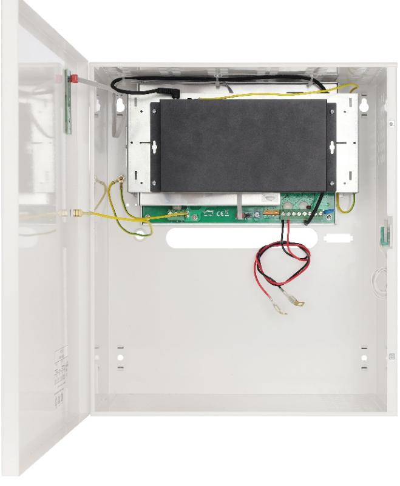

**APS108** v.1.1/II **APS108 10-port switch 8x30W med reservkraft** PRODUKTKODE TYP: : **SV**

W H D W1 H1 D1

#### **Egenskaper:**

- ź Avbrottsfri strömförsörjning för 8 IP-enheter (54 V DC)
- ź Switch med 10 portar 8 PoE-portar 10/100Mb/s, (data och strömförsörjning) 2 portar 10/100Mb/s (UpLink)
- ź Läge med **Lång räckvidd** (upp till 250m)
- ź 30 W för varje PoE-port, stöder enheter som uppfyller standarden IEEE802.3af/at vid **(PoE +)**
- ź Lysdioder för indikering
- ź Metallhölje färg vit RAL 9003 med plats för fyra 7 Ah/12 V-batterier
- ź Stöder automatisk inlärning och automatiskt åldrande av MAC-adresser (1K storlek)

### **BESKRIVNING**

APS108 är avsedd för avbrottsfri strömförsörjning av 8 IP-enheter (54 V DC-försörjning).

Systemets huvudsakliga komponenter inkluderar:

- PoE-switch med 10 portar
- 54 V (PSB-48V5A) buffertströmförsörjning med fyra 7 Ah / 12V-batterier

Vid strömavbrott aktiveras omedelbart reservkraft(batterier)

 Automatisk upptäckt av enheter som drivs med standarden PoE/PoE+ aktiveras vid portar 1-8 på switchen. Up Link-portarna används för anslutning till en annan nätverksenhet. Lysdioderna på frontpanelen indikerar enhetens driftsstatus (Beskrivs i tabell 8)

 Switchen sitter inuti ett metallhölje (färg RAL 9003) med plats för fyra 7 Ah/12 V-batterier. Höljet är utrustat med en sabotageswitch som aktiveras om luckan öppnas (frontpanelen). APS108 är försedd med tre lysdioder på frontpanelen.

# **SWITCHENS PARAMETRAR**

| Portar                  | 10 portar 10/100 Mb/s (8 st PoE + 2 st UPPLÄNKAR) med automatisk hantering av anslutningshastighet och MDI/MDIX Auto Cross) |
|-------------------------|--------------------------------------------------------------------------------------------------------------------------------|
| PoE-strömförsörjning    | IEEE 802.3af/at (Port 1 till 8 ), 54 V DC / 30 W i varje port *                                                                |
| Läge med lång räckvidd  | Lång räckvidd, VLAN                                                                                                            |
| Protokoll, standarder   | IEEE802.3, 802.3u, 802.3x CSMA/CD, TCP/IP                                                                                      |
| Bandbredd               | 1,6 Gb/s                                                                                                                       |
| Överföringsmetod        | Lagra-och-vidarebefordra                                                                                                       |
| Synlig driftsindikering | Switchens strömförsörjning; Länk/Act; PoE-status                                                                         |

* 30 W per port är maximal belastning per port, total är maximal belastning 240 W på samtliga portar. För maximal livslängd rekommenderas en kontinuerlig belastning på maximalt 160 W.

## **ELEKTRISKA PARAMETRAR**

| Nätförsörjning                                                   | ~200-240 V; 50 Hz                                                                                |
|------------------------------------------------------------------|--------------------------------------------------------------------------------------------------|
| Strömstyrka upp till                                             | 1,5 A                                                                                            |
| Strömförsörjning                                                 | 270 W                                                                                            |
| Utgångsström vid PoE-portarna (RJ45)                             | 8 x 0,6 A ΣI=4,5 A (max.)                                                                        |
| Utgångsström vid PoE-portarna (RJ45)                             | 54 V DC                                                                                          |
| Kortslutningsskydd SCP och överbelastningsskydd OLP           | 105% ÷ 150% PSU-effekt, automatisk retur (felet kräver frånkoppling av utgångskretsen för DC) |
| PSU-strömförbrukning                                             | 150 mA/54 V DC                                                                                   |
| Batteriets laddningsström                                        | 0,5 A max. /4x7 Ah (+/-5%)                                                                       |
| Batterikretsskydd SCP och retur polaritetsanslutning          | Säkring (T5A)                                                                                    |
| Djupurladdningsskydd UVP                                         | U<38 V (± 5%) – frånkoppling av batterier                                                        |
| Sabotageskydd: - MANIPULERINGS-indikator när höljet öppnas | - mikroswitch, NC-kontakter (stängt hölje), 0,5 A@50 V DC (max.)                              |

## **MEKANISKA PARAMETRAR**

| Mått                | W=330, H=380, D+D =173+8 [+/- 2mm] 1 W =335, H =385 [+/- 2mm] 1 1                                                                           |
|---------------------|---------------------------------------------------------------------------------------------------------------------------------------------------------|
| Batterifackets mått | 325x150x168 (WxHxD) max                                                                                                                                 |
| Brutto- / nettovikt | 6,5 / 7,1 [kg]                                                                                                                                          |
| Hölje               | Stålplatta, DC01 1,0mm färg vit RAL 9003                                                                                                                |
| Förslutning         | Spårskruv x 2 (fram), (låsaggregat möjligt)                                                                                                             |
| Anslutningar        | Strömförsörjning till enheterna: RJ45-uttag 230 V-ingång: Φ 0,63-2,50 (AWG 22-10), Batteriutgång BAT: 6,3F-2,5 MANIPULERINGS-utgång: ledningar |
| OBS!                | Höljet ska inte vidröra monteringsytan för att kablar ska kunna dras.                                                                                   |