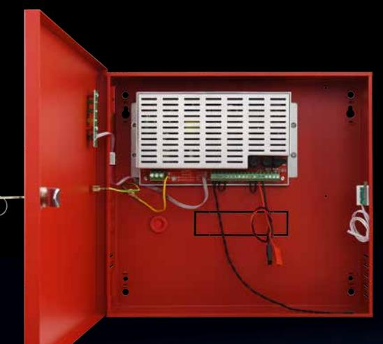
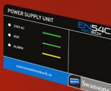

# EN54C Redbox

Batteribackup för brandlarm från Swansons.

Strömförsörjningsaggregat anpassad för drift av brandlarmsutrustning. Certifierad av tredje part enl. EN54-4; 1997/A2:2006 +EN 12101-10

Primärswitch teknik som är högeffektiv och är strömsnål och har mycket stabil utspänning.

Egenförbrukningen är mycket låg på alla aggregat.

Har två övervakade utgångar och larm för nätfel och batterifel.

- Hög driftsäkerhet!
- Stor batteriplats!
- Plats för tillbehör!
- Certifierat för brandlarm och rökgasventilation
- Konkurrenskraftigt pris!

**Swansons Telemekanik AB** Hålstensvägen 4 446 37 Älvängen tfn: 0303-74 63 20 info@swtm.se

# EN54 C Redbox Batteribackup för brandlarm

#### **Skydd**

Aggregatet är skyddat mot överbelastning och kortslutning.

Inbyggt skydd mot djupurladdning av batterierna. Nät, last och batteri är skyddas av säkring.

## **Indikeringar och larm**

Normaldrift:Indikeras med 2st gröna lysdioder. 230V AC (grön) Nätspänning ok AUX (grön) Utspänning ok på AUX1 och AUX2 ALARM (gul) Fel Larmrelä EPS Nätspänningsfel Larmrelä ALARM Summalarm

## **Utförande**

Aggregaten är utförda i röd självventilerad plåtkapsling och avsett för väggmontage. Förberedd för 9st genomförningar 4 uppåt + 4st åt höger + 1st bakåt.

#### **Tekniska data**

| Inspänning     | 230VAC (-15% +10%)         |  |  |  |  |
|----------------|----------------------------|--|--|--|--|
|                | 1 fas 50-60Hz              |  |  |  |  |
| Reglering      | max 0,6 %                  |  |  |  |  |
| Utspänning     | 27,6VDC                    |  |  |  |  |
| Rippelspänning | max 0,1 % av utspänningen  |  |  |  |  |
| Temp. omr.     | -5 – 40 C                  |  |  |  |  |
| Larmrelä       | Växlande,                  |  |  |  |  |
|                | Max 1A 50V                 |  |  |  |  |
| Kapsling       | IP30                       |  |  |  |  |
| CE-märkt       | EN 60950-1:2007            |  |  |  |  |
|                | EN 61000-6-3:2008+A1:20112 |  |  |  |  |
|                | EN IEC 63000:2019-01       |  |  |  |  |
|                | EN 50130-4:2015+A1:2015-03 |  |  |  |  |
| Certifieringar | EN54-4/A2                  |  |  |  |  |
|                |                            |  |  |  |  |

EN12101-10

| E-nr      | Typ         | Total utström         |                               | Batteriplats | Internförbr batteridrift | H x B x D       |
|-----------|-------------|-----------------------|-------------------------------|--------------|--------------------------|-----------------|
|           |             | Kontinuerlig Drift | Intermittent Drift (5 min) |              |                          |                 |
| 52 574 99 | EN54C-2A7   | 1,6A + 0,4A           | 2A + 0A                       | 2 x 9Ah      | 52mA                     | 305 x 330 x 82  |
| 52 575 00 | EN54C-2A17  | 1,2A + 0,8A           | 2A + 0A                       | 2 x 20Ah     | 52mA                     | 402 x385 x 88   |
| 52 575 01 | EN54C-5A17  | 3,8A + 1,2A           | 5A + 0A                       | 2 x 20Ah     | 55mA                     | 402 x385 x 88   |
|           | EN54C-10A40 | 8,2+ 1,8A             | 10A + 0A                      | 2 x 45Ah     | 85mA                     | 407 x 420 x 178 |
| 52 575 03 | EN54C-10A65 | 7,4A + 2,6A           | 10A + 0A                      | 2 x 65Ah     | 85mA                     | 648 x 410 x 180 |

**Swansons Telemekanik AB** Hålstensvägen 4 446 37 Älvängen tfn: 0303-74 63 20

info@swtm.se