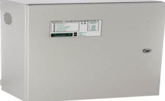
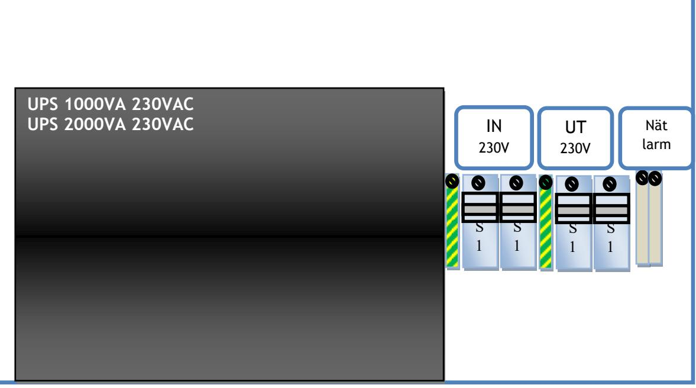
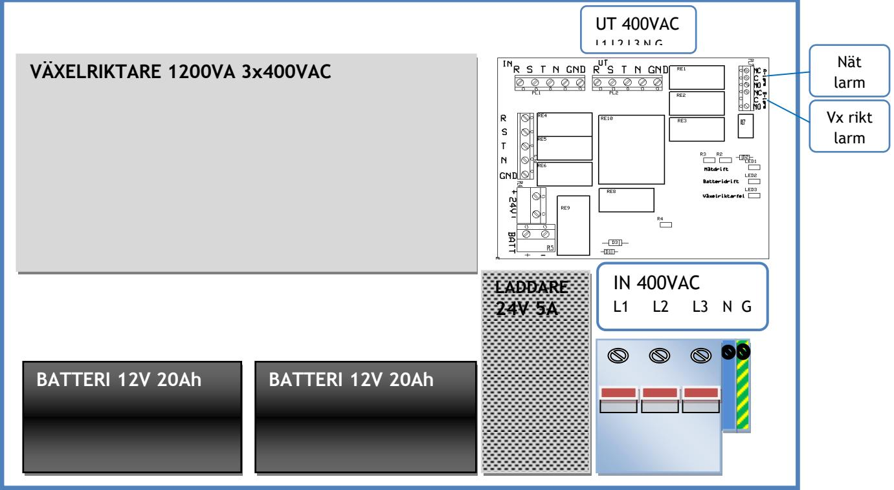
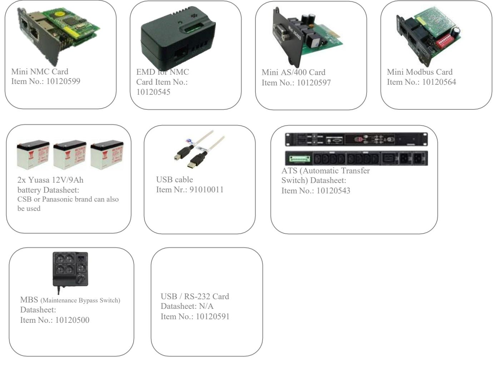

# **UPS2200**  UPS för industri och krävande miljö

 **SM40** 

**SÄKERHET:** Aggregatet är skyddad mot överbelastning och kortslutning. Inbyggt skydd mot djupurladdning av batterierna.

Nät, last och batteri skyddas av säkringar. Dvärgbrytare finns för att bryta inspänning och utspänning. Larmrelä som ger en slutning vid nätavbrott. Kan användas för styrning av port eller vidaresändning av larmsignal.

Som separat tillbehör finns en larmkort med potentialfria växlande kontakter eller via nätverk, för överföring av larm för nätavbrott och låg batterispänning.

#### **BESKRIVNING**

UPS för väggmontage lämplig drift av alla typer av utrustningar som tex datorer, larm, portstyrningar och trygghetssystem, som behöver avbrottsfri kraft.  **Strömförsörjning med plats för batteri**

> **UPS2200-900** är en online UPS 1-fas med inbyggda underhållsfria blybatterier. Med on-Line teknologi erbjuds användaren ett komplett skydd för alla typer av problem på nätet såsom: avbrott, över och underspänning, transienter, frekvensvariationer, mikroavbrott.

**UPS2200-1800** är en off-line UPS 1-fas med inbyggda underhållsfria blybatterier. Klarar höga strömmar – upp till 16A.

**UPS2200-3-1200** är en off-line UPS 3-fas med inbyggda underhållsfria blybatterier. Trepolig dvärgbrytare 10A på ingången.

Aggregatet i vit plåtkapsling, IP44, med genomförningar neråt. Inspänning och utspänning ansluts på plint i kapslingen max 10mm2 . Levereras med 3m gummikabel ansluten till ingången.

#### **TEKNISKA DATA**

| Inspänning       | 188-265VAC 1 fas 40-70Hz           |
|------------------|------------------------------------|
| Temp.omr-        | -10 – 30 C                         |
|                  | Power Factor >0.98 @ full RCD load |
| AC Mode          | 89 %                               |
| Battery Mode     | 83 %                               |
| Recharge         | 7h to 90%                          |
| Time Batteri: | Enligt tabell nedan                |
|                  |                                    |

CE-märkt enligt EN61000-6-2 och EN61000-6-3

| E- nummer | Typ UPS2200-1800 | Beskrivning 230VAC Sin 1800W 1-fas | Batteri 4x9Ah | Säkring 16A | Kapsling IP44 | BxHxD mm 600x342x210 |
|--------------|---------------------|---------------------------------------|------------------|----------------|------------------|-------------------------|
|              | UPS2200-900         | 230VAC Sin 900W 1-fas                 | 2x9Ah            | 10A            | IP44             | 450x320x180             |
|              | UPS2200-1800        | 230VAC Sin 1800W 1-fas                | 4x9Ah            | 16A            | IP44             | 570x340x220             |
|              | UPS2200-3-1200VA    | 230VAC Sin 1000W 3-fas                | 2x20Ah           | 16A            | IP44             | 570x340x220             |

**Swansons Telemekanik AB** Hålstensvägen 4 SE-446 37 Älvängen

Telefon nr/Telephone no +46(0)303-746 320

swansonstelemekanik.se info@swtm.se

VAT.NO SE556289017701

# **UPS2200**  UPS för industri och krävande miljö

### **SÄKERHET**

Endast auktoriserad och erfaren personal inom AC och DC får använda, arbeta, **UPS2100** 

serva/underhålla, installera denna enhet. Endast isolerade verktyg får användas i enheten. Observera att farliga spänningar och strömmar förekommer i apparaten både när interna säkringarna är av eller på. UPS MED INBYGGDA BATTERIER

Denna instruktion skall läsas igenom grundligt och förstås av all handhavande personal. Vid minsta tveksamhet om systemets uppbyggnad, funktion, komponenter samt säkerhet skall leverantören kontaktas.

Kontrollera att kretskort och delar sitter fast och inte är transportskadade.

Om batterier används är dessa alltid elektrokemiskt aktiva.

Kortslut inte batteripolerna.

### **INKOPPLING**

- Montera aggregatet fritt. Minst 100mm på varje sida.
- Anslut först 230V AC.
- Starta UPS-en med knappen på ovansidan. Kontrollera att utspänningen är riktig.
- Om lysdiod för nätindikering ej tänds kontrollera inspänning och ingångssäkringarna är tillslagna.
- Löser utgångssäkringarna, kontrollera inkoppling och inkopplade apparater**.**

Telefon nr/Telephone no +46(0)303-746 320

swansonstelemekanik.se info@swtm.se

## **SÄKERHET**

Endast auktoriserad och erfaren personal inom AC och DC får använda, arbeta, **UPS2100** 

serva/underhålla, installera denna enhet. Endast isolerade verktyg får användas i enheten. Observera att farliga spänningar och strömmar förekommer i apparaten både när interna säkringarna är av eller på. UPS MED INBYGGDA BATTERIER

Denna instruktion skall läsas igenom grundligt och förstås av all handhavande personal. Vid minsta tveksamhet om systemets uppbyggnad, funktion, komponenter samt säkerhet skall leverantören kontaktas.

Kontrollera att kretskort och delar sitter fast och inte är transportskadade.

Om batterier används är dessa alltid elektrokemiskt aktiva. Kortslut inte batteripolerna.

#### **INKOPPLING**

- Montera aggregatet fritt. Minst 100mm på varje sida.
- Anslut först utgående last.
- Därefter kopplas batterierna in och sätt i batterisäkringen
- Anslut 230V AC kontrollera att dvärgbrytaren står i läge off.
- Starta UPS-en med att spänningssätta ingången och slå till dvärgbrytaren. Kontrollera att utspänningen är riktig och att grön led för nät tänds på styrkortet.
- Om lysdiod för nätindikering ej tänds kontrollera inspänning och ingångssäkringarna är tillslagna.
- Löser säkringarna, kontrollera inkoppling och inkopplade apparater**.**

**Swansons Telemekanik AB** Hålstensvägen 4 SE-446 37 Älvängen

Telefon nr/Telephone no +46(0)303-746 320

swansonstelemekanik.se info@swtm.se

**S1** 

# **UPS2200**  UPS för industri och krävande miljö

### **Optional Accessories**

