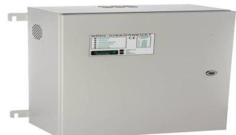
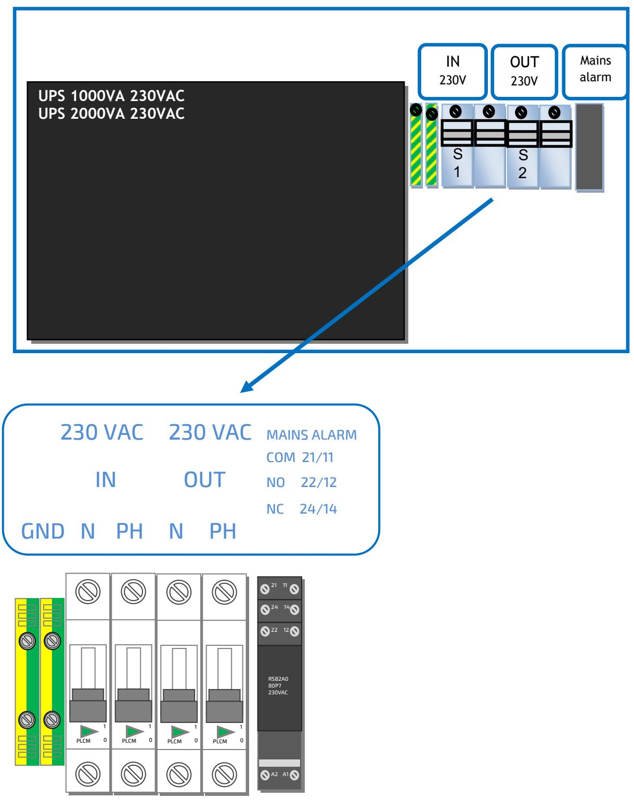

# Manual för portaggregat UPS2200

| Innehållsförteckning       | Sida 1 |
|----------------------------|-----------|
| Säkerhet, Presentation,    | 2         |
| Funktionsbeskrivning       | 2         |
| Installation/Driftsättning | 3/4       |
| Skötsel / Batteribyte      | 4         |
| Inkoppling                 | 5         |
| Tekniska data              | 6         |

Swansons Telemekanik AB swansonstelemekanik.se

#### 1. Säkerhet

- Endast auktoriserad och erfaren personal inom AC och DC får använda, arbeta, serva/underhålla, installera denna enhet.
- Endast isolerade verktyg får användas i enheten.
- Observera att farliga spänningar och strömmar förekommer i apparaten både när interna säkringarna är av eller på.
- Denna manual skall läsas igenom grundligt och förstås av all handhavande personal. Vid minsta tveksamhet om systemets uppbyggnad, funktion, komponenter samt säkerhet skall leverantören kontaktas.

#### 2. Presentation

GENERELLT: UPS2200 är ett reservkraftsaggregat för drift av olika typer av portstyrningar som ska kunna manövreras även när nätet försvinner.

Klarar stora startströmmar och lämnar ren sinusspänning både vid nät och batteridrift. Aggregatet är utfört i kiselvit plåtkapsling, för väggmontage, med IP klass 44. Nätfelsrelä med potentialfria kontakter för styrning eller larmpresentation.

#### 3. Funktionsbeskrivning

UPS: Oneline teknik med så kallad double-conversion, säkerställer stabil och störningsfri utspänning även om inspänningen varierar och har kraftiga störningar och skyddar känslig utrustning.

UPS-enhetens inkommande 230 VAC driver den smarta batteriladdare, som är av trestegs typ, och som laddar upp batterierna till 90% på fyra timmar. Batterierna driver sedan den inbyggda växelriktaren som kopplas automatiskt in vid nätbortfall. Den statiska switchen som sköter detta har en omkopplingstid på 0 ms på 900W aggregatet och den kraftfullare varianten har en omkopplingstid på 15ms.

Hög verkningsgrad 89% , effekt faktor 0.9, belastningsstyrda fläktar och den snabba batteriladdningen, gör att livslängden på UPS-en blir lång.

Aggregatet består av en säkringscentral med dvärgbrytare för inkommande och utgående spänning samt ett larmrelä för nätfel. UPS enhet med växelriktare och inbyggda batterier.

BATTERI: är ventilreglerade, underhållsfria 10-12 års batterier, designade för UPS drift med högt strömuttag under kort tid. Den smarta laddaren säkerställer batteriladdningen så skador på batteriet förhindras som kan äventyra livslängden. För att förhindra djupurladdning stänger UPS en av sig innan batterierna når skadlig nivå och startar igen automatiskt när nätspänningen kommer tillbaka.

INDIKERINGAR OCH LARM: Alla aggregat är försedda med nätavbrottslarm med tvåpoliga växlande reläkontakter. Intelligent LCD display med fullständig information om UPS-en, där man bland annat kan utläsa in- och utspänning, last, UPS- och batteristatus. Växelriktaren, laddning och batterier övervakas kontinuerligt. Larm presenteras i displayen eller genom larmkort som den kan bestyckas med. De olika typerna som kan användas är; larmkort med reläkontakter, Modbus eller SNNP utgångar.

UPS2200-900: Online UPS med 2x9Ah AGM batterier och hög stabilisering av 230VAC utspänningen även med kraftiga störningar på inspänning. Intern bypassomkoppling om den utsätts för onormala laster. 10A dvärgbrytare på in och utgång.

UPS2200-1800: är en off-line UPS 1-fas med 4x9Ah AGM batterier. Är försedd med ett kraftigt UPS-relä och klarar höga strömmar – upp till 16A. 10A dvärgbrytare på in- och utgång.

UPS2200 har följande skydd:

- Kortslutningsskydd
- Överbelastningsskydd
- Djupurladdningsskydd
- Automatsäkringar för inkommande och utgående nät.
- Säkringar för växelriktare och batterier

#### 4. Inkoppling

.

- Montera aggregatet fritt. Minst 100mm på varje sida.
- Ställ automatsäkringarna för inkommande och utgående spänning i läge av.
- Var noga med att inkommande kabel inte är spänningssatt.
- Anslut först 230VAC kabeln och därefter utgående kablar.
- Kontrollera att anslutningarna är åtdragna och ser riktiga ut.

#### 5. Driftsättning - igångsättning

- Spänningssätt matarkabeln. Ställ automatsäkringarna för inkommande och utgående spänning i läge ON. Starta UPS-en med att trycka in on knappen på fronten i 3 sek, tills det piper. Efter några sekunder startar UPS-en. Nu är aggregatet i drift och all status kan avläsas i displayen.
- Kontrollera UPS driften: Bryt nätspänningen med automatsäkringen för inkommande spänning. Nu växlar displayen från LINE till BATT och den går över till UPS/batteridrift samtidigt som det piper med 4 sekunders mellanrum. Lasten och batteristatus kan avläsas i displayen. Slå till automatsäkringen igen och när spänningen kommer tillbaka tar det ca 10 sek tills UPS-en kopplar över till nätdrift och displayen växlar från BATT till LINE.
- För att stänga av UPS enheten: Bryt spänningen till UPS-en med att antingen slå ifrån säkringen i centralen eller i UPS aggregatet. Tryck in OFF knappen i 3 sek, tills det piper. UPS-en börjar nu sin nedkoppling som tar ca 20 sekunder.
- Uppstart utan inkommande spänning: Starta UPS-en med att trycka in ON knappen på fronten i 3 sek, tills det piper. Efter några sekunder startar UPS-en och i displayen visas BATT. Den är nu i UPS drift och piper med 4 sekunders mellanrum för att indikera detta. Ställ utgående automatsäkring i till. Nu lämnar den 230VAC så länge batterierna räcker och går över i normal nätdrift så fort inkommande matningspänning erhålls.

#### 5. Skötsel - Batteribyte

- Skötsel: Batterierna är helt underhållsfria och behöver bytas efter ca 7-10 år. Viktigt för att hålla livslängden är att omgivningstemperaturen hålls till ca 20 grader. Varje ökning med 5 grader halverar livslängden. I övrigt är aggregatet underhållsfritt.
- Service: För att byta UPS enhet så bryt spänningen till UPS-en med att antingen slå ifrån säkringen i centralen eller i UPS aggregatet. Tryck in OFF knappen i 3 sek, tills det piper. UPS-en börjar nu sin nedkoppling som tar ca 20 sekunder. Tag ur UPS enheten genom att lossa spännbanden. Lossa inkommande och utgående kablage ifrån UPS-en och lyft ur den från kapslingen. Sätt in den nya och koppla in inkommande och utgående kablar. Starta UPS-en med att trycka in ON knappen på fronten i 3 sek, tills det piper. Efter några sekunder startar UPS-en. Nu är aggregatet i drift och all status kan avläsas i displayen. Spänningsätt UPS en med att koppla till inkommande spänning.
- Batteribyte: Bryt spänningen till UPS-en med att antingen slå ifrån säkringen i centralen eller i UPS aggregatet. Tryck in OFF knappen i 3 sek, tills det piper. UPS-en börjar nu sin nedkoppling som tar ca 20 sekunder. Tag ur UPS enheten genom att lossa spännbanden. Lossa fronten på UPS-en och ta ur de gamla batterierna och koppla ur batterikablarna. Koppla in de nya batterierna och sätt in dem i UPS-en. Starta UPS-en med att trycka in ON knappen på fronten i 3 sek, tills det piper. Efter några sekunder startar UPS-en. Nu är aggregatet i drift och all status kan avläsas i displayen. Spänningsätt UPS en med att koppla till inkommande spänning.

## 5. Inkoppling

UPS2200-900/ UPS2200-1800

## 5. Tekniska data

| Tekniska Data        | 2200-900      | 2200-1800     | Anm          |
|----------------------|---------------|---------------|--------------|
| Inspänning           | 176-300 VAC   | 176-300 VAC   |              |
| Unspänning           | 230 VAC       | 230 VAC       |              |
| Frekvensområde       | 40/70 Hz      | 40/70 Hz      |              |
| TDH sinusvåg         | < 2%          | < 2%          |              |
| Återuppladdningstid  | 4h            | 4h            |              |
| Batteri              | 2 x12V 9Ah    | 4 x12V 9Ah    | 10-12års AGM |
| Märkeffekt           | 900W          | 1800W         |              |
| Omgivningstemp       | -10° - +25° C | -10° - +25° C |              |
| UPS typ              | Online        | Offline       |              |
| Omkopplingstid UPS   | 0 ms          | 15ms          |              |
| Säkringar MCB        | 2-pol 10A     | 2-pol 10A     | C - karaktär |
| Djupurladdningsskydd | JA            | JA            |              |
| Omgivningstemperatur | 0-25          | 0-25          |              |
| Grader celsius       |               |               |              |
| Kapslingsklass       | IP44          | IP44          |              |
| Mått i mm            | 450x320x180   | 570x340x220   |              |
|                      |               |               |              |

#### SKYDD

| Överbelastning av växelriktare Maxvärden | Konstant - 100%-105%; 1min - 105%-130%; 10s - 130%-150%; 300ms - >150%; bypass kopplas in vid högre BATTERI : - 10s 100%-150%; cut-off at higher |
|---------------------------------------------|-----------------------------------------------------------------------------------------------------------------------------------------------------------------------|
| Laddare                                     | 1.5A                                                                                                                                                                  |

#### GODKÄNNANDE

Säkerhet; EN 62040-1:2008+A1:2013. EMC; EN 62040-2, EN 61000 3-2, EN 61000-6-2, EN 61000-2-2, EN 61000 3-2, EN 61000 3-3, EN 61000 4-2 Declaration of RoHS & PFOS Conformity