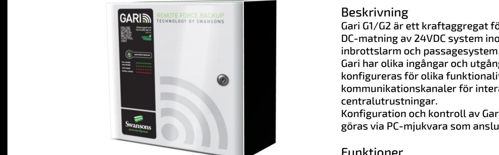
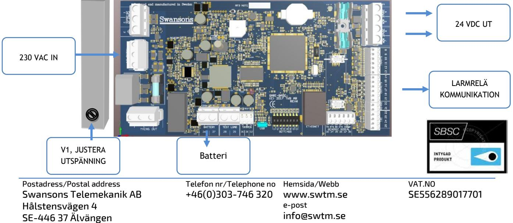

### SKYDD

Aggregatet är skyddat mot överbelastning och kortslutning.

Skyddad mot djupurladdning av batterierna.

Nät, last och batteri skyddas av säkringar.

## Indikeringar

Statusindikering på fronten, mer info i manual.

| Tekniska data           |                   |  |  |
|-------------------------|-------------------|--|--|
| Inspänning              | 230 VAC +/- 15%   |  |  |
|                         | 1 fas 50-60Hz     |  |  |
| Utspänning nätdrift     | Justerbar25-28VDC |  |  |
| Utspänning batteridrift | 20,9-26,5 VDC     |  |  |
| Rippelspänn.            | max 150mVpp       |  |  |
| Max. intern förbrukning | 100mA             |  |  |
| Rek. temp. omr.         | 5 – 25 C          |  |  |
| Max. temp. omr.         | 5 - 40 C          |  |  |
| Utgångar                | 2st, gem. avsäkr. |  |  |
| Certifiering            | EN 50131-6:2008,  |  |  |
|                         | "Larmklass 4"     |  |  |
| Godkännande             | SSF1014           |  |  |
| CE                      | EN61000-6-3:2001, |  |  |
|                         | EN61000-6-2:2005  |  |  |
|                         |                   |  |  |

# Beskrivning

Gari G1/G2 är ett kraftaggregat för avbrottsfri DC-matning av 24VDC system inom inbrottslarm och passagesystem. Gari har olika ingångar och utgångar som konfigureras för olika funktionalitet samt kommunikationskanaler för interaktion med centralutrustningar.

Konfiguration och kontroll av Gari kan även göras via PC-mjukvara som ansluter över USB.

### Funktioner

- Justerbar utspänning, anpassas efter last utan att påverka batteriladdningen.
- Smart-Charge Unik 3-stegs laddning 1. Boost för snabb återladdning. 2. Utjämningsladdning 3. Vila, laddningen stängs ner, batterierna slipper att åldras i förtid pga kontinuerlig laddström som påverkar livslängden negativt.

Aktiv kontroll av batterierna med intern konstlast, meddelar när batterierna behöver bytas ut.

- Övervakar bl.a. följande funktioner, Indikeras via LED samt RS485
	- o Nätspänning
		- o Batteristatus
		- o Batteribyte
		- o Laddning o Skalskydd
		- o Interna säkringar

o Last, aktuell, ,nominell, toppvärde

- Mjukvaruuppdatering under drift via USB.
- Konfigureras via USB.

| E: nummer    | Modell | Ström | Nominell last Larmklass 1-2 | Nominell last Larmklass 3-4 | Max peak | Batteriplats (max) | HxBxD                 |
|--------------|--------|-------|--------------------------------|--------------------------------|-------------|-----------------------|-----------------------|
| 52 571 74 | G1     | 15A   | 7,8 A                          | 3,1 A                          | 12A         | 2 x 100Ah             | 600 x 405 x 287 |
| 52 571 75 | G2     | 6A    | 3,5 A                       | 1,4 A                          | 5,25A       | 2 x 45Ah              | 400 x 405 x 257       |

Postadress/Postal address Swansons Telemekanik AB Hålstensvägen 4 SE-446 37 Älvängen

Telefon nr/Telephone no +46(0)303-746 320 Hemsida/Webb www.swtm.se e-post info@swtm.se

VAT.NO SE556289017701

# GARI **NYHET** SSF godkänd likriktare för inbrottslarm

## Dashboard

Konfigureringsprogram Namida (via USB)  **SM40** 

#### Funktioner:

Konfigurering av enheten Aktuella fel Uppgradera mjukvara under drift

### Statusinformation

Spänning: Ut/laddning

- Last: Aktuell Genomsnitt: 1h, 4h, 24h
- Batteri: Backuptid Batteriålder Faktisk batterikapacitet Aktuell ladd. ström

# INKOPPLING

- Montera aggregatet fritt. Minst 100mm på varje sida.  **Strömförsörjning med plats för batteri**
	- Anslut först 230V AC.
	- Lysdiod för nätspänning tänds. Kontrollera att utspänningen är den önskade.
	- Spänningsjustering görs direkt på likriktaren.
	- Om lysdiod för nätindikering ej tänds kontrollera inspänning och ingångssäkringarna.
	- Anslut batterierna och därefter lasten.
	- Löser utgångssäkringarna, kontrollera inkoppling och inkopplade apparater.

| Modell | Säkring F1 Nät | Säkring F2 UT | Säkring F3 BATTERI |
|--------|-------------------|------------------|-----------------------|
| G1     | 4AT ker.          | 12A              | 15A                   |
| G2     |                   |                  |                       |
| G2     | 3,15AT ker.       | 6,3A             | 15A                   |

