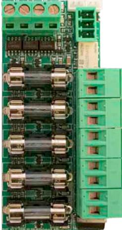
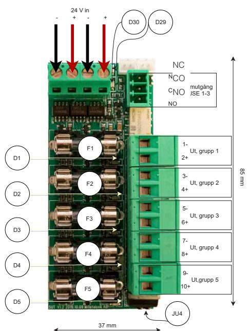

# Tillval

### 5 Output module

# 5 Output module Om 5 Output module

5 Output module är en avsäkringsmodul med fem helt avsäkrade utgångar. Kortet monteras på L-vinkel (S2 adapter) innan den sätts i batteribackup.

| Variantöversikt    | Kretskort                | Kretskort                | Kretskort                | Kretskort                |  |
|--------------------|--------------------------|--------------------------|--------------------------|--------------------------|--|
|                    | PRO1                     | PRO2                     | PRO2 V3                  | PRO3                     |  |
| NOVA 24V 5A FLX S  | 1 st. 5 Output module | 1 st. 5 Output module | 1 st. 5 Output module | 1 st. 5 Output module |  |
| NOVA 24V 10A FLX S | 1 st. 5 Output module | 1 st. 5 Output module | 1 st. 5 Output module | 1 st. 5 Output module |  |
| Med tillvalsplåt:  |                          |                          |                          |                          |  |
| NOVA 24V 5A FLX M  | 3 st. 5 Output module | 3 st. 5 Output module | 3 st. 5 Output module | 3 st. 5 Output module |  |
| NOVA 24V 10A FLX M | 3 st. 5 Output module | 3 st. 5 Output module | 3 st. 5 Output module | 3 st. 5 Output module |  |
| NOVA 24V 15A FLX M | 3 st. 5 Output module |                          | 3 st. 5 Output module |                          |  |
| NOVA 24V 25A FLX M | 3 st. 5 Output module |                          | 3 st. 5 Output module |                          |  |
| Med tillvalsplåt:  |                          |                          |                          |                          |  |
| NOVA 24V 5A FLX L  | 3 st. 5 Output module | 3 st. 5 Output module | 3 st. 5 Output module | 3 st. 5 Output module |  |
| NOVA 24V 10A FLX L | 3 st. 5 Output module | 3 st. 5 Output module | 3 st. 5 Output module | 3 st. 5 Output module |  |
| NOVA 24V 15A FLX L | 3 st. 5 Output module |                          | 3 st. 5 Output module |                          |  |
| NOVA 24V 25A FLX L | 3 st. 5 Output module |                          | 3 st. 5 Output module |                          |  |

### Innehåll

| 5 Output module                                  | 2 |
|--------------------------------------------------|---|
| Anslutningar till och från 5 Output module       | 3 |
| Inkoppling av 5 Output module till batteribackup | 3 |
| Inkoppling av last på 5 Output module            | 3 |
| Larm & funktioner                                | 3 |
| Kretskortsöversikt 5 Output module               | 4 |
| Förklaring, kretskortsöversikt 5 output module   | 4 |
| Tekniska data: 5 Output module                   | 5 |

## Anslutningar till och från 5 Output module

| Huvudkort                                       | Avsnitt i batteri backup manual | Kopplas     | Tillvalskort    |  |
|-------------------------------------------------|------------------------------------|-------------|-----------------|--|
| PRO1                                            |                                    |             | 5 Output module |  |
| Larm: J15                                       | 3.3                                | Anslut till | FUSE ALARM 2-3  |  |
| Last: Lastutgång 1                              | 3.2                                | Anslut till | IN 12 V/ 24 V   |  |
|                                                 |                                    |             |                 |  |
| PRO2                                            |                                    |             | 5 Output module |  |
| J7. Larm: Ansl. larm från ext. säkringskort. | 3.3                                | Anslut till | FUSE ALARM 2-3  |  |
| Last: Lastutgång 1                              | 3.2                                | Anslut till | IN 12 V/ 24 V   |  |
|                                                 |                                    |             |                 |  |
| PRO2 V3                                         |                                    |             | 5 Output module |  |
| J7. Larm: Ansl. larm från ext. säkringskort. | 3.3                                | Anslut till | FUSE ALARM 2-3  |  |
| Last: Lastutgång 1                              | 3.2                                | Anslut till | IN 12 V/ 24 V   |  |
|                                                 |                                    |             |                 |  |
| PRO3                                            |                                    |             | 5 Output module |  |
| Larm J10                                        | 3.3                                | Anslut till | FUSE ALARM 2-3  |  |
| Last: Lastutgång 1                              | 3.2                                | Anslut till | IN 12 V/ 24 V   |  |

Inkoppling av 5 Output module till batteribackup

Inkoppling av last på 5 Output module

- *• Maxlast är 10A per lastutgång, och kortets totala last får ej överstiga 16 A.*
- 1. Anslut lastkablage till P1:1-10 på avsäkringsmodul för last.
- 2. Larm ansluts på plint FUSE ALARM 1-3

Först därefter kan batteribackup driftsättas. Se manual för batteribackup.

Larm & funktioner

Se tekniska data.

Data och konstruktion kan ändras utan föregående meddelande. 3

#### Kretskortsöversikt 5 Output module

## Förklaring, kretskortsöversikt 5 output module

| 12V/24 V in | Inkommande 12V/24 V, använd valfri ingång.                                   |            |  |
|-------------|------------------------------------------------------------------------------|------------|--|
| D29         | Grön indikeringsdiod - Lyser med fast grönt sken när alla säkringar är hela. |            |  |
| D30         | Röd indikeringsdiod - Lyser med fast rött sken när någon säkring är trasig.  |            |  |
| D1-D5       | Grön indikeringsdiod. Lyser med fast grönt sken vid hel säkring.             |            |  |
| F1-F5       | Lastsäkringar                                                                |            |  |
| FUSE 1-3    | Larmutgång, NO, CO, NC.                                                      |            |  |
| JU4         | 24 V obyglad. (Fabriksinställning) 12 V byglad.                              |            |  |
| Grupp 1-5   | Grupp 1                                                                      | Last 1; -  |  |
|             |                                                                              | Last 2; +  |  |
|             | Grupp 2                                                                      | Last 3; -  |  |
|             |                                                                              | Last 4; +  |  |
|             | Grupp 3                                                                      | Last 5; -  |  |
|             |                                                                              | Last 6; +  |  |
|             | Grupp 4                                                                      | Last 7; -  |  |
|             |                                                                              | Last 8; +  |  |
|             | Grupp 5                                                                      | Last 9; -  |  |
|             |                                                                              | Last 10; + |  |

| Artikel benämning   | 5 Output module                                                                                                                                                                                                                |
|------------------------|--------------------------------------------------------------------------------------------------------------------------------------------------------------------------------------------------------------------------------|
|                        |                                                                                                                                                                                                                                |
| Artikel nummer      | A-FU122405OP01LM01                                                                                                                                                                                                             |
| Produkt beskrivning | Avsäkringskort med 5 st avsäkrade utgångar                                                                                                                                                                                     |
| Mått                   | 85 x 37 mm                                                                                                                                                                                                                     |
| Ingångar               | Två ingångar. (För alternativ strömmatning vid byte av näraggregat. För att inte bryta lastspänning.) En plint kan användas som överbygling till nästa tillvalskort, (endast om batteribackupen har plats för två kort). |
| Utspänning             | 12V/24 V                                                                                                                                                                                                                       |
| Utgångar               | Fem prioriterade lastutgångar.                                                                                                                                                                                                 |
| Avsäkring:             | Lastutgång + avsäkrad.                                                                                                                                                                                                         |
| Maxlast                | Maxlast: 10 A per utgång och totalt 16 A.                                                                                                                                                                                      |
| Larmutgångar           | Larmutgångar: Summalarm vid säkringsfel. Larm på potentialfri reläkontakt.                                                                                                                                                     |
| Fellarm:               | Utlöst lastsäkring, potentialfri växling. Slutning CO/NO.                                                                                                                                                                      |
| Indikering:            | Driftsindikering: en indikeringsdiod per lastutgång+/-. Fast grönt sken= normaldrift, släckt = trasig säkring.                                                                                                              |

## Tekniska data: 5 Output module

Denna sida har avsiktligen lämnats tom

Denna sida har avsiktligen lämnats tom

Data och konstruktion kan ändras utan föregående meddelande. 7

Milleteknik AB, Ögärdesvägen 8 B, 433 30 Partille 031-34 00 230 www.milleteknik.se