Redundancy Panel 1HE

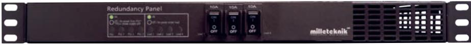

Redundancy Panel 1HE

# SÄKERHET - LÄS DET TA FÖRST!

- 100 mm fritt utrymme skall lämnas ovan och under enheten.
- Enheten är avsett för bruk i kontrollerad inomhusmiljö.
- Endast personer med behörighet bör installera och underhålla enheten.
- Det är installatörens ansvar att enheten är lämpad för tänkt bruk.
- Dokument som medföljer enheten skall förvaras i det eller i dess omedelbara närhet.
- Ventilation skall ej övertäckas.
- Nätspänning bör vara bortkopplad under installation.
- Alla uppgifter med reservation för ändringar.

## Garanti och support

Produkten har två års garanti, från inköpsdatum (om inget annat avtalats). Vi ger kostnadsfri support på telefon, 031-313 45 42 och e-post, (support@ milleteknik.se), under garantitiden. Ersättning för res- och eller arbetstid i samband med lokalisering av fel, installerande av reparerad eller utbytt vara ingår ej i garantin. Garantitiden kan, för vissa produkter, förlängas vid inköpstillfället med 3 år (vilket då ger totalt 5 års garanti). Kontakta Milleteknik för mer information.

Milleteknik ger support under produktens livslängd, dock som längst 10 år efter inköpsdatum. Byte till likvärdig produkt kan förekomma om Milleteknik bedömer att reparation inte är möjlig. Kostnader för support tillkommer efter det att garantitiden har gått ut.

#### Produktens livslängd, miljöpåverkan och återvinning

Milletekniks produkter är designade för lång livslängd vilket minskar miljöpåverkan. Produktens livslängd är beroende på, bland annat miljöfaktorer, främst omgivningstemperatur, oförutsedd belastning på komponenter som blixtnedslag, yttre åverkan, handhavandefel, med flera.

Milletekniks produkter återvinns genom att lämnas till närmaste återvinningsstation eller sändas åter till Milleteknik. Milleteknik betalar inte för frakt av produkter som sänds åter till oss för återvinning. Besök www.milleteknik.se för mer information.

# Om Redundancy Panel 1HE

Redundancy Panel 1HE är en rackmonterad enhet för strömstyrning av AGG 24 150-1HE eller batteribackuper från Milleteknik. Redundancy Panel 1HE har tre (3) ingångar vilket innebär att det är möjligt att ansluta upp till tre (3) nätaggregat (AGG 24 150-1HE) eller tre batteribackuper till en redundanspanel. Om två av tre nätaggregaten (AGG 24 150-1HE) / batteribackuper slutar att fungera som strömkälla till systemet täcker det tredje och sista fungerande nätaggregatet. Redundancy Panel 1HE larmar för om någon av strömkällorna slutar att fungera eller vid lastsäkringsfel.

Användningsområde

Där behov av redundans i 24 V strömförsörjning finns.

Om detta dokument

Gällande och senast publicerad utgåva av detta dokument finns på www. milleteknik.se eller kan rekvireras via e-post, info@milleteknik.se (ange enhetens namn och serienummer). Detta dokuments giltighet kan inte garanteras, då ny utgåva publiceras utan föregående meddelande.

## Installation

Denna anvisning beskriver installation och driftsättning av Redundancy Panel 1HE.

Steg för montering och inkoppling

Montering, anslutning och driftsättning skall ske i följande steg

1. Montering på sida 6.

2. Inkoppling Redundancy Panel 1HE på sida 7.

2.1 Koppla Redundancy Panel 1HE tillsammans med AGG 24 150-1HE på sida 8.

3. Anslutning av 24 V, last, kommunikation och larm på Redundancy Panel 1HE på sida 9. 4. Driftsättning Redundancy Panel 1HE på sida 10.

# Komponentöversikt Redundancy Panel 1HE Säkring last 1-3 Framsida

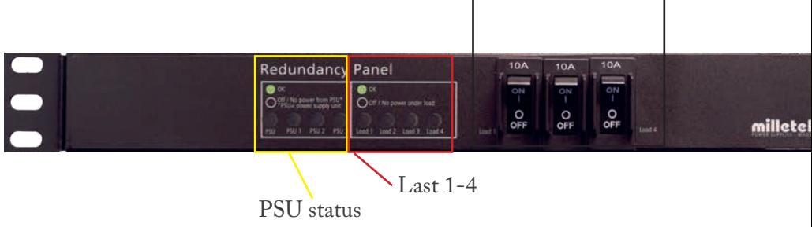

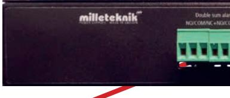

Dubblerat summalarm, NO/COM/NC+NO/COM/NC. Summalarm: larm vid bortfall av spänning från nätaggregat ett, två och tre (beroende på vilka som är inkopplade), utlöst lastsäkring 1, 2, 3, och 4, (beroende på vilka som är anslutna).

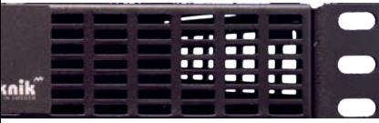

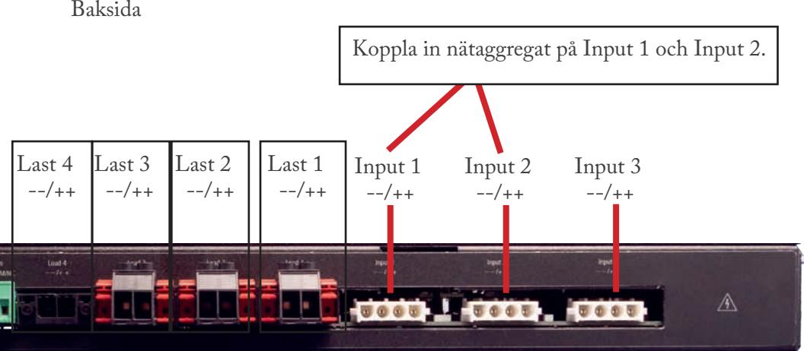

#### 1. Montering

Enheten skall monteras i 19" rack. Konsol skruvas fast i rack med minst två, en på varje sida, M6 skruv och korgmutter. Använd lämplig skruv och mutter för rack. Skruv och mutter ingår ej.

#### 100 MM FRIT T U TRYMME SKALL LÄMNAS OVAN OCH UNDER.

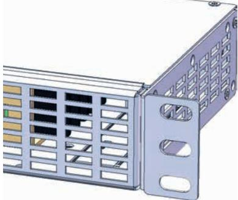

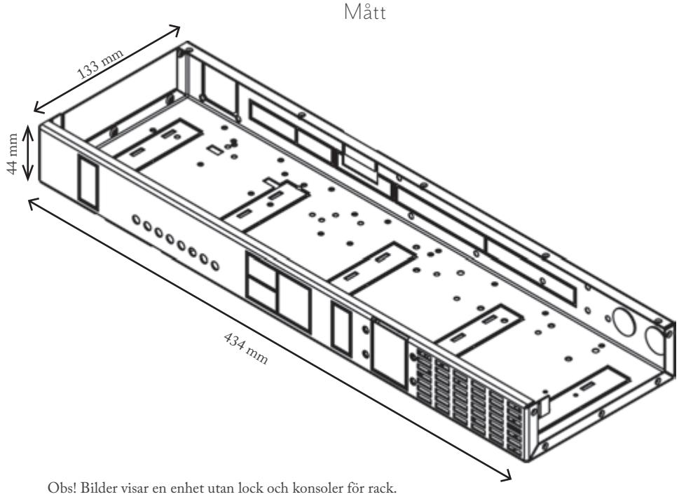

# SÄKERHET

- Endast personer med behörighet bör installera och underhålla systemet.
- Nätspänning bör vara bortkopplad när batterier kopplas in.

# 2. Inkoppling Redundancy Panel 1HE

Redundancy Panel 1HE drivs av påkopplade nätaggregat (AGG 24 15-1HE eller batteribackup från Milleteknik).

- 1. Anslut 24 V last på Last 1-4.
- 2. Anslut första AGG 24 150-1HE eller batteribackup på Input 1, se även bild på nästa sida.

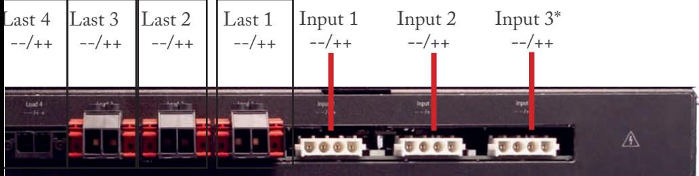

# 2.1 Koppla Redundancy Panel 1HE tillsammans med AGG 24 150-1HE eller tillsammans med batteribackup från Milleteknik

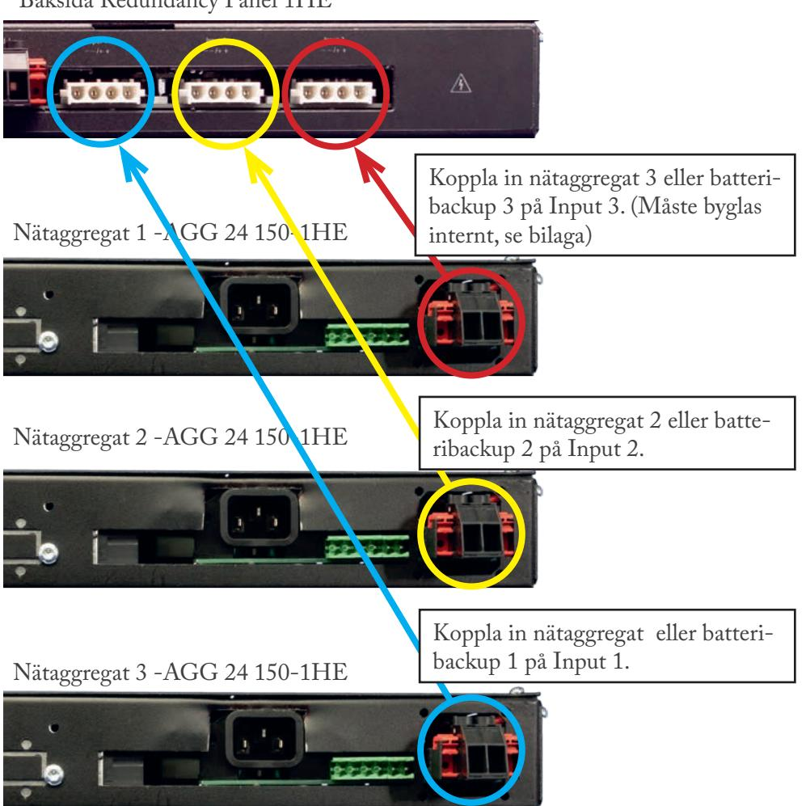

Baksida Redundancy Panel 1HE

3. Anslutning av 24 V, last, kommunikation och larm på Redundancy Panel 1HE

24 V anslutning från AGG 24 150-1HE

Anslut AGG 24 150-1HE på Input 1-3. Börja alltid anslutning på Input 1, se även 2.1.

|   | Nätagg ->24 V                         | 24 V anslutning på Redundancy Panel 1HE            |
|---|---------------------------------------|----------------------------------------------------|
| 1 | AGG 24 150-1HE eller Batteribackup | Input 1                                            |
| 2 | AGG 24 150-1HE eller Batteribackup | Input 2                                            |
| 3 | AGG 24 150-1HE eller Batteribackup | Input 3, (måste byglas vid användning, se bilaga). |

Last 1-4

24 V last ansluts vis snabbkontakt.

# Baksida Redundancy Panel 1HE

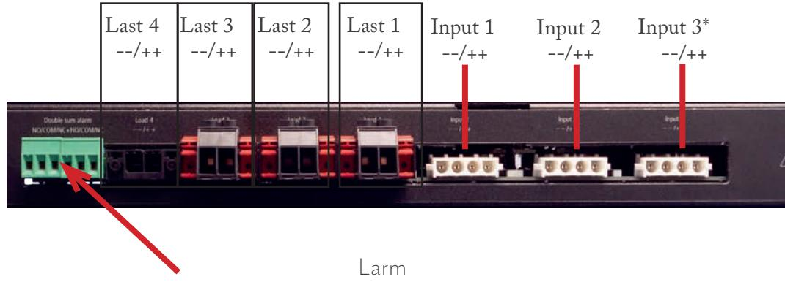

Dubblerat summalarm, NO/COM/NC+NO/COM/NC.

Summalarm: larm vid bortfall av spänning från nätaggregat ett, två och tre (beroende på vilka som är inkopplade), utlöst lastsäkring 1, 2, 3, och 4, (beroende på vilka som är anslutna).

*Input 3

Skall tre nätaggregat användas skall Input 3 byglas internt, se bilaga.

# 4. Driftsättning Redundancy Panel 1HE

# **Hur enheten skall startas:**

Efter inkoppling skall uppstart ske i följande steg:

- Koppla till nätaggregat (bör ej vara spänningssatta vid installation) och last.
- Kontrollera att säkring(ar) på framsida är på ON.
- Spänningssättning av elnät.

Enheten fungerar normalt då indikeringsdiod på lyser med fast grönt sken.

**Återställning:** Återställ enheten genom att göra enheten helt spänningslös. Koppla bort nätspänning och återanslut efter 5 sekunder.

Frågor? 031-340 02 30 support@milleteknik.se

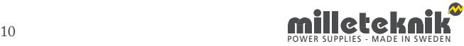

Larm som visas på panel på Redundancy Panel 1HE

I normalläge visar indikeringsdioden ett fast grönt sken. Vid larm blinkar indikeringsdioden.

| PSU, PSU 1-3 | Fast grönt sken. | Normal drift.                                                                |
|--------------|------------------|------------------------------------------------------------------------------|
| PSU          | Släckt           | Ingen ström från nätaggregat                                                 |
| PSU 1-3      | Släckt           | Ingen ström från anslutet AGG 24 150-1HE eller ej anslutet AGG 24 150-1HE |
| Load 1-4     | Fast grönt sken  |                                                                              |
| Load 1-4     | Släckt           | Lastsäkring utlöst.                                                          |

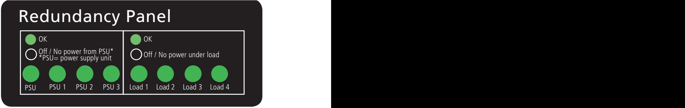

40 mm height

Panel

19R2 Redundancy Panel Specifi cation:

Font= Frutiger LT 65 Bold Frutiger LT 65 Bold Language= English Colours (CMYK):

Green= C=75, M=0, Y=100, K=0 Red= C=0, M=100, Y=100, K=0 Black= C=0, M=0, Y=0, K=100 White= C=0, M=0, Y=0, K=0 Yellow= Hole 8,3 mm Grey= Transculent

Material= Lexan 8B35 0,25mm Adhesive= 3M 468MP

2018-08-16 - original made

update log:

Text:

334 mm width

#### Bilaga

Denna bilaga beskriver hur Redundancy panel 1HE skall byglas om endast två nätaggregat är anslutna.

Nätaggregat 1 och 2 skall anslutas till anslutning 1 och 2.

Skall två nätaggregat användas skall jumper, (röd cirkel) vara monterad.

Skall tre nätaggregat användas skall jumper, (röd cirkel) ej vara monterad.

Lock skall skruvas av och enheten får ej vara spänningssatt vid bygling.

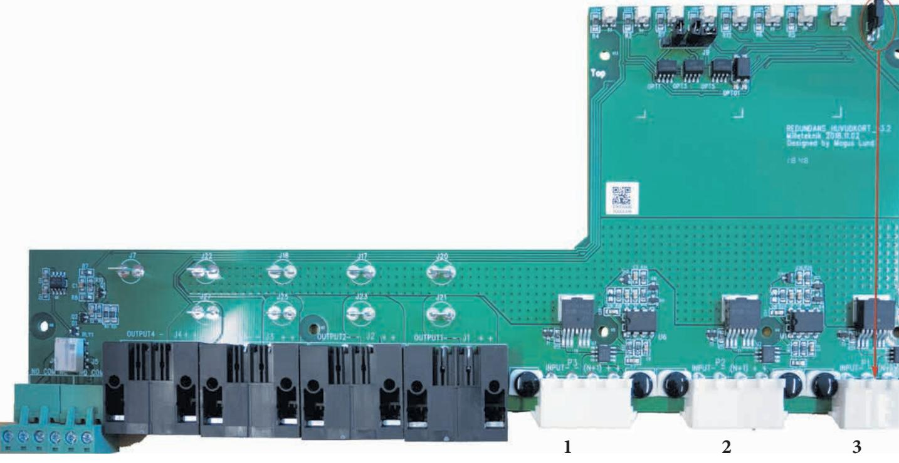

Vi är en svensk tillverkare som utvecklar batteribackuper för skydds & säkerhetsbranschen, industrin och andra aktörer som kräver högsta energitillgänglighet i sina säkerhetssystem. Milleteknik garanterar reservkraften i viktiga samhällsfunktioner såsom brandlarm, passersystem och utrymningslarm. Forskning, utveckling och produktion sker i Partille, strax utanför Göteborg.

| G AG          | AGG finns i låsbara kapslingar (B2 och B3) med nätaggregat. 12 V - 24 V. AGG finns som rackmonterad med eller utan redundans. 24 V.                                                                                                                                                                                             |
|------------------|------------------------------------------------------------------------------------------------------------------------------------------------------------------------------------------------------------------------------------------------------------------------------------------------------------------------------------|
| O EC          | ECO präglas av enkelhet, hög kvalité till rätt pris, driftsäkerhet och miljövänlighet. ECO batteribackup är primärswitchade med mycket hög verkningsgrad; >80%. 12 V - 24 V.                                                                                                                                                    |
| O NE          | NEO är uppdaterad för högre driftsäkerhet, fler larmfunktioner och flexibelt utbud av storlekar för bästa driftsäkerhet av reservkraft. 12 V - 24 V.                                                                                                                                                                            |
| BAS              | BAS utgår och ersätts av NEO.                                                                                                                                                                                                                                                                                                      |
| PoE              | PoE serien är en serie smarta batteribackuper / likriktare avsedda för system som kräver Power over Ethernet strömförsörjning (PoE+). 1-16 portar. Batteribackup 24 V.                                                                                                                                                          |
|                  | SSF-Certified är certifierade batteribackuper för inbrottslarm och integrerade säkerhetssystem enheter för                                                                                                                                                                                                                         |
| Certified SSF | Sentrion. Certifikat: SSF (EN50131-6/SSF1014), elsäkerhet (EN 60950-1) och passerkontroll, 60839-11-1. 24 V.                                                                                                                                                                                                                       |
| RACK             | RACK är 19" rackmonterade 24 V och 48 V batteribackuper för medelstora till större system. Certifikat: EN 54-4:1997, EN 54-4:1997/AC:1999, EN 54-4:1997/A1:2002, EN 54-4:1997/A2:2006 samt SBF 110:8.                                                                                                                           |
| OVA N         | NOVA är vår mest kompletta, säkraste och moduluppbyggda 12 V och 24 V batteribackuper för in tegrerade säkerhetssystem, passersystem och brandlarm. Certifikat: EN 54-4:1997, EN 54-4:1997/AC:1999, EN 54- 4:1997/A1:2002 och EN 54-4:1997/A2:2006 samt SBF 110:8, EN50131-6 Security Grade 3 (1-3), SSF1014, Larmklass 1-3. |
| EN54             | EN 54-4/SBF 110:7 Certifierade 24 V och 48 V batteribackuper för brandlarm, externa larmdon och talat utrymning.                                                                                                                                                                                                                |

Milleteknik AB Ögärdesvägen 8 B 433 30 Partille

031-340 02 30 info@milleteknik.se www.milleteknik.se