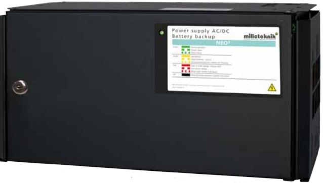
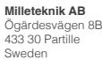
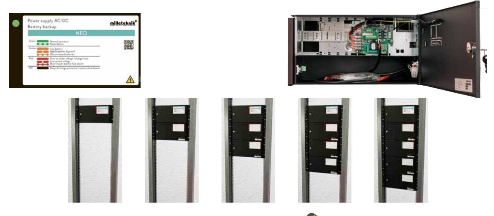

# **Batteribackup NEO FLX M**

**Primärswitchad batteribackup 12V / 10A eller 24V, upp till 25A med plats för 2x 20Ah batterier. Vägg eller 19 "rackmontage. Möjligt att komplettera upp till 4x batteriboxar för upp till 180Ah batterikapacitet.**

**NEO-serien** används normalt i säkerhetssystem där kraven är högre när det gäller; högre flexibilitet, fler larmfunktioner, längre drifttider eller när batteribackupen behöver hantera högre belastningar.

**NEO FLX M** erbjuder *"KONTROLLERAD LADDNING"*, vilket innebär att batterierna aldrig laddas med mer än 30% av den nominella batterikapaciteten. Detta förhindrar att batterierna överladdas och förlänger deras livslängd avsevärt. NEO-serien kan användas med både AGM-batterier och litium LiFePO4-batterier.

**NEO-serien** erbjuder även *"INTELLIGENT CHARGING"*, vilket innebär att när batterierna är fulladdade kommer de att kopplas bort elektroniskt för standby-läge i upp till 20 dagar eller när batterierna har nått 26,7V (24V). Genom att ladda ur batterierna och ladda dem kontinuerligt (istället för att de aldrig används) förlänger systemet batteriets livslängd med upp till 50%. Batterierna ansluts automatiskt på mindre än 50 mikrosekunder vid behov. NEO-serien kan användas med både AGM-batterier och litium LiFePO4-batterier.

#### **Flexibel & Utbyggnadsbar**

**NEO FLX M serien** kan kompletteras med upp till 4 batteriboxar eller 19 "rack batterihyllor vid behov (endast 24V). Batteriboxarna och hyllorna ansluts via en 9-polig kontakt. Batteriboxen har plats för upp till 2x 45Ah batterier per batteribox. Våra 19" batterihyllor har plats för 2x 45Ah batterier (Medium) och upp till 2x 150Ah batterier (Large) per varje batterihylla.

#### **Typiska Användningsområden:**

- Passersystem
- Inbrottslarmsystem
- Integrerade säkerhetssystem
- Låssystem

### Förväntad drifttid vid potentiellt strömavbrott (nya batterier): Vid nedan last:

| Systemspänning |    | Batterier    |                             | 2A  | 4A   | 8A   | 10A | 14A   | 18A   |
|----------------|----|--------------|-----------------------------|-----|------|------|-----|-------|-------|
| 12V            | 2x | 20Ah (40Ah)  |                             | 18h | 7h   | 3h   | -   | -     | -     |
| 24V            | 2x | 20Ah         |                             | 9h  | 3,5h | 1,5h | 1h  | 30min | 20min |
| 24V            | 2x | 45Ah         | (inkl. 1x FLX M batteribox) | 21h | 12h  | 4h   | 3h  | 2h    | 1,5h  |
| 24V            | 4x | 45Ah (90Ah)  | (inkl. 2x FLX M batteribox) | 42h | 20h  | 12h  | 8h  | 5h    | 3,5h  |
| 24V            | 6x | 45Ah (135Ah) | (inkl. 3x FLX M batteribox) | 64h | 30h  | 15h  | 12h | 9h    | 6h    |
| 24V            | 8x | 45Ah (180Ah) | (inkl. 4x FLX M batteribox) | 82h | 42h  | 20h  | 16h | 12h   | 10h   |

## **Teknisk data**

|                                                | NEO 12V 10A FLX M                                                                                                                                                                                                                                                                                            | NEO 24V 5A FLX M | NEO 24V 10A FLX M   | NEO 24V 15A FLX M | NEO 24V 25A FLX M                     |  |  |  |
|------------------------------------------------|--------------------------------------------------------------------------------------------------------------------------------------------------------------------------------------------------------------------------------------------------------------------------------------------------------------|------------------|---------------------|-------------------|---------------------------------------|--|--|--|
| Rekommenderad miljö och kapslingsinformation:  |                                                                                                                                                                                                                                                                                                              |                  |                     |                   |                                       |  |  |  |
| Rekommenderad miljö:                           | Miljöklass 1, Inomhus, 20% ~ 90% relativ fuktighet                                                                                                                                                                                                                                                           |                  |                     |                   |                                       |  |  |  |
| Omgivningstemperatur:                          | +5 °C - 40 °C (För optimal batterilivslängd +15 °C - +25 °C)                                                                                                                                                                                                                                                 |                  |                     |                   |                                       |  |  |  |
| Skyddsklass:                                   | IP32                                                                                                                                                                                                                                                                                                         |                  |                     |                   |                                       |  |  |  |
| Rekommenderad montering:                       | Vägg alt. Rack (vändbara vinklar medföljer). Vid väggmontage erhålls 20 mm distans emot väggen.                                                                                                                                                                                                              |                  |                     |                   |                                       |  |  |  |
| Dimension (HxBxD):                             |                                                                                                                                                                                                                                                                                                              |                  | 224x437x212mm (5HE) |                   |                                       |  |  |  |
| Nettovikt:                                     | 8kg                                                                                                                                                                                                                                                                                                          | 8kg              | 8,5kg               | 9,5kg             | 10,5kg                                |  |  |  |
| Antal kabelgenomföringar:                      | 3 st + möjlighet till 1x utslagshål i ryggen                                                                                                                                                                                                                                                                 |                  |                     |                   |                                       |  |  |  |
| Kapslingens färg:                              | Svart                                                                                                                                                                                                                                                                                                        |                  |                     |                   |                                       |  |  |  |
| Inbyggd fläkt för kylning:                     | Ja                                                                                                                                                                                                                                                                                                           | Ja               | Ja                  | Ja                | Ja                                    |  |  |  |
| Elektrisk information:                         |                                                                                                                                                                                                                                                                                                              |                  |                     |                   |                                       |  |  |  |
| Inspänning:                                    | 110V-264VAC/47-63Hz                                                                                                                                                                                                                                                                                          |                  |                     |                   |                                       |  |  |  |
| Utspänning:                                    | 13,6VDC                                                                                                                                                                                                                                                                                                      |                  | 27,3VDC             |                   |                                       |  |  |  |
| Max ström:                                     | 10A                                                                                                                                                                                                                                                                                                          | 5A               | 10A                 | 15A               | 25A                                   |  |  |  |
| Ladd ström:                                    | Max 3,4A                                                                                                                                                                                                                                                                                                     | Max 3,4A         | Max 3,4A            |                   | Beroende av strömuttag, max 15A / 25A |  |  |  |
| Nominell effekt:                               | 150W                                                                                                                                                                                                                                                                                                         | 156W             | 240W                | 336W              | 648W                                  |  |  |  |
| Rippel i normalläge:                           | 150mVp-p                                                                                                                                                                                                                                                                                                     | 200mVp-p         | 200mVp-p            | 150mVp-p          | 150mVp-p                              |  |  |  |
| Effektivitet:                                  | 87,5%                                                                                                                                                                                                                                                                                                        | 89%              | 89%                 | 87%               | 88%                                   |  |  |  |
| Värmegenerering vid 50% / 80% av märkeffekten: | 10W / 16W                                                                                                                                                                                                                                                                                                    | 8,4W / 13,5W     | 17W / 27W           | 31W / 49W         | 50W / 80W                             |  |  |  |
| Ingångsström:                                  | 1,7A                                                                                                                                                                                                                                                                                                         | 1,7A             | 2A                  | 1,8A              | 3,6A                                  |  |  |  |
| Antal avsäkrade utgångar:                      |                                                                                                                                                                                                                                                                                                              |                  | 2 st                |                   |                                       |  |  |  |
| Typ av säkring på utgång:                      | 2xF10A (glas)                                                                                                                                                                                                                                                                                                | 2xF5A (glas)     | 2xF10A (glas)       | 2x C15A           | 2xC25A                                |  |  |  |
| Djupurladdning av batterier sker vid:          | 10,5V                                                                                                                                                                                                                                                                                                        |                  | 21V                 |                   |                                       |  |  |  |
| Möjlig att parallellkoppla:                    |                                                                                                                                                                                                                                                                                                              |                  | Ja                  |                   |                                       |  |  |  |
| Skydd mot:                                     | Överlast, Överspänning, Övertemperatur, Kortslutning & Djupurladdning av batterier                                                                                                                                                                                                                           |                  |                     |                   |                                       |  |  |  |
| Larmfunktioner (3 utgångar):                   | Fördröjt nätavbrottslarm (10 sek) (utgång 1), låg batterispänning (@24V), över/underspänning, frånkopplade batterier (10 sek), säkringsfel (utgång 2), sabotage (utgång 3).                                                                                                                               |                  |                     |                   |                                       |  |  |  |
| Larm via:                                      |                                                                                                                                                                                                                                                                                                              |                  | Växlande relä       |                   |                                       |  |  |  |
| Artikel information:                           |                                                                                                                                                                                                                                                                                                              |                  |                     |                   |                                       |  |  |  |
| Artikelnamn:                                   | NEO 12V 10A FLX M                                                                                                                                                                                                                                                                                            | NEO 24V 5A FLX M | NEO 24V 10A FLX M   | NEO 24V 15A FLX M | NEO 24V 25A FLX M                     |  |  |  |
| Artikelnummer:                                 | FM01N10112P100                                                                                                                                                                                                                                                                                               | FM01N10124P050   | FM01N10124P100      | FM01P10024P150    | FM01P10024P250                        |  |  |  |
| E-nummer:                                      | 5213536                                                                                                                                                                                                                                                                                                      | 5213537          | 5213538             | 5213539           | 5213540                               |  |  |  |
| Produkten möter kraven enligt:                 | EMC Direktivet 2014/30EU, Låg spänningsdirektivet: 2014/35/EU CE direktivet enligt 765/2008, Emission: EN61000-6-:2001, EN55022:1998:-A1:2000, A2:2003 Klass B, EN61000-3-2:2001. Immunity: EN61000-6-2:2005, EN61000-4-2, -3, 4, -5, -6, -11 & SS-EN 50 130-4:2011 Edition 2 & SSF1014 Larmklass 1-2. |                  |                     |                   |                                       |  |  |  |
| Garantiperiod:                                 |                                                                                                                                                                                                                                                                                                              |                  | 2 år                |                   |                                       |  |  |  |
| Designad och producerad av:                    | Milleteknik AB                                                                                                                                                                                                                                                                                               |                  |                     |                   |                                       |  |  |  |
| Ursprungsland:                                 | Sverige                                                                                                                                                                                                                                                                                                      |                  |                     |                   |                                       |  |  |  |
| Information och val av batteri / batterier:    |                                                                                                                                                                                                                                                                                                              |                  |                     |                   |                                       |  |  |  |
| Rekommenderad batterityp:                      | 12V Underhållsfria batterier, typ AGM eller Lithium LiFePO4                                                                                                                                                                                                                                                  |                  |                     |                   |                                       |  |  |  |
| Möjliga batterier för montering i kapsling:    | 2x 20Ah (2x 45Ah i respektive batteribox)                                                                                                                                                                                                                                                                    |                  |                     |                   |                                       |  |  |  |
| Rekommenderat batteri:                         | UPLUS 10+ Design Life 20Ah batteri (UPLUS 10+ Design Life 45Ah batteri i respektive batteribox)                                                                                                                                                                                                              |                  |                     |                   |                                       |  |  |  |
| Artikelnummer 20Ah batteri:                    | MT113-12V20-01                                                                                                                                                                                                                                                                                               |                  |                     |                   |                                       |  |  |  |
|                                                |                                                                                                                                                                                                                                                                                                              |                  |                     |                   |                                       |  |  |  |

POWER SUPPLIES - MADE IN SWEDEN