# NEO

PRO1

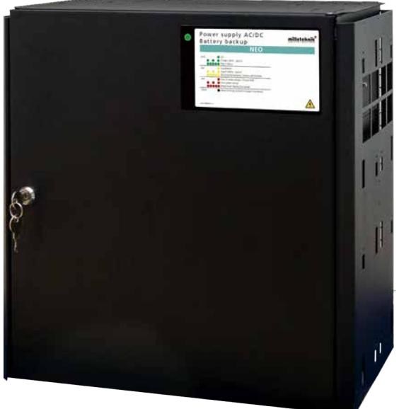

NEO 24V 15A FLX L NEO 24V 25A FLX L

### **Säkerhet - Läs detta först!**

- *• 100 mm fritt utrymme skall lämnas ovan och under enheten.*
- *• Enheten är avsett för bruk i kontrollerad inomhusmiljö.*
- *• Endast personer med behörighet bör installera och underhålla enheten.*
- *• Det är installatörens ansvar att enheten är lämpad för tänkt bruk.*
- *• Dokument som medföljer enheten skall förvaras i det eller i dess omedelbara närhet.*
- *• Ventilation skall ej övertäckas.*
- *• Nätspänning bör vara bortkopplad under installation.*
- *• Alla uppgifter med reservation för ändringar.*

### Garanti och support

Produkten har två års garanti, från inköpsdatum (om inget annat avtalats). Kostnadsfri support under garantitiden nås på support@milleteknik.se eller telefon, 031-313 45 42. Ersättning för res- och eller arbetstid i samband med lokalisering av fel, installerande av reparerad eller utbytt vara ingår ej i garantin. Garantitiden kan, för vissa produkter, förlängas vid inköpstillfället med 3 år (vilket då ger totalt 5 års garanti). Kontakta Milleteknik för mer information.

Milleteknik ger support under produktens livslängd, dock som längst 10 år efter inköpsdatum. Byte till likvärdig produkt kan förekomma om Milleteknik bedömer att reparation inte är möjlig. Kostnader för support tillkommer efter det att garantitiden har gått ut.

Produktens livslängd, miljöpåverkan och återvinning

Produkten är designade för lång livslängd vilket minskar miljöpåverkan. Produktens livslängd är beroende på, bland annat miljöfaktorer, främst omgivningstemperatur, oförutsedd belastning på komponenter som blixtnedslag, yttre åverkan, handhavandefel, med flera.

Produkter återvinns genom att lämnas till närmaste återvinningsstation eller sändas åter till tillverkare. Kontakta din distributör för mer information. Kostnader som uppkommer i samband med återvinning ersätts ej.

Batterier skall alltid återvinnas och lämnas till återvinningsstation.

### Om NEO-serien

NEO erbjuder flertalat larmfunktioner samt möjlighet till kommunikation mot överordnade system. NEO erbjuder hög driftsäkerhet, enkelhet och hög verkningsgrad i kombination med flertalet larmfunktioner som standard. DIN monterade nätaggregat möjliggör uppgradering av nätaggregat när systemen växer. 19" vinklar medföljer till samtliga NEO batteribackuper för montage i 19" Rack. Givetvis kan de också väggmonteras. Batteribackuperna kan också utökas med batteribox för längre reservdrifttider. IP-Klass 20.

Användningsområde

Passersystem, inbrottslarm, magneter, kodlås, slutbleck och rökluckor.

Om detta dokument

Gällande och senast publicerad utgåva av detta dokument finns på www.milleteknik.se eller kan rekvireras via e-post, info@milleteknik.se (ange enhetens namn och serienummer). Detta dokuments giltighet kan inte garanteras, då ny utgåva publiceras utan föregående meddelande.

### Innehåll

| Garanti och support                                          | 2  |
|--------------------------------------------------------------|----|
| Produktens livslängd, miljöpåverkan och återvinning          | 2  |
| Om NEO-serien                                                | 3  |
| Användningsområde                                            | 3  |
| Om detta dokument                                            | 3  |
| 1. Montering på vägg                                         | 5  |
| Montering i 19" rack                                         | 6  |
| Komponentöversikt                                            | 7  |
| 2. Inkoppling av batterier                                   | 8  |
| Beskrivning huvudkort: PRO1                                  | 9  |
| 3. Anslutning: elnät, last, kommunikation och larm           | 10 |
| 3.1 Elnät (230 V)                                            | 10 |
| 3.2 Last                                                     | 10 |
| 3.3 Andra anslutningar                                       | 10 |
| 3.4 Larm via kommunikation                                   | 11 |
| 3.5 Konfiguration av kommunikation via RS-485                | 11 |
| 3.6 Larm via busskommunikation: I2 C, RS-485              | 11 |
| 4. Driftsättning / Test                                      | 12 |
| Hur enheten skall startas                                    | 12 |
| Systemtest                                                   | 12 |
| Återställning                                                | 12 |
| Montering av batteribox. Vad som skall göras i batteribackup | 14 |
| Inkoppling batteribox med FLX L batteribackup                | 15 |
| Inkopplingsschema och gul bygel                              | 17 |
| Batteribackup (FLX L) med 4 batteriboxar (FLX M)             | 18 |
| Underhåll                                                    | 19 |
| Batterier                                                    | 19 |
| Batteribyte                                                  | 19 |
| Batteriåtervinning                                           | 19 |
| Justering av sabotagekontakt (tillval)                       | 20 |
| Tekniska data                                                | 21 |
| Tekniska data huvudkort: PRO1                                | 22 |
| Tekniska data, nätaggregat: HRP-300-24                       | 24 |
| Tekniska data, nätaggregat: HRP-600-24                       | 25 |
| Tekniska data, kapsling: FLX L                               | 26 |
|                                                              |    |

1. Montering på vägg

Enheten kan monteras i 19" rack eller på vägg. Medföljande konsoler kan fästas på två sätt. Vid montering på vägg skall konsolernas vändas så att skruvhål sitter bakåt, mot vägg. Se bilden nedan.

- 1. Börja med att montera den konsol som skall sitta överst på skåpet. Skjut in konsolen nedifrån och upp.
- 2. Montera sedan den konsol som skall sitta underst på skåpet och skjut den sedan upp.
- *• 100 mm fritt utrymme skall lämnas på kortsidorna*

Enheten kan monteras i 19" rack eller på vägg. Medföljande konsoler kan fästas på två sätt. Vid montering i 19" rack skall konsoler vändas så att skruvhål sitter mot framsidan på enheten. Se bilden nedan.

- 1. Börja med att montera den konsol som skall sitta överst på skåpet. Skjut in konsolen nedifrån och upp.
- 2. Montera sedan den konsol som skall sitta underst på skåpet och skjut den sedan upp.
- *• 100 mm fritt utrymme skall lämnas på kortsidorna*

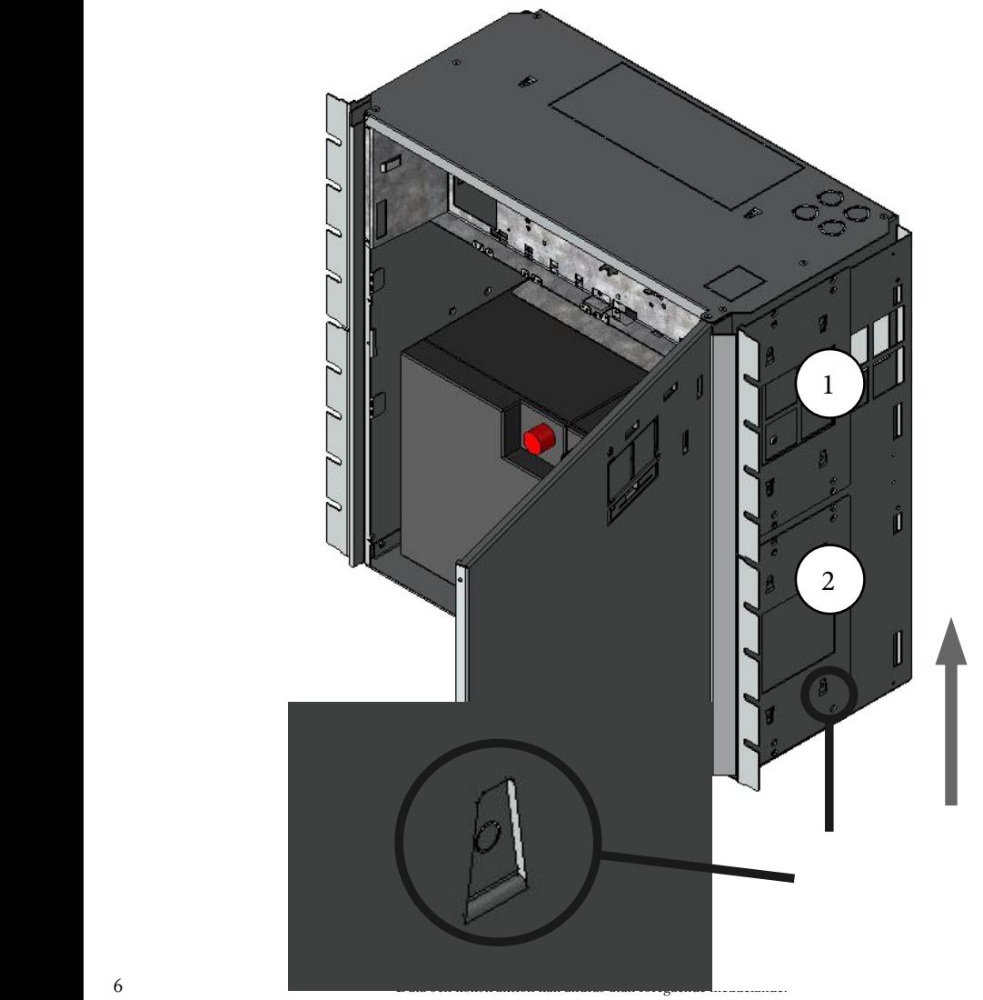

### Komponentöversikt

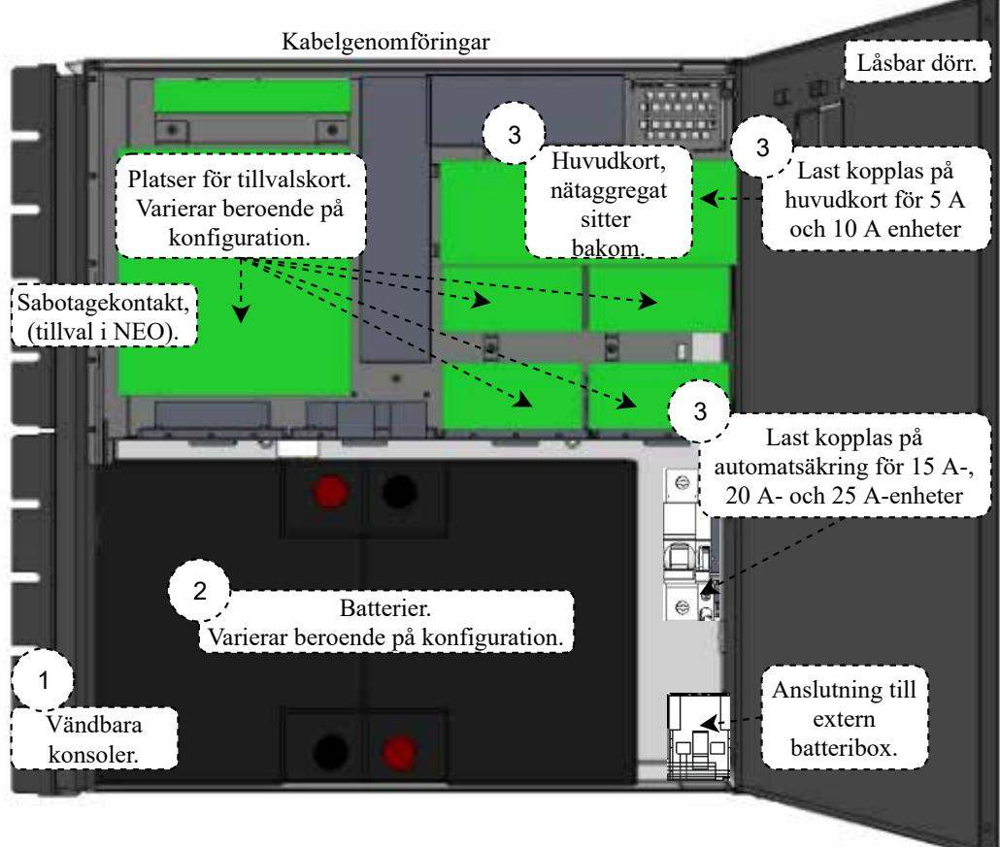

### 2. Inkoppling av batterier

Batterikablage är monterat på kretskortet vid leverans. OBS - bilder nedan visar endast hur kablage skall kopplas.

Placera batterierna i skåpet med batteripolerna utåt, mot skåpluckan. Anslut batterikablaget.

- *• Bryt, om möjligt, nätspänning vid batteribyte.*
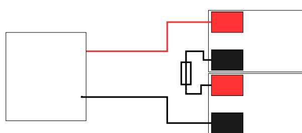

| Batteri 1 (B1)                                                      |                                        |
|---------------------------------------------------------------------|----------------------------------------|
| B1 +                                                                | + Batt in på kretskort                 |
| B1 -                                                                | Med säkring till B2 +                  |
| Kretsko Batteri 2 (B2) 24 V+ 24 V+ Baterbku Baterbku |                                        |
| B2 +                                                                | Med säkring till B1 -                  |
| B2 -                                                                | - Batt in på kretskort 24 V 24 V |
|                                                                     | Baterbku Baterbku                   |

B4

B4

B -6ster baterox 1

B B

B B

B1 B1 

Seriekoppling, batterier: 24 V

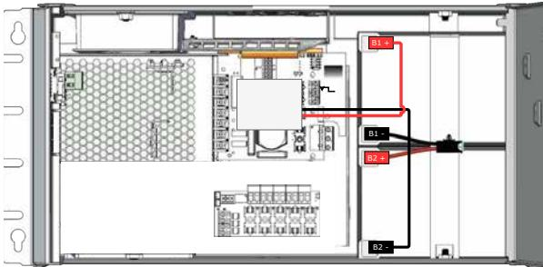

Seriekoppling, batterier: 24 V FLX S

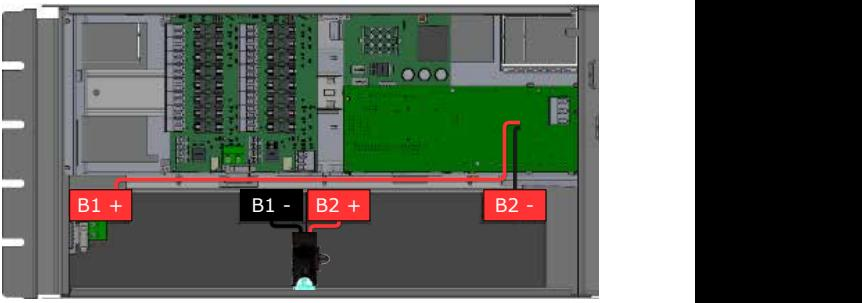

B16

B1

B12

B1

B1

B1

B14

B14

B1

B1

B1-

B1-

B2

B2

B6

B6

B1

B1

Dubel kabso från ketsor +

Dubel kabso från ketsor +

Dubel kabso från ketsor -

Dubel kabso från ketsor -

Kabelsko från B

Kabelsko från B

Kabelsko från B

Kabelsko från B

B1 Text

B1 Text

B2

B2

Seriekoppling, batterier: 24 V FLX M

B1 "2ster baterku

### Beskrivning huvudkort: PRO1

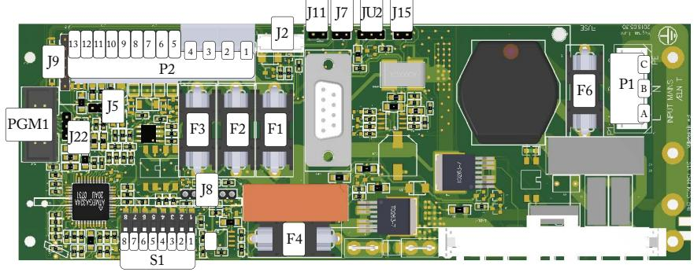

| J13                                                                                                                                                                 | Anslutning till effektkort (tillval).                                                  | JU 2                             | Utgång till extern batterisäkring.                       |
|---------------------------------------------------------------------------------------------------------------------------------------------------------------------|-------------------------------------------------------------------------------------------|----------------------------------|----------------------------------------------------------|
| P2: 13                                                                                                                                                              | + 5 V*                                                                                    | J15                              | Utgång till extern säkring.                              |
| P2: 12                                                                                                                                                              | TXD*                                                                                      | PGM1                             | N/A                                                      |
| P2: 11                                                                                                                                                              | RXD*                                                                                      | J22                              | Extern indikeringsdiod (på skåplucka).                   |
| P2: 10                                                                                                                                                              | System-minus (-).*                                                                        | J5                               | Terminering vid bygel, (vid över 120 Ω, RS-485)          |
| P2: 9                                                                                                                                                               | System-minus (-).*                                                                        | F3                               | Säkring, last 2 plus +.                                  |
| P2: 8                                                                                                                                                               | RS-485 + (plus) Anslutning.*                                                              | F2                               | Säkring, last 1 minus -.                                 |
| P2: 7                                                                                                                                                               | RS-485 - (minus) Anslutning.*                                                             | F1                               | Säkring, last 1 plus +.                                  |
| P2: 6                                                                                                                                                               | I2C                                                                                       | J8                               | Anslutning till larmkort (tillval).                      |
| I2C P2: 5                                                                                                                                                        | S1 Dip switch                                                                          | Funktion                         |                                                          |
|                                                                                                                                                                     |                                                                                           | 1                                | Adress för extern kommunikation.                         |
| *Det är möjligt att ansluta kommunikation till extern larmcentral via anslutningar på P2. Se larmcentralens dokumentation för kompatibelt protokoll. | 2                                                                                         | Adress för extern kommunikation. |                                                          |
|                                                                                                                                                                     | 3                                                                                         | Adress för extern kommunikation. |                                                          |
|                                                                                                                                                                     | 4                                                                                         | Adress för extern kommunikation. |                                                          |
|                                                                                                                                                                     | 5                                                                                         | Inställning av batterikapacitet. |                                                          |
|                                                                                                                                                                     | 6                                                                                         | Inställning av batterikapacitet. |                                                          |
|                                                                                                                                                                     | 7                                                                                         | Inställning av batterikapacitet. |                                                          |
|                                                                                                                                                                     | 8                                                                                         | Mjukvarureset.                   |                                                          |
| P2: 3-4                                                                                                                                                          | Lastutgång 2, + / - till last. (Max totalt 10 A, för bägge utgångarna). Ej vid SSF. | F4                               | Säkring batteripaket (T16A).                             |
| P2: 1-2                                                                                                                                                          | Lastutgång 1, + / - till last. (Max totalt 10 A, för bägge utgångarna).             | F6                               | Säkring elnät (T2,5 A). Keramisk.                        |
| J2                                                                                                                                                                  | Anslutning fläkt                                                                          | P1: A                            | Inkommande elnät: Fas / Line.                            |
| J11                                                                                                                                                                 | Anslutning sabotagekontakt.                                                               | P1: B                            | Inkommande elnät: Nolla / Neutral.                       |
| J7                                                                                                                                                                  | Anslutning sabotagekontakt från batteribox.                                            | P1: C                            | Inkommande elnät: Skyddsjord / Protected earth, (PE). |

3. Anslutning: elnät, last, kommunikation och larm

3.1 Elnät (230 V)

För elnätskablage genom kabelgenomföringen på skåpets ovansida. Säkra elnätskabeln med buntband. Elnätskablage skall hållas åtskilt annat kablage för att undvika (EMC) störningar.

Anslutning P1, Elnät: Använd medföljande plint för att montera elnätskablar.

F=Fas. N=Noll. PE= Skyddsjord.

### 3.2 Last

*• Sitter ett eller flera anslutningskort monterade skall last anslutas där. Se komponentöversikt.*

Last 1-2 ansluts på 1-4. Maxström får ej överskridas. Se märkskylt på enhet.

PGM1

J9

J22

| Lastplint - Anslutning last |   | 4 - (last 2) |  |
|-----------------------------|---|--------------|--|
| 4, last 2.                  | - | 3 + (last 2) |  |
| 3, last 2.                  | + |              |  |
| 2, Last 1.                  | - | 2 - (last 1) |  |
| 1, Last 1                   | + |              |  |
|                             |   | 1 + (last 1) |  |

### 3.3 Andra anslutningar

### J2: Fläkt.

J11: Anslutning sabotagekontakt från batteribackup. J7: Anslutning sabotagekontakt från batteribox. NC. JU2: Ingång från externt batterisäkring i batteribox. NO. J15: Ingång från externt avsäkringskort (tillval). NC med bygel. 12 11 10 9 8 765 13

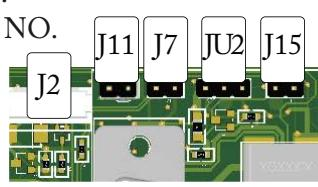

F N PE

F6

C B A

P1

F4

J8

4 123

P2:

8 7 6543 2 1 S1

P2

10 Data och konstruktion kan ändras utan föregående meddelande. F3 F2 F1 J5

3.4 Larm via kommunikation

Kommunikation ansluts på plint 5-13. Larm via Busskommunikation och via LED på skåpets framsida. Se larmcentralens dokumentation för kompatibelt protokoll.

3.5 Konfiguration av kommunikation via RS-485

Kommunikation via RS-485 ansluts på P2:7- & P2:8+.

ADRESS-konfiguration:

| Adress ställs in på dip-switch S1 dip 1-4 enligt följande:        | Värde dip-switch: |
|-------------------------------------------------------------------|-------------------|
| Adressen ställs binärt på switchen.                               | Dip-switch 1=1    |
| Är alla dip-switchar ställda till OFF är adressen 0+0+0+0(+1*)=1. | Dip-switch 2=2    |
| Är dip-switch 1 & 3 ON är adressen 1+0+4+0(+1*)=6.                | Dip-switch 3=4    |
| Är dip-switch 2 & 4 ON är adressen 0+2+0+8(+1*)=11.               | Dip-switch 4=8    |

*Adresser i Sentrion adderar +1. Det betyder att 1 alltid skall läggas till i konfigurationen.

> 3.6 Larm via busskommunikation: I2 C, RS-485

- Låg systemspänning i nätdrift (överbelastning): utspänning, även kortvarigt, är för låg, (under 24,0 V).
- Fläktfel: Funktionsfel i fläkt, ej korrekt varvtalshastighet
- Övertemperatur: Systemets temperatursensor indikerar skadligt hög driftstemperatur, (över 32°C).
- Undertemperatur: Systemets temperatursensor indikerar skadligt låg driftstemperatur, (under 10°C).
- Låg batterispänning: Batterispänning vid nätavbrott spänningen i batteridrift är låg, (under 24,0 V DC).

### 4. Driftsättning / Test Hur enheten skall startas

Efter inkoppling skall uppstart ske i följande steg:

- Inkoppling/spänningssättning av batteridel.
- Spänningssättning av elnät.

Enheten fungerar normalt då indikeringsdiod på skåpluckans utsida lyser med fast grönt sken. Se frontpanel för övriga statusindikationer.

### Systemtest

- 1. Slå till inkommande nätspänning.
- 2. Indikeringsdiod på skåpluckans utsida lyser med fast grönt sken. Bryt nätspänning för att kontrollera att enheten fungerar i batteridrift och larmar.
- 3. Indikeringsdiod på skåpluckan blinkar grönt. För larmtyp, se panel.
- 4. Slå till inkommande nätspänning. Indikeringsdiod, på skåpluckans utsida lyser med fast grönt sken. Normaldrift.

# Återställning

Återställ enheten genom att göra enheten helt spänningslös. Koppla bort batterikablage samt nätspänning och återanslut efter 5 sekunder.

> Frågor? Se baksidan för kontakt till support.

### Larm som visas på skåplucka

| I normalläge visar indikeringsdioden ett fast grönt sken. |                                                                      |  |
|-----------------------------------------------------------|----------------------------------------------------------------------|--|
| Fast grönt sken.                                          | Normal drift.                                                        |  |
| Långsamt grönt blink, ej tillgängligt.                 | Sabotagelarm kan endast ges via direkt anslutning till undercentral. |  |
| Snabbt grönt blink.                                       | Nätavbrottslarm.                                                     |  |
| Fast gult sken                                            | Låg batterispänning.                                                 |  |
| Långsamt gult blink                                       | Åldrade batterier, (tillval).                                        |  |
| Snabbt gula blink                                         | Bortkopplade batterier / batterikortslutning.                        |  |
| Fast rött sken                                            | Över- underspänning / laddarfel.                                     |  |
| Långsamt rött blink                                       | Låg systemspänning.                                                  |  |
| Snabbt rött blink                                         | Lastsäkring har löst ut / batterisäkring har löst ut.                |  |
| Släckt/svart                                              | Djupurladdningsskydd är aktiverat.                                   |  |

Vid driftsatt system: Är indikeringsdioden släckt har djupurladdningsskyddet trätt i kraft.

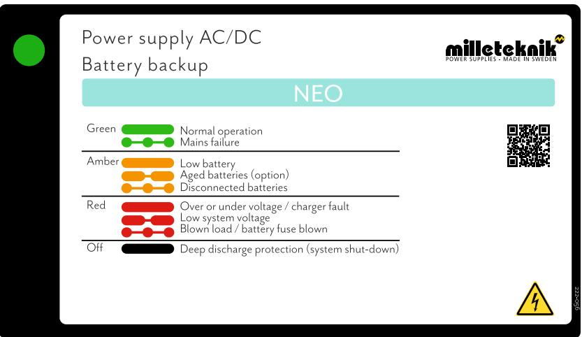

Montering av batteribox. Vad som skall göras i batteribackup

Det är möjligt att koppla till extra batteriboxar till batteribackup för utökad reservdrifttid.

Kabelgenomföring/knock-out finns på batteribackupens undersida och skall brytas loss innan montering.

Använd kablage som följer med batteriboxen för att möta kablage från batteribackup. Skall sabotagekontakt även sitta i batteribox? Se avsnitt "Sabotagekontakt vid extra batteribox."

Se bild A, nedan, för hur kablar skall mötas mellan skåpen.

- *• Klipp gul bygel i kontakt från batteribackup, se nästa sida.*
Enheten skall vara spänningslös vid montering och inkoppling. Lossa spännband i batteribackupen för att komma åt kabelgenomföringen från enhetens golv.

Den extra batteriboxen skjuts eller placeras under batteribackup, (eller föregående batteribox), batteribox skruvas därefter fast i rack eller vägg. De bägge kapslingarna skall möta varandra utan glapp, se bild B nedan.

OBS! Batterier skall vara nya vid installation och vid byte för att garanti och certifikat skall fortsätta att gälla.

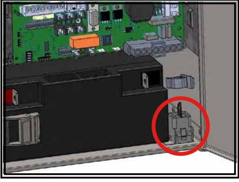

Bild A.

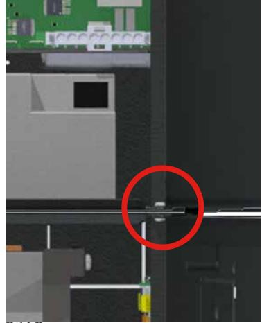

Bild B.

Batterier måste vara nya vid installation och batteribyte för att certifierade normer skall upprätthållas.

• Sätt i batteri närmast dörren först.

Bilden nedan visar en batteribackup med extra batteribox med 2 batterier, se kommande sidor för inkoppling av batteribox med 4 batterier.

Bilden ger även en översikt över kopplingspunkter för batterikablar och batterisäkringar.

|                                                               | Kabel 1                | Kabel 2              |
|---------------------------------------------------------------|------------------------|----------------------|
| Batteri 1 (B1)                                                |                        |                      |
| B1 +                                                          | + Batt in på kretskort | Inkommande från B3 + |
| B1 -                                                          | Med säkring till B2 +  |                      |
| Batteri 2 (B2)                                                |                        |                      |
| B2 +                                                          | Med säkring till B1 -  |                      |
| B2 -                                                          | - Batt in på kretskort | Inkommande från B4 - |
| Batteri 3 (B3)                                                |                        |                      |
| B3 +                                                          | B1+                    |                      |
| B3 -                                                          | Med säkring till B4 +  |                      |
| Batteri 4 (B4)                                                |                        |                      |
| B4 +                                                          | Med säkring till B3 -  |                      |
| B4 -                                                          | Till B2 -              |                      |
| För efterföljande batteriboxar, följs samma kopplingsmönster. |                        |                      |

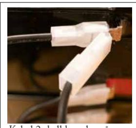

Kabel 2 skall kopplas på batteri med dubbelstift, (som sitter på kabel 1).

## Placering av batterier i FLX L batteribackup och FLX M batteribox

16 Data och konstruktion kan ändras utan föregående meddelande.

Inkopplingsschema och gul bygel

Larm till sabotagekontakt seriekopplas och därför måste slingan vara obruten till sista batteriboxkablaget. Gul bygel sluter slingan på varje kablage som går från batteribackup till batteribox och för att larm skall ges på sabotagekontakten i batteriboxen måste gul bygel på kablage klippas. Klipp inte gul bygel på sista kablage i batteribox, då kommer larm för sabotage inte ges i någon tillkopplad batteribackup eller batteribox.

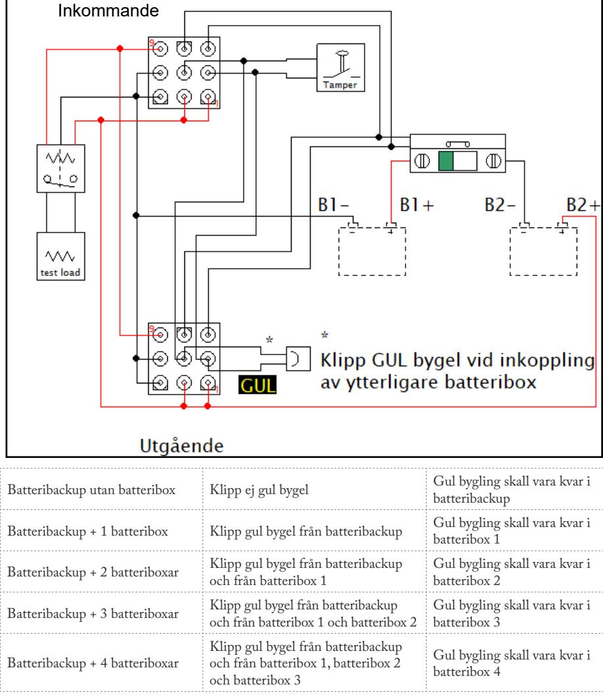

Batteribackup (FLX L) med 4 batteriboxar (FLX M)

B1 Text

B1 Text

B2

B2

18 Data och konstruktion kan ändras utan föregående meddelande.

B2

B1

24 V+ Baterbku

24 V+ Baterbku

B1 "2ster baterku

Kretsko

24 V-Baterbku

24 V-Baterbku

### Underhåll

Systemet med undantag för batterier är underhållsfritt vid installation i inomhusmiljö.

### Batterier

Batterier alstrar elektricitet genom en kemisk process och det sker därmed en

naturlig degradering av kapacitet. Den största faktorn för batteriers livslängd är temperatur. Ju högre temperatur desto kortare livslängd. En ideal temperatur är 20 °C. Tillverkningsdatum som är präglat på batteriet och livslängden (som batteritillverkaren anger) gäller vid helt outnyttjat batteri. Således varierar faktisk livslängd. Batterier

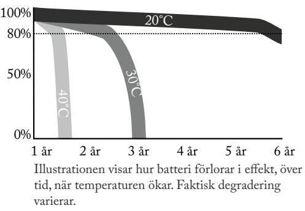

bör bytas efter HALVA angiven (från batteritillverkaren) livslängd för säker drift. Batterier inköpta via Milleteknik har en livslängd (från tillverkaren) på mellan 10-12 år med rekommenderat byte efter 5-6 år.

### Batteribyte

Bryt, om möjligt, nätspänning vid batteribyte.

Koppla bort batterisäkring på kretskortet.

Koppla bort batterikablar. Notera hur batterikablar är monterade innan de avlägsnas.

Sätt in och spänn fast de nya batterierna.

Anslut batterikablarna på samma sätt som tidigare.

Sätt tillbaka batterisäkring på kretskort.

Slå till nätspänning. Eventuellt kan indikeringsdioden lysa orange under ett par timmar, tills batterier är laddade.

Testa systemet genom att kortvarigt koppla bort nätspänning, (= lasten drivs vidare av batterierna), och därefter slå till nätspänningen igen.

### Batteriåtervinning

Alla batterier skall återvinnas. Återlämna till tillverkare eller lämna till återvinningsstation.

### Justering av sabotagekontakt (tillval)

Sabotagekontaktens hävarm skall vid stängd skåpdörr vara i slutet läge (stängd). Går larm ("tamper alarm" / larm till undercentral) kan hävarmen behövas justeras. Hävarmen justeras genom följande steg:

- Nyp åt med en plattång mitt på hävarmen.
- Justera hävarmen försiktigt åt önskat håll (upp/ner).
- Kontrollera genom att stänga dörren. Ett klick hörs när kontakten sluts.
- Sabotagekontakten skall inte larma vid stängd och låst dörr.

Sabotagekontakt vid extra batteribox

Har en eller flera batteriboxar kopplats till enheten skall sabotagekontakterna seriekopplas för att larm skall ges. Det är viktigt att seriekopplingen har slutning vid den sista sabotagekontakten. Seriekopplingen skall börja i enheten och sluta i den sista batteriboxen.

### Tekniska data

|                          | NEO 24V 15A FLX L                                   | NEO 24V 25A FLX L                                   |  |
|--------------------------|-----------------------------------------------------|-----------------------------------------------------|--|
| Kapsling                 | FLX L, se följande sidor för tekniska data.         |                                                     |  |
| Huvudkort                | TEQ-COM PRO1, se följande sidor för tekniska data.  |                                                     |  |
| Tillval - ej standard | Grafisk display                                     |                                                     |  |
| Nätaggregat:             | HRP-300-24, se följande sidor för tekniska data. | HRP-600-24, se följande sidor för tekniska data. |  |
| Batteri:                 | 2 st 45 Ah                                          | 2 st 45 Ah                                          |  |

### Tekniska data huvudkort: PRO1

| Kortnamn:                                |                                                                                 |                                   | PRO1                         |                                                           |                     |     |
|------------------------------------------|---------------------------------------------------------------------------------|-----------------------------------|------------------------------|-----------------------------------------------------------|---------------------|-----|
| Lastutgång ström:                        |                                                                                 |                                   |                              | Beroende på nätaggregat och batterier. Se separat tabell. |                     |     |
| Egenförbrukning (med reläkort):       | 100 mA utan effektsteg med alla reläer på externt larmkort dragna i normalläge. |                                   | Mindre än 210 mA.            |                                                           |                     |     |
| Djupurladd ningsskydd 12 V enheter |                                                                                 |                                   | 10 V (+/- 0,5 V)          |                                                           |                     |     |
| Djupurladd ningsskydd 24 V enheter |                                                                                 | 20 V (+/- 0,5 V)               |                              |                                                           |                     |     |
| Larmutgång:                              | RS485 alt. I2C. Reläkort (3 utgångar) som tillval.                              |                                   |                              |                                                           |                     |     |
|                                          |                                                                                 |                                   |                              |                                                           |                     |     |
| Larmöversikt                             |                                                                                 | Nätfelsrelä, EPSfel: Relä 1 | Summa larmrelä: Relä 2 | Batterifel, APSfel: Relä 3                          | I2 C / RS-485 | LED |
| Nätavbrott                               |                                                                                 | X                                 |                              |                                                           | X                   | X   |
| Säkringsfel                              |                                                                                 |                                   | X                            |                                                           | X                   | X   |
| Sabotagebrytare                          |                                                                                 |                                   | X                            |                                                           | X                   | X   |
| Fläktfel                                 |                                                                                 |                                   |                              |                                                           | X                   |     |
| Laddarfel överspänning                   |                                                                                 |                                   | X                            |                                                           | X                   | X   |
| Laddarfel underspänning                  |                                                                                 |                                   | X                            |                                                           | X                   | X   |
| Cellfel / ej anslutet batteri            |                                                                                 |                                   | X                            |                                                           | X                   | X   |
| Låg systemspänning                       |                                                                                 |                                   |                              | X                                                         | X                   | X   |
| Låg batterispänning /nätavbrott          |                                                                                 |                                   | X                            |                                                           | X                   | X   |
| Övertemperatur                           |                                                                                 |                                   |                              |                                                           | X                   |     |
| Undertemperatur                          |                                                                                 |                                   |                              |                                                           | X                   |     |
| Kort batteritid kvar                     |                                                                                 |                                   |                              |                                                           | X                   |     |
| Åldrat batteri                           |                                                                                 |                                   | X                            |                                                           | X                   | X   |
| Överström 100 % minutmedelvärde       |                                                                                 |                                   |                              |                                                           | X                   |     |
| Överström 80 % dygnsmedelvärde        |                                                                                 |                                   |                              |                                                           | X                   |     |
| Överström 175 % sekundmedelvärde      |                                                                                 |                                   |                              |                                                           | X                   |     |
|                                          |                                                                                 |                                   |                              |                                                           |                     |     |

### Tekniska data, fortsättning

| Kortnamn:                                       | PRO1                                                                                                                                                                                                                                                                                                                                                                       |
|-------------------------------------------------|----------------------------------------------------------------------------------------------------------------------------------------------------------------------------------------------------------------------------------------------------------------------------------------------------------------------------------------------------------------------------|
| Omkopplingstid:                                 | När batterier är i vilocykel: < 5 mikrosekunder. När batterier är i laddcykel: 0 (ingen). Batterier vilar i 20 dygns cykler varefter en laddcykel tar vid och laddar batterierna i 72 h. Sker nätavbrott när batterier är i vilocykel kopplas batterier in på < 5 mikro sekunder. Sker nätavbrott när batterier är i laddcykel existerar ingen omkopplingstid. |
| Inkommande elnät:                            | 230-240 V AC, 47-63 Hz                                                                                                                                                                                                                                                                                                                                                     |
| Elnätssäkring upp till och med 15 A /24 V | T2,5AH250V. Keramisk.                                                                                                                                                                                                                                                                                                                                                      |
| Elnätssäkring över 15 A /24 V                | T4AH250V. Keramisk.                                                                                                                                                                                                                                                                                                                                                        |
| Utgångsspänning:                                | Max 27,9 V DC, spänningsgräns bör normalt vara 27,3 V. Min 20 V DC. Min gäller vid bortkopplad nätspänning i batteridrift.                                                                                                                                                                                                                                           |
| Överspänning, larmgräns:                     | 27,9 V                                                                                                                                                                                                                                                                                                                                                                     |
| Låg batterispän ning, larm ges:              | Batterispänning vid nätavbrott - spänningen i batteridrift är låg, (< 24,0 V DC).                                                                                                                                                                                                                                                                                          |
| Låg systemspän ning, larm ges:               | Systemspänning i nätdrift, även kortvarigt, är för låg, (24,0 V).                                                                                                                                                                                                                                                                                                          |

### Tekniska data, nätaggregat: HRP-300-24

| Nätaggregat:                                         | HRP-300-24                                                                                                                                      |
|------------------------------------------------------|-------------------------------------------------------------------------------------------------------------------------------------------------|
| Utspänning:                                          | 27,3 V                                                                                                                                          |
| Utspänning, ripple:                                  | 150 mVp-p                                                                                                                                       |
| Överspänning,                                        | 30-34,8 V.                                                                                                                                      |
| Utspänning återuppladdning, ripple/strömgräns: | Mindre än 2 Vp-p                                                                                                                                |
| Verkningsgrad:                                       | 87 %                                                                                                                                            |
| Strömbegränsning:                                    | 105-135 %                                                                                                                                       |
| Konstantspänning:                                    | +/-0,5 %                                                                                                                                        |
| Reglernoggrann het                                | +/-1,0 %                                                                                                                                        |
| Nätspänning, frekvens:                            | 230-240 V AC, 47- 63 Hz                                                                                                                      |
| Not:                                                 | Nätaggregatet kan vara anpassat för denna batteribackup, vilket betyder standardnätaggregat ej får användas utan att först kontakta support. |

### Tekniska data, nätaggregat: HRP-600-24

| Nätaggregat:                                         | HRP-600-24                                                                                                |
|------------------------------------------------------|-----------------------------------------------------------------------------------------------------------|
| Utspänning:                                          | 27,3 V                                                                                                    |
| Utspänning, ripple:                                  | 150 mVp-p                                                                                                 |
| Överspänning,                                        | 30-34,8 V.                                                                                                |
| Utspänning återuppladdning, ripple/strömgräns: | Mindre än 1,2 Vp-p                                                                                        |
| Verkningsgrad:                                       | 88 %                                                                                                      |
| Strömbegränsning:                                    | 105-135 %                                                                                                 |
| Konstantspänning:                                    | +/-0,5 %                                                                                                  |
| Reglernoggrann het                                | +/-1,0 %                                                                                                  |
| Nätspänning, frekvens:                            | 230-240 V AC, 47- 63 Hz                                                                                |
| Not:                                                 | Nätaggregatet är anpassat för denna batteribackup, vilket betyder standardnätaggregat ej får användas. |

### Tekniska data, kapsling: FLX L

| FLX L                                                             |
|-------------------------------------------------------------------|
| Miljöklass 1, inomhus , 20 % ~ 90 % relativ fuktighet             |
| +5 °C till +40 °C (För bästa batterilivslängd +15 °C till +25 °C) |
| IP 32                                                             |
| Vägg eller 19" rack.                                              |
| 10 HE                                                             |
| Höjd: 444 mm Bredd: 437 mm Djup: 212 mm                     |
| Svart                                                             |
| Pulverlackad plåt                                                 |
|                                                                   |

Denna sida har avsiktligen lämnats tom

Milleteknik AB, Ögärdesvägen 8 B, 433 30 Partille 031-34 00 230 www.milleteknik.se