### EN54

PRO2

### EN54 24V 5A FLX M EN54 24V 10A FLX M EN54 24V 15A FLX M EN54 24V 25A FLX M

SVENSKA 350-157 Version 1.4

### Garanti och support

Produkten har fem års garanti, från inköpsdatum (om inget annat avtalats). Kostnadsfri support under garantitiden nås på support@ milleteknik.se eller telefon, 031-34 00 230. Ersättning för res- och eller arbetstid i samband med lokalisering av fel, installerande av reparerad eller utbytt vara ingår ej i garantin. Kontakta Milleteknik för mer information.

Milleteknik ger support under produktens livslängd, dock som längst 10 år efter inköpsdatum. Byte till likvärdig produkt kan förekomma om Milleteknik bedömer att reparation inte är möjlig. Kostnader för support tillkommer efter det att garantitiden har gått ut. Produktens livslängd, miljöpåverkan och återvinning Produkten är designad och konstruerad för lång livslängd vilket minskar miljöpåverkan. Produktens livslängd är beroende på, bland annat miljöfaktorer, främst omgivningstemperatur, oförutsedd belastning på komponenter som blixtnedslag, yttre åverkan, handhavandefel, med flera.

Produkter återvinns genom att lämnas till närmaste återvinningsstation eller sändas åter till tillverkare. Kontakta din distributör för mer information. Kostnader som uppkommer i samband med återvinning ersätts ej.

Batterier skall alltid återvinnas och lämnas till återvinningsstation.

- *• Läs detta först!*
- *• 100 mm fritt utrymme skall lämnas på ovan- och undersidan.*
- *• Systemet är avsett för bruk i kontrollerad inomhusmiljö.*
- *• Endast personer med behörighet bör installera och underhålla systemet.*
- *• Det är installatörens ansvar att systemet är lämpad för avsett bruk.*
- *• Dokument som medföljer systemet skall förvaras i det eller i dess omedelbara närhet.*
- *• Ventilation skall ej övertäckas.*
- *• Nätspänning bör vara bortkopplad under installation.*
- *• Alla uppgifter med reservation för ändringar.*

*• Vid installation av denna produkt erkänner och accepterar installatören denna produkts begränsningar som de är beskrivna i denna manual.*

- *• Viktigt om glasrörssäkringar på lastutgång*
- *• På kretskortets lastutgångar sitter glasrörssäkringar, dessa har en utlösningstid på ca 150 ms. I det fall en glasrörssäkring löser ut på EN lastutgång faller spänningen på ALLA lastutgångar till 0 V under 150 ms.*
- *• Installatören ansvarar för att det finns en energibuffert på minst 150 ms i system som batteribackupen förser med ström eller acceptera ett strömavbrott på 150 ms.*

# Om EN54

EN54 FLX M serien består av fem olika batteribackuper; 5 A-25 A med plats för 2x20 Ah batterier internt i enheten. Vid behov av större batterier skjuts en batteribox (med plats för upp till 2x45h batterier) in underifrån och kopplas ihop med ett kablage mellan enheterna. EN54 M systemet är testat och godkänt för upp till 4 batteriboxar (totalt upp 200 Ah). IP-Klass 32.

Strömförsörjningen kan drivas från inbyggt nätaggregat eller batterier. Alla ingående funktioner övervakas och larm ges vid fel. Lättavläst frontpanel. Strömförsörjningen tillhandahåller en (1) V AC nätspänningsingång, två (2) V DC lastutgångar samt en (1) batterikrets. Larm kan ges på antingen på växlande reläkontakter, reläkort PRO 2 eller via RS-485 / RS-232.

Användningsområde

För passersystem, inbrottslarms- och brandlarmssystem där högsta driftsäkerhet för reservkraft krävs. Flexibelt och utbyggbart för högre strömuttag och batterikapacitet.

Revisioner och om detta dokument

För fullständig revisionslogg se bilaga: NOVA FLX Revisionslogg.

Gällande och senast publicerad utgåva av detta dokument finns på www.milleteknik.se eller kan rekvireras via e-post, info@milleteknik.se (ange enhetens namn och serienummer). Detta dokuments giltighet kan inte garanteras, då ny utgåva publiceras utan föregående meddelande.

Denna anvisning beskriver installation och driftsättning av EN 54 i FLX M kapsling.

### Innehåll

| Garanti och support                                          | 2  |
|--------------------------------------------------------------|----|
| Om EN54                                                      | 4  |
| Komponentöversikt                                            | 6  |
| 1. Montering av FLX M                                        | 8  |
| 2 Placering av batterier                                     | 9  |
| 2. Inkoppling av batterier                                   | 10 |
| Beskrivning huvudkort PRO 2                                  | 11 |
| 3. Anslutningar: Elnät, Last och kommunikation               | 12 |
| 3.1 Anslut Elnät                                             | 12 |
| 3.2 Anslut last                                              | 12 |
| 3.3 Andra anslutningar                                       | 13 |
| 3.4 Anslut kommunikation                                     | 13 |
| 3.5 Kommunikation till överordnat system                     | 13 |
| 3.5.1 Flera enheter till ett överordnat system               | 13 |
| 3.6 Larm via busskommunikation                               | 13 |
| 3.7 Återställning av data efter batteribyte (J13)            | 14 |
| Notering om test av batterier                                | 14 |
| Notering vid uppstart med kortslutna batterier               | 14 |
| 3.8 PRO2 Reläkort - beskrivning och anslutningar             | 15 |
| 4. Driftsättning / Test                                      | 16 |
| Hur enheten skall startas                                    | 16 |
| Systemtest                                                   | 16 |
| Återställning                                                | 16 |
| Larm som visas på skåplucka                                  | 17 |
| Om certifikat                                                | 18 |
| Testning och godkännande                                     | 18 |
| Tekniska data                                                | 19 |
| Batterikombinationer                                         | 25 |
| Reservdrifttider                                             | 26 |
| Lastutgång ström                                             | 27 |
| Extra batteribox                                             | 29 |
| Montering av batteribox. Vad som skall göras i batteribackup | 29 |
| Inkoppling och placering av batterier                        | 30 |
| Inkopplingsschema och gul bygel                              | 31 |
| Schema: Batteribackup med 4 batteriboxar                     | 32 |
| Underhåll                                                    | 33 |
| Batterier                                                    | 33 |
| Batteribyte                                                  | 33 |
| Batteriåtervinning                                           | 34 |
| Strömuttag per produkt                                       | 35 |
| Reservdrifttider vid olika larmklasser                       | 37 |

### Komponentöversikt

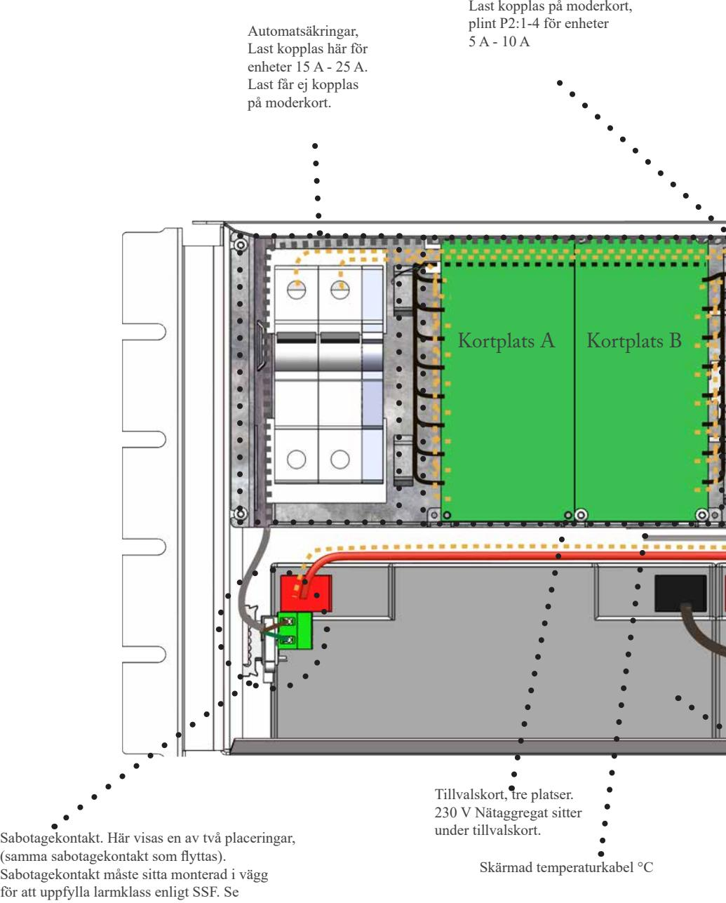

6 Data och konstruktion kan ändras utan föregående meddelande.

enheter.

"Sabotagekontakt" på sida 24. Tillval för EN54

DOLT - Ferritblock för AGG 24 V. Wurth 742700790 eller likvärdig, 2 varv.

En (1) ferritkärna medföljer enheten förutom de som är fabriksmonterade. Vid ersättning av ferritkärna se specificerade ferriter, nedan. Ferritblock för last och kommunikation, Wurth 742700790 eller liknande, 1 varv. Last genom ferrit endast vid inkoppling av last på huvudkort.

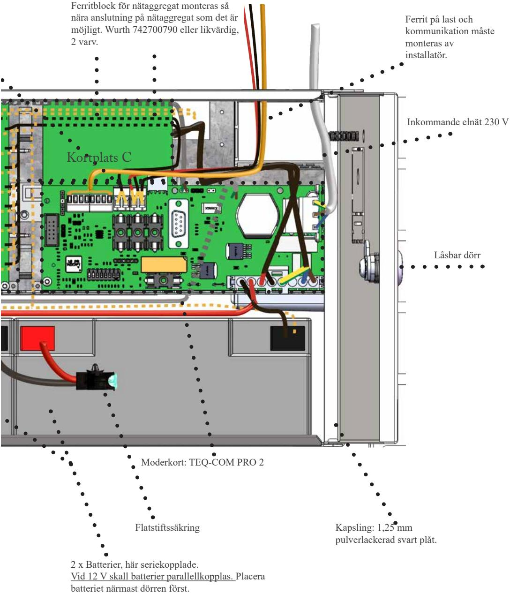

Data och konstruktion kan ändras utan föregående meddelande. 7

Skärmad temperaturkabel °C

# 1. Montering av FLX M

Enheten kan monteras i 19" rack eller på vägg. Medföljande konsoler kan fästas på två sätt: Vid montering på vägg skall konsolerna sitta bakåt, mot vägg. Vid montering i 19" rack skall konsolens sitta i framkant på enheten. Se bilder nedan. Skjut in konsolen nedifrån och upp.

Notera att sabotagekontakt skall fästas emot vägg vid anläggningar som kräver larmklass 3/4.

100 mm fritt utrymme bör lämnas under för bästa ventilation. Täck inte sidorna.

Konsoler vända mot framsidan för montering i 19" rack.

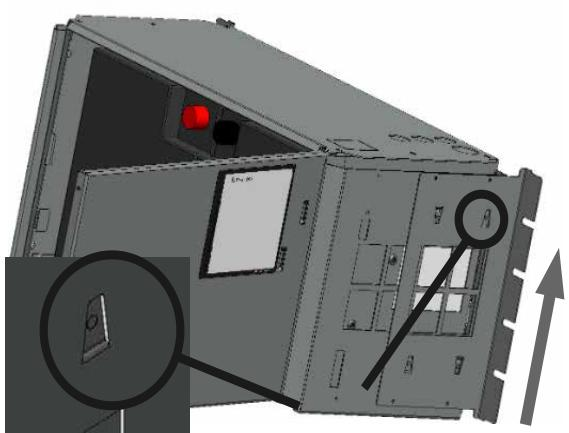

Konsoler vända mot baksidan för väggmontering.

8 8

### 2 Placering av batterier

- *• OBS! Krav för batteribyten enligt (EN50131:6)*
*• Batterier måste vara nya vid installation och batteribyte för att certifierade normer skall upprätthållas.*

| • För att erhålla ett godkännande vid besiktning SKALL en av följande batterikonfigurationer monteras:    |                | Batteri 1 (B1)         |                       |
|-----------------------------------------------------------------------------------------------------------------|----------------|------------------------|-----------------------|
| NOVA-FLX M: 24 V Seriekopplade: 20 Ah (2 x 12 V / 20 Ah) 12 V Parallellkopplade: 40 Ah (2 x 12 V / 20 Ah) | B1 +           | + Batt in på kretskort |                       |
|                                                                                                                 |                | B1 -                   | Med säkring till B2 + |
|                                                                                                                 | Batteri 2 (B2) |                        |                       |
|                                                                                                                 |                | B2 +                   | Med säkring till B1 - |
|                                                                                                                 |                |                        |                       |

B2 - - Batt in på kretskort

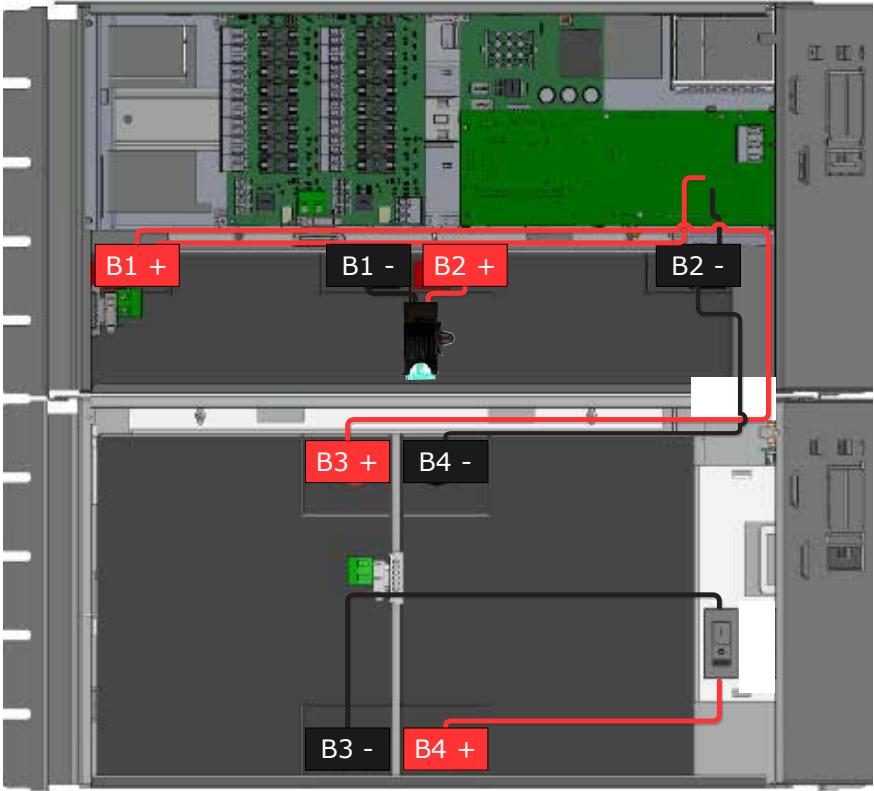

Bilden visar enheten med extra batteribox. Batterier skall placeras som på bilden. Bilder ger även en översikt över kopplingspunkter för batterikablar och batterisäkringar (24 V). .

### 2. Inkoppling av batterier

Batterikablage är monterat på kretskortet vid leverans.

*• OBS - bilder nedan visar endast hur kablage skall kopplas.* 

Placera batterierna i skåpet med batteripolerna utåt, mot skåpluckan. Anslut batterikablaget.

Bryt, om möjligt, nätspänning vid batteribyte.

| Batteri 1 (B1)                                                      |                                        |  |
|---------------------------------------------------------------------|----------------------------------------|--|
| B1 +                                                                | + Batt in på kretskort                 |  |
| B1 -                                                                | Med säkring till B2 +                  |  |
| Kretsko Batteri 2 (B2) 24 V+ 24 V+ Baterbku Baterbku |                                        |  |
| B2 +                                                                | Med säkring till B1 -                  |  |
| B2 -                                                                | - Batt in på kretskort 24 V 24 V |  |

Baterbku

Baterbku

B4

B4

B -6ster baterox 1

Seriekoppling, batterier: 24 V

Seriekoppling, batterier: 24 V FLX S

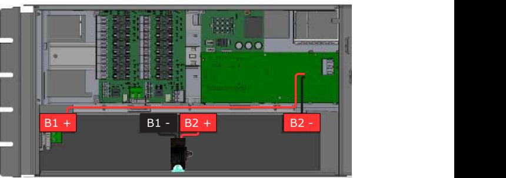

Seriekoppling, batterier: 24 V FLX M

B1 "2ster baterku

10 Data och konstruktion kan ändras utan föregående meddelande.

B1 B1 

B B

B B

B1

B14

B14

B1

B1

B1-

B1-

B2

B2

B6

B6

B1

B1

Dubel kabso från ketsor +

Dubel kabso från ketsor +

Dubel kabso från ketsor -

Dubel kabso från ketsor -

Kabelsko från B

Kabelsko från B

Kabelsko från B

Kabelsko från B

B1 Text

B1 Text

B2

B2

B16

B1

B12

B1

B1

### Beskrivning huvudkort PRO 2

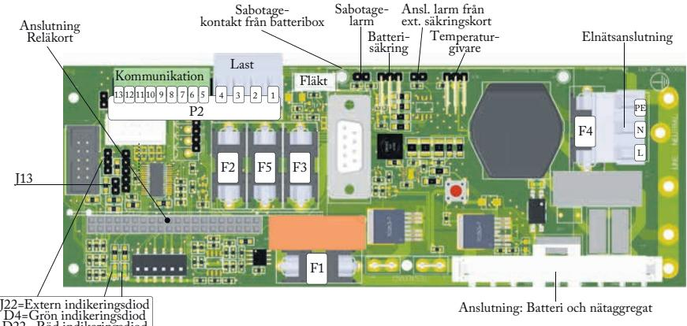

P2 Externa anslutning F Säkringar P2: 1 Lastutgång 1 + (plus)* F1 Säkring nätaggregat (T16A) P2: 2 Lastutgång 1 - (minus) F2 Säkring, lastutgång 2 + (plus)*** P2: 3 Lastutgång 2 + (plus) F3 Säkring, lastutgång 1 + (plus)*** P2: 4 Lastutgång 2 - (minus) F4 Säkring elnät (T2,5A vid 15A / T4A vid 25A). P2: 5 I2C* SDA F5 Säkring, lastutgång 1 - (minus) (T16A) P2: 6 I2C* SCL Elnätsanslutning: P2: 7 RS-485 Anslutning, -.** Line/Neutral/Skyddsjord (PE). P2: 8 RS-485 Anslutning, +.** J13 Se sida 20. P2: 9 System-minus (-).** P2: 10 RXD** *Tillvalskort strömmatas från lastutgång 1 och 2 på tillvalskort. P2: 11 TXD** **Det är möjligt att ansluta kommunikation till extern larmcentral via anslutningar på P2. Se larmcentralens dokumentation för kompatibelt protokoll. P2: 12 + 5 V** ***Säkring på F2 och F3 beror på vilket nätaggregat som sitter i enheten. P2: 13 Jord

D22= Röd indikeringsdiod

### 3. Anslutningar: Elnät, Last och kommunikation 3.1 Anslut Elnät

Elnät (kablage): Anslut elnätskablage genom kabel-genomföringen på skåpets ovansida. Använd medföljande plint för att montera elnätskablar.

F=Fas / Line. N=Noll / Neutral. PE= Skyddsjord, Protected Earth.

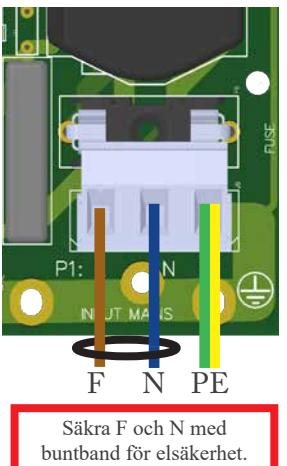

Anslut plint på kretskortet, (INPUT MAINS). F4 är säkring för elnät (T2,5A / T4A vid 25 A).

Kablage för elnätsanslutning SKALL MINST vara av kabelarea 1,5 mm2 och klassad för 250 V AC.

Maximal kabelarea är 4 mm2 .

Elnätskablage skall hållas separerat från batteri- och lastkablage. Elnätskabel skall sitta fast med buntband. Elnätskabel får inte buntas tillsammans med andra kablar.

#### 3.2 Anslut last

Sitter ett eller flera avsäkringskort monterade skall last anslutas där. Se bilaga.

Är enheten för **15 A eller mer** skall last anslutas på automatsäkring. Se komponentöversikt.

Last 1-2 ansluts på 1-4. Maxström får ej överskridas. Se märkskylt på enhet. 1, Last 1 +

#### 3.3 Andra anslutningar

J22=Extern indikeringsdioD4=Grön indikeringsdioD22= Röd indikeringsdioPå raden med stiftlister kopplas: Sabotagekontakt från batteribox. Sabotagekontakt från enheten. Batterisäkring från batteribox. Anslutning av larm från extern säkringskort. Temperaturgivare. P2: Anslutning Reläkort 13

#### 3.4 Anslut kommunikation J13

dKommunikation ansluts på plint 5-12. Larm via Busskommunikation och via LED på skåpets framsida. Se larmcentralens dokumentation för kompatibelt protokoll. J22=Extern indikeringsdiod D4=Grön indikeringsdiod D22= Röd indikeringsdiod

d

d

#### 3.5 Kommunikation till överordnat system

Det är möjligt att ansluta kommunikation till ett överordnat system via anslutningar på P2. Se larmcentralens dokumentation för kompatibelt protokoll. För mer information om larm; F1

se tekniska data.

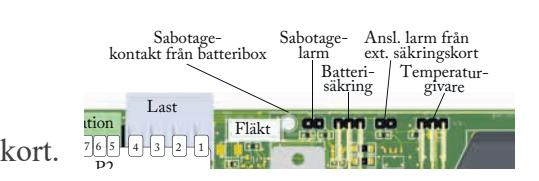

F2 F5 F3

P2: 12 11 10 9 8 7 6 5 P2 Kommunikatio n 13 Anslutning: Batteri och nätaggregat

| P2     | 4 Extern anslutning F 2                                                                                                                                     |
|--------|----------------------------------------------------------------------------------------------------------------------------------------------------------------------|
| P2: 5  | I2 C* SDA 3                                                                                                                                                    |
| P2: 6  | I2 C* SCL 2 F                                                                                                                                               |
| P2: 7  | 5 RS-485 Anslutning, -. ** 1                                                                                                                                   |
| P2: 8  | RS-485 Anslutning. +.**                                                                                                                                              |
| P2: 9  | F System-minus (-).** F 3                                                                                                                                   |
| P2: 10 | lä RXD** kt                                                                                                                                                    |
| P2: 11 | TXD**                                                                                                                                                                |
| P2: 12 | + 5 V**                                                                                                                                                              |
|        | **Det är möjligt att ansluta kommunikation till extern larmcentral via anslutningar på P2. Se larmcentralens dokumentation för kompatibelt protokoll. |

F1

F4

N

PE

L

#### 3.5.1 Flera enheter till ett överordnat system

För att ansluta flera enheter till ett överordnat system skall last-minus, (P2:2, P2:4), kopplas samman. Anslutning: Batteri och nätaggregat

#### 3.6 Larm via busskommunikation

Se tekniska data för PRO2.

Data och konstruktion kan ändras utan föregående meddelande. 13

säkring

Last

Batteri-

Temperatur-

Ansl. larm

Sabotage-

Sabotage-

kontakt från batteribox

larm

F4

PE N L

Elnätsanslutning

ext. säkringskort

från

givare

#### 3.7 Återställning av data efter batteribyte (J13)

För att systemet skall mäta in nya batteriers kapacitet behöver enheten Anslutning Reläkort Sabotage- kontakt från batteribox

rensa tidigare batterikapacitet. Låt skåpdörren vara öppen. Tryck in sabotagekontakten. Montera jumper på J13. Tag bort jumper på J13. Släpp sabotagekontakten.

F1

Fläkt

Batterisäkring

Ansl. larm från ext. säkringskort Sabotage- larm

Temperatur- givare

F4

Anslutning: Batteri och nätaggregat

PE N L

Elnätsanslutning

#### Notering om test av batterier

J22=Extern indikeringsdiod D4=Grön indikeringsdiod D22= Röd indikeringsdiod Vid uppstart tar det 72 timmar innan systemet utför tester av batterier. Detta för att säkerställa fulladdade batterier samt för insamling av medelvärden/historik under minst 72 timmar. Därefter görs, var 60:e minut , ett kvalificerat cellprov av batterierna.

#### Notering vid uppstart med kortslutna batterier

Peakström vid uppstart med kortslutna batterier: Upp till 30 A p-p under 200 ms. Följ alltid uppstartsproceduren på sida 16.

# 3.8 PRO2 Reläkort - beskrivning och anslutningar

Larutgångar: Alla fellarmsreläer skall vara i draget tillstånd. Kontrollera att slutning finns mellan CO och NC. Sätt mätinstrumentet på kontinuitetsmätning och testa slutning. Denna skall då indikera kortslutning.

Alla reläutgångar är normalt spänningssatta och ger larm vid spänningslöst läge. Vid anslutning till kommunikation skickar det yttre och överordnade systemet frågor och får tillbaka larm om relä ej är

| spänningssatt.                    |                                                                                                                                         |  |  |  |
|-----------------------------------|-----------------------------------------------------------------------------------------------------------------------------------------|--|--|--|
| Relä är normalt spänningssatt. | Förklaring                                                                                                                              |  |  |  |
| NO, COM, NC                       | Nätavbrottslarm.                                                                                                                        |  |  |  |
| NO, COM, NC                       | Larm för: Frånkopplat batteri, låg batterispänning, åldrat batteri, djupurladdning, utlöst lastsäkring, överspänning, underspänning. |  |  |  |
| NO, COM, NC                       | Larm för: Låg systemspänning.                                                                                                           |  |  |  |
| NO, COM, NC                       | Sabotagelarm, (tillval för EN54).                                                                                                       |  |  |  |
| -                                 | Anslutning till TEQ-COM PRO 2.                                                                                                          |  |  |  |
| -                                 | LED blinkar grönt vid normaldrift.                                                                                                      |  |  |  |
|                                   |                                                                                                                                         |  |  |  |

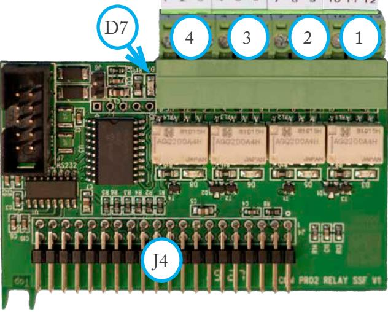

PRO 2 Reläkort, tabellen visar relevanta anslutningar och indikeringar.

### 4. Driftsättning / Test Hur enheten skall startas

Efter inkoppling skall uppstart ske i följande steg:

- Inkoppling/spänningssättning av batteridel.
- Spänningssättning av elnät.

Enheten fungerar normalt då indikeringsdiod på skåpluckans utsida lyser med fast grönt sken. Se frontpanel för övriga statusindikationer.

#### Systemtest

- Slå till inkommande nätspänning.
- Indikeringsdiod på skåpluckans utsida lyser med fast grönt sken. Bryt nätspänning för att kontrollera att enheten fungerar i batteridrift och larmar.
- Indikeringsdiod på skåpluckan blinkar grönt. För larmtyp, se panel.
- Slå till inkommande nätspänning. Indikeringsdiod, på skåpluckans utsida lyser med fast grönt sken. Normaldrift.

### Återställning

Återställ enheten genom att göra enheten helt spänningslös. Koppla bort batterikablage samt nätspänning och återanslut efter 5 sekunder.

Frågor? Se baksidan för kontakt till support.

# Larm som visas på skåplucka

#### I normalläge visar indikeringsdioden ett fast grönt sken.

| Fast grönt sken.                                                                          | Normal drift. (Lysdioden blinkar till var 10:e sekund vilket betyder det att enheten är fulladdad). |  |  |
|-------------------------------------------------------------------------------------------|--------------------------------------------------------------------------------------------------------|--|--|
| Långsamt grönt blink.                                                                     | Sabotagelarm. (Tillval)                                                                                |  |  |
| Snabbt grönt blink.                                                                       | Nätavbrottslarm.                                                                                       |  |  |
| Fast gult sken                                                                            | Låg batterispänning.                                                                                   |  |  |
| Långsamt gult blink                                                                       | Åldrade batterier.                                                                                     |  |  |
| Snabbt gula blink                                                                         | Bortkopplade batterier / batterikortslutning.                                                          |  |  |
| Fast rött sken                                                                            | Över- underspänning / laddarfel.                                                                       |  |  |
| Långsamt rött blink                                                                       | Låg systemspänning.                                                                                    |  |  |
| Snabbt rött blink                                                                         | Lastsäkring har löst ut / batterisäkring har löst ut.                                                  |  |  |
| Släckt/svart                                                                              | Djupurladdningsskydd är aktiverat.                                                                     |  |  |
| Vid driftsatt system: Är indikeringsdioden släckt har djupurladdningsskydd trätt i kraft. |                                                                                                        |  |  |

|       | Battery backup                                                                                 |  |
|-------|------------------------------------------------------------------------------------------------|--|
|       | EN54                                                                                           |  |
| Green | Normal operation Tamper alarm (option) Mains failure                                     |  |
| Amber | Low battery Aged batteries sconnected batteries / battery cell shortage                  |  |
| Red   | Over or under voltage / charger fault Low system voltage Blown load / battery fuse blown |  |
| Off   | Deep discharge protection (system shutdown)                                                    |  |
|       |                                                                                                |  |
|       |                                                                                                |  |

Data och konstruktion kan ändras utan föregående meddelande. 17

Pantone Grön=7739 C Orange=7571 C Röd=7626 C Gul=129 C Magenta=7636 C

# Om certifikat

Enheten är certifierad och godkänd för att uppfylla skyddoch säkerhetsstandarder enligt EN 54-4.

Enheten är testad, certifierad och godkänd för att uppfylla skydd- och säkerhetsstandarder enligt

EN 54-4:1997, Europeisk brandsäkerhetsnorm. Krav enligt europeisk lagstiftning vid brandlarmsanläggningar. EN 54-4:1997/AC:1999 EN 54-4:1997/A1:2002 EN 54-4:1997/A2:2006

| Tabell 1           |                        |
|--------------------|------------------------|
| Certifierad enhet: | Marknadsförs även som: |
| NOVA 27 30-XS2     | EN54 24V 3A FLX S      |
| NOVA 27 50-XS2     | EN54 24V 5A FLX S      |
| NOVA 27 100-XS2    | EN54 24V 10A FLX S     |
| Batteribox 24V-XS2 | Batteribox 24V-FLX S   |
| NOVA 27 50-FLX     | EN54 24V 5A FLX M      |
| NOVA 27 100-FLX    | EN54 24V 10A FLX M     |
| NOVA 27 150-FLX    | EN54 24V 15A FLX M     |
| NOVA 27 250-FLX    | EN54 24V 25A FLX M     |
| Batteribox24V-FLX  | Batteribox24V-FLX M    |

SBF 110:8 (Brand och utrymningslarm), Svensk brandsäkerhetsnorm. Krav enligt svensk lagstiftning vid brandlarmsanläggningar. EN50131-6 Security Grade 3 (1-3), Europeisk säkerhetsnorm. Krav enligt europeisk lagstiftning vid inbrottslarmsanläggningar. EMC Directive 2004/108/EC.

Certifiering och tester är utförda av RiSE (tidigare SP, Sveriges Provnings- och Forskningsinstitut / Statens Provningsanstalt).

Certifikat för EN54-4 medföljer alltid. Certifikat finns även att hämta på www.milleteknik.se

Produkten uppfyller även:EN 60950-1. Europeisk elsäkerhetsnorm. Low Voltage Directive 2006/95/EC. CE-marking Directive 93/68/EEC.

# Tekniska data

|                                     | EN54 24V 5A FLX M                                                                                                                                                                                                                                                                                                                                                         | EN54 24V 10A FLX M                               | EN54 24V 15A FLX M | EN54 24V 25A FLX M |  |
|-------------------------------------|------------------------------------------------------------------------------------------------------------------------------------------------------------------------------------------------------------------------------------------------------------------------------------------------------------------------------------------------------------------------------|-----------------------------------------------------|-----------------------|-----------------------|--|
| Hela enheten                        |                                                                                                                                                                                                                                                                                                                                                                              |                                                     |                       |                       |  |
| Omgivning:                          | Miljöklass1, inomhus, ickekondenserande                                                                                                                                                                                                                                                                                                                                      |                                                     |                       |                       |  |
| Omgivnings temperatur:           | +5 + 40 °C. Enligt miljöklass 1. (För bästa batterilivslängd; 15 - 25 °C).                                                                                                                                                                                                                                                                                                   |                                                     |                       |                       |  |
| Omgivning relativ luftfuktighet: | 20 % ~ 90 % icke kondenserande.                                                                                                                                                                                                                                                                                                                                              |                                                     |                       |                       |  |
| Godkännande:                        | Se sida 5                                                                                                                                                                                                                                                                                                                                                                    |                                                     |                       |                       |  |
| Certifieringar:                     | Se sida 5                                                                                                                                                                                                                                                                                                                                                                    |                                                     |                       |                       |  |
| EMC-provad och uppfyller:        | Se sida 5                                                                                                                                                                                                                                                                                                                                                                    |                                                     |                       |                       |  |
| Provningsinstitut:                  |                                                                                                                                                                                                                                                                                                                                                                              | RISE - Research Institutes of Sweden (tidigare SP). |                       |                       |  |
| Vikt:                               | 8 kg.                                                                                                                                                                                                                                                                                                                                                                        | 8 kg.                                               | 8 kg.                 | 8 kg.                 |  |
| Kapsling                            |                                                                                                                                                                                                                                                                                                                                                                              |                                                     |                       |                       |  |
| Dimension:                          | 436 x 222 x 210 mm.                                                                                                                                                                                                                                                                                                                                                          |                                                     |                       |                       |  |
| Höjdenheter:                        | 5 HE                                                                                                                                                                                                                                                                                                                                                                         |                                                     |                       |                       |  |
| Kapslingsklass:                     | IP 32                                                                                                                                                                                                                                                                                                                                                                        |                                                     |                       |                       |  |
|                                     |                                                                                                                                                                                                                                                                                                                                                                              |                                                     |                       |                       |  |
| Huvudkort                           | TEQ-COM PRO 2, se även tekniska data på följande sidor.                                                                                                                                                                                                                                                                                                                      |                                                     |                       |                       |  |
| Lastutgång ström:                   | Se sida 8.                                                                                                                                                                                                                                                                                                                                                                   |                                                     |                       |                       |  |
| Egenförbrukning (med reläkort):  | Mindre än 150 mA. Alla reläer dragna i normalläge.                                                                                                                                                                                                                                                                                                                           |                                                     |                       |                       |  |
| Djupurladdnings skydd:           | 10 V (+/- 0,5 V)                                                                                                                                                                                                                                                                                                                                                          | 20 V (+/- 0,5 V)                                 | 20 V (+/- 0,5 V)   | 20 V (+/- 0,5 V)   |  |
| Felutgång:                          | Med reläkort. 4 st växlande reläkontakter eller via kommunikation, (RS-485).                                                                                                                                                                                                                                                                                                 |                                                     |                       |                       |  |
| Larm:                               | Se sida 16, 17, 21.                                                                                                                                                                                                                                                                                                                                                          |                                                     |                       |                       |  |
| Extern statusindikering:            | Indikeringsdiod på skåplucka.                                                                                                                                                                                                                                                                                                                                                |                                                     |                       |                       |  |
| Omkopplingstid:                     | När batterier är i vilocykel: < 5 mikrosekunder. När batterier är i laddcykel: 0 (ingen). Batterier vilar i 20 dygns cykler varefter en laddcykel tar vid och laddar batterierna i 72 h. Sker nätavbrott när batterier är i vilocykel kopplas batterier in på < 5 mikrosekunder. Sker nätavbrott när batterier är i laddcykel existerar ingen omkopplingstid. |                                                     |                       |                       |  |
| Inkommande elnät:                   | 230-240 V AC, 47-63 230-240 V AC, 47-63 Hz, Säkring T2,5AH250V. Hz, Säkring T4AH250V.                                                                                                                                                                                                                                                                            |                                                     |                       |                       |  |

# Tekniska data, fortsättning

|                                                                                                                                         | EN54 24V 5A FLX M                                                                                                                                                  | EN54 24V 10A FLX M | EN54 24V 15A FLX M        | EN54 24V 25A FLX M |  |  |  |
|-----------------------------------------------------------------------------------------------------------------------------------------|-----------------------------------------------------------------------------------------------------------------------------------------------------------------------|-----------------------|------------------------------|-----------------------|--|--|--|
| Utgångsspänning:                                                                                                                        | Max 27,8 V DC, spänningsgräns bör normalt vara 27,3 V, (12 V, 13,6 V DC). Min 19 V DC, (12 V, 9,5 V DC). Min gäller vid bortkopplad nätspänning i batteridrift. |                       |                              |                       |  |  |  |
| Överspänning, larmgräns: 27,8 V.                                                                                                        |                                                                                                                                                                       |                       |                              |                       |  |  |  |
| Nätaggregat                                                                                                                             | DR-120-12 DR-120-24 DRP-240-24 HRP-300-24                                                                                                                    |                       |                              |                       |  |  |  |
| Utspänning:                                                                                                                             | 12 V                                                                                                                                                                  | 24 V                  | 24 V                         | 24 V                  |  |  |  |
| Utspänning, ripple:                                                                                                                     | 250 mVp-p                                                                                                                                                             | 250 mVp-p             | 250 mVp-p                    | 250 mVp-p             |  |  |  |
| Utspänning återuppladdning, ripple/ strömgräns:                                                                                   | Mindre än 2 Vp-p                                                                                                                                                   | Mindre än 2 Vp-p   | Mindre än 2 Vp-p          | Mindre än 2 Vp-p   |  |  |  |
| Max urladdningsström (Imax. A):                                                                                                      | 10 A                                                                                                                                                                  | 4,5 A                 | 10 A                         | 14 A                  |  |  |  |
| Max uppladdningsström (Imax. b):                                                                                                     | 10 A                                                                                                                                                                  | 5 A                   | 12 A                         | 15 A                  |  |  |  |
| Imin är alltid 0 A.                                                                                                                     |                                                                                                                                                                       |                       |                              |                       |  |  |  |
| Verkningsgrad:                                                                                                                          | 80 %                                                                                                                                                                  | 84 %                  | 84 %                         | 87 %                  |  |  |  |
| Strömbegränsning:                                                                                                                       | 105-150 %                                                                                                                                                             | 105-150 %             | 105-150 %                    | 105-135%              |  |  |  |
| Konstantspänning:                                                                                                                       | +/-0,2 %                                                                                                                                                              | +/-0,5 %              | +/-0,5 %                     | +/-0,2 %              |  |  |  |
| Reglernoggrannhet:                                                                                                                      | +/-0,2 %                                                                                                                                                              | +/-1,0 %              | +/-1,0 % +/-1,0 %         |                       |  |  |  |
| Nätspänning, frekvens:                                                                                                                  | 176 - 264 V AC, 47 -63Hz.                                                                                                                                          |                       | 85 - 264 V AC, 47 - 63Hz. |                       |  |  |  |
| Systemet är designat för användning av batterier med följande kapacitet: Milleteknik rekommenderar UPLUS-batterier till EN54 Serien. |                                                                                                                                                                       |                       |                              |                       |  |  |  |
| Batterier                                                                                                                               | (USL12-20)                                                                                                                                                            | (USL12-45)            |                              |                       |  |  |  |
| Volt:                                                                                                                                   | 12 V                                                                                                                                                                  | 12 V                  |                              |                       |  |  |  |
| Batterikapacitet:                                                                                                                       | 20 Ah                                                                                                                                                                 | 45 Ah                 |                              |                       |  |  |  |
| Batterityp:                                                                                                                             | Valve-Regulated,Absorbed Glass Mat(AGM) Technology.                                                                                                                   |                       |                              |                       |  |  |  |
| Batterimärklivslängd: 10-12 år.                                                                                                         |                                                                                                                                                                       |                       |                              |                       |  |  |  |

# Tekniska data, fortsättning

| EN54 13 100-FLX M              | EN54 27 50-FLX M          | EN54 27 100-FLX M         | EN54 27 150-FLX M                                                                      | EN54 27 250-FLX M                                                                      |  |
|-----------------------------------|------------------------------|------------------------------|-------------------------------------------------------------------------------------------|-------------------------------------------------------------------------------------------|--|
| Vilken lastutgång skall användas? |                              |                              | Vid 15 A och mer ansluts last på Automatsäkringar.                                     |                                                                                           |  |
| Använd lastutgång på kort      | Använd lastutgång på kort | Använd lastutgång på kort | Använd lastutgång på automatsäkring                                                    | Använd lastutgång på automatsäkring                                                    |  |
| Vilken säkring skall användas?    |                              |                              |                                                                                           |                                                                                           |  |
| DR-120-12                         | DR-120-24                    | DRP-240-24                   | HRP-300-24                                                                                | HRP-600-24                                                                                |  |
| F10A                              | F5A                          | F10A                         | 2 st automatsäkringar C16 eller avsäkringskort med vardera F2A per utgång. | 2 st automatsäkringar C32 eller avsäkringskort med vardera F2A per utgång. |  |

Data och konstruktion kan ändras utan föregående meddelande. 21

EN54 24V 5A FLX M

Mindre än 2 Vp-p

47 -63Hz.

Milleteknik rekommenderar UPLUS-batterier till EN54 Serien. Batterier (USL12-20) (USL12-45) Volt: 12 V 12 V Batterikapacitet: 20 Ah 45 Ah

Min 19 V DC, (12 V, 9,5 V DC).

Utgångsspänning:

Utspänning

strömgräns:

återuppladdning, ripple/

Max urladdningsström

Max uppladdningsström

Nätspänning, frekvens: 176 - 264 V AC,

Batterimärklivslängd: 10-12 år.

Imin är alltid 0 A.

Överspänning, larmgräns: 27,8 V.

EN54 24V 10A FLX M

Min gäller vid bortkopplad nätspänning i batteridrift.

Mindre än 2 Vp-p

(Imax. A): 10 A 4,5 A 10 A 14 A

(Imax. b): 10 A 5 A 12 A 15 A

Verkningsgrad: 80 % 84 % 84 % 87 % Strömbegränsning: 105-150 % 105-150 % 105-150 % 105-135% Konstantspänning: +/-0,2 % +/-0,5 % +/-0,5 % +/-0,2 % Reglernoggrannhet: +/-0,2 % +/-1,0 % +/-1,0 % +/-1,0 %

Systemet är designat för användning av batterier med följande kapacitet:

Batterityp: Valve-Regulated,Absorbed Glass Mat(AGM) Technology.

Nätaggregat DR-120-12 DR-120-24 DRP-240-24 HRP-300-24 Utspänning: 12 V 24 V 24 V 24 V Utspänning, ripple: 250 mVp-p 250 mVp-p 250 mVp-p 250 mVp-p

Max 27,8 V DC, spänningsgräns bör normalt vara 27,3 V, (12 V, 13,6 V DC).

EN54 24V 15A FLX M

Mindre än 2 Vp-p

85 - 264 V AC, 47 - 63Hz.

EN54 24V 25A FLX M

Mindre än 2 Vp-p

# Tekniska data huvudkort: PRO2

| Kortnamn:                             | PRO 2                                                                         |                                                                                  |                       |                  |                        |     |
|---------------------------------------|-------------------------------------------------------------------------------|----------------------------------------------------------------------------------|-----------------------|------------------|------------------------|-----|
| Lastutgång ström:                     | Beroende på nät aggregat och batterier. Se separat tabell.                    |                                                                                  |                       |                  |                        |     |
| Egenförbrukning (med reläkort):    | Mindre än 210 mA. 100 mA utan effektsteg med alla reläer dragna i normalläge. |                                                                                  |                       |                  |                        |     |
| Djupurladdningsskydd 12 V enheter  | 10 V (+/- 0,5 V)                                                           |                                                                                  |                       |                  |                        |     |
| Djupurladdningsskydd 24 V enheter  | 20 V (+/- 0,5 V)                                                           |                                                                                  |                       |                  |                        |     |
| Normaldrift                           |                                                                               | Lysdioden på skåplucka blinkar till var 15:e sekund vid fullt laddade batterier. |                       |                  |                        |     |
| Felutgång:                            |                                                                               | Via 4 st växlande reläkontakter eller via kommunikation, (RS-485).               |                       |                  |                        |     |
|                                       | Nätfelsrelä, EPSfel Relä 1                                              | Summalarmrelä Relä 2                                                          | Batterifel, Relä 3 | APSfel Relä 4 | 2 I C /RS 485 | LED |
| Nätavbrott                            | X                                                                             |                                                                                  |                       |                  | X                      | X   |
| Säkringsfel                           |                                                                               | X                                                                                |                       |                  | X                      | X   |
| Sabotagebrytare (tillval för EN54) |                                                                               |                                                                                  |                       | X                | X                      | X   |
| Fläktfel                              |                                                                               |                                                                                  |                       |                  | X                      |     |
| Laddarfel, överspänning            |                                                                               | X                                                                                |                       |                  | X                      | X   |
| Laddarfel, underspänning           |                                                                               | X                                                                                |                       |                  | X                      | X   |
| Ej anslutet batteri                   |                                                                               | X                                                                                |                       |                  | X                      | X   |
| Låg systemspänning                    |                                                                               |                                                                                  | X                     |                  | X                      | X   |
| Låg batterispänning / nätavbrott   |                                                                               | X                                                                                |                       |                  | X                      | X   |
| Övertemperatur                        |                                                                               |                                                                                  |                       |                  | X                      |     |
| Undertemperatur                       |                                                                               |                                                                                  |                       |                  | X                      |     |
| Kort batteritid kvar                  |                                                                               |                                                                                  |                       |                  | X                      |     |
| Åldrat batteri                        |                                                                               | X                                                                                |                       |                  | X                      | X   |
| Överström 100 % minutmedelvärde    |                                                                               |                                                                                  |                       |                  | X                      |     |
| Överström 80 % dygnsmedelvärde     |                                                                               |                                                                                  |                       |                  | X                      |     |
| Överström 175 % sekundmedelvärde   |                                                                               |                                                                                  |                       |                  | X                      |     |

# Tekniska data, fortsättning

Kortnamn: PRO 2

Egenförbrukning (med

Djupurladdningsskydd 12 V enheter

Djupurladdningsskydd 24 V enheter

Sabotagebrytare

Laddarfel,

Laddarfel,

Låg batterispänning /

Överström 100 %

Överström 80 %

Överström 175 %

Lastutgång ström: Beroende på nät aggregat och batterier. Se separat tabell.

10 V (+/- 0,5 V)

20 V (+/- 0,5 V)

Nätfelsrelä, EPSfel Relä 1

reläkort): Mindre än 210 mA. 100 mA utan effektsteg med alla reläer dragna i normalläge.

Normaldrift Lysdioden på skåplucka blinkar till var 15:e sekund vid fullt laddade batterier.

Nätavbrott X X X Säkringsfel X X X

(tillval för EN54) X X X

överspänning X X X

underspänning X X X Ej anslutet batteri X X X Låg systemspänning X X X

nätavbrott X X X

Åldrat batteri X X X

Batterifel, Relä 3

APSfel Relä 4

I 2 C /RS-485 LED

Felutgång: Via 4 st växlande reläkontakter eller via kommunikation, (RS-485).

Fläktfel X

Övertemperatur X Undertemperatur X Kort batteritid kvar X

minutmedelvärde X

dygnsmedelvärde X

sekundmedelvärde X

Summalarmrelä Relä 2

| Kortnamn:                                     | PRO 2                                                                                                           |                                                                                                                                                                                                                                                                                   |
|-----------------------------------------------|-----------------------------------------------------------------------------------------------------------------|-----------------------------------------------------------------------------------------------------------------------------------------------------------------------------------------------------------------------------------------------------------------------------------|
|                                               | Fläktfel:                                                                                                       | Funktionsfel i fläkt, ej korrekt varvtal.                                                                                                                                                                                                                                         |
|                                               | Frånkopplat batterier:                                                                                          | Larm ges när batteri kopplas från eller fel i battericeller uppstår (som systemet uppfattar som bortkopplade batterier).                                                                                                                                                    |
|                                               | Låg batterispänning:                                                                                            | Batterispänning vid nätavbrott - spänningen i batteridrift är låg, (< 24,0 V DC).                                                                                                                                                                                              |
| Larm via buss kommunikation:I2C, RS-485 | Låg systemspänning (överbelastning):                                                                         | System-spänning i nätdrift, även kortvarigt, är för låg, (24,0 V).                                                                                                                                                                                                             |
|                                               | Reservdrifttid:                                                                                                 | Larm för när minsta reservdrift tid ej uppfylls. FLX S: Standardvärde för 14 Ah batterier är 12 timmar vid medellast. FLX M: Standardvärde för 20 Ah batterier är 12 timmar vid medellast. FLX L: Standardvärde för 45 Ah batterier är 12 timmar vid medellast. |
|                                               | Underspänning:                                                                                                  | Systemet klarar inte av att ladda batterierna till 26,6 V.                                                                                                                                                                                                                     |
|                                               | Undertemperatur:                                                                                                | Systemets temperatursensor indikerar skadligt låg driftstemperatur, (< 10°C).                                                                                                                                                                                                  |
|                                               | Åldrade batterier:                                                                                              | Larm ges när batterier har mindre än cirka 80 % av kapacitet kvar.                                                                                                                                                                                                             |
|                                               | Överström,överlast eller kortslutning:                                                                       | Larm ges när överlast (över 170 %) eller kortslutning inträffar.                                                                                                                                                                                                               |
|                                               | Överspänning:                                                                                                   | Systemet laddar batterier för mycket. Spänning är över 27,8 V.                                                                                                                                                                                                                 |
|                                               | Övertemperatur:                                                                                                 | Systemets temperatursensor indikerar skadligt hög driftstemperatur, (> 35°C).                                                                                                                                                                                                  |
|                                               | Övrig info:                                                                                                     | Statistik och loggfiler överbelastning, temperatur, spänning samt belastningprofiler.                                                                                                                                                                                          |
| Omkopplingstid:                               | När batterier är i vilocykel: < 5 mikrosekunder. När batterier är i laddcykel: 0 (ingen). omkopplingstid. | Batterier vilar i 20 dygns cykler varefter en laddcykel tar vid och laddar batterierna i 72 h. Sker nätavbrott när batterier är i vilocykel kopplas batterier in på < 5 mikrosekunder. Sker nätavbrott när batterier är i laddcykel existerar ingen                         |
| Inkommande elnät:                             | 230-240 V AC, 47-63 Hz                                                                                          |                                                                                                                                                                                                                                                                                   |
| Elnätssäkring 12 V enheter                 | T2,5AH250V.                                                                                                     |                                                                                                                                                                                                                                                                                   |
| Elnätssäkring 24 V enheter                 |                                                                                                                 | Upp till 15A: T2,5AH250V. Över 15 A:T4AH250V.                                                                                                                                                                                                                                     |

# Tekniska data, fortsättning

| Kortnamn:                   | PRO 2                                                                                                                                                                 |
|-----------------------------|-----------------------------------------------------------------------------------------------------------------------------------------------------------------------|
| Utgångsspänning:            | Max 27,8 V DC, spänningsgräns bör normalt vara 27,3 V, (12 V, 13,6 V DC). Min 19 V DC, (12 V, 9,5 V DC). Min gäller vid bortkopplad nätspänning i batteridrift. |
| Överspänning, larmgräns: | 27,9 V                                                                                                                                                                |

| Internresistans              |                             |                                               |                                 |              |              |                    |                                          |
|------------------------------|-----------------------------|-----------------------------------------------|---------------------------------|--------------|--------------|--------------------|------------------------------------------|
| Batteri Kapacitet (Ah) | Intern restitans (mΩ) | Spännings dip vid testlast 24 V (mV) | Testlast av kapacitet (%) | Testlast (A) | Testlast (Ω) | Effekt motstånd | Marginal (gräns för larm =0,6V) |
| 20 Ah                        | 14 mΩ                       | 102,94 mV                                     | 0,18 %                          | 3,68 A       | 6,8 Ω        |                    | 4,83                                     |
| 45 Ah                        | 9 mΩ                        | 272,73 mV                                     | 0,34 %                          | 7,6 A        | 3,3 Ω        | 3,3R               | 2,4                                      |

### Batterikombinationer

| 12 V   | Antal batterier          | Placering                             | 24 V   | Antal batterier                                                          | Placering                                                                                                                 |
|--------|-----------------------------|---------------------------------------|--------|-----------------------------------------------------------------------------|---------------------------------------------------------------------------------------------------------------------------|
| 20 Ah  | 1 st. 20 Ah                 | FLX M                                 | 20 Ah  | 2 st. 20 Ah                                                                 | FLX M                                                                                                                     |
| 40 Ah  | 2 st. 20 Ah                 | FLX M                                 | 45 Ah  | 2 st. 45 Ah*                                                                | FLX M och Batteribox 24V- FLX M                                                                                        |
| 90 Ah  | 2 st. 45 Ah*                | FLX M och Batteribox 12V- FLX M | 65 Ah  | 2 st. 20 Ah 2 st. 45 Ah*                                                 | FLX M och Batteribox 24V- FLX M                                                                                        |
| 110 Ah | 1 st. 20 Ah 2 st. 45 Ah* | FLX M och Batteribox 12V- FLX M | 90 Ah  | 2 st. 45 Ah* 2 st. 45 Ah*                                                | Batteribox 24V- FLX M och Batteribox 24V- FLX M                                                                        |
| 130 Ah | 2 st. 20 Ah 2 st. 45 Ah* | FLX M och Batteribox 12V- FLX M | 110 Ah | 2 st. 20 Ah 2 st. 45 Ah* 2 st. 45 Ah*                                 | FLX M och Batteribox 24V- FLX M och Batteribox 24V- FLX M                                                           |
|        |                             |                                       | 135 Ah | 2 st. 45 Ah* 2 st. 45 Ah* 2 st. 45 Ah*                                | Batteribox 24V- FLX M och Batteribox 24V- FLX M och Batteribox 24V- FLX M                                           |
|        |                             |                                       | 155 Ah | 2 st. 20 Ah 2 st. 45 Ah* 2 st. 45 Ah* 2 st. 45 Ah*                 | FLX M och Batteribox 24V- FLX M och Batteribox 24V- FLX M och Batteribox 24V- FLX M                              |
|        |                             |                                       | 180 Ah | 2 st. 45 Ah* 2 st. 45 Ah* 2 st. 45 Ah* 2 st. 45 Ah*                | FLX M och Batteribox 24V- FLX M och Batteribox 24V- FLX M och Batteribox 24V- FLX M och Batteribox 24V- FLX M |
|        |                             |                                       | 200 Ah | 2 st. 20 Ah 2 st. 45 Ah* 2 st. 45 Ah* 2 st. 45 Ah* 2 st. 45 Ah* | FLX M och Batteribox 24V- FLX M och Batteribox 24V- FLX M och Batteribox 24V- FLX M och Batteribox 24V- FLX M |

*Anger att batterier sitter i extern batteribox

Data och konstruktion kan ändras utan föregående meddelande. 25

# Reservdrifttider

En lathund för batteribackuper För att få en uppfattning om ungefärlig reservdrifttid finns följande lathundar att tillgå. Observera att vid uträkning har vi tagit hänsyn till att batterierna åldras. Alla batterikombinationer kanske inte är

| tillgängliga för enheten.                                                                                                                             |                 |                                  |                       |       |                                              |       |      |      |      |      |      |      |      |      |      |
|-------------------------------------------------------------------------------------------------------------------------------------------------------|-----------------|----------------------------------|-----------------------|-------|----------------------------------------------|-------|------|------|------|------|------|------|------|------|------|
| Reservdrifttid                                                                                                                                        |                 | (Förväntad och efter batterityp) |                       |       | Medelström, belastning (timmar).             |       |      |      |      |      |      |      |      |      |      |
| System spänning                                                                                                                                    | Antal           | Batteri                          | Total Bat. kap. | 0,5 A | 1 A                                          | 2 A   | 4 A  | 6 A  | 8 A  | 10 A | 12 A | 14 A | 16 A | 18 A | 20 A |
|                                                                                                                                                       |                 |                                  |                       |       | Timmar och minuter (4,5= 4 hr och 30 minuter |       |      |      |      |      |      |      |      |      |      |
| 12 V                                                                                                                                                  | 2 st.           | 7,2 Ah                           | 14 Ah                 | -     | 20                                           | 11    | 4,5  | 2    | 1    | 0,6  | -    | -    | -    | -    | -    |
| 12 V                                                                                                                                                  | 2 st.           | 14 Ah                            | 28 Ah                 | -     | 39                                           | 21    | 11   | 4,5  | 2,5  | 2    | -    | -    | -    | -    | -    |
| 12 V                                                                                                                                                  | 2 st.           | 20 Ah                            | 40 Ah                 | -     | 56                                           | 30    | 15,5 | 8    | 4,5  | 3    | -    | -    | -    | -    | -    |
| 24V                                                                                                                                                   | 2 st.           | 7,2Ah                            | 7,2                   | 9,8   | 4,2                                          | 1,6   | 1,0  | 0,6  | 0,4  | 0,3  | -    | -    | -    | -    | -    |
| 24V                                                                                                                                                   | 2 st.           | 14Ah                             | 14                    | 20,0  | 11,1                                         | 4,5   | 2,3  | 1,6  | 1,0  | 0,8  | -    | -    | -    | -    | -    |
| 24V                                                                                                                                                   | 2 st.           | 20Ah                             | 20                    | 28,6  | 16,7                                         | 8,6   | 4,0  | 2,6  | 1,8  | 1,2  | 0,9  | 0,7  | 0,6  | 0,5  | 0,5  |
| 24V                                                                                                                                                   | 4 st.           | 14Ah                             | 28                    | 40,0  | 23,3                                         | 12,7  | 6,0  | 3,8  | 2,7  | 2,1  | -    | -    | -    | -    | -    |
| 24V                                                                                                                                                   | 6 st.           | 14Ah                             | 42                    | 60,0  | 35,0                                         | 19,1  | 9,5  | 6,1  | 4,4  | 3,3  | -    | -    | -    | -    | -    |
| 24V                                                                                                                                                   | 2 st.           | 45Ah                             | 45                    | 64,3  | 37,5                                         | 20,5  | 10,2 | 6,5  | 4,7  | 3,8  | 3,0  | 2,5  | 2,2  | 1,7  | 1,3  |
| 24V                                                                                                                                                   | 2 st.+ 2 st. | 20+ 45Ah                      | 65                    | 92,9  | 54,2                                         | 29,5  | 15,5 | 10,0 | 7,1  | 5,7  | 4,5  | 3,9  | 3,4  | 2,5  | 2,3  |
| 24V                                                                                                                                                   | 10 st.          | 70Ah                             | 70                    | 100,0 | 58,3                                         | 31,8  | 16,7 | 10,7 | 8,1  | 6,2  | -    | -    | -    | -    | -    |
| 24V                                                                                                                                                   | 4 st.           | 45Ah                             | 90                    | 128,6 | 75,0                                         | 40,9  | 21,4 | 14,5 | 10,4 | 8,4  | 6,6  | 5,7  | 4,7  | 4,2  | 3,8  |
| 24V                                                                                                                                                   | 2 st.+ 4 st. | 20+ 45Ah                      | 110                   | 157,1 | 91,7                                         | 50,0  | 26,2 | 17,7 | 13,4 | 10,2 | 8,6  | 7,0  | 5,8  | 5,4  | 4,6  |
| 24V                                                                                                                                                   | 6 st.           | 45Ah                             | 135                   | 192,9 | 112,5                                        | 61,4  | 32,1 | 21,8 | 16,5 | 13,2 | 10,5 | 9,0  | 7,5  | 6,7  | 5,7  |
| 24V                                                                                                                                                   | 2 st.+ 6 st. | 20+ 45Ah                      | 155                   | 221,4 | 129,2                                        | 70,5  | 36,9 | 25,0 | 18,9 | 15,2 | 12,7 | 10,4 | 9,1  | 7,7  | 6,5  |
| 24V                                                                                                                                                   | 8 st.           | 45Ah                             | 180                   | 257,1 | 150,0                                        | 81,8  | 42,9 | 29,0 | 22,0 | 17,6 | 14,8 | 12,7 | 10,6 | 9,4  | 8,0  |
| 24V                                                                                                                                                   | 2 st.+ 8 st. | 20 +45Ah                      | 200                   | 285,7 | 166,7                                        | 90,9  | 47,6 | 32,3 | 24,4 | 19,6 | 16,4 | 14,1 | 12,3 | 10,4 | 9,4  |
| 24V                                                                                                                                                   | 10 st.          | 45Ah                             | 225                   | 321,4 | 187,5                                        | 102,3 | 53,6 | 36,3 | 27,4 | 22,1 | 18,4 | 15,8 | 13,9 | 12,4 | 10,6 |
| Hänsyn tagen till 80% av batteriets grundkapacitet, det vill säga att batterier har minst 80% kapacitet för att kunna användas driftsäkert i enheten. |                 |                                  |                       |       |                                              |       |      |      |      |      |      |      |      |      |      |

# Lastutgång ström

| Storlek på batteri                                                                            | 20 Ah                              | 40 Ah | 45 Ah | 60 Ah | 90 Ah | 110 Ah | 130 Ah | 155 Ah | 180 Ah | 200 Ah |  |
|-----------------------------------------------------------------------------------------------|------------------------------------|-------|-------|-------|-------|-----------|-----------|-----------|-----------|-----------|--|
| NOVA 13-100-FLX (Finns en som EN54)                                                           |                                    |       |       |       |       |           |           |           |           |           |  |
| Maximalt certifierat strömuttag nätdrift (Imax. A)                                      | 7,9 A                              | 7,1 A |       |       | 4 A   | 2,7 A     | 1,2 A     | -         | -         | -         |  |
| Max återuppladd ningstid till 80 %                                                         | 24 h                               | 24 h  |       |       | 24 h  | 24 h      | 24 h      |           |           |           |  |
| Max lastström med återuppladdning, ( dvs max lastström samtidigt som batterier laddas): 10 A  |                                    |       |       |       |       |           |           |           |           |           |  |
| Maximalt strömuttag batteridrift, (samma som Imax. b): 10 A                                   |                                    |       |       |       |       |           |           |           |           |           |  |
| Storlek på batteri                                                                            | 20 Ah                              | 40 Ah | 45 Ah | 60 Ah | 90 Ah | 110 Ah | 130 Ah | 155 Ah | 180 Ah | 200 Ah |  |
|                                                                                               | NOVA 27 50-FLX / EN54 24V 5A FLX M |       |       |       |       |           |           |           |           |           |  |
| Maximalt certifierat strömuttag nätdrift (Imax. A)                                      | 3,5 A                              |       | 2 A   | 0,7 A | -     | -         | -         | -         | -         | -         |  |
| Max återuppladd ningstid till 80 %                                                         | 24 h                               |       | 24 h  | 24 h  |       |           |           |           |           |           |  |
| Max lastström med återuppladdning, ( dvs max lastström samtidigt som batterier laddas): 4,5 A |                                    |       |       |       |       |           |           |           |           |           |  |
| Maximalt strömuttag batteridrift, (samma som Imax. b): 5 A                                    |                                    |       |       |       |       |           |           |           |           |           |  |
| Storlek på batteri                                                                            | 20 Ah                              | 40 Ah | 45 Ah | 60 Ah | 90 Ah | 110 Ah | 130 Ah | 155 Ah | 180 Ah | 200 Ah |  |
| NOVA 27 100-FLX / EN54 24V 10A FLX M                                                          |                                    |       |       |       |       |           |           |           |           |           |  |
| Maximalt certifierat strömuttag nätdrift (Imax. A)                                      | 8,5 A                              |       | 7 A   | 5,7 A | 4,2 A | 2,9 A     | 1,4 A     | 0,1 A     | -         | -         |  |
| Max återuppladd ningstid till 80 %                                                         | 24 h                               |       | 24 h  | 24 h  | 24 h  | 24 h      | 24 h      | 24 h      |           |           |  |
| Max lastström med återuppladdning, ( dvs max lastström samtidigt som batterier laddas): 10 A  |                                    |       |       |       |       |           |           |           |           |           |  |

# Lastutgång ström, fortsättning

| Storlek på batteri                                          | 20 Ah  | 40 Ah | 45 Ah | 60 Ah | 90 Ah | 110 Ah | 130 Ah | 155 Ah | 180 Ah | 200 Ah |
|-------------------------------------------------------------|--------|-------|-------|-------|-------|-----------|-----------|-----------|-----------|-----------|
| Maximalt strömuttag batteridrift, (samma som Imax. b): 10 A |        |       |       |       |       |           |           |           |           |           |
| NOVA 27 150-FLX / EN54 24V 15A FLX M                        |        |       |       |       |       |           |           |           |           |           |
| Maximalt certifierat strömuttag nätdrift (Imax. A)    | 12,6 A |       | 11 A  | 9,7 A | 8,2 A | 6,9 A     | 5,4 A     | 4,1 A     | 2,5 A     | 1,3 A     |
| Max återuppladd ningstid till 80 %                       | 24 h   |       | 24 h  | 24 h  | 24 h  | 24 h      | 24 h      | 24 h      | 24 h      | 24 h      |

| Storlek på batteri                                                                           | 20 Ah | 40 Ah | 45 Ah | 60 Ah  | 90 Ah  | 110 Ah | 130 Ah | 155 Ah | 180 Ah | 200 Ah |
|----------------------------------------------------------------------------------------------|-------|-------|-------|--------|--------|-----------|-----------|-----------|-----------|-----------|
| Max lastström med återuppladdning, ( dvs max lastström samtidigt som batterier laddas): 14 A |       |       |       |        |        |           |           |           |           |           |
| Maximalt strömuttag batteridrift, (samma som Imax. b): 15 A                                  |       |       |       |        |        |           |           |           |           |           |
| NOVA 27 250-FLX / EN54 24V 25A FLX M                                                         |       |       |       |        |        |           |           |           |           |           |
| Maximalt certifierat strömuttag nätdrift (Imax. A)                                     |       |       | 24 A  | 22,7 A | 21,2 A | 19,9 A    | 18,3 A    | 17,1 A    | 15,5 A    | 14,3 A    |
| Max återuppladd ningstid till 80 %                                                        |       |       | 24 h  | 24 h   | 24 h   | 24 h      | 24 h      | 24 h      | 24 h      | 24 h      |
| Max lastström med återuppladdning, ( dvs max lastström samtidigt som batterier laddas): 25 A |       |       |       |        |        |           |           |           |           |           |
| Maximalt strömuttag batteridrift, (samma som Imax. b): 25 A                                  |       |       |       |        |        |           |           |           |           |           |

#### Extra batteribox Montering av batteribox. Vad som skall göras i batteribackup

Det är möjligt att koppla till extra batteriboxar till batteribackup för utökad reservdrifttid.

Kabelgenomföring/knock-out finns på batteribackupens undersida och skall brytas loss innan montering.

Använd kablage som följer med batteriboxen för att möta kablage från batteribackup. Skall sabotagekontakt även sitta i batteribox? Se avsnitt "Sabotagekontakt vid extra batteribox."

Se bild A, nedan, för hur kablar skall mötas mellan skåpen. Klipp gul bygel i kontakt från batteribackup.

Enheten skall vara spänningslös vid montering och inkoppling. Lossa spännband i batteribackupen för att komma åt kabelgenomföringen från enhetens golv.

Den extra batteriboxen skjuts eller placeras under batteribackup, (eller föregående batteribox), batteribox skruvas därefter fast i rack eller vägg. De bägge kapslingarna skall möta varandra utan glapp, se bild B nedan.

- *• OBS! Batterier måste vara nya vid installation och vid byte för att certifikat skall fortsätta att gälla.*
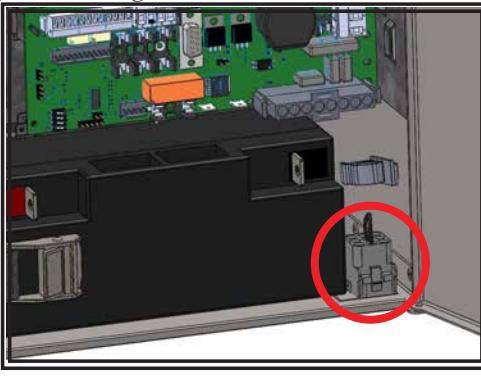

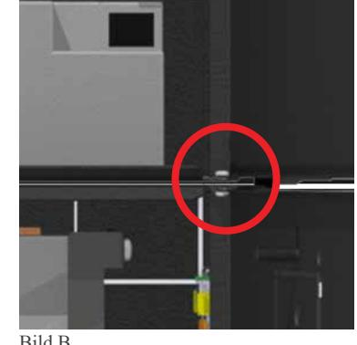

Bild A. Bild B.

Data och konstruktion kan ändras utan föregående meddelande. 29

#### Inkoppling och placering av batterier

- *• OBS! Batterier måste vara nya vid installation och batteribyte. Sätt i batteri närmast dörren först.*
Koppla ihop batteribox och batteribackup som bilden visar. Kablage skall vara kopplat som bilden visar.

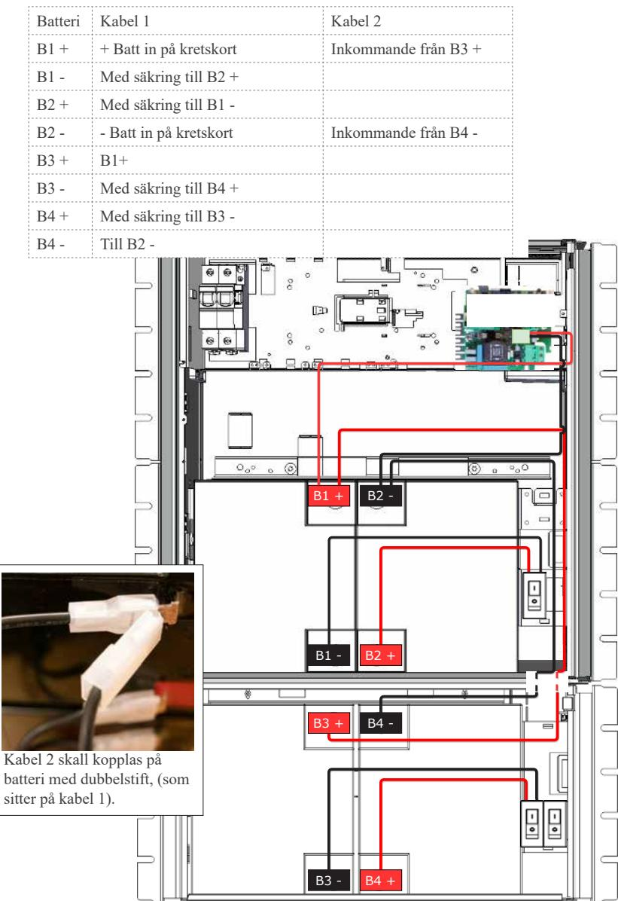

#### Inkopplingsschema och gul bygel

Larm till sabotagekontakt seriekopplas och därför måste slingan vara obruten till sista batteriboxkablaget. Gul bygel sluter slingan på varje kablage som går från batteribackup till batteribox och för att larm skall ges på sabotagekontakten i batteriboxen måste gul bygel på kablage klippas. Klipp inte gul bygel på sista kablage i batteribox, då kommer larm för sabotage inte ges i någon tillkopplad batteribackup eller

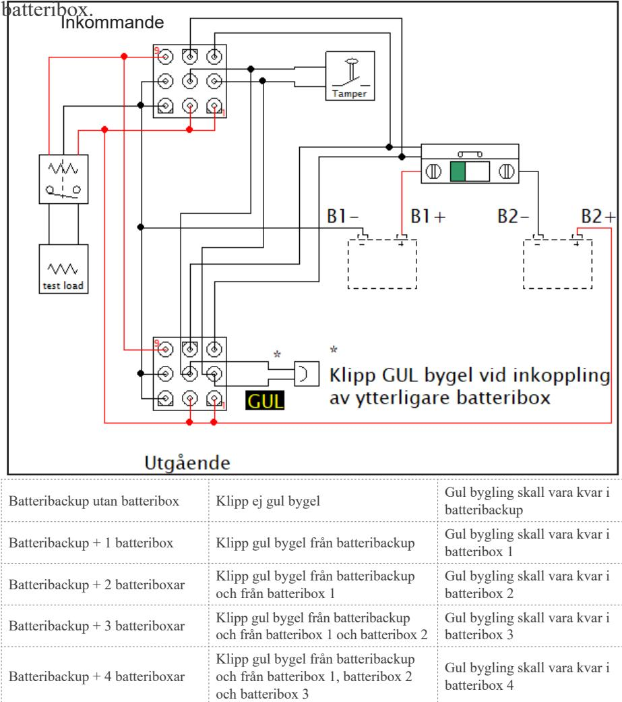

Data och konstruktion kan ändras utan föregående meddelande. 31

#### Schema: Batteribackup med 4 batteriboxar

32 Data och konstruktion kan ändras utan föregående meddelande.

B2

B1

24 V+ Baterbku

24 V+ Baterbku

B1 "2ster baterku

Kretsko

24 V-Baterbku

24 V-Baterbku

B1 Text

B1 Text

B2

B2

# Underhåll

Enheten med undantag för batterier är underhållsfritt vid installation i inomhusmiljö.

#### Batterier

Batterier alstrar elektricitet genom en kemisk process och det sker därmed en naturlig degradering av kapacitet. Den största faktorn för batteriers livslängd är temperatur. Ju högre temperatur desto kortare livslängd. En ideal temperatur är 20 °C. Tillverkningsdatum som är präglat på batteriet och livslängden

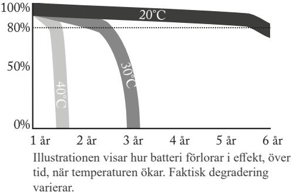

(som batteritillverkaren anger) gäller vid helt outnyttjat batteri från och med tillverkningsdatum. Batterier bör bytas efter HALVA angiven livslängd för säker drift. Batterier inköpta via Milleteknik har en livslängd på mellan 10-12 år med rekommenderat byte efter 5-6 år.

#### Batteribyte

(För enheter med separat batterihylla eller batteribox; se dess manual.) Bryt, om möjligt, nätspänning vid batteribyte.

- 1. Avlägsna säkring mellan batterierna. Slå av eventuell automatsäkring. (Avlägsna eventuellt batterisäkring på kretskort).
- 2. Notera hur batterikablar är monterade innan de avlägsnas.
- 3. Sätt in och spänn fast de nya batterierna.
- 4. Anslut batterikablarna på samma sätt som tidigare.
- 5. Sätt tillbaka säkring på kretskort, säkring/ar mellan batterierna och slå på eventuell automatsäkring.
- 6. Slå till nätspänning. Eventuellt kan indikeringsdioden lysa rött under ett par timmar, tills batterier är laddade.
- 7. Testa systemet genom att kortvarigt koppla bort nätspänning, (= lasten drivs vidare av batterierna), och därefter slå till nätspänningen igen.

Data och konstruktion kan ändras utan föregående meddelande. 33

#### Batteriåtervinning

Alla batterier skall återvinnas. Återlämna till tillverkare eller lämna till återvinningsstation.

### Strömuttag per produkt

| NOVA FLX S utan batteribox            | Batteri                                     | Enligt SSF1014, Larmklass 1-2 | Enligt SSF1014, Larmklass 3-4 |  |
|------------------------------------------|---------------------------------------------|----------------------------------|----------------------------------|--|
| NOVA 27 30-FLX S (14 Ah)                 | 2 st. 14 Ah                                 | 1,1A                             | 0,45A                            |  |
| NOVA 27 50-FLX S (14 Ah)                 | 2 st. 14 Ah                                 | 1,1A                             | 0,45A                            |  |
| NOVA 27 100-FLX S (14 Ah)                | 2 st. 14 Ah                                 | 1,1A                             | 0,45A                            |  |
|                                          |                                             |                                  |                                  |  |
| NOVA FLX S med 1 st. batteribox       | Batteri                                     | Enligt SSF1014, Larmklass 1-2 | Enligt SSF1014, Larmklass 3-4 |  |
| NOVA 27 50-FLX S (42Ah)                  | 6 st. 14 Ah                                 | 3,3A                             | 1,4A                             |  |
| NOVA 27 100-FLX S (42Ah)                 | 6 st. 14 Ah                                 | 3,3A                             | 1,4A                             |  |
|                                          |                                             |                                  |                                  |  |
| NOVA FLX S inkl. 2 st. batteribox     | Batteri                                     | Enligt SSF1014, Larmklass 1-2 | Enligt SSF1014, Larmklass 3-4 |  |
| NOVA 27 100-FLX S (70Ah)                 | 10 st. 14 Ah                                | 5,5A                             | 2,3A                             |  |
|                                          |                                             |                                  |                                  |  |
| NOVA FLX M utan batteribox            | Enligt SSF1014, Batteri Larmklass 1-2 |                                  | Enligt SSF1014, Larmklass 3-4 |  |
| NOVA 27 50-FLX (20 Ah)                   | 2 st. 20 Ah                                 | 1,6A                             | 0,65A                            |  |
| NOVA 27 100-FLX (20 Ah)                  | 2 st. 20 Ah                                 | 1,6A                             | 0,65A                            |  |
| NOVA 27 150-FLX (20 Ah)                  | 2 st. 20 Ah                                 | 1,6A                             | 0,65A                            |  |
| NOVA 27 250-FLX (20 Ah)                  | 2 st. 20 Ah                                 | 1,6 A                            | 0,65A                            |  |
|                                          |                                             |                                  |                                  |  |
| NOVA FLX M med 1 st Batterybox FLX M  | Batteri                                     | Enligt SSF1014, Larmklass 1-2 | Enligt SSF1014, Larmklass 3-4 |  |
| NOVA 27 50-FLX (45 Ah)                   | 2 st. 45 Ah                                 | 3,5A                             | 1,5A                             |  |
| NOVA 27 100-FLX (45 Ah)                  | 2 st. 45 Ah                                 | 3,5A                             | 1,5A                             |  |
| NOVA 27 150-FLX (45 Ah)                  | 2 st. 45 Ah                                 | 3,5A                             | 1,5A                             |  |
| NOVA 27 250-FLX (45 Ah)                  | 2 st. 45 Ah                                 | 3,5A                             | 1,5A                             |  |
|                                          |                                             |                                  |                                  |  |
| NOVA FLX M med 2 st. Batterybox FLX M | Batteri                                     | Enligt SSF1014, Larmklass 1-2 | Enligt SSF1014, Larmklass 3-4 |  |
| NOVA 27 100-FLX (90Ah)                   | 4 st. 45 Ah                                 | 7,1A                             | 3A                               |  |
| NOVA 27 150-FLX (90Ah)                   | 4 st. 45 Ah                                 | 7,1A                             | 3A                               |  |
| NOVA 27 250-FLX (90Ah)                   | 4 st. 45 Ah                                 | 7,1A                             | 3A                               |  |
|                                          |                                             |                                  |                                  |  |

| NOVA FLX M med 3 st. Batterybox FLX M | Batteri     | Enligt SSF1014, Larmklass 1-2 | Enligt SSF1014, Larmklass 3-4 |  |
|------------------------------------------|-------------|----------------------------------|----------------------------------|--|
| NOVA 27 100-FLX (135Ah)                  | 6 st. 45 Ah | 10,7A                            | 4,5A                             |  |
| NOVA 27 150-FLX (135Ah)                  | 6 st. 45 Ah | 10,7A                            | 4,5A                             |  |
| NOVA 27 250-FLX (135Ah)                  | 6 st. 45 Ah | 10,7A                            | 4,5A                             |  |
|                                          |             |                                  |                                  |  |
| NOVA FLX med 4 st. Batterybox FLX M   | Batteri     | Enligt SSF1014, Larmklass 1-2 | Enligt SSF1014, Larmklass 3-4 |  |
| NOVA 27 150-FLX (180Ah)                  | 8 st. 45 Ah | 12A                              | 6,5A                             |  |
| NOVA 27 250-FLX (180Ah)                  | 8 st. 45 Ah | 15A                              | 6A                               |  |
|                                          |             |                                  |                                  |  |
| NOVA FLX L utan batteribox            | Batteri     | Enligt SSF1014, Larmklass 1-2 | Enligt SSF1014, Larmklass 3-4 |  |
| NOVA 27 50-FLX L (45 Ah)                 | 2 st. 45 Ah | 1,6A                             | 0,65A                            |  |
| NOVA 27 100-FLX L (45 Ah)                | 2 st. 45 Ah | 1,6A                             | 0,65A                            |  |
| NOVA 27 150-FLX L (45 Ah)                | 2 st. 45 Ah | 1,6A                             | 0,65A                            |  |
| NOVA 27 250-FLX L (45 Ah)                | 2 st. 45 Ah | 1,6 A                            | 0,65A                            |  |
|                                          |             |                                  |                                  |  |
| NOVA FLX L med 1 st Batterybox FLX M  | Batteri     | Enligt SSF1014, Larmklass 1-2 | Enligt SSF1014, Larmklass 3-4 |  |
| NOVA 27 50-FLX L (45 Ah)                 | 2 st. 45 Ah | 3,5A                             | 1,5A                             |  |
| NOVA 27 100-FLX L (45 Ah)                | 2 st. 45 Ah | 3,5A                             | 1,5A                             |  |
| NOVA 27 150-FLX L (45 Ah)                | 2 st. 45 Ah | 3,5A                             | 1,5A                             |  |
| NOVA 27 250-FLX L (45 Ah)                | 2 st. 45 Ah | 3,5A                             | 1,5A                             |  |
|                                          |             |                                  |                                  |  |
| NOVA FLX L med 2 st. Batterybox FLX M | Batteri     | Enligt SSF1014, Larmklass 1-2 | Enligt SSF1014, Larmklass 3-4 |  |
| NOVA 27 100-FLX L (90Ah)                 | 4 st. 45 Ah | 7,1A                             | 3A                               |  |
| NOVA 27 150-FLX L (90Ah)                 | 4 st. 45 Ah | 7,1A                             | 3A                               |  |
| NOVA 27 250-FLX L (90Ah)                 | 4 st. 45 Ah | 7,1A                             | 3A                               |  |
|                                          |             |                                  |                                  |  |
| NOVA FLX L med 3 st. Batterybox FLX M | Batteri     | Enligt SSF1014, Larmklass 1-2 | Enligt SSF1014, Larmklass 3-4 |  |
| NOVA 27 100-FLX L (135Ah)                | 6 st. 45 Ah | 10,7A                            | 4,5A                             |  |
| NOVA 27 150-FLX L (135Ah)                | 6 st. 45 Ah | 10,7A                            | 4,5A                             |  |
| NOVA 27 250-FLX L (135Ah)                | 6 st. 45 Ah | 10,7A                            | 4,5A                             |  |
|                                          |             |                                  |                                  |  |
| NOVA FLX L med 4 st. Batterybox FLX M | Batteri     | Enligt SSF1014, Larmklass 1-2 | Enligt SSF1014, Larmklass 3-4 |  |
| NOVA 27 150-FLX L (180Ah)                | 8 st. 45 Ah | 12A                              | 6,5A                             |  |

| NOVA 27 250-FLX L (180Ah) | 8 st. 45 Ah 15A | 6A |
|---------------------------|--------------------|----|
|                           |                    |    |
|                           |                    |    |

#### Reservdrifttider vid olika larmklasser

| Larmklass             | Reservdrifttid vid strömavbrott | Max antal timmars återuppladdning av batterier (80%) |
|-----------------------|---------------------------------|---------------------------------------------------------|
| EN54-4                | -                               | 24 h                                                    |
| SBF110:8              | 30 h + 10 min                   | 24 h                                                    |
| EN50131-6 grade 1-2   | 12 h                            | 72 h                                                    |
| EN50131-6 grade 3     | 24 h                            | 24 h                                                    |
| SSF1014 Larmklass 1/2 | 12 h                            | 72 h                                                    |
| SSF1014 Larmklass 3/4 | 30 h                            | 24 h                                                    |

Denna sida har avsiktligen lämnats tom

Denna sida har avsiktligen lämnats tom

Data och konstruktion kan ändras utan föregående meddelande. 39

#### Milleteknik AB

- *• Ögärdesvägen 8 B, 433 30 Partille*
- *• 031-34 00 230*
- *• www.milleteknik.se*