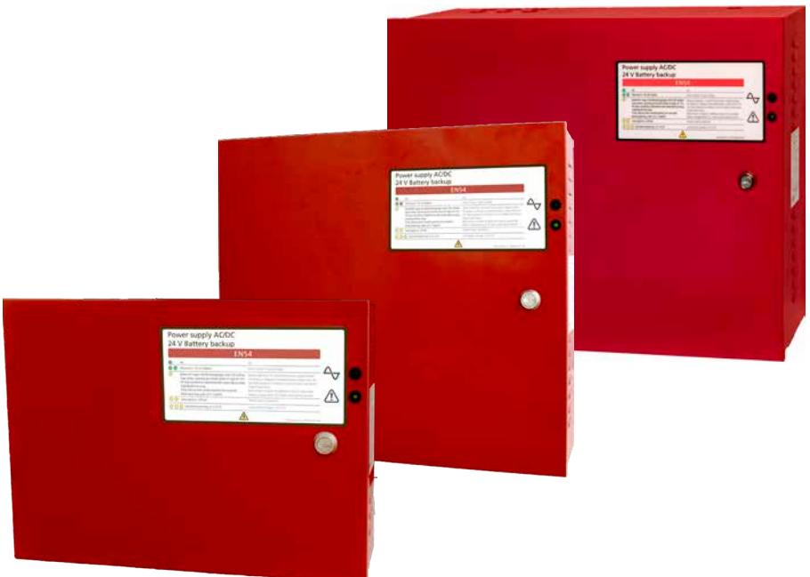
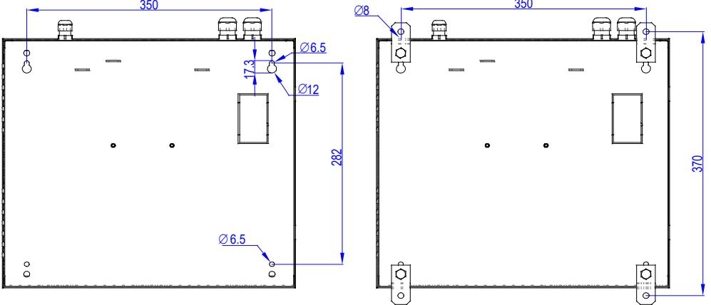
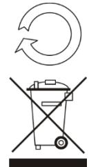

EN54 27 15-MX EN54 27 40-MX EN54 27 55-MX

SVENSKA Rev 1.2 350-095

# **Varningar och anv isningar - Läs detta f örst!**

*• Läs och följ alla nedanstående varningar och anvisningar. Underlåtenhet att beakta varningarna och följa anvisningarna kan medföra egendomsskada, elolycksfall, brand eller allvarlig personskada.*

*• Det är förbjudet att bära och transportera enheten med batterierna monterade och anslutna. Om detta inte följs kan allvarliga interna fel uppstå och funktionssäkerheten äventyras.*

*• Installations- och anslutningsarbete får utföras endast när batterierna är uttagna.*

*• Anslut batterierna med rätt polaritet – kontrollera att batteripolariteten överensstämmer med batterianslutningarnas märkning.*

*• Håll ventilationsöppningarna fria. Det måste finnas minst 10 cm fritt utrymme på båda sidor om enheten för att enhetens ventilationsbehov ska kunna tillgodoses. Otillräcklig ventilation kan leda till skador på enheten eller till förkortad batterilivslängd.*

*• Enheten ska installeras inomhus i icke kondenserande miljö.*

- *• Enheten ska anslutas till skyddsjordat nät.*
*• Kontrollera att alla anslutningar är korrekt utförda innan enheten slås till.*

- *• Enheten kan orsaka störningar i närbelägen, känslig radio- och TV-utrustning.*
*• Service och reparation av enheten får utföras endast av tillverkaren eller av tillverkaren auktoriserad servicerepresentant.*

#### Garanti och support

Produkten har två års garanti, från inköpsdatum. Vi ger kostnadsfri support på telefon, 031-313 45 42 och e-post, (support@milleteknik.se) under garantitiden. Ersättning för res-/ arbetstid i samband med lokalisering av fel, installerande av reparerad eller utbytt vara ingår ej i garantin.

Milleteknik ger support under produktens livslängd, dock som längst 10 år efter inköpsdatum. Kostnader för support tillkommer efter det att garantitiden har gått ut.

#### Användarhandbok

Enheter för avbrottsfri strömförsörjning av brand-, rök- och värmedetekteringssystem samt automatiska brandskydds- och brandsläckningssystem enligt EN 54-4 och EN 12101-10

### Innehåll

| Garanti och support                                       | 2  |
|-----------------------------------------------------------|----|
| Användarhandbok                                           | 2  |
| Produktbeskrivning                                        | 3  |
| Installation och anslutning                               | 6  |
| Noteringar                                                | 7  |
| Första start                                              | 8  |
| Test av avbrottsfri strömförsörjning                      | 8  |
| Test av batterikretsövervakning                           | 8  |
| Drift och underhåll                                       | 9  |
| Bilaga                                                    | 10 |
| Återvinning av förpackning, uttjänt produkt och batterier | 11 |

| Artikel       | E-nummer | Produktnamn i certifiering | Intyg om prestan dakontinuitet | Intyg om överens stämmelse |  |
|---------------|----------|-------------------------------|-----------------------------------|-------------------------------|--|
| EN54 27 15-MX | 5213439  | ZSP100-1.5A-07                |                                   | CNBOP No.                     |  |
| EN54 27 40-MX | 5213440  | ZSP100-4.0A-18                | CNBOP No.                         |                               |  |
| EN54 27 55-MX | 5213501  | ZSP100-5.5A-40                | 1438-CPR-0454                     | 2582/2016                     |  |

## Produktbeskrivning

Strömförsörjningsenheterna är avsedda för avbrottsfri strömförsörjning av 24 V-matade brandskyddssystem, och uppfyller kraven i standarderna EN 54-4+A1+A2 och EN 12101-10. Reservströmförsörjningen tas från två 12 V ventilreglerade batterier med bly/syraceller (Valve Regulated Lead Acid, VRLA). Strömförsörjningsenheterna är avsedda för montering på vägg.

| Tabell 1: Versionsöversikt |                                         |                    |           |        |                  |
|----------------------------|-----------------------------------------|--------------------|-----------|--------|------------------|
| Artikel                    | Ström försörjning, (nätaggregat). | Laddnings ström | Märkskylt |        |                  |
|                            |                                         |                    | Imax b    | Imax a | Batterikapacitet |
| EN54 27 15-MX              | ZSPM-75-05                              | 0,5 A              | 1,5 A     | 1,1 A  | 7-9 Ah           |
| EN54 27 40-MX              | ZSPM-150-10                             | 1,0 A              | 4,0 A     | 3,2 A  | 7-20 Ah          |
| EN54 27 55-MX              | ZSPM-150-20                             | 2,0 A              | 5,5 A     | 3,8 A  | 17-45 Ah         |

Fig. 1: Produktexempel – EN54 27 40-MX

Skåpen har upptill och på höger sida bortbrytbara (knockouts) kabelgenomföringar samt en rektangulär öppning på baksidan (sidan mot väggen) för kablage. Välj och fastställ kablarnas dragning och placering innan skåpet installeras, bryt bort de kabelgenomföringsanvisningar som ska användas och montera erforderliga kabelgenomföringar.

| Tabell 2: Mått och vikt            |                                 |                                 |                    |
|------------------------------------|---------------------------------|---------------------------------|--------------------|
|                                    | EN54 27 15-MX                   | EN54 27 40-MX                   | EN54 27 55-MX      |
| Utvändiga mått (B x H x D) (mm)    | 340 x 250 x 80 mm               | 395 x 356 x 96 mm               | 455 x 356 x 187 mm |
| Monteringshål, avstånd:            |                                 |                                 |                    |
| Invändigt i skåpet (B x H) (mm)    | 276 x 182 mm                    | 350 x 282 mm                    | 410 x 282 mm       |
| Utvändiga fästen (B x H) (mm)      | 276 x 270 mm                    | 350 x 370 mm                    | 410 x 370 mm       |
| Max. vikt utan batterier (kg)      | 3,1 kg                          | 4,2 kg                          | 6,9 kg             |
| Max. vikt med batterier (kg)       | 8,4 kg                          | 16,2 kg                         | 35,9 kg            |
| Kabelgenomföringar på ovansida     | 6 st. DW20-RM, 1 st. DW16-RM    |                                 |                    |
| Kabelgenomföringar på vänster sida | 3 st. DW20-RM, 1 st. DW16-RM | 6 st. DW20-RM, 1 st. DW16-RM |                    |

Fig. 2: Produktexempel – installationsmått för EN54 27 40-MX

Skåpet ska fästas i väggen med 4 st. skruvar. Använd inte expanderplugg av plast. Skruva loss de båda skruvarna i skåpets botten, vinkla ut blocket något och ta ut det nedåt.

| Tabell 3: El- och driftmiljödata                   |                       |
|----------------------------------------------------|-----------------------|
| Märkspänning *1)                                   | 110 / 230 V +10/–15 % |
| Nominell utgående spänning *2)                     | 27,1 V                |
| Reglerområde utgående spänning *3)                 | 21,0–28,8 V           |
| Viloströmförbrukning från batterier                | Max. 17 mA            |
| Effektförbrukning från elnät vid laddade batterier | Cirka 1,7 W           |
| Verkningsgrad vid märklast vid laddade batterier   | 89 %                  |
| Max. resistans i batterikretsen *4)                | 250 mΩ                |
| Antal övervakade batterier                         | 2                     |
| Antal separat säkrade utgångar                     | 2                     |
| Omgivningstemperatur i drift                       | –5 till +55 °C        |
| Kapslingsklass enligt EN 60529:2003                | IP 42                 |
| Funktionsklass enligt EN 12101-10:2007             | A                     |
| Miljöklass enligt EN 12101-10:2007                 | 2                     |
| Skyddsklass enligt EN 60950-1:2007 + A1:2011       | I                     |

*1) Om strömförsörjningsenhet ZSP100 bestående av strömförsörjningsmodul ZSPM-150 ska matas från 110 V-nät, ska nätspänningsomkopplaren läggas i läge 115 V (detta behövs inte för ZSP100-versioner med ZSPM-75).

*2) Gäller drift i hålladdningsläge vid 25°C.

*3) Reglerområdet sträcker sig från konstantströmsladdningens start till utjämningsladdningens slut.

*4) Felindikering utlöses när batterikretsens resistans når detta värde.

#### Installation och anslutning

Strömförsörjningsenheten ska installeras fast med treledarkabel, vars fas-, noll- och skyddsjordledare,(PE) ska anslutas enligt plintarnas märkning. Transientskydd rekommenderas. Nätspänningen till strömförsörjningsenheten ska inte brytas av brandskyddssystemets huvudströmbrytare. En extern installationsbrytare med märkström minst 3 A ska installeras i matningen till strömförsörjningsenheten. Matningen och brytaren ska vara rödmarkerade och försedda med tydlig numrering. Varje strömförsörjningsenhet ska ha en egen, separat brytare.

Batterierna ska anslutas sist, efter att alla andra anslutningar gjorts (24 V-utgångar och indikeringskretsar) och efter anslutning av indikeringsdiodkablage och eventuell sabotagekontakt. Ställ batterierna på plats på skåpets golv och sätt sedan temperaturgivaren på plats mellan batterierna så att den ligger an mot båda batterihöljena. Anslut sedan batterikablarna med rätt polaritet: röd till det ena batteriets pluspol (+), svart till det andra batteriets minuspol (–). Anslut slutligen förbindelsekabeln mellan de båda batterierna.

Fig. 3: Komponentplacering i strömförsörjningsmodul ZSPM-75

| Tabell 4: Komponentstycklista för ZSPM-modul (numrering enligt fig. 3) |                                                                 |           |                                                                                                                           |  |
|------------------------------------------------------------------------|-----------------------------------------------------------------|-----------|---------------------------------------------------------------------------------------------------------------------------|--|
| Nr                                                                     | Benämning                                                       | Märkning  | Rekommenderad kabel                                                                                                       |  |
| 1                                                                      | Nätanslutningsplint                                             | L, N,     | 3-ledarkabel med solida ledare och isolering med halogenfritt flamskyddsmedel *) 0,75–1,5 mm2                          |  |
| 2                                                                      | Batterikablar                                                   |           |                                                                                                                           |  |
| 3                                                                      | Temperaturgivare                                                |           |                                                                                                                           |  |
| 4                                                                      | Anslutningsplint belastning 1                                   | OUT 1     | 2-ledarkablel med solida ledare och isolering med                                                                         |  |
| 5                                                                      | Anslutningsplint belastning 2                                   | OUT 2     | halogenfritt flamskyddsmedel *) 1 mm2 - 2,5 mm2                                                                        |  |
| 6                                                                      | Felsignalutgång, allmänt fel                                    | GEN FLT   | Reläutgång. 2-ledarkabel för kommunikation, med                                                                           |  |
| 7                                                                      | Felsignalutgång, nätspänningsfel                                | MAINS FLT | solida ledare och isolering med flamskydd *) 1 x 2 x 0,8 mm2                                                           |  |
| 8                                                                      | Felsignalingång, externt fel                                    | EXT FLT   | Optokopplautgång. 2-ledarkabel för kommunika tion, med solida ledare och isolering med flamskydd *) 1 x 2 x 0,8 mm2 |  |
| 9                                                                      | Internindikeringslampa, grön                                    | MAINS     |                                                                                                                           |  |
| 10                                                                     | Internindikeringslampa, gul                                     | BAT       |                                                                                                                           |  |
| 11                                                                     | Anslutning för indikeringsdioder                                | Z201      |                                                                                                                           |  |
| 12                                                                     | Anslutning för sabotagekontakt                                  | Z204      | Fabriksinstallerad bygling                                                                                                |  |
| 13                                                                     | Ingång för indikering från uppsätt ning extra avsäkringskort | J201      |                                                                                                                           |  |

*) Kabeltyper för strömförsörjning och styrning av brandskyddssystem kan vara föreskrivna i lagar, byggnormer och andra bestämmelser.

#### Noteringar

- Varje felindikeringsutgång har 3 reläkontakter. Beskrivningen av reläanslutningen återger förhållandena vid frånslagen nätspänning (reläspolen strömlös).
- Den externa felingångens (8) minuspol (–) är ansluten till batteriminuspolen (B–). Felindikering utlöses om kortslutning (spänning 0 V) detekteras. I detta tillstånd flyter cirka 0,25 mA mellan ingångens pluspol (+) och minuspol (–).
- Om strömförsörjningsskåpet ska förses med sabotagekontakt, ska fabriksbyglingen tas bort från anslutning Z204 och givarkablagets stickpropp sättas i istället.
- De enda komponenter användaren kan byta ut är säkringarna enligt tabellen nedan. Utbytessäkringarna ska ha samma utlösningsström och utlösningskarakteristik som de utbytta säkringarna.

| Tabell 5: Säkringar |                    |              |             |
|---------------------|--------------------|--------------|-------------|
|                     |                    | ZSPM-75-05   | ZSPM-150-10 |
| B201                | Nätspänningsingång | 4 A trög     | 6,3 A trög  |
| B101, B102          | Utgångar           | 3,15 A snabb | 6,3 A snabb |
| B103                | Batterikrets       | 6,3 A snabb  | 8 A snabb   |

Data och konstruktion kan ändras utan föregående meddelande. 7

#### Första start

När strömförsörjningsenheten slås till och inga fel föreligger, ska statusindikeringarna enligt kolumnen Korrekt start i tabellen nedan visas. Om indikeringarna avviker från detta, föreligger felaktiga anslutningar eller andra fel – se felbeskrivningarna i bilagan.

Innan strömförsörjningsenheten används ska ytterligare två test genomföras.

# Test av avbrottsfri strömförsörjning

Bryt nätspänningen med installationsbrytaren. Strömförsörjningsenheten ska växla till batteridrift och upprätthålla oförändrad spänning på båda sina utgångar. Spänningen på utgångarna kan kontrolleras med voltmeter. Om nätspänningen bryts genom att nätsäkringen B201 tas bort, detekteras nätspänningsavbrottet först efter 10 minuter. Felreläet GEN FLT reagerar med 5 sekunders fördröjning.

## Test av batterikretsövervakning

Kontrollera att strömförsörjningsenheten är ansluten till nätspänning och bryt sedan batterikretsen genom att koppla loss någon av batterikablarna. Batterikretsavbrottet detekteras vid nästa test, (detekteringen kan ta upp till 10 minuter).

| Tabell 6: Indikeringar under test          |                 | Korrekt start | Test av nätavbrott strömförsörjning | Test av batterikrets övervakning |
|--------------------------------------------|-----------------|---------------|----------------------------------------|-------------------------------------|
| Indikeringsdioder på skåpdörren         |                 |               |                                        |                                     |
| 230 V AC                                   | Grön            | Tänd          | Blinkar                                | Tänd                                |
| ALARM                                      | Gul             | Släckt        | Tänd                                   | Tänd                                |
| Indikeringsdioder på enhetens moderkort |                 |               |                                        |                                     |
| MAINS (nät)                                | Grön            | Tänd          | Släckt                                 | Tänd                                |
| BAT (batteri)                              | Gul             | Släckt        | Släckt                                 | Blinkar *)                          |
| Indikeringsreläer                          |                 |               |                                        |                                     |
| MAINS FLT                                  | Nätspänningsfel | Draget        | Ej draget                              | Draget                              |
| GEN FLT                                    | Allmänt fel     | Draget        | Ej draget                              | Ej draget                           |

*) Om batterikretsen förblir bortkopplad under mer än 12 minuter, övergår indikeringslampan BAT till fast sken.

*• Kontrollera under testningen att felindikeringen GEN FLT verkligen överförs korrekt till brandlarmspanelen.*

# Drift och underhåll

Efter installation kräver strömförsörjningsenheten endast regelbunden avläsning av felindikeringar.

Utgångsspänningar och indikeringsnivåer är fabriksinställda. Koppla inte ihop batteriminuspolen (B–) med utgångarnas minuspoler OUT1 (–) och OUT2 (–).

Batteripaketet är anslutet till strömförsörjningsenheten endast när nätspänning finns och när batterispänningen överstiger 21,6 V. Vid batterifel (polspänningen för enskilt batteri lägre än 10 V) detekteras inte batteriet. Larmindikeringslampan ALARM blinkar hastigt vid spänning mellan dessa gränser, men batteriet kommer inte att vara anslutet.

I batteridriftläge vid nätspänningavbrott kopplas batterierna ur automatiskt av underspänningsskyddet (Low Voltage Disconnect Device, LVDD) när batterierna laddats ur under 21 V. Efter LVDD-urkoppling drar strömförsörjningsenheten fortfarande en mycket liten ström för interna behov. Batterierna får inte därför inte lämnas i detta tillstånd under någon längre tid, eftersom de då kan laddas ur till så låg spänning att de inte återinkopplas när nätspänningen återkommer.

Om strömförsörjningsenheten ska vara långvarigt bortkopplad från nätspänning, ska batterierna kopplas bort. I annat fall kan djupurladdning ske, vilket förkortar batteriernas livslängd.

Batterilivslängden förkortas drastiskt med ökande temperatur. Var 8:e till 10:e °C temperaturökning halverar batterilivslängden.

CNBOP och VdS rekommenderar batteribyte vart 4:e driftsår, oavsett batteriernas skick.

De i avsnittet Första start, (se sida 8. beskrivna testerna ska upprepas en gång om året för att verifiera strömförsörjningsenhetens funktion och skick.

#### Bilaga

| Tabell 7: Indikeringsdioder på strömförsörjningsskåpets utsida (dörren) |                                                                                                                                                                                                                                                                                                                                                                                                                                                                                |  |
|-------------------------------------------------------------------------|--------------------------------------------------------------------------------------------------------------------------------------------------------------------------------------------------------------------------------------------------------------------------------------------------------------------------------------------------------------------------------------------------------------------------------------------------------------------------------|--|
| 230 V AC                                                                | Grön                                                                                                                                                                                                                                                                                                                                                                                                                                                                           |  |
| 0                                                                       | Nätspänning saknas, batteri frånkopplat (spänningslöst tillstånd)                                                                                                                                                                                                                                                                                                                                                                                                              |  |
| 1                                                                       | Nätspänning finns, strömförsörjningsenhet/laddare fungerar                                                                                                                                                                                                                                                                                                                                                                                                                     |  |
| 0/1 blinkar                                                             | Batteridrift: nätspänning saknas eller strömförsörjningsenhet/laddare defekt*1)                                                                                                                                                                                                                                                                                                                                                                                                |  |
| ALARM                                                                   | Gul                                                                                                                                                                                                                                                                                                                                                                                                                                                                            |  |
| 0                                                                       | Inga fel                                                                                                                                                                                                                                                                                                                                                                                                                                                                       |  |
| 1 blinkar                                                               | Batteridrift: nätspänning saknas eller strömförsörjningsenhet/laddare defekt*1) Batterikretsavbrott/batteri saknas eller något batteri har polspänning lägre än 10 V och batterierna har kopplats från av underspänningsskyddet (LVDD) För hög batterikretsresistans (mer än 250 mΩ) eller utlöst batterisäkring Lastutgångssäkring utlöst Säkring i extra avsäkringsmodul utlöst (om ansluten) Låg systemspänning - lägre än 22 V när nätspänning finns *2) |  |
| 0/1 korta blink                                                         | Externt larm eller internt larm, (om sabotagekontakt är installerad).                                                                                                                                                                                                                                                                                                                                                                                                          |  |
| 0/1 korta blink                                                         | Batteri detekterat (U > 10 V) men batterispänningen är för låg (U < 21,6 V), varför underspänningsskyddet (LVDD) hindrar inkoppling. *1) Fel på strömförsörjningsenheten/laddaren detekteras senast 10 minuter efter att felet uppstått                                                                                                                                                                                                                                  |  |

(kontrollen sker samtidigt som batterikretsresistansen mäts).

*2) Detta tillstånd kan uppstå när nätspänning återkommer och batteriladdning just påbörjats.

| Tabell 8: Indikeringsdioder på enhetens moderkort |             |                                                                                                             |  |  |
|---------------------------------------------------|-------------|-------------------------------------------------------------------------------------------------------------|--|--|
| MAINS (nät) Grön                               | 0           | Nätspänning saknas                                                                                          |  |  |
|                                                   | 1           | Nätspänning finns, strömförsörjningsenhet/laddare fungerar                                               |  |  |
|                                                   | 0/1 blinkar | Nätspänning finns, fel på strömförsörjningsenhet/laddare *1)                                             |  |  |
| BAT (batteri) Gul                              | 0           | Batteristatus korrekt                                                                                       |  |  |
|                                                   | 1 eller     | Batterikretsresistansen överskrider 250 mΩ (inklusive bortkopplat batteri eller trasig batterisäkring*2) |  |  |
|                                                   | 0/1 blinkar | Bortkopplat batteri eller trasig batterisäkring*3.                                                          |  |  |

*1) Fel på strömförsörjningsenheten/laddaren detekteras senast 10 minuter efter att felet uppstått (kontrollen sker samtidigt som batterikretsresistansen mäts).

*2) Mätning av batterikretsens resistans, inklusive kontroll med avseende på batterikretsavbrott och utlöst batterisäkring, sker var 10:e minut. När för hög batterikretsresistans detekterats tre gånger i följd, tänds indikeringslampan BAT och reläindikeringen GEN FLT utlöses. Denna övervakningsfunktion gör det möjligt att kontrollera systemet (t. ex. för underhållsändamål) genom att tillfälligt koppla bort batterikretsen utan att utlösa någon felindikering, om batterikretsen återinkopplas inom 2 minuter.

*3) För att testa detta larm behövs batteri och batterisäkring kopplas bort och sedan behövs en enda mätning som steg *2 beskriver göras. Detta möjliggör testning av funktion utan att ett GNT FLT genereras (om återinkoppling sker inom 2 minuter).

| Tabell 9: Indikeringsreläer (0 = relä ej draget, 1 = relä draget) |                                                                                                                          |  |
|-------------------------------------------------------------------|--------------------------------------------------------------------------------------------------------------------------|--|
| MAINS FLT                                                         | Nätspänningsfel                                                                                                          |  |
| 0                                                                 | – Nätspänning saknas (endast fel i matningen från elnätet, reagerar inte på fel i ström försörjningsenheten/laddaren) |  |
| 1                                                                 | –Nätspänning finns, strömförsörjningsenhet/laddare fungerar                                                              |  |
| GEN FLT                                                           | Allmänt fel                                                                                                              |  |
| 0                                                                 | – Alltid när larmindikeringslampan ALARM lyser eller blinkar *1), *2)                                                    |  |
| 1                                                                 | – Inga fel                                                                                                               |  |

*1) Fel på strömförsörjningsenheten/laddaren detekteras senast 10 minuter efter att felet uppstått (kontrollen sker samtidigt som batterikretsresistansen mäts).

*2) När nätspänningen återkommer efter nätspänningsbortfall ges denna indikering med 5 s fördröjning.

Återvinning av förpackning, uttjänt produkt och batterier

Produktförpackningen är tillverkad av återvinningsbara och ej miljö- och hälsoskadliga material (trä, papper, kartong och plast). Förpackningsmaterial som inte längre behövs ska källsorteras och lämnas till återvinning.

Produkt med denna märkning inte får avfallshanteras tillsammans med vanligt hushållsavfall, utan skall lämnas till elektronikåtervinning. Uttjänta batterier är klassade som farligt avfall och ska avfallshanteras i enlighet med gällande regler för farligt avfall.

Milleteknik AB, Ögärdesvägen 8 B, 433 30 Partille 031-34 00 230 www.milleteknik.se