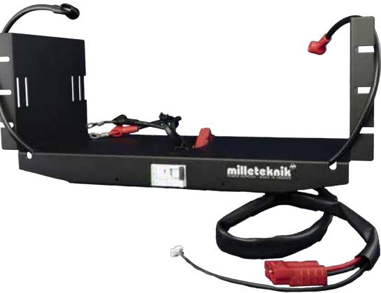
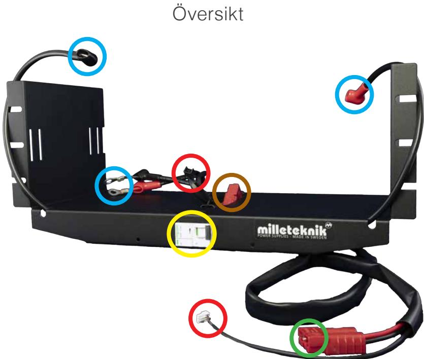
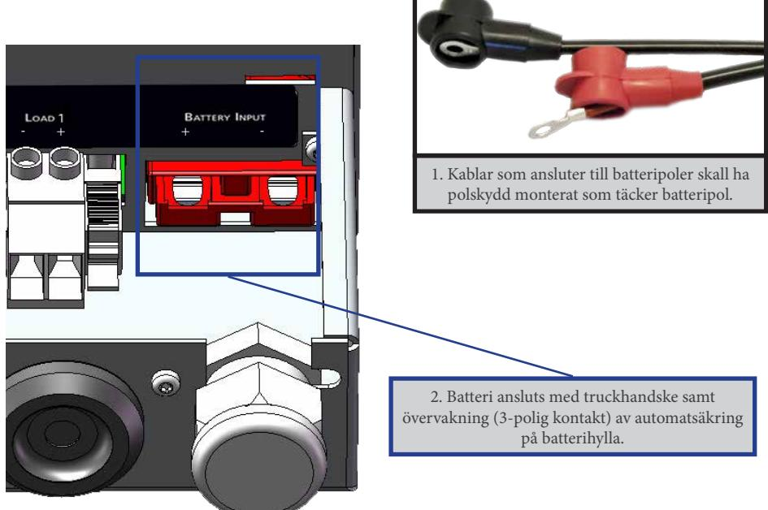
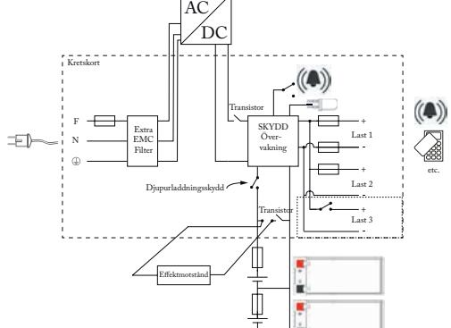

# BS-Medium 24V

Rackmonterad batterihylla med automatsäkring för batterier 2 x 45 Ah

Tillbehör till:

RACK 27 150-1HE RACK 27 150-1HE/5UT RACK 27 250-2HE RACK 27 250-2HE/5UT BAS 27 100 19" BAS 27 200 19" BAS 27 300 19"

SVENSKA

Milleteknik ger reservkraft som säkerställer drift. Alla våra produkter är designade för bästa driftsäkerhet och lång livslängd - för såväl elektronik som batterier.

Denna anvisning beskriver installation av BS-Medium 24V från Milleteknik.

| 24 V   | Batterier                                        |
|--------|--------------------------------------------------|
| 45 Ah  | 2 x 45 Ah                                        |
| 90 Ah  | 2 x 45 Ah 2 x 45 Ah                           |
| 135 Ah | 2 x 45 Ah 2 x 45 Ah 2 x 45 Ah              |
| 180 Ah | 2 x 45 Ah 2 x 45 Ah 2 x 45 Ah 2 x 45 Ah |

# Batterikombinationer

#### SÄKERHET - LÄS DETTA FÖRST!

- 100 mm fritt utrymme skall lämnas framför och bakom.
- Enheten skall installeras i en låst och skyddad inomhusmiljö. Risk för åtkomst till batteripoler.
- Endast personer med behörighet bör installera och underhålla systemet.
- Det är installatörens ansvar att systemet är lämpad för tänkt bruk.
- Dokument som medföljer systemet skall förvaras i det eller i dess omedelbara närhet.
- Nätspänning bör vara bortkopplad under installation.
- Alla uppgifter med reservation för ändringar.

# Om batterihyllan

BS-Medium 24V är en rackmonterad batterihylla med automatsäkring för 2 x 45 Ah batterier.

## Om detta dokument

Gällande och senast publicerad utgåva av detta dokument finns på www.milleteknik.se eller kan rekvireras via e-post, info@milleteknik.se (ange enhetens namn och serienummer). Detta dokuments giltighet kan inte garanteras, då ny utgåva publiceras utan föregående meddelande.

#### Installation

Denna anvisning beskriver installation av batterihylla till: RACK 27 150-1HE RACK 27 150-1HE/5UT RACK 27 250-2HE RACK 27 250-2HE/5UT BAS 27 100 19" BAS 27 200 19" BAS 27 300 19"

### Batterikapacitet

Se sida 2.

Batterikombinationer

2 x 45 Ah

2 x 45 Ah 2 x 45 Ah

2 x 45 Ah 2 x 45 Ah 2 x 45 Ah

24 V Batterier 45 Ah 2 x 45 Ah 90 Ah 2 x 45 Ah

135 Ah 2 x 45 Ah

180 Ah 2 x 45 Ah

Truckhandske för anslutning till batteribackup. Anslutning för säkring till moderkort i batteribackup, (kommande). Anslutning batterier 2 x + (röd) och 2 x - (svart) Anslutning av truckhandske till nästa batteribox (tillval) Automatsäkring

#### SÄKERHET

- Enheten skall installeras i en låst och skyddad inomhusmiljö.
- Risk för åtkomst till batteripoler. Polskydd skall täcka batteripoler.

# Inkoppling

Truckhandske för anslutning till batteribackup.

Batterihyllan skall monteras i rack innan batterier placeras.

- 1. Anslut truckhandske i batteribackupen, (markerad med grön cirkel, till vänster).
- 2. Anslut batterier, (markerad med blå cirkel, till vänster), röd anslutning till plus (+) och svart till minus (-).
- 3. Slå till automatsäkringen, (markerad med gul cirkel, till vänster)..

Truckhandske för anslutning till batteribackup.

Anslutning batterier 2 x + (röd) och 2 x - (svart)

Automatsäkring

Anslutning av truckhandske till nästa batteribox (tillval)

Anslutning för säkring till moderkort i batteribackup, (kommande).

# Inkoppling av batterihylla i batteribackup

Använd medföljande och förberett kablage för att koppla in batterierna som står på batterihyllan. Var försikigt så att polerna på batterierna inte kortsluts. Anslut först kablage i batterier, se 1 nedan. Kablage skall ha polskydd i gummi som täcker batteripol. Anslut sedan truckhanske på enhetens baksida, se 2 nedan.

# Inkoppling av två eller fler (max fyra) batterihyllor

Använd truckhandske för att koppla fler batterihyllor, max fyra stycken. Anslut kabel för automatsäkring i serie. Anslut alltid batterier innan anslutning till batteribackup. Batterier måste ha samma spänning, se tabell sida 2.

#### SÄKERHET

- Det är installatörens ansvar att batterier står säkert och att batterihyllor är korrekt monterade innan driftsättning.

Milleteknik har sedan 1993 levererat säker energi med innovativ reservkraft. Vi är en svensk utvecklare och tillverkare av batteribackuper för skydds & säkerhetsbranschen, industrin och andra aktörer som kräver högsta energitillgänglighet i sina säkerhetssystem. Vi garanterar reservkraften i viktiga samhällsfunktioner såsom brandlarm, passersystem och utrymningslarm. Forskning, utveckling och produktion sker i Partille, strax utanför Göteborg. Mer information om oss hittar du på www.milleteknik.se AC

| ECO           | ECO präglas av enkelhet, hög kvalité till rätt pris, driftsäkerhet och miljövänlighet. Milletekniks batteribackuper är samtliga primärswitchade med mycket hög verkningsgrad; >80%.                                                                |
|---------------|----------------------------------------------------------------------------------------------------------------------------------------------------------------------------------------------------------------------------------------------------------|
| NEO           | NEO är certifierad enligt elsäkerhetsgodkännande EN 60950-1. NEO erbjuder hög driftsäkerhet, enkelhet och hög verkningsgrad i kombination med flertalet larmfunktioner som standard.                                                               |
| BAS           | BAS erbjuder flexibilitet, hög tillförlitlighet och avancerad teknik till ett rimligt pris. BAS Serien används främst till anläggningar där kraven är högre och där belastning arna kräver större nätaggregat samt längre reservdrifttider.        |
| PoE           | PoE serien är en serie smarta batteribackuper / likriktare avsedda för system som kräver Power over Ethernet strömförsörjning. Switchen stöder IEEE 802.3af och IEEE 802.3af Power over Ethernetstandard.                                          |
| SSF Certified | SSF-Certified är 24 V certifierade batteribackuper avsedda för inbrottslarm och integrerade säkerhetssystem Enheter anpassade för systemintegratörer. Certifikat: SSF (EN50131-6/SSF1014), elsäkerhet (EN 60950-1) och passerkontroll, 60839-11-1. |
| RACK          | RACK är 19" rackmonterade 24 V och 48 V batteribackuper för medelstora till större system. Certifikat: EN 54-4:1997, EN 54-4:1997/AC:1999, EN 54-4:1997/A1:2002, EN 54-4:1997/A2:2006 samt SBF 110:8.                                              |
| NOVA          | NOVA är moduluppbyggda 12 V och 24 V batteribackuper för integrerade säker hetssystem, passersystem och brandlarm. Certifikat: EN 54-4:1997, EN 54-4:1997/ AC:1999, EN 54-4:1997/A1:2002 och EN 54-4:1997/A2:2006 samt SBF 110:8                   |
|               | (Brand och utrymningslarm), EN50131-6 Security Grade 3 (1-3), SSF1014, Larm                                                                                                                                                                              |

klass 1-3, (Inbrottslarm och Integrerade säkerhetssystem).

Milleteknik AB Ögärdesvägen 8 B 433 30 Partille

031-340 02 30 info@milleteknik.se www.milleteknik.se