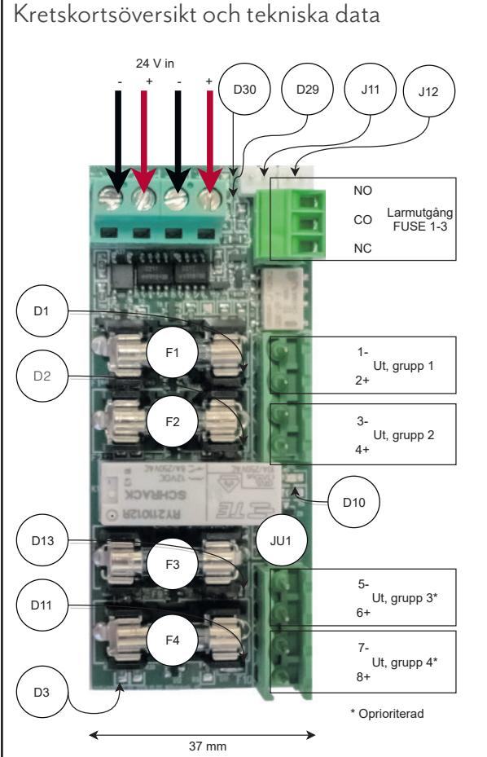
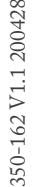

## Om kortet

2+2 Output module (2+2 Output i tabellen nedan) är en avsäkringsmodul med fem helt avsäkrade utgångar. Kortet monteras på L-vinkel (S2 adapter) innan den sätts i batteribackup. 2+2 Output module passar till: PRO 3 och NEO3-korten, upp till 10 A. Skall kortet användas för PRO1- eller PRO2-kort skall JU1 vara byglad. Styrning fungerar ej för PRO1- eller PRO2-kort. Denna manual beskriver inte inkoppling till PRO1- eller PRO2-kort.

Översikt av inkoppling och igångsättning.

- 1. Sätt fast kortet i batteribackup. Batteribackup skall vara spänningslös.
- 2. Koppla in matning (24 V) från batteribackupens lastutgång till kortets 24V-ingång.
- 3. Koppla in last.
- 4. Koppla till larm (valfritt) och styrning (valfritt).
- 5. Driftsätt batteribackup.

Vilka batteribackuper passar kortet?

2+2 Output module passar till: PRO2 V3-, PRO 3-

och NEO3-korten, upp till 10 A.

| Batteribackup med PRO3 eller NEO3 | Antal 2+2 Output module i batteribackup |
|--------------------------------------|-----------------------------------------|
| NOVA 24V 5A FLX S                    | 1 st                                    |
| NOVA 24V 10A FLX S                   | 1 st                                    |
| Med tillvalsplåt:                    |                                         |
| NOVA 24V 5A FLX M                    | 3 st                                    |
| NOVA 24V 10A FLX M 3 st              |                                         |
| NOVA 24V 15A FLX M -                 |                                         |
| NOVA 24V 25A FLX M -                 |                                         |
| Med tillvalsplåt:                    |                                         |
| NOVA 24V 5A FLX L                    | 3 st                                    |
| NOVA 24V 10A FLX L                   | 3 st                                    |
| NOVA 24V 15A FLX L                   | -                                       |
| NOVA 24V 25A FLX L                   | -                                       |

| Kortet monteras på L-vinkel (S2 adapter) innan                    |                                                |             |              |  |  |  |  |  |  |  |
|-------------------------------------------------------------------|------------------------------------------------|-------------|--------------|--|--|--|--|--|--|--|
| den sätts i batteribackup. Batteribackup skall vara i             |                                                |             |              |  |  |  |  |  |  |  |
| spänningslös. Tryck fast kortet i spåren på plåten i              |                                                |             |              |  |  |  |  |  |  |  |
| batteribackupen.                                                  |                                                |             |              |  |  |  |  |  |  |  |
|                                                                   |                                                |             |              |  |  |  |  |  |  |  |
|                                                                   |                                                |             |              |  |  |  |  |  |  |  |
|                                                                   |                                                |             |              |  |  |  |  |  |  |  |
|                                                                   |                                                |             |              |  |  |  |  |  |  |  |
| Spår finns i de flesta kapslingar.                                |                                                |             |              |  |  |  |  |  |  |  |
| 2.Inkoppling av matning från batteribackup                        |                                                |             |              |  |  |  |  |  |  |  |
|                                                                   |                                                |             |              |  |  |  |  |  |  |  |
|                                                                   | Koppla in matning (24 V) från batteribackupens |             |              |  |  |  |  |  |  |  |
| lastutgång till kortets 24V-ingång.                               |                                                |             |              |  |  |  |  |  |  |  |
|                                                                   |                                                |             |              |  |  |  |  |  |  |  |
| 3.Inkoppling av last                                              |                                                |             |              |  |  |  |  |  |  |  |
| • Maxlast är 5A per lastutgång, och kortets totala last får ej |                                                |             |              |  |  |  |  |  |  |  |
| överstiga 10 A.                                                   |                                                |             |              |  |  |  |  |  |  |  |
| Anslut lastkablage till Load 1-4 på avsäkringsmodul.              |                                                |             |              |  |  |  |  |  |  |  |
| (Kort levereras med T2A säkringar).                               |                                                |             |              |  |  |  |  |  |  |  |
|                                                                   |                                                |             |              |  |  |  |  |  |  |  |
|                                                                   |                                                |             |              |  |  |  |  |  |  |  |
| 4. Inkoppling av larm och styrning                                |                                                |             |              |  |  |  |  |  |  |  |
| Larm och styrning ansluts på J11 för PRO2 V3,                     |                                                |             |              |  |  |  |  |  |  |  |
| PRO3 och NEO3. (Larm ansluts på P1:7-9. (PRO1                     |                                                |             |              |  |  |  |  |  |  |  |
| och PRO2).) J11, J12 parallellkopplade. Pin1 styr                 |                                                |             |              |  |  |  |  |  |  |  |
| oprioriterad utgång. Pin2 går låg (0V) vid larm.                  |                                                |             |              |  |  |  |  |  |  |  |
| Se batteribackupens manual för vilket huvudkort som               |                                                |             |              |  |  |  |  |  |  |  |
| sitter i batteribackupen.                                         |                                                |             |              |  |  |  |  |  |  |  |
| Huvudkort                                                         | Avsnitt i batteri                              | Kopplas     | Tillvalskort |  |  |  |  |  |  |  |
|                                                                   | backup manual                                  |             |              |  |  |  |  |  |  |  |
| PRO2 V3                                                           |                                                |             | 2+2 Output   |  |  |  |  |  |  |  |
| J1. Larm: Ansl. larm                                              |                                                | Anslut till | J11          |  |  |  |  |  |  |  |
| från ext. säkringskort. 3.3                                       |                                                |             |              |  |  |  |  |  |  |  |
| Last: Lastutgång 1                                                | 3.2                                            | Anslut till | P2:1-2       |  |  |  |  |  |  |  |
| PRO3                                                              |                                                |             | 2+2 Output   |  |  |  |  |  |  |  |
| Larm J5                                                           | 3.3                                            | Anslut till | J11          |  |  |  |  |  |  |  |
| Last: Lastutgång 1                                                | 3.2                                            | Anslut till | P2:1-2       |  |  |  |  |  |  |  |

1.Montering

5. Driftsätt batteribackup

När kortet är inkopplat, last och larm är anslutna kan batteribackup startas, se batteribackupens manual. Kretskortsöversikt och tekniska data Vänd bladet för kretskortsöversikt och tekniska data.

| 2+2 Output module                                                                                         |                    |                                                                                                  |                                                                                                                                                                          |                                                                              |                                                 |                                                                                              | POWER SUPPLIES - MADE IN SWEDEN                 |
|-----------------------------------------------------------------------------------------------------------|--------------------|--------------------------------------------------------------------------------------------------|--------------------------------------------------------------------------------------------------------------------------------------------------------------------------|------------------------------------------------------------------------------|-------------------------------------------------|----------------------------------------------------------------------------------------------|-------------------------------------------------|
| Kretskortsöversikt och tekniska data                                                                      |                    |                                                                                                  |                                                                                                                                                                          |                                                                              | Tekniska data                                   |                                                                                              |                                                 |
|                                                                                                           |                    |                                                                                                  | Förklaring, kretskortsöversikt.                                                                                                                                          |                                                                              |                                                 | Artikelbenämning                                                                             | 2+2 Output module                               |
| 24 V in - + - + D30 D29 J11 J12 NO Larmutgång CO FUSE 1-3 NC       |                    |                                                                                                  | Inkommande 24 V. Använd valfri ingång. (För alternativ                                                                                                                   | Version                                                                      | V1.2                                            |                                                                                              |                                                 |
|                                                                                                           |                    |                                                                                                  | strömmatning vid byte av näraggregat. För att inte bryta                                                                                                                 |                                                                              | Mått                                            | 85 x 37 mm.                                                                                  |                                                 |
|                                                                                                           |                    | 24 V in                                                                                          | lastspänning.) En plint kan användas som överbygling till nästa tillvalskort, (endast om batteribackupen har plats för                                                | Ingångsmatning                                                               | 24 V                                            |                                                                                              |                                                 |
|                                                                                                           |                    | JU1                                                                                              | två kort). Byglad aktiverad alla 4 utgångar. Ej byglad: Prioriterade utgångar är aktiverade vid batteridrift. Kortet levereras utan bygel monterad från fabrik. | Antal ingångar (matning)                                                  | 2 st                                            |                                                                                              |                                                 |
|                                                                                                           |                    |                                                                                                  |                                                                                                                                                                          | Utspänning                                                                   | 24 V                                            |                                                                                              |                                                 |
|                                                                                                           |                    |                                                                                                  |                                                                                                                                                                          |                                                                              | Utgångar                                        | 4 st säkring på +, T2A                                                                       |                                                 |
|                                                                                                           |                    | J11 och J12                                                                                      | Intern koppling till huvudkort. Pin1 styr oprioriterad utgång. Pin2 går låg (0V) vid larm.                                                                            |                                                                              | Last per utgång                                 | 5A, - kortets maxlast last får ej överstigas, se nedan. Kort levereras med T2A säkringar. |                                                 |
| D1                                                                                                        |                    |                                                                                                  | D10                                                                                                                                                                      | Lyser grönt när alla utgångar är aktiverade.                                 |                                                 | Maxlast (får ej                                                                              |                                                 |
| 1- F1 Ut, grupp 1 D2 D1 2+ m 3- F2 m Ut, grupp 2 4+ D10 D13 JU1 |                    | D3                                                                                               | Lyser gult då endast prioriterade utgångar är aktiverade. Grön indikeringsdiod. Lyser med fast grönt sken vid hel                                                     |                                                                              | överstigas)                                     | 10A                                                                                          |                                                 |
|                                                                                                           |                    | D1,D2, D13,                                                                                      |                                                                                                                                                                          |                                                                              | Larm                                            | Potentialfri reläkontakt. 125 V AC / 110 V DC, 2A.                                           |                                                 |
|                                                                                                           | 85                 | D11                                                                                              | säkring. Grön indikeringsdiod - Lyser med fast grönt sken när alla säkringar är hela.                                                                              |                                                                              | Övrig information                               |                                                                                              |                                                 |
|                                                                                                           |                    | D29                                                                                              |                                                                                                                                                                          | Tillbehör                                                                    | S2 adapter: Adapter för montering av L-modul på |                                                                                              |                                                 |
|                                                                                                           |                    | D30                                                                                              | Röd indikeringsdiod - Lyser med fast rött sken när någon säkring är trasig. Lastsäkringar                                                                          |                                                                              |                                                 | DIN- skena.                                                                                  |                                                 |
|                                                                                                           |                    |                                                                                                  |                                                                                                                                                                          |                                                                              | Garantitid:                                     | 2 år                                                                                         |                                                 |
|                                                                                                           |                    | F1-F4                                                                                            |                                                                                                                                                                          |                                                                              | Tillverkningsland:                              | Sverige                                                                                      |                                                 |
| F3                                                                                                        | 5-                 |                                                                                                  | P3 1-3                                                                                                                                                                   | Larmutgång, Utlöst lastsäkring, potentialfri växling. SlutningNO, CO, NC. |                                                 | Kontakt                                                                                      | Milleteknik Ögärdesvägen 8B, 433 30 Partille |
| Ut, grupp 3* D11 6+                                                                                 |                    | Lastutgångar, (anslut last på grupp 1-4, max 5 A per grupp och max 10 A totalt för all last). |                                                                                                                                                                          |                                                                              | www.milleteknik.se 031-340 02 30             |                                                                                              |                                                 |
| F4                                                                                                        | 7- Ut, grupp 4* |                                                                                                  | Ut, grupp 1 (prioterad lastutgång)                                                                                                                                       |                                                                              | 1 -, 2+                                         |                                                                                              |                                                 |
| 8+ D3 * Oprioriterad                                                                                |                    |                                                                                                  | Ut, grupp 2 (prioterad lastutgång) 3-, 4+                                                                                                                             |                                                                              |                                                 |                                                                                              |                                                 |
|                                                                                                           |                    |                                                                                                  | Ut, grupp 3 (oprioterad lastutgång, släpper last vid larm) 5-, 6+                                                                                                     |                                                                              |                                                 |                                                                                              |                                                 |
| 37 mm                                                                                                     |                    |                                                                                                  | Ut, grupp 4 (oprioterad lastutgång, släpper last vid larm) 7-, 8+                                                                                                     |                                                                              |                                                 |                                                                                              |                                                 |
|                                                                                                           |                    |                                                                                                  |                                                                                                                                                                          |                                                                              |                                                 |                                                                                              |                                                 |
|                                                                                                           |                    |                                                                                                  |                                                                                                                                                                          |                                                                              |                                                 |                                                                                              |                                                 |
|                                                                                                           |                    |                                                                                                  |                                                                                                                                                                          |                                                                              |                                                 |                                                                                              |                                                 |
|                                                                                                           |                    |                                                                                                  |                                                                                                                                                                          |                                                                              |                                                 |                                                                                              |                                                 |
|                                                                                                           |                    |                                                                                                  |                                                                                                                                                                          |                                                                              |                                                 |                                                                                              |                                                 |
|                                                                                                           |                    |                                                                                                  |                                                                                                                                                                          |                                                                              |                                                 |                                                                                              |                                                 |
|                                                                                                           |                    |                                                                                                  |                                                                                                                                                                          |                                                                              |                                                 |                                                                                              |                                                 |
|                                                                                                           |                    |                                                                                                  |                                                                                                                                                                          |                                                                              |                                                 |                                                                                              |                                                 |
|                                                                                                           |                    |                                                                                                  |                                                                                                                                                                          |                                                                              |                                                 |                                                                                              |                                                 |

Vänd