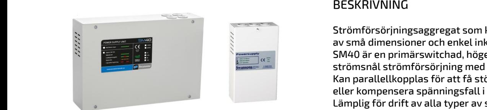
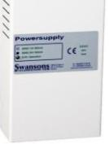
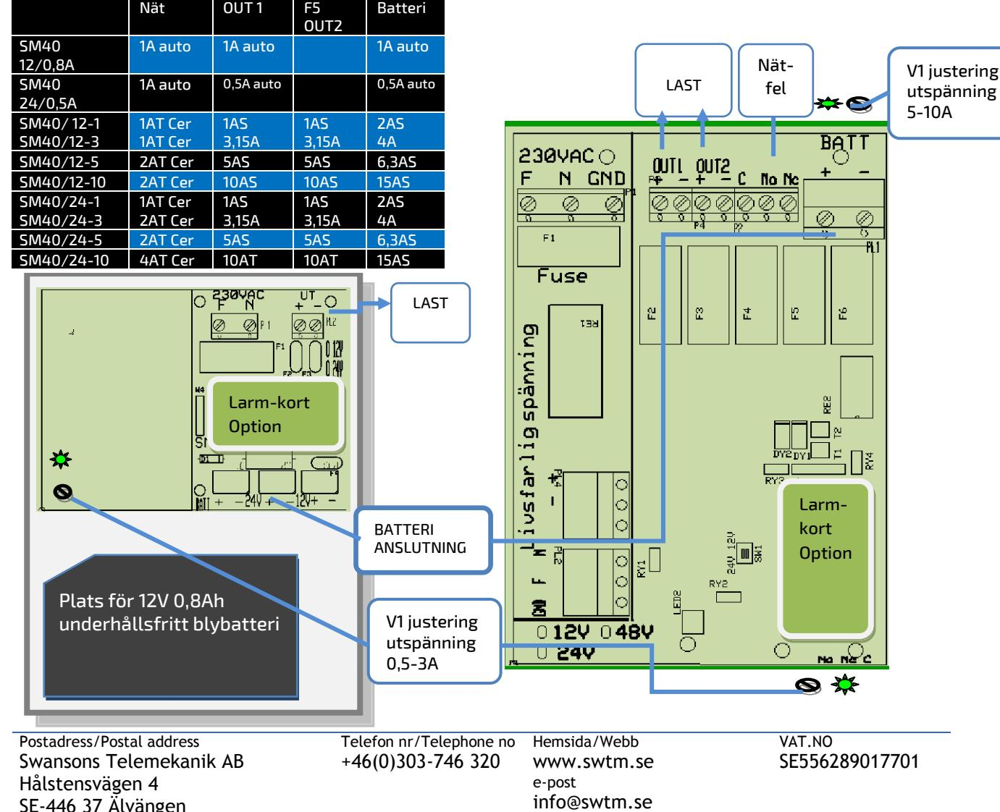
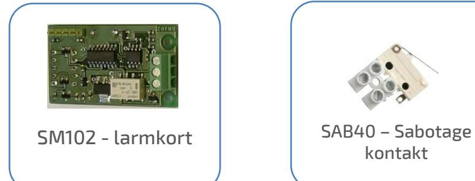
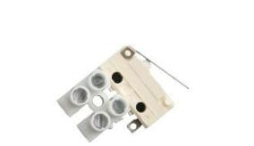
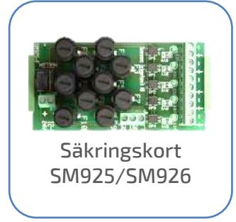
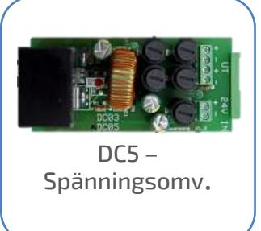
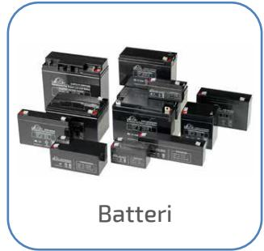

SM40 1-3A SM40 0,5/0,8A

Skydd: Aggregatet är skyddad mot

överbelastning och kortslutning. Inbyggt skydd mot djupurladdning av batterierna. Nät, last och batteri skyddas av säkringar.

Indikeringar och larm: Nätspänning indikeras med grön lysdiod på fronten. Alla typer är, utom 0,5/0,8A, är försedda med larmrelä för nätavbrott.

SM40 0,5/0,8A har en 2 pol avsäkrad utgång (polyswitch)

SM40 1-10A har 2st 2 pol avsäkrade utgångar glasrörssäkring

# EXTRAUTRUSTNING

Larmkort : Kan förses med larmkort SM101/102. Säkringskort SPM900: Ger 5st 1-poligt avsäkrade utgångar med indikering och summalarmsrelä

DC/DC omv. DC5: Ger 2st utgångar med 12VDC 5A. Passar i 24V 5A och i 24V 10A.

Sabotageskydd: Sabotagekontakt monteras i förborrade hål.

# BESKRIVNING

Strömförsörjningsaggregat som kännetecknas av små dimensioner och enkel inkoppling. SM40 är en primärswitchad, högeffektiv och strömsnål strömförsörjning med lång livslängd. Kan parallellkopplas för att få större uteffekt eller kompensera spänningsfall i kablar. Lämplig för drift av alla typer av svagströmsanläggningar, larm, brand och passagesystem, där man vill ha ett miljöanpassat system.

Utförande: Aggregatet är utfört i kiselgrå självventilerad plåtkapsling och avsett för väggmontage.

Det finns 4st genomförningar uppåt och en genomförning från baksidan. Plats finns för max 2st 12V 0,8Ah underhållsfria blybatterier i 0,8/0,5A enheten, max 2st 12V 9Ah i 1/3A enheten, max 2st 12V 20Ah 5/10A aggregatet. SM40-45 har plats för upp till 2x45Ah batterier

# TEKNISKA DATA

| Inspänning       | 230VAC +/- 15% |  |  |
|------------------|----------------|--|--|
|                  | 1 fas 50-60Hz  |  |  |
| Reglering        | max 0,6 %      |  |  |
| Rippelspänn.     | max 0,1 % av   |  |  |
|                  | Utspänningen   |  |  |
| Egenförbrukning  |                |  |  |
| vid batteridrift | 20mA           |  |  |
| Temp. omr.       | -15 – 40 C     |  |  |
|                  |                |  |  |

### CE-märkt - EN61000-6-3:2001, EN61000-6-2:2005

| E: nummer | Modell          | Utspänning            | Utström          | Batteriplats    | Verkningsgrad | HxBxD           |
|-----------|-----------------|-----------------------|------------------|-----------------|---------------|-----------------|
| 52 570 38 | SM40 / 12-0,8   | 13,6VDC               | 0,8A             | 2 x 0,8Ah       | 0,83          | 200 x 110 x 60  |
| 52 570 40 | SM40 / 12-1     | 13,6VDC               | 1A               | 2 x 9Ah         | 0,81          | 210 x 310 x 80  |
| 52 570 41 | SM40 / 12-3     | 13,6VDC               | 3A               | 2 x 9Ah         | 0,87          | 210 x 310 x 80  |
| 52 570 42 | SM40 / 12-5     | 13,6VDC               | 6,5A             | 2 x 20Ah        | 0,86          | 300 x 360 x 110 |
| 52 570 44 | SM40 / 12-10    | 13,6VDC               | 13A              | 2 x 20Ah        | 0,86          | 300 x 360 x 110 |
| 52 570 39 | SM40 / 24-0,5   | 27,3VDC               | 0,5A             | 2 x 0,8Ah       | 0,83          | 200 x 110 x 60  |
| 52 570 45 | SM40 / 24-1     | 27,3VDC               | 1A               | 2 x 9Ah         | 0,84          | 210 x 310 x 80  |
| 52 570 46 | SM40 / 24-3     | 27,3VDC               | 3A               | 2 x 9Ah         | 0,87          | 210 x 310 x 80  |
| 52 570 47 | SM40 / 24-5     | 27,3VDC               | 6A               | 2 x 20Ah        | 0,84          | 300 x 360 x 110 |
| 52 570 48 | SM40 / 24-10    | 27,3VDC               | 13A              | 2 x 20Ah        | 0,88          | 300 x 360 x 110 |
| 52 570 30 | SM40 / 24-5-45  | 27,3VDC               | 6A               | 2 x 45Ah        | 0,84          | 320 x 420 x 180 |
| 52 570 31 | SM40 / 24-10-45 | 27,3VDC               | 13A              | 2 x 45Ah        | 0,88          | 320 x 420 x 180 |
| 52 570 99 | SM40 / 24-0,5 B | 27,3VDC               | 0,5A             | Inkl. 2 x 0,8Ah | 0,83          | 200 x 110 x 60  |
| 52 570 49 | SM40 / 48-5     | 54,6VDC               | 5A               | 4 x 9Ah         | 0,84          | 300 x 360 x 110 |
| 52 569 91 | Sab.40          | Sabotagekontakt       |                  |                 |               |                 |
| 52 569 93 | SM102           | Larmkort. låg batt sp | Laddspänningsfel | Batterikretsfel |               |                 |

Postadress/Postal address Swansons Telemekanik AB Hålstensvägen 4 SE-446 37 Älvängen

Telefon nr/Telephone no +46(0)303-746 320

Hemsida/Webb www.swtm.se e-post info@swtm.se

VAT.NO SE556289017701

# SM40 0,5-10A STRÖMFÖRSÖRJNING MED PLATS FÖR BATTERIER

### SÄKERHET

Endast auktoriserad och erfaren personal inom AC och DC får använda, arbeta, serva/underhålla, installera denna enhet.  **SM40** 

Endast isolerade verktyg får användas i enheten. Observera att farliga spänningar och strömmar förekommer i apparaten både när interna säkringarna är av eller på.  **Strömförsörjning med plats för batteri**

> Denna instruktion skall läsas igenom grundligt och förstås av all handhavande personal. Vid minsta tveksamhet om systemets uppbyggnad, funktion, komponenter samt säkerhet skall leverantören kontaktas.

Kontrollera att kretskort sitter fast och inte är transportskadade.

Om batterier används är dessa alltid elektrokemiskt aktiva.

> Säkring F2- F3

Säkrin g F4Säkring F6

Kortslut inte batteripolerna.

F1

Modell Säkring

### INKOPPLING

- Montera aggregatet fritt. Minst 100mm på varje sida.
- Anslut först 230V AC.
- Lysdiod för nätspänning tänds.
- Kontrollera att utspänningen är riktig.
- Spänningen är justerad vid leverans. Ev.justering görs direkt på likriktarmodulen.
- Om lysdiod för nätindikering ej tänds kontrollera inspänning och säkringarna.
- Anslut batterierna och därefter lasten.
- Löser utgångssäkringarna, kontrollera inkoppling och inkopplade apparater.

### TEKNISKA DATA

Inspänning 230VAC +/- 15%

Temp.omr- -15 – 40 C

1 fas 50-60Hz Utspänning 12V 13,7VDC +/- 0,05V Utspänning 24V 27,3VDC +/- 0,1V

SE-446 37 Älvängen

## Optional Accessories  **Strömförsörjning med plats för batteri**

 **SM40** 

kontakt

Postadress/Postal address Swansons Telemekanik AB Hålstensvägen 4 SE-446 37 Älvängen

Telefon nr/Telephone no +46(0)303-746 320 Hemsida/Webb e-post

www.swtm.se info@swtm.se

VAT.NO SE556289017701