## NOVA FLX L PRO2 V3

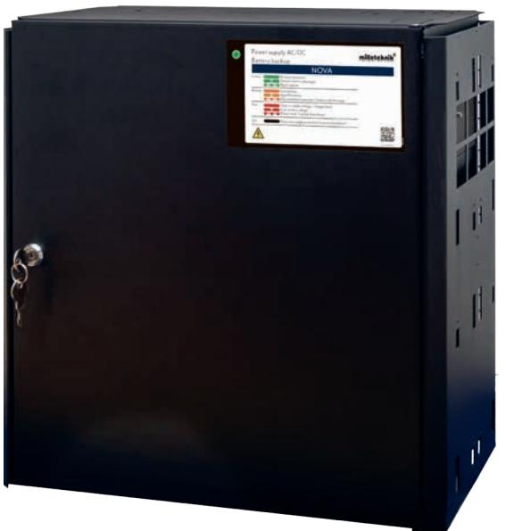

## NOVA 24V 15A FLX L NOVA 24V 25A FLX L

## Om NOVA FLX L PRO2 V3

FLX L PRO2 består av två olika batteribackuper; 15 A och 25 A med plats för 2 st 45 Ah batterier internt i enheten. Vid behov av större batterier skjuts en batteribox (med plats för upp till 2x45h batterier) in underifrån och kopplas ihop med ett kablage mellan enheterna. FLX L systemet är testat och godkänt för upp till 4 batteriboxar (totalt upp 225 Ah). IP-Klass 32.

Strömförsörjningen/lasten kan drivas från inbyggt nätaggregat eller batterier. Alla ingående funktioner övervakas och larm ges vid fel. Lättavläst frontpanel. Strömförsörjningen tillhandahåller en (1) 230 V AC nätspänningsingång, två (2) 24 V DC lastutgångar samt en (1) batterikrets. Larm kan ges på antingen växlande reläkontakter via reläkort eller via RS-485 / RS-232. Flexibelt och utbyggbart för längre reservdrifttid.

### Användningsområde

För passersystem, inbrottslarms- och brandlarmssystem där högsta driftsäkerhet för reservkraft krävs. Flexibelt och utbyggbart för högre strömuttag och batterikapacitet.

Revisioner och om detta dokument

För fullständig revisionslogg se: NOVA FLX L, PRO1, PRO2, PRO2 V3, PRO3 Revisionslogg.

Gällande och senast publicerad utgåva av detta dokument finns på www.milleteknik.se eller kan rekvireras via e-post, info@milleteknik.se (ange

enhetens namn och serienummer). Detta dokuments giltighet kan inte garanteras, då ny utgåva publiceras utan föregående meddelande.

Denna anvisning beskriver installation och driftsättning av NOVA i FLX L kapsling med huvudkortet PRO2 V3.

## Innehåll

| Om NOVA FLX L PRO2 V3                                                        | 2  |
|------------------------------------------------------------------------------|----|
| Användningsområde                                                            | 2  |
| Garanti och support                                                          | 4  |
| Om certifikat, testning och godkännande                                      | 6  |
| Variantöversikt: NOVA FLX S, FLX M och FLX L                                 | 7  |
| Krav för certifierade enheter                                                | 7  |
| Komponentöversikt                                                            | 8  |
| 1. Montering på vägg                                                         | 9  |
| Montering i 19" rack                                                         | 10 |
| 2. Inkoppling av batterier                                                   | 11 |
| 3. Batterisäkring                                                            | 11 |
| Beskrivning huvudkort PRO2 V3                                                | 12 |
| 4 Anslut kommunikation                                                       | 13 |
| 4.1 Kommunikation till överordnat system                                     | 13 |
| 4.1.1 Flera enheter till ett överordnat system                               | 13 |
| 4.2 Larm via busskommunikation                                               | 13 |
| 4.2.1 Reläkort - beskrivning och anslutningar                                | 13 |
| 4.3 Andra anslutningar                                                       | 14 |
| 4.4 Återställning av data efter batteribyte (J13)                            | 15 |
| 5 Anslut last                                                                | 15 |
| Notering om test av batterier                                                | 15 |
| Notering vid uppstart med kortslutna batterier                               | 15 |
| 6 Anslutningar via tillvalskort                                              | 15 |
| 7 Anslutning elnät                                                           | 16 |
| Bilaga: Flera enheter till en larmcentral                                    | 17 |
| 8 Driftsättning / Test                                                       | 18 |
| Hur enheten skall startas                                                    | 18 |
| Systemtest                                                                   | 18 |
| Återställning                                                                | 18 |
| Larm som visas på skåplucka                                                  | 19 |
| Extra batteribox                                                             | 20 |
| Inkoppling batteribox med FLX L batteribackup                                | 21 |
| Placering av batterier i FLX L batteribackup och FLX M batteribox            | 22 |
| Inkopplingsschema och gul bygel                                              | 23 |
| Underhåll                                                                    | 24 |
| Batterier                                                                    | 24 |
| Batteribyte                                                                  | 25 |
| Batteriåtervinning                                                           | 25 |
| Justering av sabotagekontakt                                                 | 26 |
| Sabotagekontakt vid extra batteribox                                         | 26 |
| Tekniska data                                                                | 27 |
| Tekniska data, kapsling: FLX L                                               | 33 |
| Strömuttag samt ur- och uppladdningsström per produkt FLX S, FLX M och FLX L | 34 |
| Reservdrifttider vid olika larmklasser*                                      | 36 |
| Reservdrifttider                                                             | 37 |

Data och konstruktion kan ändras utan föregående meddelande. 3

## Garanti och support

Produkten har fem års garanti, från inköpsdatum (om inget annat avtalats). Kostnadsfri support under garantitiden nås på support@ milleteknik.se eller telefon, 031-34 00 230. Ersättning för res- och eller arbetstid i samband med lokalisering av fel, installerande av reparerad eller utbytt vara ingår ej i garantin. Kontakta Milleteknik för mer information.

Milleteknik ger support under produktens livslängd, dock som längst 10 år efter inköpsdatum. Byte till likvärdig produkt kan förekomma om Milleteknik bedömer att reparation inte är möjlig. Kostnader för support tillkommer efter det att garantitiden har gått ut. Produktens livslängd, miljöpåverkan och återvinning Produkten är designad och konstruerad för lång livslängd vilket minskar miljöpåverkan. Produktens livslängd är beroende av, bland annat miljöfaktorer, främst omgivningstemperatur, oförutsedd belastning på komponenter så som blixtnedslag, yttre åverkan, handhavandefel, med flera.

Produkter återvinns genom att lämnas till närmaste återvinningsstation eller sändas åter till tillverkare. Kontakta din distributör för mer information. Kostnader som uppkommer i samband med återvinning ersätts ej.

Batterier skall alltid återvinnas och lämnas till återvinningsstation.

- *• Läs detta först!*
- *• 100 mm fritt utrymme skall lämnas kring bägge ventilationsgaller.*
- *• Systemet är avsett för bruk i kontrollerad inomhusmiljö.*
- *• Endast personer med behörighet bör installera och underhålla systemet.*
- *• Det är installatörens ansvar att systemet är lämpad för avsett bruk.*

*• Dokument som medföljer systemet skall förvaras i det eller i dess omedelbara närhet.* 

- *• Ventilation skall ej övertäckas.*
- *• Nätspänning bör vara bortkopplad under installation.*
- *• Alla uppgifter med reservation för ändringar.*

*• Vid installation av denna produkt erkänner och accepterar installatören denna produkts begränsningar som de är beskrivna i denna manual.*

- *• Viktigt om glasrörssäkringar på lastutgång*
*• På kretskortets lastutgångar sitter glasrörssäkringar, dessa har en utlösningstid på ca 150 ms. I det fall en glasrörssäkring löser ut på EN lastutgång faller spänningen på ALLA lastutgångar till 0 V under 150 ms.* 

*• Installatören ansvarar för att det finns en energibuffert på minst 150 ms i system som batteribackupen förser med ström eller acceptera ett strömavbrott på 150 ms.* 

Data och konstruktion kan ändras utan föregående meddelande. 5

## Om certifikat, testning och godkännande

Enheten är testad, certifierad och godkänd för att uppfylla skydd- och säkerhetsstandarder enligt:

Regelverk: SSF 1014, utgåva 5 Klass (upp till): Larmklass 4 (med option vibrationsdetektorer).

Regelverksnamn: Norm för Materiel - inbrottslarmanläggning Krav och provning.

SSF1014, Larmklass 1-4, (Inbrottslarm och Integrerade säkerhetssystem) är en svensk säkerhetsnorm och ett krav enligt svensk lagstiftning vid inbrottslarmsanläggningar. Batteribackupers certifierat är giltigt vid certifiering tillsammans med överordnat system. För larmklass 4 krävs att enheten är installerad i ett låst och larmat utrymme. När enheten är kopplat till ett överordnat system via reläkort kan inte systemet aldrig nå mer än larmklass 2.

*• Enheten är testad med en lastutgång.*

De första 72-timmarna efter driftsättning utför enheten inte något test av batterikapacitet. Testet skjuts upp för att enheten inte skall larma felaktigt innan batterier är fulladdade. Enheten skall alltid startas med nya batterier vid driftsättning eller batteribyte och det är inte troligt att nya batterier är felaktiga.

EMC Directive 2004/108/EC.

Certifiering och tester är utförda av RiSE (tidigare SP, Sveriges Provnings- och Forskningsinstitut / Statens Provningsanstalt).

Produkten uppfyller även: SS-EN 62368-1. Europeisk elsäkerhetsnorm. Low Voltage Directive 2006/95/EC. CE-marking Directive 93/68/EEC.

### Variantöversikt: NOVA FLX S, FLX M och FLX L

| Produktnamn        | Certifierat namn  | Kretskort | Kretskort | Kretskort | Kretskort |
|--------------------|-------------------|-----------|-----------|-----------|-----------|
|                    |                   | PRO1      | PRO2      | PRO2 V3   | PRO3      |
| NOVA 24V 5A FLX S  | NOVA 27 50-FLX S  | X         | X         | -         | X         |
| NOVA 24V 10A FLX S | NOVA 27 100-FLX S | X         | X         | -         | X         |
|                    |                   |           |           |           |           |
| NOVA 24V 5A FLX M  | NOVA 27 50-FLX-M  | X         | X         | -         | X         |
| NOVA 24V 10A FLX M | NOVA 27 100-FLX-M | X         | X         | -         | X         |
| NOVA 24V 15A FLX M | NOVA 27 150-FLX-M | X         | X         | X         | -         |
| NOVA 24V 25A FLX M | NOVA 27 250-FLX-M | X         | X         | X         | -         |
|                    |                   |           |           |           |           |
| NOVA 24V 5A FLX L  | NOVA 27 50-FLX-L  | X         | X         | -         | X         |
| NOVA 24V 10A FLX L | NOVA 27 100-FLX-L | X         | X         | -         | X         |
| NOVA 24V 15A FLX L | NOVA 27 150-FLX-L | X         | X         | X         | -         |
| NOVA 24V 25A FLX L | NOVA 27 250-FLX-L | X         | X         | X         | -         |

#### Krav för certifierade enheter

Systemet är testat och certiferad med följade batterier: UPLUS 10+ Design Life. Se tekniska data.

Data och konstruktion kan ändras utan föregående meddelande. 7

## Komponentöversikt

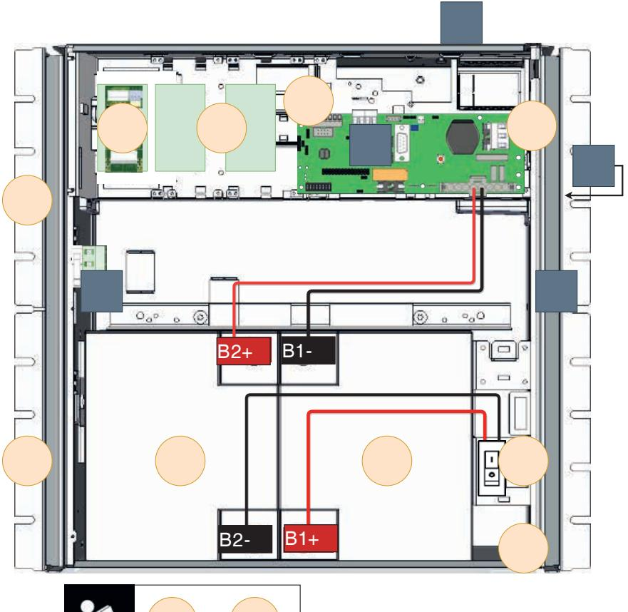

| Nummer | Förklaring                          | Bokstav                                                                               | Förklaring          |
|--------|-------------------------------------|---------------------------------------------------------------------------------------|---------------------|
| 1      | Konsol för montering                | A                                                                                     | Kabelgenomföring    |
| 2      | Montera och koppla in batterier     | B                                                                                     | Nätaggregat         |
| 2.1    | Inkoppling av batteribox (tillval)  | C                                                                                     | Dörr, plåtkapsling. |
| 3      | Anslut batterisäkring.              | D                                                                                     | Sabotagekontakt*    |
| 4      | Anslut kommunikation / externt larm | E                                                                                     | Fläkt               |
| 5      | Anslut last.                        | Sabotagekontakt. Här visas en av två placeringar.                                     |                     |
| 6      | Anslut tillvalskort.                | Sabotagekontakt måste sitta monterad i vägg för att uppfylla larmklass enligt SSF. |                     |
| 7      | Anslut elnät                        |                                                                                       |                     |

## 1. Montering på vägg

Enheten kan monteras i 19" rack eller på vägg. Medföljande konsoler kan fästas på två sätt. Vid montering på vägg skall konsolernas vändas så att skruvhål sitter bakåt, mot vägg. Se bilden nedan.

- 1. Börja med att montera den konsol som skall sitta överst på skåpet. Skjut in konsolen nedifrån och upp.
- 2. Montera sedan den konsol som skall sitta underst på skåpet och skjut den sedan upp.

100 mm fritt utrymme bör lämnas på sidorna för bästa ventilation, täck inte sidorna vid luftgaller.

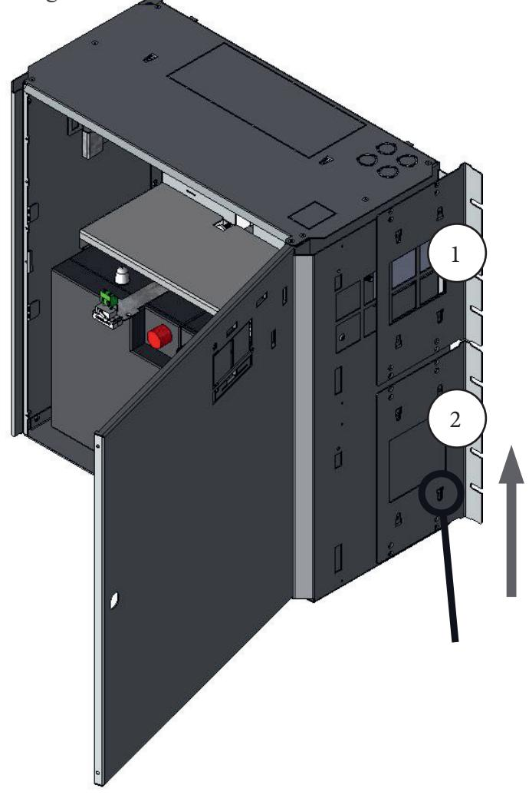

### Montering i 19" rack

Enheten kan monteras i 19" rack eller på vägg. Medföljande konsoler kan fästas på två sätt. Vid montering i 19" rack skall konsoler vändas så att skruvhål sitter mot framsidan på enheten. Se bilden nedan.

- 1. Börja med att montera den konsol som skall sitta överst på skåpet. Skjut in konsolen nedifrån och upp.
- 2. Montera sedan den konsol som skall sitta underst på skåpet och skjut den sedan upp.

100 mm fritt utrymme bör lämnas på sidorna för bästa ventilation, täck inte sidorna vid luftgaller.

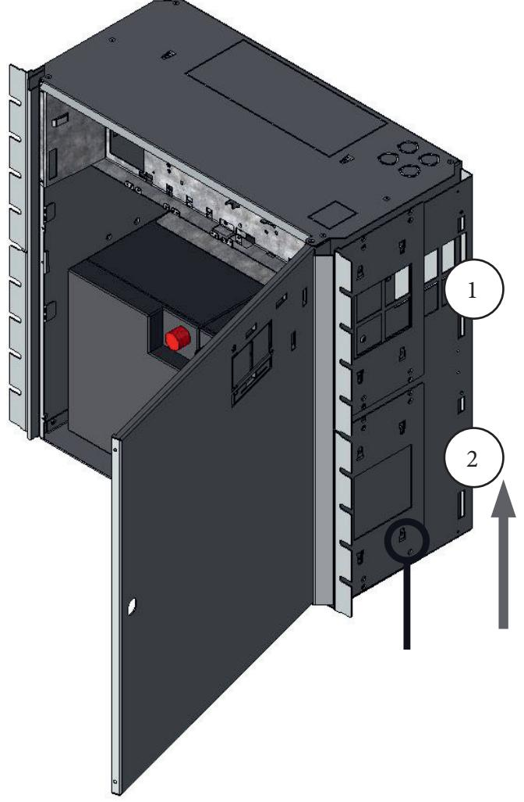

## 2. Inkoppling av batterier

Batterikablage är monterat på kretskortet vid leverans.

*• OBS! Batterier måste vara nya vid installation och batteribyte. Sätt i batteri närmast dörren först.*

- 1. Placera batterierna i skåpet med batteripolerna mot varandra, mot mitten av skåpet, se komponentöversikt.
- 2. Anslut batterikablaget i batterier.

## 3. Batterisäkring

B1 "2ster baterku

Batterikablage till batterisäkring sitter monterat från fabrik. Slå till batterisäkring efter installation av övriga anslutningar.

- *• Bryt, om möjligt, nätspänning vid batteribyte.*
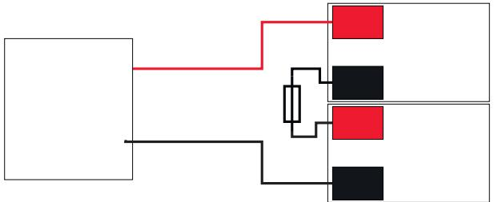

Seriekoppling, batterier: 24 V

24 V+ Baterbku

Kretsko

24 V+ Baterbku

24 V-Baterbku

24 V-Baterbku

B B

B B

B B

B1 B1 

B4

B4

B -6ster baterox 1

B16

B1

B12

B1

B1

B

B 

B1

B14

B14

B1

B1

B1-

B1-

B2

B2

B6

B6

B1

B1

Dubel kabso från ketsor +

Dubel kabso från ketsor +

Dubel kabso från ketsor -

Dubel kabso från ketsor -

Kabelsko från B

Kabelsko från B

Kabelsko från B

Kabelsko från B

B1 Text

B1 Text

B2

B2

Data och konstruktion kan ändras utan föregående meddelande. 11

### Beskrivning huvudkort PRO2 V3

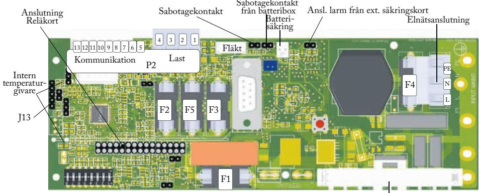

J22=Extern indikeringsdiod D4=Grön indikeringsdiod D22= Röd indikeringsdiod

Anslutning: Batteri och nätaggregat

| P2     | Externa anslutning       | F   | Säkringar                                                                                                                                                       |
|--------|--------------------------|-----|-----------------------------------------------------------------------------------------------------------------------------------------------------------------|
| P2:1-4 | Används ej.              | F1  | Säkring nätaggregat (T16A)                                                                                                                                      |
|        |                          | F2  | Används ej.                                                                                                                                                     |
|        |                          | F3  | Används ej.                                                                                                                                                     |
|        |                          | F4  | Säkring elnät (T4A).                                                                                                                                            |
| P2: 5  | -                        | F5  | Säkring, lastutgång 1 - (minus) (T16A)                                                                                                                          |
| P2: 6  | -                        |     | Elnätsanslutning:                                                                                                                                               |
| P2: 7  | RS-485 Anslutning, -.*** |     | Line/Neutral/Skyddsjord (PE).                                                                                                                                   |
| P2: 8  | RS-485 Anslutning, +.*** | J13 | Se 3.5                                                                                                                                                          |
| P2: 9  | System-minus (-).***     |     |                                                                                                                                                                 |
| P2:10  | System-minus (-).***     | *   | *Last ansluts på säkringskort, se 5.                                                                                                                            |
| P2: 11 | RXD***                   | **  | **Tillvalskort strömmatas från lastutgång 1 och 2 på tillvalskort.                                                                                           |
| P2: 12 | TXD***                   | *** | ***Det är möjligt att ansluta kommunikation till extern larmcentral via anslutningar på P2. Se larmcentralens dokumentation för kompatibelt protokoll. |
| P2: 13 | + 5 V***                 |     |                                                                                                                                                                 |

## 4 Anslut kommunikation

J22=Extern indikeringsdio d D4=Grön indikeringsdio d D22= Röd indikeringsdio d Kommunikation ansluts på plint 7-13. Larm via Busskommunikation och via LED på skåpets framsida. Se larmcentralens dokumentation för kompatibelt protokoll.

#### 4.1 Kommunikation till överordnat system

Det är möjligt att ansluta kommunikation till överordnat system via anslutningar på P2. Se larmcentralens dokumentation för kompatibelt protokoll. För mer information om larm; se tekniska data.

•

### 4.1.1 Flera enheter till ett överordnat system

F1

För att ansluta flera enheter till överordnat system skall last-minus, (på säkringskort), kopplas samman.

#### 4.2 Larm via busskommunikation

Se tekniska data för PRO2 V3.

### 4.2.1 Reläkort - beskrivning och anslutningar

F4 Anslutning: Batteri och nätaggregatLarmutgångar: Alla fellarmsreläer skall vara i draget tillstånd. Kontrollera att slutning finns mellan CO och NC. Sätt mätinstrumentet på kontinuitetsmätning och testa slutning. Denna skall då indikera kortslutning.

LNPE Alla reläutgångar är normalt spänningssatta och ger larm vid

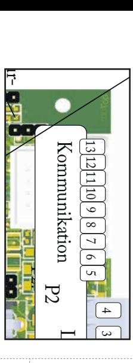

Intern

givare

|        | S ab L 3                                                                                                                                                                                                                                                                                              |  |  |
|--------|----------------------------------------------------------------------------------------------------------------------------------------------------------------------------------------------------------------------------------------------------------------------------------------------------------------|--|--|
|        | ot as 2 t                                                                                                                                                                                                                                                                                             |  |  |
| P2: 7  | ag RS-485 Anslutning, A / -. **                                                                                                                                                                                                                                                                             |  |  |
| P2: 8  | ek 1 RS-485 Anslutning. B / +.** o                                                                                                                                                                                                                                                                    |  |  |
| P2: 9  | n System-minus (-).** ta                                                                                                                                                                                                                                                                                 |  |  |
| P2: 10 | kt System-minus (-).** F                                                                                                                                                                                                                                                                                 |  |  |
| P2: 11 | lä TTL RX**                                                                                                                                                                                                                                                                                                 |  |  |
| P2: 12 | kt S TTL TX** fr ab                                                                                                                                                                                                                                                                                |  |  |
| P2: 13 | ån ot + 5 V** b                                                                                                                                                                                                                                                                                       |  |  |
|        | ag **Det är möjligt att ansluta at B ek sä kommunikation till extern te at kr on ri larmcentral via anslutningar te in b ta ri på P2. Se larmcentralens ox g kt  dokumentation för kompatibelt protokoll. A n sl . l ar |  |  |
|        | m                                                                                                                                                                                                                                                                                                              |  |  |

F3

F5

F2

J13

Anslutning

Reläkort

från

ext. säkringskort

Elnätsanslutning

spänningslöst läge. Vid anslutning till kommunikation skickar det yttre och överordnade systemet frågor och får tillbaka larm om relä ej används.

| Relä (Plint nr) | Relä är normalt spänningssatt. | Förklaring                                                                                                                              |
|--------------------|-----------------------------------|-----------------------------------------------------------------------------------------------------------------------------------------|
| 1 (10-12)          | NO, COM, NC                       | Nätavbrottslarm.                                                                                                                        |
| 2 (7-9)            | NO, COM, NC                       | Larm för: Frånkopplat batteri, låg batterispänning, åldrat batteri, djupurladdning, utlöst lastsäkring, överspänning, underspänning. |
| 3 (4-6)            | NO, COM, NC                       | Larm för: Låg systemspänning.                                                                                                           |
| 4 (1-3)            | NO, COM, NC                       | Sabotagelarm, (tillval för EN54).                                                                                                       |
| P4 (1-3)           |                                   | RS-323 anslutning                                                                                                                       |
| J11                | -                                 | Anslutning till huvudkort (TEQ-COM PRO 2 V3).                                                                                           |
| D7                 | -                                 | LED blinkar grönt vid normaldrift.                                                                                                      |

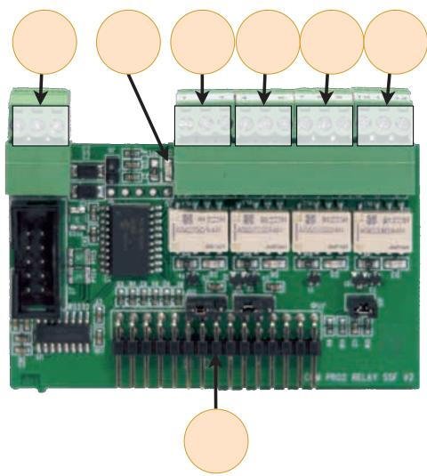

#### 4.3 Andra anslutningar

På raden med stiftlister kopplas:

12 11 10 9 8765

13

- Sabotagekontakt från enheten.
- Sabotagekontakt från batteribox.

F2 F5 F3

- Anslutning av larm från extern säkringskort.
F1

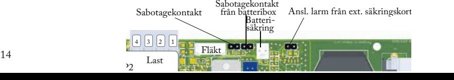

F4

Anslutning: Batteri och nätaggregat

PE N L

J13

Intern temperatur- givare

Anslutning Reläkort

J22=Extern indikeringsdiod D4=Grön indikeringsdiod D22= Röd indikeringsdiod

### 4.4 Återställning av data efter batteribyte (J13)

För att systemet skall mäta in nya batteriers kapacitet behöver enheten rensa tidigare batterikapacitet. Anslutning Reläkort

- Sätt dit och tag bort jumper på J13.
## 5 Anslut last

Last ansluts på +UT1- eller +UT2- på säkringskort uppe till vänster i enheten, se komponentöversikt.

Maxström får ej överskridas. Se märkskylt på enhet.

#### Notering om test av batterier

Vid uppstart tar det 72 timmar innan systemet utför tester av batterier. Detta för att säkerställa fulladdade batterier samt för insamling av medelvärden/historik under minst 72 timmar. Därefter görs, ett kvalificerat kapacitetstest av batterierna varje vecka.

#### Notering vid uppstart med kortslutna batterier

*• Peakström vid uppstart med kortslutna batterier: Upp till 30 A p-p under 200 ms. Följ alltid uppstartsproceduren, se 8.*

## 6 Anslutningar via tillvalskort

Skall tillval monteras, som extra säkringskort, se dess manual. Sitter kort monterat från fabrik, se dess medföljande dokumentation.

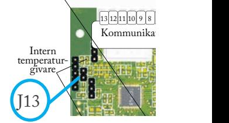

P2:

P2

4 123

F2 F5 F3

F1

Fläkt

Batterisäkring Sabotagekontakt Ansl. larm från ext. säkringskort

Sabotagekontakt från batteribox

F4

Anslutning: Batteri och nätaggregat

PE N L

Elnätsanslutning

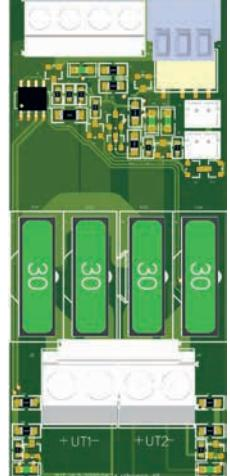

Data och konstruktion kan ändras utan föregående meddelande. 15

# 7 Anslutning elnät

Elnät (kablage): Anslut elnätskablage genom kabel-genomföringen på skåpets ovansida.

Använd medföljande plint för att montera elnätskablar.

F=Fas / Line. N=Noll / Neutral. PE= Skyddsjord, Protected Earth.

Anslut plint på kretskortet, (INPUT MAINS).

F4 är säkring för elnät (T4A). Kablage för elnätsanslutning SKALL MINST vara av kabelarea 1,5 mm2 och klassad för 250 V AC.

Maximal kabelarea är 4 mm2 .

Elnätskablage skall hållas separerat från batteri- och lastkablage. För att inte riskera störningar, (EMC). Elnätskabel skall sitta fast med buntband.

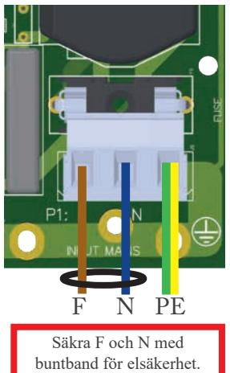

### Bilaga: Flera enheter till en larmcentral

För att ansluta flera enheter till en larmcentral skall lastminus på lastutgång kopplas samman.

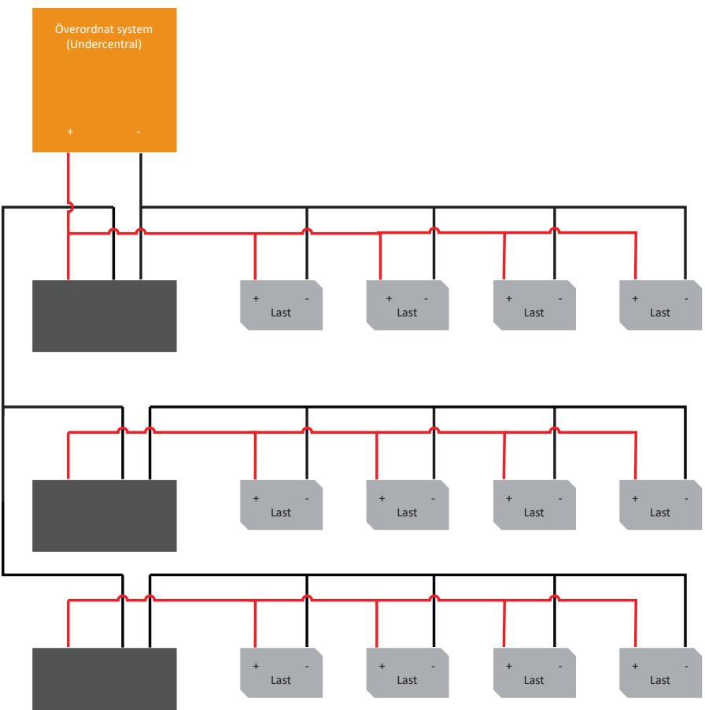

Data och konstruktion kan ändras utan föregående meddelande. 17

## 8 Driftsättning / Test Hur enheten skall startas

Efter inkoppling skall uppstart ske i följande steg:

- Inkoppling/spänningssättning av batteridel.
- Spänningssättning av elnät.

Enheten fungerar normalt då indikeringsdiod på skåpluckans utsida lyser med fast grönt sken. Se frontpanel för övriga statusindikationer.

### Systemtest

- Slå till inkommande nätspänning.
- Indikeringsdiod på skåpluckans utsida lyser med fast grönt sken. Bryt nätspänning för att kontrollera att enheten fungerar i batteridrift och larmar.
- Indikeringsdiod på skåpluckan blinkar grönt. För larmtyp, se panel.
- Slå till inkommande nätspänning. Indikeringsdiod, på skåpluckans utsida lyser med fast grönt sken. Normaldrift.

### Återställning

Återställ enheten genom att göra enheten helt spänningslös. Koppla bort batterikablage samt nätspänning och återanslut efter 5 sekunder.

Frågor? Se baksidan för kontakt till support.

## Larm som visas på skåplucka

I normalläge visar indikeringsdioden ett fast grönt sken.

| Fast grönt sken.      | Normal drift.                                         |  |
|-----------------------|-------------------------------------------------------|--|
| Långsamt grönt blink. | Sabotagelarm.                                         |  |
| Snabbt grönt blink.   | Nätavbrottslarm.                                      |  |
| Fast gult sken        | Låg batterispänning.                                  |  |
| Långsamt gult blink   | Åldrade batterier.                                    |  |
| Snabbt gula blink     | Bortkopplade batterier / batterikortslutning.         |  |
| Fast rött sken        | Över- underspänning / laddarfel.                      |  |
| Långsamt rött blink   | Låg systemspänning.                                   |  |
| Snabbt rött blink     | Lastsäkring har löst ut / batterisäkring har löst ut. |  |
| Släckt/svart          | Djupurladdningsskydd är aktiverat.                    |  |
|                       |                                                       |  |

Vid driftsatt system: Är indikeringsdioden släckt har djupurladdningsskydd trätt i kraft.

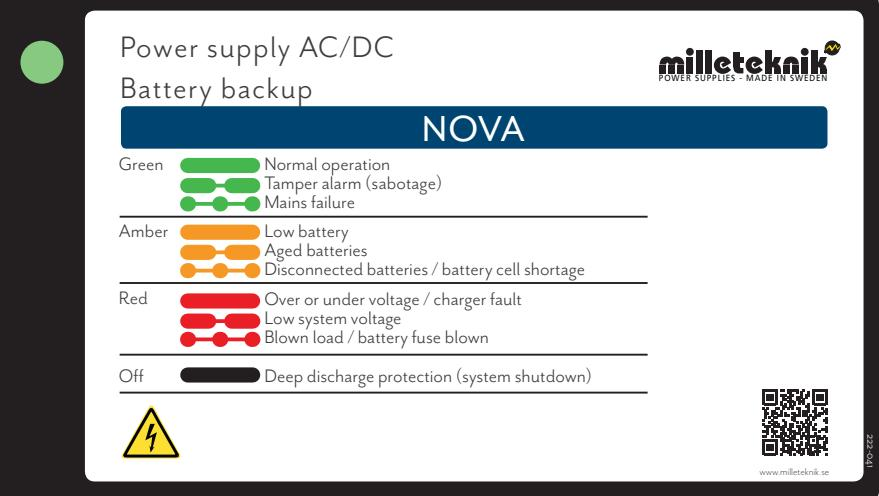

## Extra batteribox

Montering av batteribox. Vad som skall göras i batteribackup Det är möjligt att koppla till extra batteriboxar till batteribackup för utökad reservdrifttid.

Kabelgenomföring/knock-out finns på batteribackupens undersida och skall brytas loss innan montering.

Använd kablage som följer med batteriboxen för att möta kablage från batteribackup. Skall sabotagekontakt även sitta i batteribox? Se avsnitt "Sabotagekontakt vid extra batteribox."

Se bild A, nedan, för hur kablar skall mötas mellan skåpen.

Klipp gul bygel i kontakt från batteribackup, se nästa sida.

Enheten skall vara spänningslös vid montering och inkoppling. Lossa spännband i batteribackupen för att komma åt kabelgenomföringen från enhetens golv.

Den extra batteriboxen skjuts eller placeras under batteribackup, (eller föregående batteribox), batteribox skruvas därefter fast i rack eller vägg. De bägge kapslingarna skall möta varandra utan glapp, se bild B nedan.

*• OBS! Batterier skall vara nya vid installation och vid byte för att garanti och certifikat skall fortsätta att gälla.*

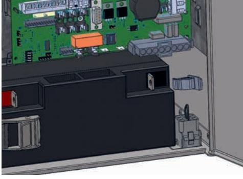

Bild A.

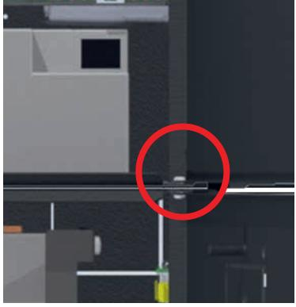

20 Data och konstruktion kan ändras utan föregående meddelande.

### Inkoppling batteribox med FLX L batteribackup

*• Batterier måste vara nya vid installation och batteribyte för att certifierade normer skall upprätthållas.*

- Sätt i batteri närmast dörren först.
Bilden nedan visar en batteribackup med extra batteribox med 2 batterier, se kommande sidor för inkoppling av batteribox med 4 batterier.

Bilden ger även en översikt över kopplingspunkter för batterikablar och batterisäkringar.

|                                                                  | Kabel 1                | Kabel 2                                                         |  |  |
|------------------------------------------------------------------|------------------------|-----------------------------------------------------------------|--|--|
| Batteri 1 (B1)                                                   |                        |                                                                 |  |  |
| B1 -                                                             | - Batt in på kretskort | Inkommande från B3 - via 9-polig kontakt till batteribox. |  |  |
| B1 +                                                             | Via säkring till B2 -  |                                                                 |  |  |
| Batteri 2 (B2)                                                   |                        |                                                                 |  |  |
| B2 -                                                             | Via säkring till B1 +  |                                                                 |  |  |
| B2 +                                                             | + Batt in på kretskort | Inkommande från B4 + via 9-polig kontakt till batteribox. |  |  |
| Batteri 3 (B3)                                                   |                        |                                                                 |  |  |
| B3 -                                                             | B1-                    | via 9-polig kontakt till batteribox.                         |  |  |
| B3 +                                                             | Via säkring till B4 -  |                                                                 |  |  |
| Batteri 4 (B4)                                                   |                        |                                                                 |  |  |
| B4 -                                                             | Via säkring till B3 +  |                                                                 |  |  |
| B4 +                                                             | Till B2 +              | via 9-polig kontakt till batteribox.                         |  |  |
| För efterföljande batteriboxar, följs samma kopplingsmönster. |                        |                                                                 |  |  |

#### Placering av batterier i FLX L batteribackup och FLX M batteribox

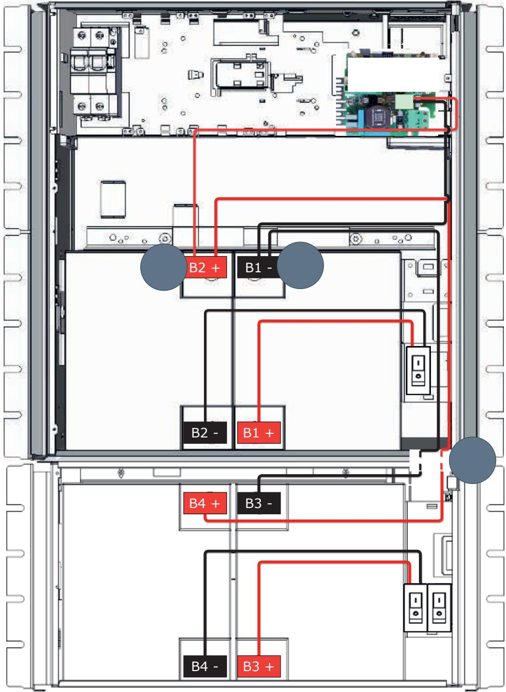

### Inkopplingsschema och gul bygel

Larm till sabotagekontakt seriekopplas och därför måste slingan vara obruten till sista batteriboxkablaget. Gul bygel sluter slingan på varje kablage som går från batteribackup till batteribox och för att larm skall ges på sabotagekontakten i batteriboxen måste gul bygel på kablage klippas. Klipp inte gul bygel på sista kablage i batteribox, då kommer larm för sabotage inte ges i någon tillkopplad batteribackup eller

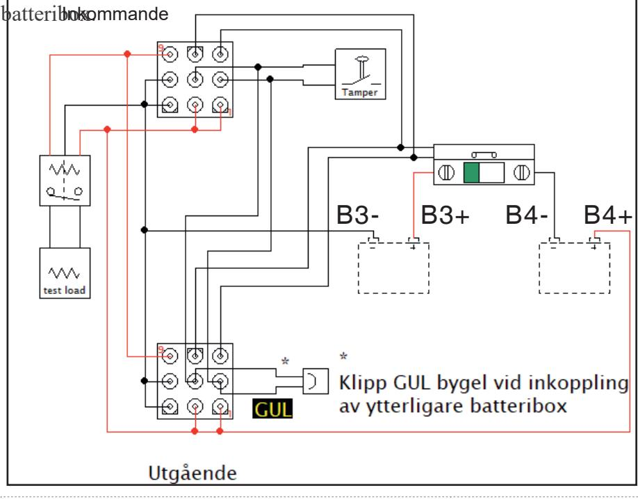

| Batteribackup utan batteribox  | Klipp ej gul bygel                                                                            | Gul bygling skall vara kvar i batteribackup |
|--------------------------------|-----------------------------------------------------------------------------------------------|------------------------------------------------|
| Batteribackup + 1 batteribox   | Klipp gul bygel från batteribackup                                                            | Gul bygling skall vara kvar i batteribox 1  |
| Batteribackup + 2 batteriboxar | Klipp gul bygel från batteribackup och från batteribox 1                                   | Gul bygling skall vara kvar i batteribox 2  |
| Batteribackup + 3 batteriboxar | Klipp gul bygel från batteribackup och från batteribox 1 och batteribox 2                  | Gul bygling skall vara kvar i batteribox 3  |
| Batteribackup + 4 batteriboxar | Klipp gul bygel från batteribackup och från batteribox 1, batteribox 2 och batteribox 3 | Gul bygling skall vara kvar i batteribox 4  |

# Underhåll

Systemet med undantag för batterier är underhållsfritt vid installation i inomhusmiljö.

### Batterier

Batterier alstrar elektricitet genom en kemisk process och det sker därmed en naturlig degradering av kapacitet. Den största faktorn för batteriers livslängd är temperatur. Ju högre temperatur desto kortare livslängd. En ideal temperatur är 20 °C.

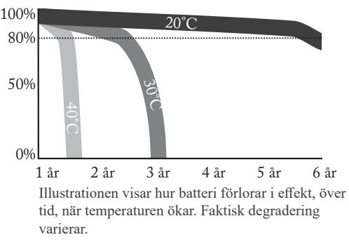

Tillverkningsdatum som är präglat på batteriet och livslängden (som batteritillverkaren anger) gäller vid helt outnyttjat batteri. Således varierar faktisk livslängd. Batterier bör bytas efter HALVA angiven (från batteritillverkaren) livslängd för säker drift. Batterier inköpta via Milleteknik har en teoretisk livslängd (från tillverkaren) på mellan 10- 12 år med rekommenderat byte efter 5-6 år.

### Batteribyte

- 1. Bryt, om möjligt, nätspänning vid batteribyte.
- 2. Koppla bort batterisäkring på kretskortet.
- 3. Koppla bort batterikablar. Notera hur batterikablar är monterade innan de avlägsnas.
- 4. Sätt in och spänn fast de nya batterierna.
- 5. Anslut batterikablarna på samma sätt som tidigare.
- 6. Sätt tillbaka batterisäkring på kretskort.
- 7. Slå till nätspänning. Eventuellt kan indikeringsdioden lysa orange under ett par timmar, tills batterier är laddade.
- 8. Testa systemet genom att kortvarigt koppla bort nätspänning, (= lasten drivs vidare av batterierna), och därefter slå till nätspänningen igen.

### Batteriåtervinning

Alla batterier skall återvinnas. Återlämna till tillverkare eller lämna till återvinningsstation.

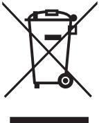

Data och konstruktion kan ändras utan föregående meddelande. 25

## Justering av sabotagekontakt

Sabotagekontaktens hävarm skall vid stängd skåpdörr vara i slutet läge (stängd). Går larm ("tamper alarm" / larm till undercentral) kan hävarmen behövas justeras. Hävarmen justeras genom följande steg:

- Nyp åt med en plattång mitt på hävarmen.
- Justera hävarmen försiktigt åt önskat håll (upp/ner).
- Kontrollera genom att stänga dörren. Ett klick hörs när kontakten sluts.
- *• Sabotagekontakten skall inte larma vid stängd och låst dörr.*

### Sabotagekontakt vid extra batteribox

Har en eller flera batteriboxar kopplats till enheten skall sabotagekontakterna seriekopplas för att larm från alla enheter skall ges. Det är viktigt att seriekopplingen har slutning vid den sista sabotagekontakten. Seriekopplingen skall börja i enheten och vända tillbaka i den sista batteriboxen.

Alla sabotagekontakter skall sitta i serie för att alla skall vara med i larmkedjan. Därför måste gul kabel som sitter i på den jackbara kontakten klippas. På den sista anslutningen/batteriboxen skall kabeln ej vara klippt. (Gäller ej NOVA FLX S).

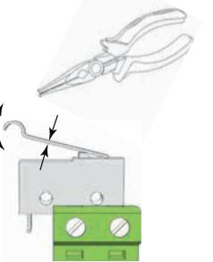

## Tekniska data

|                                                                 | NOVA 24V 5A FLX L                                                                            | NOVA 24V 10A FLX L                                  | NOVA 24V 15A FLX L                                  | NOVA 24V 25A FLX L                                  |
|-----------------------------------------------------------------|-------------------------------------------------------------------------------------------------|--------------------------------------------------------|--------------------------------------------------------|--------------------------------------------------------|
| Huvudkort                                                       | PRO 2 V3 se följande sidor för tekniska data.                                                |                                                        |                                                        |                                                        |
| Tilläggskort, monterat                                       | -                                                                                               | -                                                      | -                                                      | -                                                      |
| Nätaggregat:                                                    | LRS-150-24, se följande sidor för tekniska data.                                          | RSP-320-24, se följande sidor för tekniska data. | RSP-320-24, se följande sidor för tekniska data. | HRP-600-24, se följande sidor för tekniska data. |
| Kapsling:                                                       | FLX L, se följande sidor för tekniska data.                                                     |                                                        |                                                        |                                                        |
| Testad & certifierad tillsammans med följande batteri: | 2 st 45 Ah (UPLUS 10+ Design Life)                                                              |                                                        |                                                        |                                                        |
| Batterityp:                                                     | Återuppladdningsbara bly-syra batterier. Valve-Regulated,Absorbed Glass Mat(AGM) Technology. |                                                        |                                                        |                                                        |
| Vikt:                                                           | 12 kg                                                                                           | 13 kg                                                  | 14 kg                                                  | 15 kg                                                  |
| Typ                                                             | PS Type A                                                                                       |                                                        |                                                        |                                                        |

Data och konstruktion kan ändras utan föregående meddelande. 27

#### Tekniska data huvudkort: PRO2 V3

| PRO 2 V3                                                                      |                         |        |        |                        |     |
|-------------------------------------------------------------------------------|-------------------------|--------|--------|------------------------|-----|
| Beroende på nätaggregat och batterier. Se separat tabell.                     |                         |        |        |                        |     |
| Mindre än 210 mA. 100 mA utan effektsteg med alla reläer dragna i normalläge. |                         |        |        |                        |     |
| 20 V (+/- 0,5 V)                                                           |                         |        |        |                        |     |
| Lysdioden på skåplucka blinkar till var 15:e sekund i vilofas.                |                         |        |        |                        |     |
| Via 4 st växlande reläkontakter eller via kommunikation, (RS-485).            |                         |        |        |                        |     |
| Relä 1                                                                        | Summalarmrelä Relä 2 | Relä 3 | Relä 4 | I 2 C /RS 485 | LED |
| X                                                                             |                         |        |        | X                      | X   |
|                                                                               | X                       |        |        | X                      | X   |
|                                                                               |                         |        | X      | X                      | X   |
|                                                                               |                         |        |        | X                      |     |
|                                                                               | X                       |        |        | X                      | X   |
|                                                                               | X                       |        |        | X                      | X   |
|                                                                               | X                       |        |        | X                      | X   |
|                                                                               |                         | X      |        | X                      | X   |
| Låg batterispänning /                                                         | X                       |        |        | X                      | X   |
|                                                                               |                         |        |        | X                      |     |
|                                                                               |                         |        |        | X                      |     |
|                                                                               |                         |        |        | X                      |     |
|                                                                               | X                       |        |        | X                      | X   |
|                                                                               |                         |        |        | X                      |     |
|                                                                               |                         |        |        | X                      |     |
|                                                                               |                         |        |        | X                      |     |
|                                                                               |                         |        |        |                        |     |

### Tekniska data, fortsättning

Kortnamn: PRO 2 V3

Egenförbrukning

Djupurladdningsskydd 24 V enheter

Laddarfel,

Laddarfel,

Låg batterispänning /

Överström 100 %

Överström 80 %

Överström 175 %

Lastutgång ström: Beroende på nätaggregat och batterier. Se separat tabell.

Normaldrift Lysdioden på skåplucka blinkar till var 15:e sekund i vilofas. Felutgång: Via 4 st växlande reläkontakter eller via kommunikation, (RS-485).

Fläktfel X

Relä 1 Summalarmrelä

(med reläkort): Mindre än 210 mA. 100 mA utan effektsteg med alla reläer dragna i normalläge.

Nätavbrott X X X Säkringsfel X X X Sabotagebrytare X X X

överspänning X X X

underspänning X X X Ej anslutet batteri X X X Låg systemspänning X X X

nätavbrott X X X

Åldrat batteri X X X

Övertemperatur X Undertemperatur X Kort batteritid kvar X

minutmedelvärde X

dygnsmedelvärde X

sekundmedelvärde X

20 V (+/- 0,5 V)

Relä 2 Relä 3 Relä 4 I

2 C /RS-485 LED

| Kortnamn:                                      | PRO 2 V3                                                                                                                                                                                                                                                                                                                                                                     |                                                                                                                                                                                                                                                                                   |  |
|------------------------------------------------|------------------------------------------------------------------------------------------------------------------------------------------------------------------------------------------------------------------------------------------------------------------------------------------------------------------------------------------------------------------------------|-----------------------------------------------------------------------------------------------------------------------------------------------------------------------------------------------------------------------------------------------------------------------------------|--|
|                                                | Fläktfel:                                                                                                                                                                                                                                                                                                                                                                    | Funktionsfel i fläkt, ej korrekt varvtal.                                                                                                                                                                                                                                         |  |
|                                                | Frånkopplat batterier:                                                                                                                                                                                                                                                                                                                                                       | Larm ges när batteri kopplas från eller fel i battericeller uppstår (som systemet uppfattar som bortkopplade batterier).                                                                                                                                                    |  |
|                                                | Låg batterispänning:                                                                                                                                                                                                                                                                                                                                                         | Batterispänning vid nätavbrott - spänningen i batteridrift är låg, (< 24,0 V DC).                                                                                                                                                                                        |  |
|                                                | Låg systemspänning (överbelastning):                                                                                                                                                                                                                                                                                                                                      | System-spänning i nätdrift, även kortvarigt, är för låg, (24,0 V).                                                                                                                                                                                                             |  |
| Larm via buss kommunikation: I2C, RS-485 | Reservdrifttid:                                                                                                                                                                                                                                                                                                                                                              | Larm för när minsta reservdrift tid ej uppfylls. FLX S: Standardvärde för 14 Ah batterier är 12 timmar vid medellast. FLX M: Standardvärde för 20 Ah batterier är 12 timmar vid medellast. FLX L: Standardvärde för 45 Ah batterier är 12 timmar vid medellast. |  |
|                                                | Underspänning:                                                                                                                                                                                                                                                                                                                                                               | Systemet klarar inte av att ladda batterierna till 26,6 V.                                                                                                                                                                                                                     |  |
|                                                | Undertemperatur:                                                                                                                                                                                                                                                                                                                                                             | Systemets temperatursensor indikerar skadligt låg driftstemperatur, (< 10°C).                                                                                                                                                                                               |  |
|                                                | Åldrade batterier:                                                                                                                                                                                                                                                                                                                                                           | Larm ges när batterier har mindre än cirka 80 % av kapacitet kvar.                                                                                                                                                                                                             |  |
|                                                | Överlast / Kortslutning:                                                                                                                                                                                                                                                                                                                                                  | Larm ges när överlast (över 170 %) eller kortslutning inträffar.                                                                                                                                                                                                               |  |
|                                                | Överspänning:                                                                                                                                                                                                                                                                                                                                                                | Systemet laddar batterier för mycket. Spänning är över 27,8 V.                                                                                                                                                                                                                 |  |
|                                                | Övertemperatur:                                                                                                                                                                                                                                                                                                                                                              | Systemets temperatursensor indikerar skadligt hög driftstemperatur, (> 35°C).                                                                                                                                                                                               |  |
|                                                | Övrig info:                                                                                                                                                                                                                                                                                                                                                                  | Statistik och loggfiler för belastning, temperatur, spänning samt belastningsprofiler.                                                                                                                                                                                         |  |
| Omkopplingstid:                                | När batterier är i vilocykel: < 5 mikrosekunder. När batterier är i laddcykel: 0 (ingen). Batterier vilar i 20 dygns cykler varefter en laddcykel tar vid och laddar batterierna i 72 h. Sker nätavbrott när batterier är i vilocykel kopplas batterier in på < 5 mikrosekunder. Sker nätavbrott när batterier är i laddcykel existerar ingen omkopplingstid. |                                                                                                                                                                                                                                                                                   |  |
| Inkommande elnät:                           | 230-240 V AC, 47-63 Hz                                                                                                                                                                                                                                                                                                                                                       |                                                                                                                                                                                                                                                                                   |  |
| Elnätssäkring 24 V enheter                  | T4AH250V.                                                                                                                                                                                                                                                                                                                                                                    |                                                                                                                                                                                                                                                                                   |  |
| Utgångsspänning:                               | Max 27,8 V DC, spänningsgräns bör normalt vara 27,3 V, (12 V, 13,6 V DC). Min 19 V DC, (12 V, 9,5 V DC). Min gäller vid bortkopplad nätspänning i batteridrift.                                                                                                                                                                                                        |                                                                                                                                                                                                                                                                                   |  |

### Tekniska data, fortsättning

| Kortnamn:                    |                             | PRO 2 V3                                         |                                 |              |              |                                          |  |  |
|------------------------------|-----------------------------|--------------------------------------------------|---------------------------------|--------------|--------------|------------------------------------------|--|--|
| Överspänning, larmgräns:  |                             | 27,9 V                                           |                                 |              |              |                                          |  |  |
| Internresistans              |                             |                                                  |                                 |              |              |                                          |  |  |
| Batteri Kapacitet (Ah) | Intern restitans (mΩ) | Spännings dip vid testlast 24 V (mV) | Testlast av kapacitet (%) | Testlast (A) | Testlast (Ω) | Marginal (gräns för larm =0,6V) |  |  |
| 14 Ah                        | 18 mΩ                       | 90 mV                                            | 18 %                            | 2,5 A        | 10 Ω         | 4,83                                     |  |  |
| 20 Ah                        | 14 mΩ                       | 110 mV                                           | 18 %                            | 3,68 A       | 6,8 Ω        | 4,83                                     |  |  |
| 45 Ah                        | 9 mΩ                        | 135 mV                                           | 17 %                            | 7,6 A        | 3,3 Ω        | 2,40                                     |  |  |

### Tekniska data, nätaggregat: RSP-320-24

| Nätaggregat                                          | RSP-320-24                                                                                                                                      |
|------------------------------------------------------|-------------------------------------------------------------------------------------------------------------------------------------------------|
| Utspänning:                                          | 27,3V                                                                                                                                           |
| Utspänning, ripple:                                  | 150 mVp-p                                                                                                                                       |
| Överspänning,                                        | 27,6-32,4 V.                                                                                                                                    |
| Utspänning återuppladdning, ripple/strömgräns: | Mindre än 1,2 Vp-p                                                                                                                              |
| Verkningsgrad:                                       | 89 %                                                                                                                                            |
| Strömbegränsning:                                    | 105-135 %                                                                                                                                       |
| Konstantspänning:                                    | +/-0,5 %                                                                                                                                        |
| Reglernoggrannhet                                    | +/-0,2 %                                                                                                                                        |
| Nätspänning, frekvens:                            | 230-240 V AC, 47- 63 Hz                                                                                                                      |
| Not:                                                 | Nätaggregatet kan vara anpassat för denna batteribackup, vilket betyder standardnätaggregat ej får användas utan att först kontakta support. |

Data och konstruktion kan ändras utan föregående meddelande. 33

### Tekniska data, nätaggregat: HRP-600-24

| Nätaggregat:                                         | HRP-600-24                                                                                                |
|------------------------------------------------------|-----------------------------------------------------------------------------------------------------------|
| Utspänning:                                          | 27,3 V                                                                                                    |
| Utspänning, ripple:                                  | 150 mVp-p                                                                                                 |
| Överspänning,                                        | 30-34,8 V.                                                                                                |
| Utspänning återuppladdning, ripple/strömgräns: | Mindre än 1,2 Vp-p                                                                                        |
| Verkningsgrad:                                       | 88 %                                                                                                      |
| Strömbegränsning:                                    | 105-135 %                                                                                                 |
| Konstantspänning:                                    | +/-0,5 %                                                                                                  |
| Reglernoggrannhet                                    | +/-1,0 %                                                                                                  |
| Nätspänning, frekvens:                            | 230-240 V AC, 47- 63 Hz                                                                                |
| Not:                                                 | Nätaggregatet är anpassat för denna batteribackup, vilket betyder standardnätaggregat ej får användas. |

### Tekniska data, kapsling: FLX L

| Kapsling                    | FLX L                                                             |
|-----------------------------|-------------------------------------------------------------------|
| Rekommenderad omgivning: | Miljöklass 1, inomhus , 20 % ~ 90 % relativ fuktighet             |
| Omgivningstemperatur:       | +5 °C till +40 °C (För bästa batterilivslängd +15 °C till +25 °C) |
| Kapslingsklass:             | IP 32                                                             |
| Rekommenderad montering: | Vägg eller 19" rack.                                              |
| Höjdenheter                 | 10 HE                                                             |
| Dimensioner:                | Höjd: 444 mm Bredd: 437 mm Djup: 212 mm                     |
| Kapslingens färg:           | Svart                                                             |
| Material:                   | Pulverlackad plåt                                                 |

#### Strömuttag samt ur- och uppladdningsström per produkt FLX S, FLX M och FLX L

#### Imin är alltid 0 A. Not. Alla enheter ej säkert certifierade, se enhetens certifikat.

| NOVA FLX S utan batteribox                         | Batteri                      | Total batteri kapacitet | Enligt SSF1014, Larmklass 1-2 | Enligt SSF1014, Larmklass 3-4 | Max urladdningsström (Imax. A): | Max uppladdningsström (Imax. b): |
|-------------------------------------------------------|------------------------------|-------------------------------|----------------------------------|-------------------------------------|---------------------------------------|----------------------------------------|
| NOVA 24V 3A-FLX S                                     | 2 st. 14 Ah                  | 14 Ah                         | 1,1 A                            | 0,45 A                              |                                       |                                        |
| NOVA 24V 5A-FLX S                                     | 2 st. 14 Ah                  | 14 Ah                         | 1,1 A                            | 0,45 A                              | 5 A                                   | 5 A                                    |
| NOVA 24V 10A-FLX S                                    | 2 st. 14 Ah                  | 14 Ah                         | 1,1 A                            | 0,45 A                              | 10 A                                  | 10 A                                   |
|                                                       |                              |                               |                                  |                                     |                                       |                                        |
| NOVA FLX S med 1 st batteribox                     | Batteri                      | Total batteri kapacitet | Enligt SSF1014, Larmklass 1-2 | Enligt SSF1014, Larmklass 3-4 | Max urladdningsström (Imax. A): | Max uppladdningsström (Imax. b): |
| NOVA 24V 3A-FLX S                                     | 2 st. 14 Ah + 4 st. 14 Ah | 42 Ah                         | 3 A                              | 1,4 A                               |                                       |                                        |
| NOVA 24V 5A-FLX S                                     | 2 st. 14 Ah + 4 st. 14 Ah | 42 Ah                         | 3,4 A                            | 1,4 A                               | 5 A                                   | 5 A                                    |
| NOVA 24V 10A-FLX S                                    | 2 st. 14 Ah + 4 st. 14 Ah | 42 Ah                         | 3,4 A                            | 1,4 A                               | 10 A                                  | 10 A                                   |
|                                                       |                              |                               |                                  |                                     |                                       |                                        |
| NOVA FLX S med 2 st batteribox                     | Batteri                      | Total batteri kapacitet | Enligt SSF1014, Larmklass 1-2 | Enligt SSF1014, Larmklass 3-4 | Max urladdningsström (Imax. A): | Max uppladdningsström (Imax. b): |
| NOVA 24V 3A FLX S                                     | 2 st. 14 Ah + 8 st. 14 Ah | 70 Ah                         | 5,7 A                            | 2,3 A                               |                                       |                                        |
| NOVA 24V 5A FLX S                                     | 2 st. 14 Ah + 8 st. 14 Ah | 70 Ah                         | 5,7 A                            | 2,3 A                               | 5 A                                   | 5 A                                    |
| NOVA 24V 10A FLX S                                    | 2 st. 14 Ah + 8 st. 14 Ah | 70 Ah                         | 5,7 A                            | 2,3 A                               | 10 A                                  | 10 A                                   |
|                                                       |                              |                               |                                  |                                     |                                       |                                        |
| NOVA FLX M utan batteribox                         | Batteri                      | Total batteri kapacitet | Enligt SSF1014, Larmklass 1-2 | Enligt SSF1014, Larmklass 3-4 | Max urladdningsström (Imax. A): | Max uppladdningsström (Imax. b): |
| NOVA 24V 5A-FLX M                                     | 2 st. 20 Ah                  | 20 Ah                         | 1,6 A                            | 0,65 A                              | 10 A                                  | 10 A                                   |
| NOVA 24V 10A-FLX M                                    | 2 st. 20 Ah                  | 20 Ah                         | 1,6 A                            | 0,65 A                              | 10 A                                  | 10 A                                   |
| NOVA 24V 15A-FLX M                                    | 2 st. 20 Ah                  | 20 Ah                         | 1,5 A                            | 0,55 A                              | 13 A                                  | 15 A                                   |
| NOVA 24V 25A-FLX M                                    | 2 st. 20 Ah                  | 20 Ah                         | 1,5 A                            | 0,55 A                              | 25 A                                  | 35 A                                   |
|                                                       |                              |                               |                                  |                                     |                                       |                                        |
| NOVA FLX M med 1 st Batterybox FLX M            | Batteri                      | Total batteri kapacitet | Enligt SSF1014, Larmklass 1-2 | Enligt SSF1014, Larmklass 3-4 | Max urladdningsström (Imax. A): | Max uppladdningsström (Imax. b): |
| NOVA 24V 5A-FLX M (Batterier endast i batteribox)  | 2 st. 45 Ah                  | 45 Ah                         | 3,7 A                            | 1,5 A                               | 5 A                                   | 5 A                                    |
| NOVA 24V 10A-FLX M (Batterier endast i batteribox) | 2 st. 45 Ah                  | 45 Ah                         | 3,7 A                            | 1,5 A                               | 10 A                                  | 10 A                                   |
| NOVA 24V 15A-FLX M (Batterier endast i batteribox) | 2 st. 45 Ah                  | 45 Ah                         | 3,6 A                            | 1,4 A                               | 13 A                                  | 15 A                                   |
| NOVA 24V 25A-FLX M (Batterier endast i batteribox) | 2 st. 45 Ah                  | 45 Ah                         | 3,6 A                            | 1,4 A                               | 25 A                                  | 30 A                                   |

|  | NOVA 24V 5A-FLX M                                     | 2 st. 20 Ah + 2 st. 45 Ah | 65 Ah                         | 5,0 A                            | 2,1 A                               | 5 A                                   | 5 A                                    |
|--|-------------------------------------------------------|------------------------------|-------------------------------|----------------------------------|-------------------------------------|---------------------------------------|----------------------------------------|
|  | NOVA 24V 10A-FLX M                                    | 2 st. 20 Ah + 2 st. 45 Ah | 65 Ah                         | 5,3 A                            | 2,1 A                               | 10 A                                  | 10 A                                   |
|  | NOVA 24V 15A-FLX M                                    | 2 st. 20 Ah + 2 st. 45 Ah | 65 Ah                         | 5,2 A                            | 2,0 A                               | 13 A                                  | 15 A                                   |
|  | NOVA 24V 25A-FLX M                                    | 2 st. 20 Ah + 2 st. 45 Ah | 65 Ah                         | 5,2 A                            | 2,0 A                               | 25 A                                  | 30 A                                   |
|  |                                                       |                              |                               |                                  |                                     |                                       |                                        |
|  | NOVA FLX M med 2 st. Batterybox FLX M           | Batteri                      | Total batteri kapacitet | Enligt SSF1014, Larmklass 1-2 | Enligt SSF1014, Larmklass 3-4 | Max urladdningsström (Imax. A): | Max uppladdningsström (Imax. b): |
|  | NOVA 24V 10A-FLX M (Batterier endast i batteribox) | 4 st. 45 Ah                  | 90 Ah                         | 7,4 A                            | 3,0 A                               | 10 A                                  | 10 A                                   |
|  | NOVA 24V 15A-FLX M (Batterier endast i batteribox) | 4 st. 45 Ah                  | 90 Ah                         | 7,3 A                            | 2,9 A                               | 13 A                                  | 15 A                                   |
|  | NOVA 24V 25A-FLX M (Batterier endast i batteribox) | 4 st. 45 Ah                  | 90 Ah                         | 7,3 A                            | 2,9 A                               | 25 A                                  | 30 A                                   |
|  | NOVA 24V 10A-FLX M                                    | 2 st. 20 Ah + 4 st. 45 Ah | 110 Ah                        | 8,1 A                            | 3,6 A                               | 10 A                                  | 10 A                                   |
|  | NOVA 24V 15A-FLX M                                    | 2 st. 20 Ah + 4 st. 45 Ah | 110 Ah                        | 9,0 A                            | 3,5 A                               | 13 A                                  | 15 A                                   |
|  | NOVA 24V 25A-FLX M                                    | 2 st. 20 Ah + 4 st. 45 Ah | 110 Ah                        | 9,0 A                            | 3,5 A                               | 25 A                                  | 30 A                                   |
|  |                                                       |                              |                               |                                  |                                     |                                       |                                        |
|  | NOVA FLX M med 3 st. Batterybox FLX M           | Batteri                      | Total batteri kapacitet | Enligt SSF1014, Larmklass 1-2 | Enligt SSF1014, Larmklass 3-4 | Max urladdningsström (Imax. A): | Max uppladdningsström (Imax. b): |
|  | NOVA 24V 15A-FLX M (Batterier endast i batteribox) | 6 st. 45 Ah                  | 135 Ah                        | 11,1 A                           | 4,4 A                               | 13 A                                  | 15 A                                   |
|  | NOVA 24V 25A-FLX M (Batterier endast i batteribox) | 6 st. 45 Ah                  | 135 Ah                        | 11,1 A                           | 4,4 A                               | 25 A                                  | 30 A                                   |
|  | NOVA 24V 5A-FLX M                                     | 2 st. 20 Ah + 6 st. 45 Ah | 155 Ah                        | 12,8 A                           | 5,1 A                               | 5 A                                   | 5 A                                    |
|  | NOVA 24V 10A-FLX M                                    | 2 st. 20 Ah + 6 st. 45 Ah | 155 Ah                        | 12,8 A                           | 5,1 A                               | 10 A                                  | 10 A                                   |
|  | NOVA 24V 15A-FLX M                                    | 2 st. 20 Ah + 6 st. 45 Ah | 155 Ah                        | 12,7 A                           | 5,0 A                               | 13 A                                  | 15 A                                   |
|  | NOVA 24V 25A-FLX M                                    | 2 st. 20 Ah + 6 st. 45 Ah | 155 Ah                        | 12,7 A                           | 5,0 A                               | 25 A                                  | 30 A                                   |
|  |                                                       |                              |                               |                                  |                                     |                                       |                                        |
|  | NOVA FLX M med 4 st. Batterybox FLX M           | Batteri                      | Total batteri kapacitet | Enligt SSF1014, Larmklass 1-2 | Enligt SSF1014, Larmklass 3-4 | Max urladdningsström (Imax. A): | Max uppladdningsström (Imax. b): |
|  | NOVA 24V 15A-FLX M (Batterier endast i batteribox) | 8 st. 45 Ah                  | 180 Ah                        | 14,0 A                           | 5,5 A                               | 13 A                                  | 15 A                                   |
|  | NOVA 24V 25A-FLX M (Batterier endast i batteribox) | 8 st. 45 Ah                  | 180 Ah                        | 14,8 A                           | 5,9 A                               | 25 A                                  | 30 A                                   |
|  | NOVA 24V 25A-FLX M                                    | 2 st. 20 Ah + 8 st. 45 Ah | 200 Ah                        | 16,5 A                           | 6,5 A                               | 25 A                                  | 30 A                                   |
|  |                                                       |                              |                               |                                  |                                     |                                       |                                        |
|  | NOVA FLX M med 5 st. Batterybox FLX M           | Batteri                      | Total batteri kapacitet | Enligt SSF1014, Larmklass 1-2 | Enligt SSF1014, Larmklass 3-4 | Max urladdningsström (Imax. A): | Max uppladdningsström (Imax. b): |
|  |                                                       |                              |                               |                                  |                                     |                                       |                                        |

| NOVA 24V 25A-FLX M (Batterier endast i batteribox) | 10 st. 45 Ah | 225 Ah                        | 18,6 A                                                                  | 7,4 A                               | 25 A                                  | 30 A                                   |  |
|-------------------------------------------------------|--------------|-------------------------------|-------------------------------------------------------------------------|-------------------------------------|---------------------------------------|----------------------------------------|--|
|                                                       |              |                               |                                                                         |                                     |                                       |                                        |  |
| NOVA FLX L utan batteribox                         | Batteri      | Total batteri kapacitet | Enligt SSF1014, Larmklass 1-2                                        | Enligt SSF1014, Larmklass 3-4 | Max urladdningsström (Imax. A): | Max uppladdningsström (Imax. b): |  |
| NOVA 24V 5A-FLX L                                     | 2 st. 45 Ah  | 45 Ah                         | 3,7 A                                                                   | 1,5 A                               | 5 A                                   | 5 A                                    |  |
| NOVA 24V 10A-FLX L                                    | 2 st. 45 Ah  | 45 Ah                         | 3,7 A                                                                   | 1,5 A                               | 10 A                                  | 10 A                                   |  |
| NOVA 24V 15A-FLX L                                    | 2 st. 45 Ah  | 45 Ah                         | 3,6 A                                                                   | 1,4 A                               | 13 A                                  | 15 A                                   |  |
| NOVA 24V 25A-FLX L                                    | 2 st. 45 Ah  | 45 Ah                         | 3,6 A                                                                   | 1,4 A                               | 25 A                                  | 30 A                                   |  |
|                                                       |              |                               |                                                                         |                                     |                                       |                                        |  |
| NOVA FLX L med 1 st Batterybox FLX L            | Batteri      | Total batteri kapacitet | Enligt SSF1014, Larmklass 1-2                                        | Enligt SSF1014, Larmklass 3-4 | Max urladdningsström (Imax. A): | Max uppladdningsström (Imax. b): |  |
| NOVA 24V 5A-FLX L                                     | 4 st. 45 Ah  | 90 Ah                         | 5,0 A                                                                   | 2,5 A                               | 5 A                                   | 5 A                                    |  |
| NOVA 24V 10A-FLX L                                    | 4 st. 45 Ah  | 90 Ah                         | 7,4 A                                                                   | 3,0 A                               | 10 A                                  | 10 A                                   |  |
| NOVA 24V 15A-FLX L                                    | 4 st. 45 Ah  | 90 Ah                         | 7,3 A                                                                   | 2,9 A                               | 13 A                                  | 15 A                                   |  |
| NOVA 24V 25A-FLX L                                    | 4 st. 45 Ah  | 90 Ah                         | 7,3 A                                                                   | 2,9 A                               | 25 A                                  | 30 A                                   |  |
|                                                       |              |                               |                                                                         |                                     |                                       |                                        |  |
| NOVA FLX L med 2 st. Batterybox FLX L           | Batteri      | Total batteri kapacitet | Enligt SSF1014, Larmklass 1-2                                        | Enligt SSF1014, Larmklass 3-4 | Max urladdningsström (Imax. A): | Max uppladdningsström (Imax. b): |  |
| NOVA 24V 15A-FLX L                                    | 6 st. 45 Ah  | 135 Ah                        | 11,1 A                                                                  | 4,4 A                               | 13 A                                  | 15 A                                   |  |
| NOVA 24V 25A-FLX L                                    | 6 st. 45 Ah  |                               | 11,1 A                                                                  | 4,4 A                               | 25 A                                  | 30 A                                   |  |
|                                                       |              |                               |                                                                         |                                     |                                       |                                        |  |
| NOVA FLX L med 3 st. Batterybox FLX L           | Batteri      | Total batteri kapacitet | Enligt Enligt SSF1014, SSF1014, Larmklass 1-2 Larmklass 3-4 |                                     | Max urladdningsström (Imax. A): | Max uppladdningsström (Imax. b): |  |
| NOVA 24V 15A-FLX L                                    | 8 st. 45 Ah  | 180 Ah                        | 14,8 A                                                                  | 5,9 A                               | 13 A                                  | 15 A                                   |  |
| NOVA 24V 25A-FLX L                                    | 8 st. 45 Ah  | 180 Ah                        | 14,8 A                                                                  | 5,9 A                               | 25 A                                  | 30 A                                   |  |
|                                                       |              |                               |                                                                         |                                     |                                       |                                        |  |
| NOVA FLX L med 4 st. Batterybox FLX L           | Batteri      | Total batteri kapacitet | Enligt SSF1014, Larmklass 1-2                                        | Enligt SSF1014, Larmklass 3-4 | Max urladdningsström (Imax. A): | Max uppladdningsström (Imax. b): |  |
| NOVA 24V 25A-FLX L                                    | 10 st. 45 Ah | 225 Ah                        | 18,6 A                                                                  | 7,4 A                               | 25 A                                  | 30 A                                   |  |
|                                                       |              |                               |                                                                         |                                     |                                       |                                        |  |

#### Reservdrifttider vid olika larmklasser*

| Larmklass                               | Reservdrifttid vid strömavbrott | Max antal timmars återuppladdning av batterier (80%) |  |  |  |  |  |  |
|-----------------------------------------|---------------------------------|---------------------------------------------------------|--|--|--|--|--|--|
| EN54-4                                  | -                               | 24 h                                                    |  |  |  |  |  |  |
| SBF110:8                                | 30 h + 10 min                   | 24 h                                                    |  |  |  |  |  |  |
| EN50131-6 grade 1-2                     | 12 h                            | 72 h                                                    |  |  |  |  |  |  |
| EN50131-6 grade 3                       | 24 h                            | 24 h                                                    |  |  |  |  |  |  |
| SSF1014 Larmklass 1/2                   | 12 h                            | 72 h                                                    |  |  |  |  |  |  |
| SSF1014 Larmklass 3/4                   | 30 h                            | 24 h                                                    |  |  |  |  |  |  |
| *Tabellen visar kraven för larmklasser. |                                 |                                                         |  |  |  |  |  |  |

## Reservdrifttider

En lathund för batteribackuper

För att få en uppfattning om ungefärlig reservdrifttid finns följande lathundar att tillgå. Observera att vid uträkning har vi tagit hänsyn till att batterierna åldras. Alla batterikombinationer kanske inte är tillgängliga för enheten.

| Reservdrifttid (Förväntad och efter batterityp)                                                                                                    |                 | Medelström, belastning (timmar). |                       |                                              |      |      |      |      |      |      |      |      |      |      |      |
|-------------------------------------------------------------------------------------------------------------------------------------------------------|-----------------|----------------------------------|-----------------------|----------------------------------------------|------|------|------|------|------|------|------|------|------|------|------|
| System spänning                                                                                                                                    | Antal           | Batteri                          | Total Bat. kap. | 0,5 A                                        | 1 A  | 2 A  | 4 A  | 6 A  | 8 A  | 10 A | 12 A | 14 A | 16 A | 18 A | 20 A |
|                                                                                                                                                       |                 |                                  |                       | Timmar och minuter (4,5= 4 hr och 30 minuter |      |      |      |      |      |      |      |      |      |      |      |
| 12 V                                                                                                                                                  | 2 st.           | 7,2 Ah                           | 14 Ah                 | 22,4                                         | 11,2 | 4,5  | 2    | 1    | 0,6  | -    | -    | -    | -    | -    | -    |
| 12 V                                                                                                                                                  | 2 st.           | 14 Ah                            | 28 Ah                 | 44,8                                         | 22,4 | 11   | 4,5  | 2,5  | 2    | -    | -    | -    | -    | -    | -    |
| 12 V                                                                                                                                                  | 2 st.           | 20 Ah                            | 40 Ah                 | 64                                           | 32   | 15,5 | 8    | 4,5  | 3    | -    | -    | -    | -    | -    | -    |
| 24V                                                                                                                                                   | 2 st.           | 7,2Ah                            | 7,2                   | 9,8                                          | 4,2  | 1,6  | 1,0  | 0,6  | 0,4  | 0,3  | -    | -    | -    | -    | -    |
| 24V                                                                                                                                                   | 2 st.           | 14Ah                             | 14                    | 22,4                                         | 11,1 | 4,5  | 2,3  | 1,6  | 1,0  | 0,8  | -    | -    | -    | -    | -    |
| 24V                                                                                                                                                   | 2 st.           | 20Ah                             | 20                    | 32                                           | 15,5 | 7,3  | 3,4  | 2,2  | 1,5  | 1,0  | 0,75 | 0,6  | 0,5  | 0,4  | 0,4  |
| 24V                                                                                                                                                   | 4 st.           | 14Ah                             | 28                    | 44,8                                         | 22,4 | 10,7 | 5,1  | 3,3  | 2,3  | 1,8  | -    | -    | -    | -    | -    |
| 24V                                                                                                                                                   | 6 st.           | 14Ah                             | 42                    | 67,2                                         | 33,6 | 16,5 | 8,0  | 5,1  | 3,7  | 2,8  | -    | -    | -    | -    | -    |
| 24V                                                                                                                                                   | 2 st.           | 45Ah                             | 45                    | 72                                           | 36   | 17,5 | 8,2  | 5,2  | 3,8  | 3,0  | 2,4  | 2,2  | 1,8  | 1,3  | 1,0  |
| 24V                                                                                                                                                   | 2 st.+ 2 st. | 20+ 45Ah                      | 65                    | 104                                          | 52   | 26   | 12,4 | 8,0  | 5,7  | 4,5  | 3,6  | 3,1  | 2,7  | 2,0  | 1,8  |
| 24V                                                                                                                                                   | 10 st.          | 70Ah                             | 70                    | 112                                          | 56   | 28   | 13,3 | 8,6  | 6,5  | 5,0  | 4,0  | 3,4  | 3,0  | 2,2  | 2,0  |
| 24V                                                                                                                                                   | 4 st.           | 45Ah                             | 90                    | 144                                          | 72   | 36   | 17,1 | 10,8 | 8,2  | 6,2  | 5,0  | 4,2  | 3,8  | 2,8  | 2,5  |
| 24V                                                                                                                                                   | 2 st.+ 4 st. | 20+ 45Ah                      | 110                   | 176                                          | 88   | 44   | 22   | 14   | 10,8 | 8,1  | 6,8  | 5,6  | 4,6  | 4,3  | 3,7  |
| 24V                                                                                                                                                   | 6 st.           | 45Ah                             | 135                   | 216                                          | 108  | 54   | 27   | 18,5 | 14   | 11,2 | 8,9  | 7,6  | 6,3  | 5,7  | 4,8  |
| 24V                                                                                                                                                   | 2 st.+ 6 st. | 20+ 45Ah                      | 155                   | 248                                          | 124  | 62   | 31   | 20,0 | 15,6 | 12,5 | 10,9 | 8,8  | 7,5  | 6,5  | 5,5  |
| 24V                                                                                                                                                   | 8 st.           | 45Ah                             | 180                   | 288                                          | 144  | 72   | 36   | 24   | 17,6 | 14,2 | 12,6 | 10,8 | 9,0  | 8,0  | 6,8  |
| 24V                                                                                                                                                   | 2 st.+ 8 st. | 20 +45Ah                      | 200                   | 320                                          | 160  | 80   | 40   | 26,7 | 20,0 | 16,7 | 14,0 | 12,0 | 10,5 | 8,8  | 8,0  |
| 24V                                                                                                                                                   | 10 st.          | 45Ah                             | 225                   | 360                                          | 180  | 90   | 45   | 30   | 22,5 | 17,7 | 15,7 | 13,6 | 11,9 | 10,5 | 9,0  |
| Hänsyn tagen till 80% av batteriets grundkapacitet, det vill säga att batterier har minst 80% kapacitet för att kunna användas driftsäkert i enheten. |                 |                                  |                       |                                              |      |      |      |      |      |      |      |      |      |      |      |

Denna sida har avsiktligen lämnats tom

37 Data och konstruktion kan ändras utan föregående meddelande.

Denna sida har avsiktligen lämnats tom

Data och konstruktion kan ändras utan föregående meddelande. 38

### Milleteknik AB

- *• Ögärdesvägen 8 B, 433 30 Partille*
- *• 031-34 00 230*
- *• www.milleteknik.se*