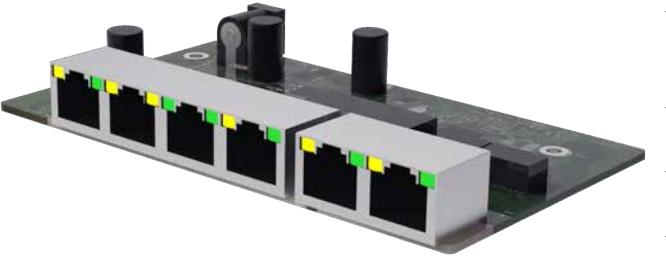

## Tillvalskort

## PoE switch 4p expansion kit

- √ PoE switch för expansion i Milleteknik PoE FLX S+ & FLX M+ batteribackuper.
- √ 2 LAN portar & 4 PoE portar
- √ Ansluts emot färdigt kablage i batteribackupen
- √ Stöder IEEE 802.3af/15,4W & IEEE 802.3at/30,8W

| REKOMMENDERAD MILJÖ OCH MÅTT:              |                                                                                                                                                                                                                                                  |
|--------------------------------------------|--------------------------------------------------------------------------------------------------------------------------------------------------------------------------------------------------------------------------------------------------|
| Rekommenderad miljö:                       | Miljöklass 1, Inomhus, 20% ~ 90% relativ fuktighet                                                                                                                                                                                               |
| Omgivningstemperatur:                      | +5 °C - 40 °C                                                                                                                                                                                                                                    |
| Dimension (HxBxD):                         | 20x130x100 mm                                                                                                                                                                                                                                    |
| ELEKTRISK INFORMATION:                     |                                                                                                                                                                                                                                                  |
| Inspänning:                                | 54,6VDC                                                                                                                                                                                                                                          |
| Utspänning:                                | PoE (54,6VDC)                                                                                                                                                                                                                                    |
| Antal LAN / PoE portar:                    | 2 st. / 4 st.                                                                                                                                                                                                                                    |
| Max effekt per port:                       | 30,8W @54,6VDC / 22W@41VDC                                                                                                                                                                                                                       |
| PoE Budget:                                | 320W                                                                                                                                                                                                                                             |
| Ethernettyp:                               | Fast Ethernet Mbit PoE switch                                                                                                                                                                                                                    |
| Typ av nätverksport:                       | 10 / 100 PoE+                                                                                                                                                                                                                                    |
| Gränssnit:                                 | 1000Base-T RJ-45                                                                                                                                                                                                                                 |
| Stöd för standard enligt:                  | IEEE 802.3at, IEEE 802.3af                                                                                                                                                                                                                       |
| Funktioner:                                | Auto-negotiation, Auto-uplink (auto MDI/MDI-X)                                                                                                                                                                                                   |
| Managerbar:                                | Nej                                                                                                                                                                                                                                              |
| MÖJLIG FÖR MONTERING I FÖLJANDE PRODUKTER: |                                                                                                                                                                                                                                                  |
| PoE switch 4p M                            | Nej                                                                                                                                                                                                                                              |
| PoE switch 4p FLX S+                       | Ja, 1x                                                                                                                                                                                                                                           |
| PoE switch 4p FLX M+                       | Ja, 2x                                                                                                                                                                                                                                           |
| ARTIKELINFORMATION:                        |                                                                                                                                                                                                                                                  |
| Artikelnamn:                               | PoE switch 4p expansion kit                                                                                                                                                                                                                      |
| Artikelnummer:                             | A-OT00004PU01                                                                                                                                                                                                                                    |
| E-nummer:                                  | 5171954                                                                                                                                                                                                                                          |
| Produkten möter kraven enligt:             | EMC Direktivet 2014/30EU, Lågspännings direktivet: 2014/35/EU CE direktivet enligt:765/2008, Emission:EN61000-6-:2001, EN55022:1998:-A1:2000, A2:2003 Klass B, EN61000-3-2:2001. Immunity: EN61000-6-2:2005, EN61000-4-2, -3, 4, -5, -6, -11. |
| Garantiperiod:                             | 2 år                                                                                                                                                                                                                                             |
| Designad av:                               | Milleteknik AB                                                                                                                                                                                                                                   |
| Ursprungsland:                             | Kina                                                                                                                                                                                                                                             |
|                                            |                                                                                                                                                                                                                                                  |