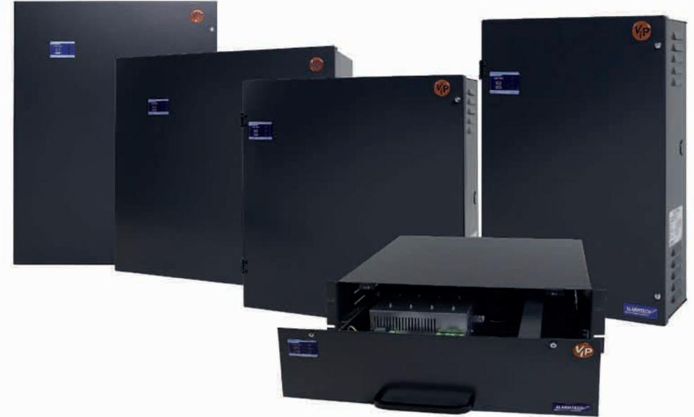
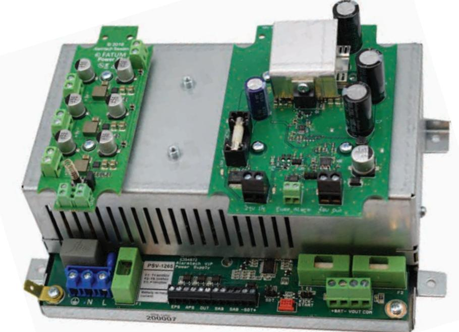
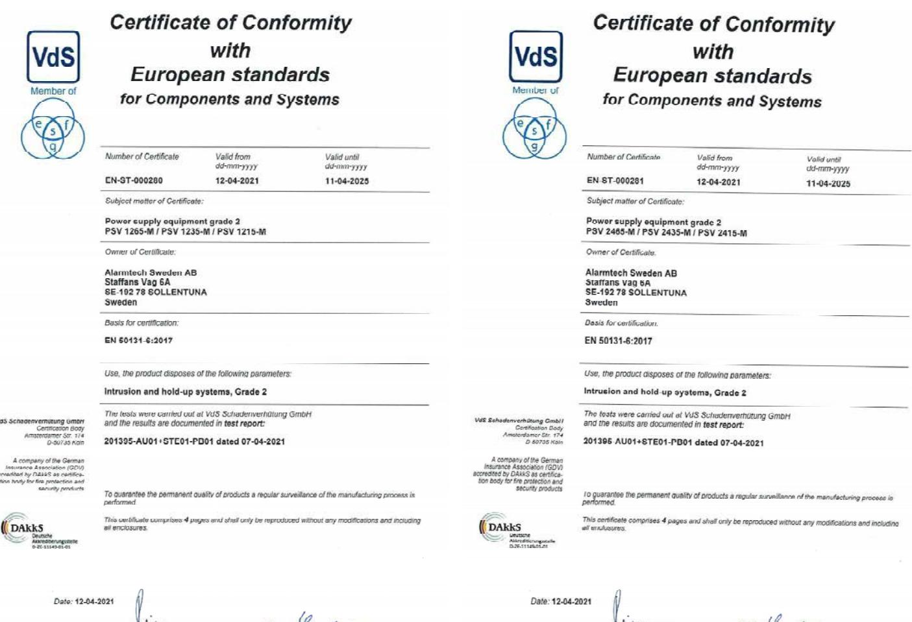
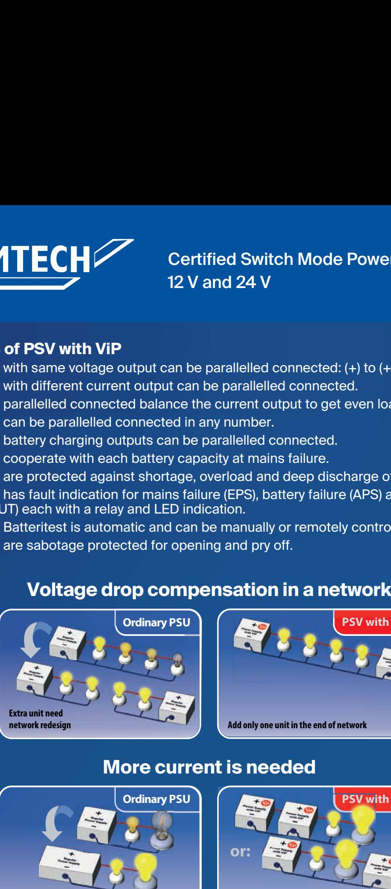
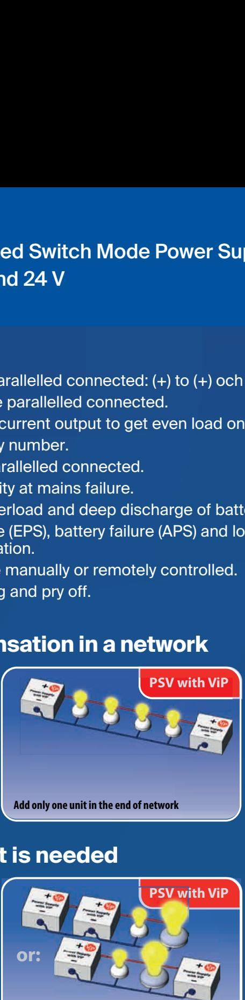
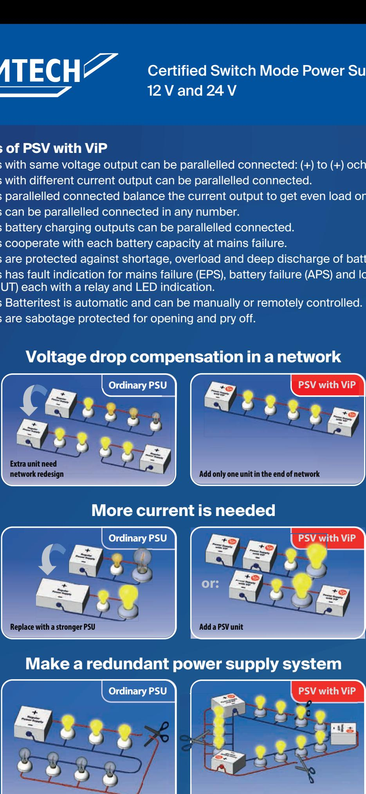
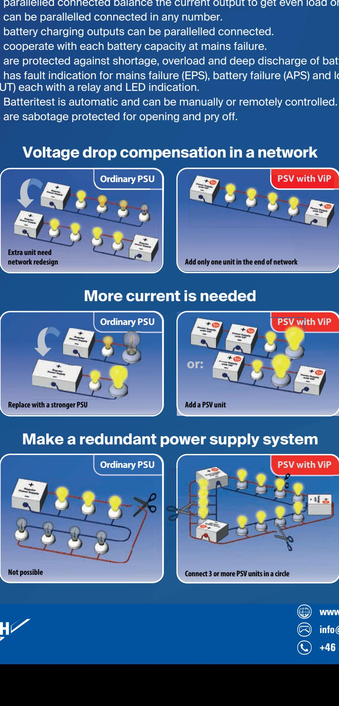

# Alarmtech PSV Certified EN Grade 3 Switch Mode Power Supply Program with Battery Backup Certified Switch Mode Power Supply Program **POWER SUPPLIES** 12 V and 24 V

## *Features:*

- **• EN Grade 3 Certified Switch Mode Power Supplies**
- **• Input 230 V AC**
- **• Output voltage 12 V and 24 V DC**
- **• Units and Modules certified by VdS for EN Grade 3**
- **• Safety and EMC approved and Certified by INTERTEK**

# **Certified products**

Alarmtech has developed a PSV program for 12V and 24V with battery backup. They are Certified at the German test laboratory Verband der Schadenverhütung (VdS) for EN Grade 3 which is valid in most European countries. Often is seen that power supply products are named Complied with EN Grade 3 but it means it is not approved and certified for use in Grade 3 installations. But they can eventually be approved and certified if tested. Therefore, Alarmtech has Tested and Certified the new PSV program at VdS and can then easily get national certifications in most countries in Europe. In Sweden this certification is made by SBSC.

The PSV program is also tested and approved for Safety and EMC by INTERTEK to satisfy the modern Security Industry´s claim for high quality and performance.

# 12 V and 24 V **Alarmtech PSV Power Supply Program with battery charging**

### **Modular power supply systems**

The power supply program is intended for the Security Industry as well as for the industry that require continuous DC power in the event of mains failure or mains disturbances. It is a flexible system with standardized modules of power units and cabinets to enable custom design for customers.

The new PSV system with its modular and compact design represents a perfect solution for a wide range of applications.

### **The power supply features:**

- Universal modular power supply ranges for DC systems
- Output voltages 12 V and 24 V
- Operation with or without batteries
- Comprehensive alarm and monitoring functions
- EN Grade 2 & 3 approved by VdS
- Safety and EMC approved by INTERTEK

### **1. Power module versions**

The modules represents a complete power supply unit and can operate as a single or parallel operating unit in a wide range of different standard or customized cabinet solutions. They are certified as standalone units to be built in to customer's cabinets simplifying further approvals.

A separate PCB with LED display is available as an option for the complete configuration and monitoring of all module functions.

Together with vented or valve-regulated lead acid batteries the power supply systems provide continuous DC power with high availability for mission critical loads.

The Power modules consists of power modules with DC output voltages of 12 V and 24 V.

The output characteristic of the power supply range follows DIN 41773 charging procedure. The excellent dynamic performance of the ADC range also allows stand-alone operation without batteries.

### **2. Wall cabinet versions**

Standard sizes of wall cabinets are available which can accommodate the operating modules.

These cabinets also provide space for a limited number of standard functional modules and customer units.

The doors are equipped with a LED display that indicates state of operation and failure modes. All wall cabinets are designed to meet IEC protection class IP 21.

### **3. Rack mounted versions**

Available are also rack mounted cabinets where all modules fits. These cabinets can also accommodate a series of standard functional modules and customer's units.

### **Alarmtech PSV Power Supplies have following monitoring functions:**

### **High DC output voltage**

If the DC output voltage rises above the legal level, the output is shut down.

### **Low DC output voltage**

If the voltage output falls below specified output level an internal alarm indication will be triggered linked to the out Alarm relay and indicated with a red LED.

### **Mains failure**

In case of mains failure, the alarm signal activates the common fault alarm relay and the green LED indication is switched off. If the mains voltage returns, the power supply restarts and the alarm signal and relay will reset. During mains fault, only battery assisted systems continue to supply DC output voltage.

### **Battery circuit test**

When triggered the computer disconnects the battery from installation if mains are ON, connects the battery to an internal load and measures the battery internal resistance. The value should be within certain limits defined by battery capacity, and if outside the limits a fault will be triggered. This function is triggered at start-up of the module and then automatically every 10 hours. It can be manually triggered by the jumper on the PCB or remotely if SDT terminal is connected. Default position is open and triggering is a momentary shunt to minus. If SDT is permanently shunted the battery charging is disabled and the entire current capacity can be used to installation.

If the battery voltage falls below specified level, the common internal fault relay will activate and the red LED lights up.

### **Deep discharge protection**

During battery operation the voltage level of the battery is constant monitored and if the voltage drops below a level that is safe for the battery survival the battery is switched off from the installation.

### **ViP features**

ViP (Voltage-in-Parallel) feature increases reliability and capacity of power supply systems. Power supplies with ViP feature can be connected in parallel without need for additional synchronization and can be used to increase current capacity or compensate voltage drop on long wire distances reducing the cost for the wires.

ViP include load share facility. When units are paralleled, connected system is automatically balanced and each unit contribute to the total load according to its current capacity.

### **Kick Start**

During installation with no mains, but battery connected, there will be no output voltage from power supply. By momentary shunting the kick start jumper the output voltage will be enabled and installation is supplied from the battery. This function is introduced to prevent the battery to be discharged accidentally during installation.

### **Failure outputs**

All with separate relay and LED indication

- EPS Mains failure
- APS Battery failure
- OUT DC output failure
- SAB Opening and Pry-Off failure

|                                                                                                              | Certified 12 V and | Switch Mode Power Supply Program 24 V                                             |
|--------------------------------------------------------------------------------------------------------------|--------------------------|-----------------------------------------------------------------------------------------------------|
|                                                                                                              |                          |                                                                                                     |
| Alarmtech                                                                                                    | Power Supply Units       |                                                                                                     |
| Order nr                                                                                                     | Picture                  | Description Power Supply Unit with battery charging:                                             |
| PSV 1235-B1                                                                                                  |                          | • Input - 230 V AC • Output - 12 V, 3.5 A DC                                               |
| Certificates VdS: EN 50131-6 Grade 3 VdS: EN 50130-5 Class II                                    |                          | • ViP mode • Place for one battery of capacity 7Ah or 12Ah or 18Ah                      |
| INTERTEK: Safety EN 62368-I:2014/A11:2017 INTERTEK: EMC EN 61000-6-3                                |                          | • Dimensions (WxHxD): 265 x 385 x 115 mm Power Supply Unit with battery charging:             |
| PSV 1265-B1                                                                                                  |                          | • Input - 230 V AC                                                                               |
|                                                                                                              |                          | • Output - 12 V, 6.5 A DC                                                                        |
| Certificates VdS: EN 50131-6 Grade 3 VdS: EN 50130-5 Class II                                    |                          | • ViP mode • Place for one battery of capacity                                             |
| INTERTEK: Safety EN 62368-I:2014/A11:2017 INTERTEK: EMC EN 61000-6-3                                |                          | 7Ah or 12Ah or 18Ah • Dimensions (WxHxD): 265 x 385 x 115 mm                                  |
| PSV 2435-B2                                                                                                  |                          | Power Supply Unit with battery charging: • Input - 230 V AC Output - 24 V, 3.5 A DC        |
| Certificates VdS: EN 50131-6 Grade 3                                                                   |                          | • • ViP mode • Place for two batteries                                                  |
| VdS: EN 50130-5 Class II INTERTEK: Safety EN 62368-I:2014/A11:2017 INTERTEK: EMC EN 61000-6-3 |                          | of capacity 7Ah or 12Ah or 18Ah • Dimensions (WxHxD): 385 x 385 x 115 mm                      |
| PSV 2465-B2                                                                                                  |                          | Power Supply Unit with battery charging: • Input - 230 V AC                                   |
| Certificates VdS: EN 50131-6 Grade 3                                                                   |                          | • Output - 24 V, 6.5 A DC • ViP mode • Place for two batteries                       |
| VdS: EN 50130-5 Class II INTERTEK: Safety EN 62368-I:2014/A11:2017 INTERTEK: EMC EN 61000-6-3 |                          | of capacity 7Ah or 12Ah or 18Ah • Dimensions (WxHxD): 385 x 385 x 115 mm                      |
| PSV 2465- R1                                                                                                 |                          | Power Supply Unit with battery charging for Rack-mounting:                                       |
| Certificates VdS: EN 50131-6 Grade 2                                                                   |                          | • Input - 230 V AC • Output - 24 V, 6.5 A DC • ViP mode                              |
| VdS: EN 50130-5 Class II INTERTEK: Safety EN 62368-I:2014/A11:2017 INTERTEK: EMC EN 61000-6-3 |                          | • Place for two batteries of capacity 7Ah or 12Ah • Dimensions (WxHxD): 482 x 132 x 292 mm |
| PSV 2465-A1                                                                                                  |                          | Power Supply Unit with battery charging: • Input - 230 V AC • Output - 24 V, 6.5 A DC   |

|                       |         | Certified Switch Mode Power Supply Program 12 V and 24 V                                                                                             |
|-----------------------|---------|---------------------------------------------------------------------------------------------------------------------------------------------------------------------------------|
|                       |         | Steel Boxes for modules and batteries                                                                                                                                           |
| Alarmtech Order nr | Picture | Description                                                                                                                                                                     |
| Box B1                |         | Steel Box for: • Any module • One battery of capacity 7Ah or 12Ah or 18Ah • Dimensions (WxHxD): 265 x 385 x 115 mm • Colour: Grey or White              |
| Box B2                |         | Steel Box for: • Any module • Two batteries of capacity 7Ah or 12Ah or 18Ah • Dimensions (WxHxD): 385 x 385 x 115 mm • Colour: Grey or White            |
| Box R1                |         | Steel Box for Rack-mounting for: • Any module • Two batteries of capacity 7Ah or 12 Ah • Dimensions (WxHxD): 482 x 132 x 292 mm • Colour: Grey or White |
| Box A1                |         | Steel Box for: • Any module • Two batteries of capacity 40Ah • Dimensions (WxHxD): 425 x 440 x 200 mm • Colour: Grey or White                           |

|                       |         | Certified Switch Mode Power Supply Program 12 V and 24 V                                                                                                                                                                                                                                                                        |
|-----------------------|---------|------------------------------------------------------------------------------------------------------------------------------------------------------------------------------------------------------------------------------------------------------------------------------------------------------------------------------------------------------------|
|                       |         |                                                                                                                                                                                                                                                                                                                                                            |
|                       |         | Power Supply Modules                                                                                                                                                                                                                                                                                                                                       |
| Alarmtech Order nr | Picture | Description                                                                                                                                                                                                                                                                                                                                                |
| PSV 1265-M            |         | Power supply module with battery charging: • Input - 230 V AC • Output - 12 V, 6.5 A DC • ViP mode • Ready to work with redundancy cards • Ready to work with batteries of capacities 7Ah, 12Ah, 18Ah, 40Ah                                                                                                               |
| PSV 1235-M            |         | • Certified by INTERTEK for build in application Power supply module with battery charging: • Input - 230 V AC • Output - 12 V, 3.5 A DC • ViP mode • Ready to work with redundancy cards • Ready to work with batteries of capacities 7Ah, 12Ah, 18Ah, 40Ah • Certified by INTERTEK for build in application |
| PSV 1215-M            |         | Power supply module with battery charging: • Input - 230 V AC • Output - 12 V, 1.5 A DC • ViP mode • Ready to work with redundancy cards • Ready to work with batteries of capacities 7Ah, 12Ah, 18Ah, 40Ah • Certified by INTERTEK for build in application                                                        |
| PSV 2465-M            |         | Power supply module with battery charging: • Input - 230 V AC • Output - 24 V, 6.5 A DC • ViP mode • Ready to work with redundancy cards • Ready to work with batteries of capacities 7Ah, 12Ah, 18Ah, 40Ah • Certified by INTERTEK for build in application                                                        |
| PSV 2435-M            |         | Power supply module with battery charging: • Input - 230 V AC • Output - 24 V, 3.5 A DC • ViP mode • Ready to work with redundancy cards • Ready to work with batteries of capacities 7Ah, 12Ah, 18Ah, 40Ah • Certified by INTERTEK for build in application                                                        |
|                       |         | Power supply module with battery charging:                                                                                                                                                                                                                                                                                                                 |

|                       | Certified 12 V and                              | Switch Mode Power Supply Program 24 V                                                                                                                                                                     |
|-----------------------|-------------------------------------------------------|-----------------------------------------------------------------------------------------------------------------------------------------------------------------------------------------------------------------------------|
|                       | Accessories that fits on top of module and in the box |                                                                                                                                                                                                                             |
| Alarmtech Order nr | Picture Fuse Cards                                 | Description                                                                                                                                                                                                                 |
| 3058.03               |                                                       | Fuse card 12V/24V: • Splits power output to 4 sections • 4 single fuses • 10–60 V                                                                                                                         |
| 3056.03               |                                                       | Fuse card 12V/24V: • Splits power output to 4 sections • 4 single fuses • Fuse failure relay • 10–30 V                                                                                              |
| 3071.03               |                                                       | Fuse card 12V/24V: • Splits power output to 5 sections • 5 dual fuses • Fuse failure relay • 10–30 V                                                                                                |
| PSV 24FC-6            | Relay modules                                         | Fuse card 12V/24V: • Splits power output to 6 sections • 6 dual fuses • Ground failure circuit • Fuse failure relay • Ground failure relay • 10–30 V • Don't fit on top of module |
| 3063.03               |                                                       | Relay module • 2 relays with 2 separate switching contacts each (DPDT) • 8–15 V                                                                                                                              |
| 3064.03               |                                                       | Relay module • 2 relays with 2 separate switching contacts each (DPDT) • 22–30 V                                                                                                                             |

|                       | Certified                                             | Switch Mode Power Supply Program                                                                                                                |
|-----------------------|-------------------------------------------------------|-------------------------------------------------------------------------------------------------------------------------------------------------------------|
|                       | 12 V and                                           | 24 V                                                                                                                                                     |
|                       | Accessories that fits on top of module and in the box |                                                                                                                                                             |
| Alarmtech Order nr | Picture                                               | Description                                                                                                                                                 |
| 3067.03               |                                                       | Relay module • 4 relays with 1 switching contact each (SPDT) • 8–15 V                                                                           |
| 3069.03               |                                                       | Relay module • 4 relays with 1 switching contact each (SPDT) • 22–30 V                                                                          |
|                       | Junction Card                                         |                                                                                                                                                             |
| 3034.03               |                                                       | Junction terminal module: • Screw terminals – 20 pairs • For cables dimension 0,2 – 2,5 mm2 • Sabotage contact                            |
|                       | DC /                                                  | DC converters                                                                                                                                               |
| 3098.03               |                                                       | DC / DC Converter • From 24 V to 48 V / 3A • To use with PoE switches etc.                                                                      |
| 3097.03               |                                                       | DC / DC Converter • 12–24 V input • 12, 9, 5 V output (max 2 A each)                                                                            |
|                       | Redundancy Card                                       |                                                                                                                                                             |
|                       |                                                       | Redundancy Card with three ports to                                                                                                                         |
| PSA-R                 |                                                       | build any size of redundant system: • Protects nodes and can transmit detailed data of actual flow of energy • Don't fit on top of module |

|                       | Certified                                             | Switch Mode Power Supply Program   |
|-----------------------|-------------------------------------------------------|------------------------------------------------|
|                       | 12 V and                                           | 24 V                                        |
|                       | Accessories that fits on top of module and in the box |                                                |
| Alarmtech Order nr | Picture                                               | Description                                    |
| PSV-DIN PSA-DIN    | DIN-mounting modules                                  | Mounting kit for DIN rail mounting             |
| MFC-DIN               |                                                       | Mounting plate for the fuse card PSV 24FC-6 |

On the PSV module there are punched holes for easy installation of relay modules, fuse cards or DC/DC converters.

12 V and 24 V VdS certificates for 12V and 24V boxes A1, B1, B2, B3 EN Grade 3, Environmental Class II EN-ST-000279 and EN-ST-000216

Certified Switch Mode Power Supply Program

12 V and 24 V VdS Certificates for 12V and 24V Box R1 EN Grade 2, Environmental Class II EN-ST-000280 and EN-ST-000281

Certified Switch Mode Power Supply Program 12 V and 24 V

## INTERTEK Certificates Boxes A1, B1, B2, B3 with built in modules for 12V and 24V SE-100168

INTERTEK Certificates Modules for built in PSV 12**-M, PSV 24**-M SE-100169

|                                                                                              | Ret. Certif. No.                                                                                                                                                            |                                   |
|----------------------------------------------------------------------------------------------|-----------------------------------------------------------------------------------------------------------------------------------------------------------------------------|-----------------------------------|
|                                                                                              | SE-100168                                                                                                                                                                   |                                   |
| ELECTRICAL EQUIPMENT (IECEE) CB SCHEME                                                       | IEC SYSTEM FOR MUTUAL RECOGNITION OF TEST CERTIFICATES FOR IEC SYSTEM FOR MUTUAL RECOGNITION ELECTRICAL EQUIPMENT (IECEE) CB SCH                                      |                                   |
| CB TEST CERTIFICATE                                                                          | CB TEST CERTIFICATE                                                                                                                                                         |                                   |
| Product                                                                                      | Product DC Power Supply, Type A                                                                                                                                          | DC Power                          |
| Name and address of the applicant.                                                           | Name arid address of the applicant ALARMTECH SWEDEN AB Box 7079 192 07 Sollentuna, Sweden                                                                          | ALARMTE Box 7079 192 07 Sc  |
| Name and address of the manufacturer                                                         | Name and address of the manufacturer Same as factory                                                                                                                     | Same as                           |
| Name and address of the factory Note: When more then one factory, please report on page 2 | Name and address of the factory Alarmtech Polska sp. z o.o. Note: When more than one factory, please report on page 2 ul. Kusocinskiego 3. 83-140 Gniew, Poland | Alamtech ul. Kusod 83-140 G |
| Ratings and principal characteristics                                                        | Ratings and principal characteristics See page 2                                                                                                                         | See page                          |
| Trademark (if any)                                                                           | Trademark (if any) ALARMTECH                                                                                                                                             | ALARMTI                           |
| Customer's Testing Facility (CTF) Stage used                                                 | Customer's Testing Facility (CTF) Stage used                                                                                                                                |                                   |
| Model / Type Ref.                                                                            | Model / Type Ref. PSV 12"-" PSV 24"  "                                                                                                                                   | PSV 12 **                         |
| Additional information (if necessary may also be reported on page 2)                      | Additional information (if necessary may also be See page 2 reported on page 2)                                                                                       | See page                          |
| A sample of the product was tested and found to be in conformity with                     | A sample of the product was tested and found IEC 62368-1:2014 to be in confornity with                                                                                | IEC 6236                          |
| As shown in the Test Report Ref. No. which forms part of this Certificate                 | As shown in the Test Report Ref. No. which forms part 1914233STO-001 of this Certificate                                                                              | 19183125                          |
| This CB Test Certificate is issued by the National Certification Body                        | This CB Test Certificate is issued by the National Gertificatio                                                                                                             |                                   |
| Intertek Semko AB Torshamnsgatan 43 Box 1103 SE-164 22 Kista, Sweden                | Intertek Semko AB Torshamnsgatan 43 intertek Box 1103 SE-164 22 Kista, Sweden Signature:                                                                     |                                   |
| Date: 24 February, 2020                                                                      | Date: 24 February, 2020 Leif Söderlund                                                                                                                                   |                                   |

Certified Switch Mode Power Supply Program

# 12 V and 24 V SBSC certificate for 12V and 24V Boxes A1, B1, B2, B3 Nr 21-03 and Nr 21-205 Alarm Class 3, Environmental Class II

| According to                                                                        | According to                                                                           |
|-------------------------------------------------------------------------------------|----------------------------------------------------------------------------------------|
| "Certi ication regulations Product Certi ication"                                   | "Certi ication regulations Product Certi ication"                                      |
| Svensk Brand- och äkerhetscerti iering AB, Tegeluddsvägen 100,                      | Svensk Brand- och äkerhetscerti iering AB, Tegeluddsvägen 100,                         |
| 115 2                                                                               | 115 2                                                                                  |
| 8 tockholm, weden                                                                   | 8 tockholm, weden                                                                      |
| No21-203                                                                            | No21-205                                                                               |
| Power supply equipment                                                              | Power supply equipment                                                                 |
| PSV 1265, 1235, 1215 Larmklass                                                      | PSV 2465, 2435, 2415 Larmklass                                                         |
| 3                                                                                   | 3                                                                                      |
| Ful ils the requirements in Alarm Class 3 Environmental Class according to          | Ful ils the requirements in Alarm Class 3 Environmental Class according to             |
| SSF                                                                                 | SSF                                                                                    |
| 1014, utgåva 5                                                                      | 1014, utgåva 5                                                                         |
| Certi icate holder is Alarmtech Sweden AB Staffans väg 6A , S ollentuna | Certi icate holder is Alarmtech Sweden AB Staffans väg 6A , S ollentuna |
| The approval is valid                                                               | The approval is valid                                                                  |
| 2021-06-15 until 2026-06-14                                                         | 2021-06-15 until 2026-06-14                                                            |
| Stockholm 2021-06-15                                                                | Stockholm 2021-06-15                                                                   |
| Mårten                                                                              | Mårten                                                                                 |
| Wallén                                                                              | Wallén                                                                                 |
| Managing Director                                                                   | Managing Director                                                                      |
|                                                                                     |                                                                                        |

# 12 V and 24 V SBSC Certificate for 12V and 24V Box R1 Nr 21-202 and Nr 21-204 Alarm Class 2, Environmental Class II

| According to                                                                        | According to                                                                           |
|-------------------------------------------------------------------------------------|----------------------------------------------------------------------------------------|
| "Certi ication regulations Product Certi ication"                                   | "Certi ication regulations Product Certi ication"                                      |
| Svensk Brand- och äkerhetscerti iering AB, Tegeluddsvägen 100,                      | Svensk Brand- och äkerhetscerti iering AB, Tegeluddsvägen 100,                         |
| 115 2                                                                               | 115 2                                                                                  |
| 8 tockholm, weden                                                                   | 8 tockholm, weden                                                                      |
| No21-202                                                                            | No21-204                                                                               |
| Power supply equipment                                                              | Power supply equipment                                                                 |
| PSV 1265, 1235, 1215 Larmklass                                                      | PSV 2465, 2435, 2415 Larmklass                                                         |
| 2                                                                                   | 2                                                                                      |
| Ful ils the requirements in Alarm Class 2 Environmental Class according to          | Ful ils the requirements in Alarm Class 2 Environmental Class according to             |
| SSF                                                                                 | SSF                                                                                    |
| 1014, utgåva 5                                                                      | 1014, utgåva 5                                                                         |
| Certi icate holder is Alarmtech Sweden AB Staffans väg 6A , S ollentuna | Certi icate holder is Alarmtech Sweden AB Staffans väg 6A , S ollentuna |
| The approval is valid                                                               | The approval is valid                                                                  |
| 2021-06-15 until 2026-06-14                                                         | 2021-06-15 until 2026-06-14                                                            |
| Stockholm 2021-06-15                                                                | Stockholm 2021-06-15                                                                   |
| Mårten                                                                              | Mårten                                                                                 |
| Wallén                                                                              | Wallén                                                                                 |
| Managing Director                                                                   | Managing Director                                                                      |
|                                                                                     |                                                                                        |

## **Features of PSV with ViP**

- PSV units with same voltage output can be parallelled connected: (+) to (+) och (–) to (–).
- PSV units with different current output can be parallelled connected.
- PSV units parallelled connected balance the current output to get even load on each unit.
- PSV units can be parallelled connected in any number.
- PSV units battery charging outputs can be parallelled connected.
- PSV units cooperate with each battery capacity at mains failure.
- PSV units are protected against shortage, overload and deep discharge of battery.
- PSV units has fault indication for mains failure (EPS), battery failure (APS) and low voltage output (OUT) each with a relay and LED indication.
- PSV units Batteritest is automatic and can be manually or remotely controlled.
- PSV units are sabotage protected for opening and pry off.

- **www.alarmtechglobal.com info@alarmtech.se +46 8 798 18 60**