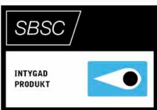
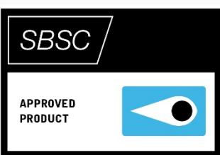
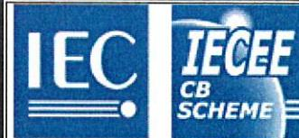
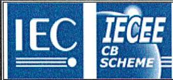

Enligt "Certifieringsbestämmelser Produktcertifiering" Svensk Brand- och Säkerhetscertifiering AB, Tegeluddsvägen 100, 115 28 Stockholm, Sweden

# Nr 21-203

# Strömförsörjningsutrustning PSV 1265, 1235, 1215 Larmklass 3

uppfyller kraven i larmklass 3 Miljöklass II enligt SSF 1014, utgåva 5

Intygsinnehavare är

Alarmtech Sweden AB Staffans väg 6A Sollentuna

Intyget gäller 2021-06-15 till och med 2026-06-14

Stockholm den 2021-06-15

Mårten Wallén Verkställande direktör

According to "Certification regulations Product Certification" Svensk Brand- och Säkerhetscertifiering AB, Tegeluddsvägen 100, 115 28 Stockholm, Sweden

# No21-203

# Power supply equipment PSV 1265, 1235, 1215 Larmklass 3

Fulfils the requirements in Alarm Class 3 Environmental Class II according to SSF 1014, utgåva 5

Certificate holder is

Alarmtech Sweden AB Staffans väg 6A , Sollentuna

The approval is valid 2021-06-15 until 2026-06-14

Stockholm 2021-06-15

Mårten Wallén Managing Director

#### Ref. Certif. No.

SE-100168

#### IEC SYSTEM FOR MUTUAL RECOGNITION OF TEST CERTIFICATES FOR ELECTRICAL EQUIPMENT (IECEE) CB SCHEME

#### CB TEST CERTIFICATE

Product DC Power Supply, Type A Name and address of the applicant ALARMTECH SWEDEN AB Box 7079 192 07 Sollentuna, Sweden Name and address of the manufacturer Same as factory Name and address of the factory Alarmtech Polska sp. z o.o. Note: When more than one factory, please report on page 2 ul. Kusocinskiego 3, 83-140 Gniew, Poland Ratings and principal characteristics See page 2 Trademark (if any) ALARMTECH Customer's Testing Facility (CTF) Stage used -Model / Type Ref. PSV 12**-**, PSV 24**-** Additional information (if necessary may also be See page 2 reported on page 2) A sample of the product was tested and found IEC 62368-1:2014 to be in conformity with As shown in the Test Report Ref. No. which forms part 1914233STO-001 of this Certificate This CB Test Certificate is issued by the National Certification Body Intertek Semko AB Torshamnsgatan 43 intertek Box 1103 SE-164 22 Kista, Sweden Signature: Date: 24 February, 2020 Leif Söderlund

Ref. Certif. No.

### SE-100168

#### Ratings and principal characteristics

Input: 230VAC, 0.4A alt. 0.6A, alt. 0.7 alt. 0.9 alt. 1.7A, 50Hz, Class I Output: 27.6VDC alt. 13.8VDC, 1.5A alt. 3.5A alt. 6.5A total max. Battery capacity: 12V alt. 2x12V, 7Ah alt. 12Ah alt. 18Ah alt. 40Ah

#### Additional information

Explanation of models PSV 12**-**, PSV 24**-**

The first "**" in the model name denotes max current output 1.5A, 3.5A or 6.5A. The built-in power supply module is programmed per 100mA including max battery charging current.

The second "*" denotes the box the module is mounted in. The Boxes are called A1, B1, B2, and R1.

The product has also been checked according to EN 62368-1:2014 +A11:2017.

Date: 24 February, 2020

Signature:

# Certificate of Conformity with European standards for Components and Systems

Number of Certificate Valid from Valid until dd-mm-yyyy dd-mm-yyyy EN-ST-000279 12-04-2021 11-04-2025 Subject matter of Certificate: Power supply equipment grade 3 PSV 1265-M / PSV 1235-M / PSV 1215-M

Owner of Certificate:

#### Alarmtech Sweden AB Staffans Vag 6A SE-192 78 SOLLENTUNA Sweden

Basis for certification:

#### EN 50131-6:2017

Use, the product disposes of the following parameters:

Intrusion and hold-up systems, Grade 3

The tests were carried out at VdS Schadenverhütung GmbH and the results are documented in test report:

201395-AU01+STE01-PB01 dated 07-04-2021

To guarantee the permanent quality of products a regular surveillance of the manufacturing process is performed.

This certificate comprises 5 pages and shall only be reproduced without any modifications and including all enclosures.

Date: 12-04-2021

Managing director

Head of certification body

VdS Schadenverhütung GmbH Certification Body Amsterdamer Str. 174 D-50735 Köln

A company of the German Insurance Association (GDV) accredited by DAkkS as certification body for fire protection and security products

#### Enclosure 1

To Certificate No .: EN-ST-000279

Date : 12-04-2021

The approved component/system comprises the following parts:

| Description of component                                                                | Type                                       | Applicant's Registration No. | Approval number of component (only complete for system approval) |
|-----------------------------------------------------------------------------------------|--------------------------------------------|------------------------------|---------------------------------------------------------------------------|
| Power supply with PCB version F2 and software version 1.13 in sheet-steel housing | PSV 1265-M / PSV 1235-M / PSV 1215-M |                              |                                                                           |
| In the versions:                                                                        |                                            |                              |                                                                           |
| 1. In the housing type A1                                                               |                                            |                              |                                                                           |
| consisting of:                                                                          |                                            |                              |                                                                           |
| - PCB E354672                                                                           |                                            |                              |                                                                           |
| - Optical display                                                                       |                                            |                              |                                                                           |
| - Metal housing                                                                         | A1                                         |                              |                                                                           |
| - Back tamper                                                                           |                                            |                              |                                                                           |
| - 2 maintenace-free batterys with each max. 12V/40Ah                                 |                                            |                              |                                                                           |
| 2. In the housing type B1                                                               |                                            |                              |                                                                           |
| consisting of:                                                                          |                                            |                              |                                                                           |
| - PCB E354672                                                                           |                                            |                              |                                                                           |
| - Optical display                                                                       |                                            |                              |                                                                           |
| - Metal housing                                                                         | B1                                         |                              |                                                                           |
| - Back tamper                                                                           |                                            |                              |                                                                           |
| - maintenace-free battery with max. 12V/18Ah                                         |                                            |                              |                                                                           |
|                                                                                         |                                            |                              |                                                                           |
|                                                                                         |                                            |                              |                                                                           |
|                                                                                         |                                            |                              |                                                                           |
|                                                                                         |                                            |                              |                                                                           |
|                                                                                         |                                            |                              |                                                                           |
|                                                                                         |                                            |                              |                                                                           |

#### Enclosure 1

To Certificate No .: EN-ST-000279

Date : 12-04-2021

The approved component/system comprises the following parts:

| Description of component                                | Type | Applicant's Registration No. | Approval number of component (only complete for system approval) |
|---------------------------------------------------------|------|------------------------------|---------------------------------------------------------------------------|
| 3. In the housing type B2                               |      |                              |                                                                           |
| consisting of:                                          |      |                              |                                                                           |
| - PCB E354672                                           |      |                              |                                                                           |
| - Optical display                                       |      |                              |                                                                           |
| - Metal housing                                         | B2   |                              |                                                                           |
| - Back tamper                                           |      |                              |                                                                           |
| - 2 maintenace-free batterys with each max. 12V/18Ah |      |                              |                                                                           |
| 4. In the housing type B3                               |      |                              |                                                                           |
| consisting of:                                          |      |                              |                                                                           |
| - PCB E354672                                           |      |                              |                                                                           |
| - Optical display                                       |      |                              |                                                                           |
| - Metal housing                                         | B3   |                              |                                                                           |
| - Back tamper                                           |      |                              |                                                                           |
| - 2 maintenace-free batterys with each max. 12V/18Ah |      |                              |                                                                           |
|                                                         |      |                              |                                                                           |
|                                                         |      |                              |                                                                           |
|                                                         |      |                              |                                                                           |
|                                                         |      |                              |                                                                           |
|                                                         |      |                              |                                                                           |
|                                                         |      |                              |                                                                           |
|                                                         |      |                              |                                                                           |

#### Enclosure 2

To Certificate No .: EN-ST-000279

Date : 12-04-2021

The approved component/system is described as follows:

| Type of document                                                  | Manufacturer's identification     | Date       | Number of Pages |
|-------------------------------------------------------------------|-----------------------------------|------------|-----------------------|
| Datasheet, Installation instructions and Manual PSV 12V series | PSV 12V series 2113en             | 04/2021    | 6                     |
| PSV series modules                                                | PSV modules 2113en                | 04/2021    | 5                     |
| GreyLine                                                          | GreyLine 2114en-R2                | 04/2021    | 12                    |
| Circuit and assembly diagrams:                                    |                                   |            |                       |
| - PSV-2465                                                        | PSV-2465-F - Rev. F2              | 14.03.2017 | 2                     |
| - PSV-2465                                                        | PSV-2465 F2 1710                  | 14.03.2021 | 1                     |
| Construction drawings:                                            |                                   |            |                       |
| PSV-PSA Cage                                                      | PSV-PSA Cage assembly - Rev. 0.19 | 23.03.2021 | 5                     |
| A1 Box                                                            | assembly - Rev. 0.3               | 31.03.2012 | 2                     |
| box A1                                                            | A1 support - Rev. 0.3             | 31.03.2021 | 1                     |
| B1 box                                                            | assembly - Rev. 0.1               | 12.12.2019 | 4                     |
| B2 BOX                                                            | assembly - Rev. 0.1               | 12.12.2019 | 5                     |
| B3 BOX                                                            | assembly - Rev. 0.2               | 26.06.2020 | රි                    |
| Module Labels                                                     | Report No. 1918312STO-001         | 04/2021    | 2                     |
| Housing Labels                                                    | Report No. 1914233STO-001         | 04/2021    | 2                     |
| Bill of material:                                                 |                                   |            |                       |
| PSV-1265                                                          | PSV-1265-F - Rev. F2              | 07.04.2021 | 6                     |
|                                                                   |                                   |            |                       |

Enclosure 3

To Certificate No.: EN-ST-000279

Date : 12-04-2021

Instructions for the application of the approval component/system (see enclosure 1):

None

# C EN, ROHS, REACH and WEEE

### MANUFACTURERS DECLARATION OF CONFORMITY

#### Product: Power supply unit, VIP Article: PSV 12xx

We declare under sole responsibility that the products are in conformity of the following European Parliament and European Council standards and regulations

| Production: | The company is certified and produces the products in accordance to                             |
|-------------|-------------------------------------------------------------------------------------------------|
|             | ISO 9001:2015, ISO 14001:2015 and ISO 45001:2018                                                |
| LVD:        | Low Voltage Directive 2014/35/EU                                                                |
| EMC:        | Electro-Magnetic Compatibility Directive 2014/30/EU                                             |
|             | RoHS2/RoHS3: Directive 2011/65/EU on the restriction of the use of certain hazardous substances |
|             | in electrical and electronic equipment; Directive 2015/863 amending Annex II to                 |
|             | Directive 2011/65/EU of the European Parliament and of the Council as regards                   |
|             | the list of restricted substances                                                               |
| REACH:      | Regulation 1907/2006 concerning the registration, evaluation, authorisation and                 |
|             | restriction of chemicals                                                                        |
| WEEE:       | Directive 2012/19/EU on waste electrical and electronic equipment                               |
|             |                                                                                                 |
| Safety:     | EN 62368-1:2014+A11:2017                                                                        |
| Emission:   | EN 61000-6-3:2007+A1:2011                                                                       |
|             | Alarm Systems: EN 50130-4:2011+A1:2014, EN 50130-5:2011 Class II,                               |
|             | EN 50131-6:2017                                                                                 |

Gniew, Poland 2021-12-03

. Hardine . Pelowster ... ....... . . . . . . . Karolina Pelowska Quality Manager