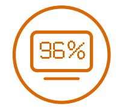
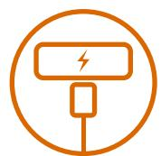

# *Robust power for almost any situation*

*EZVIZ PS600 Portable Power Station*

USB-C Fast Charging (Up to 60W)

Versatile Recharging Methods (Solar charging supported)2

Up to 1,000 Full Charge Cycles3

9 Ports for Multi-Device Charging (Up to 816W Output)1

Durable Lithium Battery Built-In LED Light

with 3 Adjustable Modes

Compact, Space-Saving Design

Low Noise Technology4

Smart Display

607Wh Total Battery Capacity

With a generous, 607Wh power capacity, EZVIZ's PS600 Portable Power Station provides you with plenty of power in virtually any situation – traveling, enjoying the outdoors, experiencing electrical outages, or working on special projects that require portable energy. It's designed to charge your essentials via five different ports, including the USB-C fast charging option. The lightweight, travel-friendly PS600 can be carried and stored easily with its space-saving design,and is more than durable enough for everyday use.

*Enjoy the outdoors just like home Plan road trips with enough power Power your creative filming projects* 

The PS600 is a powerhouse to help you explore nature further than ever before. Whether you are camping, enjoying a family outing, or just going wherever the road takes you, the PS600 is ready to charge your essential electronics and small appliances5 via fast-charging USB-C and other ports.

# Your grab-and-go power for outdoor adventures

The PS600 stores easily in your garage or utility room without taking up much space. Whenever your house experiences an electrical outage, you'll have easy access to emergency power.

# Less anxiety for an electricity blackout

### *Also works with*

CPAP Machine (40W) Fish Tank (500W) Desktop Heater (500W)

Whether you need to charge multiple devices at once or your family and friends want to share the power, the PS600 is ready to satisfy any demand. Five different types of ports - 9 ports in total - provide the power outputs1 that everybody needs.

# Share the power with multiple charging ports

Lithium batteries ensure up to 1,000 full charge cycles for extensive everyday use and manage to maintain 80% battery capacity after 1,000 full cycles.

The on-board BMS helps prolong the lifespan of the PS600, by constantly monitoring how well the machine operates, including voltage, current, temperature, etc.

# A safe, durable battery on the go

The PS300 is designed to reduce excessive noise levels while

efficiently charging devices4

. It's great when you're working or

sleeping as it powers up your essential devices.

Be sure to include the PS600 power station in your travel packing checklist. Thanks to its lightweight and space-saving design, it's made to go on the road.

> The PS600 is designed to reduce excessive noise levels while efficiently charging devices4 . It's great when you're working or sleeping as it powers up your essential devices.

# Lightweight, quiet, and travel-friendly

Select from 4 versatile ways to recharge your power station. The PS600 is also solar-compatible to work with green energy sources.

# Choose how you recharge

## Smart display at a glance

Solar Panel Recharging2

DC Input Recharging

See all the charging and recharging details, temperatures, and any operational warnings on the PS600 power station, with a quick glance.

# Built-in LED light for extra convenience

Whenever you can't reach a flashlight in an emergency or need extra ambient light for the great outdoors, just turn on PS600's built-in LED and enjoy! Three illumination options give you just the light you need.

> *3 Light Modes*  Ambient ┃ Bright ┃ Flashlight

1 The maximum total output of the PS600 is 816W. If the output of the appliance's actual use surpasses that value, the Error Indicator on the smart screen will be displayed.

- 2 A compatible solar panel must be purchased separately and will be available from EZVIZ soon.
- 3 Based on test results from the EZVIZ Lab. After 1,000 full charge circles, the battery capacity will drop to around 80% of its original capacity.
- 4 When charging high-wattage devices or appliances via the AC outlet (as per instruction stated in the User Manual), the power station may operate at an increased noise level. This will be due to the operation of built-in cooling fans.
- 5 The PS600 can only properly charge small-to-medium devices/appliances that have a maximum output of less than 600W. The numbers of each device's charging efficiency is based on testing results under standard conditions and may vary during actual use due to environmental factors.

- 0 °C to 40 °C (32 °F to 104 °F)
- -10 °C to 40 °C (14 °F to 104 °F)

# Specifications CN040 (EU Version)

| Capacity           | 607Wh (14.6V)                                                                                                                                                                            |
|--------------------|------------------------------------------------------------------------------------------------------------------------------------------------------------------------------------------|
| Type               | NCM Lithium-ion                                                                                                                                                                          |
| Cycle Life         | 1000 Cycles to 80%+ capacity                                                                                                                                                             |
| Management Systems | Over Voltage Protection, Overload Protection, Over Temperature Protection, Short Circuit Protection, Low Temperature Protection, Low Voltage Protection, Overcurrent Protection |
| General            |                                                                                                                                                                                          |
| Net Weight         | 6.5 kg (229 oz)                                                                                                                                                                          |

| Input              | Battery                                                                                       |  |
|--------------------|-----------------------------------------------------------------------------------------------|--|
| Method             | Using DC input port: Adapter, car port, solar panel Using 2-prong port: AC charging cable  |  |
| Full Recharge Time | AC charging cable: 8~9 hours Car port (12/24V): 5~6 hours Solar Panel (200W): 4~6 Hours |  |
| AC Port            | 210~245Vac 50Hz (80W Max)                                                                     |  |
| DC 7909 port       | 10V-30V 10A (200W Max)                                                                        |  |

Input

| AC Outlets (×2)      | 210V~245Vac( 50Hz) Single: 600W                                                       | Net Weight            | 6.5 kg (229 oz)                           |
|----------------------|------------------------------------------------------------------------------------------|-----------------------|-------------------------------------------|
|                      | Total: 600W Surge: 1200W                                                              | Size                  | 20 × 20 × 25 cm (7.87 × 7.87 × 9.84 inch) |
| USB-A Outlets (×3)   | Single: 5V 2.4A 12W Max Total: 36W Max                                                | Charge Temperature    | 0 °C to 40 °C (32 °F to 104 °F)           |
| USB-C Outlet (×1)    | 5V 3A / 9V 3A / 15V 3A / 20V 3A (60W Max) Compliance with PD Protocol                 | Discharge Temperature | -10 °C to 40 °C (14 °F to 104 °F)         |
| Car Outlet (×1)      | 12-14V 10A When the DC 5521 and car outlet works at the same                       | Color                 | Cyber Black                               |
| DC 5521 Outlets (x2) | time, the max output of the two outlets is 120W. 12-14V 5A                         |                       |                                           |
| Max. Output          | 600W (Does not support large appliances such as microwave, hair dryer and hot plate.) |                       |                                           |
|                      |                                                                                          |                       |                                           |

### Output

# In the box

- PS600 Power Station CE / RoHS / REACH / MSDS

- 
- AC Charging Cable
- Car Charging Cable
- Solar Panel Charging MC4 Cable
- Quick Start Guide
- Regulatory Information

# Certifications