# *Ready to deliver grab-and-go power*

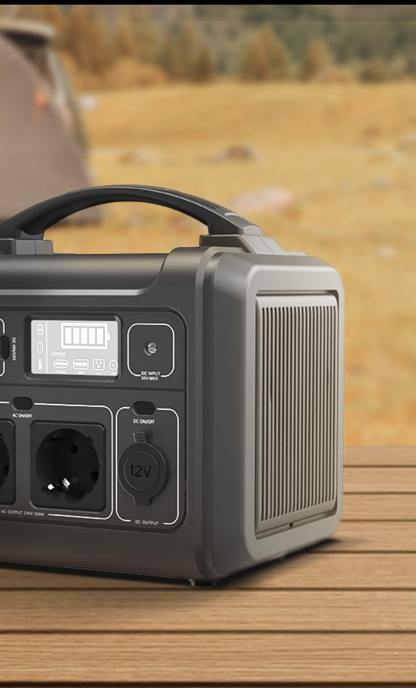

*EZVIZ PS300 Portable Power Station*

313Wh Total Battery Capacity

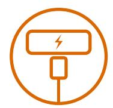

USB-C Fast Charging and Easy Recharging (Up to 60W)

Supports Solar Panel Recharging2

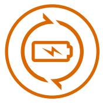

Up to 1,000 Full Charge Cycles3

4 Types of Ports for Multi-Device Charging1

Durable Lithium Battery Built-In LED Light Compact,

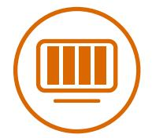

Space-Saving Design

Low Noise Technology4

### Smart Display

On your next outdoor adventure, take EZVIZ's latest PS300 Portable Power Station with you and say goodbye to the battery anxiety. And when your home electricity goes out, you can also have the emergency power you need. Compact and light-weight to use anywhere, the PS300 can charge multiple devices via four type of ports – including USB-C fast charging. Durable and easy to recharge, the PS300 gives you reliable power whenever you need.

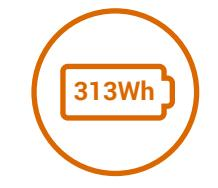

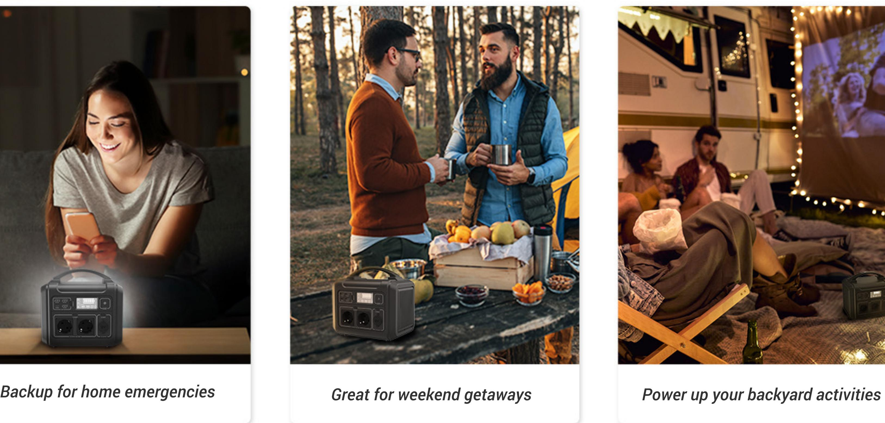

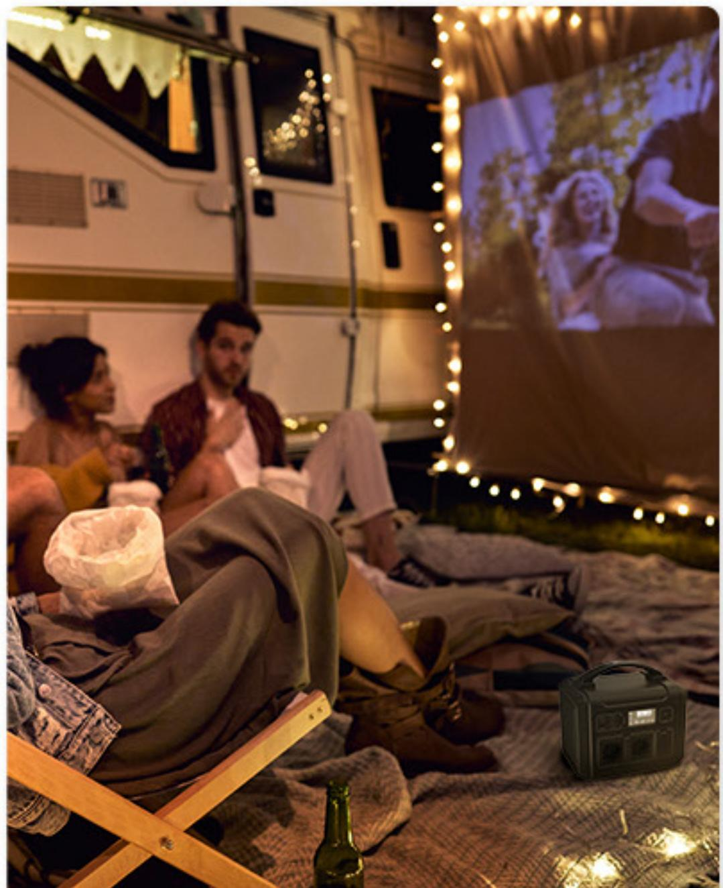

A power station comes in handy under various situation. In case of sudden power blackout or emergencies, it provides peace of mind. Make it a regular part of your outdoor adventures for easy, worry-free power.

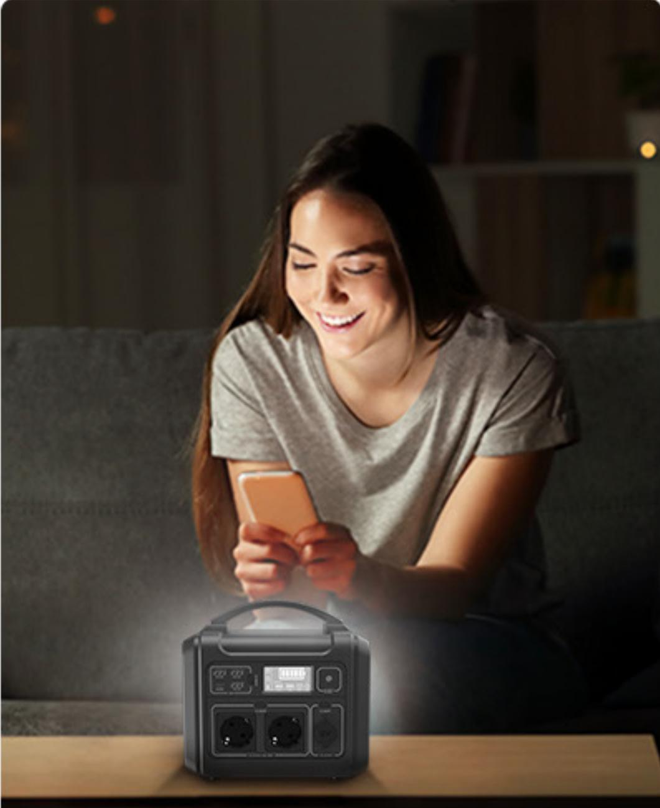

# **Get power for any situation**

Whether you're a frequent camper or you just plan family outings once in a while, a portable power station may be the first thing you should pack. The compact PS300 powers your essential electronics and small appliances5 via fast-charging USB-C and other ports.

# **Ideal for adventurous spirits**

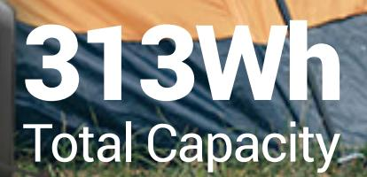

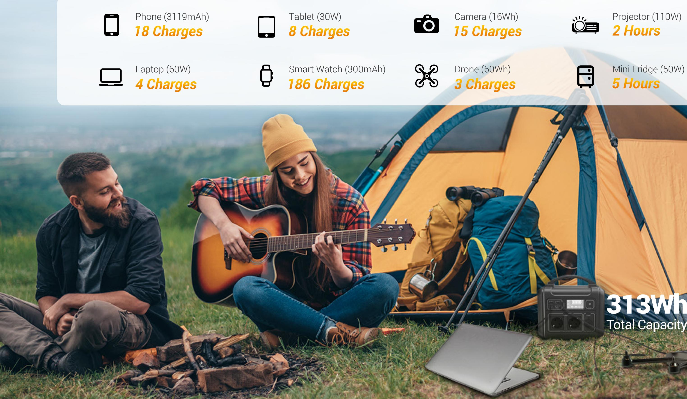

Whether you need to charge multiple devices at once, or your family and friends want to share the power, the PS300 is ready to satisfy the demand. Four different types of ports provide the power outputs1 that everybody needs.

### Multiple charging ports to satisfy multiple uses

The PS300 stores easily in your garage or utility room without taking up much space. Whenever your house experiences an electrical outage, you'll have easy access to emergency power.

### Less anxiety for an electricity blackout

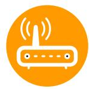

Wi-Fi Router (10W) **22 Hours**

**22 Hours 12 Hours**

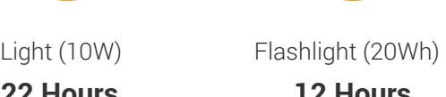

Fan (30W) **7 Hours**

43-inch TV (110W) **2 Hours**

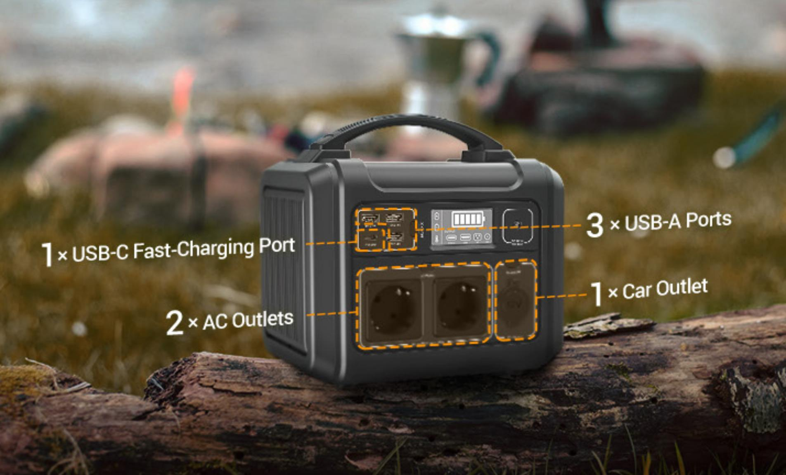

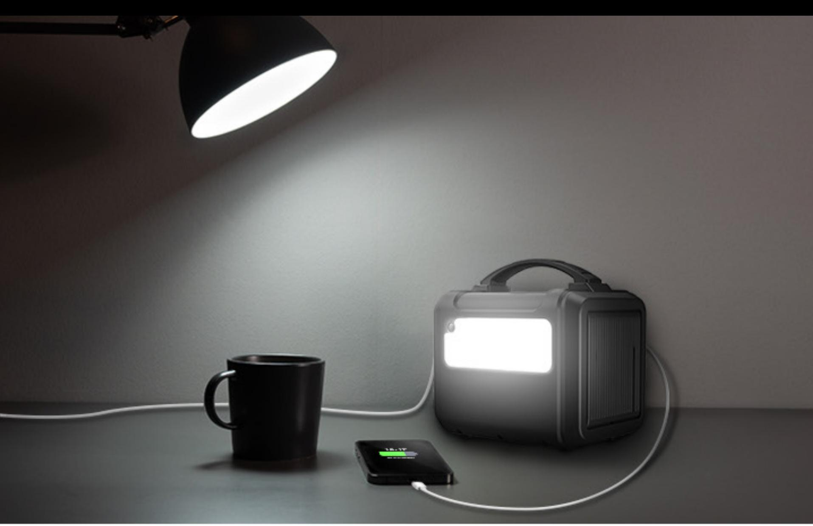

Lithium batteries ensure up to 1,000 full charge cycles for extensive everyday use and manage to maintain 80% battery capacity after 1,000 full cycles.

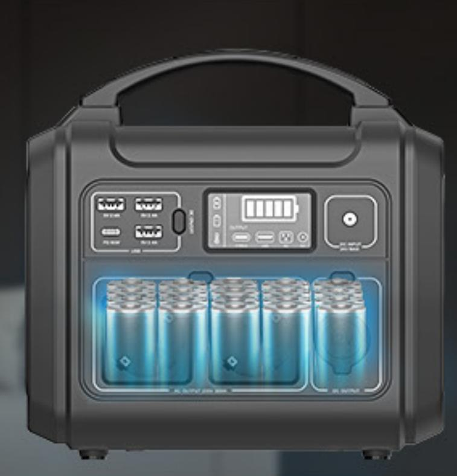

The on-board BMS helps prolong the lifespan of the PS300, by constantly monitoring how well the machine operates, including voltage, current, temperature, etc.

### A safe, durable battery on the go

### Lightweight, quiet, and travel-friendly

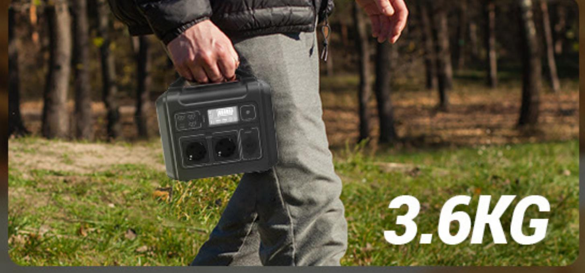

The PS300 is among the most portable power stations in the market, thanks to its space-saving design and comfortable handle. Its Lithium batteries manage to pack higher power density with a lighter weight.

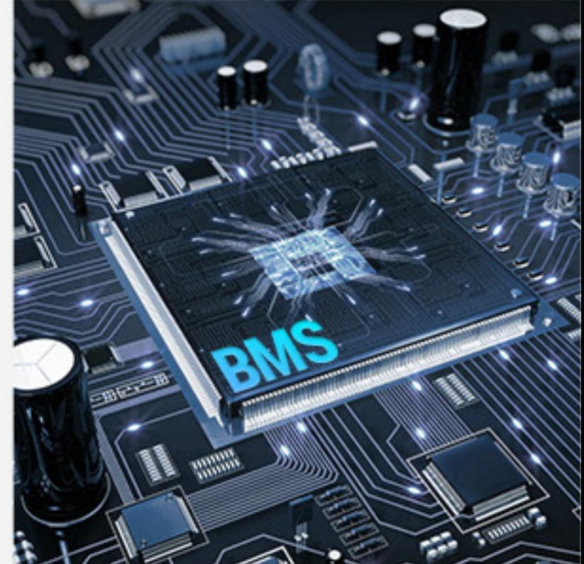

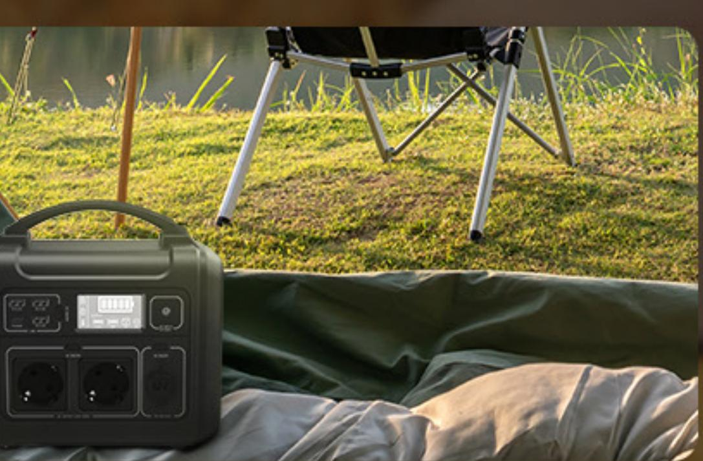

The PS300 is designed to reduce excessive noise levels while efficiently charging devices4 . It's great when you're working or sleeping as it powers up your essential devices.

Choose from multiple and versatile ways to recharge your power station. The PS300 is also solar-compatible to work with green energy sources.

### Recharging can be this easy

### Smart display at a glance

Solar Panel Recharging2

(Up to 60W)

See all the charging and recharging statuses, temperatures, and any operational warnings

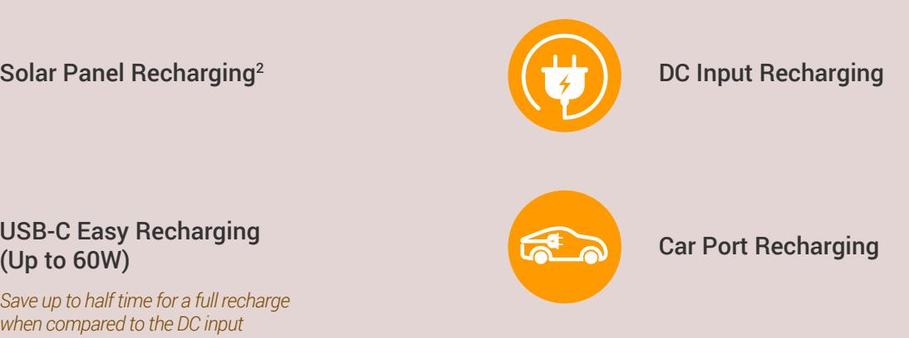

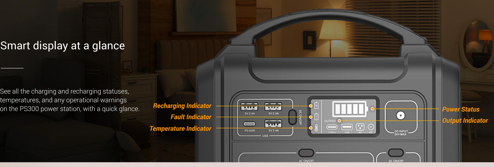

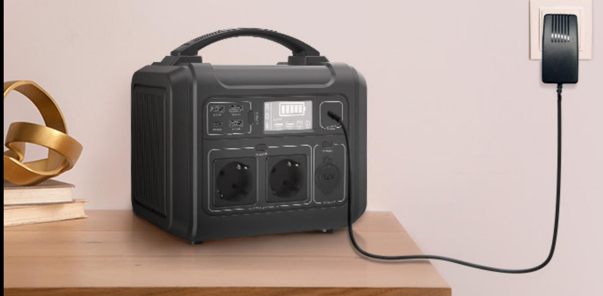

*Temperature Indicator*

### Built-in LED light for extra convenience

Whenever you can't reach a flashlight in emergencies or need extra ambient light for the great outdoors, just turn on PS300's built-in LED light for illumination.

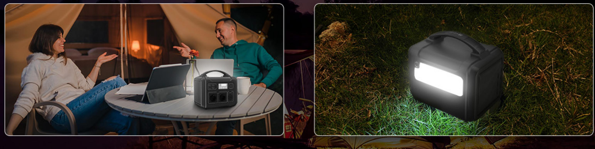

- 1 The maximum total output of the PS300 is 330W. If the output of the appliance's actual use surpasses that value, the Error Indicator on the smart screen will be displayed.
- 2 A compatible solar panel must be purchased separately and will be available from EZVIZ soon.
- 3 Based on test results from the EZVIZ Lab. After 1,000 full charge circles, the battery capacity will drop to around 80% of its original capacity.
- 4 When charging high-wattage devices or appliances via the AC outlet (as per instruction stated in the User Manual), the power station may operate at an increased noise level. This will be due to the operation of built-in cooling fans.
- 5 The PS300 can only properly charge small-to-medium devices/appliances that have a maximum output of less than 300W. The numbers of each device's charging efficiency is based on testing results under standard conditions and may vary during actual use due to environmental factors.

## Specifications CN032 (EU Version)

### Output (When recharging)

### Output (When AC port functioning)

USB-A Outlets (×3) Single: 5V 2.4A (12W Max) Total: 15W Max

USB-C Outlet (×1) 15W Max

Car Outlet (×1) Does not support

AC Outlets (×2) Does not support

USB-A Outlets (×3) Single: 5V 2.4A (12W Max) Total: 30W Max

USB-C Outlet (×1) Does not support

Car Outlet (×1) Does not support

| Capacity | 313Wh (10.95V) |
|----------|----------------|
|----------|----------------|

Type NCM Lithium-ion

Lifecycle 1000 Cycles to 80%+ capacity

| Method             | Using DC input port: Solar panel, car port, AC adapter Using USB-C port: USB-C cable | AC Outlets (×2) /     |
|--------------------|-----------------------------------------------------------------------------------------|--------------------------|
| Full Recharge Time | USB-C cable: 5~6 hours Solar panel: 7~8 hours                                        |                          |
|                    | Car port (12V/24V): 10~12 hours AC adapter: 7~10 hours                               |                          |
| DC 5521            | Solar panel & car port: 5-24V 2A (48W Max)                                              |                          |
|                    | AC adapter: 18V 2A (36W Max)                                                            |                          |
| USB-C              | 5V 3A / 9V 3A / 15V 3A / 20V 3A (60W Max) Compliance with PD Protocol                | Output (When recharging) |
| Solar Panel Input  | 12-24V 2A (48W Max)                                                                     |                          |
|                    |                                                                                         |                          |

- Management System Over Voltage Protection, Overload Protection, Over Temperature Protection, Short Circuit Protection, Low Temperature Protection, Low Voltage Protection, Overcurrent Protection
Input

| AC Outlets (×2)    | 210V~245Vac( 50Hz) Single: 300W Total: 300W Surge: 500W                         | Battery |
|--------------------|------------------------------------------------------------------------------------------|---------|
| USB-A Outlets (×3) | Single: 5V 2.4A (12W Max) Total: 30W Max                                              |         |
| USB-C Outlet (×1)  | 5V 3A / 9V 3A / 15V 3A / 20V 3A (60W Max) Compliance with PD Protocol                 |         |
| Car Outlet (×1)    | 9-12.6V 10A (120W Max)                                                                   |         |
| Max. Output        | 330W (Does not support large appliances such as microwave, hair dryer and hot plate.) |         |

Output

## Specifications CN032 (EU Version)

General

| Net Weight            | 3.61 kg (127.34 oz)                             |  |
|-----------------------|-------------------------------------------------|--|
| Size                  | 14.5 × 21.2 × 21.2 cm (5.71 × 8.35 × 8.35 inch) |  |
| Charge Temperature    | 0 °C to 40 °C (32 °F to 104 °F)                 |  |
| Discharge Temperature | -10 °C to 40 °C (14 °F to 104 °F)               |  |
| Color                 | Cyber Black                                     |  |
|                       |                                                 |  |

## In the box

- PS300 Power Station CE / RoHS / REACH / MSDS
- AC Adapter
- Car Charging Cable
- Solar Panel Charging MC4 Cable
- Quick Start Guide
- Regulatory Information

