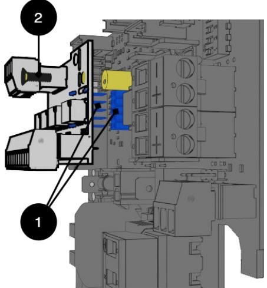
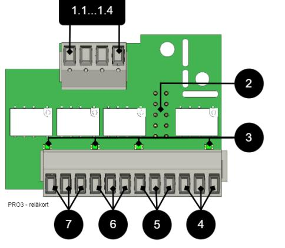
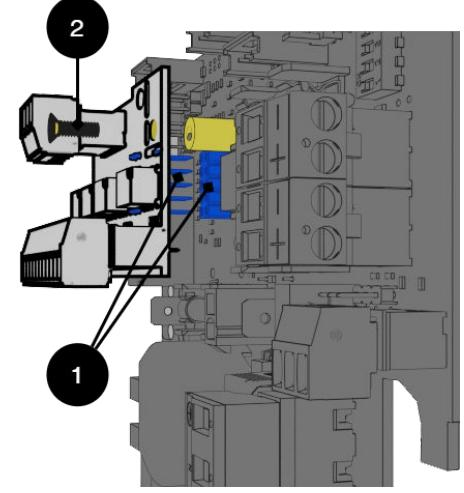
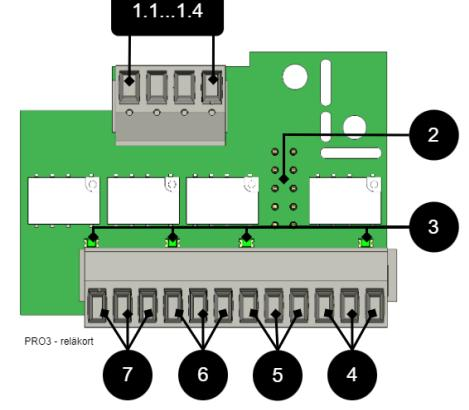

# OM RELAY CARD NOVA SERIES (PRO3)

Med 4 st. reläutgångar för system som levererats med PRO3-moderkort.

Montering av Relay card NOVA Series på moderkort-PRO3

Reläkort monteras på plint på moderkort

## Montering

| Nr | Förklaring                          |
|----|-------------------------------------|
|    |                                     |
| 1  | Stift och stiftlist för anslutning. |
| 2  | Skruv för att säkra montering.      |

Kortbeskrivning - Relay Card NOVA Series (PRO3)

Reläkort - beskrivning, anslutningar och larmutgångar.

- Alla fellarmsreläer skall vara i draget tillstånd. Kontrollera att slutning finns mellan CO och NC. Sätt mätinstrumentet på kontinuitetsmätning och testa slutning. Denna skall då indikera kortslutning.
- Alla reläer är normalt spänningssatta och ger larm vid spänningslöst läge.

| Nr     | Plint nr | Relä är normalt spänningssatt | Larmtyp eller förklaring                                                                                                                                                       |
|--------|----------|----------------------------------|--------------------------------------------------------------------------------------------------------------------------------------------------------------------------------|
| 1.11.4 | P4:1     | -                                | GND, Jord                                                                                                                                                                      |
|        | P4:2     | -                                | RX                                                                                                                                                                             |
|        | P4:3     | -                                | TX                                                                                                                                                                             |
|        | P4:4     | -                                | +5V                                                                                                                                                                            |
| 2      | JU5      | -                                | Anslutning till moderkort.                                                                                                                                                     |
| 3      | D2-D6    | -                                | Indikeringsdiod, lyser grönt vid OK.                                                                                                                                           |
| 4      | P5:10-12 | NC, COM, NO                      | Larm från sabotagebrytare, (tillval för NEO och EN54).                                                                                                                      |
| 5      | P5:7-9   | NC, COM, NO                      | Låg systemspänning.                                                                                                                                                            |
| 6      | P5:4-6   | NC, COM, NO                      | Larm för säkringsfel, laddarfel överspänning, laddarfel underspänning, ej anslutet batteri, låg batterispänning vid nätavbrott samt åldrat batteri*. *Endast NOVA. |
| 7      | P5:1-3   | NC, COM, NO                      | Nätavbrottslarm.                                                                                                                                                               |

## Tekniska data, Relay Card NOVA Series (PRO3/NEO3)

| Info      | Förklaring    |  |  |
|-----------|---------------|--|--|
| Kortnamn: | PRO3 larmkort |  |  |

| Info                              | Förklaring                                                                                                                                                                                                                                                                                   |  |  |  |
|-----------------------------------|----------------------------------------------------------------------------------------------------------------------------------------------------------------------------------------------------------------------------------------------------------------------------------------------|--|--|--|
| Version:                          | 1.2                                                                                                                                                                                                                                                                                          |  |  |  |
| Produktbeskrivning                | Larmkort för PRO3 eller NEO 3 med larm på växlande relä. Alla reläer är normalt spänningssatta och ger larm vid spän ningslöst läge.                                                                                                                                                   |  |  |  |
| Rekommenderad miljö               | Inomhus, klass 1. Omgivningstemperatur: +5°C – 40°C.                                                                                                                                                                                                                                         |  |  |  |
| Skyddsklass                       | IPX0                                                                                                                                                                                                                                                                                         |  |  |  |
| Rekommenderad montering           | NOVA Serien (endast 5 A och 10 A)                                                                                                                                                                                                                                                            |  |  |  |
| Ingångsspänning                   | 13,6 VDC, 27,3 VDC                                                                                                                                                                                                                                                                           |  |  |  |
| Egenförbukrning                   | 40 mA                                                                                                                                                                                                                                                                                        |  |  |  |
| Larm via                          | Växlande relä                                                                                                                                                                                                                                                                                |  |  |  |
| Antal larmutgångar                | 4 st.                                                                                                                                                                                                                                                                                        |  |  |  |
| Certifierad enligt                | EN 50131-6, SBF 110:8, SSF1014, Uppfyller larmklass 4, SSF 1014, utgåva 5                                                                                                                                                                                                                 |  |  |  |
| Certifikatsnummer (SBSC)          | 20-117                                                                                                                                                                                                                                                                                       |  |  |  |
| Produkten möter kraven en ligt | CE direktivet enligt: 765/2008, EMC Direktiv 2014/30EU, Emis sion: EN61000-6-:2001, EN55022:1998:-A1:2000, A2:2003 Klass B, EN61000-3-2:2001, Immunity: EN61000-6-2:2005, EN61000-4-2, -3, 4, -5, -6, -11. SS-EN 50 130-4:2011 Edition 2 & SSF1014 Larmklass 1-4 (Inbrottslarm). |  |  |  |
| Producent                         | Milleteknik AB                                                                                                                                                                                                                                                                               |  |  |  |
| Ursprungsland                     | Sverige                                                                                                                                                                                                                                                                                      |  |  |  |

Tillverkad i Milletekniks fabrik i Partille, Sverige.

Bruksanvisning i original: Svenska.

Larmöversikt

| Larmöversikt i bokstavsord ning | Relä 1* / Lar mut gång 1 | Relä 2* / Lar mut gång 2 | Relä 3* / Lar mut gång 3 | Relä 4* / Lar mut gång 4 | RS-232 kommuni kation (P5:1-9) - Gäller en dast enhe ter med system stöd, (Bra vida). | Indiker ingsdiod på hu vudkort och LED på dörr. |
|---------------------------------------|--------------------------------------|--------------------------------------|--------------------------------------|--------------------------------------|------------------------------------------------------------------------------------------------------------------|----------------------------------------------------------------|
| Nätavbrott                            | X                                    | -                                    | -                                    | -                                    | X                                                                                                                | X                                                              |
| Säkringsfel                           | -                                    | X                                    | -                                    | -                                    | X                                                                                                                | X                                                              |
| Sabotagebryta re                   | -                                    | -                                    | -                                    | X                                    | X                                                                                                                | X                                                              |

| Larmöversikt i bokstavsord ning                                       | Relä 1* / Lar mut gång 1 | Relä 2* / Lar mut gång 2 | Relä 3* / Lar mut gång 3 | Relä 4* / Lar mut gång 4 | RS-232 kommuni kation (P5:1-9) - Gäller en dast enhe ter med system stöd, (Bra vida). | Indiker ingsdiod på hu vudkort och LED på dörr. |
|-----------------------------------------------------------------------------|--------------------------------------|--------------------------------------|--------------------------------------|--------------------------------------|------------------------------------------------------------------------------------------------------------------|----------------------------------------------------------------|
| Fläktfel                                                                    | -                                    | -                                    | -                                    | -                                    | X                                                                                                                | -                                                              |
| Laddarfel, över spänning                                                 | -                                    | X                                    | -                                    | -                                    | X                                                                                                                | X                                                              |
| Laddarfel, un derspänning                                                | -                                    | X                                    | -                                    | -                                    | X                                                                                                                | X                                                              |
| Cellfel eller ej anslutet batteri                                        | -                                    | X                                    | -                                    | -                                    | X                                                                                                                | X                                                              |
| Låg systems pänning, (sy stemspänning under 24,0 V i nätdrift). | -                                    | -                                    | X                                    | -                                    | X                                                                                                                | X                                                              |
| Låg batteris pänning (<24,0 V DC) eller nä tavbrott                | -                                    | X                                    | -                                    | -                                    | X                                                                                                                | X                                                              |
| Övertemperatur                                                              | -                                    | -                                    | -                                    | -                                    | X                                                                                                                | -                                                              |
| Undertempera tur                                                         | -                                    | -                                    | -                                    | -                                    | X                                                                                                                | -                                                              |
| Undertempera tur                                                         | -                                    | -                                    | -                                    | -                                    | X                                                                                                                | -                                                              |
| Kort batteritid kvar                                                     | -                                    | -                                    | -                                    | -                                    | X                                                                                                                | -                                                              |
| Åldrat batteri**                                                            | -                                    | X**                                  | -                                    | -                                    | X**                                                                                                              | X**                                                            |
| Överström 100 %, minutmedel värde                                     | -                                    | -                                    | -                                    | -                                    | X                                                                                                                | -                                                              |
| Överström 80 %, dygnsme delvärde                                      | -                                    | -                                    | -                                    | -                                    | X                                                                                                                | -                                                              |
| Överström 175 %, sekundme delvärde                                    | -                                    | -                                    | -                                    | -                                    | X                                                                                                                | -                                                              |

| Larmöversikt i bokstavsord ning | Relä 1* / Lar mut gång 1 | Relä 2* / Lar mut gång 2 | Relä 3* / Lar mut gång 3 | Relä 4* / Lar mut gång 4 | RS-232 kommuni kation (P5:1-9) - Gäller en dast enhe ter med system stöd, (Bra vida). | Indiker ingsdiod på hu vudkort och LED på dörr. |
|---------------------------------------|--------------------------------------|--------------------------------------|--------------------------------------|--------------------------------------|------------------------------------------------------------------------------------------------------------------|----------------------------------------------------------------|
| *Larm på potentialfri reläkontakt.    |                                      |                                      |                                      |                                      |                                                                                                                  |                                                                |

*** Ej på NEO-batteribackuper.

#### RS-485 på reläkort

| RS-485 på P4:1-4 | Förklaring |
|------------------|------------|
| P4:1             | GND, jord  |
| P4:2             | RX         |
| P4:3             | TX         |
| P4:4             | +5V        |

#### Adress och kontaktuppgifter

Milleteknik AB

Ögärdesvägen 8 B

433 30 Partille

031-340 02 30 www.milleteknik.se

# ABOUT RELAY CARD NOVA SERIES (PRO3)

With 4 pcs. relay outputs for systems supplied with PRO3 motherboards.

Installation of Relay card NOVA Series on motherboard-PRO3

Relay cards are mounted on terminals on motherboards

## Mounting

| No | Explanation                       |  |  |  |
|----|-----------------------------------|--|--|--|
| 1  | Pin and pin strip for connection. |  |  |  |
| 2  | Screw to secure mounting.         |  |  |  |

Card Description - Relay Card NOVA Series (PRO3)

Relay card - description, connections and alarm outputs.

- All fault arm relays must be in the drawn state. Check that there is a gap between CO and NC. Put the measuring instrument on continuity measurement and test closure. This should then indicate a short circuit.
- All relay outputs are normally live and give an alarm in the event of no voltage.

| No .   | Terminal no. | The relay is normally ener gized. | Alarm type / explanation                                                                                                                                                                            |
|--------|--------------|-----------------------------------------|-----------------------------------------------------------------------------------------------------------------------------------------------------------------------------------------------------|
| 1.11.4 | P4:1         | -                                       | GND, protective earth                                                                                                                                                                               |
|        | P4:2         | -                                       | RX                                                                                                                                                                                                  |
|        | P4:3         | -                                       | TX                                                                                                                                                                                                  |
|        | P4:4         | -                                       | +5V                                                                                                                                                                                                 |
| 2      | JU5          | -                                       | Connection to motherboard.                                                                                                                                                                          |
| 3      | D2-D6        | -                                       | Indicator diode, lit green when OK.                                                                                                                                                                 |
| 4      | P5:10-12     | NC, COM, NO                             | Alarm from tamper switch, (optional for NEO and EN54).                                                                                                                                           |
| 5      | P5:7-9       | NC, COM, NO                             | Low system voltage.                                                                                                                                                                                 |
| 6      | P5:4-6       | NC, COM, NO                             | Alarm for fuse failure, charger failure over voltage, charger failure undervoltage, bat tery not connected, low battery voltage in case of mains failure and aged battery*. *NOVA only. |
| 7      | P5:1-3       | NC, COM, NO                             | Mains failure alarm.                                                                                                                                                                                |

| Info                                                                                | Explanation                                                                                                                                                                                                                                                                                         |                    |  |  |
|-------------------------------------------------------------------------------------|-----------------------------------------------------------------------------------------------------------------------------------------------------------------------------------------------------------------------------------------------------------------------------------------------------|--------------------|--|--|
| Card name:                                                                          | PRO 3                                                                                                                                                                                                                                                                                               |                    |  |  |
| Version:                                                                            | 1.2                                                                                                                                                                                                                                                                                                 |                    |  |  |
| Product description                                                                 | Motherboard in battery backup with advanced functions and communication to superior systems.                                                                                                                                                                                                     |                    |  |  |
| Recommended environment Indoors, class 1. Ambient temperature: + 5 ° C - 40 ° C. |                                                                                                                                                                                                                                                                                                     | Sabotage switch |  |  |
| Protection class                                                                    | IPX0                                                                                                                                                                                                                                                                                                |                    |  |  |
| Recommended installation NOVA Series (only 5 A and 10 A)                         |                                                                                                                                                                                                                                                                                                     |                    |  |  |
| Input voltage                                                                       | 13.6 VDC, 27.3 VDC                                                                                                                                                                                                                                                                                  |                    |  |  |
| Self-consumption                                                                    | 40 mA                                                                                                                                                                                                                                                                                               |                    |  |  |
| Alarm via                                                                           | Alternating relay                                                                                                                                                                                                                                                                                   |                    |  |  |
| Number of alarm outputs                                                             | 4 pcs                                                                                                                                                                                                                                                                                               |                    |  |  |
| Certified according to                                                              | EN 50131-6, SBF 110: 8, SSF1014, Meets alarm class 4, SSF 1014, edition 5                                                                                                                                                                                                                        | tery               |  |  |
| Certificate number (SBSC)                                                           | 20-117                                                                                                                                                                                                                                                                                              |                    |  |  |
| The product meets the require ments according to                                 | CE directive according to: 765/2008, EMC Directive 2014 / 30EU, Emission: EN61000-6-: 2001, EN55022: 1998: -A1: 2000, A2: 2003 Class B, EN61000-3-2: 2001, Immunity: EN61000- 6-2: 2005, EN61000-4-2, -3, 4, -5, -6, -11. SS-EN 50 130-4: 2011 Edition 2 & SSF1014 Alarm class 1-4 (Bur | er failure         |  |  |
| Producer                                                                            | glar alarm). Milleteknik AB                                                                                                                                                                                                                                                                      | ture               |  |  |
| Country of origin Sweden                                                         |                                                                                                                                                                                                                                                                                                     |                    |  |  |

Technical data, alarm card for PRO 3 / NEO3

Manufactured in Milleteknik's factory in Partille, Sweden.

This translation is not verified and should be cross referenced with the swedish original before use.

Alarm overview

| Alarm over view in alpha betical order | Relay 1 * / Alarm output 1 | Relay 2 * / Alarm output 2 | Relay 3 * / Alarm output 3 | Relay 4 * / Alarm output 4 | Com munica tion (P5: 1-9) | Indica tor LED on main card and LED on door. |
|----------------------------------------------|----------------------------------|----------------------------------|----------------------------------|----------------------------------|---------------------------------------|----------------------------------------------------------------|
| Network out ages                          | X                                | -                                | -                                | -                                | X                                     | X                                                              |
| Fuse fault                                   | -                                | X                                | -                                | -                                | X                                     | X                                                              |

| Alarm over view in alpha betical order                                | Relay 1 * / Alarm output 1 | Relay 2 * / Alarm output 2 | Relay 3 * / Alarm output 3 | Relay 4 * / Alarm output 4 | Com munica tion (P5: 1-9) | Indica tor LED on main card and LED on door. |
|-----------------------------------------------------------------------------|----------------------------------|----------------------------------|----------------------------------|----------------------------------|---------------------------------------|----------------------------------------------------------------|
| Sabotage switch                                                          | -                                | -                                | -                                | X                                | X                                     | X                                                              |
| Fan fault                                                                   | -                                | -                                | -                                | -                                | X                                     | -                                                              |
| Charger fault, overvoltage                                               | -                                | X                                | -                                | -                                | X                                     | X                                                              |
| Charger fault, undervoltage                                              | -                                | X                                | -                                | -                                | X                                     | X                                                              |
| Cell fault or un connected bat tery                                   | -                                | X                                | -                                | -                                | X                                     | X                                                              |
| Low system voltage. **                                                   | -                                | -                                | X                                | -                                | X                                     | X                                                              |
| Low battery voltage (<24.0 V DC) or pow er failure                 | -                                | X                                | -                                | -                                | X                                     | X                                                              |
| Overtempera ture                                                         | -                                | -                                | -                                | -                                | X                                     | -                                                              |
| Undertempera ture                                                        | -                                | -                                | -                                | -                                | X                                     | -                                                              |
| Undertempera ture                                                        | -                                | -                                | -                                | -                                | X                                     | -                                                              |
| Short battery life left                                                  | -                                | -                                | -                                | -                                | X                                     | -                                                              |
| Aged battery                                                                | -                                | X **                             | -                                | -                                | X **                                  | X **                                                           |
| Overcurrent 100%, minute average                                      | -                                | -                                | -                                | -                                | X                                     | -                                                              |
| Overcurrent 80%, daily average                                        | -                                | -                                | -                                | -                                | X                                     | -                                                              |
| Overcurrent 175%, second average                                      | -                                | -                                | -                                | -                                | X                                     | -                                                              |
| * Alarm on potential-free relay contact. *** Not on NEO battery backups. |                                  |                                  |                                  |                                  |                                       |                                                                |

## P4

| RS-485 on P4: 1-4 | Explanation |
|-------------------|-------------|
| P4:1              | GND         |
| P4:2              | RX          |
| P4:3              | TX          |
| P4:4              | +5V         |

#### Address and contact details

Milleteknik AB Ögärdesvägen 8 B S-433 30 Partille

+46 31 340 02 30

www.milleteknik.se